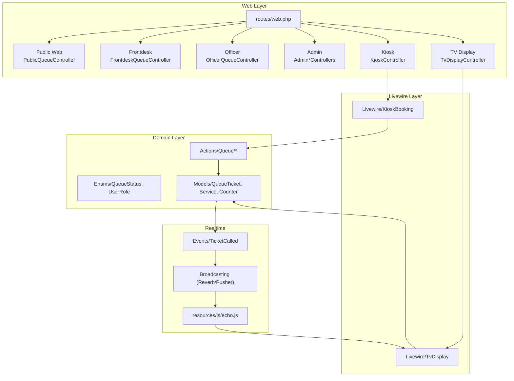
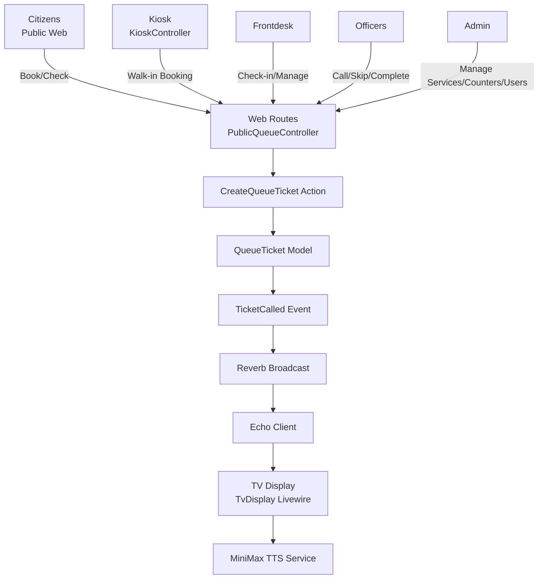
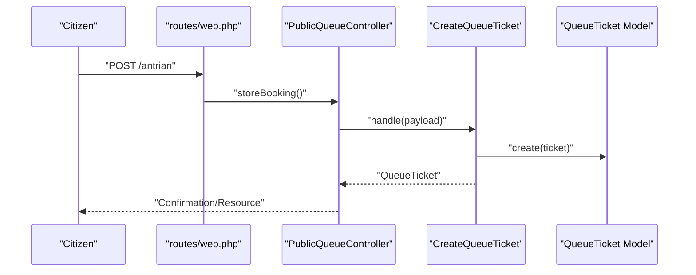
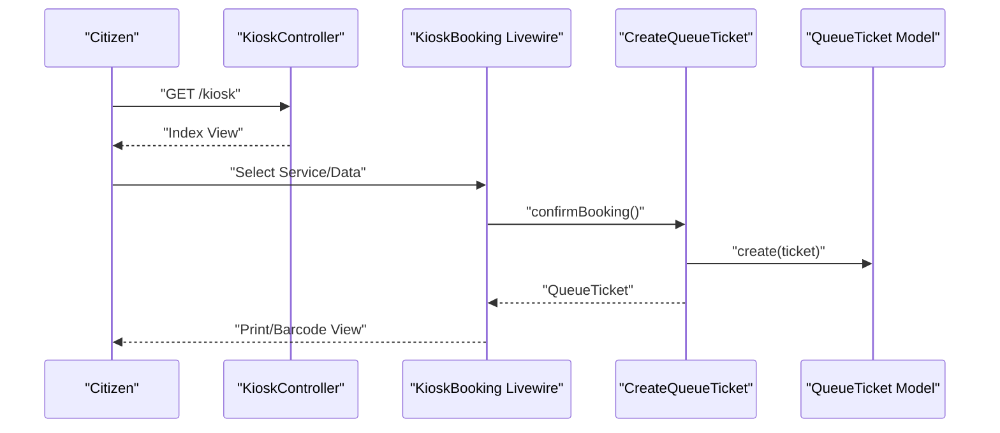
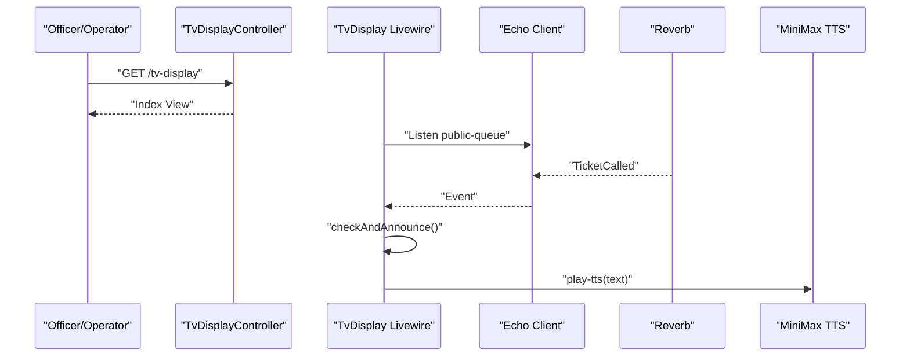
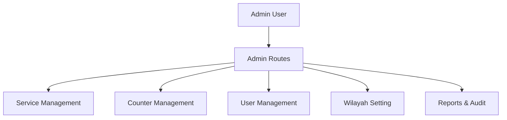
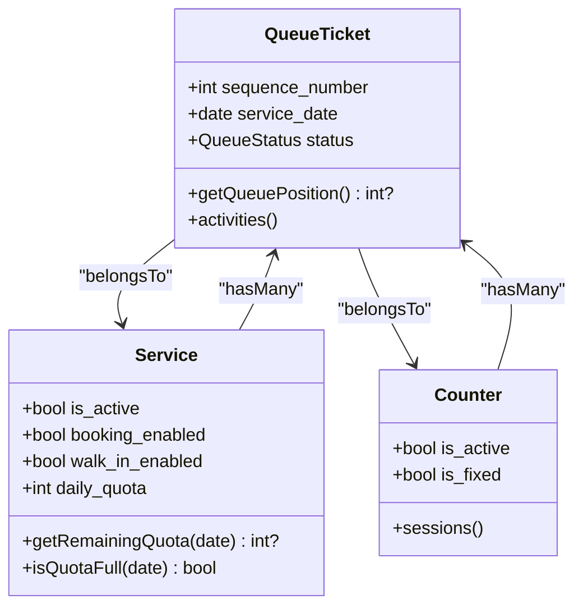
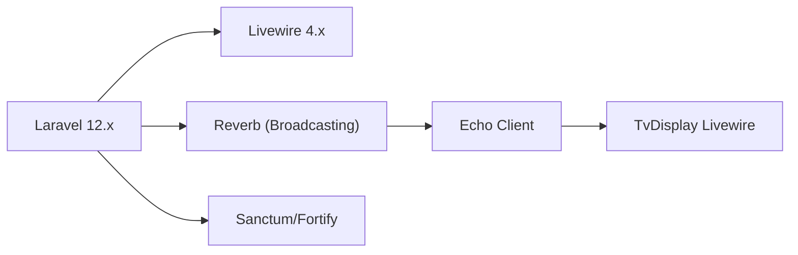

# Project Overview

<cite>
**Referenced Files in This Document**
- [composer.json](file://composer.json)
- [routes/web.php](file://routes/web.php)
- [config/app.php](file://config/app.php)
- [config/broadcasting.php](file://config/broadcasting.php)
- [config/reverb.php](file://config/reverb.php)
- [config/kiosk.php](file://config/kiosk.php)
- [resources/js/echo.js](file://resources/js/echo.js)
- [app/Events/TicketCalled.php](file://app/Events/TicketCalled.php)
- [app/Enums/UserRole.php](file://app/Enums/UserRole.php)
- [app/Enums/QueueStatus.php](file://app/Enums/QueueStatus.php)
- [app/Models/QueueTicket.php](file://app/Models/QueueTicket.php)
- [app/Models/Service.php](file://app/Models/Service.php)
- [app/Models/Counter.php](file://app/Models/Counter.php)
- [app/Actions/Queue/CreateQueueTicket.php](file://app/Actions/Queue/CreateQueueTicket.php)
- [app/Http/Controllers/KioskController.php](file://app/Http/Controllers/KioskController.php)
- [app/Http/Controllers/TvDisplayController.php](file://app/Http/Controllers/TvDisplayController.php)
- [app/Livewire/KioskBooking.php](file://app/Livewire/KioskBooking.php)
- [app/Livewire/TvDisplay.php](file://app/Livewire/TvDisplay.php)
</cite>

## Table of Contents
1. [Introduction](#introduction)
2. [Project Structure](#project-structure)
3. [Core Components](#core-components)
4. [Architecture Overview](#architecture-overview)
5. [Detailed Component Analysis](#detailed-component-analysis)
6. [Dependency Analysis](#dependency-analysis)
7. [Performance Considerations](#performance-considerations)
8. [Troubleshooting Guide](#troubleshooting-guide)
9. [Conclusion](#conclusion)

## Introduction
The PTSP Queue Management System is a government service queue management platform designed to streamline citizen appointments and service delivery across multiple touchpoints. It supports public online booking, assisted walk-ins via kiosks, front-desk quick registration, officer-led service counters, and real-time TV displays for transparency and announcements. Built with Laravel 12.x and Livewire 4.x, the system emphasizes responsive, real-time updates and modular, role-based access control to serve citizens, frontdesk staff, officers, and administrators efficiently.

## Project Structure
The system follows a layered MVC architecture with dedicated controllers, Livewire components, models, enums, and actions. Routes are organized by user roles and module-specific interfaces (public, kiosk, TV display). Real-time capabilities are powered by Laravel Reverb with Pusher-compatible configuration and client-side Echo integration.

**Diagram sources**
- [routes/web.php:1-127](file://routes/web.php#L1-L127)
- [app/Http/Controllers/KioskController.php:1-144](file://app/Http/Controllers/KioskController.php#L1-L144)
- [app/Http/Controllers/TvDisplayController.php:1-144](file://app/Http/Controllers/TvDisplayController.php#L1-L144)
- [app/Livewire/KioskBooking.php:1-288](file://app/Livewire/KioskBooking.php#L1-L288)
- [app/Livewire/TvDisplay.php:1-142](file://app/Livewire/TvDisplay.php#L1-L142)
- [app/Actions/Queue/CreateQueueTicket.php:1-91](file://app/Actions/Queue/CreateQueueTicket.php#L1-L91)
- [app/Models/QueueTicket.php:1-121](file://app/Models/QueueTicket.php#L1-L121)
- [app/Models/Service.php:1-101](file://app/Models/Service.php#L1-L101)
- [app/Models/Counter.php:1-53](file://app/Models/Counter.php#L1-L53)
- [app/Enums/QueueStatus.php:1-38](file://app/Enums/QueueStatus.php#L1-L38)
- [app/Enums/UserRole.php:1-32](file://app/Enums/UserRole.php#L1-L32)
- [app/Events/TicketCalled.php:1-34](file://app/Events/TicketCalled.php#L1-L34)
- [config/broadcasting.php:1-83](file://config/broadcasting.php#L1-L83)
- [config/reverb.php:1-103](file://config/reverb.php#L1-L103)
- [resources/js/echo.js:1-15](file://resources/js/echo.js#L1-L15)

**Section sources**
- [routes/web.php:1-127](file://routes/web.php#L1-L127)
- [composer.json:11-23](file://composer.json#L11-L23)
- [config/app.php:16-85](file://config/app.php#L16-L85)

## Core Components
- Technology Stack
  - Backend: Laravel 12.x, Livewire 4.x, Sanctum, Fortify, Reverb (Pusher-compatible), Pint (code quality), Pest (testing).
  - Frontend: Blade templates, Vite, TailwindCSS, client-side Echo for real-time.
  - Real-time: Broadcasting via Reverb with configurable TLS and rate limiting; client configured to use Reverb with Pusher transport.
- Multi-touchpoint Interfaces
  - Public web: Online booking and lookup.
  - Kiosk: Self-service booking and reprint flows.
  - TV display: Live queue monitor with TTS announcements.
  - Administrative dashboards: Service, counter, and user management.
- Role-based Access Control
  - Admin, Frontdesk, Officer, Monitor roles with middleware-driven route groups.
- Core Data Entities
  - QueueTicket: lifecycle tracking, position calculation, and status transitions.
  - Service: daily quotas, walk-in and booking enablement.
  - Counter: queue pool assignment and session management.
- Real-time Eventing
  - TicketCalled event broadcasts to a public-queue channel; TV display listens and triggers TTS.

**Section sources**
- [composer.json:11-23](file://composer.json#L11-L23)
- [config/broadcasting.php:31-47](file://config/broadcasting.php#L31-L47)
- [config/reverb.php:29-55](file://config/reverb.php#L29-L55)
- [resources/js/echo.js:6-14](file://resources/js/echo.js#L6-L14)
- [app/Events/TicketCalled.php:11-33](file://app/Events/TicketCalled.php#L11-L33)
- [app/Enums/UserRole.php:5-31](file://app/Enums/UserRole.php#L5-L31)
- [app/Enums/QueueStatus.php:5-37](file://app/Enums/QueueStatus.php#L5-L37)
- [app/Models/QueueTicket.php:12-121](file://app/Models/QueueTicket.php#L12-L121)
- [app/Models/Service.php:12-101](file://app/Models/Service.php#L12-L101)
- [app/Models/Counter.php:10-53](file://app/Models/Counter.php#L10-L53)

## Architecture Overview
The system integrates public web, kiosk, TV display, and administrative interfaces around a shared domain model and real-time broadcast layer. Public users book online or check status; kiosks assist walk-ins; front-desk and officers manage queues; administrators configure services and counters; TV displays reflect live calls with TTS.

**Diagram sources**
- [routes/web.php:18-124](file://routes/web.php#L18-L124)
- [app/Http/Controllers/KioskController.php:54-142](file://app/Http/Controllers/KioskController.php#L54-L142)
- [app/Http/Controllers/TvDisplayController.php:52-142](file://app/Http/Controllers/TvDisplayController.php#L52-L142)
- [app/Livewire/KioskBooking.php:25-287](file://app/Livewire/KioskBooking.php#L25-L287)
- [app/Livewire/TvDisplay.php:18-141](file://app/Livewire/TvDisplay.php#L18-L141)
- [app/Actions/Queue/CreateQueueTicket.php:34-89](file://app/Actions/Queue/CreateQueueTicket.php#L34-L89)
- [app/Models/QueueTicket.php:74-120](file://app/Models/QueueTicket.php#L74-L120)
- [app/Events/TicketCalled.php:18-32](file://app/Events/TicketCalled.php#L18-L32)
- [config/broadcasting.php:33-47](file://config/broadcasting.php#L33-L47)
- [config/reverb.php:74-98](file://config/reverb.php#L74-L98)
- [resources/js/echo.js:6-14](file://resources/js/echo.js#L6-L14)

## Detailed Component Analysis

### Public Web Booking and Lookup
- Purpose: Enable citizens to book appointments online and check queue status.
- Key flows:
  - Booking endpoint validates and throttles requests, creates a booked ticket via the CreateQueueTicket action, and returns a confirmation view/resource.
  - Lookup endpoint allows signed URL checks for ticket status.
- Throttling and security:
  - Routes apply throttle middleware to prevent abuse.
  - Authenticated dashboards route to role-aware views.

**Diagram sources**
- [routes/web.php:23-26](file://routes/web.php#L23-L26)
- [app/Actions/Queue/CreateQueueTicket.php:34-89](file://app/Actions/Queue/CreateQueueTicket.php#L34-L89)
- [app/Models/QueueTicket.php:74-120](file://app/Models/QueueTicket.php#L74-L120)

**Section sources**
- [routes/web.php:23-26](file://routes/web.php#L23-L26)
- [app/Actions/Queue/CreateQueueTicket.php:34-89](file://app/Actions/Queue/CreateQueueTicket.php#L34-L89)

### Kiosk Self-Service Booking and Reprint
- Purpose: Allow citizens to self-register for walk-in services at kiosks with guided steps and optional barcode printing.
- Key flows:
  - Login uses module password from configuration.
  - Service selection filters active services with walk-in enabled.
  - Visitor data validation and persistence via Livewire component.
  - Reprint mode finds existing tickets by identifier or phone.
- Barcode generation and persistence:
  - Inline SVG barcode produced for the ticket number after creation.

**Diagram sources**
- [app/Http/Controllers/KioskController.php:54-142](file://app/Http/Controllers/KioskController.php#L54-L142)
- [app/Livewire/KioskBooking.php:155-180](file://app/Livewire/KioskBooking.php#L155-L180)
- [app/Actions/Queue/CreateQueueTicket.php:34-89](file://app/Actions/Queue/CreateQueueTicket.php#L34-L89)
- [app/Models/QueueTicket.php:74-120](file://app/Models/QueueTicket.php#L74-L120)

**Section sources**
- [app/Http/Controllers/KioskController.php:20-57](file://app/Http/Controllers/KioskController.php#L20-L57)
- [app/Livewire/KioskBooking.php:25-287](file://app/Livewire/KioskBooking.php#L25-L287)
- [config/kiosk.php:3-7](file://config/kiosk.php#L3-L7)

### TV Display Monitor and TTS Announcements
- Purpose: Provide a real-time monitor for current and recent calls with optional video playback and audio announcements.
- Key flows:
  - Login uses module password from configuration.
  - Livewire component listens to the public-queue channel and triggers TTS on new calls.
  - Videos are cached and served from public storage.
- Real-time integration:
  - Echo client configured to Reverb with TLS and port settings.
  - On event reception, Livewire re-renders and dispatches play-tts.

**Diagram sources**
- [app/Http/Controllers/TvDisplayController.php:52-142](file://app/Http/Controllers/TvDisplayController.php#L52-L142)
- [app/Livewire/TvDisplay.php:22-68](file://app/Livewire/TvDisplay.php#L22-L68)
- [resources/js/echo.js:6-14](file://resources/js/echo.js#L6-L14)
- [app/Events/TicketCalled.php:27-32](file://app/Events/TicketCalled.php#L27-L32)

**Section sources**
- [app/Http/Controllers/TvDisplayController.php:18-55](file://app/Http/Controllers/TvDisplayController.php#L18-L55)
- [app/Livewire/TvDisplay.php:18-141](file://app/Livewire/TvDisplay.php#L18-L141)
- [config/broadcasting.php:33-47](file://config/broadcasting.php#L33-L47)
- [config/reverb.php:74-98](file://config/reverb.php#L74-L98)
- [resources/js/echo.js:6-14](file://resources/js/echo.js#L6-L14)

### Administrative Management
- Purpose: Configure services, counters, users, and geographic scopes; manage roles and permissions.
- Key flows:
  - Admin routes grouped by role with dedicated controllers for services, counters, users, and regions.
  - Redirects to appropriate tabs for roles and permissions management.

**Diagram sources**
- [routes/web.php:62-90](file://routes/web.php#L62-L90)

**Section sources**
- [routes/web.php:62-90](file://routes/web.php#L62-L90)

### Data Models and Status Lifecycle
- QueueTicket encapsulates the ticket lifecycle, including position calculation among waiting tickets and scoping helpers for quotas and cancellations.
- Service manages daily quotas and active listings.
- Counter ties tickets to physical or logical service points.

**Diagram sources**
- [app/Models/QueueTicket.php:12-121](file://app/Models/QueueTicket.php#L12-L121)
- [app/Models/Service.php:12-101](file://app/Models/Service.php#L12-L101)
- [app/Models/Counter.php:10-53](file://app/Models/Counter.php#L10-L53)

**Section sources**
- [app/Models/QueueTicket.php:79-112](file://app/Models/QueueTicket.php#L79-L112)
- [app/Models/Service.php:69-99](file://app/Models/Service.php#L69-L99)
- [app/Enums/QueueStatus.php:5-37](file://app/Enums/QueueStatus.php#L5-L37)

## Dependency Analysis
- External Dependencies
  - Laravel 12.x core, Livewire 4.x for reactive UI, Sanctum/Fortify for auth, Reverb for real-time, Pint for linting, Pest for testing.
- Real-time Dependencies
  - Broadcasting driver configured to Reverb with TLS and rate limiting; client configured to use Reverb with Pusher-compatible transport.
- Routing and Middleware
  - Role-based route groups enforce access control; module passwords protect kiosk and TV display logins.

**Diagram sources**
- [composer.json:11-23](file://composer.json#L11-L23)
- [config/broadcasting.php:33-47](file://config/broadcasting.php#L33-L47)
- [config/reverb.php:74-98](file://config/reverb.php#L74-L98)
- [resources/js/echo.js:6-14](file://resources/js/echo.js#L6-L14)

**Section sources**
- [composer.json:11-23](file://composer.json#L11-L23)
- [config/broadcasting.php:18-18](file://config/broadcasting.php#L18-L18)
- [config/reverb.php:16-16](file://config/reverb.php#L16-L16)

## Performance Considerations
- Real-time scaling
  - Reverb supports Redis-backed scaling; enable and tune scaling options for horizontal growth.
  - Rate limiting and ping/activity timeouts help manage client load.
- Database queries
  - Use scoped queries for daily quotas and remaining capacity to avoid N+1.
  - Cache TV display videos to reduce repeated filesystem reads.
- Frontend responsiveness
  - Livewire components persist computed state to reduce reload overhead.
  - Echo transport prioritizes WS/WSS for low-latency updates.

[No sources needed since this section provides general guidance]

## Troubleshooting Guide
- Real-time not updating on TV display
  - Verify broadcasting driver and Reverb app keys; ensure client Echo configuration matches server settings.
  - Confirm the TicketCalled event is dispatched and the public-queue channel is subscribed.
- Kiosk login failures
  - Check module password configuration and hashing; ensure session lifetime is sufficient.
- TV display API returns empty data
  - Validate storage disk and video file extensions; confirm caching TTL and filesystem accessibility.
- Role-based access denied
  - Ensure user roles are correctly assigned and middleware route groups are applied.

**Section sources**
- [config/broadcasting.php:18-18](file://config/broadcasting.php#L18-L18)
- [config/reverb.php:74-98](file://config/reverb.php#L74-L98)
- [resources/js/echo.js:6-14](file://resources/js/echo.js#L6-L14)
- [config/kiosk.php:3-7](file://config/kiosk.php#L3-L7)
- [app/Http/Controllers/TvDisplayController.php:89-142](file://app/Http/Controllers/TvDisplayController.php#L89-L142)
- [routes/web.php:28-90](file://routes/web.php#L28-L90)

## Conclusion
The PTSP Queue Management System delivers a cohesive, real-time queue solution across public, kiosk, TV display, and administrative interfaces. Its Laravel 12.x and Livewire 4.x foundation, combined with Reverb-powered real-time updates, enables scalable, transparent service delivery. Role-based routing, robust data models, and modular controllers support efficient operations for citizens, frontdesk staff, officers, and administrators.