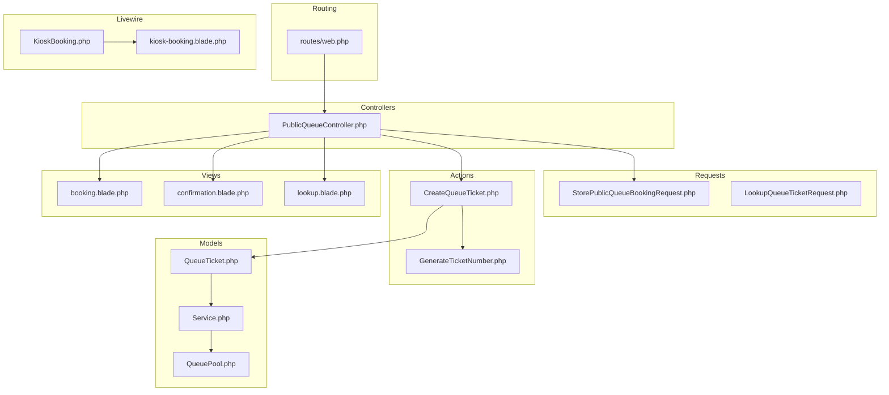
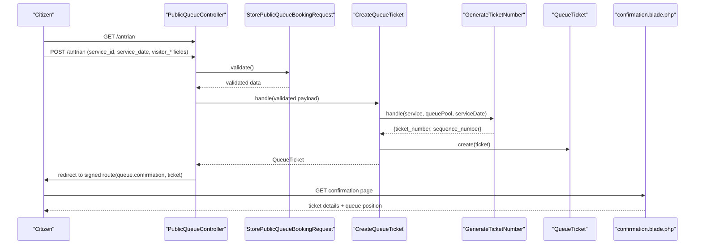
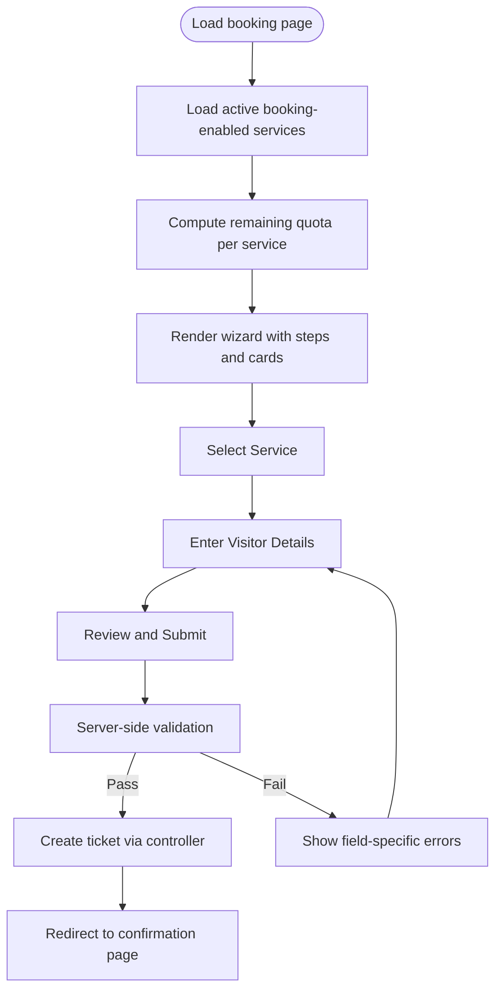
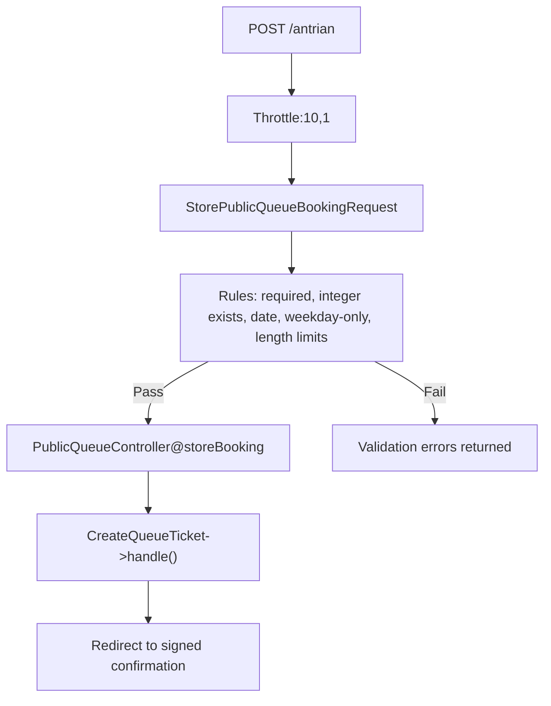
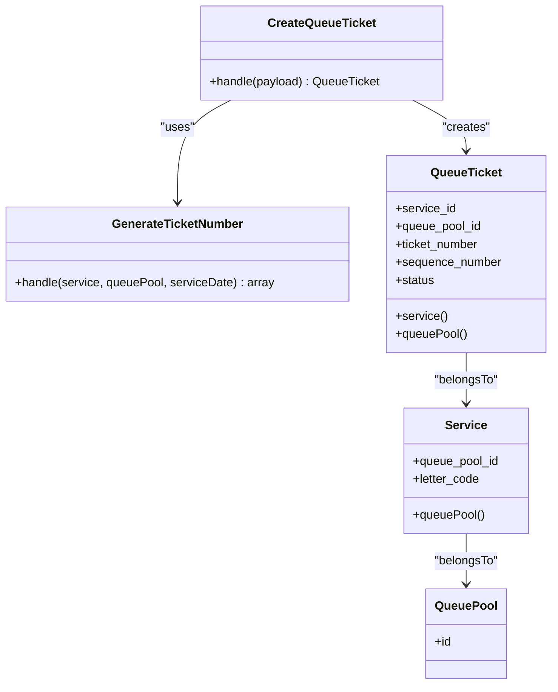
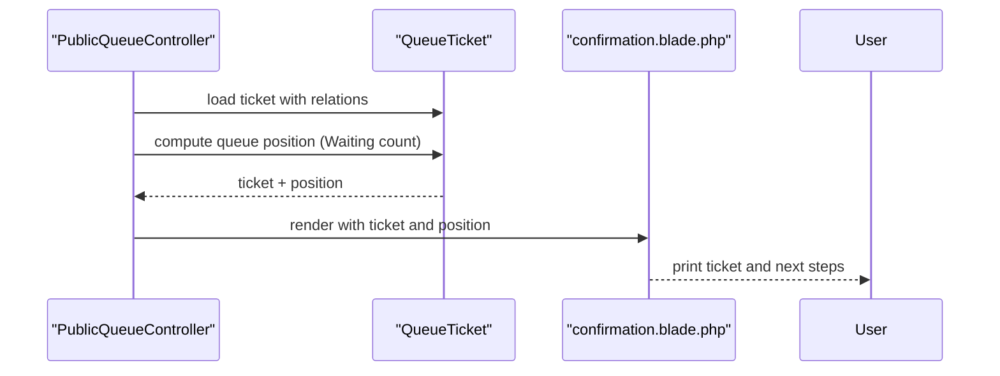
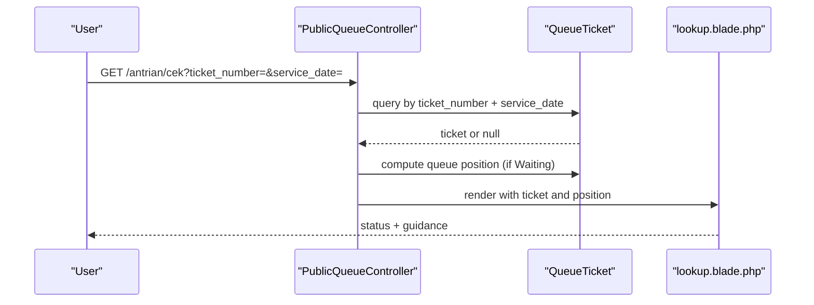
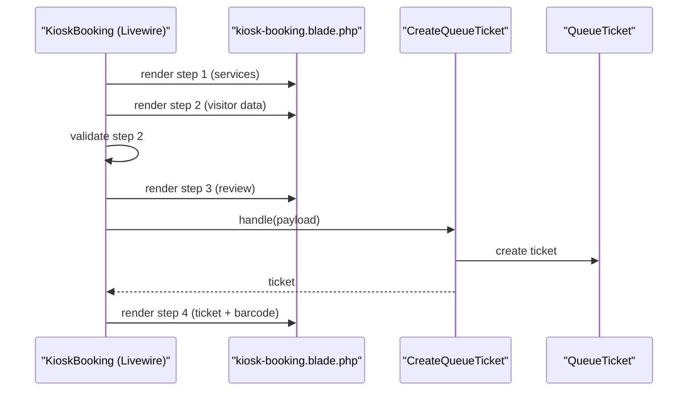
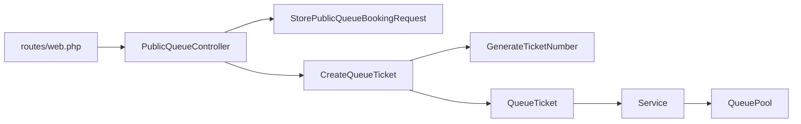

# Booking Workflow

<cite>
**Referenced Files in This Document**
- [PublicQueueController.php](file://app/Http/Controllers/PublicQueueController.php)
- [StorePublicQueueBookingRequest.php](file://app/Http/Requests/StorePublicQueueBookingRequest.php)
- [LookupQueueTicketRequest.php](file://app/Http/Requests/LookupQueueTicketRequest.php)
- [CreateQueueTicket.php](file://app/Actions/Queue/CreateQueueTicket.php)
- [GenerateTicketNumber.php](file://app/Actions/Queue/GenerateTicketNumber.php)
- [Service.php](file://app/Models/Service.php)
- [QueueTicket.php](file://app/Models/QueueTicket.php)
- [QueuePool.php](file://app/Models/QueuePool.php)
- [WeekdayOnly.php](file://app/Rules/WeekdayOnly.php)
- [web.php](file://routes/web.php)
- [booking.blade.php](file://resources/views/pages/public/antrian/booking.blade.php)
- [confirmation.blade.php](file://resources/views/pages/public/antrian/confirmation.blade.php)
- [lookup.blade.php](file://resources/views/pages/public/antrian/lookup.blade.php)
- [KioskBooking.php](file://app/Livewire/KioskBooking.php)
- [kiosk-booking.blade.php](file://resources/views/livewire/kiosk-booking.blade.php)
</cite>

## Table of Contents
1. [Introduction](#introduction)
2. [Project Structure](#project-structure)
3. [Core Components](#core-components)
4. [Architecture Overview](#architecture-overview)
5. [Detailed Component Analysis](#detailed-component-analysis)
6. [Dependency Analysis](#dependency-analysis)
7. [Performance Considerations](#performance-considerations)
8. [Troubleshooting Guide](#troubleshooting-guide)
9. [Conclusion](#conclusion)
10. [Appendices](#appendices)

## Introduction
This document describes the Public Booking Workflow system for citizens to book appointments online. It covers the service selection interface, visitor information collection, date validation rules, confirmation flow, controller actions, validation middleware, and the ticket creation pipeline. It also explains how services relate to availability and queue pool assignment, how queue positions are computed, and how the confirmation page presents ticket details and next steps. Accessibility, mobile responsiveness, and UX optimization are addressed alongside the backend mechanics.

## Project Structure
The booking workflow spans controllers, requests, actions, models, Blade views, Livewire components, and routing. The public-facing booking flow is primarily handled by the PublicQueueController and associated views, while the kiosk self-service flow is implemented via a Livewire component.

**Diagram sources**
- [web.php:18-26](file://routes/web.php#L18-L26)
- [PublicQueueController.php:16-109](file://app/Http/Controllers/PublicQueueController.php#L16-L109)
- [StorePublicQueueBookingRequest.php:7-45](file://app/Http/Requests/StorePublicQueueBookingRequest.php#L7-L45)
- [CreateQueueTicket.php:13-91](file://app/Actions/Queue/CreateQueueTicket.php#L13-L91)
- [GenerateTicketNumber.php:10-31](file://app/Actions/Queue/GenerateTicketNumber.php#L10-L31)
- [Service.php:12-101](file://app/Models/Service.php#L12-L101)
- [QueueTicket.php:12-121](file://app/Models/QueueTicket.php#L12-L121)
- [QueuePool.php:9-43](file://app/Models/QueuePool.php#L9-L43)
- [booking.blade.php:1-541](file://resources/views/pages/public/antrian/booking.blade.php#L1-L541)
- [confirmation.blade.php:1-146](file://resources/views/pages/public/antrian/confirmation.blade.php#L1-L146)
- [lookup.blade.php:1-169](file://resources/views/pages/public/antrian/lookup.blade.php#L1-L169)
- [KioskBooking.php:25-288](file://app/Livewire/KioskBooking.php#L25-288)
- [kiosk-booking.blade.php:1-588](file://resources/views/livewire/kiosk-booking.blade.php#L1-L588)

**Section sources**
- [web.php:18-26](file://routes/web.php#L18-L26)
- [PublicQueueController.php:16-109](file://app/Http/Controllers/PublicQueueController.php#L16-L109)
- [booking.blade.php:1-541](file://resources/views/pages/public/antrian/booking.blade.php#L1-L541)

## Core Components
- PublicQueueController: Handles index, booking page, submission, lookup, and confirmation.
- StorePublicQueueBookingRequest: Validates booking inputs and enforces weekday-only policy.
- CreateQueueTicket: Orchestrates transactional creation, assigns status, and logs activity.
- GenerateTicketNumber: Computes sequence number and formatted ticket number per queue pool and service.
- Service and QueuePool: Define service availability and pool assignment.
- QueueTicket: Stores booking records, status, and queue position computation.
- Views: Blade templates for booking wizard, confirmation, and lookup.
- Livewire KioskBooking: Self-service kiosk flow with multi-step wizard, validation, and printing.

**Section sources**
- [PublicQueueController.php:16-109](file://app/Http/Controllers/PublicQueueController.php#L16-L109)
- [StorePublicQueueBookingRequest.php:22-44](file://app/Http/Requests/StorePublicQueueBookingRequest.php#L22-L44)
- [CreateQueueTicket.php:34-89](file://app/Actions/Queue/CreateQueueTicket.php#L34-L89)
- [GenerateTicketNumber.php:15-29](file://app/Actions/Queue/GenerateTicketNumber.php#L15-L29)
- [Service.php:43-101](file://app/Models/Service.php#L43-L101)
- [QueueTicket.php:54-121](file://app/Models/QueueTicket.php#L54-L121)
- [booking.blade.php:1-541](file://resources/views/pages/public/antrian/booking.blade.php#L1-L541)
- [confirmation.blade.php:1-146](file://resources/views/pages/public/antrian/confirmation.blade.php#L1-L146)
- [lookup.blade.php:1-169](file://resources/views/pages/public/antrian/lookup.blade.php#L1-L169)
- [KioskBooking.php:25-288](file://app/Livewire/KioskBooking.php#L25-288)

## Architecture Overview
The public booking flow is a client-server interaction:
- Client loads the booking page and selects a service.
- On review, the client submits a form validated server-side.
- The controller delegates creation to CreateQueueTicket, which generates a ticket number and persists the record.
- The user is redirected to a signed confirmation route displaying the ticket and queue position.
- A separate lookup page allows checking ticket status and position.

**Diagram sources**
- [web.php:23-26](file://routes/web.php#L23-L26)
- [PublicQueueController.php:39-56](file://app/Http/Controllers/PublicQueueController.php#L39-L56)
- [StorePublicQueueBookingRequest.php:22-33](file://app/Http/Requests/StorePublicQueueBookingRequest.php#L22-L33)
- [CreateQueueTicket.php:34-89](file://app/Actions/Queue/CreateQueueTicket.php#L34-L89)
- [GenerateTicketNumber.php:15-29](file://app/Actions/Queue/GenerateTicketNumber.php#L15-L29)
- [QueueTicket.php:17-38](file://app/Models/QueueTicket.php#L17-L38)
- [confirmation.blade.php:1-146](file://resources/views/pages/public/antrian/confirmation.blade.php#L1-L146)

## Detailed Component Analysis

### Public Booking Page (Service Selection and Wizard)
- Purpose: Allow citizens to choose a service, enter visitor details, and confirm booking.
- Features:
  - Service cards with daily quota and remaining quota display.
  - Multi-step wizard with Alpine-driven UI state.
  - Date picker constrained to weekdays and future dates up to a limit.
  - Real-time validation feedback and step navigation.
- Availability logic:
  - Services are filtered by active and booking-enabled flags.
  - Remaining quota is computed per service and per day.
- Mobile and accessibility:
  - Responsive grid and card layout.
  - Keyboard-accessible controls and focus management.
  - Large text mode toggle in kiosk variant.

**Diagram sources**
- [booking.blade.php:14-541](file://resources/views/pages/public/antrian/booking.blade.php#L14-L541)
- [Service.php:62-101](file://app/Models/Service.php#L62-L101)
- [PublicQueueController.php:27-37](file://app/Http/Controllers/PublicQueueController.php#L27-L37)

**Section sources**
- [booking.blade.php:1-541](file://resources/views/pages/public/antrian/booking.blade.php#L1-L541)
- [Service.php:62-101](file://app/Models/Service.php#L62-L101)
- [PublicQueueController.php:27-37](file://app/Http/Controllers/PublicQueueController.php#L27-L37)

### Validation and Middleware
- Form Request: Enforces required fields, length limits, allowed values, and weekday-only constraint.
- Middleware:
  - Throttling on booking submission and lookup.
  - Signed route middleware for confirmation links.

**Diagram sources**
- [web.php:24-26](file://routes/web.php#L24-L26)
- [StorePublicQueueBookingRequest.php:22-44](file://app/Http/Requests/StorePublicQueueBookingRequest.php#L22-L44)
- [WeekdayOnly.php:9-33](file://app/Rules/WeekdayOnly.php#L9-L33)
- [PublicQueueController.php:39-56](file://app/Http/Controllers/PublicQueueController.php#L39-L56)

**Section sources**
- [web.php:24-26](file://routes/web.php#L24-L26)
- [StorePublicQueueBookingRequest.php:22-44](file://app/Http/Requests/StorePublicQueueBookingRequest.php#L22-L44)
- [WeekdayOnly.php:9-33](file://app/Rules/WeekdayOnly.php#L9-L33)
- [PublicQueueController.php:39-56](file://app/Http/Controllers/PublicQueueController.php#L39-L56)

### Ticket Creation Pipeline
- Channel determines initial status:
  - Online booking → Booked.
  - Kiosk/Walk-in same-day → Waiting.
- Transaction ensures atomicity:
  - Generate ticket number (sequence + letter code).
  - Persist ticket with pool and service associations.
  - Log activity with metadata.

**Diagram sources**
- [CreateQueueTicket.php:34-89](file://app/Actions/Queue/CreateQueueTicket.php#L34-L89)
- [GenerateTicketNumber.php:15-29](file://app/Actions/Queue/GenerateTicketNumber.php#L15-L29)
- [QueueTicket.php:17-52](file://app/Models/QueueTicket.php#L17-L52)
- [Service.php:17-46](file://app/Models/Service.php#L17-L46)
- [QueuePool.php:14-31](file://app/Models/QueuePool.php#L14-L31)

**Section sources**
- [CreateQueueTicket.php:34-89](file://app/Actions/Queue/CreateQueueTicket.php#L34-L89)
- [GenerateTicketNumber.php:15-29](file://app/Actions/Queue/GenerateTicketNumber.php#L15-L29)
- [QueueTicket.php:17-52](file://app/Models/QueueTicket.php#L17-L52)
- [Service.php:17-46](file://app/Models/Service.php#L17-L46)
- [QueuePool.php:14-31](file://app/Models/QueuePool.php#L14-L31)

### Booking Confirmation and Next Steps
- The confirmation page displays:
  - Ticket number and service/date.
  - Visitor name.
  - Optional queue position when applicable.
  - Print-friendly styles and a print button.
  - Links to check status and return home.
- Queue position calculation:
  - Count Waiting tickets with lower sequence number in the same pool and date.

**Diagram sources**
- [PublicQueueController.php:87-108](file://app/Http/Controllers/PublicQueueController.php#L87-L108)
- [QueueTicket.php:82-94](file://app/Models/QueueTicket.php#L82-L94)
- [confirmation.blade.php:68-126](file://resources/views/pages/public/antrian/confirmation.blade.php#L68-L126)

**Section sources**
- [PublicQueueController.php:87-108](file://app/Http/Controllers/PublicQueueController.php#L87-L108)
- [QueueTicket.php:82-94](file://app/Models/QueueTicket.php#L82-L94)
- [confirmation.blade.php:1-146](file://resources/views/pages/public/antrian/confirmation.blade.php#L1-L146)

### Lookup and Status Checks
- Lookup page accepts ticket number and service date.
- Finds the ticket with related service, pool, and optional counter.
- Computes queue position for Waiting tickets.
- Presents status-specific guidance.

**Diagram sources**
- [web.php:25](file://routes/web.php#L25)
- [PublicQueueController.php:58-85](file://app/Http/Controllers/PublicQueueController.php#L58-L85)
- [LookupQueueTicketRequest.php:22-28](file://app/Http/Requests/LookupQueueTicketRequest.php#L22-L28)
- [lookup.blade.php:36-165](file://resources/views/pages/public/antrian/lookup.blade.php#L36-L165)

**Section sources**
- [web.php:25](file://routes/web.php#L25)
- [PublicQueueController.php:58-85](file://app/Http/Controllers/PublicQueueController.php#L58-L85)
- [LookupQueueTicketRequest.php:22-28](file://app/Http/Requests/LookupQueueTicketRequest.php#L22-L28)
- [lookup.blade.php:1-169](file://resources/views/pages/public/antrian/lookup.blade.php#L1-L169)

### Kiosk Self-Service Flow (Livewire)
- Multi-step wizard:
  - Step 1: Select service (walk-in enabled).
  - Step 2: Enter visitor data (name, identifier, phone, wilayah).
  - Step 3: Review and confirm.
  - Step 4: Print ticket and display barcode.
- Validation:
  - Required fields with length constraints.
  - Wilayah code validated against configured scope.
- Printing:
  - Generates inline SVG barcode.
  - Dispatches print event to thermal printer integration.

**Diagram sources**
- [KioskBooking.php:25-288](file://app/Livewire/KioskBooking.php#L25-288)
- [kiosk-booking.blade.php:1-588](file://resources/views/livewire/kiosk-booking.blade.php#L1-L588)
- [CreateQueueTicket.php:34-89](file://app/Actions/Queue/CreateQueueTicket.php#L34-L89)
- [QueueTicket.php:17-38](file://app/Models/QueueTicket.php#L17-L38)

**Section sources**
- [KioskBooking.php:25-288](file://app/Livewire/KioskBooking.php#L25-288)
- [kiosk-booking.blade.php:1-588](file://resources/views/livewire/kiosk-booking.blade.php#L1-L588)
- [CreateQueueTicket.php:34-89](file://app/Actions/Queue/CreateQueueTicket.php#L34-L89)
- [QueueTicket.php:17-38](file://app/Models/QueueTicket.php#L17-L38)

## Dependency Analysis
- Controllers depend on:
  - Requests for validation.
  - Actions for business logic.
  - Models for persistence and calculations.
- Views depend on:
  - Controller-provided data and route helpers.
  - Client-side scripts for wizard behavior.
- Routes define:
  - Throttling and signed route policies.
  - Public endpoints for booking, confirmation, and lookup.

**Diagram sources**
- [web.php:23-26](file://routes/web.php#L23-L26)
- [PublicQueueController.php:39-56](file://app/Http/Controllers/PublicQueueController.php#L39-L56)
- [CreateQueueTicket.php:34-89](file://app/Actions/Queue/CreateQueueTicket.php#L34-L89)
- [GenerateTicketNumber.php:15-29](file://app/Actions/Queue/GenerateTicketNumber.php#L15-L29)
- [QueueTicket.php:54-67](file://app/Models/QueueTicket.php#L54-L67)
- [Service.php:43-51](file://app/Models/Service.php#L43-L51)
- [QueuePool.php:28-41](file://app/Models/QueuePool.php#L28-L41)

**Section sources**
- [web.php:23-26](file://routes/web.php#L23-L26)
- [PublicQueueController.php:39-56](file://app/Http/Controllers/PublicQueueController.php#L39-L56)
- [CreateQueueTicket.php:34-89](file://app/Actions/Queue/CreateQueueTicket.php#L34-L89)
- [QueueTicket.php:54-67](file://app/Models/QueueTicket.php#L54-L67)
- [Service.php:43-51](file://app/Models/Service.php#L43-L51)
- [QueuePool.php:28-41](file://app/Models/QueuePool.php#L28-L41)

## Performance Considerations
- Database queries:
  - Use indexed columns for service_date, queue_pool_id, and status for efficient waiting position counting.
  - Prefer eager loading of relationships in confirmation and lookup to avoid N+1 queries.
- Transactions:
  - Ticket creation is wrapped in a transaction to prevent inconsistent states.
- Caching:
  - Consider caching daily quota computations for frequently accessed services.
- Rendering:
  - Minimize heavy client-side computations in the booking wizard; leverage server-side precomputation where possible.

[No sources needed since this section provides general guidance]

## Troubleshooting Guide
- Validation failures:
  - Ensure service_date falls on a weekday and is within allowed range.
  - Verify required fields and length constraints for visitor information.
- Quota exceeded:
  - Daily quota is enforced per service and date; remaining quota is displayed on the booking page.
- Ticket not found:
  - Use the lookup page with correct ticket number and service date.
- Confirmation link expired:
  - Signed route requires a valid signature; regenerate confirmation after resubmission if needed.
- Kiosk printing:
  - Confirm thermal printer configuration and dispatch events; fallback to manual print if needed.

**Section sources**
- [StorePublicQueueBookingRequest.php:22-44](file://app/Http/Requests/StorePublicQueueBookingRequest.php#L22-L44)
- [WeekdayOnly.php:16-31](file://app/Rules/WeekdayOnly.php#L16-L31)
- [booking.blade.php:16-36](file://resources/views/pages/public/antrian/booking.blade.php#L16-L36)
- [lookup.blade.php:134-149](file://resources/views/pages/public/antrian/lookup.blade.php#L134-L149)
- [web.php:26](file://routes/web.php#L26)
- [kiosk-booking.blade.php:98-112](file://resources/views/livewire/kiosk-booking.blade.php#L98-L112)

## Conclusion
The Public Booking Workflow integrates a responsive frontend, robust validation, and a reliable ticket creation pipeline. It supports both online booking and kiosk self-service, with clear status updates and queue position awareness. The system’s design emphasizes correctness (weekday-only, quota checks), user experience (wizard, print-friendly confirmation), and operational safety (transactions, throttling, signed routes).

[No sources needed since this section summarizes without analyzing specific files]

## Appendices

### Accessibility and Mobile Responsiveness Checklist
- Keyboard navigation and focus indicators across wizard steps.
- Sufficient color contrast and readable typography.
- Touch-friendly targets and large text mode in kiosk.
- Screen reader-friendly labels and ARIA attributes where appropriate.
- Responsive grid layouts and adaptive spacing.

[No sources needed since this section provides general guidance]