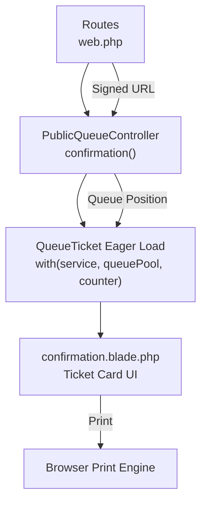
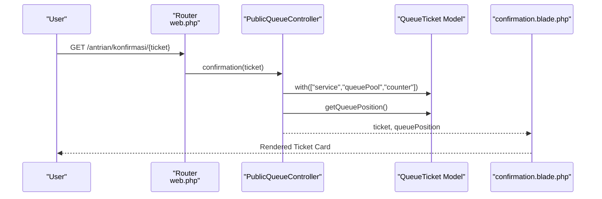
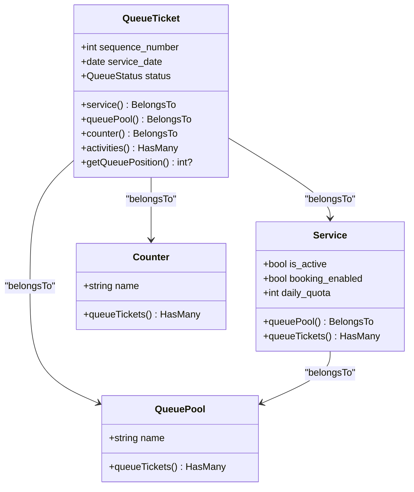
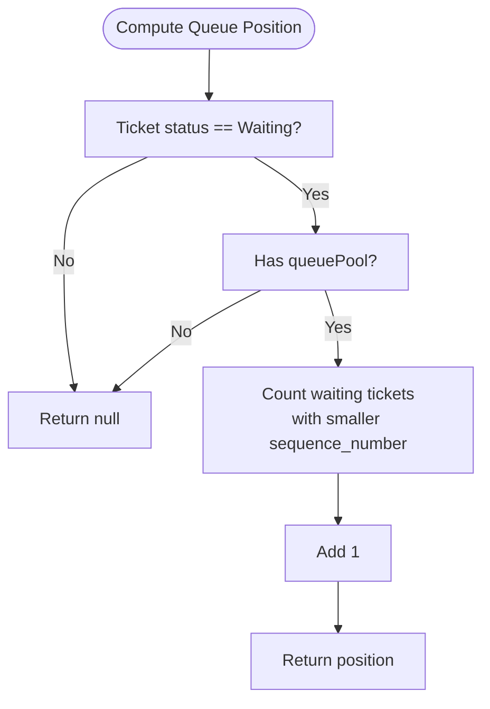
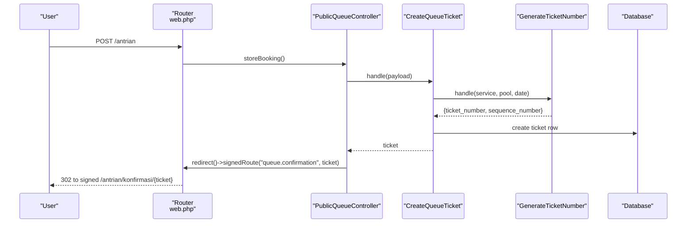
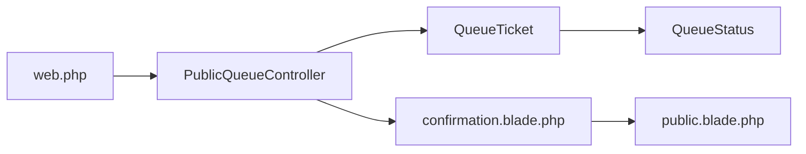

# Confirmation Page

<cite>
**Referenced Files in This Document**
- [PublicQueueController.php](file://app/Http/Controllers/PublicQueueController.php)
- [confirmation.blade.php](file://resources/views/pages/public/antrian/confirmation.blade.php)
- [web.php](file://routes/web.php)
- [QueueTicket.php](file://app/Models/QueueTicket.php)
- [Service.php](file://app/Models/Service.php)
- [Counter.php](file://app/Models/Counter.php)
- [QueuePool.php](file://app/Models/QueuePool.php)
- [CreateQueueTicket.php](file://app/Actions/Queue/CreateQueueTicket.php)
- [GenerateTicketNumber.php](file://app/Actions/Queue/GenerateTicketNumber.php)
- [StorePublicQueueBookingRequest.php](file://app/Http/Requests/StorePublicQueueBookingRequest.php)
- [QueueStatus.php](file://app/Enums/QueueStatus.php)
- [PublicQueueTicketResource.php](file://app/Http/Resources/PublicQueueTicketResource.php)
- [public.blade.php](file://resources/views/layouts/public.blade.php)
</cite>

## Table of Contents
1. [Introduction](#introduction)
2. [Project Structure](#project-structure)
3. [Core Components](#core-components)
4. [Architecture Overview](#architecture-overview)
5. [Detailed Component Analysis](#detailed-component-analysis)
6. [Dependency Analysis](#dependency-analysis)
7. [Performance Considerations](#performance-considerations)
8. [Troubleshooting Guide](#troubleshooting-guide)
9. [Conclusion](#conclusion)

## Introduction
This document describes the Public Booking Confirmation Page implementation. It explains how the system generates a booking confirmation, displays ticket details and service information, computes queue position, and secures access to the confirmation page. It also documents the user interface design for printing and sharing, and outlines security measures to protect ticket information.

## Project Structure
The confirmation flow spans routing, controller actions, Eloquent models, Blade templates, and request validation. The key elements are:
- Routes define the confirmation endpoint and apply signed URL middleware.
- The controller loads the ticket with relationships and calculates queue position.
- Blade renders the printable ticket card with service and visitor details.
- Request validation ensures required fields and constraints.
- Models encapsulate relationships and helper methods for queue position and quotas.

**Diagram sources**
- [web.php:26](file://routes/web.php#L26)
- [PublicQueueController.php:87-108](file://app/Http/Controllers/PublicQueueController.php#L87-L108)
- [QueueTicket.php:54-77](file://app/Models/QueueTicket.php#L54-L77)
- [confirmation.blade.php:50-126](file://resources/views/pages/public/antrian/confirmation.blade.php#L50-L126)

**Section sources**
- [web.php:26](file://routes/web.php#L26)
- [PublicQueueController.php:87-108](file://app/Http/Controllers/PublicQueueController.php#L87-L108)
- [confirmation.blade.php:50-126](file://resources/views/pages/public/antrian/confirmation.blade.php#L50-L126)

## Core Components
- PublicQueueController: Handles the confirmation route, eager-loads ticket relationships, and computes queue position.
- QueueTicket model: Defines relationships and a method to compute queue position.
- Service model: Provides service metadata and quota helpers used indirectly by the UI.
- CreateQueueTicket action: Creates tickets with validated payload and logs activity.
- GenerateTicketNumber action: Generates sequence number and formatted ticket number.
- StorePublicQueueBookingRequest: Validates booking form inputs.
- QueueStatus enum: Provides status labels and colors used in the UI.
- PublicQueueTicketResource: Prepares masked visitor name and queue position for JSON responses.
- confirmation.blade.php: Renders the printable ticket card and actions.

**Section sources**
- [PublicQueueController.php:87-108](file://app/Http/Controllers/PublicQueueController.php#L87-L108)
- [QueueTicket.php:54-94](file://app/Models/QueueTicket.php#L54-L94)
- [Service.php:43-57](file://app/Models/Service.php#L43-L57)
- [CreateQueueTicket.php:34-89](file://app/Actions/Queue/CreateQueueTicket.php#L34-L89)
- [GenerateTicketNumber.php:15-29](file://app/Actions/Queue/GenerateTicketNumber.php#L15-L29)
- [StorePublicQueueBookingRequest.php:22-44](file://app/Http/Requests/StorePublicQueueBookingRequest.php#L22-L44)
- [QueueStatus.php:14-36](file://app/Enums/QueueStatus.php#L14-L36)
- [PublicQueueTicketResource.php:28-36](file://app/Http/Resources/PublicQueueTicketResource.php#L28-L36)
- [confirmation.blade.php:50-126](file://resources/views/pages/public/antrian/confirmation.blade.php#L50-L126)

## Architecture Overview
The confirmation page follows a straightforward MVC flow:
- A signed URL routes to the controller action.
- The controller reloads the ticket with relationships and calculates queue position.
- The view renders the ticket card, including service info, appointment date, visitor name, and queue position.
- The UI supports printing and navigation links.

**Diagram sources**
- [web.php:26](file://routes/web.php#L26)
- [PublicQueueController.php:87-108](file://app/Http/Controllers/PublicQueueController.php#L87-L108)
- [QueueTicket.php:82-94](file://app/Models/QueueTicket.php#L82-L94)
- [confirmation.blade.php:50-126](file://resources/views/pages/public/antrian/confirmation.blade.php#L50-L126)

## Detailed Component Analysis

### Confirmation Route and Access Control
- The confirmation route is defined with signed URL middleware to prevent open access.
- The controller action accepts a bound QueueTicket model and reloads it with relationships to ensure all attributes are present.

**Section sources**
- [web.php:26](file://routes/web.php#L26)
- [PublicQueueController.php:87-92](file://app/Http/Controllers/PublicQueueController.php#L87-L92)

### Data Loading and Relationship Hydration
- The controller eagerly loads service, queuePool, and counter relationships to avoid N+1 queries.
- The model’s getQueuePosition method computes the position among waiting tickets in the same pool and day.

**Diagram sources**
- [QueueTicket.php:54-94](file://app/Models/QueueTicket.php#L54-L94)
- [Service.php:43-57](file://app/Models/Service.php#L43-L57)
- [QueuePool.php:28-41](file://app/Models/QueuePool.php#L28-L41)
- [Counter.php:38-41](file://app/Models/Counter.php#L38-L41)

**Section sources**
- [PublicQueueController.php:89-92](file://app/Http/Controllers/PublicQueueController.php#L89-L92)
- [QueueTicket.php:82-94](file://app/Models/QueueTicket.php#L82-L94)

### Queue Position Calculation Algorithm
- Queue position is computed only for tickets with status Waiting and existing queuePool.
- The algorithm counts waiting tickets with smaller sequence_number on the same service_date and pool, then adds 1.

**Diagram sources**
- [PublicQueueController.php:95-101](file://app/Http/Controllers/PublicQueueController.php#L95-L101)
- [QueueTicket.php:82-94](file://app/Models/QueueTicket.php#L82-L94)

**Section sources**
- [PublicQueueController.php:95-101](file://app/Http/Controllers/PublicQueueController.php#L95-L101)
- [QueueTicket.php:82-94](file://app/Models/QueueTicket.php#L82-L94)

### Estimated Wait Time Estimation
- The current implementation does not compute estimated wait time directly.
- The UI conditionally shows queue position when available, but no wait duration is calculated or displayed.

**Section sources**
- [confirmation.blade.php:90-101](file://resources/views/pages/public/antrian/confirmation.blade.php#L90-L101)
- [PublicQueueController.php:94-102](file://app/Http/Controllers/PublicQueueController.php#L94-L102)

### Reminder Notifications
- No reminder notification mechanism is implemented in the confirmation flow.
- The UI provides navigation to status lookup and home.

**Section sources**
- [confirmation.blade.php:135-143](file://resources/views/pages/public/antrian/confirmation.blade.php#L135-L143)

### Ticket Information Displayed to Users
- Ticket number and status badge.
- Service name and appointment date.
- Visitor name (masked for privacy).
- Optional queue position block.
- Instructions and footer metadata.

**Section sources**
- [confirmation.blade.php:50-126](file://resources/views/pages/public/antrian/confirmation.blade.php#L50-L126)
- [PublicQueueTicketResource.php:28-36](file://app/Http/Resources/PublicQueueTicketResource.php#L28-L36)

### User Interface Design for Ticket Display, Print, and Sharing
- The ticket card is designed for printing with print-specific styles that hide non-essential UI elements.
- Print button triggers the browser print dialog.
- Navigation buttons allow checking status and returning home.

**Section sources**
- [confirmation.blade.php:6-39](file://resources/views/pages/public/antrian/confirmation.blade.php#L6-L39)
- [confirmation.blade.php:129-143](file://resources/views/pages/public/antrian/confirmation.blade.php#L129-L143)

### Security Measures for Secure Ticket Access
- Signed URL middleware on the confirmation route prevents open access to arbitrary ticket IDs.
- The controller reloads the ticket with relationships to ensure data integrity.
- Visitor name is masked in JSON resources to protect privacy.

**Section sources**
- [web.php:26](file://routes/web.php#L26)
- [PublicQueueController.php:89-92](file://app/Http/Controllers/PublicQueueController.php#L89-L92)
- [PublicQueueTicketResource.php:28-36](file://app/Http/Resources/PublicQueueTicketResource.php#L28-L36)

### Booking Creation and Confirmation Flow
- The booking submission validates inputs and creates a ticket via CreateQueueTicket.
- On success, the user is redirected to a signed confirmation route with the ticket.

**Diagram sources**
- [web.php:24](file://routes/web.php#L24)
- [PublicQueueController.php:39-56](file://app/Http/Controllers/PublicQueueController.php#L39-L56)
- [CreateQueueTicket.php:34-89](file://app/Actions/Queue/CreateQueueTicket.php#L34-L89)
- [GenerateTicketNumber.php:15-29](file://app/Actions/Queue/GenerateTicketNumber.php#L15-L29)

**Section sources**
- [PublicQueueController.php:39-56](file://app/Http/Controllers/PublicQueueController.php#L39-L56)
- [CreateQueueTicket.php:34-89](file://app/Actions/Queue/CreateQueueTicket.php#L34-L89)
- [GenerateTicketNumber.php:15-29](file://app/Actions/Queue/GenerateTicketNumber.php#L15-L29)

## Dependency Analysis
- The confirmation route depends on signed URL middleware.
- The controller depends on QueueTicket relationships and QueueStatus.
- The view depends on the layout and local configuration for institution branding.

**Diagram sources**
- [web.php:26](file://routes/web.php#L26)
- [PublicQueueController.php:87-108](file://app/Http/Controllers/PublicQueueController.php#L87-L108)
- [QueueTicket.php:54-94](file://app/Models/QueueTicket.php#L54-L94)
- [confirmation.blade.php:50-126](file://resources/views/pages/public/antrian/confirmation.blade.php#L50-L126)
- [public.blade.php:1-152](file://resources/views/layouts/public.blade.php#L1-L152)
- [QueueStatus.php:14-36](file://app/Enums/QueueStatus.php#L14-L36)

**Section sources**
- [web.php:26](file://routes/web.php#L26)
- [PublicQueueController.php:87-108](file://app/Http/Controllers/PublicQueueController.php#L87-L108)
- [confirmation.blade.php:50-126](file://resources/views/pages/public/antrian/confirmation.blade.php#L50-L126)
- [public.blade.php:1-152](file://resources/views/layouts/public.blade.php#L1-L152)

## Performance Considerations
- Eager loading relationships reduces database queries for the confirmation page.
- Queue position computation uses a single count query filtered by pool, date, and status.
- Consider caching daily quotas and positions for frequently accessed tickets to reduce load.

[No sources needed since this section provides general guidance]

## Troubleshooting Guide
- If the confirmation page shows missing data, verify that the ticket relationships are loaded and the ticket exists.
- If queue position is not displayed, confirm the ticket status is Waiting and belongs to a queue pool.
- If the signed URL fails, ensure the route is generated with a signed route helper and the ticket ID is correct.

**Section sources**
- [PublicQueueController.php:89-102](file://app/Http/Controllers/PublicQueueController.php#L89-L102)
- [QueueTicket.php:82-94](file://app/Models/QueueTicket.php#L82-L94)

## Conclusion
The Public Booking Confirmation Page securely presents ticket details, service information, and queue position. It leverages signed URLs, eager loading, and masked data to balance usability and privacy. While queue position is shown, wait time estimation and reminders are not currently implemented. The UI supports printing and provides navigation for status checks and home access.