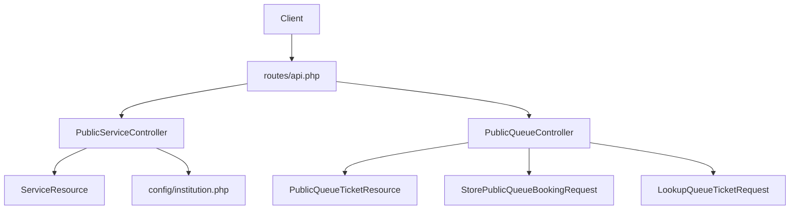
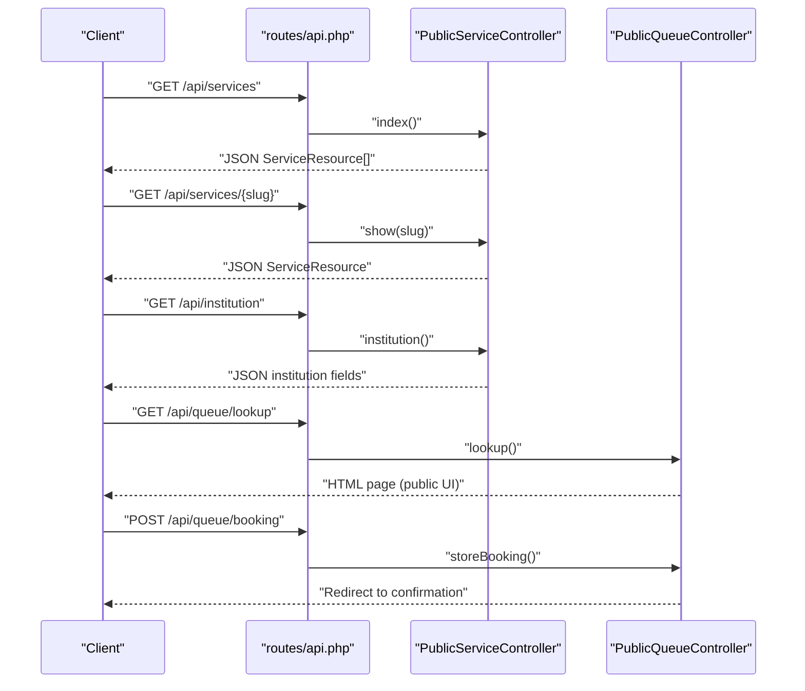
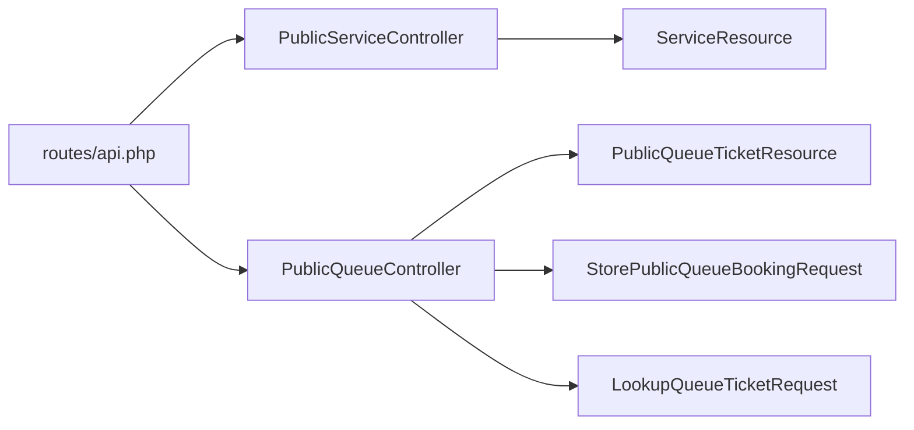

# Public API Endpoints

<cite>
**Referenced Files in This Document**
- [routes/api.php](file://routes/api.php)
- [app/Http/Controllers/Api/PublicServiceController.php](file://app/Http/Controllers/Api/PublicServiceController.php)
- [app/Http/Controllers/Api/PublicQueueController.php](file://app/Http/Controllers/Api/PublicQueueController.php)
- [app/Http/Requests/StorePublicQueueBookingRequest.php](file://app/Http/Requests/StorePublicQueueBookingRequest.php)
- [app/Http/Requests/LookupQueueTicketRequest.php](file://app/Http/Requests/LookupQueueTicketRequest.php)
- [app/Http/Resources/ServiceResource.php](file://app/Http/Resources/ServiceResource.php)
- [app/Http/Resources/PublicQueueTicketResource.php](file://app/Http/Resources/PublicQueueTicketResource.php)
- [app/Rules/WeekdayOnly.php](file://app/Rules/WeekdayOnly.php)
- [config/institution.php](file://config/institution.php)
</cite>

## Table of Contents
1. [Introduction](#introduction)
2. [Project Structure](#project-structure)
3. [Core Components](#core-components)
4. [Architecture Overview](#architecture-overview)
5. [Detailed Component Analysis](#detailed-component-analysis)
6. [Dependency Analysis](#dependency-analysis)
7. [Performance Considerations](#performance-considerations)
8. [Troubleshooting Guide](#troubleshooting-guide)
9. [Conclusion](#conclusion)
10. [Appendices](#appendices)

## Introduction
This document describes the Public API endpoints for queue operations, service information retrieval, and booking management. It covers endpoint specifications, request/response schemas, validation rules, rate limiting, authentication, and security considerations. The API follows RESTful conventions and returns JSON responses for programmatic clients.

## Project Structure
Public API endpoints are registered under the routes/api.php file and handled by dedicated controller classes. The controllers delegate validation to FormRequest classes and transform domain models into standardized JSON resources.

**Diagram sources**
- [routes/api.php:1-23](file://routes/api.php#L1-L23)
- [app/Http/Controllers/Api/PublicServiceController.php:1-42](file://app/Http/Controllers/Api/PublicServiceController.php#L1-L42)
- [app/Http/Controllers/Api/PublicQueueController.php:1-110](file://app/Http/Controllers/Api/PublicQueueController.php#L1-L110)
- [app/Http/Resources/ServiceResource.php:1-25](file://app/Http/Resources/ServiceResource.php#L1-L25)
- [app/Http/Resources/PublicQueueTicketResource.php:1-38](file://app/Http/Resources/PublicQueueTicketResource.php#L1-L38)
- [app/Http/Requests/StorePublicQueueBookingRequest.php:1-46](file://app/Http/Requests/StorePublicQueueBookingRequest.php#L1-L46)
- [app/Http/Requests/LookupQueueTicketRequest.php:1-30](file://app/Http/Requests/LookupQueueTicketRequest.php#L1-L30)
- [config/institution.php:1-10](file://config/institution.php#L1-L10)

**Section sources**
- [routes/api.php:1-23](file://routes/api.php#L1-L23)

## Core Components
- PublicServiceController: Provides institution info and service catalog endpoints.
- PublicQueueController: Handles queue lookup and booking submission.
- Request validators: Enforce input constraints for booking and lookup.
- Resource transformers: Normalize JSON responses for services and tickets.

**Section sources**
- [app/Http/Controllers/Api/PublicServiceController.php:1-42](file://app/Http/Controllers/Api/PublicServiceController.php#L1-L42)
- [app/Http/Controllers/Api/PublicQueueController.php:1-110](file://app/Http/Controllers/Api/PublicQueueController.php#L1-L110)
- [app/Http/Requests/StorePublicQueueBookingRequest.php:1-46](file://app/Http/Requests/StorePublicQueueBookingRequest.php#L1-L46)
- [app/Http/Requests/LookupQueueTicketRequest.php:1-30](file://app/Http/Requests/LookupQueueTicketRequest.php#L1-L30)
- [app/Http/Resources/ServiceResource.php:1-25](file://app/Http/Resources/ServiceResource.php#L1-L25)
- [app/Http/Resources/PublicQueueTicketResource.php:1-38](file://app/Http/Resources/PublicQueueTicketResource.php#L1-L38)

## Architecture Overview
The Public API is organized around two primary controllers:
- PublicServiceController: GET endpoints for institution and service catalog.
- PublicQueueController: GET endpoints for queue lookup and POST endpoint for booking.

Endpoints are grouped with middleware for rate limiting. Authentication for protected endpoints is handled via Sanctum.

**Diagram sources**
- [routes/api.php:8-18](file://routes/api.php#L8-L18)
- [app/Http/Controllers/Api/PublicServiceController.php:26-40](file://app/Http/Controllers/Api/PublicServiceController.php#L26-L40)
- [app/Http/Controllers/Api/PublicQueueController.php:39-56](file://app/Http/Controllers/Api/PublicQueueController.php#L39-L56)

## Detailed Component Analysis

### Endpoint Catalog

#### GET /api/institution
- Purpose: Retrieve institution metadata (name, address, phone, operating hours, logo path).
- Authentication: Not required.
- Rate limit: 60 requests per minute.
- Response: JSON object containing selected institution fields.

Response schema
- name: string
- address: string
- phone: string
- operating_hours: string
- logo_path: string

Notes
- Values are sourced from configuration and environment variables.

**Section sources**
- [routes/api.php:9](file://routes/api.php#L9)
- [app/Http/Controllers/Api/PublicServiceController.php:13-24](file://app/Http/Controllers/Api/PublicServiceController.php#L13-L24)
- [config/institution.php:1-10](file://config/institution.php#L1-L10)

#### GET /api/services
- Purpose: List active services available for public booking.
- Authentication: Not required.
- Rate limit: 60 requests per minute.
- Response: Array of ServiceResource objects.

Response schema (ServiceResource)
- id: integer
- name: string
- code: string
- slug: string
- description: string
- requirements: array
- booking_enabled: boolean
- daily_quota: integer
- remaining_quota: integer

**Section sources**
- [routes/api.php:10](file://routes/api.php#L10)
- [app/Http/Controllers/Api/PublicServiceController.php:26-31](file://app/Http/Controllers/Api/PublicServiceController.php#L26-L31)
- [app/Http/Resources/ServiceResource.php:10-23](file://app/Http/Resources/ServiceResource.php#L10-L23)

#### GET /api/services/{slug}
- Purpose: Retrieve a single active service by slug.
- Authentication: Not required.
- Rate limit: 60 requests per minute.
- Path parameters:
  - slug: string (service slug)
- Response: ServiceResource object.

**Section sources**
- [routes/api.php:11](file://routes/api.php#L11)
- [app/Http/Controllers/Api/PublicServiceController.php:33-40](file://app/Http/Controllers/Api/PublicServiceController.php#L33-L40)
- [app/Http/Resources/ServiceResource.php:10-23](file://app/Http/Resources/ServiceResource.php#L10-L23)

#### GET /api/queue/lookup
- Purpose: Lookup queue ticket by ticket number and service date; renders a public page with ticket details and queue position.
- Authentication: Not required.
- Rate limit: 60 requests per minute.
- Query parameters:
  - ticket_number: string (optional)
  - service_date: date (optional)
- Response: HTML page (not JSON).

Notes
- This endpoint serves a public UI page and is not intended for programmatic consumption.

**Section sources**
- [routes/api.php:12](file://routes/api.php#L12)
- [app/Http/Controllers/Api/PublicQueueController.php:58-85](file://app/Http/Controllers/Api/PublicQueueController.php#L58-L85)
- [app/Http/Requests/LookupQueueTicketRequest.php:22-28](file://app/Http/Requests/LookupQueueTicketRequest.php#L22-L28)

#### GET /api/queue/ticket-by-id/{encryptedId}
- Purpose: Retrieve a ticket’s details by encrypted ID; returns JSON.
- Authentication: Not required.
- Rate limit: 60 requests per minute.
- Path parameters:
  - encryptedId: string (ticket identifier)
- Response: PublicQueueTicketResource object.

Response schema (PublicQueueTicketResource)
- id: string (encrypted ticket id)
- ticket_number: string
- service_date: string (YYYY-MM-DD)
- visitor_name: string (partially masked)
- status: string (enum value)
- status_label: string (localized label)
- service: ServiceResource | null
- queue_position: integer
- counter_name: string | null
- checked_in_at: string | null (ISO 8601)
- called_at: string | null (ISO 8601)
- completed_at: string | null (ISO 8601)

**Section sources**
- [routes/api.php:13](file://routes/api.php#L13)
- [app/Http/Resources/PublicQueueTicketResource.php:10-26](file://app/Http/Resources/PublicQueueTicketResource.php#L10-L26)

#### POST /api/queue/booking
- Purpose: Submit a new public queue booking.
- Authentication: Not required.
- Rate limit: 10 requests per minute.
- Request body: JSON object with fields below.
- Response: Redirect to confirmation page (not JSON).

Request schema (StorePublicQueueBookingRequest)
- service_id: integer (required; must exist in services)
- service_date: date (required; must be today or later, up to 14 days ahead; must be a weekday)
- visitor_name: string (required; max length 255)
- visitor_identifier: string (required; max length 64)
- visitor_phone: string (required; max length 30)
- visit_purpose: string (optional; must be one of: pendaftaran, informasi_pengaduan, produk_hukum, ecourt)
- notes: string (optional; max length 1000)

Validation rules summary
- service_id: exists in services table
- service_date: date, after_or_equal:today, before_or_equal:+14 days, weekday only
- visitor_name: required string
- visitor_identifier: required string
- visitor_phone: required string
- visit_purpose: enum from allowed values
- notes: nullable string

**Section sources**
- [routes/api.php:17](file://routes/api.php#L17)
- [app/Http/Requests/StorePublicQueueBookingRequest.php:22-33](file://app/Http/Requests/StorePublicQueueBookingRequest.php#L22-L33)
- [app/Rules/WeekdayOnly.php:16-31](file://app/Rules/WeekdayOnly.php#L16-L31)

### Authentication and Authorization
- Public endpoints (all listed above) do not require authentication.
- A separate authenticated endpoint exists for user info:
  - GET /api/user (requires Sanctum)
  - Response: current user object
  - Middleware: auth:sanctum

**Section sources**
- [routes/api.php:20-22](file://routes/api.php#L20-L22)

### Rate Limiting
- GET /api/institution, /api/services, /api/services/{slug}, /api/queue/lookup, /api/queue/ticket-by-id/{encryptedId}: 60 requests per minute.
- POST /api/queue/booking: 10 requests per minute.

Rate limiting is applied via middleware groups in routes/api.php.

**Section sources**
- [routes/api.php:8](file://routes/api.php#L8)
- [routes/api.php:16](file://routes/api.php#L16)

### Error Handling Patterns
- Validation failures return structured errors based on request validators.
- Not found conditions:
  - GET /api/services/{slug} returns 404 if the slug does not match an active service.
- General HTTP status codes:
  - 422 Unprocessable Entity for validation errors.
  - 404 Not Found for missing resources.
  - 429 Too Many Requests for rate limit violations.
  - 500 Internal Server Error for unexpected server issues.

**Section sources**
- [app/Http/Requests/StorePublicQueueBookingRequest.php:22-33](file://app/Http/Requests/StorePublicQueueBookingRequest.php#L22-L33)
- [app/Http/Requests/LookupQueueTicketRequest.php:22-28](file://app/Http/Requests/LookupQueueTicketRequest.php#L22-L28)

### Data Formats and Validation Rules
- Date formats:
  - service_date: ISO-like date string (YYYY-MM-DD).
  - checked_in_at, called_at, completed_at: ISO 8601 strings.
- Enumerations:
  - visit_purpose: one of pendaftaran, informasi_pengaduan, produk_hukum, ecourt.
  - status: enum value; localized label provided via status_label.
- Masking:
  - visitor_name is partially masked in ticket resource.

**Section sources**
- [app/Http/Resources/PublicQueueTicketResource.php:15-24](file://app/Http/Resources/PublicQueueTicketResource.php#L15-L24)
- [app/Http/Requests/StorePublicQueueBookingRequest.php:30](file://app/Http/Requests/StorePublicQueueBookingRequest.php#L30)

### API Versioning and Compatibility
- No explicit version prefix is used in the route URIs.
- Backward compatibility considerations:
  - New fields may be added to responses without removing existing ones.
  - Enumerations and required fields should remain stable to avoid breaking clients.
- Deprecation policy:
  - No deprecation notices are present in the current codebase. Clients should monitor for future changes.

**Section sources**
- [routes/api.php:1-23](file://routes/api.php#L1-L23)

### Security Measures
- Authentication:
  - Public endpoints are unauthenticated; use rate limiting to mitigate abuse.
  - Protected endpoint requires Sanctum tokens.
- Input validation:
  - Strict request validation prevents malformed inputs.
- Output sanitization:
  - Visitor name is partially masked in ticket resource.
- Additional hardening recommendations:
  - Consider API keys for programmatic clients.
  - Add request signing for sensitive integrations.
  - Implement CORS policies and input sanitization at the gateway.

**Section sources**
- [app/Http/Requests/StorePublicQueueBookingRequest.php:22-33](file://app/Http/Requests/StorePublicQueueBookingRequest.php#L22-L33)
- [app/Http/Resources/PublicQueueTicketResource.php:28-36](file://app/Http/Resources/PublicQueueTicketResource.php#L28-L36)
- [routes/api.php:20-22](file://routes/api.php#L20-L22)

### Practical Examples and Client Guidelines
- Booking a ticket
  - Send a POST request to /api/queue/booking with a valid JSON payload conforming to the request schema.
  - Expect a redirect to a confirmation page; parse the returned ticket number from the page.
- Looking up a ticket
  - Use GET /api/queue/ticket-by-id/{encryptedId} to retrieve ticket details in JSON.
  - Use GET /api/queue/lookup for the public UI page (non-JSON).
- Retrieving services
  - Use GET /api/services to list all active services.
  - Use GET /api/services/{slug} to fetch a specific service.

Integration tips
- Respect rate limits to avoid 429 responses.
- Validate inputs client-side according to the request schema.
- Cache service catalogs periodically to reduce load.

**Section sources**
- [routes/api.php:8-18](file://routes/api.php#L8-L18)
- [app/Http/Requests/StorePublicQueueBookingRequest.php:22-33](file://app/Http/Requests/StorePublicQueueBookingRequest.php#L22-L33)
- [app/Http/Resources/PublicQueueTicketResource.php:10-26](file://app/Http/Resources/PublicQueueTicketResource.php#L10-L26)

## Dependency Analysis
The following diagram shows how routes map to controllers and how controllers depend on request validators and resources.

**Diagram sources**
- [routes/api.php:1-23](file://routes/api.php#L1-L23)
- [app/Http/Controllers/Api/PublicServiceController.php:1-42](file://app/Http/Controllers/Api/PublicServiceController.php#L1-L42)
- [app/Http/Controllers/Api/PublicQueueController.php:1-110](file://app/Http/Controllers/Api/PublicQueueController.php#L1-L110)
- [app/Http/Resources/ServiceResource.php:1-25](file://app/Http/Resources/ServiceResource.php#L1-L25)
- [app/Http/Resources/PublicQueueTicketResource.php:1-38](file://app/Http/Resources/PublicQueueTicketResource.php#L1-L38)
- [app/Http/Requests/StorePublicQueueBookingRequest.php:1-46](file://app/Http/Requests/StorePublicQueueBookingRequest.php#L1-L46)
- [app/Http/Requests/LookupQueueTicketRequest.php:1-30](file://app/Http/Requests/LookupQueueTicketRequest.php#L1-L30)

**Section sources**
- [routes/api.php:1-23](file://routes/api.php#L1-L23)

## Performance Considerations
- Use caching for service catalogs to minimize database queries.
- Apply pagination if the number of services grows large.
- Monitor rate-limited endpoints to prevent spikes.
- Consider background jobs for heavy operations (e.g., notifications) to keep API responses fast.

[No sources needed since this section provides general guidance]

## Troubleshooting Guide
Common issues and resolutions
- 422 Unprocessable Entity
  - Cause: Missing or invalid fields in the request body.
  - Resolution: Validate inputs against the request schema and ensure required fields are present.
- 404 Not Found
  - Cause: Non-existent service slug or ticket ID.
  - Resolution: Verify the slug or encrypted ID and ensure the resource exists.
- 429 Too Many Requests
  - Cause: Exceeded rate limits.
  - Resolution: Implement client-side throttling and backoff strategies.
- 500 Internal Server Error
  - Cause: Unexpected server-side failure.
  - Resolution: Retry with exponential backoff and log the error for investigation.

**Section sources**
- [app/Http/Requests/StorePublicQueueBookingRequest.php:22-33](file://app/Http/Requests/StorePublicQueueBookingRequest.php#L22-L33)
- [app/Http/Requests/LookupQueueTicketRequest.php:22-28](file://app/Http/Requests/LookupQueueTicketRequest.php#L22-L28)
- [routes/api.php:8-18](file://routes/api.php#L8-L18)

## Conclusion
The Public API provides straightforward endpoints for retrieving institution and service information, performing queue lookups, and submitting bookings. Clients should adhere to validation rules, respect rate limits, and integrate securely by considering API keys and request signing for production deployments.

[No sources needed since this section summarizes without analyzing specific files]

## Appendices

### Endpoint Reference Summary
- GET /api/institution
  - Auth: None
  - Rate: 60/min
  - Response: JSON institution fields
- GET /api/services
  - Auth: None
  - Rate: 60/min
  - Response: JSON ServiceResource[]
- GET /api/services/{slug}
  - Auth: None
  - Rate: 60/min
  - Response: JSON ServiceResource
- GET /api/queue/lookup
  - Auth: None
  - Rate: 60/min
  - Response: HTML page
- GET /api/queue/ticket-by-id/{encryptedId}
  - Auth: None
  - Rate: 60/min
  - Response: JSON PublicQueueTicketResource
- POST /api/queue/booking
  - Auth: None
  - Rate: 10/min
  - Request: JSON (booking fields)
  - Response: Redirect to confirmation

**Section sources**
- [routes/api.php:8-18](file://routes/api.php#L8-L18)
- [app/Http/Controllers/Api/PublicServiceController.php:13-40](file://app/Http/Controllers/Api/PublicServiceController.php#L13-L40)
- [app/Http/Controllers/Api/PublicQueueController.php:39-108](file://app/Http/Controllers/Api/PublicQueueController.php#L39-L108)
- [app/Http/Resources/ServiceResource.php:10-23](file://app/Http/Resources/ServiceResource.php#L10-L23)
- [app/Http/Resources/PublicQueueTicketResource.php:10-26](file://app/Http/Resources/PublicQueueTicketResource.php#L10-L26)
- [app/Http/Requests/StorePublicQueueBookingRequest.php:22-33](file://app/Http/Requests/StorePublicQueueBookingRequest.php#L22-L33)
- [app/Http/Requests/LookupQueueTicketRequest.php:22-28](file://app/Http/Requests/LookupQueueTicketRequest.php#L22-L28)