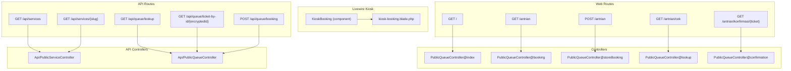
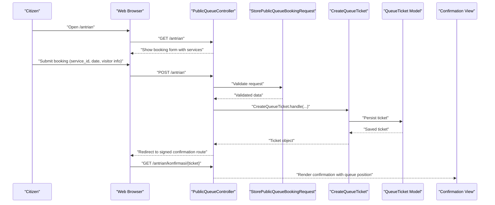
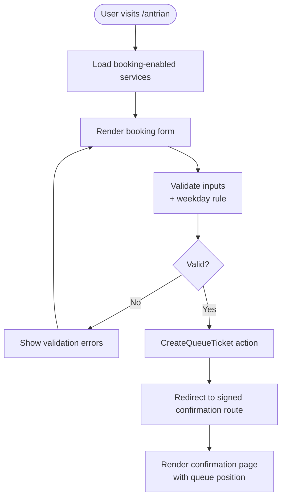
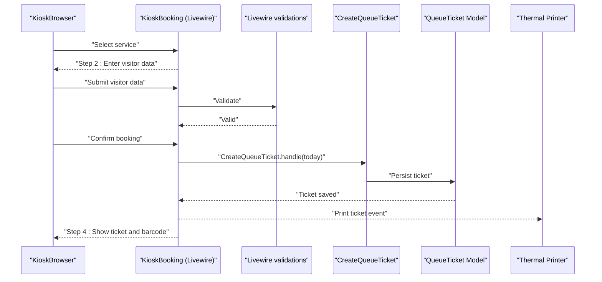
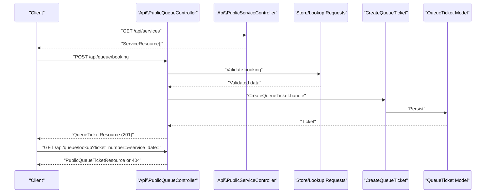
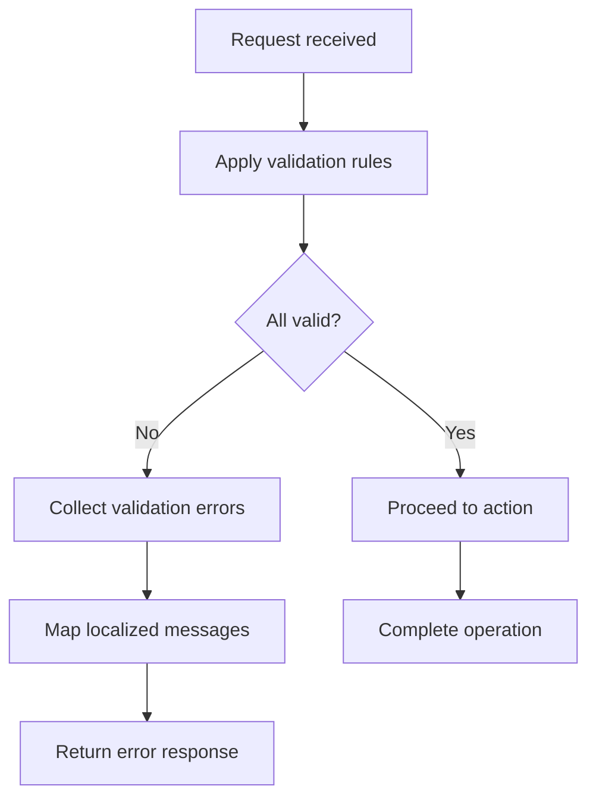
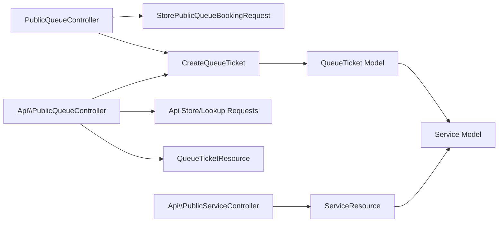

# Public Interface

<cite>
**Referenced Files in This Document**
- [PublicQueueController.php](file://app/Http/Controllers/PublicQueueController.php)
- [PublicQueueController.php](file://routes/web.php)
- [StorePublicQueueBookingRequest.php](file://app/Http/Requests/StorePublicQueueBookingRequest.php)
- [WeekdayOnly.php](file://app/Rules/WeekdayOnly.php)
- [KioskBooking.php](file://app/Livewire/KioskBooking.php)
- [kiosk-booking.blade.php](file://resources/views/livewire/kiosk-booking.blade.php)
- [PublicQueueController.php](file://app/Http/Controllers/Api/PublicQueueController.php)
- [PublicServiceController.php](file://app/Http/Controllers/Api/PublicServiceController.php)
- [ServiceResource.php](file://app/Http/Resources/ServiceResource.php)
- [PublicQueueTicketResource.php](file://app/Http/Resources/PublicQueueTicketResource.php)
- [Service.php](file://app/Models/Service.php)
- [QueueTicket.php](file://app/Models/QueueTicket.php)
- [testsprite_tests/TC001_Book_a_public_queue_ticket_successfully_with_a_future_visit_date.py](file://testsprite_tests/TC001_Book_a_public_queue_ticket_successfully_with_a_future_visit_date.py)
- [testsprite_tests/TC002_Validation_past_visit_date_is_rejected.py](file://testsprite_tests/TC002_Validation_past_visit_date_is_rejected.py)
- [testsprite_tests/TC017_End_to_end_booking_tiket_kiosk_pilih_layanan_isi_data_submit_hingga_nomor_tiket_tampil.py](file://testsprite_tests/TC017_End_to_end_booking_tiket_kiosk_pilih_layanan_isi_data_submit_hingga_nomor_tiket_tampil.py)
- [testsprite_tests/TC019_Submit_booking_without_selecting_a_service_displays_validation.py](file://testsprite_tests/TC019_Submit_booking_without_selecting_a_service_displays_validation.py)
- [testsprite_tests/TC020_Submit_booking_with_daily_quota_full_displays_error_quota.py](file://testsprite_tests/TC020_Submit_booking_with_daily_quota_full_displays_error_quota.py)
- [testsprite_tests/TC008_Lookup_status_antrian_dengan_nomor_tiket_yang_valid.py](file://testsprite_tests/TC008_Lookup_status_antrian_dengan_nomor_tiket_yang_valid.py)
- [testsprite_tests/TC009_Lookup_status_antrian_menampilkan_error_untuk_tiket_tidak_ditemukan.py](file://testsprite_tests/TC009_Lookup_status_antrian_menampilkan_error_untuk_tiket_tidak_ditemukan.py)
- [testsprite_tests/TC015_Login_kiosk_dengan_password_benar_menampilkan_halaman_booking_kiosk.py](file://testsprite_tests/TC015_Login_kiosk_dengan_password_benar_menampilkan_halaman_booking_kiosk.py)
- [testsprite_tests/TC016_Login_kiosk_dengan_password_salah_menampilkan_error_dan_tetap_di_halaman_login.py](file://testsprite_tests/TC016_Login_kiosk_dengan_password_salah_menampilkan_error_dan_tetap_di_halaman_login.py)
</cite>

## Table of Contents
1. [Introduction](#introduction)
2. [Project Structure](#project-structure)
3. [Core Components](#core-components)
4. [Architecture Overview](#architecture-overview)
5. [Detailed Component Analysis](#detailed-component-analysis)
6. [Dependency Analysis](#dependency-analysis)
7. [Performance Considerations](#performance-considerations)
8. [Troubleshooting Guide](#troubleshooting-guide)
9. [Conclusion](#conclusion)
10. [Appendices](#appendices)

## Introduction
This document describes the Public Interface components of the PTSP system, covering the citizen-facing booking workflow, public API endpoints, user interface components, validation rules, error handling, and security hardening. It targets both technical and non-technical audiences, providing clear explanations of how citizens book appointments, check queue status, and how the system validates inputs and enforces quotas and working-day constraints.

## Project Structure
The Public Interface spans three primary areas:
- Web-based public booking and lookup (routes, controller, Blade views)
- Kiosk self-service booking (Livewire component and Blade template)
- Public API for third-party integrations (services catalog, queue operations, status lookup)

**Diagram sources**
- [PublicQueueController.php](file://routes/web.php)
- [PublicQueueController.php](file://app/Http/Controllers/PublicQueueController.php)
- [KioskBooking.php](file://app/Livewire/KioskBooking.php)
- [kiosk-booking.blade.php](file://resources/views/livewire/kiosk-booking.blade.php)
- [PublicQueueController.php](file://routes/api.php)
- [PublicServiceController.php](file://app/Http/Controllers/Api/PublicServiceController.php)
- [PublicQueueController.php](file://app/Http/Controllers/Api/PublicQueueController.php)

**Section sources**
- [PublicQueueController.php](file://routes/web.php)
- [PublicQueueController.php](file://routes/api.php)

## Core Components
- Public Booking Controller: Handles public web booking, lookup, and confirmation flows.
- Kiosk Livewire Component: Self-service kiosk wizard with steps for service selection, visitor data entry, confirmation, and printing.
- Public API Controllers: Expose services catalog, queue booking, and status lookup for external clients.
- Validation and Rules: Enforce required fields, date constraints, and weekday-only booking.
- Data Models and Resources: Service quota calculations, queue position computation, and masked visitor names in public responses.

**Section sources**
- [PublicQueueController.php](file://app/Http/Controllers/PublicQueueController.php)
- [KioskBooking.php](file://app/Livewire/KioskBooking.php)
- [PublicQueueController.php](file://app/Http/Controllers/Api/PublicQueueController.php)
- [PublicServiceController.php](file://app/Http/Controllers/Api/PublicServiceController.php)
- [StorePublicQueueBookingRequest.php](file://app/Http/Requests/StorePublicQueueBookingRequest.php)
- [WeekdayOnly.php](file://app/Rules/WeekdayOnly.php)
- [Service.php](file://app/Models/Service.php)
- [QueueTicket.php](file://app/Models/QueueTicket.php)
- [ServiceResource.php](file://app/Http/Resources/ServiceResource.php)
- [PublicQueueTicketResource.php](file://app/Http/Resources/PublicQueueTicketResource.php)

## Architecture Overview
The Public Interface integrates web and API pathways with shared domain actions and resources. The booking pipeline uses a CreateQueueTicket action invoked by both web and API controllers. Public responses are sanitized and masked for privacy.

**Diagram sources**
- [PublicQueueController.php](file://app/Http/Controllers/PublicQueueController.php)
- [StorePublicQueueBookingRequest.php](file://app/Http/Requests/StorePublicQueueBookingRequest.php)
- [PublicQueueController.php](file://routes/web.php)

## Detailed Component Analysis

### Public Booking Workflow (Web)
- Service selection: Active services are fetched and filtered for booking-enabled services.
- Visitor information collection: Name, identifier, phone, optional purpose and notes.
- Date validation: Future-or-today, within +14 days, weekday-only constraint.
- Confirmation: Redirect to a signed route displaying ticket number and queue position.

**Diagram sources**
- [PublicQueueController.php](file://app/Http/Controllers/PublicQueueController.php)
- [StorePublicQueueBookingRequest.php](file://app/Http/Requests/StorePublicQueueBookingRequest.php)
- [WeekdayOnly.php](file://app/Rules/WeekdayOnly.php)

**Section sources**
- [PublicQueueController.php](file://app/Http/Controllers/PublicQueueController.php)
- [PublicQueueController.php](file://routes/web.php)
- [StorePublicQueueBookingRequest.php](file://app/Http/Requests/StorePublicQueueBookingRequest.php)
- [WeekdayOnly.php](file://app/Rules/WeekdayOnly.php)

### Kiosk Self-Service Booking (Livewire)
- Multi-step wizard:
  - Step 1: Choose a walk-in enabled service.
  - Step 2: Enter visitor data (name, ID, phone, area).
  - Step 3: Review and confirm.
  - Step 4: Print ticket and display barcode.
- Additional features:
  - Reprint mode by visitor identifier or phone.
  - Font size toggle for accessibility.
  - Thermal printer integration via Alpine event dispatch.

**Diagram sources**
- [KioskBooking.php](file://app/Livewire/KioskBooking.php)
- [kiosk-booking.blade.php](file://resources/views/livewire/kiosk-booking.blade.php)

**Section sources**
- [KioskBooking.php](file://app/Livewire/KioskBooking.php)
- [kiosk-booking.blade.php](file://resources/views/livewire/kiosk-booking.blade.php)

### Public API Endpoints
- GET /api/services: List active services with remaining daily quota.
- GET /api/services/{slug}: Retrieve a single service.
- POST /api/queue/booking: Create a booking (online channel).
- GET /api/queue/lookup: Lookup ticket by number and date.
- GET /api/queue/ticket-by-id/{encryptedId}: Lookup by encrypted ticket id.

**Diagram sources**
- [PublicServiceController.php](file://app/Http/Controllers/Api/PublicServiceController.php)
- [PublicQueueController.php](file://app/Http/Controllers/Api/PublicQueueController.php)
- [ServiceResource.php](file://app/Http/Resources/ServiceResource.php)
- [PublicQueueTicketResource.php](file://app/Http/Resources/PublicQueueTicketResource.php)
- [PublicQueueController.php](file://routes/api.php)

**Section sources**
- [PublicServiceController.php](file://app/Http/Controllers/Api/PublicServiceController.php)
- [PublicQueueController.php](file://app/Http/Controllers/Api/PublicQueueController.php)
- [ServiceResource.php](file://app/Http/Resources/ServiceResource.php)
- [PublicQueueTicketResource.php](file://app/Http/Resources/PublicQueueTicketResource.php)
- [PublicQueueController.php](file://routes/api.php)

### Validation Rules and Error Handling
- Required fields: service_id, service_date, visitor_name, visitor_identifier, visitor_phone.
- Date range: today to +14 days inclusive.
- Weekday-only constraint enforced by a custom rule.
- Enum-like visit_purpose restricted to predefined values.
- Notes length limited; identifier and phone length limited.
- API and web requests share the same validation rules and messages.

**Diagram sources**
- [StorePublicQueueBookingRequest.php](file://app/Http/Requests/StorePublicQueueBookingRequest.php)
- [WeekdayOnly.php](file://app/Rules/WeekdayOnly.php)

**Section sources**
- [StorePublicQueueBookingRequest.php](file://app/Http/Requests/StorePublicQueueBookingRequest.php)
- [WeekdayOnly.php](file://app/Rules/WeekdayOnly.php)

### User Interface Components
- Public booking page: Lists services and renders a form with validation feedback.
- Confirmation page: Displays ticket number, service, date, masked visitor name, and queue position.
- Kiosk wizard: Responsive, card-based service grid, form fields with validation badges, progress indicators, and print-ready ticket screen with barcode.
- Reprint mode: Search by visitor identifier or phone for today’s tickets.

**Section sources**
- [PublicQueueController.php](file://app/Http/Controllers/PublicQueueController.php)
- [PublicQueueController.php](file://resources/views/pages/public/antrian/booking.blade.php)
- [PublicQueueController.php](file://resources/views/pages/public/antrian/confirmation.blade.php)
- [PublicQueueController.php](file://resources/views/pages/public/antrian/lookup.blade.php)
- [kiosk-booking.blade.php](file://resources/views/livewire/kiosk-booking.blade.php)

### Mobile-Responsive Design and Accessibility
- Tailwind-based responsive layout with appropriate spacing and typography scaling.
- Large text toggle in kiosk mode for accessibility.
- Clear focus states and visible error messages.
- Semantic headings and labels for screen readers.
- Keyboard-friendly controls and button sizes optimized for touch.

[No sources needed since this section provides general guidance]

### Security Hardening and Rate Limiting
- Web routes:
  - POST /antrian throttled to 10 requests per minute.
  - GET /antrian/cek throttled to 30 requests per minute.
  - GET /antrian/konfirmasi/{ticket} requires signed URLs.
- API routes:
  - GET services/lookup endpoints throttled to 60 requests per minute.
  - POST booking endpoint throttled to 10 requests per minute.
- Kiosk and TV Display modules use separate middleware for password checks and throttling.
- API user endpoint requires Sanctum authentication.

**Section sources**
- [PublicQueueController.php](file://routes/web.php)
- [PublicQueueController.php](file://routes/api.php)

## Dependency Analysis
- Controllers depend on Form Requests for validation and on CreateQueueTicket action for persistence.
- Models encapsulate business logic for quotas and queue positions.
- Resources transform models into public JSON with masked data and computed fields.
- Livewire component orchestrates UI state, validation, and printing events.

**Diagram sources**
- [PublicQueueController.php](file://app/Http/Controllers/PublicQueueController.php)
- [StorePublicQueueBookingRequest.php](file://app/Http/Requests/StorePublicQueueBookingRequest.php)
- [PublicQueueController.php](file://app/Http/Controllers/Api/PublicQueueController.php)
- [PublicServiceController.php](file://app/Http/Controllers/Api/PublicServiceController.php)
- [QueueTicket.php](file://app/Models/QueueTicket.php)
- [Service.php](file://app/Models/Service.php)
- [PublicQueueTicketResource.php](file://app/Http/Resources/PublicQueueTicketResource.php)
- [ServiceResource.php](file://app/Http/Resources/ServiceResource.php)

**Section sources**
- [PublicQueueController.php](file://app/Http/Controllers/PublicQueueController.php)
- [PublicQueueController.php](file://app/Http/Controllers/Api/PublicQueueController.php)
- [PublicServiceController.php](file://app/Http/Controllers/Api/PublicServiceController.php)
- [QueueTicket.php](file://app/Models/QueueTicket.php)
- [Service.php](file://app/Models/Service.php)
- [PublicQueueTicketResource.php](file://app/Http/Resources/PublicQueueTicketResource.php)
- [ServiceResource.php](file://app/Http/Resources/ServiceResource.php)

## Performance Considerations
- Use of eager loading for relationships in lookup and confirmation reduces N+1 queries.
- Computed queue position is calculated with a single count query per ticket.
- API throttling prevents abuse and ensures predictable latency.
- Livewire lazy initialization of barcode generation avoids unnecessary rendering.

[No sources needed since this section provides general guidance]

## Troubleshooting Guide
Common issues and remedies:
- Past or weekend visit dates rejected: Ensure the date is a weekday within the allowed range.
- Daily quota exceeded: The system blocks further bookings for that service/date when quota is full.
- Missing service selection or required fields: Correct validation errors and resubmit.
- Ticket lookup not found: Verify ticket number and service date combination.
- Kiosk reprint not found: Search by correct visitor identifier or phone for today’s tickets.

**Section sources**
- [StorePublicQueueBookingRequest.php](file://app/Http/Requests/StorePublicQueueBookingRequest.php)
- [WeekdayOnly.php](file://app/Rules/WeekdayOnly.php)
- [Service.php](file://app/Models/Service.php)
- [QueueTicket.php](file://app/Models/QueueTicket.php)
- [testsprite_tests/TC002_Validation_past_visit_date_is_rejected.py](file://testsprite_tests/TC002_Validation_past_visit_date_is_rejected.py)
- [testsprite_tests/TC020_Submit_booking_with_daily_quota_full_displays_error_quota.py](file://testsprite_tests/TC020_Submit_booking_with_daily_quota_full_displays_error_quota.py)
- [testsprite_tests/TC019_Submit_booking_without_selecting_a_service_displays_validation.py](file://testsprite_tests/TC019_Submit_booking_without_selecting_a_service_displays_validation.py)
- [testsprite_tests/TC009_Lookup_status_antrian_menampilkan_error_untuk_tiket_tidak_ditemukan.py](file://testsprite_tests/TC009_Lookup_status_antrian_menampilkan_error_untuk_tiket_tidak_ditemukan.py)
- [testsprite_tests/TC016_Login_kiosk_dengan_password_salah_menampilkan_error_dan_tetap_di_halaman_login.py](file://testsprite_tests/TC016_Login_kiosk_dengan_password_salah_menampilkan_error_dan_tetap_di_halaman_login.py)

## Conclusion
The Public Interface provides a robust, secure, and user-friendly pathway for citizens to book and track queue appointments. It combines web and kiosk experiences with strong validation, quota enforcement, and API endpoints suitable for integration. Security measures such as rate limiting, signed URLs, and module-specific authentication protect the system from abuse while maintaining usability.

## Appendices

### API Definitions
- GET /api/institution
  - Description: Institution metadata (name, address, phone, operating hours, logo path).
  - Throttle: 60 per minute.
- GET /api/services
  - Description: List of active services with booking_enabled, daily_quota, and remaining_quota.
  - Throttle: 60 per minute.
- GET /api/services/{slug}
  - Description: Single service details.
  - Throttle: 60 per minute.
- POST /api/queue/booking
  - Description: Create a new booking (online channel).
  - Throttle: 10 per minute.
  - Request body: service_id, service_date, visitor_name, visitor_identifier, visitor_phone, visit_purpose, notes.
  - Response: QueueTicketResource (201 Created).
- GET /api/queue/lookup
  - Description: Lookup ticket by ticket_number and service_date.
  - Throttle: 60 per minute.
  - Response: PublicQueueTicketResource or 404 Not Found.
- GET /api/queue/ticket-by-id/{encryptedId}
  - Description: Lookup ticket by encrypted id.
  - Throttle: 60 per minute.
  - Response: PublicQueueTicketResource or 404 Not Found.

**Section sources**
- [PublicServiceController.php](file://app/Http/Controllers/Api/PublicServiceController.php)
- [PublicQueueController.php](file://app/Http/Controllers/Api/PublicQueueController.php)
- [routes/api.php](file://routes/api.php)

### UI Components Index
- Public booking page: Service catalog and booking form.
- Confirmation page: Ticket details and queue position.
- Kiosk wizard: Multi-step form with progress, validation, and print-ready ticket.
- Reprint mode: Search and print ticket by visitor identifier or phone.

**Section sources**
- [PublicQueueController.php](file://resources/views/pages/public/antrian/booking.blade.php)
- [PublicQueueController.php](file://resources/views/pages/public/antrian/confirmation.blade.php)
- [PublicQueueController.php](file://resources/views/pages/public/antrian/lookup.blade.php)
- [kiosk-booking.blade.php](file://resources/views/livewire/kiosk-booking.blade.php)

### Validation Rules Summary
- service_id: required, integer, exists in services.
- service_date: required, date, after_or_equal:today, before_or_equal:+14 days, weekday-only.
- visitor_name: required, string, max 255.
- visitor_identifier: required, string, max 64.
- visitor_phone: required, string, max 30.
- visit_purpose: nullable, string, in predefined set.
- notes: nullable, string, max 1000.

**Section sources**
- [StorePublicQueueBookingRequest.php](file://app/Http/Requests/StorePublicQueueBookingRequest.php)
- [WeekdayOnly.php](file://app/Rules/WeekdayOnly.php)

### Quota and Position Logic
- Service daily_quota and remaining_quota computed per date.
- Queue position determined by counting Waiting tickets with lower sequence_number in the same pool and date.

**Section sources**
- [Service.php](file://app/Models/Service.php)
- [QueueTicket.php](file://app/Models/QueueTicket.php)
- [PublicQueueTicketResource.php](file://app/Http/Resources/PublicQueueTicketResource.php)

### Test References
- Successful booking with future visit date.
- Past visit date rejection.
- End-to-end kiosk booking flow.
- Missing service validation.
- Daily quota full blocking booking.
- Valid ticket lookup.
- Not found ticket lookup.
- Kiosk login success and failure.

**Section sources**
- [testsprite_tests/TC001_Book_a_public_queue_ticket_successfully_with_a_future_visit_date.py](file://testsprite_tests/TC001_Book_a_public_queue_ticket_successfully_with_a_future_visit_date.py)
- [testsprite_tests/TC002_Validation_past_visit_date_is_rejected.py](file://testsprite_tests/TC002_Validation_past_visit_date_is_rejected.py)
- [testsprite_tests/TC017_End_to_end_booking_tiket_kiosk_pilih_layanan_isi_data_submit_hingga_nomor_tiket_tampil.py](file://testsprite_tests/TC017_End_to_end_booking_tiket_kiosk_pilih_layanan_isi_data_submit_hingga_nomor_tiket_tampil.py)
- [testsprite_tests/TC019_Submit_booking_without_selecting_a_service_displays_validation.py](file://testsprite_tests/TC019_Submit_booking_without_selecting_a_service_displays_validation.py)
- [testsprite_tests/TC020_Submit_booking_with_daily_quota_full_displays_error_quota.py](file://testsprite_tests/TC020_Submit_booking_with_daily_quota_full_displays_error_quota.py)
- [testsprite_tests/TC008_Lookup_status_antrian_dengan_nomor_tiket_yang_valid.py](file://testsprite_tests/TC008_Lookup_status_antrian_dengan_nomor_tiket_yang_valid.py)
- [testsprite_tests/TC009_Lookup_status_antrian_menampilkan_error_untuk_tiket_tidak_ditemukan.py](file://testsprite_tests/TC009_Lookup_status_antrian_menampilkan_error_untuk_tiket_tidak_ditemukan.py)
- [testsprite_tests/TC015_Login_kiosk_dengan_password_benar_menampilkan_halaman_booking_kiosk.py](file://testsprite_tests/TC015_Login_kiosk_dengan_password_benar_menampilkan_halaman_booking_kiosk.py)
- [testsprite_tests/TC016_Login_kiosk_dengan_password_salah_menampilkan_error_dan_tetap_di_halaman_login.py](file://testsprite_tests/TC016_Login_kiosk_dengan_password_salah_menampilkan_error_dan_tetap_di_halaman_login.py)