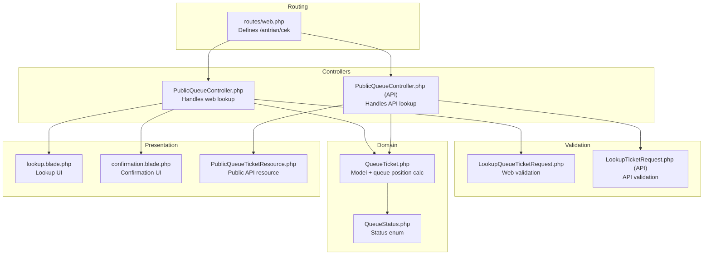
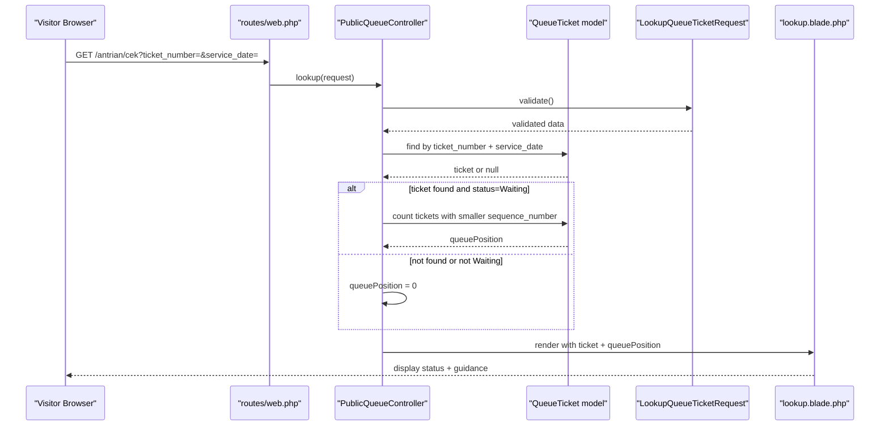
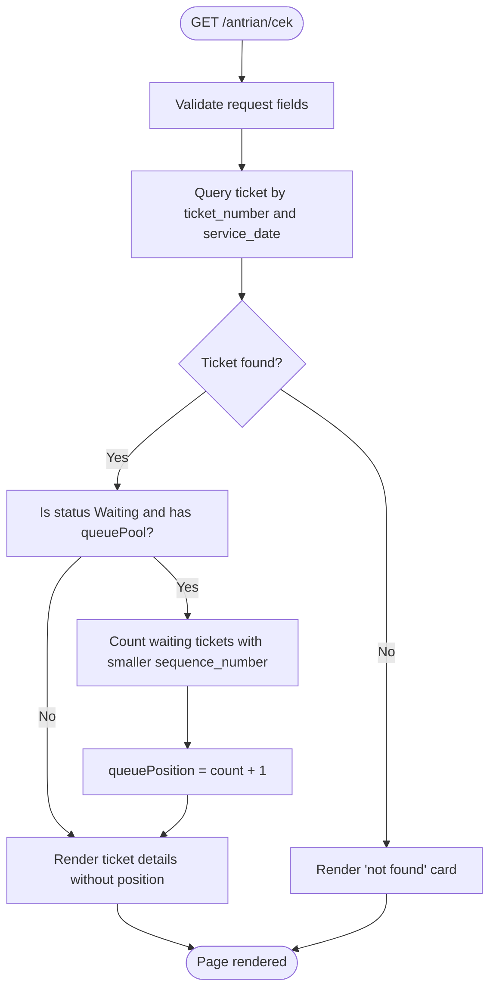
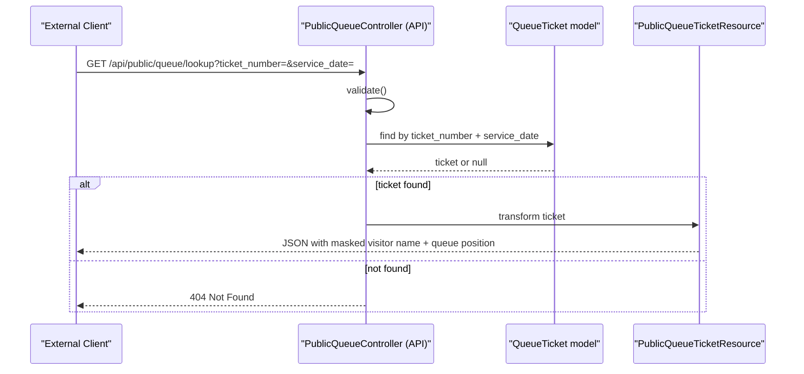
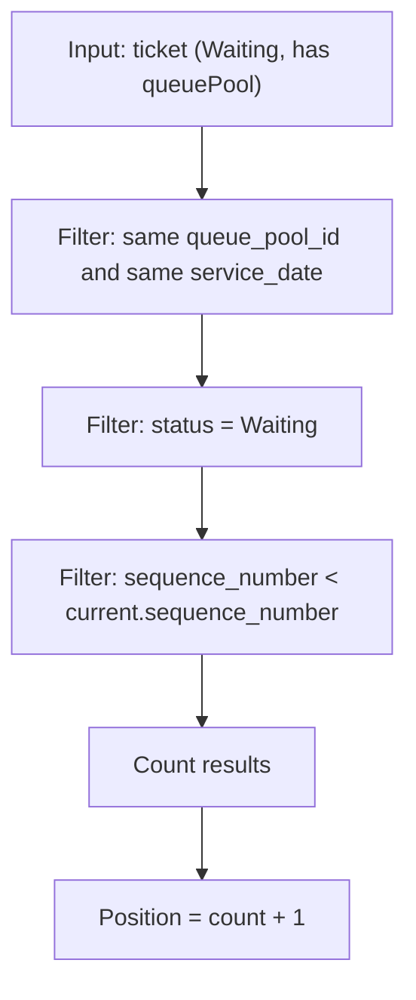
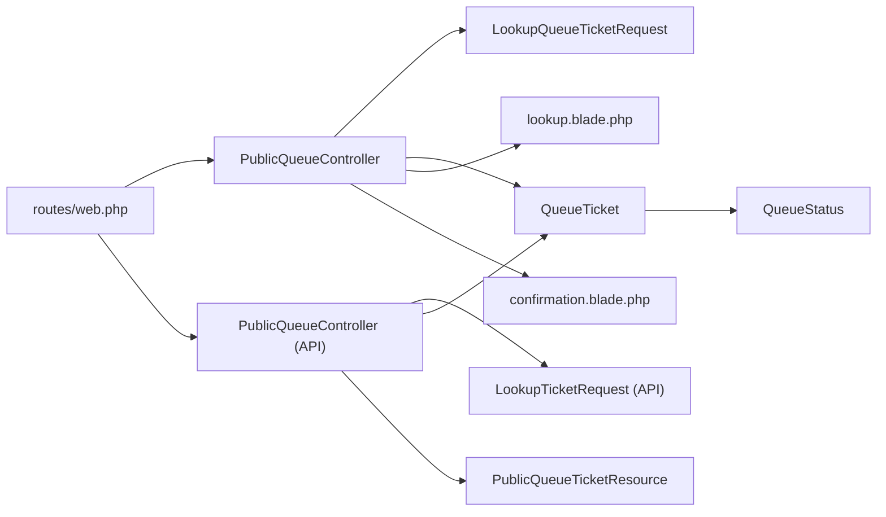

# Status Lookup

<cite>
**Referenced Files in This Document**
- [PublicQueueController.php](file://app/Http/Controllers/PublicQueueController.php)
- [PublicQueueController.php (API)](file://app/Http/Controllers/Api/PublicQueueController.php)
- [LookupQueueTicketRequest.php](file://app/Http/Requests/LookupQueueTicketRequest.php)
- [LookupTicketRequest.php (API)](file://app/Http/Requests/Api/LookupTicketRequest.php)
- [PublicQueueTicketResource.php](file://app/Http/Resources/PublicQueueTicketResource.php)
- [QueueTicket.php](file://app/Models/QueueTicket.php)
- [QueueStatus.php](file://app/Enums/QueueStatus.php)
- [web.php](file://routes/web.php)
- [lookup.blade.php](file://resources/views/pages/public/antrian/lookup.blade.php)
- [confirmation.blade.php](file://resources/views/pages/public/antrian/confirmation.blade.php)
</cite>

## Table of Contents
1. [Introduction](#introduction)
2. [Project Structure](#project-structure)
3. [Core Components](#core-components)
4. [Architecture Overview](#architecture-overview)
5. [Detailed Component Analysis](#detailed-component-analysis)
6. [Dependency Analysis](#dependency-analysis)
7. [Performance Considerations](#performance-considerations)
8. [Troubleshooting Guide](#troubleshooting-guide)
9. [Security Measures](#security-measures)
10. [Conclusion](#conclusion)

## Introduction
This document explains the Public Status Lookup functionality that allows visitors to check the current status of their queue ticket. It covers the end-to-end process from entering a ticket number and service date, to validating inputs, querying the database, computing queue position, and presenting results in a user-friendly interface. It also documents the API endpoint for programmatic access, error handling strategies, and security measures to prevent enumeration attacks.

## Project Structure
The Public Status Lookup spans several layers:
- Web routes define the public endpoints for browsing and submitting the lookup form.
- A controller handles the lookup request, validates inputs, queries the database, computes queue position, and renders the result page.
- A model encapsulates the queue ticket business logic, including queue position calculation.
- Blade templates render the lookup form and results.
- An API controller provides JSON responses for external integrations.
- Validation requests enforce input rules for both web and API flows.

**Diagram sources**
- [web.php:25](file://routes/web.php#L25)
- [PublicQueueController.php:58](file://app/Http/Controllers/PublicQueueController.php#L58)
- [PublicQueueController.php (API):36](file://app/Http/Controllers/Api/PublicQueueController.php#L36)
- [LookupQueueTicketRequest.php:22](file://app/Http/Requests/LookupQueueTicketRequest.php#L22)
- [LookupTicketRequest.php (API):14](file://app/Http/Requests/Api/LookupTicketRequest.php#L14)
- [QueueTicket.php:82](file://app/Models/QueueTicket.php#L82)
- [QueueStatus.php:5](file://app/Enums/QueueStatus.php#L5)
- [lookup.blade.php:1](file://resources/views/pages/public/antrian/lookup.blade.php#L1)
- [confirmation.blade.php:1](file://resources/views/pages/public/antrian/confirmation.blade.php#L1)
- [PublicQueueTicketResource.php:10](file://app/Http/Resources/PublicQueueTicketResource.php#L10)

**Section sources**
- [web.php:25](file://routes/web.php#L25)
- [PublicQueueController.php:58](file://app/Http/Controllers/PublicQueueController.php#L58)
- [PublicQueueController.php (API):36](file://app/Http/Controllers/Api/PublicQueueController.php#L36)
- [LookupQueueTicketRequest.php:22](file://app/Http/Requests/LookupQueueTicketRequest.php#L22)
- [LookupTicketRequest.php (API):14](file://app/Http/Requests/Api/LookupTicketRequest.php#L14)
- [QueueTicket.php:82](file://app/Models/QueueTicket.php#L82)
- [QueueStatus.php:5](file://app/Enums/QueueStatus.php#L5)
- [lookup.blade.php:1](file://resources/views/pages/public/antrian/lookup.blade.php#L1)
- [confirmation.blade.php:1](file://resources/views/pages/public/antrian/confirmation.blade.php#L1)
- [PublicQueueTicketResource.php:10](file://app/Http/Resources/PublicQueueTicketResource.php#L10)

## Core Components
- PublicQueueController (web): Processes the lookup form submission, validates inputs, finds the ticket by number and service date, computes queue position for waiting tickets, and renders the result page.
- PublicQueueController (API): Provides a JSON endpoint to look up tickets by number and service date, returning masked visitor information and queue position via a resource.
- LookupQueueTicketRequest (web): Validates that ticket_number and service_date are present and properly formatted for the web lookup.
- LookupTicketRequest (API): Validates that ticket_number and service_date are required and valid for the API lookup.
- QueueTicket model: Encapsulates the ticket domain logic, including queue position calculation for waiting tickets within the same pool and day.
- QueueStatus enum: Defines status values and provides localized labels/colors used in UI rendering.
- PublicQueueTicketResource: Transforms a ticket into a JSON response with masked visitor name and queue position.
- lookup.blade.php: Presents the lookup form and displays results, including status-specific guidance and queue position.
- confirmation.blade.php: Displays booking confirmation with queue position and printing instructions.

**Section sources**
- [PublicQueueController.php:58](file://app/Http/Controllers/PublicQueueController.php#L58)
- [PublicQueueController.php (API):36](file://app/Http/Controllers/Api/PublicQueueController.php#L36)
- [LookupQueueTicketRequest.php:22](file://app/Http/Requests/LookupQueueTicketRequest.php#L22)
- [LookupTicketRequest.php (API):14](file://app/Http/Requests/Api/LookupTicketRequest.php#L14)
- [QueueTicket.php:82](file://app/Models/QueueTicket.php#L82)
- [QueueStatus.php:5](file://app/Enums/QueueStatus.php#L5)
- [PublicQueueTicketResource.php:10](file://app/Http/Resources/PublicQueueTicketResource.php#L10)
- [lookup.blade.php:1](file://resources/views/pages/public/antrian/lookup.blade.php#L1)
- [confirmation.blade.php:1](file://resources/views/pages/public/antrian/confirmation.blade.php#L1)

## Architecture Overview
The lookup flow integrates routing, validation, controller logic, model computation, and presentation.

**Diagram sources**
- [web.php:25](file://routes/web.php#L25)
- [PublicQueueController.php:58](file://app/Http/Controllers/PublicQueueController.php#L58)
- [LookupQueueTicketRequest.php:22](file://app/Http/Requests/LookupQueueTicketRequest.php#L22)
- [QueueTicket.php:82](file://app/Models/QueueTicket.php#L82)
- [lookup.blade.php:1](file://resources/views/pages/public/antrian/lookup.blade.php#L1)

## Detailed Component Analysis

### Web Lookup Flow
- Endpoint: GET /antrian/cek
- Request validation: ticket_number and service_date are optional in the web request but required for meaningful results.
- Ticket retrieval: Finds a single ticket matching both ticket_number and service_date.
- Queue position calculation: For waiting tickets in the same queue pool and service date, counts how many waiting tickets precede the current ticket by sequence_number and adds 1.
- Result presentation: Renders lookup.blade.php with either the ticket details and queue position or an error message when not found.

**Diagram sources**
- [PublicQueueController.php:58](file://app/Http/Controllers/PublicQueueController.php#L58)
- [QueueTicket.php:82](file://app/Models/QueueTicket.php#L82)
- [lookup.blade.php:78](file://resources/views/pages/public/antrian/lookup.blade.php#L78)

**Section sources**
- [PublicQueueController.php:58](file://app/Http/Controllers/PublicQueueController.php#L58)
- [LookupQueueTicketRequest.php:22](file://app/Http/Requests/LookupQueueTicketRequest.php#L22)
- [QueueTicket.php:82](file://app/Models/QueueTicket.php#L82)
- [lookup.blade.php:78](file://resources/views/pages/public/antrian/lookup.blade.php#L78)

### API Lookup Flow
- Endpoint: GET /api/public/queue/lookup
- Request validation: ticket_number and service_date are required and must be valid.
- Ticket retrieval: Same as web flow, with eager loading of related entities.
- Response: Returns PublicQueueTicketResource, which masks the visitor name and includes queue position computed by the model.
- Error handling: Returns 404 with a message when the ticket is not found.

**Diagram sources**
- [PublicQueueController.php (API):36](file://app/Http/Controllers/Api/PublicQueueController.php#L36)
- [LookupTicketRequest.php (API):14](file://app/Http/Requests/Api/LookupTicketRequest.php#L14)
- [PublicQueueTicketResource.php:10](file://app/Http/Resources/PublicQueueTicketResource.php#L10)

**Section sources**
- [PublicQueueController.php (API):36](file://app/Http/Controllers/Api/PublicQueueController.php#L36)
- [LookupTicketRequest.php (API):14](file://app/Http/Requests/Api/LookupTicketRequest.php#L14)
- [PublicQueueTicketResource.php:10](file://app/Http/Resources/PublicQueueTicketResource.php#L10)

### Queue Position Calculation Algorithm
- Precondition: Only applies when the ticket status is Waiting and belongs to a queue pool.
- Method: Counts all waiting tickets in the same queue pool and on the same service_date that have a smaller sequence_number than the current ticket, then adds 1 to derive the position.
- Complexity: Linear in the number of waiting tickets sharing the same pool and date; acceptable for typical daily volumes.

**Diagram sources**
- [QueueTicket.php:82](file://app/Models/QueueTicket.php#L82)
- [PublicQueueController.php:71](file://app/Http/Controllers/PublicQueueController.php#L71)

**Section sources**
- [QueueTicket.php:82](file://app/Models/QueueTicket.php#L82)
- [PublicQueueController.php:71](file://app/Http/Controllers/PublicQueueController.php#L71)

### UI Presentation Details
- Lookup form: Two fields (ticket_number and service_date) with icons and inline validation feedback.
- Results area: Shows ticket header with status badge, visitor/service/date details, and a contextual message based on status. Includes queue position display for waiting tickets.
- Not found state: Friendly message with a button to retry the search.
- Confirmation page: Displays booking details, queue position, and printing instructions.

**Section sources**
- [lookup.blade.php:15](file://resources/views/pages/public/antrian/lookup.blade.php#L15)
- [lookup.blade.php:78](file://resources/views/pages/public/antrian/lookup.blade.php#L78)
- [confirmation.blade.php:90](file://resources/views/pages/public/antrian/confirmation.blade.php#L90)

## Dependency Analysis
- Controllers depend on:
  - Validation requests for input rules.
  - QueueTicket model for querying and computing queue position.
  - Blade templates for rendering results.
- PublicQueueTicketResource depends on:
  - QueueTicket model for queue position computation.
  - QueueStatus enum for labels/colors.
- Routes bind:
  - GET /antrian/cek to the web controller’s lookup method.
  - GET /api/public/queue/lookup to the API controller’s lookup method.

**Diagram sources**
- [web.php:25](file://routes/web.php#L25)
- [PublicQueueController.php:58](file://app/Http/Controllers/PublicQueueController.php#L58)
- [PublicQueueController.php (API):36](file://app/Http/Controllers/Api/PublicQueueController.php#L36)
- [LookupQueueTicketRequest.php:22](file://app/Http/Requests/LookupQueueTicketRequest.php#L22)
- [LookupTicketRequest.php (API):14](file://app/Http/Requests/Api/LookupTicketRequest.php#L14)
- [QueueTicket.php:82](file://app/Models/QueueTicket.php#L82)
- [QueueStatus.php:5](file://app/Enums/QueueStatus.php#L5)
- [lookup.blade.php:1](file://resources/views/pages/public/antrian/lookup.blade.php#L1)
- [confirmation.blade.php:1](file://resources/views/pages/public/antrian/confirmation.blade.php#L1)
- [PublicQueueTicketResource.php:10](file://app/Http/Resources/PublicQueueTicketResource.php#L10)

**Section sources**
- [web.php:25](file://routes/web.php#L25)
- [PublicQueueController.php:58](file://app/Http/Controllers/PublicQueueController.php#L58)
- [PublicQueueController.php (API):36](file://app/Http/Controllers/Api/PublicQueueController.php#L36)
- [LookupQueueTicketRequest.php:22](file://app/Http/Requests/LookupQueueTicketRequest.php#L22)
- [LookupTicketRequest.php (API):14](file://app/Http/Requests/Api/LookupTicketRequest.php#L14)
- [QueueTicket.php:82](file://app/Models/QueueTicket.php#L82)
- [QueueStatus.php:5](file://app/Enums/QueueStatus.php#L5)
- [lookup.blade.php:1](file://resources/views/pages/public/antrian/lookup.blade.php#L1)
- [confirmation.blade.php:1](file://resources/views/pages/public/antrian/confirmation.blade.php#L1)
- [PublicQueueTicketResource.php:10](file://app/Http/Resources/PublicQueueTicketResource.php#L10)

## Performance Considerations
- Indexing: Ensure database indexes exist on queue tickets for (ticket_number, service_date) and (queue_pool_id, service_date, status, sequence_number) to optimize lookups and counting.
- Query efficiency: The controller performs two queries (find ticket and count preceding waiting tickets). For very large pools, consider caching recent positions or precomputing daily rankings.
- Rendering cost: Blade templates are lightweight; avoid heavy computations in views.
- Throttling: Routes are throttled to limit abuse (e.g., 30 requests per minute for the web lookup endpoint).

**Section sources**
- [web.php:25](file://routes/web.php#L25)

## Troubleshooting Guide
Common scenarios and their handling:
- Ticket not found:
  - Web: Displays a friendly “not found” card with guidance to retry.
  - API: Returns 404 with a message indicating the ticket was not found.
- Invalid inputs:
  - Web: Validation errors are surfaced via field-level messages.
  - API: Validation messages indicate missing or invalid fields.
- Expired or cancelled bookings:
  - The system does not auto-expire tickets; however, cancelled tickets are excluded from queue calculations. If a ticket is marked as Cancelled, the UI shows cancellation messaging.
- Maintenance or downtime:
  - The lookup endpoints are part of the public web/API surface. Ensure monitoring and fallbacks are configured at the infrastructure level.

**Section sources**
- [lookup.blade.php:133](file://resources/views/pages/public/antrian/lookup.blade.php#L133)
- [PublicQueueController.php (API):40](file://app/Http/Controllers/Api/PublicQueueController.php#L40)
- [LookupQueueTicketRequest.php:22](file://app/Http/Requests/LookupQueueTicketRequest.php#L22)
- [LookupTicketRequest.php (API):22](file://app/Http/Requests/Api/LookupTicketRequest.php#L22)

## Security Measures
- Input validation:
  - Web: Optional fields in the request allow graceful handling of empty submissions; the controller still requires both fields for meaningful lookups.
  - API: Required fields ensure clients must provide both ticket_number and service_date.
- Rate limiting:
  - The web lookup endpoint is throttled to reduce brute-force attempts.
- Output sanitization:
  - Public API resource masks the visitor name to protect privacy.
  - Resource includes only necessary fields and derived queue position.
- Signed URLs:
  - Confirmation page uses signed routes to prevent open redirect-style misuse.
- Enumeration resistance:
  - The lookup returns a generic “not found” message without revealing whether the ticket exists but is in a different state.
  - Consider adding CAPTCHA or additional rate limits for repeated failed attempts if under attack.

**Section sources**
- [LookupQueueTicketRequest.php:22](file://app/Http/Requests/LookupQueueTicketRequest.php#L22)
- [LookupTicketRequest.php (API):14](file://app/Http/Requests/Api/LookupTicketRequest.php#L14)
- [web.php:25](file://routes/web.php#L25)
- [PublicQueueTicketResource.php:28](file://app/Http/Resources/PublicQueueTicketResource.php#L28)
- [PublicQueueController.php:104](file://app/Http/Controllers/PublicQueueController.php#L104)

## Conclusion
The Public Status Lookup provides a robust, user-friendly mechanism for visitors to track their queue ticket status. It combines strict validation, efficient model-driven queue position computation, and clear UI messaging. The API endpoint supports external integrations while maintaining privacy and security. With appropriate indexing and rate limiting, the system remains performant and resilient against common abuse patterns.