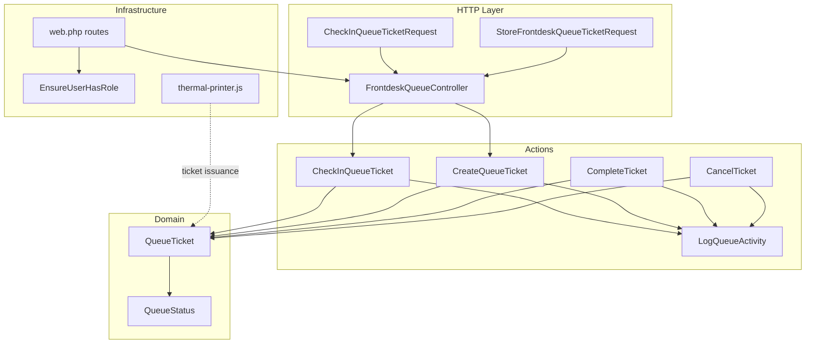
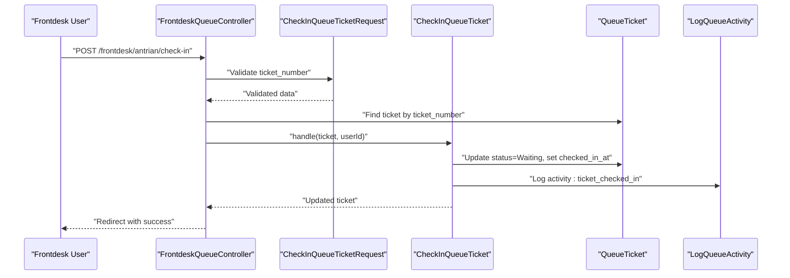
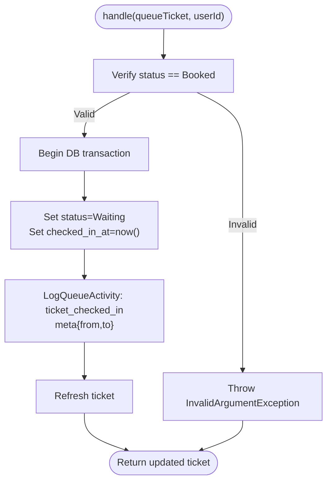
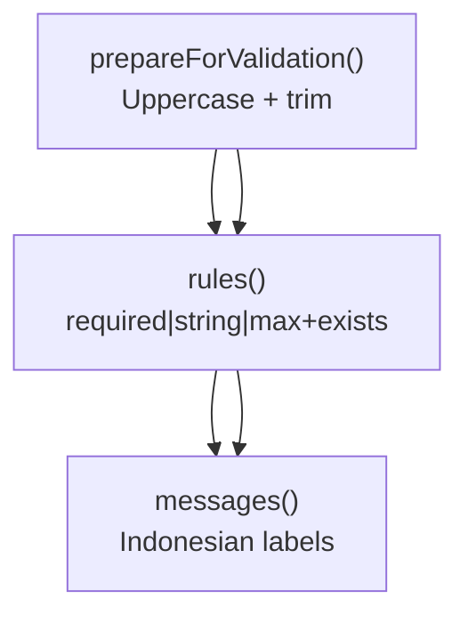
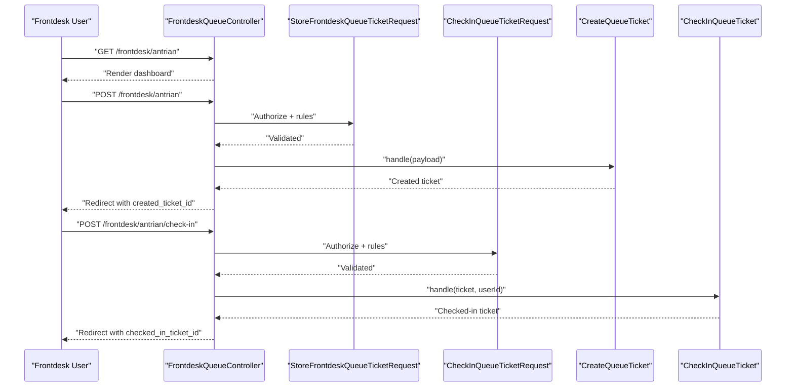
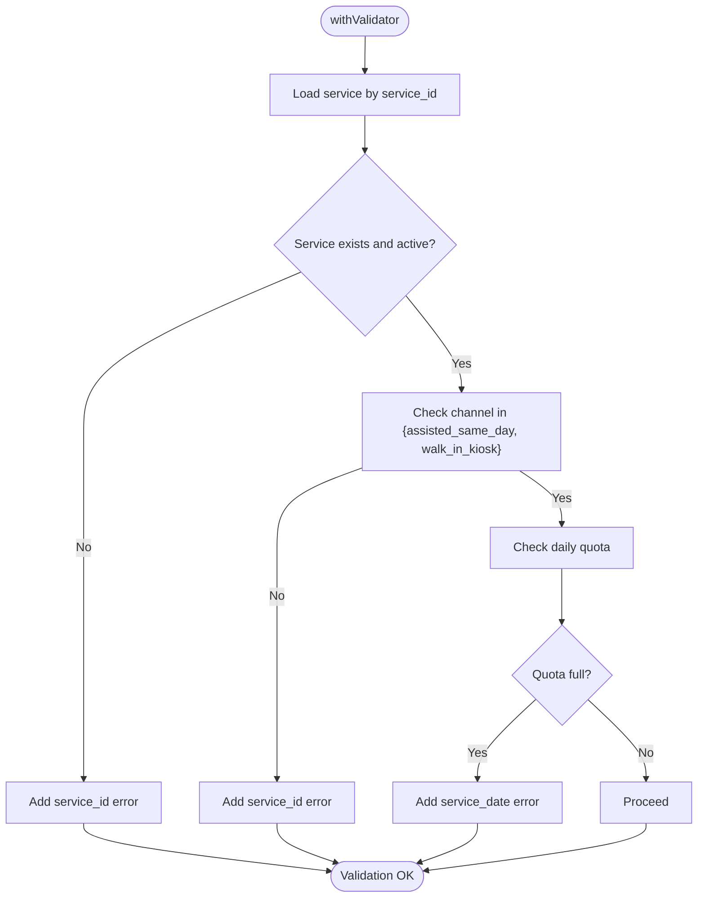
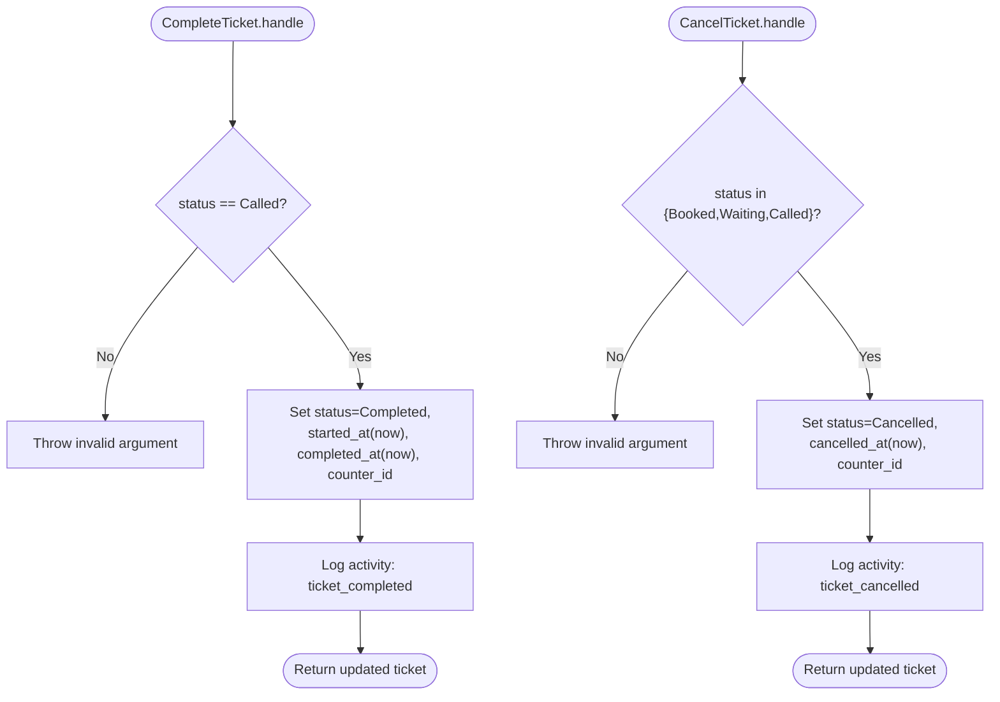
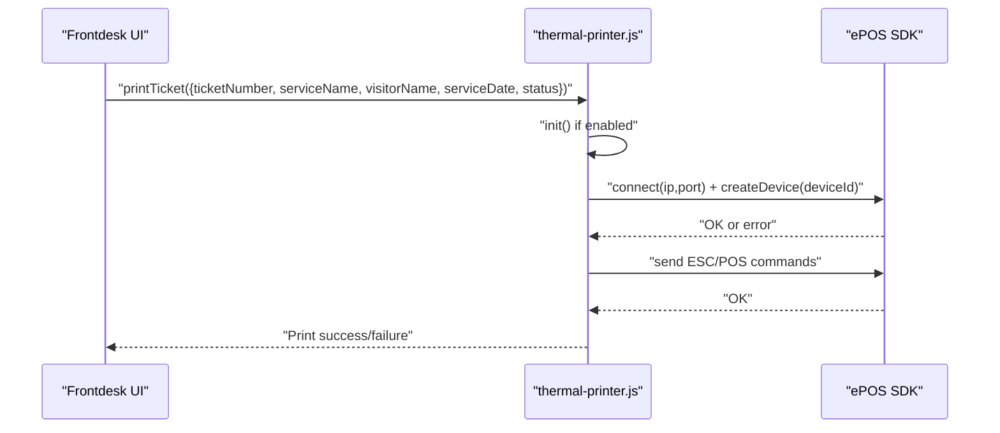
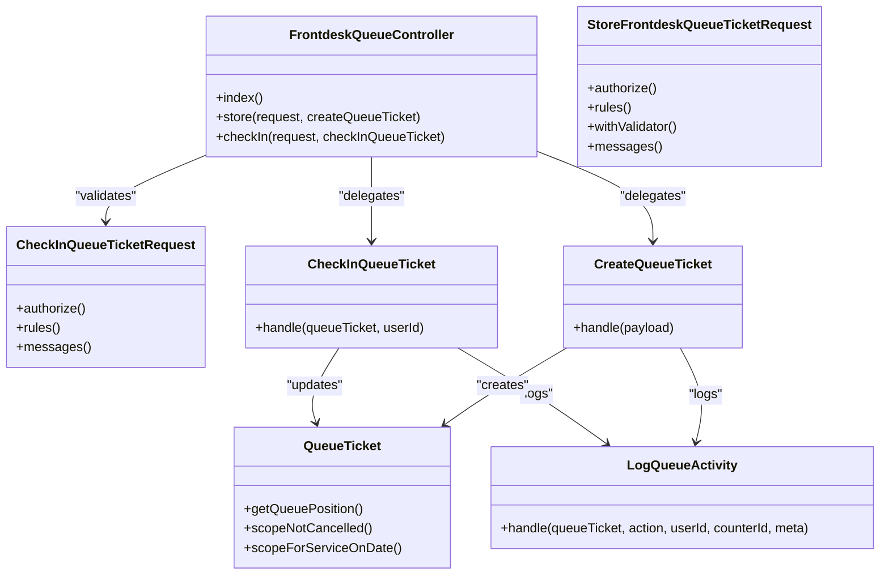

# Check-in and Check-out Operations

<cite>
**Referenced Files in This Document**
- [CheckInQueueTicket.php](file://app/Actions/Queue/CheckInQueueTicket.php)
- [CheckInQueueTicketRequest.php](file://app/Http/Requests/CheckInQueueTicketRequest.php)
- [FrontdeskQueueController.php](file://app/Http/Controllers/FrontdeskQueueController.php)
- [StoreFrontdeskQueueTicketRequest.php](file://app/Http/Requests/StoreFrontdeskQueueTicketRequest.php)
- [CreateQueueTicket.php](file://app/Actions/Queue/CreateQueueTicket.php)
- [CompleteTicket.php](file://app/Actions/Queue/CompleteTicket.php)
- [CancelTicket.php](file://app/Actions/Queue/CancelTicket.php)
- [QueueStatus.php](file://app/Enums/QueueStatus.php)
- [QueueTicket.php](file://app/Models/QueueTicket.php)
- [LogQueueActivity.php](file://app/Actions/Queue/LogQueueActivity.php)
- [web.php](file://routes/web.php)
- [EnsureUserHasRole.php](file://app/Http/Middleware/EnsureUserHasRole.php)
- [thermal-printer.js](file://resources/js/thermal-printer.js)
</cite>

## Table of Contents
1. [Introduction](#introduction)
2. [Project Structure](#project-structure)
3. [Core Components](#core-components)
4. [Architecture Overview](#architecture-overview)
5. [Detailed Component Analysis](#detailed-component-analysis)
6. [Dependency Analysis](#dependency-analysis)
7. [Performance Considerations](#performance-considerations)
8. [Troubleshooting Guide](#troubleshooting-guide)
9. [Conclusion](#conclusion)

## Introduction
This document explains the check-in and check-out operations for visitor arrival and departure within the queue system. It focuses on:
- The CheckInQueueTicket action class for transforming online bookings into on-site attendance
- Validation rules for check-in requests and frontdesk assisted registrations
- Frontdesk controller integration and user interface workflows for walk-in registrations
- Examples of assisted registration scenarios, validation error handling, and thermal printer integration for ticket issuance
- Security considerations for frontdesk access and audit logging for all check-in activities

## Project Structure
The check-in and check-out workflows span several layers:
- HTTP requests define validation rules for both check-in and frontdesk creation
- Controllers orchestrate user interactions and delegate to action classes
- Action classes encapsulate business logic for check-in, creation, completion, and cancellation
- Models represent queue tickets and statuses
- Middleware enforces role-based access
- Routes bind URLs to controllers
- A thermal printer module supports physical ticket printing

**Diagram sources**
- [CheckInQueueTicket.php:1-44](file://app/Actions/Queue/CheckInQueueTicket.php#L1-L44)
- [CheckInQueueTicketRequest.php:1-44](file://app/Http/Requests/CheckInQueueTicketRequest.php#L1-L44)
- [FrontdeskQueueController.php:1-89](file://app/Http/Controllers/FrontdeskQueueController.php#L1-L89)
- [StoreFrontdeskQueueTicketRequest.php:1-88](file://app/Http/Requests/StoreFrontdeskQueueTicketRequest.php#L1-L88)
- [CreateQueueTicket.php:1-91](file://app/Actions/Queue/CreateQueueTicket.php#L1-L91)
- [CompleteTicket.php:1-49](file://app/Actions/Queue/CompleteTicket.php#L1-L49)
- [CancelTicket.php:1-48](file://app/Actions/Queue/CancelTicket.php#L1-L48)
- [QueueStatus.php:1-38](file://app/Enums/QueueStatus.php#L1-L38)
- [QueueTicket.php:1-121](file://app/Models/QueueTicket.php#L1-L121)
- [web.php:42-46](file://routes/web.php#L42-L46)
- [EnsureUserHasRole.php:1-37](file://app/Http/Middleware/EnsureUserHasRole.php#L1-L37)
- [thermal-printer.js:1-139](file://resources/js/thermal-printer.js#L1-L139)

**Section sources**
- [web.php:42-46](file://routes/web.php#L42-L46)

## Core Components
- CheckInQueueTicket: Transitions a ticket from Booked to Waiting, records check-in time, and logs the activity
- CheckInQueueTicketRequest: Validates the ticket number for check-in
- FrontdeskQueueController: Renders the frontdesk page, handles frontdesk ticket creation, and processes check-in
- StoreFrontdeskQueueTicketRequest: Validates frontdesk assisted registrations and service/channel constraints
- CreateQueueTicket: Creates tickets with appropriate initial status based on channel
- CompleteTicket: Marks a called ticket as completed
- CancelTicket: Cancels eligible tickets and logs the event
- QueueStatus: Enumerates ticket states and provides labels/colors
- QueueTicket: Eloquent model representing a queue ticket and its relations
- LogQueueActivity: Persists queue activity events with metadata
- web.php routes: Bind frontdesk endpoints and apply role-based middleware
- EnsureUserHasRole: Enforces access control for frontdesk and other roles
- thermal-printer.js: Prints tickets to an Epson TM-M30II thermal printer

**Section sources**
- [CheckInQueueTicket.php:11-42](file://app/Actions/Queue/CheckInQueueTicket.php#L11-L42)
- [CheckInQueueTicketRequest.php:7-42](file://app/Http/Requests/CheckInQueueTicketRequest.php#L7-L42)
- [FrontdeskQueueController.php:16-87](file://app/Http/Controllers/FrontdeskQueueController.php#L16-L87)
- [StoreFrontdeskQueueTicketRequest.php:9-86](file://app/Http/Requests/StoreFrontdeskQueueTicketRequest.php#L9-L86)
- [CreateQueueTicket.php:13-89](file://app/Actions/Queue/CreateQueueTicket.php#L13-L89)
- [CompleteTicket.php:11-47](file://app/Actions/Queue/CompleteTicket.php#L11-L47)
- [CancelTicket.php:11-46](file://app/Actions/Queue/CancelTicket.php#L11-L46)
- [QueueStatus.php:5-37](file://app/Enums/QueueStatus.php#L5-L37)
- [QueueTicket.php:12-119](file://app/Models/QueueTicket.php#L12-L119)
- [LogQueueActivity.php:8-27](file://app/Actions/Queue/LogQueueActivity.php#L8-L27)
- [web.php:42-46](file://routes/web.php#L42-L46)
- [EnsureUserHasRole.php:9-35](file://app/Http/Middleware/EnsureUserHasRole.php#L9-L35)
- [thermal-printer.js:54-128](file://resources/js/thermal-printer.js#L54-L128)

## Architecture Overview
The check-in and check-out architecture follows a layered pattern:
- Request validation ensures data integrity before processing
- Controllers coordinate user interactions and delegate to action classes
- Actions encapsulate domain logic and maintain atomicity via transactions
- Models persist state changes and expose helper methods
- Middleware secures endpoints by role
- Routes define entry points and apply middleware groups
- Activity logging captures all state transitions for auditability

**Diagram sources**
- [FrontdeskQueueController.php:66-87](file://app/Http/Controllers/FrontdeskQueueController.php#L66-L87)
- [CheckInQueueTicketRequest.php:29-34](file://app/Http/Requests/CheckInQueueTicketRequest.php#L29-L34)
- [CheckInQueueTicket.php:17-41](file://app/Actions/Queue/CheckInQueueTicket.php#L17-L41)
- [QueueTicket.php:17-38](file://app/Models/QueueTicket.php#L17-L38)
- [LogQueueActivity.php:13-26](file://app/Actions/Queue/LogQueueActivity.php#L13-L26)

## Detailed Component Analysis

### CheckInQueueTicket Action Class
Purpose:
- Convert a previously booked ticket into the Waiting state upon visitor arrival
- Record the check-in timestamp
- Log the activity with metadata for audit trails

Processing logic:
- Validates that the ticket is currently Booked
- Executes within a database transaction
- Updates status and checked_in_at
- Logs the activity with from/to status metadata

Security and error handling:
- Throws an exception if the ticket is not Booked, preventing invalid transitions
- Controller catches the exception and returns user-friendly errors

**Diagram sources**
- [CheckInQueueTicket.php:17-41](file://app/Actions/Queue/CheckInQueueTicket.php#L17-L41)
- [QueueStatus.php:7-12](file://app/Enums/QueueStatus.php#L7-L12)
- [LogQueueActivity.php:13-26](file://app/Actions/Queue/LogQueueActivity.php#L13-L26)

**Section sources**
- [CheckInQueueTicket.php:11-42](file://app/Actions/Queue/CheckInQueueTicket.php#L11-L42)
- [QueueStatus.php:5-37](file://app/Enums/QueueStatus.php#L5-L37)

### CheckInQueueTicketRequest Validation
Purpose:
- Ensure the ticket number is present, normalized, and exists in the queue system

Validation rules:
- ticket_number: required, string, max length, must exist in queue_tickets table

Localization:
- Provides Indonesian error messages for required and existence checks

**Diagram sources**
- [CheckInQueueTicketRequest.php:9-42](file://app/Http/Requests/CheckInQueueTicketRequest.php#L9-L42)

**Section sources**
- [CheckInQueueTicketRequest.php:7-42](file://app/Http/Requests/CheckInQueueTicketRequest.php#L7-L42)

### Frontdesk Controller Integration and Workflows
Responsibilities:
- Render the frontdesk dashboard with optional created and checked-in tickets
- Accept frontdesk-assisted registrations and create tickets
- Process check-in for existing tickets

Key flows:
- Index: Loads services and passes session-stored created/checked-in ticket IDs to the view
- Store: Validates frontdesk creation request and delegates to CreateQueueTicket
- Check-in: Validates ticket number, finds the ticket, invokes CheckInQueueTicket, and handles exceptions

**Diagram sources**
- [FrontdeskQueueController.php:18-87](file://app/Http/Controllers/FrontdeskQueueController.php#L18-L87)
- [StoreFrontdeskQueueTicketRequest.php:24-66](file://app/Http/Requests/StoreFrontdeskQueueTicketRequest.php#L24-L66)
- [CreateQueueTicket.php:34-89](file://app/Actions/Queue/CreateQueueTicket.php#L34-L89)
- [CheckInQueueTicket.php:17-41](file://app/Actions/Queue/CheckInQueueTicket.php#L17-L41)

**Section sources**
- [FrontdeskQueueController.php:16-87](file://app/Http/Controllers/FrontdeskQueueController.php#L16-L87)

### Frontdesk Assisted Registration Validation
Purpose:
- Validate frontdesk-assisted registrations and enforce service/channel compatibility

Validation rules:
- service_id: required, integer, must exist and be active
- channel: required, must be one of assisted_same_day or walk_in_kiosk
- service_date: required, date, after or equal today
- visitor_name: required, string, max length
- Optional fields: visitor_identifier, visitor_phone, visit_purpose, notes

Additional constraints:
- Service must be active and allow walk-in/frontdesk channels
- Daily quota must not be exceeded for the selected service and date

**Diagram sources**
- [StoreFrontdeskQueueTicketRequest.php:38-66](file://app/Http/Requests/StoreFrontdeskQueueTicketRequest.php#L38-L66)

**Section sources**
- [StoreFrontdeskQueueTicketRequest.php:9-86](file://app/Http/Requests/StoreFrontdeskQueueTicketRequest.php#L9-L86)

### Check-out Operations (Completion and Cancellation)
Purpose:
- Transition tickets to Completed after service delivery
- Allow cancellation for eligible statuses

Processing logic:
- CompleteTicket: Requires Called status, sets started/completed timestamps, associates counter, logs activity
- CancelTicket: Allows cancellation from Booked, Waiting, or Called, sets cancelled timestamp and counter, logs activity

**Diagram sources**
- [CompleteTicket.php:17-47](file://app/Actions/Queue/CompleteTicket.php#L17-L47)
- [CancelTicket.php:17-46](file://app/Actions/Queue/CancelTicket.php#L17-L46)

**Section sources**
- [CompleteTicket.php:11-47](file://app/Actions/Queue/CompleteTicket.php#L11-L47)
- [CancelTicket.php:11-46](file://app/Actions/Queue/CancelTicket.php#L11-L46)

### Thermal Printer Integration for Ticket Issuance
Purpose:
- Print physical tickets to an Epson TM-M30II thermal printer using ESC/POS commands

Integration points:
- The thermal printer module exposes a printTicket method that accepts ticket details
- The module initializes the ePOS SDK, connects to the printer, and sends ESC/POS commands
- Printing is skipped if the printer is not connected or SDK is unavailable

**Diagram sources**
- [thermal-printer.js:54-128](file://resources/js/thermal-printer.js#L54-L128)

**Section sources**
- [thermal-printer.js:5-139](file://resources/js/thermal-printer.js#L5-L139)

### Security Considerations for Frontdesk Access
Access control:
- Routes for frontdesk require authentication and verified emails
- Role middleware restricts access to frontdesk and admin users
- EnsureUserHasRole middleware checks user roles and aborts unauthorized requests

Recommendations:
- Enforce two-factor authentication for frontdesk users
- Limit session duration and implement idle timeouts
- Restrict sensitive actions to specific IP ranges or workstations
- Monitor failed authentication attempts and lock accounts after thresholds

**Section sources**
- [web.php:42-46](file://routes/web.php#L42-L46)
- [EnsureUserHasRole.php:16-35](file://app/Http/Middleware/EnsureUserHasRole.php#L16-L35)

### Audit Logging for Check-in Activities
Logging mechanism:
- LogQueueActivity persists queue activity events with contextual metadata
- Check-in action logs ticket_checked_in with from/to status values
- Creation, completion, and cancellation actions log their respective events with additional metadata

Best practices:
- Include user ID, counter ID, and relevant ticket attributes in meta
- Ensure logging occurs within the same transaction as state updates
- Retain logs for compliance and reporting

**Section sources**
- [LogQueueActivity.php:13-26](file://app/Actions/Queue/LogQueueActivity.php#L13-L26)
- [CheckInQueueTicket.php:29-38](file://app/Actions/Queue/CheckInQueueTicket.php#L29-L38)
- [CreateQueueTicket.php:74-85](file://app/Actions/Queue/CreateQueueTicket.php#L74-L85)
- [CompleteTicket.php:32-44](file://app/Actions/Queue/CompleteTicket.php#L32-L44)
- [CancelTicket.php:31-43](file://app/Actions/Queue/CancelTicket.php#L31-L43)

## Dependency Analysis
Key dependencies and relationships:
- FrontdeskQueueController depends on CheckInQueueTicketRequest, CheckInQueueTicket, and CreateQueueTicket
- CheckInQueueTicket depends on QueueTicket and LogQueueActivity
- StoreFrontdeskQueueTicketRequest validates service/channel/quota constraints
- Routes apply role-based middleware to protect frontdesk endpoints
- QueueTicket model defines fillable attributes and scopes for queries

**Diagram sources**
- [FrontdeskQueueController.php:16-87](file://app/Http/Controllers/FrontdeskQueueController.php#L16-L87)
- [CheckInQueueTicketRequest.php:7-42](file://app/Http/Requests/CheckInQueueTicketRequest.php#L7-L42)
- [StoreFrontdeskQueueTicketRequest.php:9-86](file://app/Http/Requests/StoreFrontdeskQueueTicketRequest.php#L9-L86)
- [CheckInQueueTicket.php:11-42](file://app/Actions/Queue/CheckInQueueTicket.php#L11-L42)
- [CreateQueueTicket.php:13-89](file://app/Actions/Queue/CreateQueueTicket.php#L13-L89)
- [QueueTicket.php:74-119](file://app/Models/QueueTicket.php#L74-L119)
- [LogQueueActivity.php:8-27](file://app/Actions/Queue/LogQueueActivity.php#L8-L27)

**Section sources**
- [web.php:42-46](file://routes/web.php#L42-L46)

## Performance Considerations
- Use database transactions for state changes to ensure consistency
- Leverage model scopes for efficient position calculations and filtering
- Minimize N+1 queries by eager-loading relations in controllers
- Cache frequently accessed service lists for the frontdesk dashboard
- Batch logging operations if throughput increases significantly

## Troubleshooting Guide
Common issues and resolutions:
- Check-in fails with “not booked” error:
  - Cause: Attempting to check-in a ticket not in Booked status
  - Resolution: Verify the ticket’s current status and ensure it was created via online booking
  - Related code: [CheckInQueueTicket.php:19-21](file://app/Actions/Queue/CheckInQueueTicket.php#L19-L21), [FrontdeskQueueController.php:75-81](file://app/Http/Controllers/FrontdeskQueueController.php#L75-L81)

- Ticket number not found during check-in:
  - Cause: Invalid or missing ticket_number
  - Resolution: Confirm the ticket_number format and existence in the queue system
  - Related code: [CheckInQueueTicketRequest.php:32](file://app/Http/Requests/CheckInQueueTicketRequest.php#L32)

- Frontdesk creation validation errors:
  - Cause: Service not active, channel mismatch, or daily quota exceeded
  - Resolution: Select an active service that allows walk-in, choose correct channel, and retry on another date
  - Related code: [StoreFrontdeskQueueTicketRequest.php:56-64](file://app/Http/Requests/StoreFrontdeskQueueTicketRequest.php#L56-L64)

- Thermal printer not printing:
  - Cause: Printer disconnected or SDK not loaded
  - Resolution: Initialize the printer module and ensure connectivity; verify ESC/POS commands are sent
  - Related code: [thermal-printer.js:54-128](file://resources/js/thermal-printer.js#L54-L128)

**Section sources**
- [CheckInQueueTicket.php:19-21](file://app/Actions/Queue/CheckInQueueTicket.php#L19-L21)
- [FrontdeskQueueController.php:75-81](file://app/Http/Controllers/FrontdeskQueueController.php#L75-L81)
- [CheckInQueueTicketRequest.php:32](file://app/Http/Requests/CheckInQueueTicketRequest.php#L32)
- [StoreFrontdeskQueueTicketRequest.php:56-64](file://app/Http/Requests/StoreFrontdeskQueueTicketRequest.php#L56-L64)
- [thermal-printer.js:54-128](file://resources/js/thermal-printer.js#L54-L128)

## Conclusion
The check-in and check-out operations are designed around clear validation, secure access control, and robust audit logging. CheckInQueueTicket ensures only eligible tickets are admitted, while frontdesk assisted registration enforces service/channel rules and quota limits. The controller orchestrates these actions, and logging guarantees full traceability. Thermal printer integration completes the physical ticket issuance workflow. Together, these components provide a reliable foundation for managing visitor arrivals and departures in the queue system.