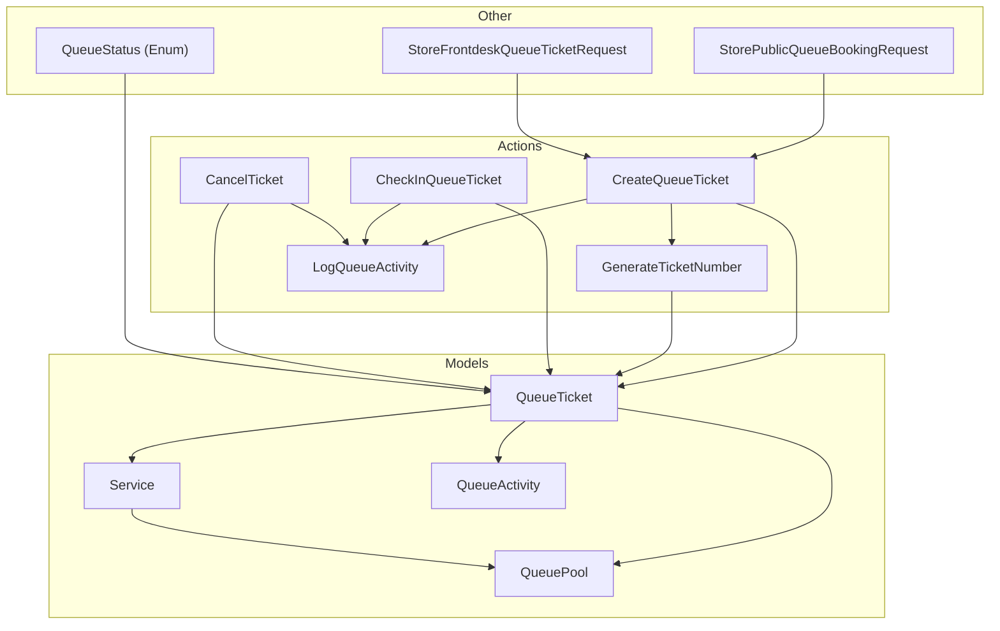
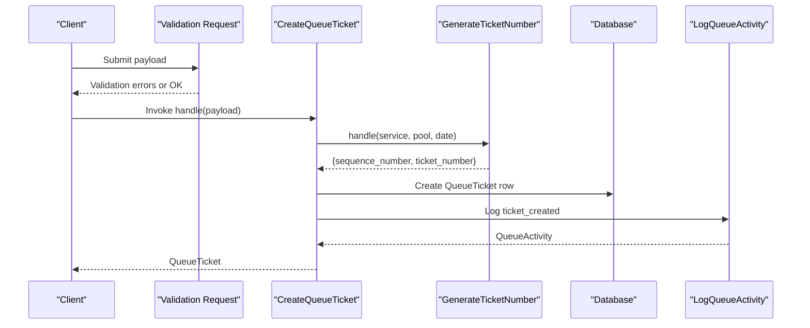
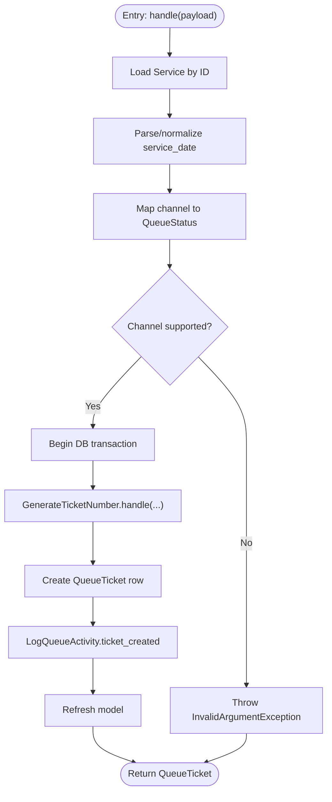
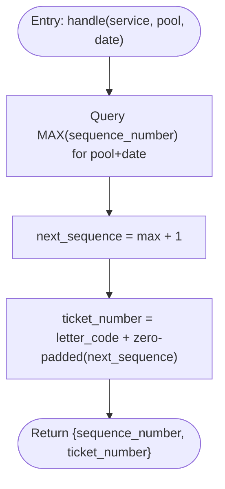
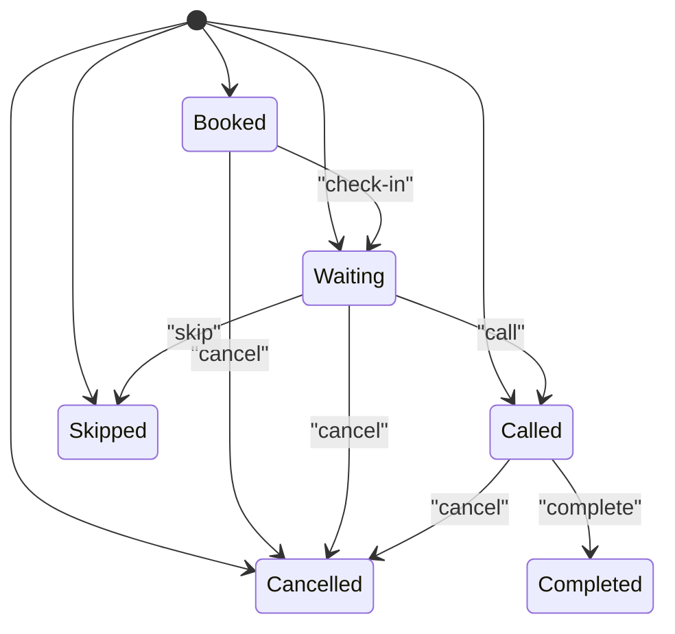
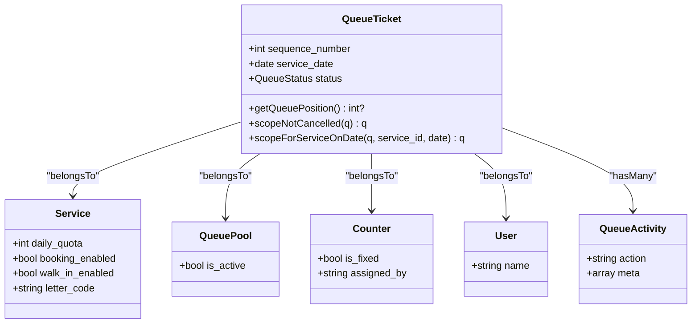
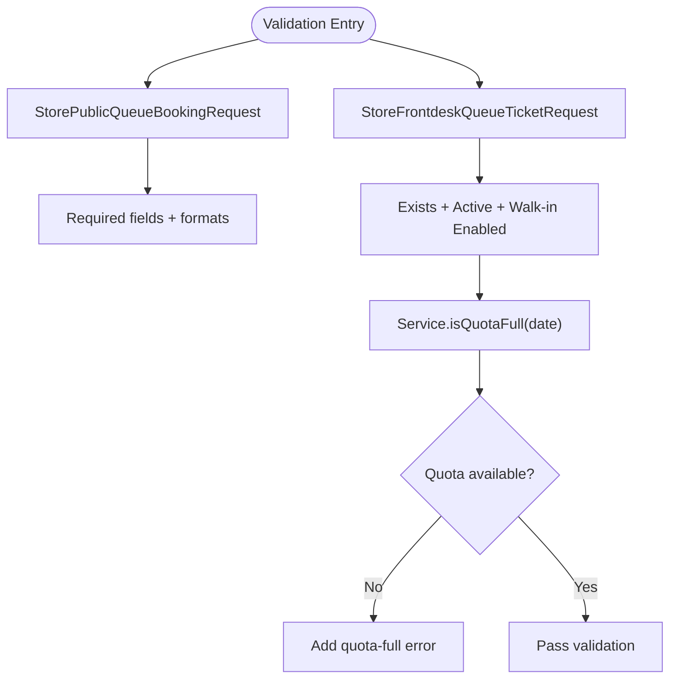
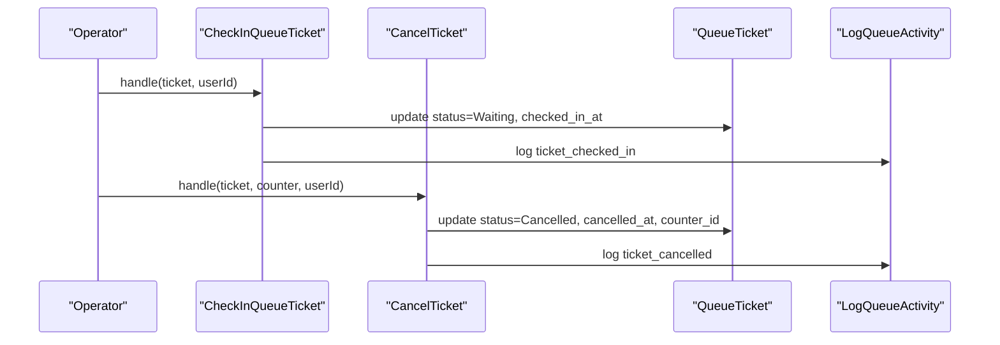
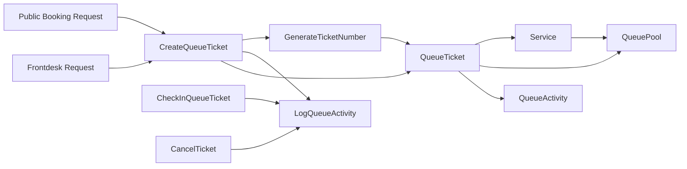

# Core Queue Operations

<cite>
**Referenced Files in This Document**
- [CreateQueueTicket.php](file://app/Actions/Queue/CreateQueueTicket.php)
- [GenerateTicketNumber.php](file://app/Actions/Queue/GenerateTicketNumber.php)
- [QueueStatus.php](file://app/Enums/QueueStatus.php)
- [QueueTicket.php](file://app/Models/QueueTicket.php)
- [Service.php](file://app/Models/Service.php)
- [QueuePool.php](file://app/Models/QueuePool.php)
- [QueueActivity.php](file://app/Models/QueueActivity.php)
- [2026_03_06_015238_create_queue_tickets_table.php](file://database/migrations/2026_03_06_015238_create_queue_tickets_table.php)
- [StorePublicQueueBookingRequest.php](file://app/Http/Requests/StorePublicQueueBookingRequest.php)
- [StoreFrontdeskQueueTicketRequest.php](file://app/Http/Requests/StoreFrontdeskQueueBookingRequest.php)
- [CheckInQueueTicket.php](file://app/Actions/Queue/CheckInQueueTicket.php)
- [CancelTicket.php](file://app/Actions/Queue/CancelTicket.php)
- [LogQueueActivity.php](file://app/Actions/Queue/LogQueueActivity.php)
- [QueueTicketFactory.php](file://database/factories/QueueTicketFactory.php)
</cite>

## Table of Contents
1. [Introduction](#introduction)
2. [Project Structure](#project-structure)
3. [Core Components](#core-components)
4. [Architecture Overview](#architecture-overview)
5. [Detailed Component Analysis](#detailed-component-analysis)
6. [Dependency Analysis](#dependency-analysis)
7. [Performance Considerations](#performance-considerations)
8. [Troubleshooting Guide](#troubleshooting-guide)
9. [Conclusion](#conclusion)

## Introduction
This document explains the core queue operations that underpin the PTSP system. It focuses on the CreateQueueTicket action, the ticket number generation strategy, the QueueStatus enumeration, and the QueueTicket model. It also covers validation rules, business constraints, typical workflows, error handling, and performance considerations for high-volume operations.

## Project Structure
The queue subsystem is organized around:
- Action classes that encapsulate domain operations (e.g., CreateQueueTicket, GenerateTicketNumber, CheckInQueueTicket, CancelTicket)
- An Enum for ticket states (QueueStatus)
- Eloquent models representing queue entities (QueueTicket, Service, QueuePool, QueueActivity)
- Validation requests ensuring data integrity
- Database migrations defining schema and constraints

**Diagram sources**
- [CreateQueueTicket.php:13-91](file://app/Actions/Queue/CreateQueueTicket.php#L13-L91)
- [GenerateTicketNumber.php:10-31](file://app/Actions/Queue/GenerateTicketNumber.php#L10-L31)
- [CheckInQueueTicket.php:11-44](file://app/Actions/Queue/CheckInQueueTicket.php#L11-L44)
- [CancelTicket.php:11-48](file://app/Actions/Queue/CancelTicket.php#L11-L48)
- [LogQueueActivity.php:8-29](file://app/Actions/Queue/LogQueueActivity.php#L8-L29)
- [QueueTicket.php:12-121](file://app/Models/QueueTicket.php#L12-L121)
- [Service.php:12-101](file://app/Models/Service.php#L12-L101)
- [QueuePool.php:9-43](file://app/Models/QueuePool.php#L9-L43)
- [QueueActivity.php:9-44](file://app/Models/QueueActivity.php#L9-L44)
- [QueueStatus.php:5-38](file://app/Enums/QueueStatus.php#L5-L38)
- [StorePublicQueueBookingRequest.php:7-46](file://app/Http/Requests/StorePublicQueueBookingRequest.php#L7-L46)
- [StoreFrontdeskQueueTicketRequest.php:9-88](file://app/Http/Requests/StoreFrontdeskQueueTicketRequest.php#L9-L88)

**Section sources**
- [CreateQueueTicket.php:13-91](file://app/Actions/Queue/CreateQueueTicket.php#L13-L91)
- [GenerateTicketNumber.php:10-31](file://app/Actions/Queue/GenerateTicketNumber.php#L10-L31)
- [QueueStatus.php:5-38](file://app/Enums/QueueStatus.php#L5-L38)
- [QueueTicket.php:12-121](file://app/Models/QueueTicket.php#L12-L121)
- [Service.php:12-101](file://app/Models/Service.php#L12-L101)
- [QueuePool.php:9-43](file://app/Models/QueuePool.php#L9-L43)
- [QueueActivity.php:9-44](file://app/Models/QueueActivity.php#L9-L44)
- [2026_03_06_015238_create_queue_tickets_table.php:14-41](file://database/migrations/2026_03_06_015238_create_queue_tickets_table.php#L14-L41)
- [StorePublicQueueBookingRequest.php:7-46](file://app/Http/Requests/StorePublicQueueBookingRequest.php#L7-L46)
- [StoreFrontdeskQueueTicketRequest.php:9-88](file://app/Http/Requests/StoreFrontdeskQueueTicketRequest.php#L9-L88)

## Core Components
- CreateQueueTicket: Orchestrates ticket creation, selects initial status based on channel, generates a unique ticket number, persists the record, and logs activity.
- GenerateTicketNumber: Computes the next sequence number per pool and date, and formats the ticket number using the service’s letter code.
- QueueStatus: Defines all ticket states and provides helpers for UI labeling and coloring.
- QueueTicket: The central model with relationships, attribute casting, scopes, and position calculation.
- Validation Requests: Enforce business rules for booking and frontdesk registration.
- QueueActivity: Tracks lifecycle events for auditability.

**Section sources**
- [CreateQueueTicket.php:13-91](file://app/Actions/Queue/CreateQueueTicket.php#L13-L91)
- [GenerateTicketNumber.php:10-31](file://app/Actions/Queue/GenerateTicketNumber.php#L10-L31)
- [QueueStatus.php:5-38](file://app/Enums/QueueStatus.php#L5-L38)
- [QueueTicket.php:12-121](file://app/Models/QueueTicket.php#L12-L121)
- [StorePublicQueueBookingRequest.php:7-46](file://app/Http/Requests/StorePublicQueueBookingRequest.php#L7-L46)
- [StoreFrontdeskQueueTicketRequest.php:9-88](file://app/Http/Requests/StoreFrontdeskQueueTicketRequest.php#L9-L88)
- [LogQueueActivity.php:8-29](file://app/Actions/Queue/LogQueueActivity.php#L8-L29)

## Architecture Overview
The queue operation pipeline integrates validation, action orchestration, persistence, and activity logging.

**Diagram sources**
- [CreateQueueTicket.php:34-89](file://app/Actions/Queue/CreateQueueTicket.php#L34-L89)
- [GenerateTicketNumber.php:15-29](file://app/Actions/Queue/GenerateTicketNumber.php#L15-L29)
- [LogQueueActivity.php:13-27](file://app/Actions/Queue/LogQueueActivity.php#L13-L27)
- [2026_03_06_015238_create_queue_tickets_table.php:14-41](file://database/migrations/2026_03_06_015238_create_queue_tickets_table.php#L14-L41)

## Detailed Component Analysis

### CreateQueueTicket Action
Responsibilities:
- Resolve Service and validate service_date
- Derive initial status from channel
- Generate unique ticket number via sequence and service letter code
- Persist QueueTicket with computed attributes
- Log activity with metadata

Key behaviors:
- Channel-to-status mapping:
  - online_booking → Booked
  - assisted_same_day, walk_in_kiosk → Waiting
  - Other channels → InvalidArgumentException
- Transactional creation ensures atomicity
- Logs a structured activity event for auditability

**Diagram sources**
- [CreateQueueTicket.php:34-89](file://app/Actions/Queue/CreateQueueTicket.php#L34-L89)

**Section sources**
- [CreateQueueTicket.php:13-91](file://app/Actions/Queue/CreateQueueTicket.php#L13-L91)

### GenerateTicketNumber Strategy
Responsibilities:
- Compute next sequence number per queue pool and service date
- Format ticket number using service letter code and zero-padded sequence

Algorithm highlights:
- Query max sequence for the given pool and date
- Increment by one for the next sequence
- Prepend service letter code and pad to four digits for uniqueness and readability

**Diagram sources**
- [GenerateTicketNumber.php:15-29](file://app/Actions/Queue/GenerateTicketNumber.php#L15-L29)

**Section sources**
- [GenerateTicketNumber.php:10-31](file://app/Actions/Queue/GenerateTicketNumber.php#L10-L31)

### QueueStatus Enumeration
States:
- Booked: Online booking
- Waiting: Walk-in or assisted check-in pending call
- Called: Being served
- Completed: Service finished
- Cancelled: Voided by policy or request
- Skipped: Not served (e.g., no-show)

Helpers:
- label(): Human-readable label per state
- color(): UI color hint per state

Transitions:
- Typical progression: Booked → Waiting → Called → Completed
- Cancellations allowed from Booked, Waiting, Called
- Skips represent non-attendance

**Diagram sources**
- [QueueStatus.php:5-38](file://app/Enums/QueueStatus.php#L5-L38)

**Section sources**
- [QueueStatus.php:5-38](file://app/Enums/QueueStatus.php#L5-L38)

### QueueTicket Model
Relationships:
- belongsTo Service
- belongsTo QueuePool
- belongsTo Counter (nullable)
- belongsTo User (created_by)
- hasMany QueueActivity

Attributes and casting:
- sequence_number integer
- service_date date
- timestamps cast to datetime
- status cast to QueueStatus enum

Business methods:
- getQueuePosition(): Computes queue position among Waiting tickets for the same pool/date
- scopeNotCancelled(): Excludes Cancelled tickets
- scopeForServiceOnDate(): Filters by service and date

Constraints:
- Unique indexes on (pool, date, sequence) and (pool, date, ticket_number)
- Indexes on (service_date, status), (pool, date, status), and (service_id, service_date)

**Diagram sources**
- [QueueTicket.php:12-121](file://app/Models/QueueTicket.php#L12-L121)
- [Service.php:12-101](file://app/Models/Service.php#L12-L101)
- [QueuePool.php:9-43](file://app/Models/QueuePool.php#L9-L43)
- [QueueActivity.php:9-44](file://app/Models/QueueActivity.php#L9-L44)

**Section sources**
- [QueueTicket.php:12-121](file://app/Models/QueueTicket.php#L12-L121)
- [2026_03_06_015238_create_queue_tickets_table.php:14-41](file://database/migrations/2026_03_06_015238_create_queue_tickets_table.php#L14-L41)

### Validation Rules and Business Constraints
Public booking validation:
- service_id exists in services
- service_date is a date within allowed range and weekday-only
- visitor_name, visitor_identifier, visitor_phone required
- visit_purpose constrained to allowed values
- notes length limited

Frontdesk validation:
- service_id exists and is active
- channel must be one of supported values
- walk-in enabled check for assisted channels
- daily quota enforcement via service.isQuotaFull()

**Diagram sources**
- [StorePublicQueueBookingRequest.php:22-33](file://app/Http/Requests/StorePublicQueueBookingRequest.php#L22-L33)
- [StoreFrontdeskQueueTicketRequest.php:24-66](file://app/Http/Requests/StoreFrontdeskQueueTicketRequest.php#L24-L66)
- [Service.php:72-99](file://app/Models/Service.php#L72-L99)

**Section sources**
- [StorePublicQueueBookingRequest.php:7-46](file://app/Http/Requests/StorePublicQueueBookingRequest.php#L7-L46)
- [StoreFrontdeskQueueTicketRequest.php:9-88](file://app/Http/Requests/StoreFrontdeskQueueTicketRequest.php#L9-L88)
- [Service.php:72-99](file://app/Models/Service.php#L72-L99)

### Additional Operations for Context
Check-in:
- Only Booked tickets can be checked in
- Transitions to Waiting and records check-in timestamp
- Logs activity with from/to status

Cancellation:
- Allowed from Booked, Waiting, Called
- Records counter_id and cancellation timestamp
- Logs activity with metadata

**Diagram sources**
- [CheckInQueueTicket.php:17-42](file://app/Actions/Queue/CheckInQueueTicket.php#L17-L42)
- [CancelTicket.php:17-47](file://app/Actions/Queue/CancelTicket.php#L17-L47)
- [LogQueueActivity.php:13-27](file://app/Actions/Queue/LogQueueActivity.php#L13-L27)

**Section sources**
- [CheckInQueueTicket.php:11-44](file://app/Actions/Queue/CheckInQueueTicket.php#L11-L44)
- [CancelTicket.php:11-48](file://app/Actions/Queue/CancelTicket.php#L11-L48)
- [LogQueueActivity.php:8-29](file://app/Actions/Queue/LogQueueActivity.php#L8-L29)

## Dependency Analysis
- CreateQueueTicket depends on:
  - GenerateTicketNumber for unique numbering
  - LogQueueActivity for audit trail
  - Service and QueuePool for context
- QueueTicket depends on:
  - Service, QueuePool, Counter, User, QueueActivity
- Validation requests depend on Service for quota checks
- Database schema enforces uniqueness and indexing for performance and correctness

**Diagram sources**
- [CreateQueueTicket.php:15-18](file://app/Actions/Queue/CreateQueueTicket.php#L15-L18)
- [GenerateTicketNumber.php:15-29](file://app/Actions/Queue/GenerateTicketNumber.php#L15-L29)
- [CheckInQueueTicket.php:13-15](file://app/Actions/Queue/CheckInQueueTicket.php#L13-L15)
- [CancelTicket.php:13-15](file://app/Actions/Queue/CancelTicket.php#L13-L15)
- [QueueTicket.php:54-77](file://app/Models/QueueTicket.php#L54-L77)
- [Service.php:43-57](file://app/Models/Service.php#L43-L57)
- [QueuePool.php:28-41](file://app/Models/QueuePool.php#L28-L41)
- [QueueActivity.php:29-42](file://app/Models/QueueActivity.php#L29-L42)
- [StorePublicQueueBookingRequest.php:22-33](file://app/Http/Requests/StorePublicQueueBookingRequest.php#L22-L33)
- [StoreFrontdeskQueueTicketRequest.php:24-66](file://app/Http/Requests/StoreFrontdeskQueueTicketRequest.php#L24-L66)

**Section sources**
- [CreateQueueTicket.php:13-91](file://app/Actions/Queue/CreateQueueTicket.php#L13-L91)
- [GenerateTicketNumber.php:10-31](file://app/Actions/Queue/GenerateTicketNumber.php#L10-L31)
- [QueueTicket.php:12-121](file://app/Models/QueueTicket.php#L12-L121)
- [Service.php:12-101](file://app/Models/Service.php#L12-L101)
- [QueuePool.php:9-43](file://app/Models/QueuePool.php#L9-L43)
- [QueueActivity.php:9-44](file://app/Models/QueueActivity.php#L9-L44)
- [StorePublicQueueBookingRequest.php:7-46](file://app/Http/Requests/StorePublicQueueBookingRequest.php#L7-L46)
- [StoreFrontdeskQueueTicketRequest.php:9-88](file://app/Http/Requests/StoreFrontdeskQueueTicketRequest.php#L9-L88)

## Performance Considerations
- Unique constraints:
  - Pool+date+sequence and pool+date+ticket_number ensure uniqueness and enable efficient lookups
  - Indexes on (service_date, status), (pool, date, status), and (service_id, service_date) optimize common queries
- Sequence generation:
  - Single MAX query per day per pool; consider partitioning or caching if contention arises
- Batch operations:
  - For high-volume booking, batch validations and use transactions judiciously
- Scopes and position calculation:
  - getQueuePosition() counts Waiting tickets; avoid frequent recalculations by caching positions or recomputing only when necessary
- Logging:
  - QueueActivity writes are synchronous; consider asynchronous logging for high throughput

[No sources needed since this section provides general guidance]

## Troubleshooting Guide
Common issues and resolutions:
- Unsupported channel during creation:
  - Cause: Channel not in supported set
  - Resolution: Use online_booking, assisted_same_day, or walk_in_kiosk
- Invalid service_id:
  - Cause: Non-existent or inactive service
  - Resolution: Select a valid, active service
- Daily quota exceeded:
  - Cause: Service.isQuotaFull(date) is true
  - Resolution: Choose another date or inform user that quota is full
- Cannot check in:
  - Cause: Ticket not in Booked status
  - Resolution: Only Booked tickets can be checked in
- Cannot cancel:
  - Cause: Ticket not in Booked/Waiting/Called
  - Resolution: Only eligible statuses can be cancelled

**Section sources**
- [CreateQueueTicket.php:42-46](file://app/Actions/Queue/CreateQueueTicket.php#L42-L46)
- [StoreFrontdeskQueueTicketRequest.php:40-66](file://app/Http/Requests/StoreFrontdeskQueueTicketRequest.php#L40-L66)
- [CheckInQueueTicket.php:19-21](file://app/Actions/Queue/CheckInQueueTicket.php#L19-L21)
- [CancelTicket.php:19-21](file://app/Actions/Queue/CancelTicket.php#L19-L21)

## Conclusion
The core queue operations are built around predictable, auditable actions with strong validation and clear state transitions. CreateQueueTicket centralizes initialization, GenerateTicketNumber guarantees unique identifiers, QueueStatus defines the state machine, and QueueTicket encapsulates relationships and constraints. Together, these components provide a robust foundation for high-volume, reliable queue management.