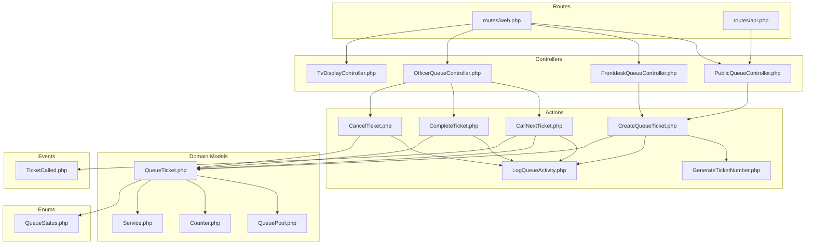
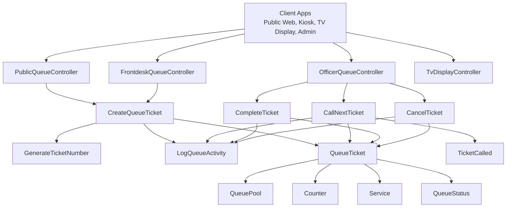
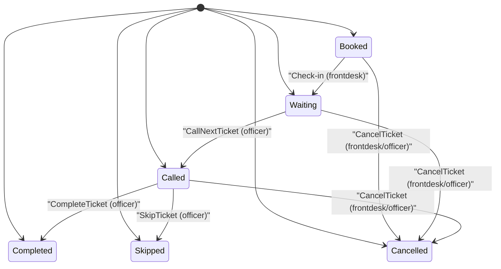
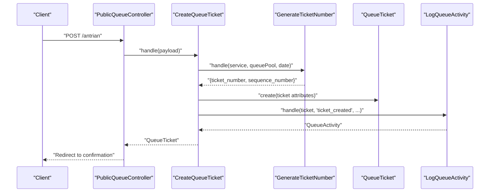
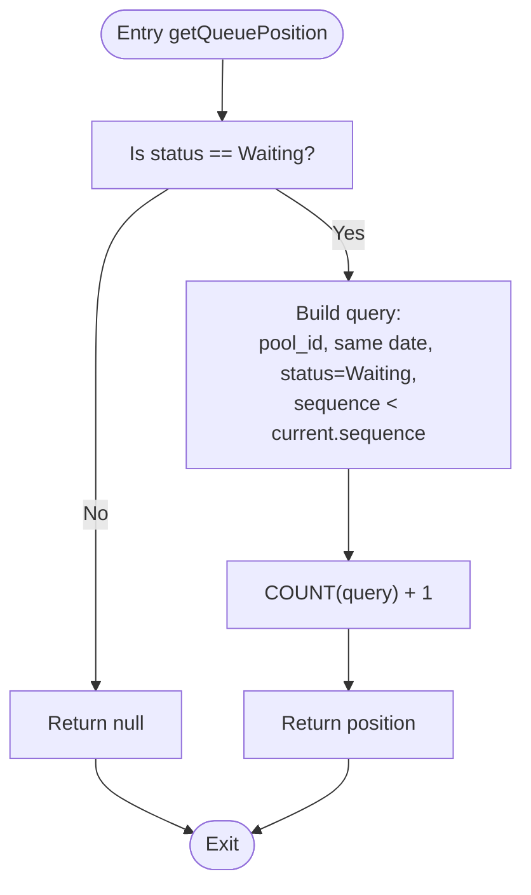
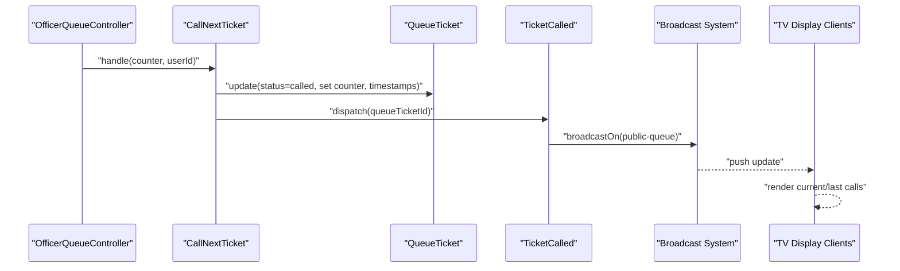
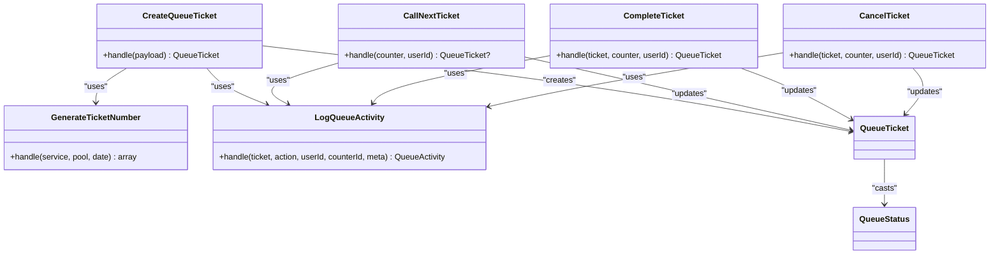
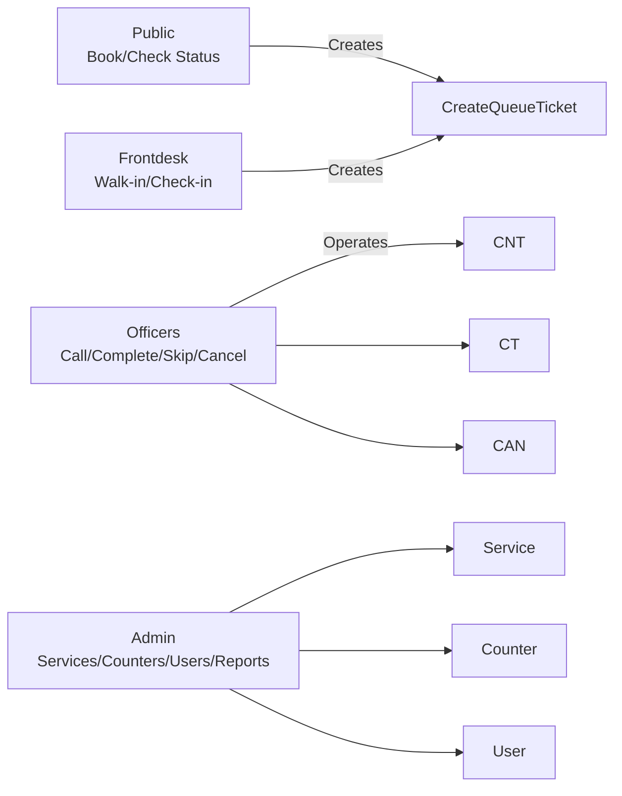
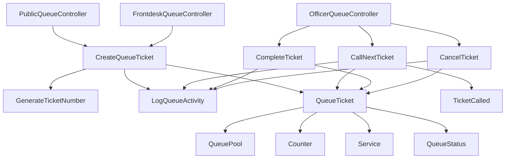

# Queue Management System

<cite>
**Referenced Files in This Document**
- [QueueStatus.php](file://app/Enums/QueueStatus.php)
- [QueueTicket.php](file://app/Models/QueueTicket.php)
- [QueuePool.php](file://app/Models/QueuePool.php)
- [Counter.php](file://app/Models/Counter.php)
- [Service.php](file://app/Models/Service.php)
- [CreateQueueTicket.php](file://app/Actions/Queue/CreateQueueTicket.php)
- [CallNextTicket.php](file://app/Actions/Queue/CallNextTicket.php)
- [CompleteTicket.php](file://app/Actions/Queue/CompleteTicket.php)
- [CancelTicket.php](file://app/Actions/Queue/CancelTicket.php)
- [GenerateTicketNumber.php](file://app/Actions/Queue/GenerateTicketNumber.php)
- [LogQueueActivity.php](file://app/Actions/Queue/LogQueueActivity.php)
- [TicketCalled.php](file://app/Events/TicketCalled.php)
- [web.php](file://routes/web.php)
- [api.php](file://routes/api.php)
- [PublicQueueController.php](file://app/Http/Controllers/PublicQueueController.php)
- [FrontdeskQueueController.php](file://app/Http/Controllers/FrontdeskQueueController.php)
- [OfficerQueueController.php](file://app/Http/Controllers/OfficerQueueController.php)
- [TvDisplayController.php](file://app/Http/Controllers/TvDisplayController.php)
</cite>

## Table of Contents
1. [Introduction](#introduction)
2. [Project Structure](#project-structure)
3. [Core Components](#core-components)
4. [Architecture Overview](#architecture-overview)
5. [Detailed Component Analysis](#detailed-component-analysis)
6. [Dependency Analysis](#dependency-analysis)
7. [Performance Considerations](#performance-considerations)
8. [Troubleshooting Guide](#troubleshooting-guide)
9. [Conclusion](#conclusion)

## Introduction
This document describes the PTSP Queue Management System, focusing on queue operations, status management, position calculation, and real-time updates. It documents the action classes that encapsulate business logic for queue operations, the queue status enumeration and state transitions, the event-driven architecture for real-time updates across public web, kiosk, TV display, and administrative interfaces, and the workflow patterns for different user roles (frontdesk, officers, administrators). It also covers performance optimization, concurrency handling, and error recovery mechanisms.

## Project Structure
The system is organized around:
- Models representing domain entities (QueueTicket, QueuePool, Counter, Service)
- Enumerations for statuses and roles
- Action classes implementing business logic for queue operations
- Controllers orchestrating requests and delegating to actions
- Routes defining endpoints for public, officer, kiosk, TV display, and admin modules
- Broadcasting events for real-time updates

**Diagram sources**
- [web.php:1-127](file://routes/web.php#L1-L127)
- [api.php:1-23](file://routes/api.php#L1-L23)
- [PublicQueueController.php:1-110](file://app/Http/Controllers/PublicQueueController.php#L1-L110)
- [FrontdeskQueueController.php:1-89](file://app/Http/Controllers/FrontdeskQueueController.php#L1-L89)
- [OfficerQueueController.php:1-96](file://app/Http/Controllers/OfficerQueueController.php#L1-L96)
- [TvDisplayController.php:1-144](file://app/Http/Controllers/TvDisplayController.php#L1-L144)
- [CreateQueueTicket.php:1-91](file://app/Actions/Queue/CreateQueueTicket.php#L1-L91)
- [GenerateTicketNumber.php:1-31](file://app/Actions/Queue/GenerateTicketNumber.php#L1-L31)
- [LogQueueActivity.php:1-29](file://app/Actions/Queue/LogQueueActivity.php#L1-L29)
- [CallNextTicket.php:1-80](file://app/Actions/Queue/CallNextTicket.php#L1-L80)
- [CompleteTicket.php:1-49](file://app/Actions/Queue/CompleteTicket.php#L1-L49)
- [CancelTicket.php:1-48](file://app/Actions/Queue/CancelTicket.php#L1-L48)
- [QueueTicket.php:1-121](file://app/Models/QueueTicket.php#L1-L121)
- [QueuePool.php:1-43](file://app/Models/QueuePool.php#L1-L43)
- [Counter.php:1-53](file://app/Models/Counter.php#L1-L53)
- [Service.php:1-101](file://app/Models/Service.php#L1-L101)
- [QueueStatus.php:1-38](file://app/Enums/QueueStatus.php#L1-L38)
- [TicketCalled.php:1-34](file://app/Events/TicketCalled.php#L1-L34)

**Section sources**
- [web.php:1-127](file://routes/web.php#L1-L127)
- [api.php:1-23](file://routes/api.php#L1-L23)

## Core Components
- QueueStatus: Enumeration defining lifecycle states and helpers for labels/colors.
- QueueTicket: Domain model with fillable attributes, casts, relations, position calculation, and query scopes.
- QueuePool: Pool grouping counters and services.
- Counter: Physical or logical service counters.
- Service: Service offering with quotas and availability.
- Action classes: Encapsulate business logic for queue operations.
- Controllers: Expose endpoints and orchestrate actions.
- Event: TicketCalled broadcasts real-time updates.

**Section sources**
- [QueueStatus.php:1-38](file://app/Enums/QueueStatus.php#L1-L38)
- [QueueTicket.php:1-121](file://app/Models/QueueTicket.php#L1-L121)
- [QueuePool.php:1-43](file://app/Models/QueuePool.php#L1-L43)
- [Counter.php:1-53](file://app/Models/Counter.php#L1-L53)
- [Service.php:1-101](file://app/Models/Service.php#L1-L101)

## Architecture Overview
The system follows a layered architecture:
- Presentation: Controllers expose endpoints for public, frontdesk, officer, kiosk, TV display, and admin modules.
- Application: Action classes encapsulate business logic and coordinate model updates and logging.
- Domain: Eloquent models define relations, scopes, and calculations.
- Infrastructure: Broadcasting via events for real-time updates; throttling middleware for rate limits.

**Diagram sources**
- [PublicQueueController.php:1-110](file://app/Http/Controllers/PublicQueueController.php#L1-L110)
- [FrontdeskQueueController.php:1-89](file://app/Http/Controllers/FrontdeskQueueController.php#L1-L89)
- [OfficerQueueController.php:1-96](file://app/Http/Controllers/OfficerQueueController.php#L1-L96)
- [TvDisplayController.php:1-144](file://app/Http/Controllers/TvDisplayController.php#L1-L144)
- [CreateQueueTicket.php:1-91](file://app/Actions/Queue/CreateQueueTicket.php#L1-L91)
- [CallNextTicket.php:1-80](file://app/Actions/Queue/CallNextTicket.php#L1-L80)
- [CompleteTicket.php:1-49](file://app/Actions/Queue/CompleteTicket.php#L1-L49)
- [CancelTicket.php:1-48](file://app/Actions/Queue/CancelTicket.php#L1-L48)
- [GenerateTicketNumber.php:1-31](file://app/Actions/Queue/GenerateTicketNumber.php#L1-L31)
- [LogQueueActivity.php:1-29](file://app/Actions/Queue/LogQueueActivity.php#L1-L29)
- [QueueTicket.php:1-121](file://app/Models/QueueTicket.php#L1-L121)
- [QueuePool.php:1-43](file://app/Models/QueuePool.php#L1-L43)
- [Counter.php:1-53](file://app/Models/Counter.php#L1-L53)
- [Service.php:1-101](file://app/Models/Service.php#L1-L101)
- [QueueStatus.php:1-38](file://app/Enums/QueueStatus.php#L1-L38)
- [TicketCalled.php:1-34](file://app/Events/TicketCalled.php#L1-L34)

## Detailed Component Analysis

### Queue Status and Transitions
QueueStatus defines the lifecycle states and provides helpers for UI labeling and coloring. The state machine governs valid transitions enforced by action classes.

**Diagram sources**
- [QueueStatus.php:1-38](file://app/Enums/QueueStatus.php#L1-L38)
- [CallNextTicket.php:1-80](file://app/Actions/Queue/CallNextTicket.php#L1-L80)
- [CompleteTicket.php:1-49](file://app/Actions/Queue/CompleteTicket.php#L1-L49)
- [CancelTicket.php:1-48](file://app/Actions/Queue/CancelTicket.php#L1-L48)

**Section sources**
- [QueueStatus.php:1-38](file://app/Enums/QueueStatus.php#L1-L38)

### Ticket Generation Workflow
Ticket creation depends on channel selection and numbering logic. The process ensures uniqueness and proper status assignment.

**Diagram sources**
- [PublicQueueController.php:39-56](file://app/Http/Controllers/PublicQueueController.php#L39-L56)
- [CreateQueueTicket.php:34-89](file://app/Actions/Queue/CreateQueueTicket.php#L34-L89)
- [GenerateTicketNumber.php:15-29](file://app/Actions/Queue/GenerateTicketNumber.php#L15-L29)
- [LogQueueActivity.php:13-27](file://app/Actions/Queue/LogQueueActivity.php#L13-L27)
- [QueueTicket.php:17-52](file://app/Models/QueueTicket.php#L17-L52)

**Section sources**
- [CreateQueueTicket.php:1-91](file://app/Actions/Queue/CreateQueueTicket.php#L1-L91)
- [GenerateTicketNumber.php:1-31](file://app/Actions/Queue/GenerateTicketNumber.php#L1-L31)

### Position Calculation Logic
Queue position is computed for tickets in the Waiting state within the same queue pool and service date.

**Diagram sources**
- [QueueTicket.php:82-94](file://app/Models/QueueTicket.php#L82-L94)

**Section sources**
- [QueueTicket.php:82-94](file://app/Models/QueueTicket.php#L82-L94)

### Real-Time Updates via Events
When a ticket is called, a domain event is dispatched and broadcasted to subscribed clients (e.g., TV displays).

**Diagram sources**
- [OfficerQueueController.php:40-49](file://app/Http/Controllers/OfficerQueueController.php#L40-L49)
- [CallNextTicket.php:19-78](file://app/Actions/Queue/CallNextTicket.php#L19-L78)
- [TicketCalled.php:11-34](file://app/Events/TicketCalled.php#L11-L34)
- [TvDisplayController.php:89-142](file://app/Http/Controllers/TvDisplayController.php#L89-L142)

**Section sources**
- [TicketCalled.php:1-34](file://app/Events/TicketCalled.php#L1-L34)
- [TvDisplayController.php:89-142](file://app/Http/Controllers/TvDisplayController.php#L89-L142)

### Action Classes Overview
- CreateQueueTicket: Validates channel, computes numbering, persists ticket, logs activity.
- CallNextTicket: Selects next Waiting ticket in pool/date order, applies locks, sets Called, logs, dispatches event.
- CompleteTicket: Validates Called state, marks Completed, logs.
- CancelTicket: Validates eligible states, marks Cancelled, logs.

**Diagram sources**
- [CreateQueueTicket.php:1-91](file://app/Actions/Queue/CreateQueueTicket.php#L1-L91)
- [CallNextTicket.php:1-80](file://app/Actions/Queue/CallNextTicket.php#L1-L80)
- [CompleteTicket.php:1-49](file://app/Actions/Queue/CompleteTicket.php#L1-L49)
- [CancelTicket.php:1-48](file://app/Actions/Queue/CancelTicket.php#L1-L48)
- [GenerateTicketNumber.php:1-31](file://app/Actions/Queue/GenerateTicketNumber.php#L1-L31)
- [LogQueueActivity.php:1-29](file://app/Actions/Queue/LogQueueActivity.php#L1-L29)
- [QueueTicket.php:1-121](file://app/Models/QueueTicket.php#L1-L121)
- [QueueStatus.php:1-38](file://app/Enums/QueueStatus.php#L1-L38)

**Section sources**
- [CreateQueueTicket.php:1-91](file://app/Actions/Queue/CreateQueueTicket.php#L1-L91)
- [CallNextTicket.php:1-80](file://app/Actions/Queue/CallNextTicket.php#L1-L80)
- [CompleteTicket.php:1-49](file://app/Actions/Queue/CompleteTicket.php#L1-L49)
- [CancelTicket.php:1-48](file://app/Actions/Queue/CancelTicket.php#L1-L48)

### Role-Based Workflows and Responsibilities
- Public: Book online, check status, see position calculation.
- Frontdesk: Create walk-in tickets, check-in online bookings.
- Officers: Call next, recall, skip, complete, cancel tickets.
- Administrators: Manage services, counters, users, reports.

**Diagram sources**
- [PublicQueueController.php:1-110](file://app/Http/Controllers/PublicQueueController.php#L1-L110)
- [FrontdeskQueueController.php:1-89](file://app/Http/Controllers/FrontdeskQueueController.php#L1-L89)
- [OfficerQueueController.php:1-96](file://app/Http/Controllers/OfficerQueueController.php#L1-L96)
- [Service.php:1-101](file://app/Models/Service.php#L1-L101)
- [Counter.php:1-53](file://app/Models/Counter.php#L1-L53)

**Section sources**
- [web.php:28-90](file://routes/web.php#L28-L90)

### API Endpoints and Throttling
Public APIs for services and queue lookups are rate-limited to protect system resources.

- GET /api/services, /api/services/{slug}
- GET /api/queue/lookup
- GET /api/queue/ticket-by-id/{encryptedId}
- POST /api/queue/booking

**Section sources**
- [api.php:1-23](file://routes/api.php#L1-L23)

## Dependency Analysis
The system exhibits clear separation of concerns:
- Controllers depend on Actions for business logic.
- Actions depend on Models and shared utilities.
- Models encapsulate relations and calculations.
- Events decouple real-time updates from core operations.

**Diagram sources**
- [PublicQueueController.php:1-110](file://app/Http/Controllers/PublicQueueController.php#L1-L110)
- [FrontdeskQueueController.php:1-89](file://app/Http/Controllers/FrontdeskQueueController.php#L1-L89)
- [OfficerQueueController.php:1-96](file://app/Http/Controllers/OfficerQueueController.php#L1-L96)
- [CreateQueueTicket.php:1-91](file://app/Actions/Queue/CreateQueueTicket.php#L1-L91)
- [CallNextTicket.php:1-80](file://app/Actions/Queue/CallNextTicket.php#L1-L80)
- [CompleteTicket.php:1-49](file://app/Actions/Queue/CompleteTicket.php#L1-L49)
- [CancelTicket.php:1-48](file://app/Actions/Queue/CancelTicket.php#L1-L48)
- [GenerateTicketNumber.php:1-31](file://app/Actions/Queue/GenerateTicketNumber.php#L1-L31)
- [LogQueueActivity.php:1-29](file://app/Actions/Queue/LogQueueActivity.php#L1-L29)
- [QueueTicket.php:1-121](file://app/Models/QueueTicket.php#L1-L121)
- [QueuePool.php:1-43](file://app/Models/QueuePool.php#L1-L43)
- [Counter.php:1-53](file://app/Models/Counter.php#L1-L53)
- [Service.php:1-101](file://app/Models/Service.php#L1-L101)
- [QueueStatus.php:1-38](file://app/Enums/QueueStatus.php#L1-L38)
- [TicketCalled.php:1-34](file://app/Events/TicketCalled.php#L1-L34)

**Section sources**
- [QueueTicket.php:1-121](file://app/Models/QueueTicket.php#L1-L121)
- [QueuePool.php:1-43](file://app/Models/QueuePool.php#L1-L43)
- [Counter.php:1-53](file://app/Models/Counter.php#L1-L53)
- [Service.php:1-101](file://app/Models/Service.php#L1-L101)

## Performance Considerations
- Concurrency control: CallNextTicket uses row-level locking to prevent race conditions when selecting the next ticket.
- Indexing: QueueTicket includes scopes and filters by pool, date, and status; ensure appropriate database indexes exist for performance.
- Caching: TV display API caches video assets to reduce repeated disk reads.
- Rate limiting: Routes include throttle middleware to mitigate abuse.
- Batch operations: Prefer bulk operations where applicable to reduce round-trips.

[No sources needed since this section provides general guidance]

## Troubleshooting Guide
Common issues and recovery steps:
- Invalid state transitions: Actions validate preconditions (e.g., only Called tickets can be completed). Errors indicate incorrect workflow usage.
- Authorization failures: Officer actions enforce pool/counter alignment and officer permissions; ensure the actor belongs to the correct pool and has required roles.
- Missing or invalid tickets: Controllers use fail-fast lookups; verify identifiers and dates.
- Broadcast connectivity: Ensure broadcasting configuration supports the public-queue channel for real-time updates.

**Section sources**
- [CompleteTicket.php:17-21](file://app/Actions/Queue/CompleteTicket.php#L17-L21)
- [OfficerQueueController.php:91-94](file://app/Http/Controllers/OfficerQueueController.php#L91-L94)
- [TicketCalled.php:27-32](file://app/Events/TicketCalled.php#L27-L32)

## Conclusion
The PTSP Queue Management System cleanly separates presentation, application, and domain layers. Action classes encapsulate queue operations with explicit validations and logging, while events enable real-time updates across interfaces. Role-based controllers and strict state transitions ensure predictable behavior. Performance is addressed through concurrency controls, caching, and throttling, with clear pathways for further optimization.