# Real-time Broadcasting System

<cite>
**Referenced Files in This Document**
- [TicketCalled.php](file://app/Events/TicketCalled.php)
- [LogQueueActivity.php](file://app/Actions/Queue/LogQueueActivity.php)
- [reverb.php](file://config/reverb.php)
- [broadcasting.php](file://config/broadcasting.php)
- [channels.php](file://routes/channels.php)
- [echo.js](file://resources/js/echo.js)
- [app.js](file://resources/js/app.js)
- [PublicQueueController.php](file://app/Http/Controllers/PublicQueueController.php)
- [KioskController.php](file://app/Http/Controllers/KioskController.php)
- [TvDisplayController.php](file://app/Http/Controllers/TvDisplayController.php)
- [TvDisplay.php](file://app/Livewire/TvDisplay.php)
</cite>

## Table of Contents
1. [Introduction](#introduction)
2. [Project Structure](#project-structure)
3. [Core Components](#core-components)
4. [Architecture Overview](#architecture-overview)
5. [Detailed Component Analysis](#detailed-component-analysis)
6. [Dependency Analysis](#dependency-analysis)
7. [Performance Considerations](#performance-considerations)
8. [Troubleshooting Guide](#troubleshooting-guide)
9. [Conclusion](#conclusion)

## Introduction
This document describes the real-time broadcasting system that synchronizes queue interfaces across the application. It focuses on the TicketCalled event, the LogQueueActivity action for audit trails, Laravel Reverb configuration, WebSocket connections, and message routing. It also documents end-to-end workflows for public web, kiosk, TV display, and administrative interfaces, along with connection management, error handling, message queuing, performance optimization, and client-side integration using Echo.js.

## Project Structure
The real-time system spans backend event and action classes, configuration files for broadcasting and Reverb, route channels, and frontend integration via Echo.js. Livewire components subscribe to events and update UI reactively.

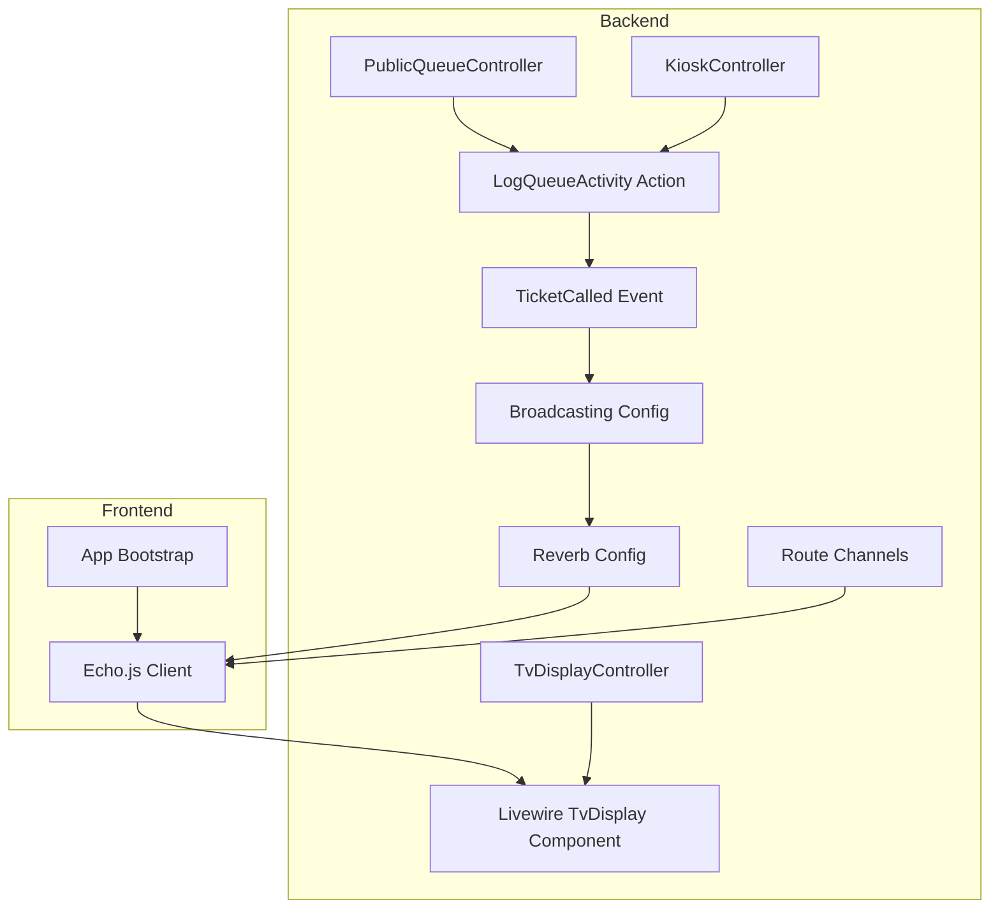

**Diagram sources**
- [TicketCalled.php:11-33](file://app/Events/TicketCalled.php#L11-L33)
- [LogQueueActivity.php:8-28](file://app/Actions/Queue/LogQueueActivity.php#L8-L28)
- [broadcasting.php:31-47](file://config/broadcasting.php#L31-L47)
- [reverb.php:29-57](file://config/reverb.php#L29-L57)
- [channels.php:5-7](file://routes/channels.php#L5-L7)
- [PublicQueueController.php:39-56](file://app/Http/Controllers/PublicQueueController.php#L39-L56)
- [KioskController.php:114-142](file://app/Http/Controllers/KioskController.php#L114-L142)
- [TvDisplayController.php:89-142](file://app/Http/Controllers/TvDisplayController.php#L89-L142)
- [TvDisplay.php:22-27](file://app/Livewire/TvDisplay.php#L22-L27)
- [echo.js:6-14](file://resources/js/echo.js#L6-L14)
- [app.js:9](file://resources/js/app.js#L9)

**Section sources**
- [broadcasting.php:18](file://config/broadcasting.php#L18)
- [reverb.php:16](file://config/reverb.php#L16)
- [channels.php:5-7](file://routes/channels.php#L5-L7)

## Core Components
- TicketCalled event: Defines the payload and broadcast channel for queue announcements.
- LogQueueActivity action: Persists audit trail entries for queue operations.
- Reverb and broadcasting configs: Configure transport, TLS, rate limiting, and scaling.
- Route channels: Secure per-user private channels.
- Client-side Echo integration: Establishes WebSocket connections and subscribes to channels.
- Livewire TvDisplay component: Subscribes to events and drives UI updates and TTS announcements.

**Section sources**
- [TicketCalled.php:18-32](file://app/Events/TicketCalled.php#L18-L32)
- [LogQueueActivity.php:13-27](file://app/Actions/Queue/LogQueueActivity.php#L13-L27)
- [broadcasting.php:33-47](file://config/broadcasting.php#L33-L47)
- [reverb.php:31-57](file://config/reverb.php#L31-L57)
- [channels.php:5-7](file://routes/channels.php#L5-L7)
- [echo.js:6-14](file://resources/js/echo.js#L6-L14)
- [TvDisplay.php:22-27](file://app/Livewire/TvDisplay.php#L22-L27)

## Architecture Overview
The system uses Laravel Reverb as the WebSocket server and Laravel Echo on the client to subscribe to channels. When a queue operation occurs, an action persists activity and fires the TicketCalled event. The event broadcasts to the public channel, and Livewire components re-render automatically.

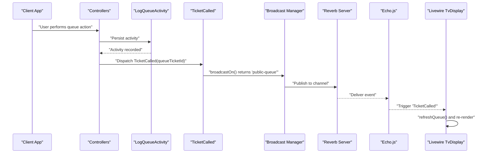

**Diagram sources**
- [PublicQueueController.php:39-56](file://app/Http/Controllers/PublicQueueController.php#L39-L56)
- [KioskController.php:114-142](file://app/Http/Controllers/KioskController.php#L114-L142)
- [LogQueueActivity.php:13-27](file://app/Actions/Queue/LogQueueActivity.php#L13-L27)
- [TicketCalled.php:18-32](file://app/Events/TicketCalled.php#L18-L32)
- [broadcasting.php:33-47](file://config/broadcasting.php#L33-L47)
- [reverb.php:31-57](file://config/reverb.php#L31-L57)
- [echo.js:6-14](file://resources/js/echo.js#L6-L14)
- [TvDisplay.php:22-27](file://app/Livewire/TvDisplay.php#L22-L27)

## Detailed Component Analysis

### TicketCalled Event
- Purpose: Announces that a queue ticket has been called.
- Payload: queueTicketId (integer identifier).
- Broadcast channel: public-queue.
- Timing: ShouldBroadcastNow ensures immediate delivery without queueing.

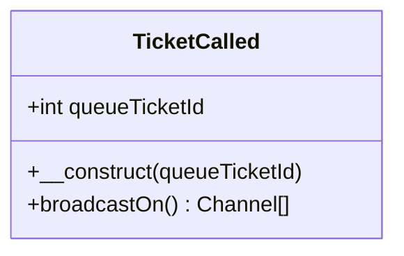

**Diagram sources**
- [TicketCalled.php:11-33](file://app/Events/TicketCalled.php#L11-L33)

**Section sources**
- [TicketCalled.php:18-32](file://app/Events/TicketCalled.php#L18-L32)

### LogQueueActivity Action
- Purpose: Creates a persistent audit trail for queue operations.
- Inputs: QueueTicket, action string, optional user and counter identifiers, optional metadata.
- Output: QueueActivity model instance.

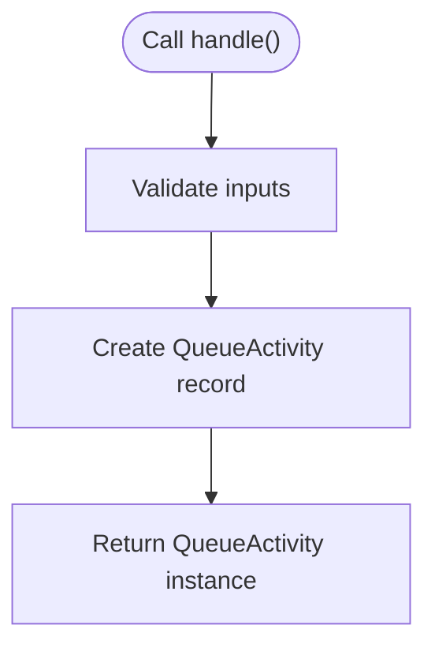

**Diagram sources**
- [LogQueueActivity.php:8-28](file://app/Actions/Queue/LogQueueActivity.php#L8-L28)

**Section sources**
- [LogQueueActivity.php:13-27](file://app/Actions/Queue/LogQueueActivity.php#L13-L27)

### Laravel Reverb Configuration
- Driver selection: reverb configured as the default and primary broadcaster.
- Server options: host, port, path, hostname, TLS options, max request size.
- Scaling: Redis-backed clustering with URL/host/port/username/password/database/timeout.
- Application options: host, port, scheme/useTLS, allowed origins, ping interval, activity timeout, max connections, max message size, client event acceptance policy, rate limiting.
- Pulse and Telescope ingest intervals configurable.

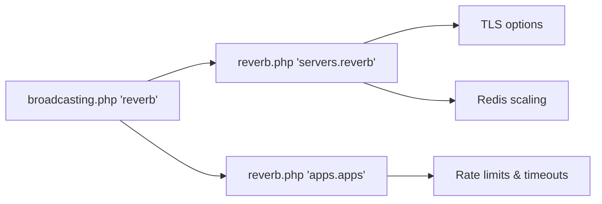

**Diagram sources**
- [broadcasting.php:33-47](file://config/broadcasting.php#L33-L47)
- [reverb.php:29-57](file://config/reverb.php#L29-L57)
- [reverb.php:70-99](file://config/reverb.php#L70-L99)

**Section sources**
- [broadcasting.php:18](file://config/broadcasting.php#L18)
- [broadcasting.php:33-47](file://config/broadcasting.php#L33-L47)
- [reverb.php:31-57](file://config/reverb.php#L31-L57)
- [reverb.php:70-99](file://config/reverb.php#L70-L99)

### Route Channels
- Private user channel: App.Models.User.{id} validates that only the matching user may listen.
- Public channel: The 'public-queue' channel is used by the TicketCalled event.

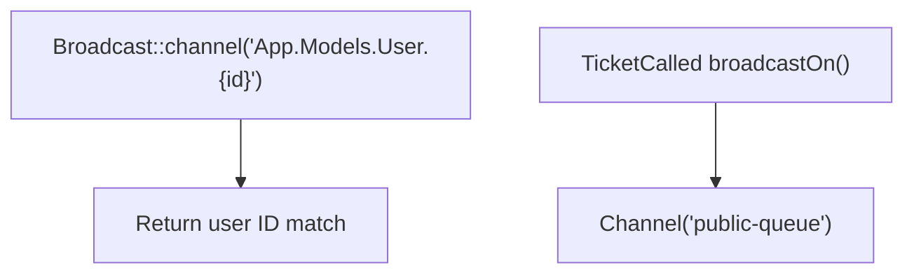

**Diagram sources**
- [channels.php:5-7](file://routes/channels.php#L5-L7)
- [TicketCalled.php:27-32](file://app/Events/TicketCalled.php#L27-L32)

**Section sources**
- [channels.php:5-7](file://routes/channels.php#L5-L7)
- [TicketCalled.php:27-32](file://app/Events/TicketCalled.php#L27-L32)

### Client-side Integration with Echo.js
- Echo initialization sets broadcaster to reverb, key, host, ports, TLS mode, and transports.
- App bootstrap imports Echo to enable global subscription.
- Livewire component listens for echo:public-queue,TicketCalled and triggers a re-render.

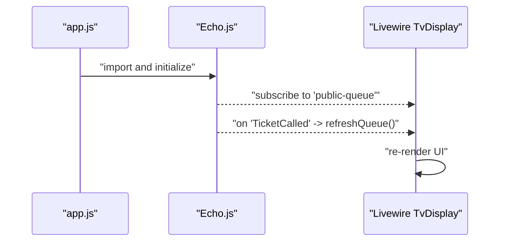

**Diagram sources**
- [app.js:9](file://resources/js/app.js#L9)
- [echo.js:6-14](file://resources/js/echo.js#L6-L14)
- [TvDisplay.php:22-27](file://app/Livewire/TvDisplay.php#L22-L27)

**Section sources**
- [echo.js:6-14](file://resources/js/echo.js#L6-L14)
- [TvDisplay.php:22-27](file://app/Livewire/TvDisplay.php#L22-L27)

### End-to-End Workflows

#### Public Web Booking and Confirmation
- The public booking flow creates a ticket and redirects to a confirmation page.
- Activity is logged via LogQueueActivity.
- The TicketCalled event is dispatched when a ticket is called, broadcasting to public-queue.
- Livewire components on the TV display re-render to reflect the latest state.

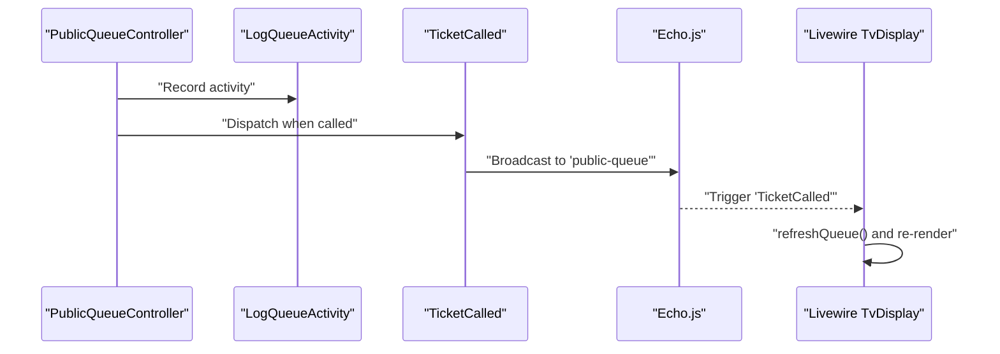

**Diagram sources**
- [PublicQueueController.php:39-56](file://app/Http/Controllers/PublicQueueController.php#L39-L56)
- [LogQueueActivity.php:13-27](file://app/Actions/Queue/LogQueueActivity.php#L13-L27)
- [TicketCalled.php:18-32](file://app/Events/TicketCalled.php#L18-L32)
- [TvDisplay.php:22-27](file://app/Livewire/TvDisplay.php#L22-L27)

#### Kiosk Walk-in Registration
- The kiosk prints a ticket for walk-in registrations.
- Activity is logged and the TicketCalled event is dispatched when the ticket is called.
- TV display updates accordingly.

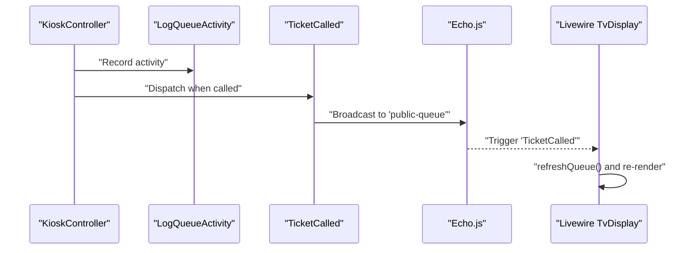

**Diagram sources**
- [KioskController.php:114-142](file://app/Http/Controllers/KioskController.php#L114-L142)
- [LogQueueActivity.php:13-27](file://app/Actions/Queue/LogQueueActivity.php#L13-L27)
- [TicketCalled.php:18-32](file://app/Events/TicketCalled.php#L18-L32)
- [TvDisplay.php:22-27](file://app/Livewire/TvDisplay.php#L22-L27)

#### TV Display Interface
- The TV display controller serves an API endpoint returning current and recent calls.
- The Livewire component subscribes to the public channel and reacts to TicketCalled events.
- It also manages TTS announcements based on the latest call.

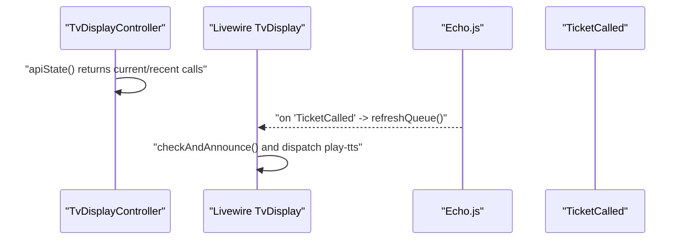

**Diagram sources**
- [TvDisplayController.php:89-142](file://app/Http/Controllers/TvDisplayController.php#L89-L142)
- [TvDisplay.php:22-27](file://app/Livewire/TvDisplay.php#L22-L27)
- [TvDisplay.php:41-68](file://app/Livewire/TvDisplay.php#L41-L68)

## Dependency Analysis
- Controllers depend on LogQueueActivity to persist audit trails.
- LogQueueActivity depends on QueueActivity and QueueTicket models.
- TicketCalled depends on broadcasting configuration and Reverb server.
- Livewire TvDisplay depends on Echo.js and the public channel.
- Route channels secure private channels; public channel is used by TicketCalled.

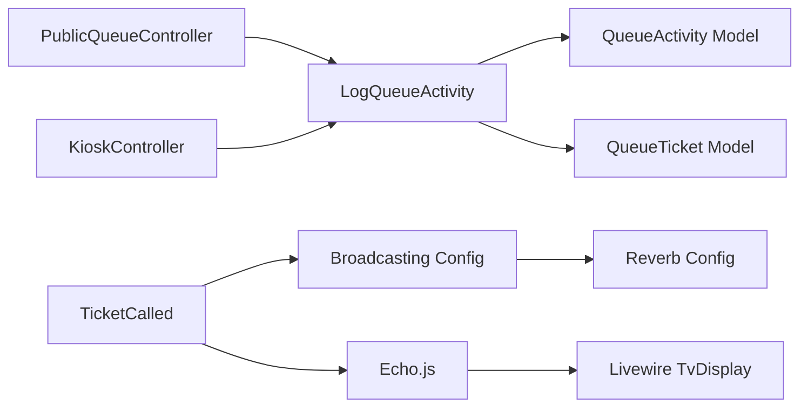

**Diagram sources**
- [PublicQueueController.php:39-56](file://app/Http/Controllers/PublicQueueController.php#L39-L56)
- [KioskController.php:114-142](file://app/Http/Controllers/KioskController.php#L114-L142)
- [LogQueueActivity.php:8-28](file://app/Actions/Queue/LogQueueActivity.php#L8-L28)
- [TicketCalled.php:18-32](file://app/Events/TicketCalled.php#L18-L32)
- [broadcasting.php:33-47](file://config/broadcasting.php#L33-L47)
- [reverb.php:29-57](file://config/reverb.php#L29-L57)
- [echo.js:6-14](file://resources/js/echo.js#L6-L14)
- [TvDisplay.php:22-27](file://app/Livewire/TvDisplay.php#L22-L27)

**Section sources**
- [broadcasting.php:33-47](file://config/broadcasting.php#L33-L47)
- [reverb.php:31-57](file://config/reverb.php#L31-L57)
- [TicketCalled.php:27-32](file://app/Events/TicketCalled.php#L27-L32)

## Performance Considerations
- Use ShouldBroadcastNow for immediate delivery of TicketCalled to avoid queueing delays.
- Tune Reverb server options: adjust max_request_size, scaling Redis settings, and pulse/telescope ingest intervals.
- Apply rate limiting at the application level to prevent flooding.
- Cache heavy TV display data (e.g., video assets) to reduce repeated disk reads.
- Minimize payload size by sending only essential fields in event payloads.
- Use Livewire’s reactive rendering to avoid full-page reloads.

[No sources needed since this section provides general guidance]

## Troubleshooting Guide
- Verify broadcasting driver and Reverb server configuration.
- Confirm Echo client options match server host, port, scheme, and TLS settings.
- Ensure the public-queue channel is reachable and not blocked by firewall or proxy.
- Check that controllers call LogQueueActivity prior to dispatching TicketCalled.
- Validate Livewire component subscription to echo:public-queue,TicketCalled.
- Inspect Reverb logs and Pulse/Telescope metrics for connection health and throughput.

**Section sources**
- [broadcasting.php:18](file://config/broadcasting.php#L18)
- [reverb.php:31-57](file://config/reverb.php#L31-L57)
- [echo.js:6-14](file://resources/js/echo.js#L6-L14)
- [TvDisplay.php:22-27](file://app/Livewire/TvDisplay.php#L22-L27)

## Conclusion
The real-time broadcasting system leverages Laravel Reverb and Echo.js to synchronize queue interfaces. The TicketCalled event and LogQueueActivity action form the backbone of live updates and auditability. Proper configuration of broadcasting and Reverb, combined with efficient client-side handling in Livewire, delivers responsive, scalable real-time experiences across public, kiosk, and TV display interfaces.