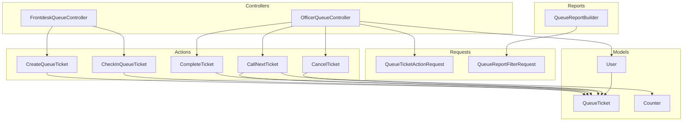
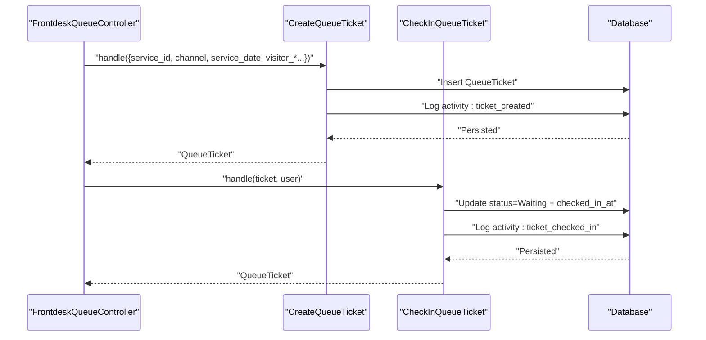
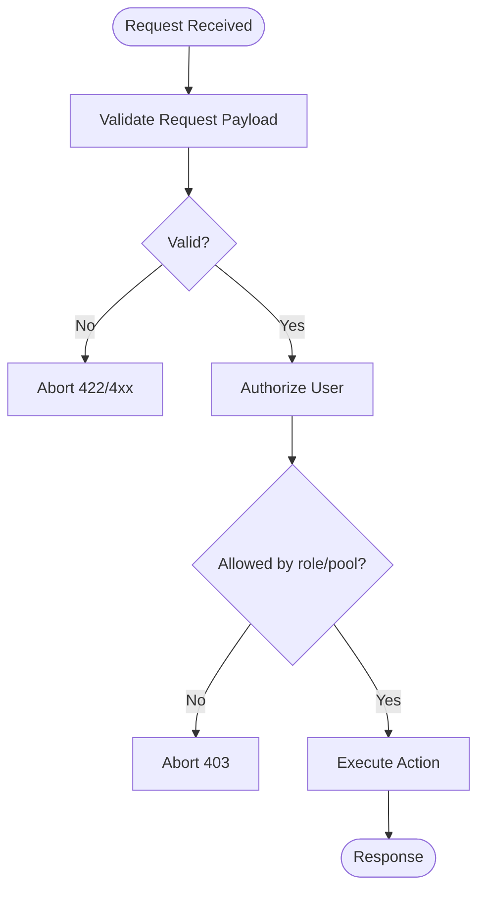
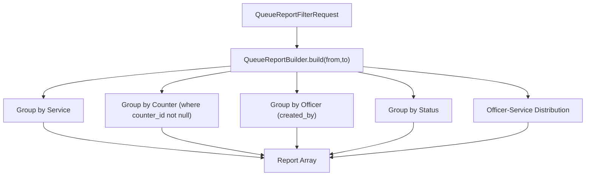
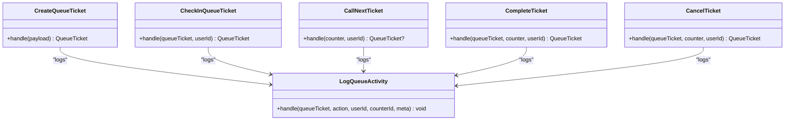
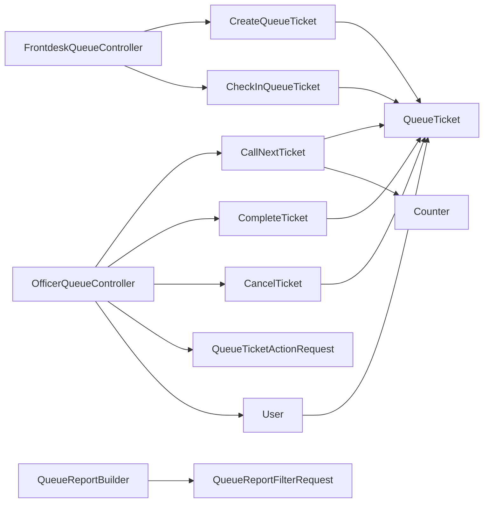

# Role-specific Queue Workflows

<cite>
**Referenced Files in This Document**
- [UserRole.php](file://app/Enums/UserRole.php)
- [FrontdeskQueueController.php](file://app/Http/Controllers/FrontdeskQueueController.php)
- [OfficerQueueController.php](file://app/Http/Controllers/OfficerQueueController.php)
- [EnsureUserHasRole.php](file://app/Http/Middleware/EnsureUserHasRole.php)
- [CreateQueueTicket.php](file://app/Actions/Queue/CreateQueueTicket.php)
- [CheckInQueueTicket.php](file://app/Actions/Queue/CheckInQueueTicket.php)
- [CallNextTicket.php](file://app/Actions/Queue/CallNextTicket.php)
- [CompleteTicket.php](file://app/Actions/Queue/CompleteTicket.php)
- [CancelTicket.php](file://app/Actions/Queue/CancelTicket.php)
- [QueueTicketActionRequest.php](file://app/Http/Requests/QueueTicketActionRequest.php)
- [QueueReportFilterRequest.php](file://app/Http/Requests/QueueReportFilterRequest.php)
- [QueueReportBuilder.php](file://app/Support/Reports/QueueReportBuilder.php)
- [User.php](file://app/Models/User.php)
- [QueueTicket.php](file://app/Models/QueueTicket.php)
- [Counter.php](file://app/Models/Counter.php)
</cite>

## Table of Contents
1. [Introduction](#introduction)
2. [Project Structure](#project-structure)
3. [Core Components](#core-components)
4. [Architecture Overview](#architecture-overview)
5. [Detailed Component Analysis](#detailed-component-analysis)
6. [Dependency Analysis](#dependency-analysis)
7. [Performance Considerations](#performance-considerations)
8. [Troubleshooting Guide](#troubleshooting-guide)
9. [Conclusion](#conclusion)

## Introduction
This document defines role-specific queue management workflows for the PTSP queue system. It covers frontdesk operations (walk-in registration, visitor check-in, and manual queue management), officer operations (counter assignment, ticket calling, special handling, and performance metrics), and administrative reporting. It also documents validation requests for officer actions and report filters, permission requirements, audit trail generation, role-based access controls, security boundaries, and integration patterns across operational interfaces.

## Project Structure
The queue system is organized around controllers per role, domain actions encapsulating business logic, request validators, models representing entities, and a report builder for administrative insights. Middleware enforces role-based access control.



**Diagram sources**
- [FrontdeskQueueController.php:1-89](file://app/Http/Controllers/FrontdeskQueueController.php#L1-L89)
- [OfficerQueueController.php:1-96](file://app/Http/Controllers/OfficerQueueController.php#L1-L96)
- [QueueTicketActionRequest.php:1-29](file://app/Http/Requests/QueueTicketActionRequest.php#L1-L29)
- [QueueReportFilterRequest.php:1-30](file://app/Http/Requests/QueueReportFilterRequest.php#L1-L30)
- [CreateQueueTicket.php:1-91](file://app/Actions/Queue/CreateQueueTicket.php#L1-L91)
- [CheckInQueueTicket.php:1-44](file://app/Actions/Queue/CheckInQueueTicket.php#L1-L44)
- [CallNextTicket.php:1-80](file://app/Actions/Queue/CallNextTicket.php#L1-L80)
- [CompleteTicket.php:1-49](file://app/Actions/Queue/CompleteTicket.php#L1-L49)
- [CancelTicket.php:1-48](file://app/Actions/Queue/CancelTicket.php#L1-L48)
- [User.php:1-99](file://app/Models/User.php#L1-L99)
- [QueueTicket.php:1-121](file://app/Models/QueueTicket.php#L1-L121)
- [Counter.php:1-53](file://app/Models/Counter.php#L1-L53)
- [QueueReportBuilder.php:1-97](file://app/Support/Reports/QueueReportBuilder.php#L1-L97)

**Section sources**
- [FrontdeskQueueController.php:1-89](file://app/Http/Controllers/FrontdeskQueueController.php#L1-L89)
- [OfficerQueueController.php:1-96](file://app/Http/Controllers/OfficerQueueController.php#L1-L96)
- [UserRole.php:1-32](file://app/Enums/UserRole.php#L1-L32)

## Core Components
- Roles: Admin, Frontdesk, Officer, Monitor.
- Controllers:
  - FrontdeskQueueController: handles walk-in registration and check-in.
  - OfficerQueueController: handles counter assignment, calling, recalling, skipping, completing, and cancelling tickets.
- Request validators:
  - QueueTicketActionRequest: validates officer action requests.
  - QueueReportFilterRequest: validates report filter parameters.
- Actions (business logic):
  - CreateQueueTicket, CheckInQueueTicket, CallNextTicket, CompleteTicket, CancelTicket.
- Models:
  - User, QueueTicket, Counter.
- Reporting:
  - QueueReportBuilder builds administrative summaries.

**Section sources**
- [UserRole.php:1-32](file://app/Enums/UserRole.php#L1-L32)
- [FrontdeskQueueController.php:1-89](file://app/Http/Controllers/FrontdeskQueueController.php#L1-L89)
- [OfficerQueueController.php:1-96](file://app/Http/Controllers/OfficerQueueController.php#L1-L96)
- [QueueTicketActionRequest.php:1-29](file://app/Http/Requests/QueueTicketActionRequest.php#L1-L29)
- [QueueReportFilterRequest.php:1-30](file://app/Http/Requests/QueueReportFilterRequest.php#L1-L30)
- [CreateQueueTicket.php:1-91](file://app/Actions/Queue/CreateQueueTicket.php#L1-L91)
- [CheckInQueueTicket.php:1-44](file://app/Actions/Queue/CheckInQueueTicket.php#L1-L44)
- [CallNextTicket.php:1-80](file://app/Actions/Queue/CallNextTicket.php#L1-L80)
- [CompleteTicket.php:1-49](file://app/Actions/Queue/CompleteTicket.php#L1-L49)
- [CancelTicket.php:1-48](file://app/Actions/Queue/CancelTicket.php#L1-L48)
- [User.php:1-99](file://app/Models/User.php#L1-L99)
- [QueueTicket.php:1-121](file://app/Models/QueueTicket.php#L1-L121)
- [Counter.php:1-53](file://app/Models/Counter.php#L1-L53)
- [QueueReportBuilder.php:1-97](file://app/Support/Reports/QueueReportBuilder.php#L1-L97)

## Architecture Overview
The system separates concerns via controllers, request validation, domain actions, and models. Middleware ensures role-based access. Audit trails are generated through action handlers that log queue activities.

```mermaid
sequenceDiagram
participant Client as "Client"
participant FD as "FrontdeskQueueController"
participant OFF as "OfficerQueueController"
participant Act as "Queue Action (Create/CheckIn/Call/Complete/Cancel)"
participant DB as "Database"
participant EVT as "TicketCalled Event"
Client->>FD : "POST /frontdesk/store"
FD->>Act : "CreateQueueTicket.handle(...)"
Act->>DB : "Insert QueueTicket + Activity"
DB-->>Act : "Persisted"
Act-->>FD : "QueueTicket"
FD-->>Client : "Redirect with status"
Client->>FD : "POST /frontdesk/checkin"
FD->>Act : "CheckInQueueTicket.handle(ticket, user)"
Act->>DB : "Update status + Activity"
DB-->>Act : "Persisted"
Act-->>FD : "Updated QueueTicket"
FD-->>Client : "Redirect with status"
Client->>OFF : "GET /officer/call-next/{counter}"
OFF->>Act : "CallNextTicket.handle(counter, user)"
Act->>DB : "Select & lock next Waiting ticket<br/>Update status Called + Activity"
DB-->>Act : "Persisted"
Act->>EVT : "Dispatch TicketCalled"
Act-->>OFF : "QueueTicket"
OFF-->>Client : "Response with number"
```

**Diagram sources**
- [FrontdeskQueueController.php:44-87](file://app/Http/Controllers/FrontdeskQueueController.php#L44-L87)
- [OfficerQueueController.php:40-49](file://app/Http/Controllers/OfficerQueueController.php#L40-L49)
- [CreateQueueTicket.php:34-89](file://app/Actions/Queue/CreateQueueTicket.php#L34-L89)
- [CheckInQueueTicket.php:17-42](file://app/Actions/Queue/CheckInQueueTicket.php#L17-L42)
- [CallNextTicket.php:19-77](file://app/Actions/Queue/CallNextTicket.php#L19-L77)

## Detailed Component Analysis

### Frontdesk Operations
Frontdesk users register walk-ins and assist with check-in. They operate against services and today’s date, generating queue numbers and transitioning tickets to waiting status.

- Walk-in registration:
  - Validates payload via StoreFrontdeskQueueTicketRequest (not included here) and delegates to CreateQueueTicket.
  - Creates a ticket with channel-specific initial status and logs activity.
- Visitor check-in:
  - Validates via CheckInQueueTicketRequest and transitions Booked tickets to Waiting.
  - Logs activity with status change metadata.



**Diagram sources**
- [FrontdeskQueueController.php:44-87](file://app/Http/Controllers/FrontdeskQueueController.php#L44-L87)
- [CreateQueueTicket.php:34-89](file://app/Actions/Queue/CreateQueueTicket.php#L34-L89)
- [CheckInQueueTicket.php:17-42](file://app/Actions/Queue/CheckInQueueTicket.php#L17-L42)

**Section sources**
- [FrontdeskQueueController.php:18-87](file://app/Http/Controllers/FrontdeskQueueController.php#L18-L87)
- [CreateQueueTicket.php:34-89](file://app/Actions/Queue/CreateQueueTicket.php#L34-L89)
- [CheckInQueueTicket.php:17-42](file://app/Actions/Queue/CheckInQueueTicket.php#L17-L42)

### Officer Operations
Officers manage counters, call the next eligible ticket, and perform special handling (recall, skip, complete, cancel). Access is constrained by allowed services and pool alignment.

- Counter assignment and visibility:
  - Officers can view a counter only if it belongs to their allowed queue pools/services.
- Calling the next ticket:
  - Selects the next Waiting ticket in the counter’s pool, ordered by service date, sequence, and id.
  - Applies row-level locking to prevent race conditions.
  - Updates status to Called, assigns counter, records timestamps, and logs activity.
  - Dispatches a TicketCalled event.
- Special handling:
  - Recall, Skip, Complete, Cancel update statuses with appropriate guards and log activities.
  - All actions validate that the target ticket belongs to the same queue pool as the counter.

```mermaid
sequenceDiagram
participant OFF as "OfficerQueueController"
participant CNT as "CallNextTicket"
participant DB as "Database"
participant EVT as "TicketCalled Event"
OFF->>CNT : "handle(counter, user)"
CNT->>DB : "SELECT ... WHERE pool=counter.pool AND status=Waiting<br/>ORDER BY ... FOR UPDATE"
DB-->>CNT : "Row locked"
CNT->>DB : "UPDATE status=Called, counter_id, called_at"
CNT->>DB : "Log activity : ticket_called"
CNT->>EVT : "Dispatch TicketCalled"
CNT-->>OFF : "QueueTicket"
```

**Diagram sources**
- [OfficerQueueController.php:40-49](file://app/Http/Controllers/OfficerQueueController.php#L40-L49)
- [CallNextTicket.php:19-77](file://app/Actions/Queue/CallNextTicket.php#L19-L77)

**Section sources**
- [OfficerQueueController.php:18-95](file://app/Http/Controllers/OfficerQueueController.php#L18-L95)
- [CallNextTicket.php:19-77](file://app/Actions/Queue/CallNextTicket.php#L19-L77)
- [CompleteTicket.php:17-47](file://app/Actions/Queue/CompleteTicket.php#L17-L47)
- [CancelTicket.php:17-46](file://app/Actions/Queue/CancelTicket.php#L17-L46)

### Validation and Permissions
- QueueTicketActionRequest:
  - Ensures a valid integer exists in the queue_tickets table for ticket_id.
- QueueReportFilterRequest:
  - Accepts optional from/to dates for report filtering.
- Role-based access control:
  - EnsureUserHasRole middleware checks user roles and allows admin bypass.
  - Officer access to counters is further restricted by allowed services via User->services relationship.



**Diagram sources**
- [QueueTicketActionRequest.php:22-27](file://app/Http/Requests/QueueTicketActionRequest.php#L22-L27)
- [QueueReportFilterRequest.php:22-27](file://app/Http/Requests/QueueReportFilterRequest.php#L22-L27)
- [EnsureUserHasRole.php:16-35](file://app/Http/Middleware/EnsureUserHasRole.php#L16-L35)
- [OfficerQueueController.php:24-31](file://app/Http/Controllers/OfficerQueueController.php#L24-L31)

**Section sources**
- [QueueTicketActionRequest.php:1-29](file://app/Http/Requests/QueueTicketActionRequest.php#L1-L29)
- [QueueReportFilterRequest.php:1-30](file://app/Http/Requests/QueueReportFilterRequest.php#L1-L30)
- [EnsureUserHasRole.php:1-37](file://app/Http/Middleware/EnsureUserHasRole.php#L1-L37)
- [OfficerQueueController.php:24-31](file://app/Http/Controllers/OfficerQueueController.php#L24-L31)

### Administrative Reporting
Administrative reports summarize counts by service, counter, officer, and status, and officer-service distributions. Filters accept optional from/to dates.



**Diagram sources**
- [QueueReportFilterRequest.php:22-27](file://app/Http/Requests/QueueReportFilterRequest.php#L22-L27)
- [QueueReportBuilder.php:20-64](file://app/Support/Reports/QueueReportBuilder.php#L20-L64)

**Section sources**
- [QueueReportBuilder.php:20-95](file://app/Support/Reports/QueueReportBuilder.php#L20-L95)

### Audit Trail Generation
All state-changing actions log queue activities with metadata indicating actor, counter, service, pool, and status transitions. This enables auditing and reporting.



**Diagram sources**
- [CreateQueueTicket.php:74-85](file://app/Actions/Queue/CreateQueueTicket.php#L74-L85)
- [CheckInQueueTicket.php:29-38](file://app/Actions/Queue/CheckInQueueTicket.php#L29-L38)
- [CallNextTicket.php:60-72](file://app/Actions/Queue/CallNextTicket.php#L60-L72)
- [CompleteTicket.php:32-44](file://app/Actions/Queue/CompleteTicket.php#L32-L44)
- [CancelTicket.php:31-43](file://app/Actions/Queue/CancelTicket.php#L31-L43)

**Section sources**
- [CreateQueueTicket.php:74-85](file://app/Actions/Queue/CreateQueueTicket.php#L74-L85)
- [CheckInQueueTicket.php:29-38](file://app/Actions/Queue/CheckInQueueTicket.php#L29-L38)
- [CallNextTicket.php:60-72](file://app/Actions/Queue/CallNextTicket.php#L60-L72)
- [CompleteTicket.php:32-44](file://app/Actions/Queue/CompleteTicket.php#L32-L44)
- [CancelTicket.php:31-43](file://app/Actions/Queue/CancelTicket.php#L31-L43)

### Workflow Examples

- Frontdesk: Quick walk-in registration
  - Steps: Select service, enter visitor info, submit. Controller delegates to CreateQueueTicket; response shows created ticket.
  - Permissions: Requires Frontdesk role.
  - Audit: Activity logged as ticket_created.

- Frontdesk: Visitor check-in
  - Steps: Enter ticket number, submit. Controller delegates to CheckInQueueTicket; response shows checked-in ticket.
  - Permissions: Requires Frontdesk role.
  - Audit: Activity logged as ticket_checked_in.

- Officer: Call next ticket
  - Steps: Open counter page, click call next. Controller delegates to CallNextTicket; response shows ticket number.
  - Permissions: Requires Officer role; access limited to allowed services and matching pool.
  - Audit: Activity logged as ticket_called; event dispatched.

- Officer: Complete a ticket
  - Steps: Select ticket via QueueTicketActionRequest, submit completion. Controller delegates to CompleteTicket; response confirms completion.
  - Permissions: Requires Officer role; pool and service constraints enforced.
  - Audit: Activity logged as ticket_completed.

- Officer: Cancel a ticket
  - Steps: Select ticket via QueueTicketActionRequest, submit cancellation. Controller delegates to CancelTicket; response confirms cancellation.
  - Permissions: Requires Officer role; pool constraint enforced.
  - Audit: Activity logged as ticket_cancelled.

- Administrative reporting
  - Steps: Filter by optional from/to dates, submit. Report builder aggregates counts and distributions.
  - Permissions: Requires Admin or Monitor role (via EnsureUserHasRole middleware).
  - Audit: No write operation; read-only aggregation.

**Section sources**
- [FrontdeskQueueController.php:44-87](file://app/Http/Controllers/FrontdeskQueueController.php#L44-L87)
- [OfficerQueueController.php:40-89](file://app/Http/Controllers/OfficerQueueController.php#L40-L89)
- [QueueTicketActionRequest.php:22-27](file://app/Http/Requests/QueueTicketActionRequest.php#L22-L27)
- [QueueReportFilterRequest.php:22-27](file://app/Http/Requests/QueueReportFilterRequest.php#L22-L27)
- [EnsureUserHasRole.php:16-35](file://app/Http/Middleware/EnsureUserHasRole.php#L16-L35)

## Dependency Analysis
- Controllers depend on actions for business logic and on request validators for input sanitization.
- Actions depend on models and transactional updates to maintain data consistency.
- Officer operations enforce pool/service constraints via User->services relationship.
- Reporting depends on QueueReportFilterRequest and aggregates across QueueTicket, Counter, User, and QueueActivity.



**Diagram sources**
- [FrontdeskQueueController.php:44-87](file://app/Http/Controllers/FrontdeskQueueController.php#L44-L87)
- [OfficerQueueController.php:40-89](file://app/Http/Controllers/OfficerQueueController.php#L40-L89)
- [QueueTicketActionRequest.php:1-29](file://app/Http/Requests/QueueTicketActionRequest.php#L1-L29)
- [QueueReportFilterRequest.php:1-30](file://app/Http/Requests/QueueReportFilterRequest.php#L1-L30)
- [CreateQueueTicket.php:1-91](file://app/Actions/Queue/CreateQueueTicket.php#L1-L91)
- [CheckInQueueTicket.php:1-44](file://app/Actions/Queue/CheckInQueueTicket.php#L1-L44)
- [CallNextTicket.php:1-80](file://app/Actions/Queue/CallNextTicket.php#L1-L80)
- [CompleteTicket.php:1-49](file://app/Actions/Queue/CompleteTicket.php#L1-L49)
- [CancelTicket.php:1-48](file://app/Actions/Queue/CancelTicket.php#L1-L48)
- [User.php:93-97](file://app/Models/User.php#L93-L97)
- [QueueTicket.php:1-121](file://app/Models/QueueTicket.php#L1-L121)
- [Counter.php:1-53](file://app/Models/Counter.php#L1-L53)
- [QueueReportBuilder.php:1-97](file://app/Support/Reports/QueueReportBuilder.php#L1-L97)

**Section sources**
- [OfficerQueueController.php:24-31](file://app/Http/Controllers/OfficerQueueController.php#L24-L31)
- [User.php:93-97](file://app/Models/User.php#L93-L97)

## Performance Considerations
- Row-level locking in CallNextTicket prevents race conditions during selection and update.
- Ordering by service_date, sequence_number, and id ensures deterministic FIFO behavior.
- Transactional updates guarantee atomicity for state changes and audit logs.
- Reporting queries join QueueActivity and QueueTicket to derive performance metrics efficiently.

[No sources needed since this section provides general guidance]

## Troubleshooting Guide
- Frontdesk check-in fails:
  - Cause: Ticket not in Booked status.
  - Resolution: Verify ticket status and channel; only Booked tickets can be checked in.
- Officer cannot call next:
  - Cause: No Waiting tickets in the counter’s pool or insufficient permissions.
  - Resolution: Confirm pool/service allowances and presence of Waiting tickets.
- Officer action rejected:
  - Cause: ticket_id does not exist or pool mismatch.
  - Resolution: Validate ticket_id and ensure ticket belongs to the same queue pool as the counter.
- Report returns empty:
  - Cause: Date range excludes all tickets.
  - Resolution: Adjust from/to dates to encompass service_date.

**Section sources**
- [CheckInQueueTicket.php:19-21](file://app/Actions/Queue/CheckInQueueTicket.php#L19-L21)
- [CallNextTicket.php:41-50](file://app/Actions/Queue/CallNextTicket.php#L41-L50)
- [QueueTicketActionRequest.php:24-26](file://app/Http/Requests/QueueTicketActionRequest.php#L24-L26)
- [OfficerQueueController.php:91-94](file://app/Http/Controllers/OfficerQueueController.php#L91-L94)

## Conclusion
The queue system implements clear role-specific workflows with strong validation, robust access control, and comprehensive audit trails. Frontdesk focuses on registration and check-in, Officer manages counter operations and special handling, and Admin/Monitor leverage reporting for oversight. The design supports concurrency-safe operations and provides extensibility for future automation and integration.