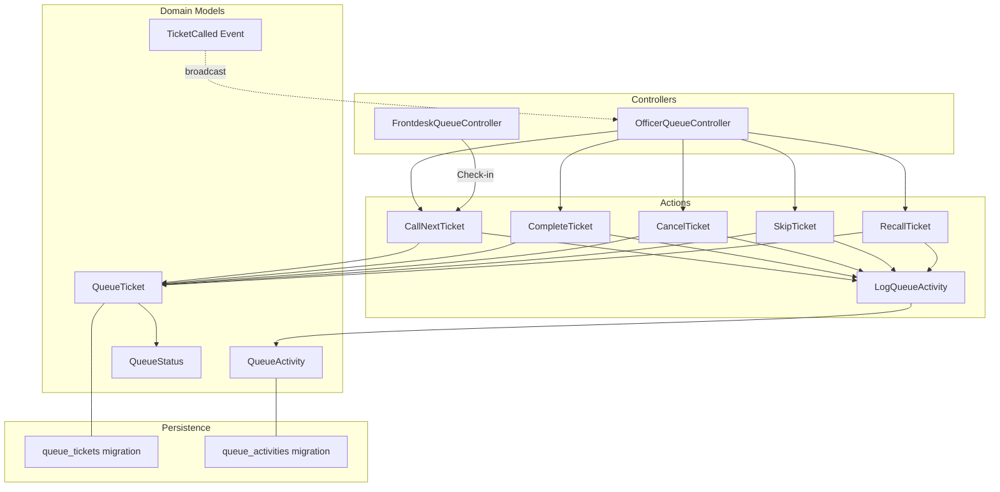
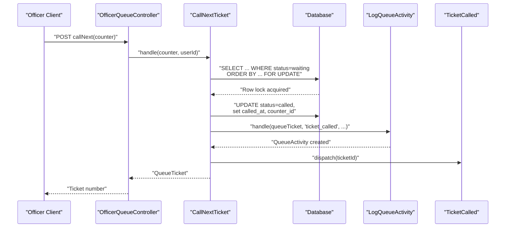
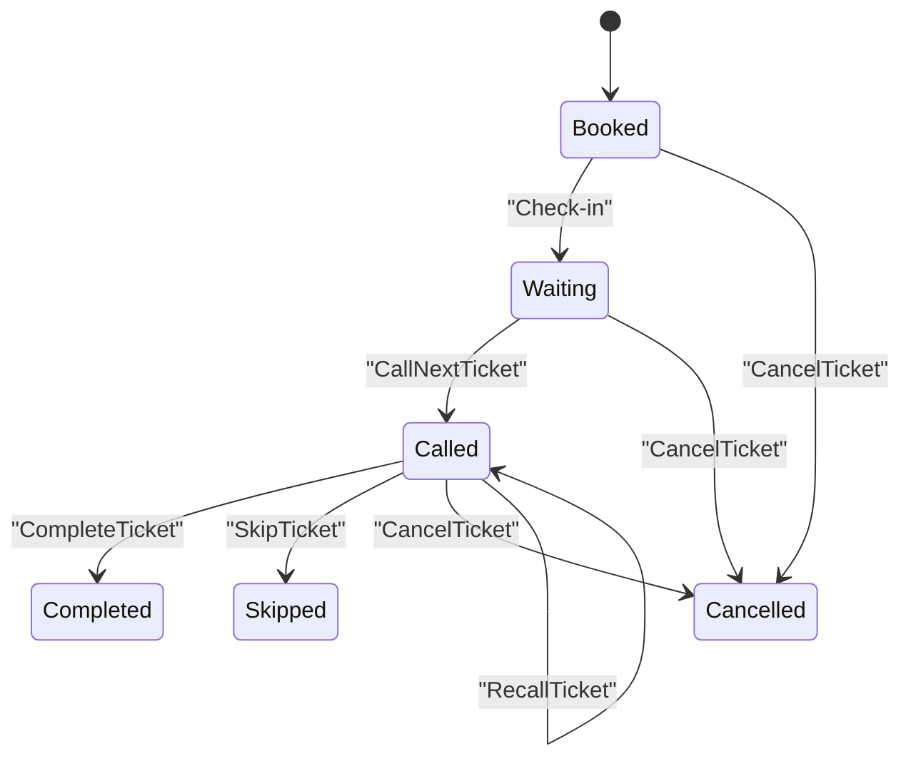
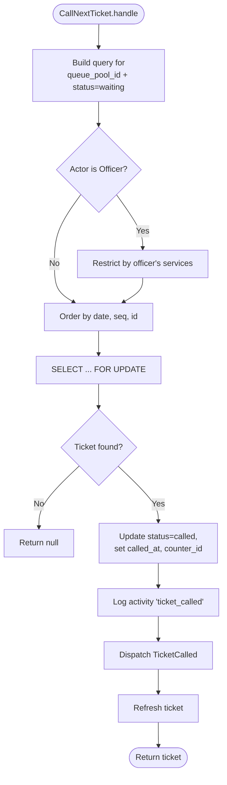
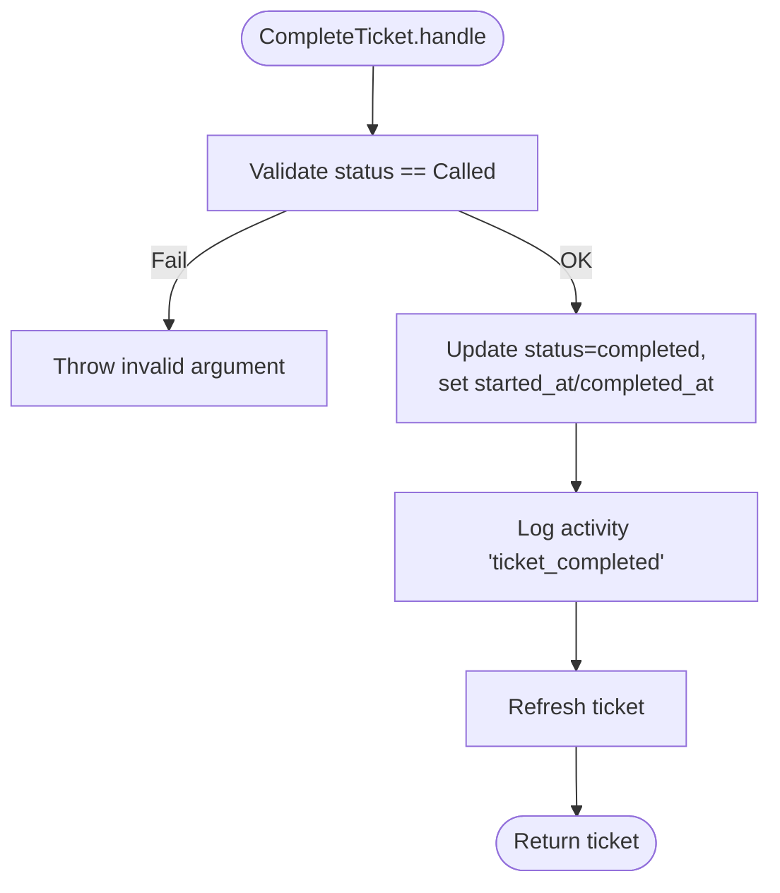
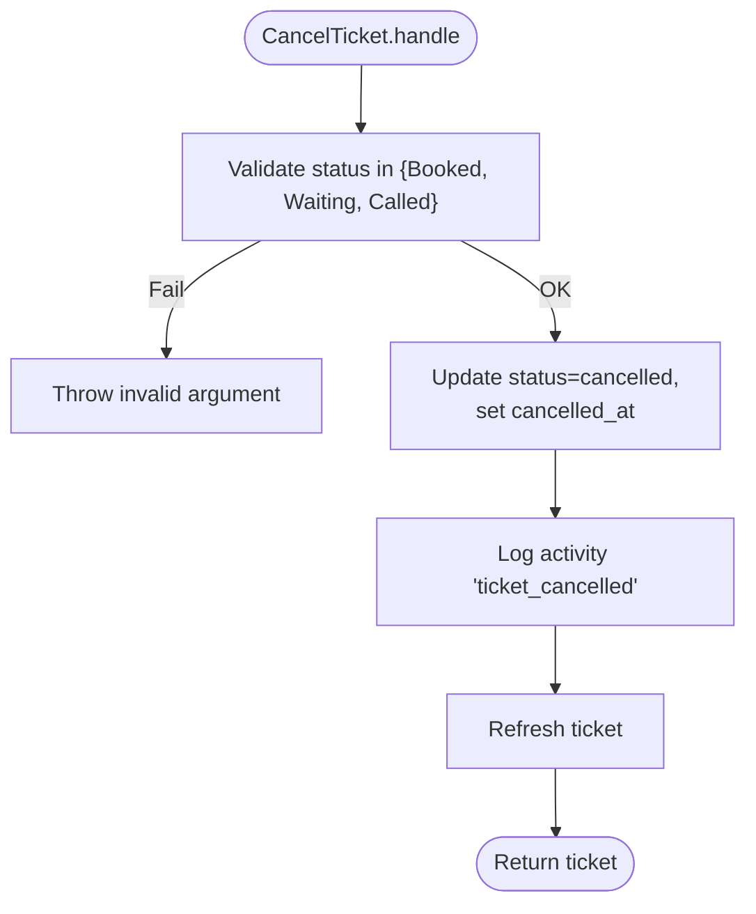
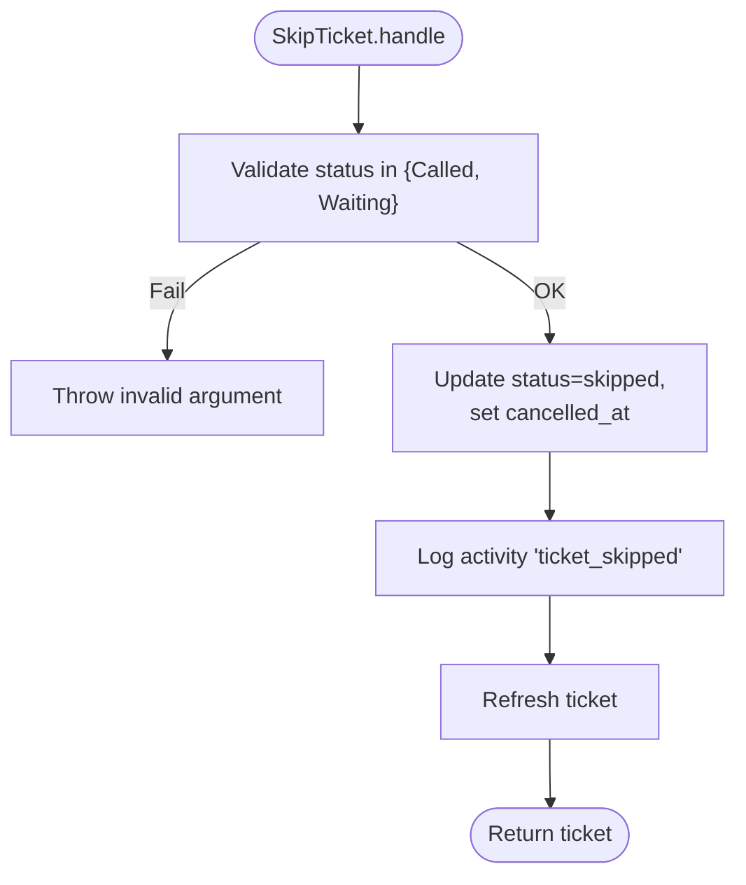
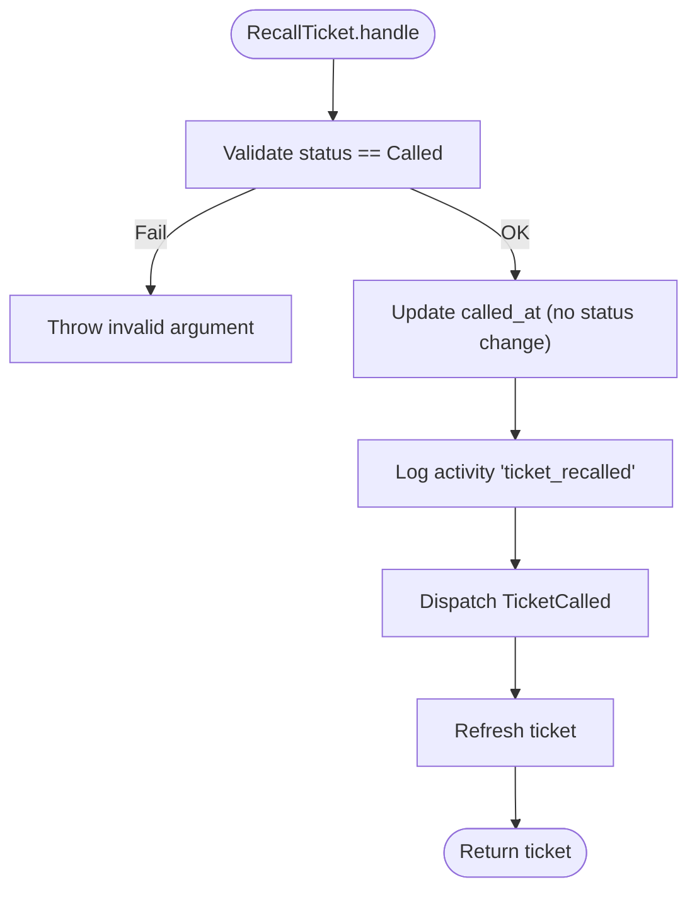
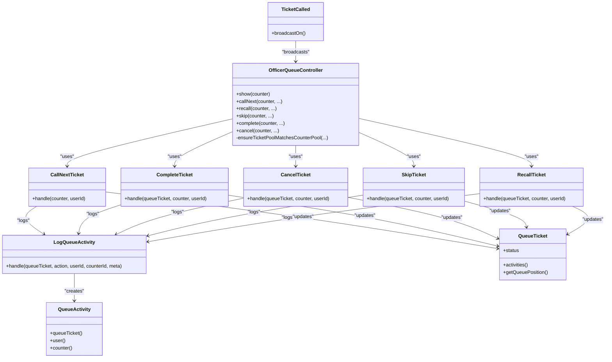

# Ticket Status Management

<cite>
**Referenced Files in This Document**
- [QueueStatus.php](file://app/Enums/QueueStatus.php)
- [QueueTicket.php](file://app/Models/QueueTicket.php)
- [QueueActivity.php](file://app/Models/QueueActivity.php)
- [CallNextTicket.php](file://app/Actions/Queue/CallNextTicket.php)
- [CompleteTicket.php](file://app/Actions/Queue/CompleteTicket.php)
- [CancelTicket.php](file://app/Actions/Queue/CancelTicket.php)
- [SkipTicket.php](file://app/Actions/Queue/SkipTicket.php)
- [RecallTicket.php](file://app/Actions/Queue/RecallTicket.php)
- [LogQueueActivity.php](file://app/Actions/Queue/LogQueueActivity.php)
- [TicketCalled.php](file://app/Events/TicketCalled.php)
- [OfficerQueueController.php](file://app/Http/Controllers/OfficerQueueController.php)
- [FrontdeskQueueController.php](file://app/Http/Controllers/FrontdeskQueueController.php)
- [2026_03_06_015238_create_queue_tickets_table.php](file://database/migrations/2026_03_06_015238_create_queue_tickets_table.php)
- [2026_03_06_015239_create_queue_activities_table.php](file://database/migrations/2026_03_06_015239_create_queue_activities_table.php)
- [QueueAuditLogTest.php](file://tests/Feature/Audit/QueueAuditLogTest.php)
</cite>

## Table of Contents
1. [Introduction](#introduction)
2. [Project Structure](#project-structure)
3. [Core Components](#core-components)
4. [Architecture Overview](#architecture-overview)
5. [Detailed Component Analysis](#detailed-component-analysis)
6. [Dependency Analysis](#dependency-analysis)
7. [Performance Considerations](#performance-considerations)
8. [Troubleshooting Guide](#troubleshooting-guide)
9. [Conclusion](#conclusion)

## Introduction
This document provides comprehensive documentation for ticket status management and state transitions within the PTSP queue system. It details the allowed state transitions, validation rules, concurrency controls, and audit trail generation for the following actions:
- CallNextTicket
- CompleteTicket
- CancelTicket
- SkipTicket
- RecallTicket

It also explains the state machine architecture, race condition prevention mechanisms, and error recovery strategies. Examples of complex workflows such as ticket recall scenarios, skip operations for special cases, and cancellation procedures are included.

## Project Structure
The queue system is implemented using Laravel Eloquent models, domain actions (commands), controllers, events, and database migrations. The key components involved in ticket state management are:
- Enumerations define valid statuses and their presentation attributes.
- Models encapsulate persistence, relationships, and derived computations.
- Actions implement atomic state transitions with validation and audit logging.
- Controllers orchestrate requests and enforce authorization and pool boundaries.
- Events broadcast real-time updates.
- Migrations define the schema and indexes supporting concurrency-safe operations.

**Diagram sources**
- [OfficerQueueController.php:16-96](file://app/Http/Controllers/OfficerQueueController.php#L16-L96)
- [FrontdeskQueueController.php:16-89](file://app/Http/Controllers/FrontdeskQueueController.php#L16-L89)
- [CallNextTicket.php:13-80](file://app/Actions/Queue/CallNextTicket.php#L13-L80)
- [CompleteTicket.php:11-49](file://app/Actions/Queue/CompleteTicket.php#L11-L49)
- [CancelTicket.php:11-48](file://app/Actions/Queue/CancelTicket.php#L11-L48)
- [SkipTicket.php:11-48](file://app/Actions/Queue/SkipTicket.php#L11-L48)
- [RecallTicket.php:11-49](file://app/Actions/Queue/RecallTicket.php#L11-L49)
- [LogQueueActivity.php:8-29](file://app/Actions/Queue/LogQueueActivity.php#L8-L29)
- [QueueTicket.php:12-121](file://app/Models/QueueTicket.php#L12-L121)
- [QueueActivity.php:9-44](file://app/Models/QueueActivity.php#L9-L44)
- [QueueStatus.php:5-38](file://app/Enums/QueueStatus.php#L5-L38)
- [TicketCalled.php:11-34](file://app/Events/TicketCalled.php#L11-L34)
- [2026_03_06_015238_create_queue_tickets_table.php:14-41](file://database/migrations/2026_03_06_015238_create_queue_tickets_table.php#L14-L41)
- [2026_03_06_015239_create_queue_activities_table.php:14-25](file://database/migrations/2026_03_06_015239_create_queue_activities_table.php#L14-L25)

**Section sources**
- [OfficerQueueController.php:16-96](file://app/Http/Controllers/OfficerQueueController.php#L16-L96)
- [FrontdeskQueueController.php:16-89](file://app/Http/Controllers/FrontdeskQueueController.php#L16-L89)
- [CallNextTicket.php:13-80](file://app/Actions/Queue/CallNextTicket.php#L13-L80)
- [CompleteTicket.php:11-49](file://app/Actions/Queue/CompleteTicket.php#L11-L49)
- [CancelTicket.php:11-48](file://app/Actions/Queue/CancelTicket.php#L11-L48)
- [SkipTicket.php:11-48](file://app/Actions/Queue/SkipTicket.php#L11-L48)
- [RecallTicket.php:11-49](file://app/Actions/Queue/RecallTicket.php#L11-L49)
- [LogQueueActivity.php:8-29](file://app/Actions/Queue/LogQueueActivity.php#L8-L29)
- [QueueTicket.php:12-121](file://app/Models/QueueTicket.php#L12-L121)
- [QueueActivity.php:9-44](file://app/Models/QueueActivity.php#L9-L44)
- [QueueStatus.php:5-38](file://app/Enums/QueueStatus.php#L5-L38)
- [TicketCalled.php:11-34](file://app/Events/TicketCalled.php#L11-L34)
- [2026_03_06_015238_create_queue_tickets_table.php:14-41](file://database/migrations/2026_03_06_015238_create_queue_tickets_table.php#L14-L41)
- [2026_03_06_015239_create_queue_activities_table.php:14-25](file://database/migrations/2026_03_06_015239_create_queue_activities_table.php#L14-L25)

## Core Components
- QueueStatus enumeration defines all valid ticket statuses and provides label and color helpers used for UI rendering.
- QueueTicket model persists ticket records, casts the status field to the QueueStatus enum, and exposes scopes and computed properties such as queue position calculation.
- QueueActivity model captures audit events with metadata for each state change.
- Action classes implement atomic state transitions with validation, transactional updates, and audit logging.
- Controllers coordinate user actions, enforce authorization, and ensure the ticket belongs to the same queue pool as the counter.
- TicketCalled event broadcasts real-time updates when a ticket is called.

Key implementation references:
- Status definitions and helpers: [QueueStatus.php:5-38](file://app/Enums/QueueStatus.php#L5-L38)
- Ticket model with status casting and queue position: [QueueTicket.php:12-121](file://app/Models/QueueTicket.php#L12-L121)
- Activity model with JSON meta casting: [QueueActivity.php:9-44](file://app/Models/QueueActivity.php#L9-L44)
- Audit logging action: [LogQueueActivity.php:8-29](file://app/Actions/Queue/LogQueueActivity.php#L8-L29)
- Real-time event: [TicketCalled.php:11-34](file://app/Events/TicketCalled.php#L11-L34)

**Section sources**
- [QueueStatus.php:5-38](file://app/Enums/QueueStatus.php#L5-L38)
- [QueueTicket.php:12-121](file://app/Models/QueueTicket.php#L12-L121)
- [QueueActivity.php:9-44](file://app/Models/QueueActivity.php#L9-L44)
- [LogQueueActivity.php:8-29](file://app/Actions/Queue/LogQueueActivity.php#L8-L29)
- [TicketCalled.php:11-34](file://app/Events/TicketCalled.php#L11-L34)

## Architecture Overview
The state transition architecture follows a command pattern with strict validation and atomicity guarantees:
- Controllers receive user actions and validate authorization and pool membership.
- Actions encapsulate business logic for each transition, including preconditions, updates, and audit logging.
- Transactions ensure atomicity of updates and prevent race conditions.
- Indexes on the queue_tickets table support efficient selection and locking of the next eligible ticket.
- Audit logs are recorded via LogQueueActivity with structured metadata for each action.
- Real-time updates are broadcast using the TicketCalled event.

**Diagram sources**
- [OfficerQueueController.php:40-49](file://app/Http/Controllers/OfficerQueueController.php#L40-L49)
- [CallNextTicket.php:19-78](file://app/Actions/Queue/CallNextTicket.php#L19-L78)
- [LogQueueActivity.php:13-27](file://app/Actions/Queue/LogQueueActivity.php#L13-L27)
- [TicketCalled.php:18-32](file://app/Events/TicketCalled.php#L18-L32)

**Section sources**
- [OfficerQueueController.php:40-49](file://app/Http/Controllers/OfficerQueueController.php#L40-L49)
- [CallNextTicket.php:19-78](file://app/Actions/Queue/CallNextTicket.php#L19-L78)
- [LogQueueActivity.php:13-27](file://app/Actions/Queue/LogQueueActivity.php#L13-L27)
- [TicketCalled.php:18-32](file://app/Events/TicketCalled.php#L18-L32)

## Detailed Component Analysis

### State Machine Architecture
The ticket state machine supports the following statuses:
- Booked
- Waiting
- Called
- Completed
- Cancelled
- Skipped

Transitions are governed by explicit validations in each action. The QueueStatus enum provides label and color helpers for UI rendering.

**Diagram sources**
- [QueueStatus.php:7-12](file://app/Enums/QueueStatus.php#L7-L12)
- [CallNextTicket.php:19-78](file://app/Actions/Queue/CallNextTicket.php#L19-L78)
- [CompleteTicket.php:17-47](file://app/Actions/Queue/CompleteTicket.php#L17-L47)
- [CancelTicket.php:17-46](file://app/Actions/Queue/CancelTicket.php#L17-L46)
- [SkipTicket.php:17-46](file://app/Actions/Queue/SkipTicket.php#L17-L46)
- [RecallTicket.php:17-47](file://app/Actions/Queue/RecallTicket.php#L17-L47)

**Section sources**
- [QueueStatus.php:7-12](file://app/Enums/QueueStatus.php#L7-L12)
- [CallNextTicket.php:19-78](file://app/Actions/Queue/CallNextTicket.php#L19-L78)
- [CompleteTicket.php:17-47](file://app/Actions/Queue/CompleteTicket.php#L17-L47)
- [CancelTicket.php:17-46](file://app/Actions/Queue/CancelTicket.php#L17-L46)
- [SkipTicket.php:17-46](file://app/Actions/Queue/SkipTicket.php#L17-L46)
- [RecallTicket.php:17-47](file://app/Actions/Queue/RecallTicket.php#L17-L47)

### CallNextTicket
Purpose: Select the next eligible ticket from the waiting pool and mark it as called.

Allowed when:
- The ticket status is Waiting and belongs to the same queue pool as the counter.
- Optional officer role filtering restricts selection to services assigned to the officer.

Validation and concurrency:
- Uses a SELECT ... FOR UPDATE to lock the chosen row atomically.
- Orders by service_date, sequence_number, and id to ensure deterministic selection.
- Wraps the operation in a database transaction.

Audit trail:
- Records action "ticket_called" with metadata including from_status, to_status, service_id, queue_pool_id, visit_purpose.

Real-time update:
- Dispatches TicketCalled event with the ticket ID.

**Diagram sources**
- [CallNextTicket.php:19-78](file://app/Actions/Queue/CallNextTicket.php#L19-L78)
- [LogQueueActivity.php:13-27](file://app/Actions/Queue/LogQueueActivity.php#L13-L27)
- [TicketCalled.php:18-32](file://app/Events/TicketCalled.php#L18-L32)

**Section sources**
- [CallNextTicket.php:19-78](file://app/Actions/Queue/CallNextTicket.php#L19-L78)
- [LogQueueActivity.php:13-27](file://app/Actions/Queue/LogQueueActivity.php#L13-L27)
- [TicketCalled.php:18-32](file://app/Events/TicketCalled.php#L18-L32)

### CompleteTicket
Purpose: Mark a called ticket as completed.

Allowed when:
- The ticket status is Called.

Validation and concurrency:
- Throws an exception if the ticket is not in Called status.

Audit trail:
- Records action "ticket_completed" with metadata including from_status, to_status, service_id, queue_pool_id, visit_purpose.

**Diagram sources**
- [CompleteTicket.php:17-47](file://app/Actions/Queue/CompleteTicket.php#L17-L47)
- [LogQueueActivity.php:13-27](file://app/Actions/Queue/LogQueueActivity.php#L13-L27)

**Section sources**
- [CompleteTicket.php:17-47](file://app/Actions/Queue/CompleteTicket.php#L17-L47)
- [LogQueueActivity.php:13-27](file://app/Actions/Queue/LogQueueActivity.php#L13-L27)

### CancelTicket
Purpose: Cancel a ticket from supported statuses.

Allowed when:
- The ticket status is Booked, Waiting, or Called.

Validation and concurrency:
- Throws an exception for other statuses.

Audit trail:
- Records action "ticket_cancelled" with metadata including from_status, to_status, service_id, queue_pool_id, visit_purpose.

**Diagram sources**
- [CancelTicket.php:17-46](file://app/Actions/Queue/CancelTicket.php#L17-L46)
- [LogQueueActivity.php:13-27](file://app/Actions/Queue/LogQueueActivity.php#L13-L27)

**Section sources**
- [CancelTicket.php:17-46](file://app/Actions/Queue/CancelTicket.php#L17-L46)
- [LogQueueActivity.php:13-27](file://app/Actions/Queue/LogQueueActivity.php#L13-L27)

### SkipTicket
Purpose: Skip a ticket that is currently Called or Waiting.

Allowed when:
- The ticket status is Called or Waiting.

Validation and concurrency:
- Throws an exception for other statuses.

Audit trail:
- Records action "ticket_skipped" with metadata including from_status, to_status, service_id, queue_pool_id, visit_purpose.

**Diagram sources**
- [SkipTicket.php:17-46](file://app/Actions/Queue/SkipTicket.php#L17-L46)
- [LogQueueActivity.php:13-27](file://app/Actions/Queue/LogQueueActivity.php#L13-L27)

**Section sources**
- [SkipTicket.php:17-46](file://app/Actions/Queue/SkipTicket.php#L17-L46)
- [LogQueueActivity.php:13-27](file://app/Actions/Queue/LogQueueActivity.php#L13-L27)

### RecallTicket
Purpose: Recall a Called ticket to reinforce the current calling state.

Allowed when:
- The ticket status is Called.

Validation and concurrency:
- Throws an exception for other statuses.

Behavior:
- Updates the called_at timestamp to the current time.
- Does not change the status value.

Audit trail:
- Records action "ticket_recalled" with metadata including from_status, to_status (unchanged), service_id, queue_pool_id, visit_purpose.

Real-time update:
- Dispatches TicketCalled event with the ticket ID.

**Diagram sources**
- [RecallTicket.php:17-47](file://app/Actions/Queue/RecallTicket.php#L17-L47)
- [LogQueueActivity.php:13-27](file://app/Actions/Queue/LogQueueActivity.php#L13-L27)
- [TicketCalled.php:18-32](file://app/Events/TicketCalled.php#L18-L32)

**Section sources**
- [RecallTicket.php:17-47](file://app/Actions/Queue/RecallTicket.php#L17-L47)
- [LogQueueActivity.php:13-27](file://app/Actions/Queue/LogQueueActivity.php#L13-L27)
- [TicketCalled.php:18-32](file://app/Events/TicketCalled.php#L18-L32)

### Audit Trail Generation
Each state transition action invokes LogQueueActivity to persist an audit record. The QueueActivity model stores:
- queue_ticket_id
- user_id (optional)
- counter_id (optional)
- action (string)
- meta (JSON)

The meta payload includes contextual information such as from_status, to_status, service_id, queue_pool_id, and visit_purpose.

References:
- Audit logging action: [LogQueueActivity.php:13-27](file://app/Actions/Queue/LogQueueActivity.php#L13-L27)
- Activity model: [QueueActivity.php:14-26](file://app/Models/QueueActivity.php#L14-L26)
- Test coverage for audit logs: [QueueAuditLogTest.php:18-38](file://tests/Feature/Audit/QueueAuditLogTest.php#L18-L38)

**Section sources**
- [LogQueueActivity.php:13-27](file://app/Actions/Queue/LogQueueActivity.php#L13-L27)
- [QueueActivity.php:14-26](file://app/Models/QueueActivity.php#L14-L26)
- [QueueAuditLogTest.php:18-38](file://tests/Feature/Audit/QueueAuditLogTest.php#L18-L38)

## Dependency Analysis
The following diagram shows the primary dependencies among components involved in state transitions:

**Diagram sources**
- [OfficerQueueController.php:16-96](file://app/Http/Controllers/OfficerQueueController.php#L16-L96)
- [CallNextTicket.php:13-80](file://app/Actions/Queue/CallNextTicket.php#L13-L80)
- [CompleteTicket.php:11-49](file://app/Actions/Queue/CompleteTicket.php#L11-L49)
- [CancelTicket.php:11-48](file://app/Actions/Queue/CancelTicket.php#L11-L48)
- [SkipTicket.php:11-48](file://app/Actions/Queue/SkipTicket.php#L11-L48)
- [RecallTicket.php:11-49](file://app/Actions/Queue/RecallTicket.php#L11-L49)
- [LogQueueActivity.php:8-29](file://app/Actions/Queue/LogQueueActivity.php#L8-L29)
- [QueueTicket.php:12-121](file://app/Models/QueueTicket.php#L12-L121)
- [QueueActivity.php:9-44](file://app/Models/QueueActivity.php#L9-L44)
- [TicketCalled.php:11-34](file://app/Events/TicketCalled.php#L11-L34)

**Section sources**
- [OfficerQueueController.php:16-96](file://app/Http/Controllers/OfficerQueueController.php#L16-L96)
- [CallNextTicket.php:13-80](file://app/Actions/Queue/CallNextTicket.php#L13-L80)
- [CompleteTicket.php:11-49](file://app/Actions/Queue/CompleteTicket.php#L11-L49)
- [CancelTicket.php:11-48](file://app/Actions/Queue/CancelTicket.php#L11-L48)
- [SkipTicket.php:11-48](file://app/Actions/Queue/SkipTicket.php#L11-L48)
- [RecallTicket.php:11-49](file://app/Actions/Queue/RecallTicket.php#L11-L49)
- [LogQueueActivity.php:8-29](file://app/Actions/Queue/LogQueueActivity.php#L8-L29)
- [QueueTicket.php:12-121](file://app/Models/QueueTicket.php#L12-L121)
- [QueueActivity.php:9-44](file://app/Models/QueueActivity.php#L9-L44)
- [TicketCalled.php:11-34](file://app/Events/TicketCalled.php#L11-L34)

## Performance Considerations
- Concurrency control: Each state transition uses database transactions and row-level locking to prevent race conditions. CallNextTicket employs SELECT ... FOR UPDATE to lock the chosen ticket atomically.
- Indexes: The queue_tickets table includes indexes on (service_date, status), (queue_pool_id, service_date, status), and (service_id, service_date) to optimize selection and ordering for the next ticket.
- Minimal writes: Actions update only the necessary fields for each transition, reducing write amplification.
- Audit logging overhead: Each transition writes a single row to queue_activities with JSON meta; ensure appropriate indexing and monitoring in production.

[No sources needed since this section provides general guidance]

## Troubleshooting Guide
Common issues and resolutions:
- Invalid state transitions:
  - Symptom: Exceptions thrown indicating the ticket cannot be transitioned from its current status.
  - Resolution: Verify the ticket’s current status and ensure the intended action matches the allowed transitions.
  - References: [CompleteTicket.php:19-21](file://app/Actions/Queue/CompleteTicket.php#L19-L21), [CancelTicket.php:19-21](file://app/Actions/Queue/CancelTicket.php#L19-L21), [SkipTicket.php:19-21](file://app/Actions/Queue/SkipTicket.php#L19-L21), [RecallTicket.php:19-21](file://app/Actions/Queue/RecallTicket.php#L19-L21)
- Authorization failures:
  - Symptom: 403 errors when attempting actions on tickets outside the officer’s allowed services or when the ticket does not belong to the counter’s queue pool.
  - Resolution: Confirm the officer’s assigned services and ensure the ticket’s queue_pool_id matches the counter’s queue_pool_id.
  - References: [OfficerQueueController.php:24-31](file://app/Http/Controllers/OfficerQueueController.php#L24-L31), [OfficerQueueController.php:91-94](file://app/Http/Controllers/OfficerQueueController.php#L91-L94)
- No tickets available:
  - Symptom: CallNextTicket returns null when no Waiting tickets exist.
  - Resolution: Trigger check-in for Booked tickets or verify the queue pool and date filters.
  - References: [CallNextTicket.php:48-50](file://app/Actions/Queue/CallNextTicket.php#L48-L50)
- Audit trail verification:
  - Symptom: Missing or inconsistent audit entries.
  - Resolution: Confirm LogQueueActivity is invoked by each action and that queue_activities table is indexed appropriately.
  - References: [LogQueueActivity.php:13-27](file://app/Actions/Queue/LogQueueActivity.php#L13-L27), [QueueAuditLogTest.php:18-38](file://tests/Feature/Audit/QueueAuditLogTest.php#L18-L38)

**Section sources**
- [CompleteTicket.php:19-21](file://app/Actions/Queue/CompleteTicket.php#L19-L21)
- [CancelTicket.php:19-21](file://app/Actions/Queue/CancelTicket.php#L19-L21)
- [SkipTicket.php:19-21](file://app/Actions/Queue/SkipTicket.php#L19-L21)
- [RecallTicket.php:19-21](file://app/Actions/Queue/RecallTicket.php#L19-L21)
- [OfficerQueueController.php:24-31](file://app/Http/Controllers/OfficerQueueController.php#L24-L31)
- [OfficerQueueController.php:91-94](file://app/Http/Controllers/OfficerQueueController.php#L91-L94)
- [CallNextTicket.php:48-50](file://app/Actions/Queue/CallNextTicket.php#L48-L50)
- [LogQueueActivity.php:13-27](file://app/Actions/Queue/LogQueueActivity.php#L13-L27)
- [QueueAuditLogTest.php:18-38](file://tests/Feature/Audit/QueueAuditLogTest.php#L18-L38)

## Conclusion
The PTSP queue system enforces a strict, validated state machine for ticket management with robust concurrency controls and comprehensive audit trails. Each state transition action encapsulates validation, atomic updates, and logging, ensuring data consistency and traceability. Controllers enforce authorization and pool boundaries, while events enable real-time updates. The schema and indexes support efficient, race-condition-free operations across concurrent access scenarios.