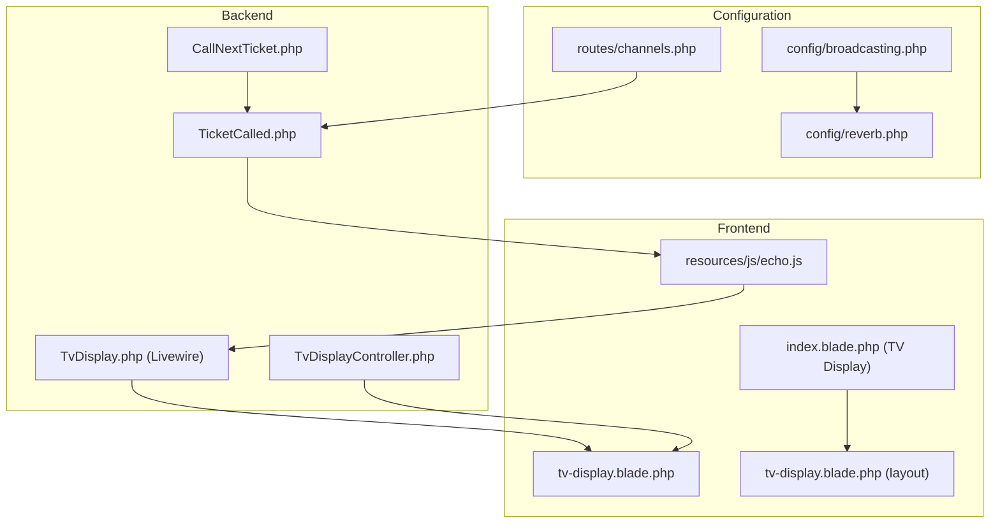
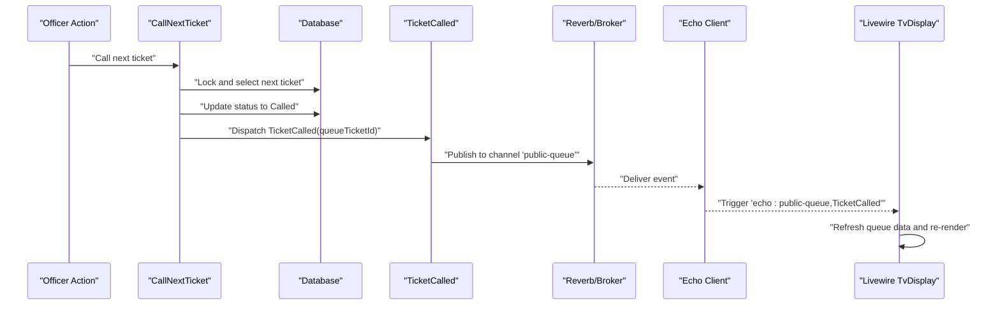
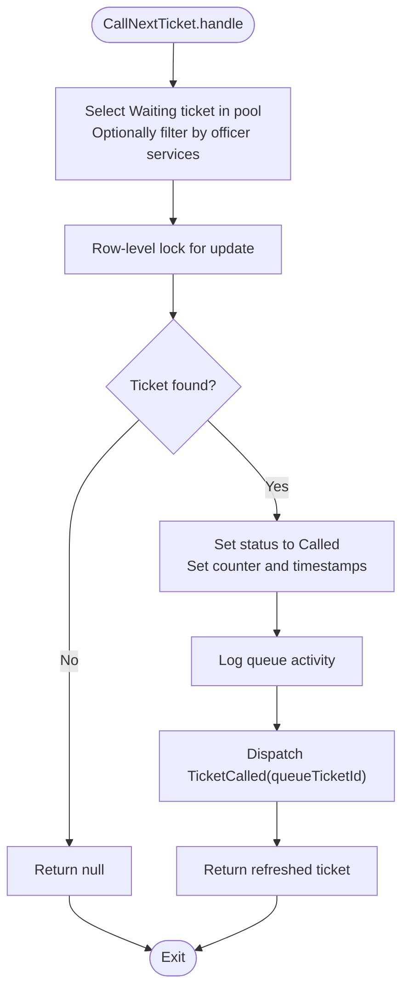
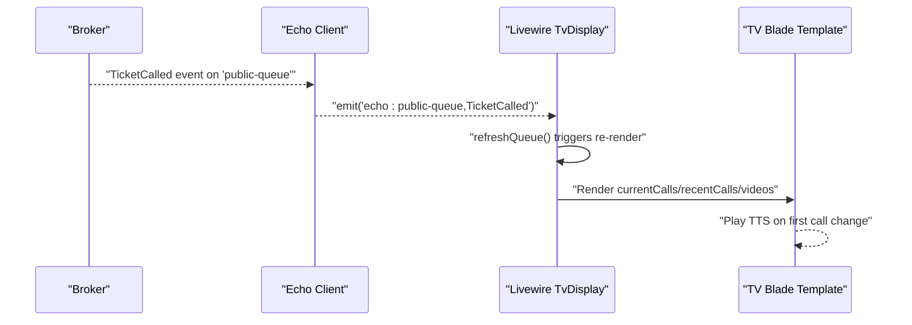
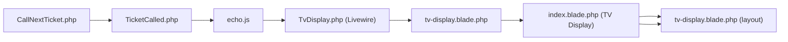

# Broadcasting Mechanisms

<cite>
**Referenced Files in This Document**
- [broadcasting.php](file://config/broadcasting.php)
- [reverb.php](file://config/reverb.php)
- [channels.php](file://routes/channels.php)
- [TicketCalled.php](file://app/Events/TicketCalled.php)
- [CallNextTicket.php](file://app/Actions/Queue/CallNextTicket.php)
- [echo.js](file://resources/js/echo.js)
- [TvDisplay.php](file://app/Livewire/TvDisplay.php)
- [tv-display.blade.php](file://resources/views/livewire/tv-display.blade.php)
- [TvDisplayController.php](file://app/Http/Controllers/TvDisplayController.php)
- [index.blade.php (TV Display)](file://resources/views/pages/tv-display/index.blade.php)
- [tv-display.blade.php (TV layout)](file://resources/views/layouts/tv-display.blade.php)
</cite>

## Table of Contents
1. [Introduction](#introduction)
2. [Project Structure](#project-structure)
3. [Core Components](#core-components)
4. [Architecture Overview](#architecture-overview)
5. [Detailed Component Analysis](#detailed-component-analysis)
6. [Dependency Analysis](#dependency-analysis)
7. [Performance Considerations](#performance-considerations)
8. [Troubleshooting Guide](#troubleshooting-guide)
9. [Conclusion](#conclusion)

## Introduction
This document explains the broadcasting mechanisms that deliver real-time updates to subscribed clients. It focuses on channel-based broadcasting for different user roles and interfaces (public, kiosk, TV display, admin), the API/controller broadcasting patterns, and how queue operations trigger broadcasts. It also documents the channel authorization system, security considerations for real-time data transmission, and practical examples of broadcasting queue status changes, ticket updates, and system notifications. Message routing, filtering, and performance optimization strategies for high-volume broadcasting are included.

## Project Structure
The broadcasting system integrates configuration, event dispatching, channel authorization, and frontend subscription via Laravel Echo and Reverb/Pusher. The TV display interface demonstrates real-time updates using Livewire and Echo event listeners.

**Diagram sources**
- [broadcasting.php:1-83](file://config/broadcasting.php#L1-L83)
- [reverb.php:1-103](file://config/reverb.php#L1-L103)
- [channels.php:1-8](file://routes/channels.php#L1-L8)
- [CallNextTicket.php:1-80](file://app/Actions/Queue/CallNextTicket.php#L1-L80)
- [TicketCalled.php:1-34](file://app/Events/TicketCalled.php#L1-L34)
- [TvDisplay.php:1-142](file://app/Livewire/TvDisplay.php#L1-L142)
- [TvDisplayController.php:1-144](file://app/Http/Controllers/TvDisplayController.php#L1-L144)
- [echo.js:1-15](file://resources/js/echo.js#L1-L15)
- [tv-display.blade.php:1-213](file://resources/views/livewire/tv-display.blade.php#L1-L213)
- [index.blade.php (TV Display):1-18](file://resources/views/pages/tv-display/index.blade.php#L1-L18)
- [tv-display.blade.php (TV layout):1-31](file://resources/views/layouts/tv-display.blade.php#L1-L31)

**Section sources**
- [broadcasting.php:1-83](file://config/broadcasting.php#L1-L83)
- [reverb.php:1-103](file://config/reverb.php#L1-L103)
- [channels.php:1-8](file://routes/channels.php#L1-L8)
- [TicketCalled.php:1-34](file://app/Events/TicketCalled.php#L1-L34)
- [CallNextTicket.php:1-80](file://app/Actions/Queue/CallNextTicket.php#L1-L80)
- [TvDisplay.php:1-142](file://app/Livewire/TvDisplay.php#L1-L142)
- [TvDisplayController.php:1-144](file://app/Http/Controllers/TvDisplayController.php#L1-L144)
- [echo.js:1-15](file://resources/js/echo.js#L1-L15)
- [tv-display.blade.php:1-213](file://resources/views/livewire/tv-display.blade.php#L1-L213)
- [index.blade.php (TV Display):1-18](file://resources/views/pages/tv-display/index.blade.php#L1-L18)
- [tv-display.blade.php (TV layout):1-31](file://resources/views/layouts/tv-display.blade.php#L1-L31)

## Core Components
- Broadcasting configuration: Selects the default driver (Reverb/Pusher/Ably/Redis/Log/Null) and driver-specific options.
- Channel authorization: Defines per-user private channels for secure, role-aware subscriptions.
- Event broadcasting: The TicketCalled event publishes to a public channel for TV displays and other subscribers.
- Frontend subscription: Echo connects to the configured broadcaster and listens for events on channels.
- Livewire integration: The TV display Livewire component reacts to Echo events and refreshes the UI.

Key implementation references:
- Broadcasting configuration and drivers: [broadcasting.php:1-83](file://config/broadcasting.php#L1-L83)
- Reverb server and app configuration: [reverb.php:1-103](file://config/reverb.php#L1-L103)
- Private channel authorization: [channels.php:1-8](file://routes/channels.php#L1-L8)
- Event definition and broadcast channel: [TicketCalled.php:1-34](file://app/Events/TicketCalled.php#L1-L34)
- Queue operation triggering broadcast: [CallNextTicket.php:74](file://app/Actions/Queue/CallNextTicket.php#L74)
- Frontend Echo setup: [echo.js:1-15](file://resources/js/echo.js#L1-L15)
- Livewire event listener and rendering: [TvDisplay.php:22-27](file://app/Livewire/TvDisplay.php#L22-L27), [TvDisplay.php:29-39](file://app/Livewire/TvDisplay.php#L29-L39)
- TV display page and layout wiring: [index.blade.php (TV Display):14](file://resources/views/pages/tv-display/index.blade.php#L14), [tv-display.blade.php (TV layout):16](file://resources/views/layouts/tv-display.blade.php#L16)

**Section sources**
- [broadcasting.php:1-83](file://config/broadcasting.php#L1-L83)
- [reverb.php:1-103](file://config/reverb.php#L1-L103)
- [channels.php:1-8](file://routes/channels.php#L1-L8)
- [TicketCalled.php:1-34](file://app/Events/TicketCalled.php#L1-L34)
- [CallNextTicket.php:74](file://app/Actions/Queue/CallNextTicket.php#L74)
- [echo.js:1-15](file://resources/js/echo.js#L1-L15)
- [TvDisplay.php:22-27](file://app/Livewire/TvDisplay.php#L22-L27)
- [TvDisplay.php:29-39](file://app/Livewire/TvDisplay.php#L29-L39)
- [index.blade.php (TV Display):14](file://resources/views/pages/tv-display/index.blade.php#L14)
- [tv-display.blade.php (TV layout):16](file://resources/views/layouts/tv-display.blade.php#L16)

## Architecture Overview
The system uses a publish-subscribe model:
- Backend: Queue actions update state and dispatch events.
- Broker: Reverb (or Pusher/Ably/Redis/log/null) delivers events to subscribed clients.
- Frontend: Echo subscribes to channels and Livewire components react to events.

**Diagram sources**
- [CallNextTicket.php:19-77](file://app/Actions/Queue/CallNextTicket.php#L19-L77)
- [TicketCalled.php:27-32](file://app/Events/TicketCalled.php#L27-L32)
- [TvDisplay.php:22-27](file://app/Livewire/TvDisplay.php#L22-L27)

## Detailed Component Analysis

### Broadcasting Configuration and Drivers
- Default broadcaster is controlled by an environment variable and supports multiple drivers.
- Reverb configuration defines server host/port/path, TLS options, scaling via Redis, rate limiting, and app credentials.
- Channel authorization restricts private channels to authenticated users.

References:
- [broadcasting.php:18](file://config/broadcasting.php#L18)
- [broadcasting.php:31-80](file://config/broadcasting.php#L31-L80)
- [reverb.php:16](file://config/reverb.php#L16)
- [reverb.php:29-57](file://config/reverb.php#L29-L57)
- [reverb.php:70-99](file://config/reverb.php#L70-L99)
- [channels.php:5-7](file://routes/channels.php#L5-L7)

**Section sources**
- [broadcasting.php:18](file://config/broadcasting.php#L18)
- [broadcasting.php:31-80](file://config/broadcasting.php#L31-L80)
- [reverb.php:16](file://config/reverb.php#L16)
- [reverb.php:29-57](file://config/reverb.php#L29-L57)
- [reverb.php:70-99](file://config/reverb.php#L70-L99)
- [channels.php:5-7](file://routes/channels.php#L5-L7)

### Channel Authorization System
- Private user channels are authorized so that only the user with matching ID can subscribe.
- This prevents unauthorized access to personal channels and secures sensitive real-time updates.

References:
- [channels.php:5-7](file://routes/channels.php#L5-L7)

Security considerations:
- Enforce authorization for private channels.
- Use HTTPS/TLS for transport and consider rate limiting at the broker level.
- Scope channel names to minimize exposure.

**Section sources**
- [channels.php:5-7](file://routes/channels.php#L5-L7)

### Event Definition and Broadcasting Channels
- The TicketCalled event implements immediate broadcast and specifies the channel for public queue updates.
- Subscribers on the public channel receive live updates whenever a ticket is called.

References:
- [TicketCalled.php:11](file://app/Events/TicketCalled.php#L11)
- [TicketCalled.php:27-32](file://app/Events/TicketCalled.php#L27-L32)

Examples of broadcasts:
- Ticket updates: When a ticket’s status transitions to Called, the event is dispatched and published to the public channel.
- System notifications: The TV display Livewire component listens for the event and refreshes the queue list.

**Section sources**
- [TicketCalled.php:11](file://app/Events/TicketCalled.php#L11)
- [TicketCalled.php:27-32](file://app/Events/TicketCalled.php#L27-L32)

### Queue Operations That Trigger Broadcasts
- The CallNextTicket action selects and locks the next eligible ticket, updates its status, logs activity, and dispatches the TicketCalled event.
- This ensures that real-time updates occur immediately after state changes.

References:
- [CallNextTicket.php:19-77](file://app/Actions/Queue/CallNextTicket.php#L19-L77)

**Diagram sources**
- [CallNextTicket.php:19-77](file://app/Actions/Queue/CallNextTicket.php#L19-L77)

**Section sources**
- [CallNextTicket.php:19-77](file://app/Actions/Queue/CallNextTicket.php#L19-L77)

### TV Display Real-Time Updates
- Livewire component subscribes to the public-queue channel via Echo and listens for TicketCalled events.
- On receiving the event, the component triggers a re-render, which queries current and recent calls and optionally announces the next call via TTS.

References:
- [TvDisplay.php:22-27](file://app/Livewire/TvDisplay.php#L22-L27)
- [TvDisplay.php:29-39](file://app/Livewire/TvDisplay.php#L29-L39)
- [TvDisplay.php:41-68](file://app/Livewire/TvDisplay.php#L41-L68)
- [TvDisplay.php:85-98](file://app/Livewire/TvDisplay.php#L85-L98)
- [TvDisplay.php:100-113](file://app/Livewire/TvDisplay.php#L100-L113)
- [TvDisplay.php:118-140](file://app/Livewire/TvDisplay.php#L118-L140)
- [tv-display.blade.php:30-40](file://resources/views/livewire/tv-display.blade.php#L30-L40)
- [index.blade.php (TV Display):14](file://resources/views/pages/tv-display/index.blade.php#L14)
- [tv-display.blade.php (TV layout):16](file://resources/views/layouts/tv-display.blade.php#L16)

**Diagram sources**
- [TvDisplay.php:22-27](file://app/Livewire/TvDisplay.php#L22-L27)
- [TvDisplay.php:29-39](file://app/Livewire/TvDisplay.php#L29-L39)
- [TvDisplay.php:41-68](file://app/Livewire/TvDisplay.php#L41-L68)
- [tv-display.blade.php:30-40](file://resources/views/livewire/tv-display.blade.php#L30-L40)

**Section sources**
- [TvDisplay.php:22-27](file://app/Livewire/TvDisplay.php#L22-L27)
- [TvDisplay.php:29-39](file://app/Livewire/TvDisplay.php#L29-L39)
- [TvDisplay.php:41-68](file://app/Livewire/TvDisplay.php#L41-L68)
- [TvDisplay.php:85-98](file://app/Livewire/TvDisplay.php#L85-L98)
- [TvDisplay.php:100-113](file://app/Livewire/TvDisplay.php#L100-L113)
- [TvDisplay.php:118-140](file://app/Livewire/TvDisplay.php#L118-L140)
- [tv-display.blade.php:30-40](file://resources/views/livewire/tv-display.blade.php#L30-L40)
- [index.blade.php (TV Display):14](file://resources/views/pages/tv-display/index.blade.php#L14)
- [tv-display.blade.php (TV layout):16](file://resources/views/layouts/tv-display.blade.php#L16)

### API Controller Broadcasting Patterns
- The TV display controller provides an API endpoint that returns current and recent calls, along with video assets. While this endpoint does not directly broadcast, it complements the real-time broadcast by serving static snapshots for offline fallback or polling scenarios.
- For live updates, prefer Echo-based event subscriptions over polling.

References:
- [TvDisplayController.php:89-142](file://app/Http/Controllers/TvDisplayController.php#L89-L142)

**Section sources**
- [TvDisplayController.php:89-142](file://app/Http/Controllers/TvDisplayController.php#L89-L142)

### Channel-Based Broadcasting for Interfaces
- Public channel: The public-queue channel is used for TV display updates. Any subscriber to this channel receives live updates when tickets are called.
- Private channels: Authorization ensures that user-specific channels (e.g., user-bound channels) are only accessible to the intended user.

References:
- [TicketCalled.php:30](file://app/Events/TicketCalled.php#L30)
- [channels.php:5-7](file://routes/channels.php#L5-L7)

**Section sources**
- [TicketCalled.php:30](file://app/Events/TicketCalled.php#L30)
- [channels.php:5-7](file://routes/channels.php#L5-L7)

### Examples of Broadcasting Scenarios
- Broadcasting queue status changes: When a ticket moves to Called, the TicketCalled event is dispatched and published to the public channel.
- Broadcasting ticket updates: Livewire components listen for the event and refresh the queue list.
- Broadcasting system notifications: The TV display component announces the next call via TTS when the first call changes.

References:
- [CallNextTicket.php:74](file://app/Actions/Queue/CallNextTicket.php#L74)
- [TvDisplay.php:41-68](file://app/Livewire/TvDisplay.php#L41-L68)
- [tv-display.blade.php:30-40](file://resources/views/livewire/tv-display.blade.php#L30-L40)

**Section sources**
- [CallNextTicket.php:74](file://app/Actions/Queue/CallNextTicket.php#L74)
- [TvDisplay.php:41-68](file://app/Livewire/TvDisplay.php#L41-L68)
- [tv-display.blade.php:30-40](file://resources/views/livewire/tv-display.blade.php#L30-L40)

## Dependency Analysis
The following diagram shows how components depend on each other for real-time updates:

**Diagram sources**
- [CallNextTicket.php:74](file://app/Actions/Queue/CallNextTicket.php#L74)
- [TicketCalled.php:27-32](file://app/Events/TicketCalled.php#L27-L32)
- [echo.js:1-15](file://resources/js/echo.js#L1-L15)
- [TvDisplay.php:22-27](file://app/Livewire/TvDisplay.php#L22-L27)
- [tv-display.blade.php:1-213](file://resources/views/livewire/tv-display.blade.php#L1-L213)
- [index.blade.php (TV Display):1-18](file://resources/views/pages/tv-display/index.blade.php#L1-L18)
- [tv-display.blade.php (TV layout):1-31](file://resources/views/layouts/tv-display.blade.php#L1-L31)

**Section sources**
- [CallNextTicket.php:74](file://app/Actions/Queue/CallNextTicket.php#L74)
- [TicketCalled.php:27-32](file://app/Events/TicketCalled.php#L27-L32)
- [echo.js:1-15](file://resources/js/echo.js#L1-L15)
- [TvDisplay.php:22-27](file://app/Livewire/TvDisplay.php#L22-L27)
- [tv-display.blade.php:1-213](file://resources/views/livewire/tv-display.blade.php#L1-L213)
- [index.blade.php (TV Display):1-18](file://resources/views/pages/tv-display/index.blade.php#L1-L18)
- [tv-display.blade.php (TV layout):1-31](file://resources/views/layouts/tv-display.blade.php#L1-L31)

## Performance Considerations
- Prefer event-driven updates over polling to reduce load.
- Use efficient queries in Livewire components to minimize rendering overhead.
- Cache static assets (e.g., videos) to avoid repeated disk reads.
- Configure broker rate limits and scaling to handle bursts during peak hours.
- Keep message payloads minimal; include only necessary fields for display.

## Troubleshooting Guide
- No real-time updates on TV display:
  - Verify Echo configuration and that the broadcaster is reachable.
  - Confirm the TV display page includes the Echo initialization and Livewire component.
- Incorrect or delayed updates:
  - Ensure the TicketCalled event is dispatched after status changes.
  - Check Livewire event listener registration and re-render logic.
- Unauthorized access attempts:
  - Review private channel authorization logic to ensure strict user matching.

References:
- [echo.js:6-14](file://resources/js/echo.js#L6-L14)
- [TvDisplay.php:22-27](file://app/Livewire/TvDisplay.php#L22-L27)
- [CallNextTicket.php:74](file://app/Actions/Queue/CallNextTicket.php#L74)
- [channels.php:5-7](file://routes/channels.php#L5-L7)

**Section sources**
- [echo.js:6-14](file://resources/js/echo.js#L6-L14)
- [TvDisplay.php:22-27](file://app/Livewire/TvDisplay.php#L22-L27)
- [CallNextTicket.php:74](file://app/Actions/Queue/CallNextTicket.php#L74)
- [channels.php:5-7](file://routes/channels.php#L5-L7)

## Conclusion
The broadcasting system leverages Laravel’s event broadcasting with a Reverb/Pusher backend to deliver real-time updates to TV displays and other subscribers. Queue operations trigger events that propagate instantly to clients via Echo, while channel authorization ensures secure access. Livewire components listen for these events and refresh the UI accordingly. By following the outlined patterns and performance recommendations, the system remains responsive and scalable under high-volume scenarios.