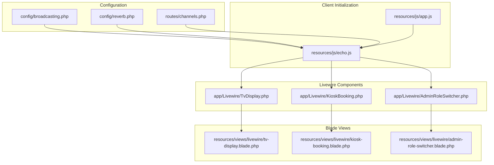
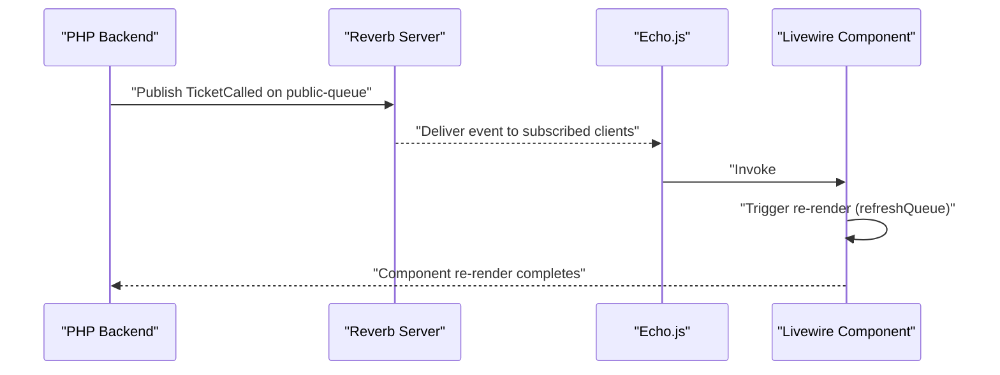
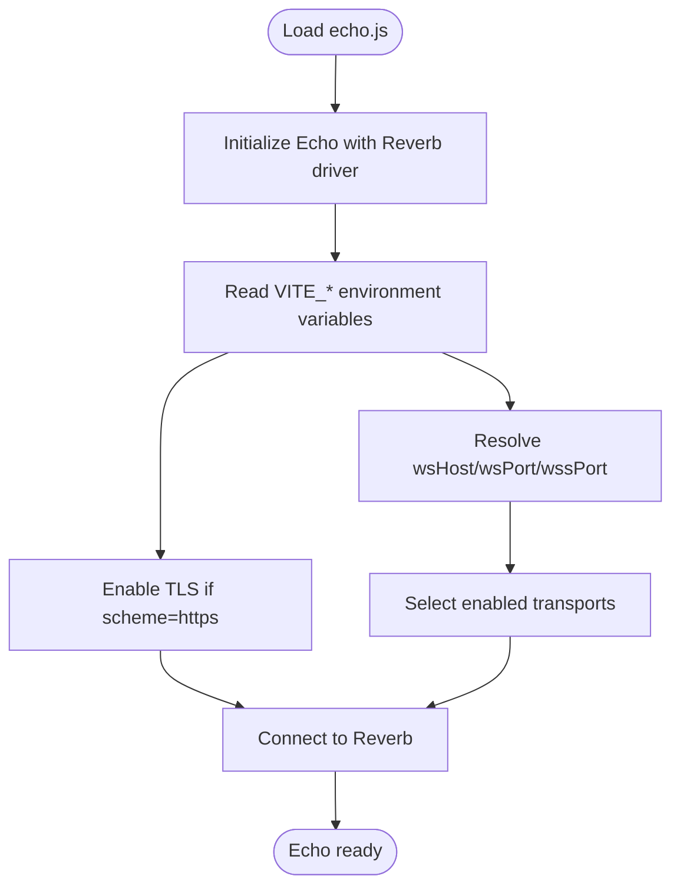
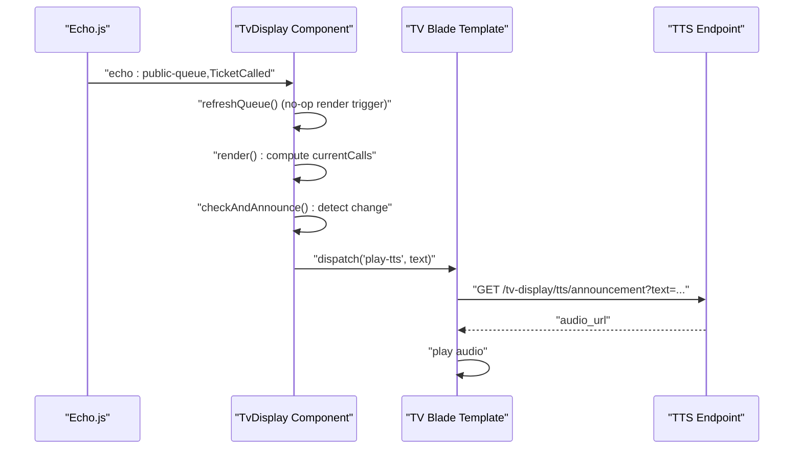
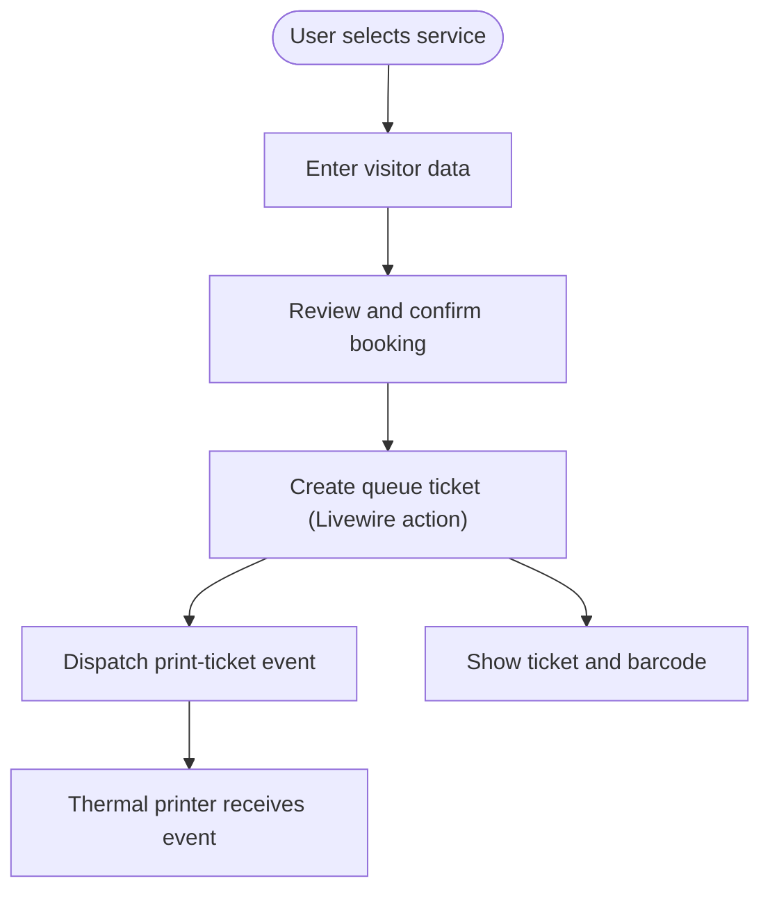
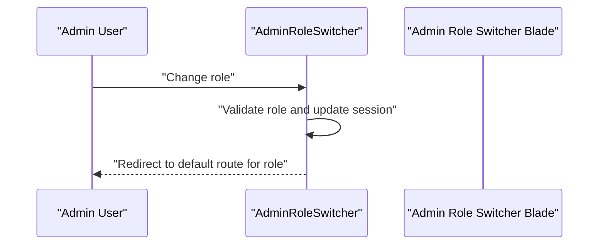
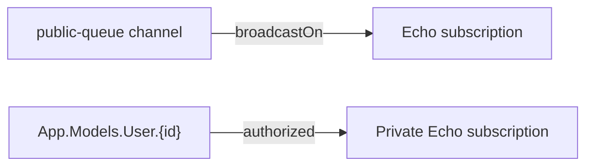
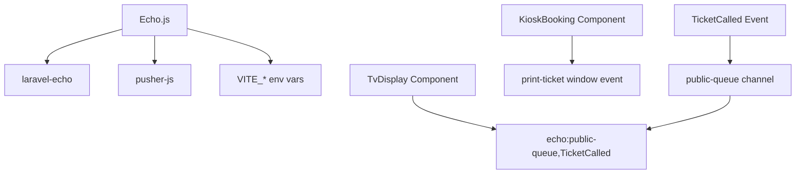

# Client Integration

<cite>
**Referenced Files in This Document**
- [echo.js](file://resources/js/echo.js)
- [broadcasting.php](file://config/broadcasting.php)
- [reverb.php](file://config/reverb.php)
- [channels.php](file://routes/channels.php)
- [TvDisplay.php](file://app/Livewire/TvDisplay.php)
- [tv-display.blade.php](file://resources/views/livewire/tv-display.blade.php)
- [KioskBooking.php](file://app/Livewire/KioskBooking.php)
- [kiosk-booking.blade.php](file://resources/views/livewire/kiosk-booking.blade.php)
- [AdminRoleSwitcher.php](file://app/Livewire/AdminRoleSwitcher.php)
- [admin-role-switcher.blade.php](file://resources/views/livewire/admin-role-switcher.blade.php)
- [TicketCalled.php](file://app/Events/TicketCalled.php)
- [app.js](file://resources/js/app.js)
- [tv-display.js](file://resources/js/tv-display.js)
- [kiosk.js](file://resources/js/kiosk.js)
</cite>

## Table of Contents
1. [Introduction](#introduction)
2. [Project Structure](#project-structure)
3. [Core Components](#core-components)
4. [Architecture Overview](#architecture-overview)
5. [Detailed Component Analysis](#detailed-component-analysis)
6. [Dependency Analysis](#dependency-analysis)
7. [Performance Considerations](#performance-considerations)
8. [Troubleshooting Guide](#troubleshooting-guide)
9. [Conclusion](#conclusion)

## Introduction
This document explains how the client integrates real-time features using Laravel Echo with Reverb. It covers:
- How Echo.js connects to Reverb servers and handles connection types
- Livewire component integration for automatic real-time updates without page refresh
- JavaScript event handling patterns for receiving queue updates across public web, kiosk, TV display, and administrative interfaces
- Examples of subscribing to specific channels, handling connection errors, and implementing fallback mechanisms
- Browser compatibility, connection persistence, and performance optimization techniques

## Project Structure
Real-time client-side integration spans three layers:
- Configuration: Broadcasting driver and Reverb server settings
- Client initialization: Echo.js setup and environment variables
- Frontend components: Livewire and Blade templates that subscribe to channels and react to events

**Diagram sources**
- [broadcasting.php:1-83](file://config/broadcasting.php#L1-L83)
- [reverb.php:1-103](file://config/reverb.php#L1-L103)
- [channels.php:1-8](file://routes/channels.php#L1-L8)
- [echo.js:1-15](file://resources/js/echo.js#L1-L15)
- [TvDisplay.php:1-142](file://app/Livewire/TvDisplay.php#L1-L142)
- [KioskBooking.php:1-288](file://app/Livewire/KioskBooking.php#L1-L288)
- [AdminRoleSwitcher.php:1-52](file://app/Livewire/AdminRoleSwitcher.php#L1-L52)
- [tv-display.blade.php:1-213](file://resources/views/livewire/tv-display.blade.php#L1-L213)
- [kiosk-booking.blade.php:1-588](file://resources/views/livewire/kiosk-booking.blade.php#L1-L588)
- [admin-role-switcher.blade.php:1-8](file://resources/views/livewire/admin-role-switcher.blade.php#L1-L8)
- [app.js:1-2](file://resources/js/app.js#L1-L2)

**Section sources**
- [broadcasting.php:1-83](file://config/broadcasting.php#L1-L83)
- [reverb.php:1-103](file://config/reverb.php#L1-L103)
- [channels.php:1-8](file://routes/channels.php#L1-L8)
- [echo.js:1-15](file://resources/js/echo.js#L1-L15)
- [TvDisplay.php:1-142](file://app/Livewire/TvDisplay.php#L1-L142)
- [KioskBooking.php:1-288](file://app/Livewire/KioskBooking.php#L1-L288)
- [AdminRoleSwitcher.php:1-52](file://app/Livewire/AdminRoleSwitcher.php#L1-L52)
- [tv-display.blade.php:1-213](file://resources/views/livewire/tv-display.blade.php#L1-L213)
- [kiosk-booking.blade.php:1-588](file://resources/views/livewire/kiosk-booking.blade.php#L1-L588)
- [admin-role-switcher.blade.php:1-8](file://resources/views/livewire/admin-role-switcher.blade.php#L1-L8)
- [app.js:1-2](file://resources/js/app.js#L1-L2)

## Core Components
- Echo.js initialization: Creates a Reverb-powered broadcaster with environment-driven host, port, TLS, and transport selection
- Livewire components:
  - TvDisplay: Subscribes to a public queue channel and triggers Livewire re-render on event reception
  - KioskBooking: Provides UI for kiosk users; integrates with thermal printer via JS events
  - AdminRoleSwitcher: Role switching UI for administrators
- Event pipeline: TicketCalled event broadcasts on a public channel; Echo listeners trigger Livewire lifecycle hooks

Key integration points:
- Echo configuration uses VITE_* environment variables for host, port, scheme, and app key
- Livewire uses #[On] attributes to bind to Echo event names
- Blade templates implement UI behaviors (e.g., TV display audio unlocking, offline indicators)

**Section sources**
- [echo.js:1-15](file://resources/js/echo.js#L1-L15)
- [broadcasting.php:31-47](file://config/broadcasting.php#L31-L47)
- [TvDisplay.php:22-27](file://app/Livewire/TvDisplay.php#L22-L27)
- [TicketCalled.php:27-32](file://app/Events/TicketCalled.php#L27-L32)
- [tv-display.blade.php:30-40](file://resources/views/livewire/tv-display.blade.php#L30-L40)

## Architecture Overview
The real-time flow connects server-side events to client-side Livewire components via Echo and Reverb.

**Diagram sources**
- [TicketCalled.php:11-33](file://app/Events/TicketCalled.php#L11-L33)
- [broadcasting.php:31-47](file://config/broadcasting.php#L31-L47)
- [TvDisplay.php:22-27](file://app/Livewire/TvDisplay.php#L22-L27)
- [echo.js:6-14](file://resources/js/echo.js#L6-L14)

## Detailed Component Analysis

### Echo.js and Reverb Connection
- Driver: Reverb
- Authentication: Uses VITE_REVERB_APP_KEY and app credentials from Reverb config
- Transport: Enables WebSocket transports ws and wss with dynamic host/port/scheme
- TLS: Forced when scheme is https

Operational behavior:
- Echo instance is globally available after import
- Environment variables drive connectivity to Reverb

**Diagram sources**
- [echo.js:6-14](file://resources/js/echo.js#L6-L14)
- [reverb.php:31-47](file://config/reverb.php#L31-L47)
- [broadcasting.php:31-47](file://config/broadcasting.php#L31-L47)

**Section sources**
- [echo.js:1-15](file://resources/js/echo.js#L1-L15)
- [reverb.php:1-103](file://config/reverb.php#L1-L103)
- [broadcasting.php:1-83](file://config/broadcasting.php#L1-L83)

### Livewire TvDisplay Integration
- Subscribes to echo:public-queue,TicketCalled
- Handler refreshQueue triggers re-render; render() computes current and recent calls and orchestrates TTS announcements
- Blade template reacts to play-tts window events and manages offline/online indicators

**Diagram sources**
- [TvDisplay.php:22-27](file://app/Livewire/TvDisplay.php#L22-L27)
- [TvDisplay.php:41-68](file://app/Livewire/TvDisplay.php#L41-L68)
- [tv-display.blade.php:30-40](file://resources/views/livewire/tv-display.blade.php#L30-L40)

**Section sources**
- [TvDisplay.php:1-142](file://app/Livewire/TvDisplay.php#L1-L142)
- [tv-display.blade.php:1-213](file://resources/views/livewire/tv-display.blade.php#L1-L213)

### Livewire Kiosk Booking Integration
- Provides kiosk user journey: service selection → visitor data → confirmation → ticket printing
- Emits print-ticket window events for thermal printer integration
- Uses Livewire computed properties for persisted state and reduced queries

**Diagram sources**
- [KioskBooking.php:155-180](file://app/Livewire/KioskBooking.php#L155-L180)
- [kiosk-booking.blade.php:9-10](file://resources/views/livewire/kiosk-booking.blade.php#L9-L10)
- [kiosk-booking.blade.php:480-487](file://resources/views/livewire/kiosk-booking.blade.php#L480-L487)

**Section sources**
- [KioskBooking.php:1-288](file://app/Livewire/KioskBooking.php#L1-L288)
- [kiosk-booking.blade.php:1-588](file://resources/views/livewire/kiosk-booking.blade.php#L1-L588)

### Livewire Admin Role Switcher
- Role selection dropdown with server-side validation and redirection
- Persists active role in session for subsequent navigation

**Diagram sources**
- [AdminRoleSwitcher.php:29-45](file://app/Livewire/AdminRoleSwitcher.php#L29-L45)
- [admin-role-switcher.blade.php:1-8](file://resources/views/livewire/admin-role-switcher.blade.php#L1-L8)

**Section sources**
- [AdminRoleSwitcher.php:1-52](file://app/Livewire/AdminRoleSwitcher.php#L1-L52)
- [admin-role-switcher.blade.php:1-8](file://resources/views/livewire/admin-role-switcher.blade.php#L1-L8)

### Channel Security and Subscription
- Public channel subscription: echo:public-queue,TicketCalled
- Private channel example: App.Models.User.{id} ensures per-user access

**Diagram sources**
- [TicketCalled.php:27-32](file://app/Events/TicketCalled.php#L27-L32)
- [channels.php:5-7](file://routes/channels.php#L5-L7)

**Section sources**
- [TicketCalled.php:1-33](file://app/Events/TicketCalled.php#L1-L33)
- [channels.php:1-8](file://routes/channels.php#L1-L8)

## Dependency Analysis
- Echo.js depends on:
  - Laravel Echo library
  - Pusher-JS (used via window.Pusher assignment)
  - Environment variables for Reverb connectivity
- Livewire components depend on:
  - Echo event names derived from broadcast channels
  - Blade templates for UI reactions (e.g., play-tts, offline indicators)
- Server-side:
  - Broadcasting driver configured to Reverb
  - TicketCalled event publishes on public-queue channel

**Diagram sources**
- [echo.js:1-4](file://resources/js/echo.js#L1-L4)
- [TvDisplay.php:22-27](file://app/Livewire/TvDisplay.php#L22-L27)
- [TicketCalled.php:27-32](file://app/Events/TicketCalled.php#L27-L32)

**Section sources**
- [echo.js:1-15](file://resources/js/echo.js#L1-L15)
- [TvDisplay.php:1-142](file://app/Livewire/TvDisplay.php#L1-L142)
- [TicketCalled.php:1-33](file://app/Events/TicketCalled.php#L1-L33)

## Performance Considerations
- Livewire computed caching:
  - TvDisplay videos cached via Cache::remember with TTL
  - Kiosk services persisted with long-lived computed cache
- Minimal re-rendering:
  - #[On] handlers trigger targeted re-renders rather than full page reloads
- Efficient event handling:
  - TV display checks for call changes before dispatching TTS
- Asset optimization:
  - Blade caches video URLs and sorts them for stable playback order

Recommendations:
- Keep Echo transport enabled for ws/wss to reduce latency
- Persist Livewire state for multi-step kiosk flows to minimize server round trips
- Debounce UI updates when multiple rapid events occur

**Section sources**
- [TvDisplay.php:118-140](file://app/Livewire/TvDisplay.php#L118-L140)
- [KioskBooking.php:53-59](file://app/Livewire/KioskBooking.php#L53-L59)
- [TvDisplay.php:41-68](file://app/Livewire/TvDisplay.php#L41-L68)

## Troubleshooting Guide
Common issues and resolutions:
- Connection failures:
  - Verify VITE_REVERB_HOST, VITE_REVERB_PORT, VITE_REVERB_SCHEME, and VITE_REVERB_APP_KEY
  - Ensure Reverb server is reachable and TLS settings match deployment
- Channel authorization errors:
  - Confirm user authentication for private channels (App.Models.User.{id})
  - Check route model binding and authorization logic
- Livewire event not firing:
  - Ensure #[On] attribute matches the Echo event name pattern
  - Confirm event broadcastOn returns the intended channel
- TV display audio not unlocking:
  - Trigger click/keyboard events to unlock browser audio context
  - Ensure play-tts window event payload contains a valid text parameter
- Offline indicator:
  - Observe online/offline window events and update UI accordingly

Fallback mechanisms:
- Blade template shows offline indicator and attempts reconnection
- TV display continues rendering recent calls while reconnecting
- Kiosk wizard persists state across steps to avoid repeated server requests

**Section sources**
- [echo.js:6-14](file://resources/js/echo.js#L6-L14)
- [channels.php:5-7](file://routes/channels.php#L5-L7)
- [TvDisplay.php:22-27](file://app/Livewire/TvDisplay.php#L22-L27)
- [TicketCalled.php:27-32](file://app/Events/TicketCalled.php#L27-L32)
- [tv-display.blade.php:26-29](file://resources/views/livewire/tv-display.blade.php#L26-L29)
- [tv-display.blade.php:54-58](file://resources/views/livewire/tv-display.blade.php#L54-L58)

## Conclusion
The client-side real-time integration leverages Echo.js with Reverb to deliver seamless updates across public web, kiosk, TV display, and administrative interfaces. Livewire’s #[On] event handlers enable reactive UI updates without full page reloads, while Blade templates implement robust fallbacks for connectivity and user experience. Proper configuration of environment variables, channel security, and performance-conscious caching ensures reliable, responsive behavior across diverse deployment scenarios.