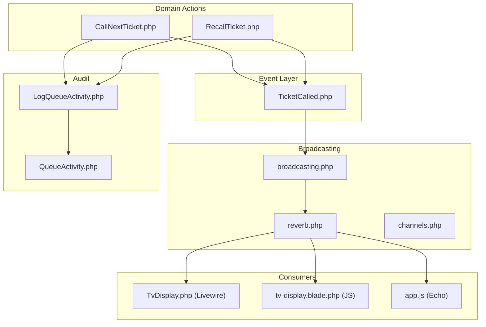
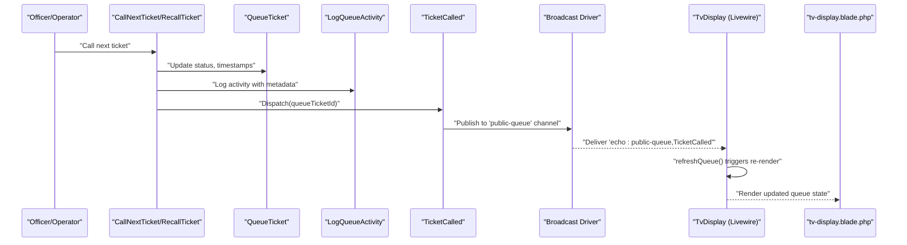
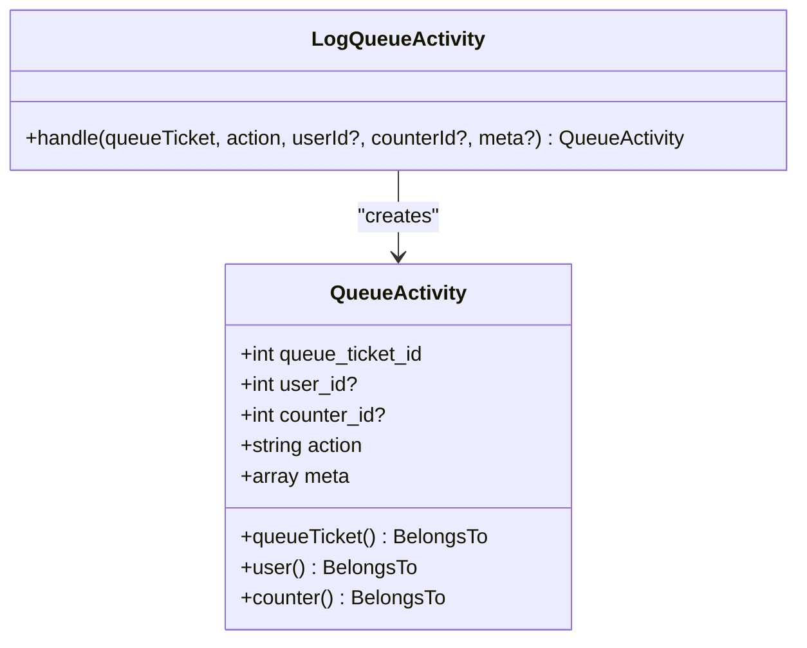
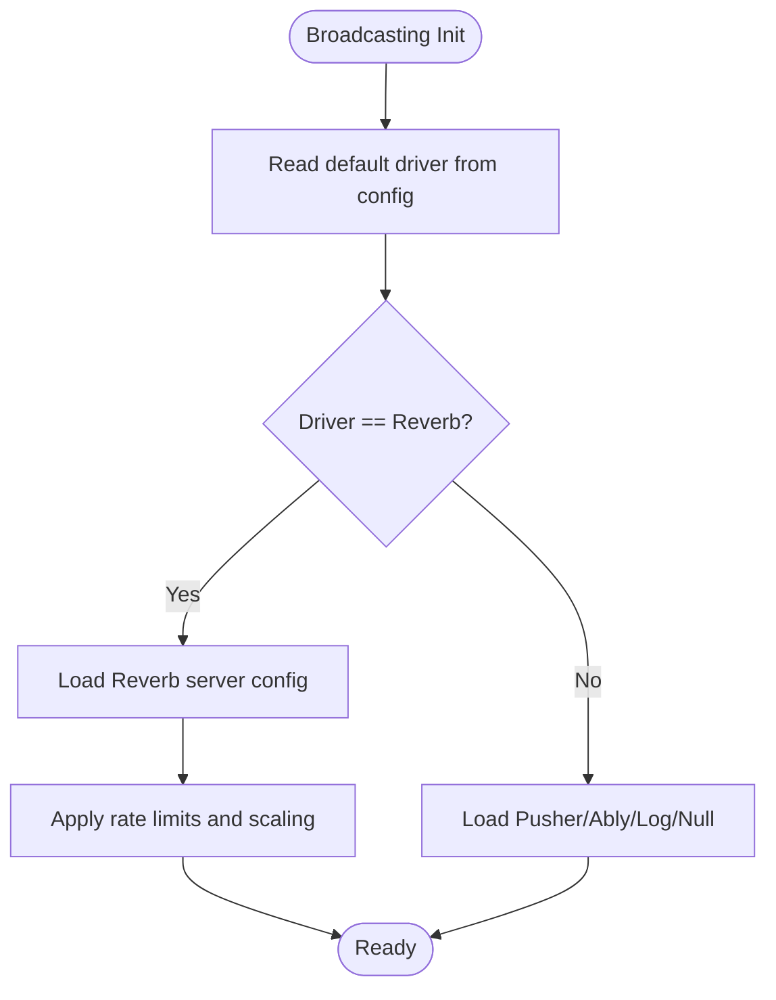
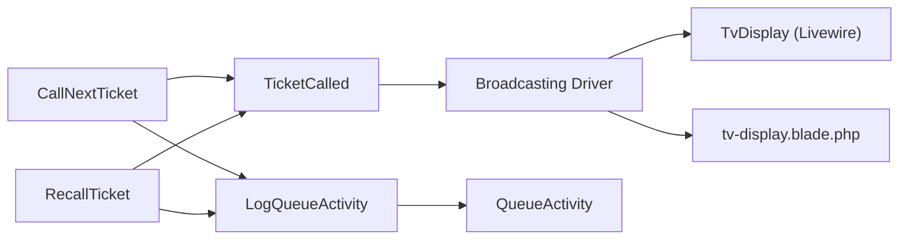

# Event System

<cite>
**Referenced Files in This Document**
- [TicketCalled.php](file://app/Events/TicketCalled.php)
- [LogQueueActivity.php](file://app/Actions/Queue/LogQueueActivity.php)
- [CallNextTicket.php](file://app/Actions/Queue/CallNextTicket.php)
- [RecallTicket.php](file://app/Actions/Queue/RecallTicket.php)
- [QueueActivity.php](file://app/Models/QueueActivity.php)
- [TvDisplay.php](file://app/Livewire/TvDisplay.php)
- [channels.php](file://routes/channels.php)
- [broadcasting.php](file://config/broadcasting.php)
- [reverb.php](file://config/reverb.php)
- [tv-display.blade.php](file://resources/views/livewire/tv-display.blade.php)
- [app.js](file://resources/js/app.js)
- [QueueAuditLogTest.php](file://tests/Feature/Audit/QueueAuditLogTest.php)
</cite>

## Table of Contents
1. [Introduction](#introduction)
2. [Project Structure](#project-structure)
3. [Core Components](#core-components)
4. [Architecture Overview](#architecture-overview)
5. [Detailed Component Analysis](#detailed-component-analysis)
6. [Dependency Analysis](#dependency-analysis)
7. [Performance Considerations](#performance-considerations)
8. [Troubleshooting Guide](#troubleshooting-guide)
9. [Conclusion](#conclusion)

## Introduction
This document explains the event-driven architecture used to propagate queue state changes across the system. It focuses on how queue state transitions trigger events, how those events are broadcast to all interfaces, and how Livewire components automatically update in response. It also documents the TicketCalled event implementation, payload structure, broadcasting mechanisms, the LogQueueActivity action for audit trails, and real-time update patterns. Finally, it covers event serialization, deserialization, and performance considerations for high-frequency queue updates.

## Project Structure
The event system spans several layers:
- Domain actions that mutate queue state and emit events
- Event classes that encapsulate broadcast payloads
- Broadcasting configuration for real-time transport
- Livewire components that subscribe to events and refresh automatically
- Audit trail persistence via an action that logs queue activities

**Diagram sources**
- [CallNextTicket.php:19-77](file://app/Actions/Queue/CallNextTicket.php#L19-L77)
- [RecallTicket.php:17-47](file://app/Actions/Queue/RecallTicket.php#L17-L47)
- [TicketCalled.php:11-33](file://app/Events/TicketCalled.php#L11-L33)
- [broadcasting.php:31-80](file://config/broadcasting.php#L31-L80)
- [reverb.php:29-55](file://config/reverb.php#L29-L55)
- [channels.php:5-7](file://routes/channels.php#L5-L7)
- [TvDisplay.php:22-27](file://app/Livewire/TvDisplay.php#L22-L27)
- [tv-display.blade.php:30-40](file://resources/views/livewire/tv-display.blade.php#L30-L40)
- [app.js:3-9](file://resources/js/app.js#L3-L9)
- [LogQueueActivity.php:13-27](file://app/Actions/Queue/LogQueueActivity.php#L13-L27)
- [QueueActivity.php:14-27](file://app/Models/QueueActivity.php#L14-L27)

**Section sources**
- [CallNextTicket.php:19-77](file://app/Actions/Queue/CallNextTicket.php#L19-L77)
- [RecallTicket.php:17-47](file://app/Actions/Queue/RecallTicket.php#L17-L47)
- [TicketCalled.php:11-33](file://app/Events/TicketCalled.php#L11-L33)
- [broadcasting.php:31-80](file://config/broadcasting.php#L31-L80)
- [reverb.php:29-55](file://config/reverb.php#L29-L55)
- [channels.php:5-7](file://routes/channels.php#L5-L7)
- [TvDisplay.php:22-27](file://app/Livewire/TvDisplay.php#L22-L27)
- [tv-display.blade.php:30-40](file://resources/views/livewire/tv-display.blade.php#L30-L40)
- [app.js:3-9](file://resources/js/app.js#L3-L9)
- [LogQueueActivity.php:13-27](file://app/Actions/Queue/LogQueueActivity.php#L13-L27)
- [QueueActivity.php:14-27](file://app/Models/QueueActivity.php#L14-L27)

## Core Components
- TicketCalled event: Encapsulates the queue ticket identifier and broadcasts on a public channel for real-time updates.
- CallNextTicket and RecallTicket actions: Mutate queue state, log activities, and dispatch TicketCalled.
- LogQueueActivity action: Creates audit trail entries with structured metadata.
- TvDisplay Livewire component: Subscribes to the event and refreshes the UI automatically.
- Broadcasting configuration: Configures Reverb/Pusher/Ably and channel policies.

**Section sources**
- [TicketCalled.php:11-33](file://app/Events/TicketCalled.php#L11-L33)
- [CallNextTicket.php:19-77](file://app/Actions/Queue/CallNextTicket.php#L19-L77)
- [RecallTicket.php:17-47](file://app/Actions/Queue/RecallTicket.php#L17-L47)
- [LogQueueActivity.php:13-27](file://app/Actions/Queue/LogQueueActivity.php#L13-L27)
- [QueueActivity.php:14-27](file://app/Models/QueueActivity.php#L14-L27)
- [TvDisplay.php:22-27](file://app/Livewire/TvDisplay.php#L22-L27)

## Architecture Overview
The event-driven flow begins when a queue state change occurs. The domain action updates the ticket, logs the activity, and emits the TicketCalled event. The event is broadcast over a configured transport (Reverb/Pusher/Ably) to a named channel. Livewire components subscribed to that channel receive the event and trigger a re-render, updating the UI without requiring manual polling.

**Diagram sources**
- [CallNextTicket.php:54-74](file://app/Actions/Queue/CallNextTicket.php#L54-L74)
- [RecallTicket.php:25-44](file://app/Actions/Queue/RecallTicket.php#L25-L44)
- [LogQueueActivity.php:20-26](file://app/Actions/Queue/LogQueueActivity.php#L20-L26)
- [TicketCalled.php:18-32](file://app/Events/TicketCalled.php#L18-L32)
- [TvDisplay.php:22-27](file://app/Livewire/TvDisplay.php#L22-L27)
- [tv-display.blade.php:30-40](file://resources/views/livewire/tv-display.blade.php#L30-L40)

## Detailed Component Analysis

### TicketCalled Event
- Purpose: Signals that a ticket has been called or recalled, enabling real-time UI updates.
- Payload: Minimal payload carrying the queue ticket identifier.
- Broadcasting: Targets a public channel suitable for display screens and monitoring interfaces.

Implementation highlights:
- Implements the immediate broadcast interface to avoid queue delays.
- Serializes the model payload for transport.
- Broadcasts on a single public channel for simplicity and scalability.

**Section sources**
- [TicketCalled.php:11-33](file://app/Events/TicketCalled.php#L11-L33)

### Domain Actions That Emit Events
- CallNextTicket: Updates a waiting ticket to called, logs the activity, and dispatches the event.
- RecallTicket: Recalls a currently called ticket, logs the activity, and dispatches the event.

Both actions:
- Use transactional updates to ensure atomicity.
- Log structured metadata for auditability.
- Dispatch the same event type to maintain a consistent consumer contract.

**Section sources**
- [CallNextTicket.php:19-77](file://app/Actions/Queue/CallNextTicket.php#L19-L77)
- [RecallTicket.php:17-47](file://app/Actions/Queue/RecallTicket.php#L17-L47)

### LogQueueActivity Action and Audit Trail
- Purpose: Persist queue operation history with contextual metadata.
- Behavior: Creates a queue activity record with action type, actor, counter, and structured meta data.
- Meta fields commonly include status transitions, service and pool identifiers, and visit purpose.

**Diagram sources**
- [LogQueueActivity.php:8-28](file://app/Actions/Queue/LogQueueActivity.php#L8-L28)
- [QueueActivity.php:9-43](file://app/Models/QueueActivity.php#L9-L43)

**Section sources**
- [LogQueueActivity.php:13-27](file://app/Actions/Queue/LogQueueActivity.php#L13-L27)
- [QueueActivity.php:14-27](file://app/Models/QueueActivity.php#L14-L27)
- [QueueAuditLogTest.php:37-72](file://tests/Feature/Audit/QueueAuditLogTest.php#L37-L72)

### Livewire Consumers and Real-Time Updates
- TvDisplay Livewire component subscribes to the event via a decorator that binds to the echo channel and event name.
- On receipt, the component triggers a re-render, which recalculates current and recent calls and optionally announces via TTS.

Real-time update pattern:
- Event listener: Listens for echo channel events.
- Refresh handler: Performs a no-op that triggers Livewire reactivity.
- Render logic: Queries current and recent calls and applies TTS announcements when appropriate.

**Section sources**
- [TvDisplay.php:22-27](file://app/Livewire/TvDisplay.php#L22-L27)
- [TvDisplay.php:29-39](file://app/Livewire/TvDisplay.php#L29-L39)
- [TvDisplay.php:41-68](file://app/Livewire/TvDisplay.php#L41-L68)

### Broadcasting Configuration and Transport
- Default driver is configurable via environment and supports Reverb, Pusher, Ably, Redis, Log, and Null drivers.
- Reverb server configuration defines host, port, TLS, scaling, rate limits, and message sizes.
- Channel policy restricts private user channels to authenticated users.

**Diagram sources**
- [broadcasting.php:18-80](file://config/broadcasting.php#L18-L80)
- [reverb.php:29-55](file://config/reverb.php#L29-L55)
- [channels.php:5-7](file://routes/channels.php#L5-L7)

**Section sources**
- [broadcasting.php:31-80](file://config/broadcasting.php#L31-L80)
- [reverb.php:29-55](file://config/reverb.php#L29-L55)
- [channels.php:5-7](file://routes/channels.php#L5-L7)

### JavaScript Integration and Echo
- The application initializes Echo to connect to the broadcasting transport.
- Blade templates can listen for window-level events and integrate with TTS playback.

**Section sources**
- [app.js:3-9](file://resources/js/app.js#L3-L9)
- [tv-display.blade.php:30-40](file://resources/views/livewire/tv-display.blade.php#L30-L40)

## Dependency Analysis
The event system exhibits low coupling and high cohesion:
- Actions depend on the event dispatcher and the logging action.
- The event is decoupled from consumers via the broadcast layer.
- Livewire components depend only on the event name and channel, not on the underlying transport.

**Diagram sources**
- [CallNextTicket.php:74](file://app/Actions/Queue/CallNextTicket.php#L74)
- [RecallTicket.php:44](file://app/Actions/Queue/RecallTicket.php#L44)
- [TicketCalled.php:27-32](file://app/Events/TicketCalled.php#L27-L32)
- [TvDisplay.php:22-27](file://app/Livewire/TvDisplay.php#L22-L27)
- [LogQueueActivity.php:20-26](file://app/Actions/Queue/LogQueueActivity.php#L20-L26)
- [QueueActivity.php:29-42](file://app/Models/QueueActivity.php#L29-L42)

**Section sources**
- [CallNextTicket.php:19-77](file://app/Actions/Queue/CallNextTicket.php#L19-L77)
- [RecallTicket.php:17-47](file://app/Actions/Queue/RecallTicket.php#L17-L47)
- [TicketCalled.php:11-33](file://app/Events/TicketCalled.php#L11-L33)
- [LogQueueActivity.php:13-27](file://app/Actions/Queue/LogQueueActivity.php#L13-L27)
- [QueueActivity.php:14-27](file://app/Models/QueueActivity.php#L14-L27)
- [TvDisplay.php:22-27](file://app/Livewire/TvDisplay.php#L22-L27)

## Performance Considerations
- Event volume: High-frequency queue updates require careful broadcast configuration and consumer handling.
- Transport selection: Prefer Reverb for local development and scalable deployments; configure rate limits and message size caps.
- Consumer efficiency: Livewire re-renders are lightweight but still involve database queries; cache or limit query scope where appropriate.
- Serialization overhead: Keep event payloads minimal (only identifiers) to reduce bandwidth and CPU usage.
- Backpressure: Use rate limiting and scaling options in the Reverb configuration to prevent overload during peak usage.

[No sources needed since this section provides general guidance]

## Troubleshooting Guide
Common issues and resolutions:
- Event not received by Livewire:
  - Verify the event name and channel match the subscription pattern.
  - Confirm the broadcasting driver is reachable and configured correctly.
- Missing audit logs:
  - Ensure the logging action is invoked after state changes.
  - Check that the QueueActivity model accepts the meta field and relationships are defined.
- Broadcasting connectivity:
  - Review Reverb server settings and TLS configuration.
  - Validate channel policies for private channels if applicable.

**Section sources**
- [TvDisplay.php:22-27](file://app/Livewire/TvDisplay.php#L22-L27)
- [LogQueueActivity.php:20-26](file://app/Actions/Queue/LogQueueActivity.php#L20-L26)
- [QueueActivity.php:14-27](file://app/Models/QueueActivity.php#L14-L27)
- [broadcasting.php:31-80](file://config/broadcasting.php#L31-L80)
- [reverb.php:29-55](file://config/reverb.php#L29-L55)

## Conclusion
The event-driven architecture cleanly separates state mutations, auditing, and real-time UI updates. TicketCalled serves as a single, minimal signal that propagates across the system, enabling responsive displays and consistent audit trails. With proper broadcasting configuration and efficient consumer handling, the system scales to handle high-frequency queue operations reliably.