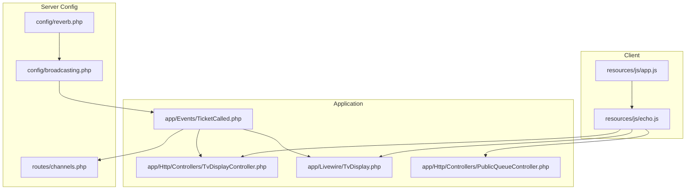
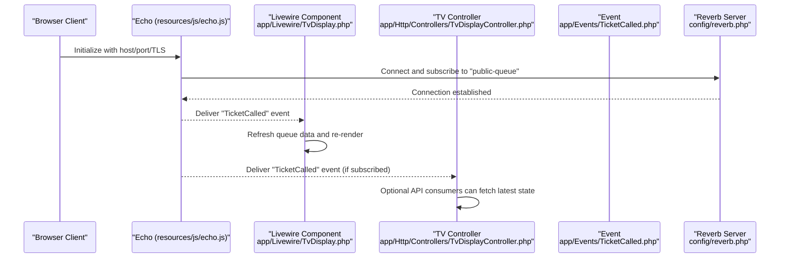
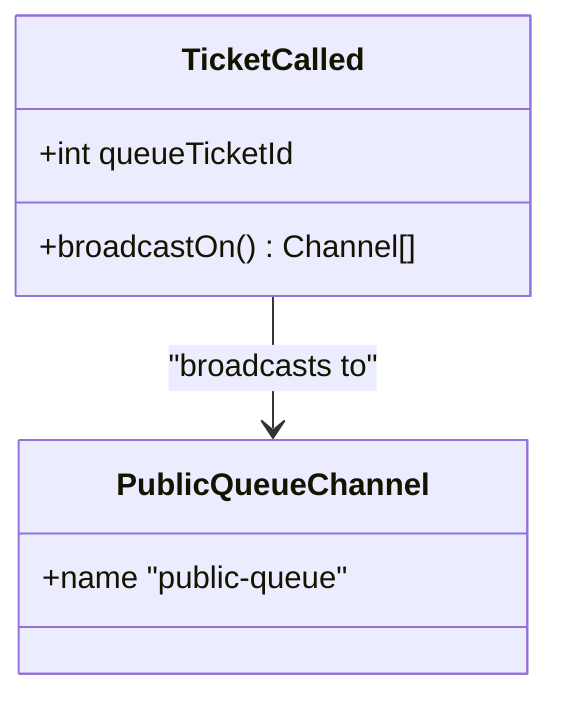
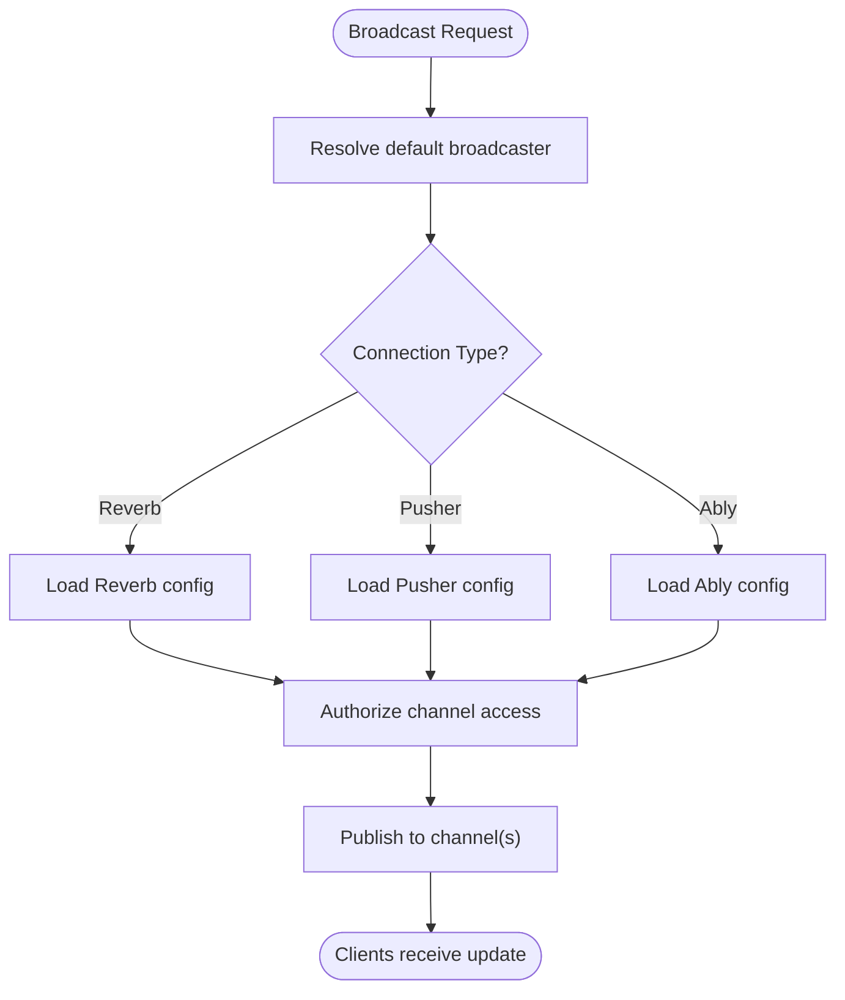
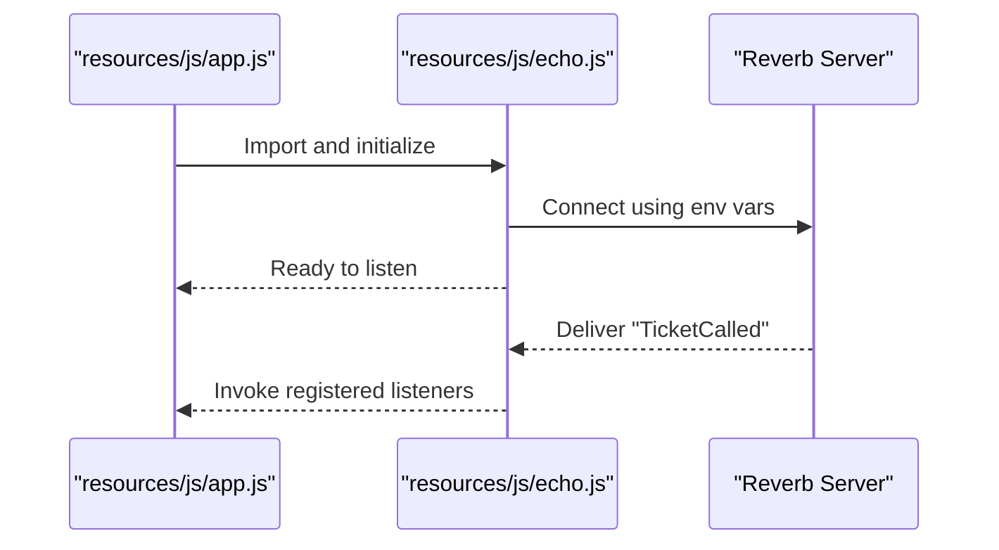
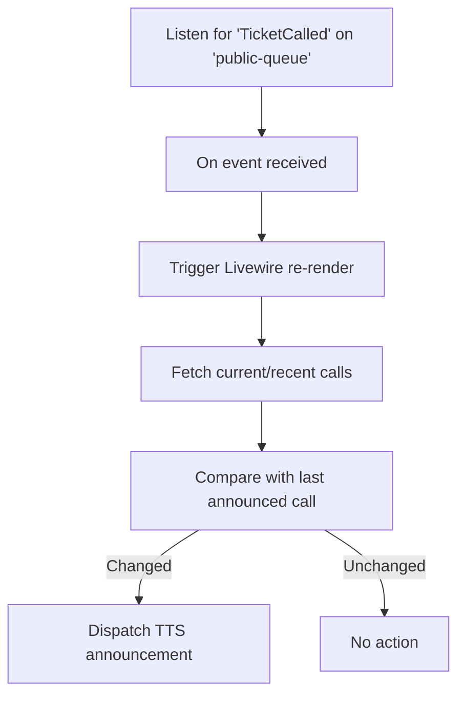
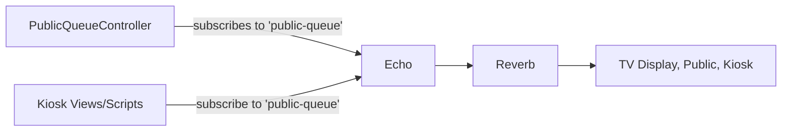
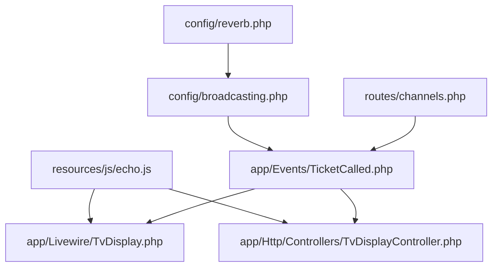

# Real-time Communication

<cite>
**Referenced Files in This Document**
- [config/reverb.php](file://config/reverb.php)
- [config/broadcasting.php](file://config/broadcasting.php)
- [routes/channels.php](file://routes/channels.php)
- [app/Events/TicketCalled.php](file://app/Events/TicketCalled.php)
- [resources/js/echo.js](file://resources/js/echo.js)
- [resources/js/app.js](file://resources/js/app.js)
- [app/Http/Controllers/TvDisplayController.php](file://app/Http/Controllers/TvDisplayController.php)
- [app/Livewire/TvDisplay.php](file://app/Livewire/TvDisplay.php)
- [app/Http/Controllers/PublicQueueController.php](file://app/Http/Controllers/PublicQueueController.php)
</cite>

## Table of Contents
1. [Introduction](#introduction)
2. [Project Structure](#project-structure)
3. [Core Components](#core-components)
4. [Architecture Overview](#architecture-overview)
5. [Detailed Component Analysis](#detailed-component-analysis)
6. [Dependency Analysis](#dependency-analysis)
7. [Performance Considerations](#performance-considerations)
8. [Troubleshooting Guide](#troubleshooting-guide)
9. [Conclusion](#conclusion)

## Introduction
This document explains the real-time communication system built with Laravel Reverb and Echo.js. It covers the WebSocket architecture, event-driven updates for queue state changes, broadcasting to multiple client interfaces (public web, kiosk, TV display, and administration), and client-side handling of live updates. It also documents event types, message formats, and practical guidance for performance, connection management, and fallbacks under degraded network conditions.

## Project Structure
The real-time system spans configuration, server-side events, broadcasting, and client-side listeners:
- Server configuration defines Reverb and broadcasting connections.
- Events declare channels and immediate broadcast semantics.
- Controllers and Livewire components expose data and react to real-time updates.
- Client scripts initialize Echo and subscribe to channels.

**Diagram sources**
- [config/reverb.php:1-103](file://config/reverb.php#L1-L103)
- [config/broadcasting.php:1-83](file://config/broadcasting.php#L1-L83)
- [routes/channels.php:1-8](file://routes/channels.php#L1-L8)
- [app/Events/TicketCalled.php:1-34](file://app/Events/TicketCalled.php#L1-L34)
- [app/Http/Controllers/TvDisplayController.php:1-144](file://app/Http/Controllers/TvDisplayController.php#L1-L144)
- [app/Livewire/TvDisplay.php:1-142](file://app/Livewire/TvDisplay.php#L1-L142)
- [app/Http/Controllers/PublicQueueController.php:1-110](file://app/Http/Controllers/PublicQueueController.php#L1-L110)
- [resources/js/echo.js:1-15](file://resources/js/echo.js#L1-L15)
- [resources/js/app.js:1-10](file://resources/js/app.js#L1-L10)

**Section sources**
- [config/reverb.php:1-103](file://config/reverb.php#L1-L103)
- [config/broadcasting.php:1-83](file://config/broadcasting.php#L1-L83)
- [routes/channels.php:1-8](file://routes/channels.php#L1-L8)
- [app/Events/TicketCalled.php:1-34](file://app/Events/TicketCalled.php#L1-L34)
- [resources/js/echo.js:1-15](file://resources/js/echo.js#L1-L15)
- [resources/js/app.js:1-10](file://resources/js/app.js#L1-L10)
- [app/Http/Controllers/TvDisplayController.php:1-144](file://app/Http/Controllers/TvDisplayController.php#L1-L144)
- [app/Livewire/TvDisplay.php:1-142](file://app/Livewire/TvDisplay.php#L1-L142)
- [app/Http/Controllers/PublicQueueController.php:1-110](file://app/Http/Controllers/PublicQueueController.php#L1-L110)

## Core Components
- Reverb server configuration: Defines host, port, TLS, scaling via Redis, and ingestion intervals.
- Broadcasting configuration: Selects the default broadcaster and connection options for Reverb/Pusher/Ably/log/null.
- Channel authorization: Restricts access to user-specific channels.
- Event definition: Declares a real-time event that broadcasts immediately to a public channel.
- Client initialization: Echo configured to use Reverb with environment-driven host/port/TLS settings.
- Livewire and controller consumers: Subscribe to events and refresh data/views accordingly.

Key implementation references:
- Reverb server options and scaling: [config/reverb.php:29-L57]
- Broadcasting connections and defaults: [config/broadcasting.php:18-L80]
- Channel authorization pattern: [routes/channels.php:5-L7]
- Event broadcast channel and immediate dispatch: [app/Events/TicketCalled.php:27-L32]
- Echo client setup: [resources/js/echo.js:6-L14]
- Livewire event listener and rendering: [app/Livewire/TvDisplay.php:22-L27]

**Section sources**
- [config/reverb.php:29-57](file://config/reverb.php#L29-L57)
- [config/broadcasting.php:18-80](file://config/broadcasting.php#L18-L80)
- [routes/channels.php:5-7](file://routes/channels.php#L5-L7)
- [app/Events/TicketCalled.php:27-32](file://app/Events/TicketCalled.php#L27-L32)
- [resources/js/echo.js:6-14](file://resources/js/echo.js#L6-L14)
- [app/Livewire/TvDisplay.php:22-27](file://app/Livewire/TvDisplay.php#L22-L27)

## Architecture Overview
The system uses Laravel Reverb as the WebSocket server and Laravel Echo on the client to subscribe to channels. Events are broadcast immediately to a public channel, and multiple client interfaces listen for updates.

**Diagram sources**
- [resources/js/echo.js:6-14](file://resources/js/echo.js#L6-L14)
- [app/Livewire/TvDisplay.php:22-27](file://app/Livewire/TvDisplay.php#L22-L27)
- [app/Http/Controllers/TvDisplayController.php:89-142](file://app/Http/Controllers/TvDisplayController.php#L89-L142)
- [app/Events/TicketCalled.php:27-32](file://app/Events/TicketCalled.php#L27-L32)
- [config/reverb.php:29-57](file://config/reverb.php#L29-L57)

## Detailed Component Analysis

### Event-Driven Architecture: Ticket Called
- Event type: Immediate broadcast for queue announcements.
- Broadcast channel: A single public channel for broad reach.
- Payload: Minimal identifier for the affected ticket; consumers fetch full state.
- Trigger points: Business actions that change queue state (e.g., calling the next ticket).

**Diagram sources**
- [app/Events/TicketCalled.php:11-32](file://app/Events/TicketCalled.php#L11-L32)

**Section sources**
- [app/Events/TicketCalled.php:11-32](file://app/Events/TicketCalled.php#L11-L32)

### Broadcasting Configuration and Channel Authorization
- Default broadcaster and connection options are defined centrally.
- Channel authorization ensures only intended users can access private channels.
- Public channel is open for broadcasting to all clients.

**Diagram sources**
- [config/broadcasting.php:18-80](file://config/broadcasting.php#L18-L80)
- [routes/channels.php:5-7](file://routes/channels.php#L5-L7)

**Section sources**
- [config/broadcasting.php:18-80](file://config/broadcasting.php#L18-L80)
- [routes/channels.php:5-7](file://routes/channels.php#L5-L7)

### Client-Side Integration with Echo.js
- Echo is initialized with environment-driven host, port, and TLS scheme.
- Subscribes to the public channel to receive live updates.
- Multiple consumers can listen: Livewire components and controllers.

**Diagram sources**
- [resources/js/app.js:9-9](file://resources/js/app.js#L9-L9)
- [resources/js/echo.js:6-14](file://resources/js/echo.js#L6-L14)

**Section sources**
- [resources/js/app.js:9-9](file://resources/js/app.js#L9-L9)
- [resources/js/echo.js:6-14](file://resources/js/echo.js#L6-L14)

### Livewire TV Display Consumer
- Listens for the event on the public channel.
- Triggers a re-render to refresh queue state and TTS announcements.
- Implements last-announced deduplication to avoid repeated announcements.

**Diagram sources**
- [app/Livewire/TvDisplay.php:22-27](file://app/Livewire/TvDisplay.php#L22-L27)
- [app/Livewire/TvDisplay.php:41-68](file://app/Livewire/TvDisplay.php#L41-L68)

**Section sources**
- [app/Livewire/TvDisplay.php:22-27](file://app/Livewire/TvDisplay.php#L22-L27)
- [app/Livewire/TvDisplay.php:41-68](file://app/Livewire/TvDisplay.php#L41-L68)

### Public Web and Kiosk Interfaces
- Public web interface supports booking and lookup flows; it can subscribe to the same public channel for live updates.
- Kiosk module supports authentication and booking flows; it can also subscribe to the public channel for live updates.

**Diagram sources**
- [app/Http/Controllers/PublicQueueController.php:18-25](file://app/Http/Controllers/PublicQueueController.php#L18-L25)
- [resources/js/echo.js:6-14](file://resources/js/echo.js#L6-L14)

**Section sources**
- [app/Http/Controllers/PublicQueueController.php:18-25](file://app/Http/Controllers/PublicQueueController.php#L18-L25)
- [resources/js/echo.js:6-14](file://resources/js/echo.js#L6-L14)

## Dependency Analysis
- Event depends on broadcasting configuration and channel authorization.
- Echo depends on environment variables for Reverb connectivity.
- Livewire and controllers depend on Echo to receive events.
- Reverb configuration influences scalability and operational metrics.

**Diagram sources**
- [config/broadcasting.php:18-80](file://config/broadcasting.php#L18-L80)
- [config/reverb.php:29-57](file://config/reverb.php#L29-L57)
- [routes/channels.php:5-7](file://routes/channels.php#L5-L7)
- [app/Events/TicketCalled.php:27-32](file://app/Events/TicketCalled.php#L27-L32)
- [resources/js/echo.js:6-14](file://resources/js/echo.js#L6-L14)
- [app/Livewire/TvDisplay.php:22-27](file://app/Livewire/TvDisplay.php#L22-L27)
- [app/Http/Controllers/TvDisplayController.php:89-142](file://app/Http/Controllers/TvDisplayController.php#L89-L142)

**Section sources**
- [config/broadcasting.php:18-80](file://config/broadcasting.php#L18-L80)
- [config/reverb.php:29-57](file://config/reverb.php#L29-L57)
- [routes/channels.php:5-7](file://routes/channels.php#L5-L7)
- [app/Events/TicketCalled.php:27-32](file://app/Events/TicketCalled.php#L27-L32)
- [resources/js/echo.js:6-14](file://resources/js/echo.js#L6-L14)
- [app/Livewire/TvDisplay.php:22-27](file://app/Livewire/TvDisplay.php#L22-L27)
- [app/Http/Controllers/TvDisplayController.php:89-142](file://app/Http/Controllers/TvDisplayController.php#L89-L142)

## Performance Considerations
- Reverb scaling: Enable and configure Redis-backed scaling to support horizontal growth.
- Message sizing: Tune max message size to accommodate payload without fragmentation.
- Rate limiting: Optionally enable rate limiting at the application level to protect the server under load.
- Pulse/Telescope ingestion: Adjust ingest intervals to balance observability and overhead.
- Client deduplication: Livewire component avoids redundant TTS by tracking last announced call.
- Caching: TV display caches video lists to reduce repeated filesystem scans.

Practical references:
- Scaling and Redis options: [config/reverb.php:40-L52]
- Max message size and ping/activity timeouts: [config/reverb.php:39-L54], [config/broadcasting.php:86-L96]
- Livewire deduplication: [app/Livewire/TvDisplay.php:48-L67]
- Video caching: [app/Livewire/TvDisplay.php:120-L139]

**Section sources**
- [config/reverb.php:40-54](file://config/reverb.php#L40-L54)
- [config/broadcasting.php:86-96](file://config/broadcasting.php#L86-L96)
- [app/Livewire/TvDisplay.php:48-67](file://app/Livewire/TvDisplay.php#L48-L67)
- [app/Livewire/TvDisplay.php:120-139](file://app/Livewire/TvDisplay.php#L120-L139)

## Troubleshooting Guide
- Connectivity issues:
  - Verify environment variables for host, port, and TLS scheme used by Echo.
  - Confirm Reverb server is reachable and listening on the configured address.
- Authentication and authorization:
  - Ensure channel authorization rules match intended audience.
- Over-broadcasting or missed events:
  - Confirm the event implements immediate broadcast semantics and targets the correct channel.
  - Check client subscription to the channel.
- Degraded network conditions:
  - Echo transports include WebSocket and secure variants; ensure proper fallbacks are enabled.
  - Implement client-side retry/backoff and graceful degradation in consumers.
- Monitoring:
  - Use Reverb’s telemetry intervals to observe traffic and health.

Operational references:
- Echo configuration and transports: [resources/js/echo.js:6-L14]
- Reverb server and TLS options: [config/reverb.php:32-L38]
- Broadcasting defaults and connections: [config/broadcasting.php:18-L47]
- Channel authorization: [routes/channels.php:5-L7]

**Section sources**
- [resources/js/echo.js:6-14](file://resources/js/echo.js#L6-L14)
- [config/reverb.php:32-38](file://config/reverb.php#L32-L38)
- [config/broadcasting.php:18-47](file://config/broadcasting.php#L18-L47)
- [routes/channels.php:5-7](file://routes/channels.php#L5-L7)

## Conclusion
The real-time communication system leverages Laravel Reverb and Echo.js to deliver immediate, reliable updates across public, kiosk, and TV display interfaces. Events are broadcast to a shared public channel, enabling decoupled consumers to refresh state and provide live feedback. Configuration supports scaling, monitoring, and operational resilience, while client-side consumers implement deduplication and caching to maintain responsiveness under varying conditions.