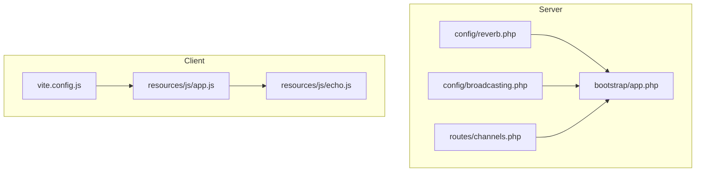
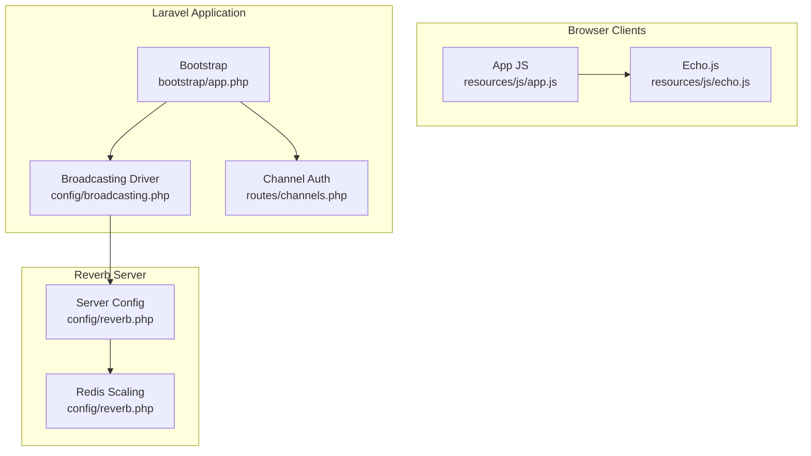
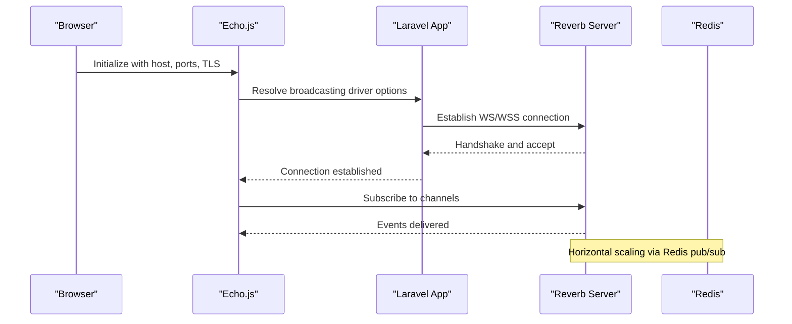
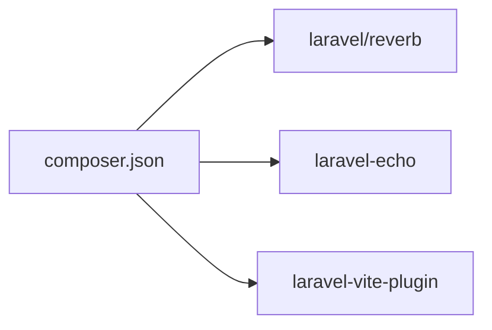

# WebSocket Architecture

<cite>
**Referenced Files in This Document**
- [config/reverb.php](file://config/reverb.php)
- [config/broadcasting.php](file://config/broadcasting.php)
- [resources/js/echo.js](file://resources/js/echo.js)
- [resources/js/app.js](file://resources/js/app.js)
- [routes/channels.php](file://routes/channels.php)
- [bootstrap/app.php](file://bootstrap/app.php)
- [vite.config.js](file://vite.config.js)
- [composer.json](file://composer.json)
</cite>

## Table of Contents
1. [Introduction](#introduction)
2. [Project Structure](#project-structure)
3. [Core Components](#core-components)
4. [Architecture Overview](#architecture-overview)
5. [Detailed Component Analysis](#detailed-component-analysis)
6. [Dependency Analysis](#dependency-analysis)
7. [Performance Considerations](#performance-considerations)
8. [Troubleshooting Guide](#troubleshooting-guide)
9. [Conclusion](#conclusion)
10. [Appendices](#appendices)

## Introduction
This document explains the WebSocket architecture powered by Laravel Reverb in this project. It covers server configuration, connection handling, horizontal scaling via Redis, TLS setup, client-side Echo.js integration for browsers, connection lifecycle management, authentication for WebSocket connections, and performance tuning. It also provides practical examples for development and production environments, including environment variable configuration and security considerations.

## Project Structure
The WebSocket stack is composed of:
- Server configuration for Reverb and broadcasting drivers
- Client-side initialization of Echo.js with Vite-managed assets
- Channel authentication for private/Presence channels
- Bootstrap wiring for routing and middleware

**Diagram sources**
- [config/reverb.php:1-103](file://config/reverb.php#L1-L103)
- [config/broadcasting.php:1-83](file://config/broadcasting.php#L1-L83)
- [routes/channels.php:1-8](file://routes/channels.php#L1-L8)
- [bootstrap/app.php:1-32](file://bootstrap/app.php#L1-L32)
- [resources/js/app.js:1-10](file://resources/js/app.js#L1-L10)
- [resources/js/echo.js:1-15](file://resources/js/echo.js#L1-L15)
- [vite.config.js:1-37](file://vite.config.js#L1-L37)

**Section sources**
- [config/reverb.php:1-103](file://config/reverb.php#L1-L103)
- [config/broadcasting.php:1-83](file://config/broadcasting.php#L1-L83)
- [routes/channels.php:1-8](file://routes/channels.php#L1-L8)
- [bootstrap/app.php:1-32](file://bootstrap/app.php#L1-L32)
- [resources/js/app.js:1-10](file://resources/js/app.js#L1-L10)
- [resources/js/echo.js:1-15](file://resources/js/echo.js#L1-L15)
- [vite.config.js:1-37](file://vite.config.js#L1-L37)

## Core Components
- Reverb server configuration defines host, port, path, hostname, TLS options, request size limits, scaling parameters, and telemetry ingest intervals.
- Broadcasting driver configuration selects Reverb as the broadcaster and passes host, port, scheme, and TLS flags.
- Client-side Echo.js initializes with broadcaster type, app key, host, ports, TLS enforcement, and transport selection.
- Channel authentication restricts access to private channels based on user identity.
- Bootstrap wires routing and middleware, including trusted proxy and CORS handling.

Key configuration anchors:
- Reverb server defaults and scaling: [config/reverb.php:29-L55]
- Reverb application settings and rate limiting: [config/reverb.php:70-L99]
- Broadcasting driver and options: [config/broadcasting.php:31-L47]
- Echo client initialization: [resources/js/echo.js:6-L14]
- Channel authentication: [routes/channels.php:5-L7]
- Bootstrap routing and middleware: [bootstrap/app.php:10-L28]

**Section sources**
- [config/reverb.php:29-99](file://config/reverb.php#L29-L99)
- [config/broadcasting.php:31-47](file://config/broadcasting.php#L31-L47)
- [resources/js/echo.js:6-14](file://resources/js/echo.js#L6-L14)
- [routes/channels.php:5-7](file://routes/channels.php#L5-L7)
- [bootstrap/app.php:10-28](file://bootstrap/app.php#L10-L28)

## Architecture Overview
The WebSocket architecture integrates a Reverb server with Laravel’s broadcasting layer and browser clients using Echo.js. Private channel access is enforced via route-based authentication. Horizontal scaling is achieved through Redis-backed coordination.

**Diagram sources**
- [resources/js/echo.js:1-15](file://resources/js/echo.js#L1-L15)
- [resources/js/app.js:1-10](file://resources/js/app.js#L1-L10)
- [bootstrap/app.php:1-32](file://bootstrap/app.php#L1-L32)
- [config/broadcasting.php:1-83](file://config/broadcasting.php#L1-L83)
- [routes/channels.php:1-8](file://routes/channels.php#L1-L8)
- [config/reverb.php:1-103](file://config/reverb.php#L1-L103)

## Detailed Component Analysis

### Reverb Server Configuration
- Default server and per-server options:
  - Host, port, path, hostname, TLS options, max request size, telemetry intervals.
  - Scaling enabled flag, channel name, and Redis server parameters (URL, host, port, credentials, database, timeout).
- Application-level settings:
  - Provider type, app key/secret/app_id, host/port/scheme/useTLS, allowed origins, ping interval, activity timeout, max connections, max message size, client event acceptance policy, and rate limiting configuration.

Operational implications:
- Scaling requires Redis connectivity; ensure environment variables for Redis are set consistently across nodes.
- TLS options are configured under server options; ensure certificates and trust chain are properly provisioned when enabling TLS.
- Telemetry ingest intervals control metrics collection cadence.

**Section sources**
- [config/reverb.php:16-55](file://config/reverb.php#L16-L55)
- [config/reverb.php:70-99](file://config/reverb.php#L70-L99)

### Broadcasting Driver Configuration
- Default connection is controlled by an environment variable and can be set to Reverb.
- Reverb driver options include host, port, scheme, and TLS flag derived from scheme.
- Client options are available for underlying HTTP client configuration.

Integration note:
- The broadcasting driver mirrors application settings for host/port/scheme, ensuring consistent endpoint exposure.

**Section sources**
- [config/broadcasting.php:18-47](file://config/broadcasting.php#L18-L47)

### Client-Side Echo.js Integration
- Echo is initialized with:
  - Broadcaster type set to Reverb
  - App key from Vite environment
  - Host and ports from Vite environment
  - TLS enforcement based on scheme
  - Enabled transports include ws and wss
- The Echo module is imported by the application entrypoint.

Asset pipeline:
- Vite builds and serves the JavaScript bundle that includes Echo initialization.

**Section sources**
- [resources/js/echo.js:6-14](file://resources/js/echo.js#L6-L14)
- [resources/js/app.js:9](file://resources/js/app.js#L9)
- [vite.config.js:10-21](file://vite.config.js#L10-L21)

### Channel Authentication
- Private channel pattern is defined for user-specific channels.
- Access is granted only when the authenticated user’s ID matches the channel parameter.

Security note:
- Ensure the application resolves the authenticated user correctly and that the channel pattern aligns with intended resource scoping.

**Section sources**
- [routes/channels.php:5-7](file://routes/channels.php#L5-L7)

### Bootstrap and Routing
- Application bootstrapping registers routes for web, API, console, channels, and health checks.
- Middleware includes trusted proxy configuration and CORS handling for cross-origin WebSocket upgrades.

Operational note:
- Proper proxy headers are essential for accurate client IP resolution and secure redirects when behind load balancers.

**Section sources**
- [bootstrap/app.php:10-28](file://bootstrap/app.php#L10-L28)

### Connection Lifecycle Management
- Client connects using Echo with explicit host, ports, and TLS enforcement.
- Server enforces ping interval and activity timeout at the application level.
- Rate limiting can throttle excessive client attempts.

Lifecycle flow:

**Diagram sources**
- [resources/js/echo.js:6-14](file://resources/js/echo.js#L6-L14)
- [config/broadcasting.php:31-47](file://config/broadcasting.php#L31-L47)
- [config/reverb.php:40-55](file://config/reverb.php#L40-L55)

## Dependency Analysis
- Composer declares Reverb as a runtime dependency and registers Reverb service providers.
- The application depends on Echo.js for client-side broadcasting and Vite for asset bundling.

**Diagram sources**
- [composer.json:11-23](file://composer.json#L11-L23)

**Section sources**
- [composer.json:11-23](file://composer.json#L11-L23)

## Performance Considerations
- Max request size and message size limits should be tuned based on payload characteristics.
- Telemetry ingest intervals influence monitoring overhead; adjust for desired granularity vs. cost.
- Rate limiting parameters help protect against abuse and stabilize throughput.
- Horizontal scaling with Redis improves resilience and throughput across multiple server instances.

[No sources needed since this section provides general guidance]

## Troubleshooting Guide
Common areas to verify:
- Environment variables for Reverb and Redis are consistent across nodes.
- Scheme/host/port configuration matches deployment topology (including TLS termination).
- Trusted proxy and CORS middleware are configured to support WebSocket upgrades.
- Channel authentication closures return appropriate authorization decisions.

**Section sources**
- [config/reverb.php:40-55](file://config/reverb.php#L40-L55)
- [config/broadcasting.php:31-47](file://config/broadcasting.php#L31-L47)
- [bootstrap/app.php:17-28](file://bootstrap/app.php#L17-L28)
- [routes/channels.php:5-7](file://routes/channels.php#L5-L7)

## Conclusion
This project integrates Laravel Reverb for scalable, real-time messaging with a clean separation between server configuration, broadcasting driver settings, and client-side Echo.js initialization. Private channel authentication and proper middleware configuration ensure secure and reliable connections. Horizontal scaling via Redis and tunable performance parameters enable robust operation across development and production environments.

[No sources needed since this section summarizes without analyzing specific files]

## Appendices

### Environment Variables Reference
- Reverb server and application:
  - REVERB_SERVER, REVERB_SERVER_HOST, REVERB_SERVER_PORT, REVERB_SERVER_PATH, REVERB_HOST, REVERB_PORT, REVERB_SCHEME, REVERB_APP_KEY, REVERB_APP_SECRET, REVERB_APP_ID
  - REVERB_APP_PING_INTERVAL, REVERB_APP_ACTIVITY_TIMEOUT, REVERB_APP_MAX_CONNECTIONS, REVERB_APP_MAX_MESSAGE_SIZE, REVERB_APP_ACCEPT_CLIENT_EVENTS_FROM
  - REVERB_APP_RATE_LIMITING_ENABLED, REVERB_APP_RATE_LIMIT_MAX_ATTEMPTS, REVERB_APP_RATE_LIMIT_DECAY_SECONDS, REVERB_APP_RATE_LIMIT_TERMINATE
  - REVERB_SCALING_ENABLED, REVERB_SCALING_CHANNEL, REDIS_URL, REDIS_HOST, REDIS_PORT, REDIS_USERNAME, REDIS_PASSWORD, REDIS_DB, REDIS_TIMEOUT
  - REVERB_MAX_REQUEST_SIZE, REVERB_PULSE_INGEST_INTERVAL, REVERB_TELESCOPE_INGEST_INTERVAL
- Broadcasting:
  - BROADCAST_CONNECTION
- Vite (client):
  - VITE_REVERB_APP_KEY, VITE_REVERB_HOST, VITE_REVERB_PORT, VITE_REVERB_SCHEME

Configuration anchors:
- Server and scaling: [config/reverb.php:16-L55]
- Application settings: [config/reverb.php:70-L99]
- Broadcasting driver: [config/broadcasting.php:18-L47]
- Client initialization: [resources/js/echo.js:6-L14]

**Section sources**
- [config/reverb.php:16-99](file://config/reverb.php#L16-L99)
- [config/broadcasting.php:18-47](file://config/broadcasting.php#L18-L47)
- [resources/js/echo.js:6-14](file://resources/js/echo.js#L6-L14)

### Development vs Production Examples

- Development:
  - Scheme: http
  - Ports: ws on 80, wss fallback to 443 if TLS is required
  - Redis: local instance or Dockerized service
  - Trusted proxies: allow localhost/containers
  - Broadcast connection: reverb

- Production:
  - Scheme: https
  - Ports: 443 for wss, reverse proxy terminating TLS
  - Redis: managed service with credentials and timeouts configured
  - Trusted proxies: configured for upstream load balancer/proxy
  - TLS: ensure certificates and intermediate chains are valid and up-to-date

Operational checklist:
- Confirm host, port, and scheme match reverse proxy configuration.
- Verify Redis connectivity and credentials for horizontal scaling.
- Test private channel authentication with logged-in users.
- Validate telemetry intervals and rate limiting for expected traffic.

[No sources needed since this section provides general guidance]