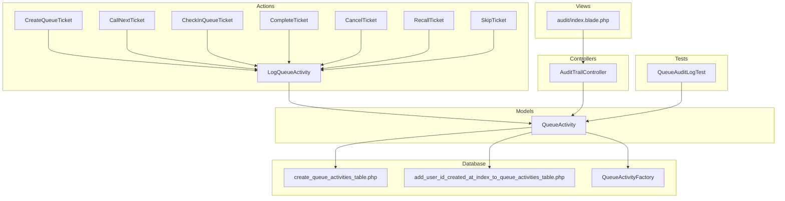
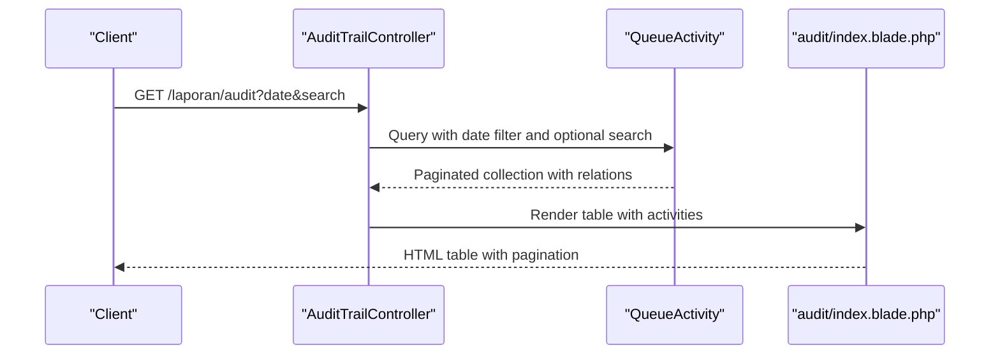
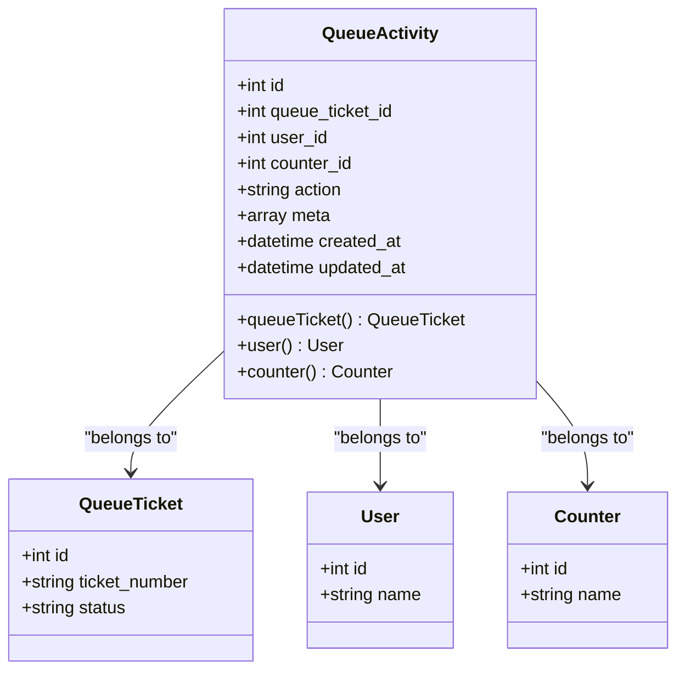
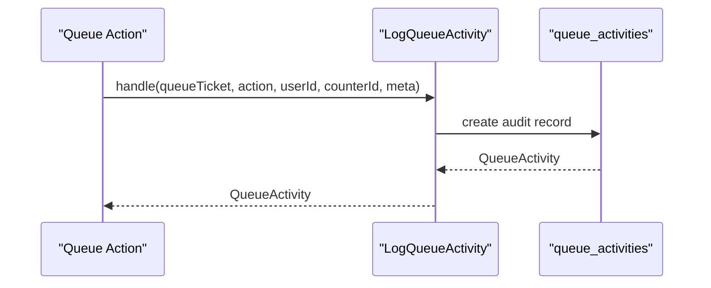
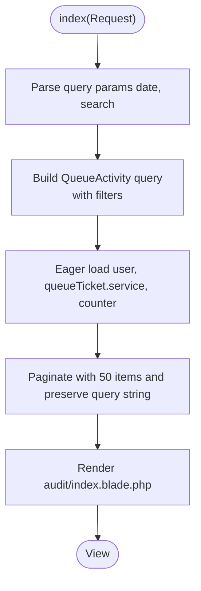
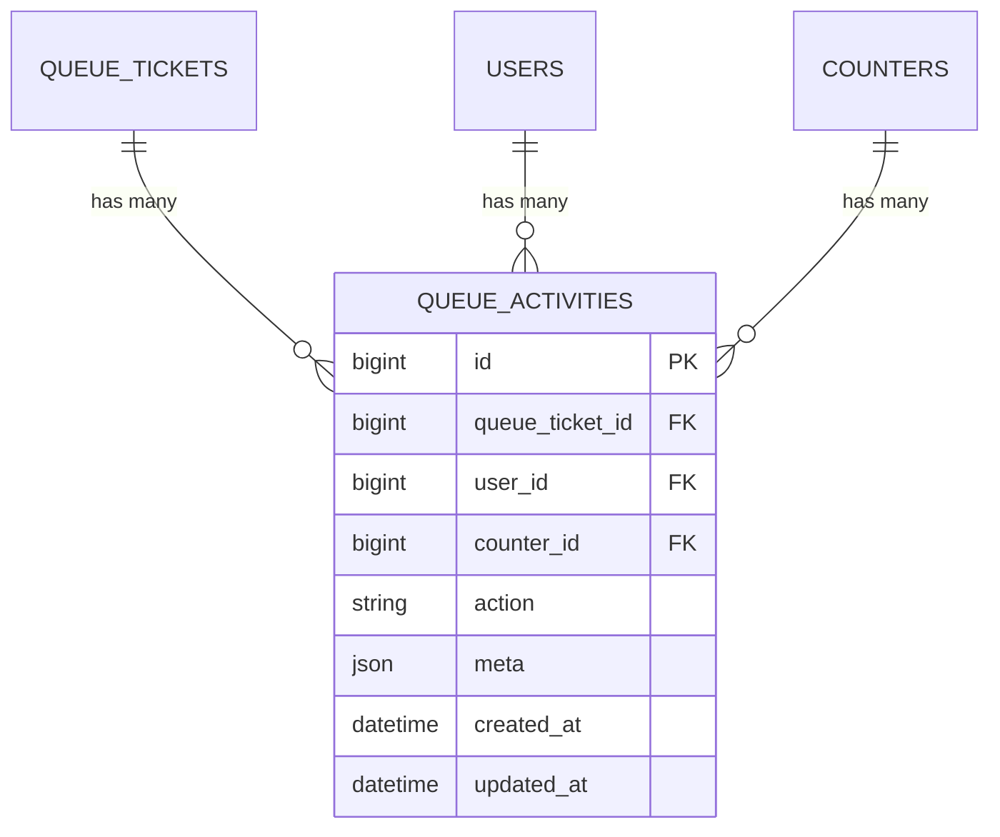
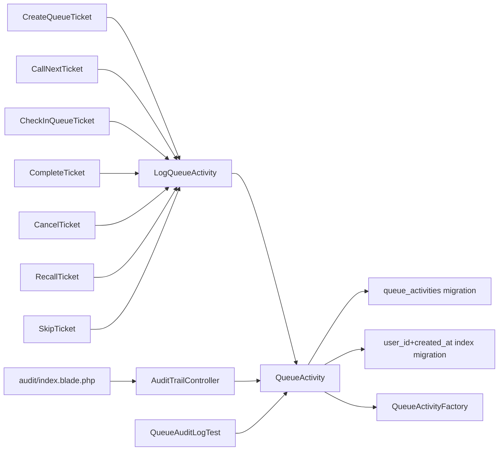

# Audit Trail System

<cite>
**Referenced Files in This Document**
- [QueueActivity.php](file://app/Models/QueueActivity.php)
- [LogQueueActivity.php](file://app/Actions/Queue/LogQueueActivity.php)
- [AuditTrailController.php](file://app/Http/Controllers/Report/AuditTrailController.php)
- [create_queue_activities_table.php](file://database/migrations/2026_03_06_015239_create_queue_activities_table.php)
- [add_user_id_created_at_index_to_queue_activities_table.php](file://database/migrations/2026_03_13_143634_add_user_id_created_at_index_to_queue_activities_table.php)
- [QueueActivityFactory.php](file://database/factories/QueueActivityFactory.php)
- [CreateQueueTicket.php](file://app/Actions/Queue/CreateQueueTicket.php)
- [CallNextTicket.php](file://app/Actions/Queue/CallNextTicket.php)
- [CheckInQueueTicket.php](file://app/Actions/Queue/CheckInQueueTicket.php)
- [CompleteTicket.php](file://app/Actions/Queue/CompleteTicket.php)
- [CancelTicket.php](file://app/Actions/Queue/CancelTicket.php)
- [RecallTicket.php](file://app/Actions/Queue/RecallTicket.php)
- [SkipTicket.php](file://app/Actions/Queue/SkipTicket.php)
- [QueueAuditLogTest.php](file://tests/Feature/Audit/QueueAuditLogTest.php)
- [index.blade.php](file://resources/views/pages/laporan/audit/index.blade.php)
- [QueueReportBuilder.php](file://app/Support/Reports/QueueReportBuilder.php)
</cite>

## Table of Contents
1. [Introduction](#introduction)
2. [Project Structure](#project-structure)
3. [Core Components](#core-components)
4. [Architecture Overview](#architecture-overview)
5. [Detailed Component Analysis](#detailed-component-analysis)
6. [Dependency Analysis](#dependency-analysis)
7. [Performance Considerations](#performance-considerations)
8. [Troubleshooting Guide](#troubleshooting-guide)
9. [Conclusion](#conclusion)
10. [Appendices](#appendices)

## Introduction
This document describes the Audit Trail system for the PTSP queue management application. It explains how queue operations and user activities are tracked via the QueueActivity model, how the audit trail controller enables querying and filtering of activity logs, the database schema supporting audit data, and the logging mechanism triggered by queue operations. It also covers example queries, filtering approaches, and compliance considerations for audit data protection.

## Project Structure
The Audit Trail system spans models, actions, controllers, migrations, factories, tests, and views:

- Models: QueueActivity defines the audit record structure and relationships.
- Actions: LogQueueActivity encapsulates the creation of audit records during queue operations.
- Controllers: AuditTrailController provides a report interface for querying and filtering activities.
- Migrations: Define the queue_activities table schema and indexes.
- Factories: Generate synthetic audit records for testing and seeding.
- Tests: Verify that queue lifecycle actions produce expected audit entries.
- Views: Present filtered audit logs with pagination and search.

**Diagram sources**
- [QueueActivity.php:1-44](file://app/Models/QueueActivity.php#L1-L44)
- [LogQueueActivity.php:1-28](file://app/Actions/Queue/LogQueueActivity.php#L1-L28)
- [AuditTrailController.php:1-39](file://app/Http/Controllers/Report/AuditTrailController.php#L1-L39)
- [create_queue_activities_table.php:1-36](file://database/migrations/2026_03_06_015239_create_queue_activities_table.php#L1-L36)
- [add_user_id_created_at_index_to_queue_activities_table.php:1-28](file://database/migrations/2026_03_13_143634_add_user_id_created_at_index_to_queue_activities_table.php#L1-L28)
- [QueueActivityFactory.php:1-32](file://database/factories/QueueActivityFactory.php#L1-L32)
- [CreateQueueTicket.php:1-91](file://app/Actions/Queue/CreateQueueTicket.php#L1-L91)
- [CallNextTicket.php:1-80](file://app/Actions/Queue/CallNextTicket.php#L1-L80)
- [CheckInQueueTicket.php:1-44](file://app/Actions/Queue/CheckInQueueTicket.php#L1-L44)
- [CompleteTicket.php:1-49](file://app/Actions/Queue/CompleteTicket.php#L1-L49)
- [CancelTicket.php:1-48](file://app/Actions/Queue/CancelTicket.php#L1-L48)
- [RecallTicket.php:1-49](file://app/Actions/Queue/RecallTicket.php#L1-L49)
- [SkipTicket.php:1-48](file://app/Actions/Queue/SkipTicket.php#L1-L48)
- [QueueAuditLogTest.php:1-104](file://tests/Feature/Audit/QueueAuditLogTest.php#L1-L104)
- [index.blade.php:1-131](file://resources/views/pages/laporan/audit/index.blade.php#L1-L131)

**Section sources**
- [QueueActivity.php:1-44](file://app/Models/QueueActivity.php#L1-L44)
- [LogQueueActivity.php:1-28](file://app/Actions/Queue/LogQueueActivity.php#L1-L28)
- [AuditTrailController.php:1-39](file://app/Http/Controllers/Report/AuditTrailController.php#L1-L39)
- [create_queue_activities_table.php:1-36](file://database/migrations/2026_03_06_015239_create_queue_activities_table.php#L1-L36)
- [add_user_id_created_at_index_to_queue_activities_table.php:1-28](file://database/migrations/2026_03_13_143634_add_user_id_created_at_index_to_queue_activities_table.php#L1-L28)
- [QueueActivityFactory.php:1-32](file://database/factories/QueueActivityFactory.php#L1-L32)
- [QueueAuditLogTest.php:1-104](file://tests/Feature/Audit/QueueAuditLogTest.php#L1-L104)
- [index.blade.php:1-131](file://resources/views/pages/laporan/audit/index.blade.php#L1-L131)

## Core Components
- QueueActivity model: Stores audit records with foreign keys to queue tickets, users, and counters; includes a JSON meta field for contextual details; provides Eloquent relationships.
- LogQueueActivity action: Centralized mechanism to create audit entries with action type and metadata.
- AuditTrailController: Provides a paginated, filterable view of activities by date and free-text search across ticket number, user name, and counter name.
- Queue operation actions: Each queue lifecycle action invokes LogQueueActivity to persist the event with actor and context.
- Database schema: Defines queue_activities table with indexes optimized for common queries.
- Factory and tests: Generate and validate audit records for queue lifecycle events.

**Section sources**
- [QueueActivity.php:14-42](file://app/Models/QueueActivity.php#L14-L42)
- [LogQueueActivity.php:13-27](file://app/Actions/Queue/LogQueueActivity.php#L13-L27)
- [AuditTrailController.php:12-38](file://app/Http/Controllers/Report/AuditTrailController.php#L12-L38)
- [create_queue_activities_table.php:14-25](file://database/migrations/2026_03_06_015239_create_queue_activities_table.php#L14-L25)
- [QueueActivityFactory.php:20-31](file://database/factories/QueueActivityFactory.php#L20-L31)

## Architecture Overview
The audit trail architecture integrates queue actions with centralized logging and a dedicated reporting interface:

**Diagram sources**
- [AuditTrailController.php:12-38](file://app/Http/Controllers/Report/AuditTrailController.php#L12-L38)
- [index.blade.php:40-128](file://resources/views/pages/laporan/audit/index.blade.php#L40-L128)

## Detailed Component Analysis

### QueueActivity Model
The QueueActivity model defines the audit record structure and relationships:
- Fillable attributes include queue_ticket_id, user_id, counter_id, action, and meta.
- The meta attribute is cast to an array for structured context storage.
- Relationships:
  - Belongs to QueueTicket
  - Belongs to User
  - Belongs to Counter

**Diagram sources**
- [QueueActivity.php:9-42](file://app/Models/QueueActivity.php#L9-L42)

**Section sources**
- [QueueActivity.php:14-42](file://app/Models/QueueActivity.php#L14-L42)

### Activity Logging Mechanism
Each queue operation action triggers LogQueueActivity to persist an audit record:
- CreateQueueTicket logs "ticket_created" with channel, service_id, queue_pool_id, and status.
- CheckInQueueTicket logs "ticket_checked_in" with status transitions.
- CallNextTicket logs "ticket_called" with from/to statuses, service_id, queue_pool_id, and visit purpose.
- CompleteTicket logs "ticket_completed" with status transitions and service context.
- CancelTicket logs "ticket_cancelled" with status transitions and context.
- RecallTicket logs "ticket_recalled" with unchanged status and context.
- SkipTicket logs "ticket_skipped" with status transitions and context.

**Diagram sources**
- [LogQueueActivity.php:13-27](file://app/Actions/Queue/LogQueueActivity.php#L13-L27)
- [CreateQueueTicket.php:74-85](file://app/Actions/Queue/CreateQueueTicket.php#L74-L85)
- [CheckInQueueTicket.php:29-38](file://app/Actions/Queue/CheckInQueueTicket.php#L29-L38)
- [CallNextTicket.php:60-72](file://app/Actions/Queue/CallNextTicket.php#L60-L72)
- [CompleteTicket.php:32-44](file://app/Actions/Queue/CompleteTicket.php#L32-L44)
- [CancelTicket.php:31-43](file://app/Actions/Queue/CancelTicket.php#L31-L43)
- [RecallTicket.php:30-42](file://app/Actions/Queue/RecallTicket.php#L30-L42)
- [SkipTicket.php:31-43](file://app/Actions/Queue/SkipTicket.php#L31-L43)

**Section sources**
- [LogQueueActivity.php:13-27](file://app/Actions/Queue/LogQueueActivity.php#L13-L27)
- [CreateQueueTicket.php:74-85](file://app/Actions/Queue/CreateQueueTicket.php#L74-L85)
- [CheckInQueueTicket.php:29-38](file://app/Actions/Queue/CheckInQueueTicket.php#L29-L38)
- [CallNextTicket.php:60-72](file://app/Actions/Queue/CallNextTicket.php#L60-L72)
- [CompleteTicket.php:32-44](file://app/Actions/Queue/CompleteTicket.php#L32-L44)
- [CancelTicket.php:31-43](file://app/Actions/Queue/CancelTicket.php#L31-L43)
- [RecallTicket.php:30-42](file://app/Actions/Queue/RecallTicket.php#L30-L42)
- [SkipTicket.php:31-43](file://app/Actions/Queue/SkipTicket.php#L31-L43)

### Audit Trail Controller
The AuditTrailController provides:
- Date filtering: Activities are queried by created_at date.
- Search filtering: Searches across ticket_number, user.name, and counter.name using whereHas clauses.
- Pagination: Returns paginated results with query string preservation.
- Relationship loading: Eager loads user, queueTicket.service, and counter for efficient rendering.

**Diagram sources**
- [AuditTrailController.php:12-38](file://app/Http/Controllers/Report/AuditTrailController.php#L12-L38)

**Section sources**
- [AuditTrailController.php:12-38](file://app/Http/Controllers/Report/AuditTrailController.php#L12-L38)

### Database Schema for Queue Activities
The queue_activities table schema supports audit logging and efficient querying:
- Primary key: id
- Foreign keys: queue_ticket_id, user_id, counter_id with cascade updates and null-on-delete for user_id and counter_id
- Columns: action (string), meta (JSON), timestamps
- Indexes:
  - Composite index on (queue_ticket_id, created_at)
  - Composite index on (action, created_at)
  - Additional composite index on (user_id, created_at) for actor-based queries

**Diagram sources**
- [create_queue_activities_table.php:14-25](file://database/migrations/2026_03_06_015239_create_queue_activities_table.php#L14-L25)
- [add_user_id_created_at_index_to_queue_activities_table.php:14-16](file://database/migrations/2026_03_13_143634_add_user_id_created_at_index_to_queue_activities_table.php#L14-L16)

**Section sources**
- [create_queue_activities_table.php:14-25](file://database/migrations/2026_03_06_015239_create_queue_activities_table.php#L14-L25)
- [add_user_id_created_at_index_to_queue_activities_table.php:14-16](file://database/migrations/2026_03_13_143634_add_user_id_created_at_index_to_queue_activities_table.php#L14-L16)

### Activity Logging Triggered by Queue Operations
Queue lifecycle actions consistently invoke LogQueueActivity with:
- queueTicket: The affected ticket
- action: One of the standardized action strings
- userId: Actor identifier (optional)
- counterId: Counter involved (optional)
- meta: Structured context (e.g., status transitions, service_id, queue_pool_id, visit_purpose)

Examples of action strings verified by tests:
- ticket_created
- ticket_checked_in
- ticket_called
- ticket_recalled
- ticket_completed

**Section sources**
- [CreateQueueTicket.php:74-85](file://app/Actions/Queue/CreateQueueTicket.php#L74-L85)
- [CheckInQueueTicket.php:29-38](file://app/Actions/Queue/CheckInQueueTicket.php#L29-L38)
- [CallNextTicket.php:60-72](file://app/Actions/Queue/CallNextTicket.php#L60-L72)
- [CompleteTicket.php:32-44](file://app/Actions/Queue/CompleteTicket.php#L32-L44)
- [CancelTicket.php:31-43](file://app/Actions/Queue/CancelTicket.php#L31-L43)
- [RecallTicket.php:30-42](file://app/Actions/Queue/RecallTicket.php#L30-L42)
- [SkipTicket.php:31-43](file://app/Actions/Queue/SkipTicket.php#L31-L43)
- [QueueAuditLogTest.php:50-54](file://tests/Feature/Audit/QueueAuditLogTest.php#L50-L54)

### Audit Trail Queries and Filtering Examples
- Filter by date: Use the date query parameter to constrain created_at to a single day.
- Filter by search term: Search across ticket_number, user.name, and counter.name using OR conditions.
- Pagination: Results are paginated with 50 items per page and query string preserved.
- Export capability: The view renders a table suitable for export using browser developer tools or server-side export libraries.

Example request patterns:
- GET /laporan/audit?date=YYYY-MM-DD
- GET /laporan/audit?date=YYYY-MM-DD&search=ticket_number_or_user_or_counter

**Section sources**
- [AuditTrailController.php:14-30](file://app/Http/Controllers/Report/AuditTrailController.php#L14-L30)
- [index.blade.php:22-37](file://resources/views/pages/laporan/audit/index.blade.php#L22-L37)

### Compliance Considerations, Data Retention, and Security
- Data minimization: Only necessary fields are logged in meta (e.g., status transitions, identifiers).
- Access control: Ensure only authorized users can access audit reports via middleware and role checks.
- Retention policy: Define and enforce data retention for audit logs per institutional policy.
- Integrity: Use database transactions for queue operations to maintain atomicity between state changes and audit logging.
- Privacy: Avoid logging sensitive personal data in meta unless required; sanitize where possible.
- Auditability: Maintain immutable logs; avoid deletions or modifications without proper authorization.

[No sources needed since this section provides general guidance]

## Dependency Analysis
The audit trail system exhibits low coupling and clear separation of concerns:
- Queue actions depend on LogQueueActivity for audit persistence.
- LogQueueActivity depends on QueueActivity model.
- AuditTrailController depends on QueueActivity and view templates.
- Migrations define schema and indexes; factories support testing and seeding.

**Diagram sources**
- [CreateQueueTicket.php:15-17](file://app/Actions/Queue/CreateQueueTicket.php#L15-L17)
- [CallNextTicket.php:15-17](file://app/Actions/Queue/CallNextTicket.php#L15-L17)
- [CheckInQueueTicket.php:13-15](file://app/Actions/Queue/CheckInQueueTicket.php#L13-L15)
- [CompleteTicket.php:13-15](file://app/Actions/Queue/CompleteTicket.php#L13-L15)
- [CancelTicket.php:13-15](file://app/Actions/Queue/CancelTicket.php#L13-L15)
- [RecallTicket.php:13-15](file://app/Actions/Queue/RecallTicket.php#L13-L15)
- [SkipTicket.php:13-15](file://app/Actions/Queue/SkipTicket.php#L13-L15)
- [LogQueueActivity.php:5-6](file://app/Actions/Queue/LogQueueActivity.php#L5-L6)
- [QueueActivity.php:9-42](file://app/Models/QueueActivity.php#L9-L42)
- [AuditTrailController.php:6](file://app/Http/Controllers/Report/AuditTrailController.php#L6)
- [create_queue_activities_table.php:14-25](file://database/migrations/2026_03_06_015239_create_queue_activities_table.php#L14-L25)
- [add_user_id_created_at_index_to_queue_activities_table.php:14-16](file://database/migrations/2026_03_13_143634_add_user_id_created_at_index_to_queue_activities_table.php#L14-L16)
- [QueueActivityFactory.php:13-31](file://database/factories/QueueActivityFactory.php#L13-L31)
- [QueueAuditLogTest.php:3-16](file://tests/Feature/Audit/QueueAuditLogTest.php#L3-L16)
- [index.blade.php:1-131](file://resources/views/pages/laporan/audit/index.blade.php#L1-L131)

**Section sources**
- [CreateQueueTicket.php:15-17](file://app/Actions/Queue/CreateQueueTicket.php#L15-L17)
- [CallNextTicket.php:15-17](file://app/Actions/Queue/CallNextTicket.php#L15-L17)
- [CheckInQueueTicket.php:13-15](file://app/Actions/Queue/CheckInQueueTicket.php#L13-L15)
- [CompleteTicket.php:13-15](file://app/Actions/Queue/CompleteTicket.php#L13-L15)
- [CancelTicket.php:13-15](file://app/Actions/Queue/CancelTicket.php#L13-L15)
- [RecallTicket.php:13-15](file://app/Actions/Queue/RecallTicket.php#L13-L15)
- [SkipTicket.php:13-15](file://app/Actions/Queue/SkipTicket.php#L13-L15)
- [LogQueueActivity.php:5-6](file://app/Actions/Queue/LogQueueActivity.php#L5-L6)
- [QueueActivity.php:9-42](file://app/Models/QueueActivity.php#L9-L42)
- [AuditTrailController.php:6](file://app/Http/Controllers/Report/AuditTrailController.php#L6)
- [create_queue_activities_table.php:14-25](file://database/migrations/2026_03_06_015239_create_queue_activities_table.php#L14-L25)
- [add_user_id_created_at_index_to_queue_activities_table.php:14-16](file://database/migrations/2026_03_13_143634_add_user_id_created_at_index_to_queue_activities_table.php#L14-L16)
- [QueueActivityFactory.php:13-31](file://database/factories/QueueActivityFactory.php#L13-L31)
- [QueueAuditLogTest.php:3-16](file://tests/Feature/Audit/QueueAuditLogTest.php#L3-L16)
- [index.blade.php:1-131](file://resources/views/pages/laporan/audit/index.blade.php#L1-L131)

## Performance Considerations
- Index usage: The (queue_ticket_id, created_at) and (action, created_at) indexes optimize date-range queries and action filtering.
- Actor queries: The (user_id, created_at) index supports efficient actor-based filtering.
- Eager loading: The controller loads related user, queueTicket.service, and counter to reduce N+1 queries.
- Pagination: Limits result sets to 50 items per page to control memory and response size.
- JSON meta: Using JSON for meta allows flexible context storage without schema changes.

[No sources needed since this section provides general guidance]

## Troubleshooting Guide
- No audit entries found:
  - Verify that queue actions call LogQueueActivity with valid parameters.
  - Confirm that the queue_activities table exists and indexes are applied.
- Incorrect or missing actor/context:
  - Ensure userId and counterId are passed where applicable.
  - Validate meta payload structure in each action.
- Slow audit queries:
  - Confirm indexes exist and are not dropped.
  - Use date filters and avoid broad LIKE patterns on large datasets.
- Export issues:
  - Use browser developer tools or implement server-side export for CSV/XLSX.

**Section sources**
- [QueueAuditLogTest.php:56-71](file://tests/Feature/Audit/QueueAuditLogTest.php#L56-L71)
- [create_queue_activities_table.php:23-24](file://database/migrations/2026_03_06_015239_create_queue_activities_table.php#L23-L24)
- [add_user_id_created_at_index_to_queue_activities_table.php:14-16](file://database/migrations/2026_03_13_143634_add_user_id_created_at_index_to_queue_activities_table.php#L14-L16)

## Conclusion
The Audit Trail system provides comprehensive, structured logging of queue operations and user activities. The QueueActivity model, LogQueueActivity action, and AuditTrailController work together to capture, query, and present audit data efficiently. The database schema and indexes support fast filtering by date, actor, and action. With proper access controls, retention policies, and security measures, the system meets compliance needs while remaining maintainable and extensible.

[No sources needed since this section summarizes without analyzing specific files]

## Appendices

### Example Audit Queries
- Retrieve all activities for a specific date:
  - Query: created_at date equals target date
- Search activities by ticket number, user name, or counter name:
  - Query: whereHas queueTicket.ticket_number, user.name, or counter.name with LIKE pattern
- Paginate results:
  - Query: limit 50 per page with query string preservation

**Section sources**
- [AuditTrailController.php:17-30](file://app/Http/Controllers/Report/AuditTrailController.php#L17-L30)
- [index.blade.php:22-37](file://resources/views/pages/laporan/audit/index.blade.php#L22-L37)

### Action Types and Meta Context
- ticket_created: meta includes channel, service_id, queue_pool_id, status
- ticket_checked_in: meta includes from_status, to_status
- ticket_called: meta includes from_status, to_status, service_id, queue_pool_id, visit_purpose
- ticket_completed: meta includes from_status, to_status, service_id, queue_pool_id, visit_purpose
- ticket_cancelled: meta includes from_status, to_status, service_id, queue_pool_id, visit_purpose
- ticket_recalled: meta includes from_status, to_status, service_id, queue_pool_id, visit_purpose
- ticket_skipped: meta includes from_status, to_status, service_id, queue_pool_id, visit_purpose

**Section sources**
- [CreateQueueTicket.php:79-84](file://app/Actions/Queue/CreateQueueTicket.php#L79-L84)
- [CheckInQueueTicket.php:34-37](file://app/Actions/Queue/CheckInQueueTicket.php#L34-L37)
- [CallNextTicket.php:65-71](file://app/Actions/Queue/CallNextTicket.php#L65-L71)
- [CompleteTicket.php:37-43](file://app/Actions/Queue/CompleteTicket.php#L37-L43)
- [CancelTicket.php:36-42](file://app/Actions/Queue/CancelTicket.php#L36-L42)
- [RecallTicket.php:35-41](file://app/Actions/Queue/RecallTicket.php#L35-L41)
- [SkipTicket.php:36-42](file://app/Actions/Queue/SkipTicket.php#L36-L42)