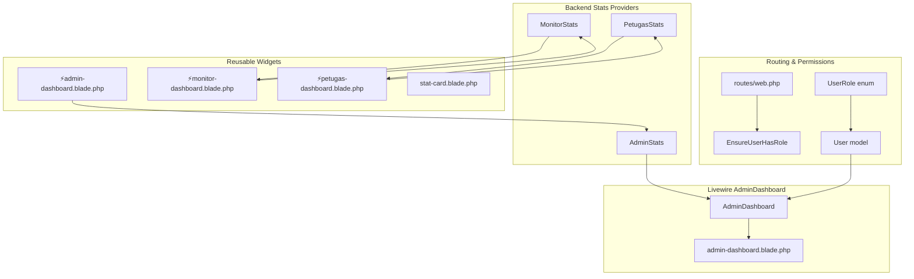
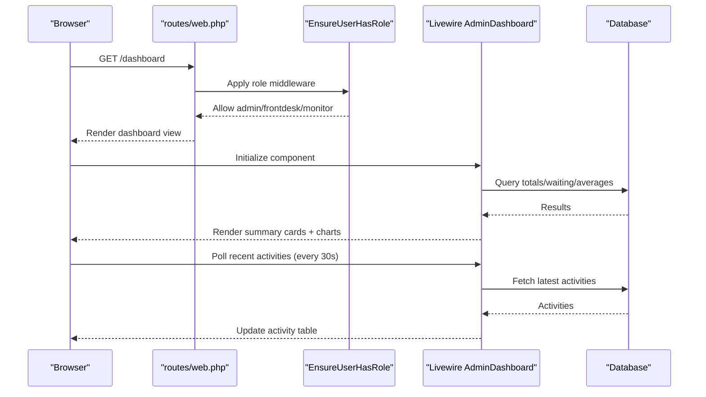
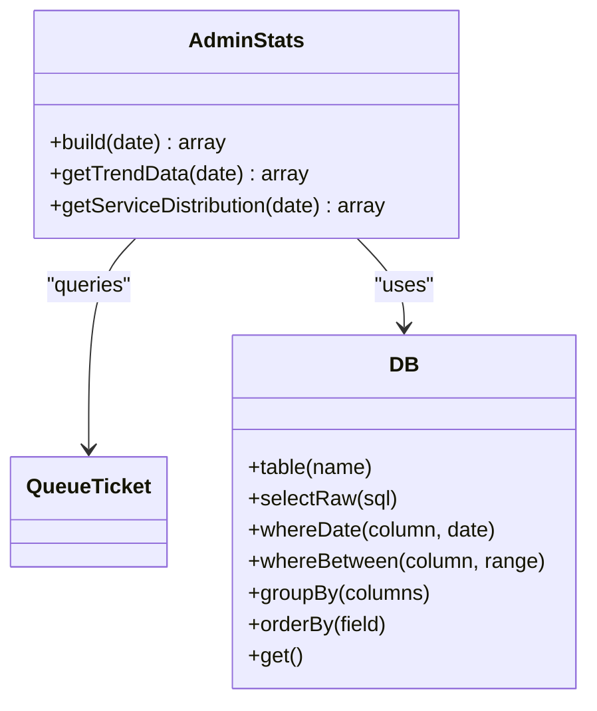
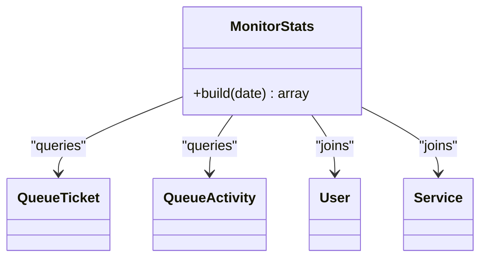
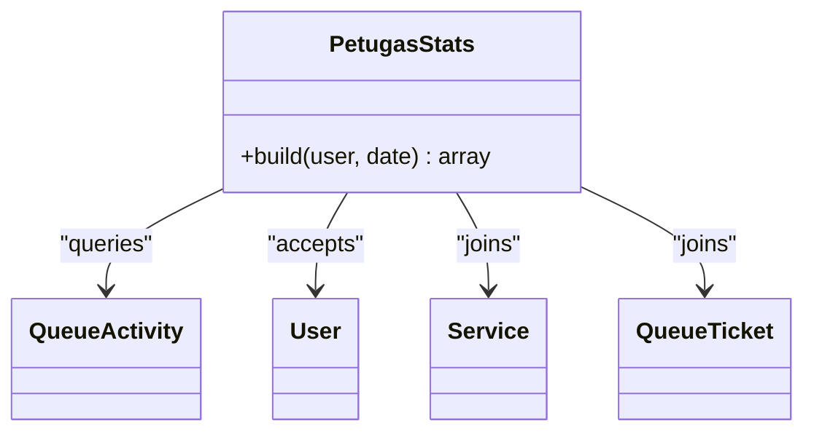
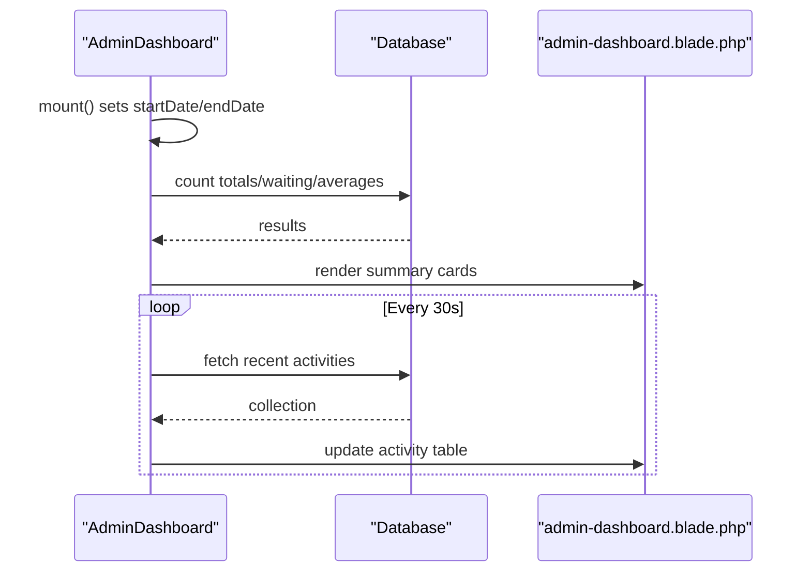
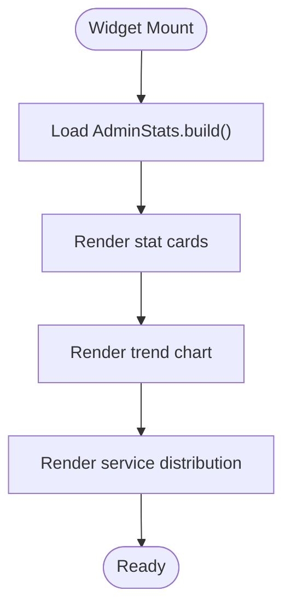
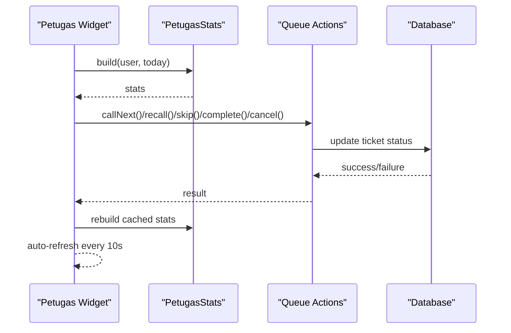
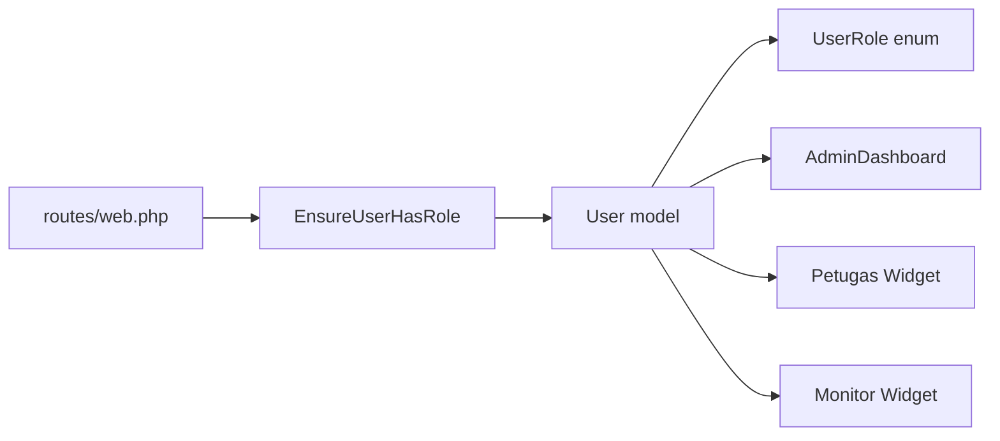

# Dashboard Components

<cite>
**Referenced Files in This Document**
- [AdminStats.php](file://app/Support/Dashboard/AdminStats.php)
- [MonitorStats.php](file://app/Support/Dashboard/MonitorStats.php)
- [PetugasStats.php](file://app/Support/Dashboard/PetugasStats.php)
- [AdminDashboard.php](file://app/Livewire/Dashboard/AdminDashboard.php)
- [admin-dashboard.blade.php](file://resources/views/livewire/dashboard/admin-dashboard.blade.php)
- [⚡admin-dashboard.blade.php](file://resources/views/components/dashboard/⚡admin-dashboard.blade.php)
- [⚡monitor-dashboard.blade.php](file://resources/views/components/dashboard/⚡monitor-dashboard.blade.php)
- [⚡petugas-dashboard.blade.php](file://resources/views/components/dashboard/⚡petugas-dashboard.blade.php)
- [stat-card.blade.php](file://resources/views/components/dashboard/stat-card.blade.php)
- [web.php](file://routes/web.php)
- [EnsureUserHasRole.php](file://app/Http/Middleware/EnsureUserHasRole.php)
- [User.php](file://app/Models/User.php)
- [UserRole.php](file://app/Enums/UserRole.php)
</cite>

## Table of Contents
1. [Introduction](#introduction)
2. [Project Structure](#project-structure)
3. [Core Components](#core-components)
4. [Architecture Overview](#architecture-overview)
5. [Detailed Component Analysis](#detailed-component-analysis)
6. [Dependency Analysis](#dependency-analysis)
7. [Performance Considerations](#performance-considerations)
8. [Troubleshooting Guide](#troubleshooting-guide)
9. [Conclusion](#conclusion)

## Introduction
This document explains the role-based dashboard system for the PTSP queue management application. It covers the backend statistics providers (AdminStats, MonitorStats, PetugasStats) that compute metrics from the database, the Livewire AdminDashboard component that aggregates and renders real-time summaries, and the reusable dashboard widgets that visualize data for different user roles. It also documents how dashboards adapt to permissions, how real-time updates work, and how to compose dashboard widgets effectively.

## Project Structure
The dashboard system is organized around three pillars:
- Backend statistics providers under app/Support/Dashboard
- Livewire components under app/Livewire/Dashboard and Blade components under resources/views/components/dashboard
- Presentation templates under resources/views/livewire/dashboard

**Diagram sources**
- [AdminStats.php:1-178](file://app/Support/Dashboard/AdminStats.php#L1-L178)
- [MonitorStats.php:1-82](file://app/Support/Dashboard/MonitorStats.php#L1-L82)
- [PetugasStats.php:1-60](file://app/Support/Dashboard/PetugasStats.php#L1-L60)
- [AdminDashboard.php:1-233](file://app/Livewire/Dashboard/AdminDashboard.php#L1-L233)
- [admin-dashboard.blade.php:1-356](file://resources/views/livewire/dashboard/admin-dashboard.blade.php#L1-L356)
- [⚡admin-dashboard.blade.php:1-283](file://resources/views/components/dashboard/⚡admin-dashboard.blade.php#L1-L283)
- [⚡monitor-dashboard.blade.php:1-102](file://resources/views/components/dashboard/⚡monitor-dashboard.blade.php#L1-L102)
- [⚡petugas-dashboard.blade.php:1-768](file://resources/views/components/dashboard/⚡petugas-dashboard.blade.php#L1-L768)
- [stat-card.blade.php:1-59](file://resources/views/components/dashboard/stat-card.blade.php#L1-L59)
- [web.php:1-127](file://routes/web.php#L1-L127)
- [EnsureUserHasRole.php:1-37](file://app/Http/Middleware/EnsureUserHasRole.php#L1-L37)
- [User.php:1-99](file://app/Models/User.php#L1-L99)
- [UserRole.php:1-32](file://app/Enums/UserRole.php#L1-L32)

**Section sources**
- [web.php:28-40](file://routes/web.php#L28-L40)
- [EnsureUserHasRole.php:16-35](file://app/Http/Middleware/EnsureUserHasRole.php#L16-L35)
- [User.php:81-91](file://app/Models/User.php#L81-L91)
- [UserRole.php:5-31](file://app/Enums/UserRole.php#L5-L31)

## Core Components
- AdminStats: Aggregates administrative metrics such as bookings, cancellations, completions, failure counts, public channel activity, weekly trends, and service distributions.
- MonitorStats: Provides operational metrics for monitors, including total served, throughput, backlog by service, officers served, and an officer-service matrix.
- PetugasStats: Computes officer-specific stats for the day, including served tickets, action counts (skip/recall/complete), and service distribution.
- AdminDashboard Livewire component: Computes and renders summary cards, charts, and recent activity feed with date-range filtering and periodic auto-refresh.
- Reusable widgets: Blade components for Admin, Monitor, and Petugas dashboards that accept statistics providers and render charts and cards.

**Section sources**
- [AdminStats.php:23-176](file://app/Support/Dashboard/AdminStats.php#L23-L176)
- [MonitorStats.php:21-80](file://app/Support/Dashboard/MonitorStats.php#L21-L80)
- [PetugasStats.php:20-58](file://app/Support/Dashboard/PetugasStats.php#L20-L58)
- [AdminDashboard.php:18-232](file://app/Livewire/Dashboard/AdminDashboard.php#L18-L232)
- [⚡admin-dashboard.blade.php:36-48](file://resources/views/components/dashboard/⚡admin-dashboard.blade.php#L36-L48)
- [⚡monitor-dashboard.blade.php:25-28](file://resources/views/components/dashboard/⚡monitor-dashboard.blade.php#L25-L28)
- [⚡petugas-dashboard.blade.php:62-70](file://resources/views/components/dashboard/⚡petugas-dashboard.blade.php#L62-L70)

## Architecture Overview
The system follows a layered pattern:
- Data access and computation live in dedicated provider classes.
- Livewire components orchestrate rendering and real-time updates.
- Blade widgets encapsulate presentation logic and chart rendering.
- Routing and middleware enforce role-based access.

**Diagram sources**
- [web.php:28-40](file://routes/web.php#L28-L40)
- [EnsureUserHasRole.php:16-35](file://app/Http/Middleware/EnsureUserHasRole.php#L16-L35)
- [AdminDashboard.php:18-232](file://app/Livewire/Dashboard/AdminDashboard.php#L18-L232)

## Detailed Component Analysis

### Backend Statistics Providers

#### AdminStats
Responsibilities:
- Build daily summary metrics for administrators.
- Compute trend data for the last seven days.
- Calculate service distribution for completed tickets.

Key computations:
- Booking success/failure counts filtered by channel and status.
- Daily ticket counts for created, cancelled, completed.
- Failure summary via queue activity actions.
- Public channel activity breakdown.
- Trend aggregation grouped by date with completion counts.
- Service distribution with top-N and “Other” bucketing.

**Diagram sources**
- [AdminStats.php:23-176](file://app/Support/Dashboard/AdminStats.php#L23-L176)

**Section sources**
- [AdminStats.php:23-85](file://app/Support/Dashboard/AdminStats.php#L23-L85)
- [AdminStats.php:92-125](file://app/Support/Dashboard/AdminStats.php#L92-L125)
- [AdminStats.php:132-176](file://app/Support/Dashboard/AdminStats.php#L132-L176)

#### MonitorStats
Responsibilities:
- Provide monitor-focused operational metrics.
- Aggregate backlog by service.
- Count served tickets and throughput.
- Build matrix of officer vs. service completions.

**Diagram sources**
- [MonitorStats.php:21-80](file://app/Support/Dashboard/MonitorStats.php#L21-L80)

**Section sources**
- [MonitorStats.php:21-80](file://app/Support/Dashboard/MonitorStats.php#L21-L80)

#### PetugasStats
Responsibilities:
- Compute officer-specific metrics for the current day.
- Action counts by type (skip/recall/complete).
- Service distribution for called/completed tickets.

**Diagram sources**
- [PetugasStats.php:20-58](file://app/Support/Dashboard/PetugasStats.php#L20-L58)

**Section sources**
- [PetugasStats.php:20-58](file://app/Support/Dashboard/PetugasStats.php#L20-L58)

### AdminDashboard Livewire Component
Responsibilities:
- Compute summary metrics for the selected date range.
- Provide charts for trends, services, counters, and channels.
- Display recent activity feed with periodic refresh.
- Support date-range filtering and computed caching.

Real-time update mechanisms:
- Periodic polling for recent activities every 30 seconds.
- Optional periodic polling for officer station board (see widget below).

**Diagram sources**
- [AdminDashboard.php:18-232](file://app/Livewire/Dashboard/AdminDashboard.php#L18-L232)
- [admin-dashboard.blade.php:262-308](file://resources/views/livewire/dashboard/admin-dashboard.blade.php#L262-L308)

**Section sources**
- [AdminDashboard.php:18-232](file://app/Livewire/Dashboard/AdminDashboard.php#L18-L232)
- [admin-dashboard.blade.php:1-356](file://resources/views/livewire/dashboard/admin-dashboard.blade.php#L1-L356)

### Reusable Dashboard Widgets

#### Admin Widget (⚡admin-dashboard.blade.php)
- Accepts AdminStats provider via constructor injection.
- Renders stat cards, trend chart, and service distribution pie.
- Supports manual refresh via a method bound to a Livewire action.

**Diagram sources**
- [⚡admin-dashboard.blade.php:36-48](file://resources/views/components/dashboard/⚡admin-dashboard.blade.php#L36-L48)

**Section sources**
- [⚡admin-dashboard.blade.php:36-48](file://resources/views/components/dashboard/⚡admin-dashboard.blade.php#L36-L48)
- [stat-card.blade.php:1-59](file://resources/views/components/dashboard/stat-card.blade.php#L1-L59)

#### Monitor Widget (⚡monitor-dashboard.blade.php)
- Accepts MonitorStats provider.
- Displays total served, throughput, backlog by service, served by officer, and officer-service matrix.

**Section sources**
- [⚡monitor-dashboard.blade.php:25-28](file://resources/views/components/dashboard/⚡monitor-dashboard.blade.php#L25-L28)

#### Petugas Widget (⚡petugas-dashboard.blade.php)
- Accepts PetugasStats provider and integrates with queue actions (call, recall, skip, complete, cancel).
- Implements auto-refresh every 10 seconds for live station updates.
- Enforces role and service permissions for counters and visibility.

**Diagram sources**
- [⚡petugas-dashboard.blade.php:72-92](file://resources/views/components/dashboard/⚡petugas-dashboard.blade.php#L72-L92)
- [⚡petugas-dashboard.blade.php:125-231](file://resources/views/components/dashboard/⚡petugas-dashboard.blade.php#L125-L231)

**Section sources**
- [⚡petugas-dashboard.blade.php:72-92](file://resources/views/components/dashboard/⚡petugas-dashboard.blade.php#L72-L92)
- [⚡petugas-dashboard.blade.php:125-231](file://resources/views/components/dashboard/⚡petugas-dashboard.blade.php#L125-L231)
- [⚡petugas-dashboard.blade.php:494](file://resources/views/components/dashboard/⚡petugas-dashboard.blade.php#L494)

## Dependency Analysis
- Role-based access control:
  - routes/web.php defines role-scoped groups for frontdesk, officer, monitor, and admin.
  - EnsureUserHasRole middleware enforces allowed roles and permits admin bypass.
  - User model exposes activeRole() to honor admin session overrides.
  - UserRole enum centralizes role labels and colors.

**Diagram sources**
- [web.php:42-90](file://routes/web.php#L42-L90)
- [EnsureUserHasRole.php:16-35](file://app/Http/Middleware/EnsureUserHasRole.php#L16-L35)
- [User.php:81-91](file://app/Models/User.php#L81-L91)
- [UserRole.php:5-31](file://app/Enums/UserRole.php#L5-L31)

**Section sources**
- [web.php:42-90](file://routes/web.php#L42-L90)
- [EnsureUserHasRole.php:16-35](file://app/Http/Middleware/EnsureUserHasRole.php#L16-L35)
- [User.php:81-91](file://app/Models/User.php#L81-L91)
- [UserRole.php:5-31](file://app/Enums/UserRole.php#L5-L31)

## Performance Considerations
- Computed caching:
  - Livewire AdminDashboard uses persistent computed properties to avoid recomputation on every render.
- Efficient queries:
  - Stats providers use targeted selects, groupings, and aggregations to minimize payload.
- Auto-refresh cadence:
  - Admin recent activities poll every 30 seconds; officer station polls every 10 seconds to balance responsiveness and load.
- Chart data shaping:
  - Widgets pre-format arrays for chart libraries to reduce client-side transformations.
- Pagination and limits:
  - Recent activity is capped to a small number of rows to keep payloads light.

[No sources needed since this section provides general guidance]

## Troubleshooting Guide
Common issues and resolutions:
- No data in charts:
  - Verify date filters and that the target date range contains records.
  - Confirm that AdminDashboard trendData builds the expected date range when filters differ from default.
- Missing counters or services in Petugas widget:
  - Ensure the officer user has assigned services and that counters are active.
  - Check session assignment type and whether admin locked a counter the user cannot access.
- Slow refresh:
  - Reduce chart complexity or adjust polling intervals.
- Permission denied:
  - Confirm the route group and EnsureUserHasRole middleware allow the current role.

**Section sources**
- [AdminDashboard.php:155-190](file://app/Livewire/Dashboard/AdminDashboard.php#L155-L190)
- [⚡petugas-dashboard.blade.php:260-420](file://resources/views/components/dashboard/⚡petugas-dashboard.blade.php#L260-L420)
- [web.php:42-90](file://routes/web.php#L42-L90)
- [EnsureUserHasRole.php:16-35](file://app/Http/Middleware/EnsureUserHasRole.php#L16-L35)

## Conclusion
The dashboard system cleanly separates concerns between data providers, Livewire orchestration, and reusable widgets. Role-based routing and middleware ensure appropriate access, while computed properties and periodic polling deliver responsive, real-time insights. The AdminStats, MonitorStats, and PetugasStats classes provide robust aggregation patterns that feed both high-level summaries and granular operational views.