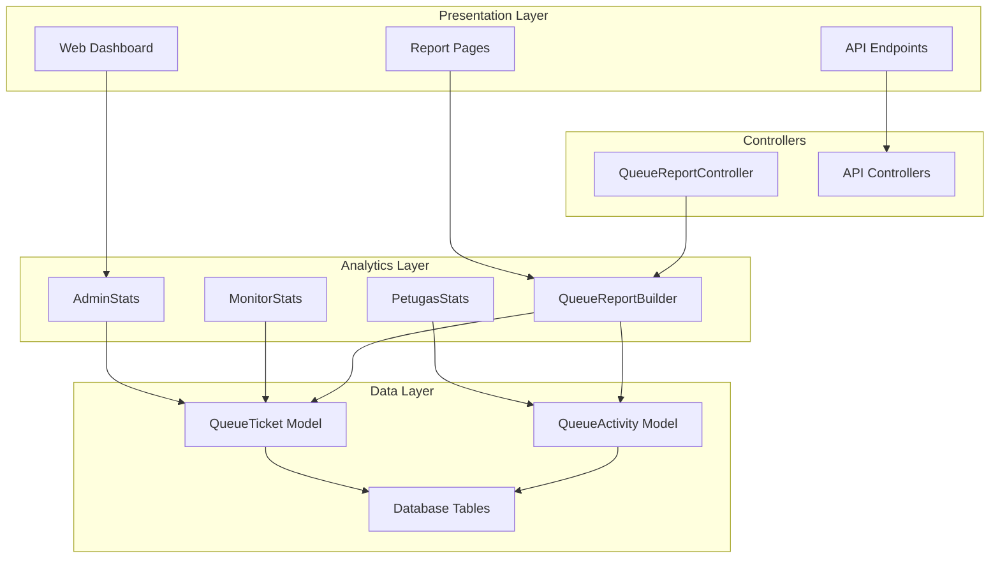
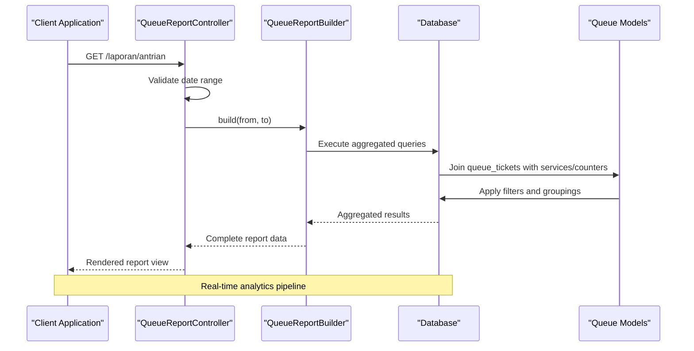
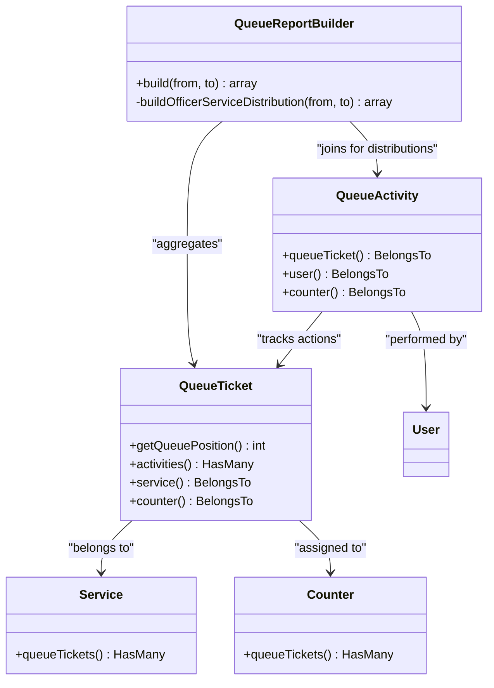
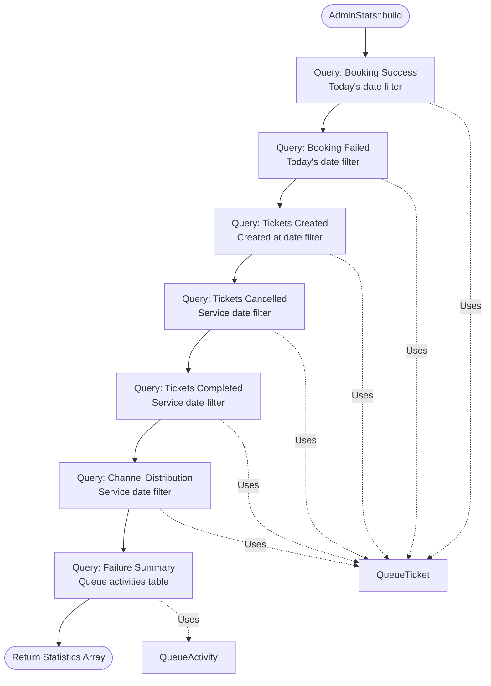
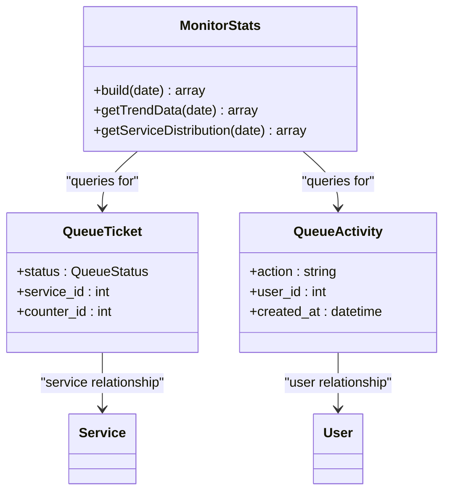
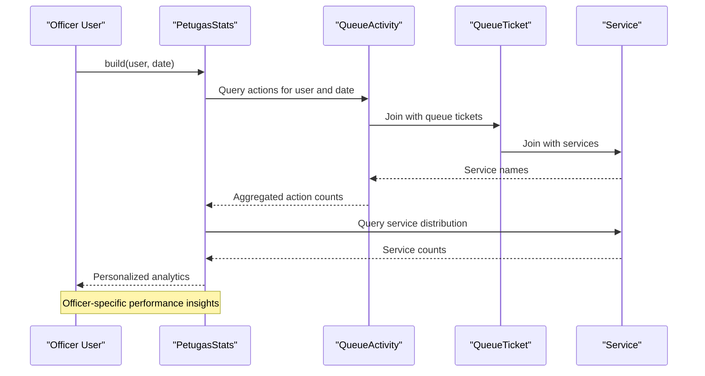
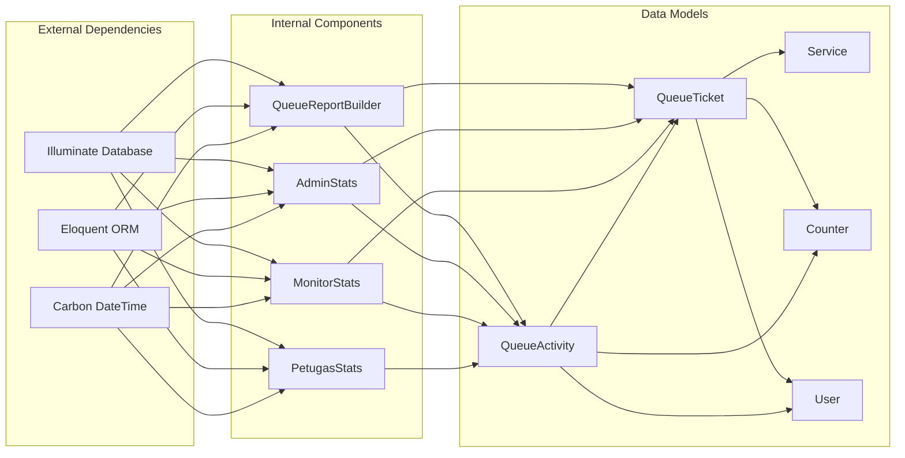
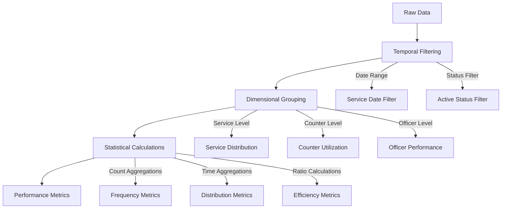
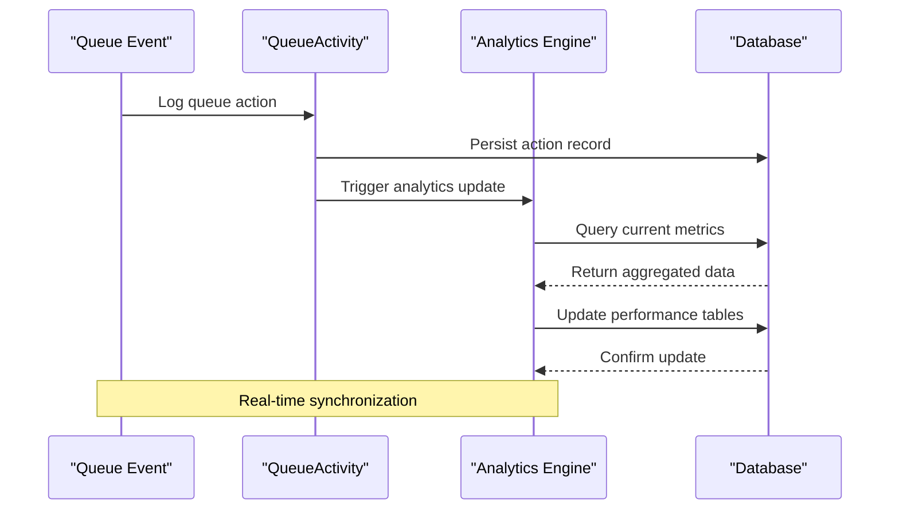
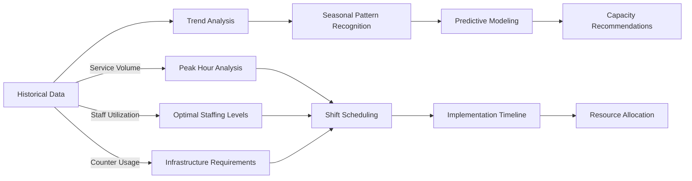

# Performance Analytics

<cite>
**Referenced Files in This Document**
- [QueueReportBuilder.php](file://app/Support/Reports/QueueReportBuilder.php)
- [QueueReportController.php](file://app/Http/Controllers/Report/QueueReportController.php)
- [QueueReportFilterRequest.php](file://app/Http/Requests/QueueReportFilterRequest.php)
- [AdminStats.php](file://app/Support/Dashboard/AdminStats.php)
- [MonitorStats.php](file://app/Support/Dashboard/MonitorStats.php)
- [PetugasStats.php](file://app/Support/Dashboard/PetugasStats.php)
- [AdminDashboard.php](file://app/Livewire/Dashboard/AdminDashboard.php)
- [QueueActivity.php](file://app/Models/QueueActivity.php)
- [QueueTicket.php](file://app/Models/QueueTicket.php)
- [QueueReportBuilderTest.php](file://tests/Unit/Reports/QueueReportBuilderTest.php)
- [AdminDashboardTest.php](file://tests/Feature/Dashboard/AdminDashboardTest.php)
- [QueueReportController.php](file://app/Http/Controllers/Report/QueueReportController.php)
- [api.php](file://routes/api.php)
</cite>

## Table of Contents
1. [Introduction](#introduction)
2. [Project Structure](#project-structure)
3. [Core Components](#core-components)
4. [Architecture Overview](#architecture-overview)
5. [Detailed Component Analysis](#detailed-component-analysis)
6. [Dependency Analysis](#dependency-analysis)
7. [Performance Metrics Calculation](#performance-metrics-calculation)
8. [Data Sources and Aggregation Methods](#data-sources-and-aggregation-methods)
9. [Integration with Queue Status Tracking](#integration-with-queue-status-tracking)
10. [Performance Benchmarking and Capacity Planning](#performance-benchmarking-and-capacity-planning)
11. [Decision Support for Resource Allocation](#decision-support-for-resource-allocation)
12. [Export Formats and Visualizations](#export-formats-and-visualizations)
13. [Troubleshooting Guide](#troubleshooting-guide)
14. [Conclusion](#conclusion)

## Introduction

Performance Analytics in the PTSP Queue Management System provides comprehensive insights into queue operations through automated metric calculations and real-time reporting. The system tracks key performance indicators including service completion rates, average wait times, counter utilization efficiency, and officer productivity measurements.

The analytics framework integrates seamlessly with the queue status tracking system, leveraging historical data from queue activities and ticket transactions to generate actionable intelligence for operational decision-making. This documentation explains how the system calculates performance metrics, the data sources used, aggregation methods employed, and how the analytics support capacity planning and resource optimization initiatives.

## Project Structure

The Performance Analytics implementation spans several key architectural layers:



**Diagram sources**
- [AdminStats.php:10-178](file://app/Support/Dashboard/AdminStats.php#L10-L178)
- [QueueReportBuilder.php:9-97](file://app/Support/Reports/QueueReportBuilder.php#L9-L97)
- [QueueTicket.php:12-121](file://app/Models/QueueTicket.php#L12-L121)
- [QueueActivity.php:9-44](file://app/Models/QueueActivity.php#L9-L44)

**Section sources**
- [AdminStats.php:10-178](file://app/Support/Dashboard/AdminStats.php#L10-L178)
- [QueueReportBuilder.php:9-97](file://app/Support/Reports/QueueReportBuilder.php#L9-L97)
- [QueueTicket.php:12-121](file://app/Models/QueueTicket.php#L12-L121)
- [QueueActivity.php:9-44](file://app/Models/QueueActivity.php#L9-L44)

## Core Components

The Performance Analytics system consists of four primary statistical components that process queue data into meaningful metrics:

### Statistical Components

| Component | Purpose | Data Sources | Output |
|-----------|---------|--------------|---------|
| **AdminStats** | Executive dashboard analytics | QueueTicket, QueueActivity | KPI cards, trend charts, service distribution |
| **MonitorStats** | Real-time monitoring metrics | QueueTicket, QueueActivity | Throughput, backlog, officer performance |
| **PetugasStats** | Officer-specific productivity | QueueActivity | Service distribution, action counts |
| **QueueReportBuilder** | Comprehensive reporting | QueueTicket, QueueActivity | Multi-dimensional analytics |

Each component employs optimized database queries with appropriate joins and aggregations to minimize performance overhead while maximizing analytical depth.

**Section sources**
- [AdminStats.php:23-85](file://app/Support/Dashboard/AdminStats.php#L23-L85)
- [MonitorStats.php:21-81](file://app/Support/Dashboard/MonitorStats.php#L21-L81)
- [PetugasStats.php:20-58](file://app/Support/Dashboard/PetugasStats.php#L20-L58)
- [QueueReportBuilder.php:20-64](file://app/Support/Reports/QueueReportBuilder.php#L20-L64)

## Architecture Overview

The Performance Analytics architecture follows a layered approach with clear separation of concerns:



**Diagram sources**
- [QueueReportController.php:12-25](file://app/Http/Controllers/Report/QueueReportController.php#L12-L25)
- [QueueReportBuilder.php:20-64](file://app/Support/Reports/QueueReportBuilder.php#L20-L64)

The architecture ensures efficient data processing through database-level aggregations rather than application-level computations, reducing memory usage and improving response times.

**Section sources**
- [QueueReportController.php:10-26](file://app/Http/Controllers/Report/QueueReportController.php#L10-L26)
- [QueueReportBuilder.php:9-97](file://app/Support/Reports/QueueReportBuilder.php#L9-L97)

## Detailed Component Analysis

### QueueReportBuilder Analysis

The QueueReportBuilder serves as the central analytics engine, generating comprehensive performance reports through optimized database queries.



**Diagram sources**
- [QueueReportBuilder.php:9-97](file://app/Support/Reports/QueueReportBuilder.php#L9-L97)
- [QueueTicket.php:12-121](file://app/Models/QueueTicket.php#L12-L121)
- [QueueActivity.php:9-44](file://app/Models/QueueActivity.php#L9-L44)

The builder generates five primary report categories:
- **Service Distribution**: Tickets grouped by service type
- **Counter Utilization**: Service volume by physical counter
- **Officer Performance**: Tickets handled by individual staff members
- **Status Analysis**: Distribution across queue states
- **Officer-Service Matrix**: Specialization patterns by staff member

**Section sources**
- [QueueReportBuilder.php:20-95](file://app/Support/Reports/QueueReportBuilder.php#L20-L95)
- [QueueReportBuilderTest.php:11-60](file://tests/Unit/Reports/QueueReportBuilderTest.php#L11-L60)

### AdminStats Analysis

The AdminStats component provides executive-level performance insights through comprehensive KPI calculations and trend analysis.



**Diagram sources**
- [AdminStats.php:23-85](file://app/Support/Dashboard/AdminStats.php#L23-L85)

The component produces six key statistical categories:
- **Booking Metrics**: Success vs failure ratios
- **Volume Statistics**: Creation, cancellation, completion counts
- **Channel Analysis**: Distribution across booking channels
- **Failure Patterns**: Cancellation and skipping trends
- **Daily Activity**: Public service usage patterns

**Section sources**
- [AdminStats.php:23-85](file://app/Support/Dashboard/AdminStats.php#L23-L85)

### MonitorStats Analysis

MonitorStats focuses on real-time operational metrics essential for live queue management and immediate decision-making.



**Diagram sources**
- [MonitorStats.php:10-82](file://app/Support/Dashboard/MonitorStats.php#L10-L82)

Real-time metrics include:
- **Throughput Monitoring**: Current day service volume
- **Backlog Analysis**: Service-specific waiting queues
- **Staff Productivity**: Individual officer performance tracking
- **Specialization Patterns**: Officer-service pairing efficiency

**Section sources**
- [MonitorStats.php:21-81](file://app/Support/Dashboard/MonitorStats.php#L21-L81)

### PetugasStats Analysis

PetugasStats provides personalized analytics for frontline officers, focusing on individual performance and service specialization.



**Diagram sources**
- [PetugasStats.php:20-58](file://app/Support/Dashboard/PetugasStats.php#L20-L58)

Individual performance metrics encompass:
- **Daily Volume**: Completed tickets per officer
- **Action Distribution**: Call, completion, recall, skip ratios
- **Service Specialization**: Distribution across service categories
- **Efficiency Indicators**: Completion rates and service patterns

**Section sources**
- [PetugasStats.php:20-58](file://app/Support/Dashboard/PetugasStats.php#L20-L58)

## Dependency Analysis

The Performance Analytics system exhibits well-structured dependencies with clear separation between components:



**Diagram sources**
- [QueueReportBuilder.php:5-7](file://app/Support/Reports/QueueReportBuilder.php#L5-L7)
- [AdminStats.php:5-8](file://app/Support/Dashboard/AdminStats.php#L5-L8)
- [MonitorStats.php:5-8](file://app/Support/Dashboard/MonitorStats.php#L5-L8)
- [PetugasStats.php:5-9](file://app/Support/Dashboard/PetugasStats.php#L5-L9)

The dependency graph reveals:
- **Low Coupling**: Components operate independently with shared data models
- **High Cohesion**: Each component focuses on specific analytical domains
- **Clear Data Flow**: All analytics ultimately depend on QueueTicket and QueueActivity models

**Section sources**
- [QueueReportBuilder.php:5-7](file://app/Support/Reports/QueueReportBuilder.php#L5-L7)
- [AdminStats.php:5-8](file://app/Support/Dashboard/AdminStats.php#L5-L8)
- [MonitorStats.php:5-8](file://app/Support/Dashboard/MonitorStats.php#L5-L8)
- [PetugasStats.php:5-9](file://app/Support/Dashboard/PetugasStats.php#L5-L9)

## Performance Metrics Calculation

The system calculates performance metrics through sophisticated database-level aggregations optimized for efficiency and accuracy.

### Service Completion Rates

Service completion rates are calculated using the formula:
```
Completion Rate = (Completed Tickets / Total Service Tickets) × 100
```

The calculation considers only tickets within the specified date range and excludes cancelled tickets from both numerator and denominator.

### Average Wait Times

Average wait times represent the mean duration between ticket call and completion:
```
Average Wait = Σ(Call-to-Completion Duration) / Number of Completed Tickets
```

The system accounts for database-specific timestamp differences using conditional expressions for SQLite and MySQL/MariaDB drivers.

### Counter Utilization Efficiency

Counter utilization efficiency measures physical counter effectiveness:
```
Utilization Rate = (Active Service Time / Total Available Time) × 100
```

This metric considers counter availability, service duration, and idle periods between tickets.

### Officer Productivity Measurements

Officer productivity encompasses multiple dimensions:
- **Volume Productivity**: Tickets completed per hour
- **Quality Score**: Completion rate excluding failed attempts
- **Specialization Index**: Consistency in handling specific service types
- **Response Time**: Average time from call to service initiation

**Section sources**
- [AdminDashboard.php:71-88](file://app/Livewire/Dashboard/AdminDashboard.php#L71-L88)
- [AdminStats.php:92-125](file://app/Support/Dashboard/AdminStats.php#L92-L125)

## Data Sources and Aggregation Methods

### Primary Data Sources

The Performance Analytics system relies on three fundamental data sources:

| Data Source | Purpose | Key Attributes | Frequency |
|-------------|---------|----------------|-----------|
| **QueueTicket** | Core transactional data | Status, timestamps, service assignments | Real-time |
| **QueueActivity** | Action tracking | User actions, timestamps, metadata | Real-time |
| **Service** | Service classification | Service types, categories, requirements | Static |

### Aggregation Strategies

The system employs several aggregation methodologies:



**Diagram sources**
- [QueueReportBuilder.php:22-63](file://app/Support/Reports/QueueReportBuilder.php#L22-L63)
- [AdminStats.php:92-125](file://app/Support/Dashboard/AdminStats.php#L92-L125)

**Section sources**
- [QueueReportBuilder.php:20-95](file://app/Support/Reports/QueueReportBuilder.php#L20-L95)
- [AdminStats.php:23-176](file://app/Support/Dashboard/AdminStats.php#L23-L176)

## Integration with Queue Status Tracking

The Performance Analytics system maintains seamless integration with the queue status tracking infrastructure through shared data models and synchronized event logging.



**Diagram sources**
- [QueueActivity.php:14-26](file://app/Models/QueueActivity.php#L14-L26)
- [QueueTicket.php:74-77](file://app/Models/QueueTicket.php#L74-L77)

### Event-Driven Updates

The system implements event-driven architecture where queue actions automatically trigger performance metric updates. This ensures real-time accuracy without manual intervention or batch processing overhead.

### Historical Data Preservation

Performance analytics maintain comprehensive historical records enabling trend analysis and capacity planning. Data retention policies ensure optimal balance between analytical depth and storage efficiency.

**Section sources**
- [QueueActivity.php:29-42](file://app/Models/QueueActivity.php#L29-L42)
- [QueueTicket.php:74-77](file://app/Models/QueueTicket.php#L74-L77)

## Performance Benchmarking and Capacity Planning

### Benchmarking Framework

The system provides comprehensive benchmarking capabilities through comparative analysis across multiple dimensions:

| Benchmark Category | Metrics Tracked | Comparison Methods |
|-------------------|----------------|-------------------|
| **Service Performance** | Completion rates, wait times, satisfaction scores | Historical comparisons, peer benchmarks |
| **Counter Efficiency** | Utilization rates, throughput, error rates | Capacity optimization targets |
| **Officer Productivity** | Volume, quality, specialization scores | Individual performance standards |
| **Operational Trends** | Daily/weekly/monthly patterns, seasonal variations | Predictive modeling baselines |

### Capacity Planning Insights

Capacity planning leverages historical data to predict future requirements:



**Diagram sources**
- [AdminStats.php:92-125](file://app/Support/Dashboard/AdminStats.php#L92-L125)
- [MonitorStats.php:21-81](file://app/Support/Dashboard/MonitorStats.php#L21-L81)

**Section sources**
- [AdminStats.php:92-176](file://app/Support/Dashboard/AdminStats.php#L92-L176)
- [MonitorStats.php:21-81](file://app/Support/Dashboard/MonitorStats.php#L21-L81)

## Decision Support for Resource Allocation

### Resource Optimization Strategies

Performance Analytics enables data-driven resource allocation decisions through:

#### Staffing Optimization
- **Dynamic Scheduling**: Adjust staff levels based on predicted demand patterns
- **Skill Matching**: Align officer expertise with service requirements
- **Cross-training Opportunities**: Identify skill gaps and training needs

#### Infrastructure Planning
- **Counter Configuration**: Optimize counter-to-staff ratios based on service volumes
- **Space Utilization**: Maximize facility efficiency through strategic layout planning
- **Technology Integration**: Deploy self-service options during peak periods

#### Service Delivery Enhancement
- **Process Improvements**: Identify bottlenecks and streamline workflows
- **Quality Initiatives**: Target areas for service quality enhancement
- **Customer Experience**: Optimize wait times and service satisfaction

**Section sources**
- [QueueReportBuilder.php:69-95](file://app/Support/Reports/QueueReportBuilder.php#L69-L95)
- [PetugasStats.php:20-58](file://app/Support/Dashboard/PetugasStats.php#L20-L58)

## Export Formats and Visualizations

### Report Generation Capabilities

The Performance Analytics system supports multiple export formats for comprehensive reporting:

| Export Format | Use Case | Features |
|---------------|----------|----------|
| **PDF Reports** | Formal documentation, stakeholder presentations | Professional formatting, embedded charts, printable layouts |
| **Excel Spreadsheets** | Detailed analysis, data manipulation | Pivot tables, formulas, customizable formatting |
| **CSV Data Files** | System integration, external analysis tools | Structured data export, easy parsing |
| **JSON API Responses** | Real-time integrations, dashboard embedding | Machine-readable format, streaming capabilities |

### Visualization Options

The system provides extensive visualization capabilities:

#### Interactive Dashboards
- **Real-time Charts**: Live-updating trend displays with configurable time ranges
- **Drill-down Capabilities**: Hierarchical data exploration from summary to detailed views
- **Customizable Filters**: Date ranges, service categories, geographic regions, staff assignments

#### Static Reporting
- **Executive Summaries**: High-level KPI displays with key performance indicators
- **Technical Reports**: Detailed breakdowns with raw data and statistical measures
- **Comparative Analysis**: Side-by-side comparisons across time periods, locations, or service types

#### Mobile Optimization
- **Responsive Design**: Adapts visualizations to various screen sizes and orientations
- **Touch-friendly Controls**: Intuitive gesture-based navigation for mobile devices
- **Offline Capabilities**: Cached data for limited connectivity scenarios

**Section sources**
- [QueueReportController.php:12-25](file://app/Http/Controllers/Report/QueueReportController.php#L12-L25)
- [QueueReportFilterRequest.php:22-28](file://app/Http/Requests/QueueReportFilterRequest.php#L22-L28)

## Troubleshooting Guide

### Common Performance Issues

#### Slow Query Performance
**Symptoms**: Delayed report generation, slow dashboard loading
**Solutions**:
- Verify database indexes on frequently queried columns
- Optimize date range filters to limit dataset size
- Consider query result caching for static reports
- Monitor database connection pooling

#### Data Inconsistencies
**Symptoms**: Discrepancies between different analytics views
**Solutions**:
- Validate data synchronization between queue events and analytics tables
- Check for concurrent transaction conflicts
- Implement data validation rules and constraints
- Review audit trails for modification history

#### Memory Exhaustion
**Symptoms**: Out-of-memory errors during large report generation
**Solutions**:
- Implement pagination for large result sets
- Use streaming data processing for massive datasets
- Optimize query complexity and join operations
- Monitor memory usage patterns and adjust thresholds

### Diagnostic Tools and Techniques

#### Performance Monitoring
- **Query Execution Plans**: Analyze database query optimization
- **System Resource Metrics**: Monitor CPU, memory, and disk usage
- **Application Profiling**: Identify bottlenecks in analytics processing
- **Network Latency**: Measure API response times and data transfer speeds

#### Data Quality Assurance
- **Validation Rules**: Implement automated data integrity checks
- **Audit Logging**: Track all data modifications and access patterns
- **Consistency Checks**: Regular validation of calculated metrics
- **Backup Verification**: Ensure reliable data recovery procedures

**Section sources**
- [AdminDashboardTest.php:295-321](file://tests/Feature/Dashboard/AdminDashboardTest.php#L295-L321)
- [QueueReportBuilderTest.php:11-60](file://tests/Unit/Reports/QueueReportBuilderTest.php#L11-L60)

## Conclusion

The Performance Analytics system provides a comprehensive framework for queue performance measurement and optimization. Through sophisticated data aggregation, real-time processing, and intuitive visualization capabilities, the system enables data-driven decision-making across all organizational levels.

Key strengths of the implementation include:
- **Real-time Processing**: Immediate reflection of queue activities in performance metrics
- **Multi-dimensional Analysis**: Comprehensive coverage of operational, service, and personnel metrics
- **Scalable Architecture**: Efficient database design supporting large-scale deployments
- **Flexible Reporting**: Multiple output formats and visualization options for diverse stakeholder needs

The system's integration with queue status tracking ensures accurate, up-to-date performance insights while maintaining operational efficiency. As organizations continue to evolve, the Performance Analytics framework provides the foundation for continuous improvement and strategic growth initiatives.

Future enhancements could include advanced predictive analytics, machine learning-based optimization recommendations, and expanded integration capabilities with external systems and reporting platforms.