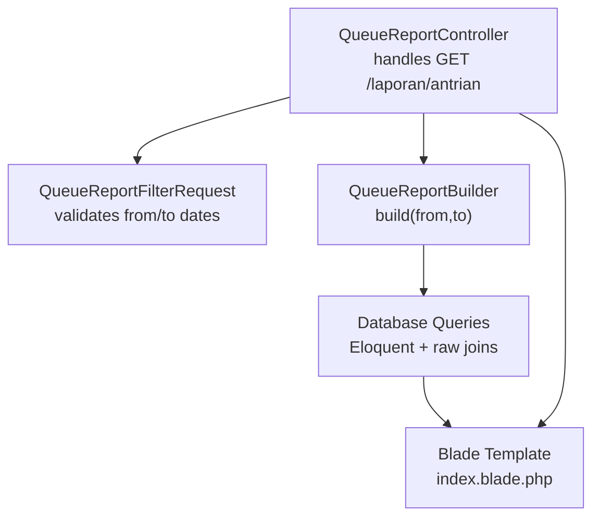
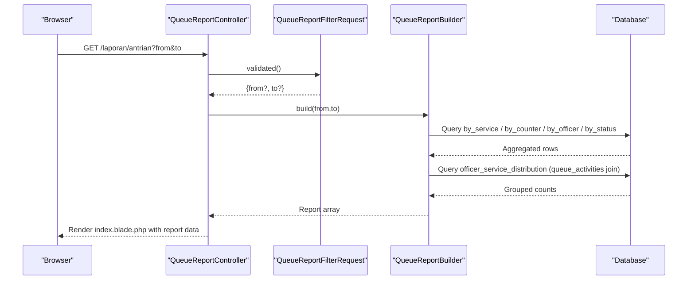
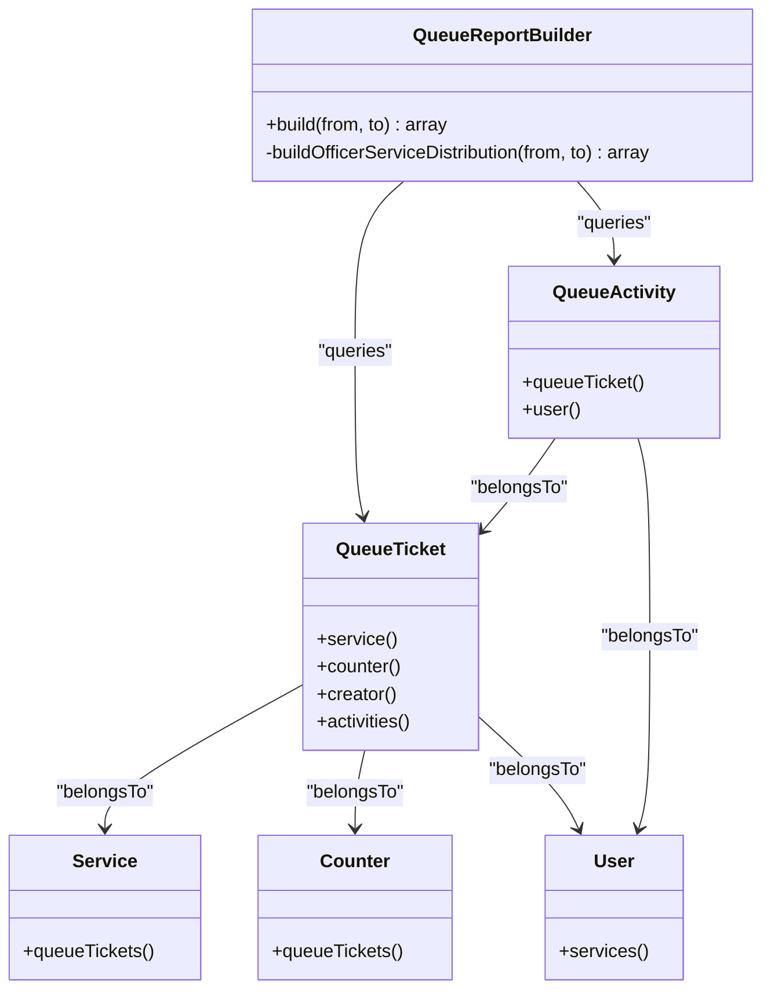
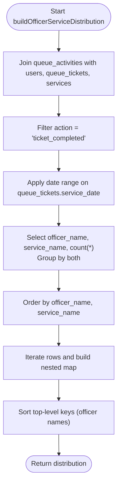
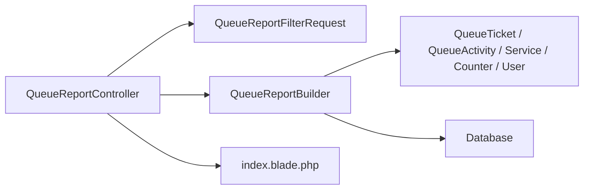

# Report Builder Architecture

<cite>
**Referenced Files in This Document**
- [QueueReportBuilder.php](file://app/Support/Reports/QueueReportBuilder.php)
- [QueueReportController.php](file://app/Http/Controllers/Report/QueueReportController.php)
- [QueueReportFilterRequest.php](file://app/Http/Requests/QueueReportFilterRequest.php)
- [QueueTicket.php](file://app/Models/QueueTicket.php)
- [QueueActivity.php](file://app/Models/QueueActivity.php)
- [Service.php](file://app/Models/Service.php)
- [Counter.php](file://app/Models/Counter.php)
- [User.php](file://app/Models/User.php)
- [index.blade.php](file://resources/views/pages/laporan/antrian/index.blade.php)
- [web.php](file://routes/web.php)
- [QueueReportBuilderTest.php](file://tests/Feature/Reports/QueueReportBuilderTest.php)
- [QueueReportBuilderTest.php](file://tests/Unit/Reports/QueueReportBuilderTest.php)
</cite>

## Table of Contents
1. [Introduction](#introduction)
2. [Project Structure](#project-structure)
3. [Core Components](#core-components)
4. [Architecture Overview](#architecture-overview)
5. [Detailed Component Analysis](#detailed-component-analysis)
6. [Dependency Analysis](#dependency-analysis)
7. [Performance Considerations](#performance-considerations)
8. [Troubleshooting Guide](#troubleshooting-guide)
9. [Conclusion](#conclusion)

## Introduction
This document explains the Report Builder architecture for queue analytics in the PTSP queue management system. It focuses on the QueueReportBuilder class and its methods for aggregating queue data across multiple dimensions: service distribution, counter utilization, officer performance, status tracking, and officer-service distributions. It also documents the date range filtering mechanism, SQL query construction patterns, data aggregation strategies, and the integration with QueueReportController for rendering reports in the web interface.

## Project Structure
The report functionality is organized around a dedicated support class (QueueReportBuilder), a controller for web rendering (QueueReportController), a form request for input validation (QueueReportFilterRequest), and Blade templates for presentation. The builder relies on Eloquent models and database relationships to construct efficient SQL queries.

**Diagram sources**
- [QueueReportController.php:12-25](file://app/Http/Controllers/Report/QueueReportController.php#L12-L25)
- [QueueReportFilterRequest.php:22-28](file://app/Http/Requests/QueueReportFilterRequest.php#L22-L28)
- [QueueReportBuilder.php:20-64](file://app/Support/Reports/QueueReportBuilder.php#L20-L64)
- [index.blade.php:23-34](file://resources/views/pages/laporan/antrian/index.blade.php#L23-L34)

**Section sources**
- [web.php:58-59](file://routes/web.php#L58-L59)
- [QueueReportController.php:12-25](file://app/Http/Controllers/Report/QueueReportController.php#L12-L25)
- [QueueReportFilterRequest.php:22-28](file://app/Http/Requests/QueueReportFilterRequest.php#L22-L28)
- [QueueReportBuilder.php:20-64](file://app/Support/Reports/QueueReportBuilder.php#L20-L64)
- [index.blade.php:23-34](file://resources/views/pages/laporan/antrian/index.blade.php#L23-L34)

## Core Components
- QueueReportBuilder: Central aggregation engine that builds five report sections and officer-service distribution.
- QueueReportController: Web controller that validates filters, delegates to the builder, and renders the Blade template.
- QueueReportFilterRequest: Validates optional from/to date inputs.
- Models: QueueTicket, QueueActivity, Service, Counter, User define the data schema and relationships used by the builder.
- Blade Template: Presents aggregated data in a responsive grid layout with filter controls.

Key responsibilities:
- Date range filtering via a closure that applies whereDate conditions on service_date.
- Five primary aggregations: by_service, by_counter, by_officer, by_status.
- Specialized aggregation: officer_service_distribution using queue_activities and ticket completion events.

**Section sources**
- [QueueReportBuilder.php:9-18](file://app/Support/Reports/QueueReportBuilder.php#L9-L18)
- [QueueReportBuilder.php:20-64](file://app/Support/Reports/QueueReportBuilder.php#L20-L64)
- [QueueReportBuilder.php:69-95](file://app/Support/Reports/QueueReportBuilder.php#L69-L95)
- [QueueReportController.php:12-25](file://app/Http/Controllers/Report/QueueReportController.php#L12-L25)
- [QueueReportFilterRequest.php:22-28](file://app/Http/Requests/QueueReportFilterRequest.php#L22-L28)

## Architecture Overview
The report pipeline follows a clean separation of concerns:
- Input: GET parameters from the web UI (from/to).
- Validation: QueueReportFilterRequest ensures nullable date inputs pass basic validation.
- Processing: QueueReportBuilder constructs SQL queries with joins and groupings.
- Presentation: QueueReportController renders index.blade.php with the computed report.

**Diagram sources**
- [QueueReportController.php:12-25](file://app/Http/Controllers/Report/QueueReportController.php#L12-L25)
- [QueueReportFilterRequest.php:22-28](file://app/Http/Requests/QueueReportFilterRequest.php#L22-L28)
- [QueueReportBuilder.php:20-64](file://app/Support/Reports/QueueReportBuilder.php#L20-L64)
- [QueueReportBuilder.php:69-95](file://app/Support/Reports/QueueReportBuilder.php#L69-L95)
- [index.blade.php:23-34](file://resources/views/pages/laporan/antrian/index.blade.php#L23-L34)

## Detailed Component Analysis

### QueueReportBuilder
The QueueReportBuilder class encapsulates all report logic. It exposes a single public method build() that accepts two date strings and returns a structured array containing five report sections plus a specialized officer-service distribution.

- build(from, to): Applies a date scope closure to filter by service_date, then executes four distinct queries:
  - by_service: joins queue_tickets with services, groups by service name, orders by name, plucks counts.
  - by_counter: filters non-null counter_id, joins with counters, groups by counter name, orders by name.
  - by_officer: joins with users on created_by, groups by officer name, orders by name.
  - by_status: groups queue tickets by status field.
  - officer_service_distribution: delegates to a private method that queries queue_activities for completed tickets and builds a nested map keyed by officer then service.

- buildOfficerServiceDistribution(from, to): Uses a raw DB query joining queue_activities, users, queue_tickets, and services. Filters for completed actions and applies the same date range. Groups by officer and service, orders both, and transforms the collection into an associative array sorted by officer name.

Data structure returned by build():
- by_service: array<string,int> — service name to count
- by_counter: array<string,int> — counter name to count
- by_officer: array<string,int> — officer name to count
- by_status: array<string,int> — status value to count
- officer_service_distribution: array<string,array<string,int>> — officer → service → count

SQL patterns used:
- Closure-based scope application via tap() to reuse date filtering.
- Join patterns: queue_tickets ↔ services, queue_tickets ↔ counters, queue_tickets ↔ users.
- Aggregation with selectRaw(), groupBy(), orderBy(), and pluck() for efficient retrieval.

**Section sources**
- [QueueReportBuilder.php:20-64](file://app/Support/Reports/QueueReportBuilder.php#L20-L64)
- [QueueReportBuilder.php:69-95](file://app/Support/Reports/QueueReportBuilder.php#L69-L95)

#### Class Diagram

**Diagram sources**
- [QueueReportBuilder.php:9-18](file://app/Support/Reports/QueueReportBuilder.php#L9-L18)
- [QueueTicket.php:54-77](file://app/Models/QueueTicket.php#L54-L77)
- [Service.php:48-51](file://app/Models/Service.php#L48-L51)
- [Counter.php:38-41](file://app/Models/Counter.php#L38-L41)
- [User.php:93-97](file://app/Models/User.php#L93-L97)
- [QueueActivity.php:29-42](file://app/Models/QueueActivity.php#L29-L42)

### QueueReportController
The controller coordinates input validation, delegation to the builder, and view rendering. It defaults to the current date if either from or to is omitted.

Responsibilities:
- Accepts QueueReportFilterRequest and QueueReportBuilder as constructor dependencies.
- Extracts validated from/to values, defaulting to today’s date.
- Calls build() on the builder and passes the result to the Blade template.

Integration points:
- Route: GET /laporan/antrian bound to QueueReportController@index.
- View: index.blade.php receives from, to, and report variables.

**Section sources**
- [QueueReportController.php:12-25](file://app/Http/Controllers/Report/QueueReportController.php#L12-L25)
- [web.php:58-59](file://routes/web.php#L58-L59)

### QueueReportFilterRequest
Implements basic validation for optional date inputs:
- from: nullable date
- to: nullable date

Authorization is enabled for all users.

**Section sources**
- [QueueReportFilterRequest.php:22-28](file://app/Http/Requests/QueueReportFilterRequest.php#L22-L28)

### Data Models and Relationships
The builder leverages the following model relationships:
- QueueTicket belongs to Service, Counter, and User (via created_by), and has many QueueActivity records.
- Service has many QueueTickets and many Users via pivot.
- Counter has many QueueTickets and QueueActivities.
- User has many QueueTickets (as creator) and many QueueActivities.

These relationships enable efficient joins in the builder’s queries.

**Section sources**
- [QueueTicket.php:54-77](file://app/Models/QueueTicket.php#L54-L77)
- [Service.php:48-57](file://app/Models/Service.php#L48-L57)
- [Counter.php:38-51](file://app/Models/Counter.php#L38-L51)
- [User.php:93-97](file://app/Models/User.php#L93-L97)
- [QueueActivity.php:29-42](file://app/Models/QueueActivity.php#L29-L42)

### Officer-Service Distribution Algorithm
The officer-service distribution requires a specialized query that:
- Joins queue_activities with users, queue_tickets, and services.
- Filters for completed actions on tickets.
- Applies the date range on queue_tickets.service_date.
- Groups by officer and service, ordering both for deterministic output.
- Transforms the result into a nested associative array keyed by officer name and service name.

**Diagram sources**
- [QueueReportBuilder.php:69-95](file://app/Support/Reports/QueueReportBuilder.php#L69-L95)

## Dependency Analysis
The report system exhibits low coupling and high cohesion:
- Controller depends on the builder and form request abstractions.
- Builder depends on models and the database layer; it does not depend on HTTP specifics.
- Blade template depends on the report structure returned by the builder.

**Diagram sources**
- [QueueReportController.php:12-25](file://app/Http/Controllers/Report/QueueReportController.php#L12-L25)
- [QueueReportFilterRequest.php:22-28](file://app/Http/Requests/QueueReportFilterRequest.php#L22-L28)
- [QueueReportBuilder.php:20-64](file://app/Support/Reports/QueueReportBuilder.php#L20-L64)
- [index.blade.php:23-34](file://resources/views/pages/laporan/antrian/index.blade.php#L23-L34)

**Section sources**
- [QueueReportController.php:12-25](file://app/Http/Controllers/Report/QueueReportController.php#L12-L25)
- [QueueReportBuilder.php:20-64](file://app/Support/Reports/QueueReportBuilder.php#L20-L64)

## Performance Considerations
- Query efficiency: Each aggregation uses targeted joins and groupBy to minimize data transfer and leverage database indexing on service_date, foreign keys, and grouped columns.
- Closure-based scope: The dateScope closure avoids duplicating whereDate clauses across queries.
- Pluck-to-array conversion: Efficiently converts grouped results into associative arrays for immediate consumption by the view.
- Officer-service distribution: Uses a single join-heavy query with explicit grouping and ordering to produce a deterministic nested structure.

Recommendations:
- Add database indexes on frequently filtered and joined columns (service_date, service_id, counter_id, created_by, user_id).
- Consider pagination or chunking for very large date ranges if memory becomes a concern.
- Cache repeated reports for fixed date ranges if the dataset is static.

[No sources needed since this section provides general guidance]

## Troubleshooting Guide
Common issues and resolutions:
- Empty report data: Occurs when no tickets match the selected date range. The builder returns empty arrays; the view displays a “no data” message.
- Invalid date inputs: QueueReportFilterRequest allows nullable dates; if both from and to are missing, the controller defaults to the current date.
- Missing relationships: Ensure queue_tickets has valid foreign keys (service_id, counter_id, created_by) and that queue_activities references existing queue_ticket_id and user_id.

Verification via tests:
- Feature tests confirm correct aggregation counts for service, counter, officer, and status.
- Unit tests validate the officer-service distribution structure and counts.

**Section sources**
- [QueueReportBuilderTest.php:10-44](file://tests/Feature/Reports/QueueReportBuilderTest.php#L10-L44)
- [QueueReportBuilderTest.php:11-59](file://tests/Unit/Reports/QueueReportBuilderTest.php#L11-L59)

## Conclusion
The Report Builder architecture cleanly separates concerns between input validation, report computation, and presentation. The QueueReportBuilder efficiently aggregates queue metrics across multiple dimensions using targeted SQL queries and deterministic sorting. The integration with QueueReportController and the Blade template provides a user-friendly interface for viewing and filtering reports by date range. The design supports future enhancements such as additional filters, caching, and expanded analytics while maintaining readability and testability.