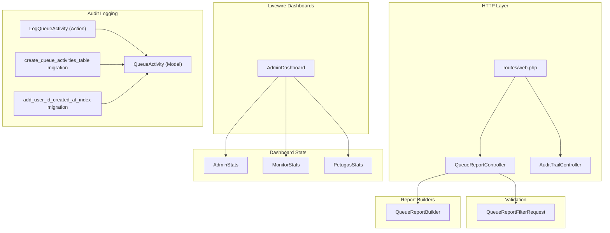
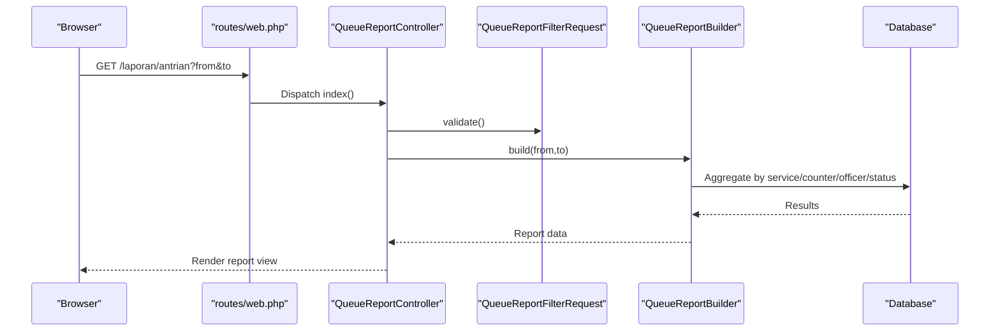
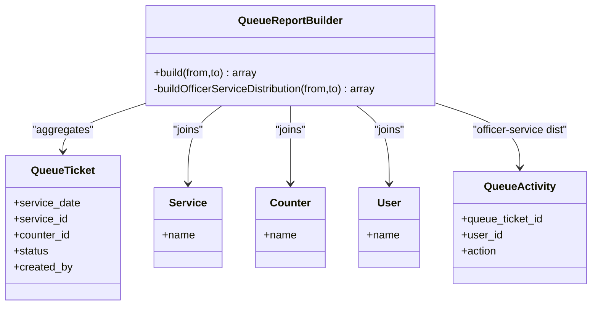
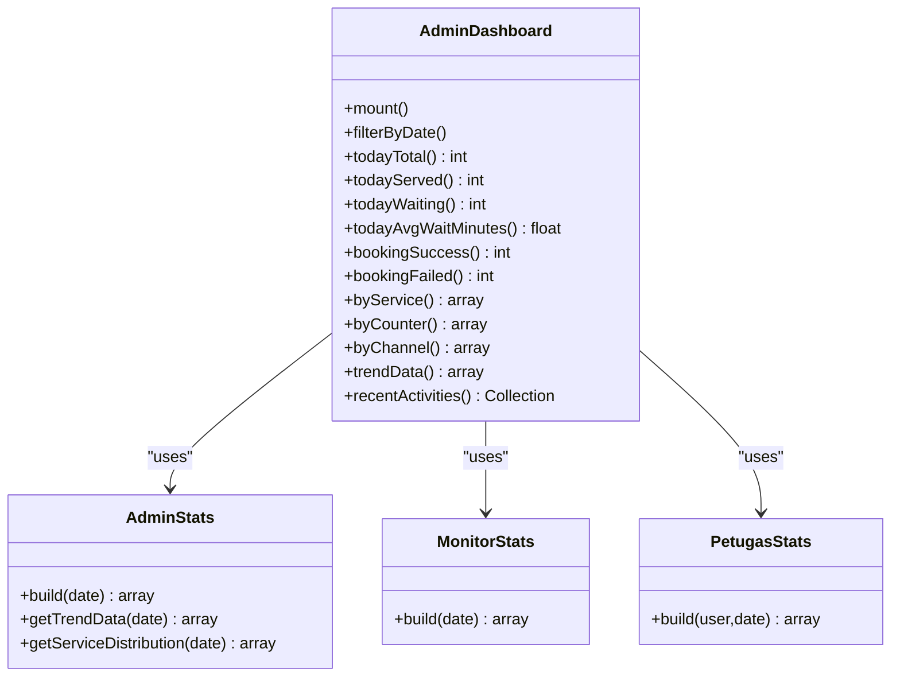
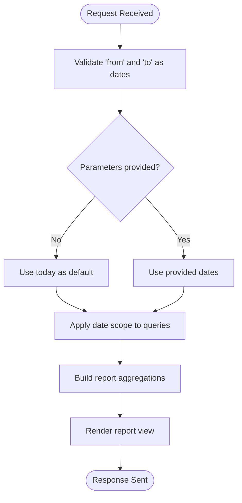
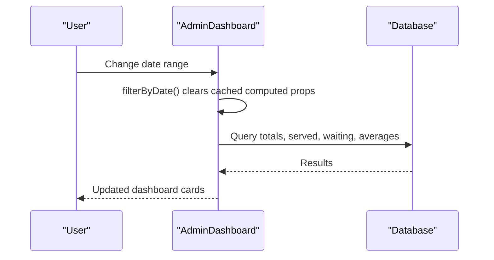
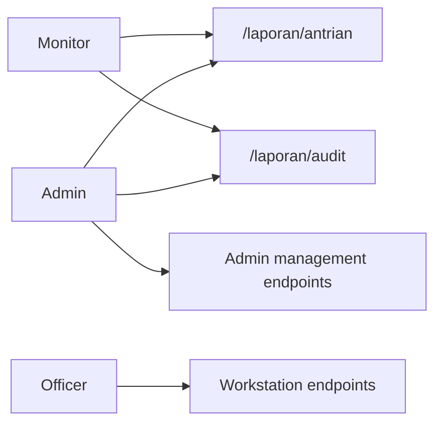
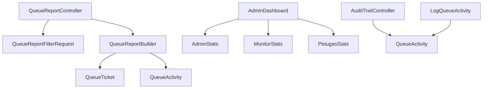

# Reporting and Analytics

<cite>
**Referenced Files in This Document**
- [QueueReportBuilder.php](file://app/Support/Reports/QueueReportBuilder.php)
- [QueueReportController.php](file://app/Http/Controllers/Report/QueueReportController.php)
- [QueueReportFilterRequest.php](file://app/Http/Requests/QueueReportFilterRequest.php)
- [AdminStats.php](file://app/Support/Dashboard/AdminStats.php)
- [MonitorStats.php](file://app/Support/Dashboard/MonitorStats.php)
- [PetugasStats.php](file://app/Support/Dashboard/PetugasStats.php)
- [AdminDashboard.php](file://app/Livewire/Dashboard/AdminDashboard.php)
- [AuditTrailController.php](file://app/Http/Controllers/Report/AuditTrailController.php)
- [QueueActivity.php](file://app/Models/QueueActivity.php)
- [LogQueueActivity.php](file://app/Actions/Queue/LogQueueActivity.php)
- [web.php](file://routes/web.php)
- [api.php](file://routes/api.php)
- [2026_03_06_015239_create_queue_activities_table.php](file://database/migrations/2026_03_06_015239_create_queue_activities_table.php)
- [2026_03_13_143634_add_user_id_created_at_index_to_queue_activities_table.php](file://database/migrations/2026_03_13_143634_add_user_id_created_at_index_to_queue_activities_table.php)
- [QueueAuditLogTest.php](file://tests/Feature/Audit/QueueAuditLogTest.php)
</cite>

## Table of Contents
1. [Introduction](#introduction)
2. [Project Structure](#project-structure)
3. [Core Components](#core-components)
4. [Architecture Overview](#architecture-overview)
5. [Detailed Component Analysis](#detailed-component-analysis)
6. [Dependency Analysis](#dependency-analysis)
7. [Performance Considerations](#performance-considerations)
8. [Troubleshooting Guide](#troubleshooting-guide)
9. [Conclusion](#conclusion)
10. [Appendices](#appendices)

## Introduction
This document explains the Reporting and Analytics system for the queue management module. It covers the report builder architecture, generation of queue statistics, performance metrics, and audit trails. It also documents dashboard components for administrators, officers, and monitors, along with reporting filters, date ranges, and export considerations. Finally, it provides guidance for interpreting reports and establishing performance benchmarks.

## Project Structure
The reporting and analytics functionality spans several layers:
- Controllers orchestrate requests and delegate to builders and stats services.
- Request validators enforce filter constraints (date range).
- Report builders aggregate counts by service, counter, officer, status, and officer-service distributions.
- Dashboard support classes compute administrative, monitor, and officer-specific metrics.
- Livewire components power real-time dashboards with computed properties and persistence.
- Audit trail is captured via queue activity logs and surfaced in dedicated reports.



**Diagram sources**
- [web.php:1-127](file://routes/web.php#L1-L127)
- [QueueReportController.php:1-27](file://app/Http/Controllers/Report/QueueReportController.php#L1-L27)
- [AuditTrailController.php:1-39](file://app/Http/Controllers/Report/AuditTrailController.php#L1-L39)
- [QueueReportFilterRequest.php:1-30](file://app/Http/Requests/QueueReportFilterRequest.php#L1-L30)
- [QueueReportBuilder.php:1-97](file://app/Support/Reports/QueueReportBuilder.php#L1-L97)
- [AdminStats.php:1-178](file://app/Support/Dashboard/AdminStats.php#L1-L178)
- [MonitorStats.php:1-38](file://app/Support/Dashboard/MonitorStats.php#L1-L38)
- [PetugasStats.php:1-60](file://app/Support/Dashboard/PetugasStats.php#L1-L60)
- [AdminDashboard.php:1-233](file://app/Livewire/Dashboard/AdminDashboard.php#L1-L233)
- [QueueActivity.php:1-44](file://app/Models/QueueActivity.php#L1-L44)
- [LogQueueActivity.php:1-29](file://app/Actions/Queue/LogQueueActivity.php#L1-L29)
- [2026_03_06_015239_create_queue_activities_table.php:1-35](file://database/migrations/2026_03_06_015239_create_queue_activities_table.php#L1-L35)
- [2026_03_13_143634_add_user_id_created_at_index_to_queue_activities_table.php:1-28](file://database/migrations/2026_03_13_143634_add_user_id_created_at_index_to_queue_activities_table.php#L1-L28)

**Section sources**
- [web.php:1-127](file://routes/web.php#L1-L127)
- [QueueReportController.php:1-27](file://app/Http/Controllers/Report/QueueReportController.php#L1-L27)
- [QueueReportFilterRequest.php:1-30](file://app/Http/Requests/QueueReportFilterRequest.php#L1-L30)
- [QueueReportBuilder.php:1-97](file://app/Support/Reports/QueueReportBuilder.php#L1-L97)
- [AdminStats.php:1-178](file://app/Support/Dashboard/AdminStats.php#L1-L178)
- [MonitorStats.php:1-38](file://app/Support/Dashboard/MonitorStats.php#L1-L38)
- [PetugasStats.php:1-60](file://app/Support/Dashboard/PetugasStats.php#L1-L60)
- [AdminDashboard.php:1-233](file://app/Livewire/Dashboard/AdminDashboard.php#L1-L233)
- [QueueActivity.php:1-44](file://app/Models/QueueActivity.php#L1-L44)
- [LogQueueActivity.php:1-29](file://app/Actions/Queue/LogQueueActivity.php#L1-L29)
- [2026_03_06_015239_create_queue_activities_table.php:1-35](file://database/migrations/2026_03_06_015239_create_queue_activities_table.php#L1-L35)
- [2026_03_13_143634_add_user_id_created_at_index_to_queue_activities_table.php:1-28](file://database/migrations/2026_03_13_143634_add_user_id_created_at_index_to_queue_activities_table.php#L1-L28)

## Core Components
- Report Builder: Aggregates queue statistics across service, counter, officer, status, and officer-service distribution using SQL queries scoped by a date range.
- Dashboard Stats: Provides administrative, monitor, and officer-specific metrics including totals, trends, and distributions.
- Audit Trail: Captures all queue lifecycle actions with actor and optional counter context for compliance and monitoring.
- Real-time Dashboards: Livewire components compute metrics with persistence and reactive updates.

**Section sources**
- [QueueReportBuilder.php:20-64](file://app/Support/Reports/QueueReportBuilder.php#L20-L64)
- [AdminStats.php:23-85](file://app/Support/Dashboard/AdminStats.php#L23-L85)
- [MonitorStats.php:21-38](file://app/Support/Dashboard/MonitorStats.php#L21-L38)
- [PetugasStats.php:20-58](file://app/Support/Dashboard/PetugasStats.php#L20-L58)
- [QueueActivity.php:14-27](file://app/Models/QueueActivity.php#L14-L27)
- [LogQueueActivity.php:13-27](file://app/Actions/Queue/LogQueueActivity.php#L13-L27)
- [AdminDashboard.php:40-204](file://app/Livewire/Dashboard/AdminDashboard.php#L40-L204)

## Architecture Overview
The system follows a layered architecture:
- Presentation: Web routes expose report and audit endpoints; Livewire dashboards render real-time metrics.
- Application: Controllers coordinate request validation and delegate to builders/stats services.
- Domain: Report builders and stats services encapsulate aggregation logic.
- Persistence: Queue activity logs and queue tickets are queried for analytics and audit.



**Diagram sources**
- [web.php:57-60](file://routes/web.php#L57-L60)
- [QueueReportController.php:12-25](file://app/Http/Controllers/Report/QueueReportController.php#L12-L25)
- [QueueReportFilterRequest.php:22-28](file://app/Http/Requests/QueueReportFilterRequest.php#L22-L28)
- [QueueReportBuilder.php:20-64](file://app/Support/Reports/QueueReportBuilder.php#L20-L64)

## Detailed Component Analysis

### Report Builder Architecture
The report builder computes:
- Count by service
- Count by counter
- Count by officer (creator)
- Count by status
- Officer-service distribution matrix for completed tickets

It applies a date scope to the ticket service date and performs joins to derive counts and distributions. The officer-service distribution leverages queue activity logs to capture completed actions.



**Diagram sources**
- [QueueReportBuilder.php:9-97](file://app/Support/Reports/QueueReportBuilder.php#L9-L97)
- [QueueReportBuilder.php:27-63](file://app/Support/Reports/QueueReportBuilder.php#L27-L63)
- [QueueReportBuilder.php:69-95](file://app/Support/Reports/QueueReportBuilder.php#L69-L95)

**Section sources**
- [QueueReportBuilder.php:20-64](file://app/Support/Reports/QueueReportBuilder.php#L20-L64)
- [QueueReportBuilder.php:69-95](file://app/Support/Reports/QueueReportBuilder.php#L69-L95)

### Dashboard Components and Metrics
- Administrative dashboard (Livewire):
  - Totals, served, waiting, average wait minutes
  - Booking success/failure by channel
  - Distribution by service and counter
  - Trend data across a 7-day window
  - Recent activity feed
- Administrative summary metrics:
  - Booking success/failure counts
  - Created/cancelled/completed tickets
  - Failure summary (cancelled, skipped)
  - Public activity by channel
  - 7-day trend of total vs completed
  - Top service distribution with “Other” bucket
- Monitor statistics:
  - Total served today
  - Throughput today
  - Backlog by service
  - Served by officer
  - Officer-service matrix
- Officer performance metrics:
  - Tickets served today
  - Action counts (skipped, recalled, completed)
  - Service distribution



**Diagram sources**
- [AdminDashboard.php:12-233](file://app/Livewire/Dashboard/AdminDashboard.php#L12-L233)
- [AdminStats.php:10-178](file://app/Support/Dashboard/AdminStats.php#L10-L178)
- [MonitorStats.php:10-38](file://app/Support/Dashboard/MonitorStats.php#L10-L38)
- [PetugasStats.php:11-60](file://app/Support/Dashboard/PetugasStats.php#L11-L60)

**Section sources**
- [AdminDashboard.php:40-204](file://app/Livewire/Dashboard/AdminDashboard.php#L40-L204)
- [AdminStats.php:23-176](file://app/Support/Dashboard/AdminStats.php#L23-L176)
- [MonitorStats.php:21-38](file://app/Support/Dashboard/MonitorStats.php#L21-L38)
- [PetugasStats.php:20-58](file://app/Support/Dashboard/PetugasStats.php#L20-L58)

### Audit Trail System
All queue lifecycle actions are logged with actor and optional counter context. The audit trail controller supports:
- Date filtering
- Search across ticket number, user name, and counter name
- Paginated listing with latest-first ordering

```mermaid
sequenceDiagram
participant Actor as "Actor"
participant Action as "LogQueueActivity"
participant Model as "QueueActivity"
participant DB as "Database"
participant Ctrl as "AuditTrailController"
participant View as "Audit View"
Actor->>Action : handle(ticket, action, userId, counterId, meta)
Action->>Model : create(...)
Model->>DB : insert row
DB-->>Model : saved
Ctrl->>DB : query with date/search
DB-->>Ctrl : paginated results
Ctrl-->>View : render
```

**Diagram sources**
- [LogQueueActivity.php:13-27](file://app/Actions/Queue/LogQueueActivity.php#L13-L27)
- [QueueActivity.php:14-27](file://app/Models/QueueActivity.php#L14-L27)
- [AuditTrailController.php:12-38](file://app/Http/Controllers/Report/AuditTrailController.php#L12-L38)
- [2026_03_06_015239_create_queue_activities_table.php:14-25](file://database/migrations/2026_03_06_015239_create_queue_activities_table.php#L14-L25)
- [2026_03_13_143634_add_user_id_created_at_index_to_queue_activities_table.php:14-16](file://database/migrations/2026_03_13_143634_add_user_id_created_at_index_to_queue_activities_table.php#L14-L16)

**Section sources**
- [LogQueueActivity.php:13-27](file://app/Actions/Queue/LogQueueActivity.php#L13-L27)
- [QueueActivity.php:14-27](file://app/Models/QueueActivity.php#L14-L27)
- [AuditTrailController.php:12-38](file://app/Http/Controllers/Report/AuditTrailController.php#L12-L38)
- [2026_03_06_015239_create_queue_activities_table.php:14-25](file://database/migrations/2026_03_06_015239_create_queue_activities_table.php#L14-L25)
- [2026_03_13_143634_add_user_id_created_at_index_to_queue_activities_table.php:14-16](file://database/migrations/2026_03_13_143634_add_user_id_created_at_index_to_queue_activities_table.php#L14-L16)

### Reporting Filters, Date Ranges, and Export
- Filters:
  - From and To date parameters validated as nullable dates.
  - Default behavior uses current date if parameters are absent.
- Date ranges:
  - Report builder scopes by service_date.
  - Administrative dashboard supports flexible date ranges with a 7-day trend window.
- Export:
  - No explicit export endpoints are present in the analyzed code. Implementations can leverage existing report arrays and views to produce CSV/Excel exports.



**Diagram sources**
- [QueueReportFilterRequest.php:22-28](file://app/Http/Requests/QueueReportFilterRequest.php#L22-L28)
- [QueueReportController.php:14-18](file://app/Http/Controllers/Report/QueueReportController.php#L14-L18)
- [QueueReportBuilder.php:22-24](file://app/Support/Reports/QueueReportBuilder.php#L22-L24)
- [AdminDashboard.php:154-190](file://app/Livewire/Dashboard/AdminDashboard.php#L154-L190)

**Section sources**
- [QueueReportFilterRequest.php:22-28](file://app/Http/Requests/QueueReportFilterRequest.php#L22-L28)
- [QueueReportController.php:14-18](file://app/Http/Controllers/Report/QueueReportController.php#L14-L18)
- [QueueReportBuilder.php:22-24](file://app/Support/Reports/QueueReportBuilder.php#L22-L24)
- [AdminDashboard.php:154-190](file://app/Livewire/Dashboard/AdminDashboard.php#L154-L190)

### Real-time Dashboard Updates and Historical Visualization
- Livewire computed properties persist across re-computation and invalidate on filter change.
- Average wait minutes adapt to database driver differences.
- Trend data builds a fixed 7-day window or adapts to custom date ranges.
- Recent activity feed remains independent of date filters to show live events.



**Diagram sources**
- [AdminDashboard.php:24-38](file://app/Livewire/Dashboard/AdminDashboard.php#L24-L38)
- [AdminDashboard.php:70-88](file://app/Livewire/Dashboard/AdminDashboard.php#L70-L88)
- [AdminDashboard.php:154-190](file://app/Livewire/Dashboard/AdminDashboard.php#L154-L190)
- [AdminDashboard.php:196-204](file://app/Livewire/Dashboard/AdminDashboard.php#L196-L204)

**Section sources**
- [AdminDashboard.php:24-38](file://app/Livewire/Dashboard/AdminDashboard.php#L24-L38)
- [AdminDashboard.php:70-88](file://app/Livewire/Dashboard/AdminDashboard.php#L70-L88)
- [AdminDashboard.php:154-190](file://app/Livewire/Dashboard/AdminDashboard.php#L154-L190)
- [AdminDashboard.php:196-204](file://app/Livewire/Dashboard/AdminDashboard.php#L196-L204)

### Role-based Access and Endpoints
- Monitor role can access:
  - Queue report page
  - Audit trail page
- Admin role can access:
  - Management endpoints (services, counters, users, regions)
  - Reports and audit trail
- Officer role can access:
  - Officer workstation endpoints



**Diagram sources**
- [web.php:57-90](file://routes/web.php#L57-L90)

**Section sources**
- [web.php:57-90](file://routes/web.php#L57-L90)

## Dependency Analysis
- Controllers depend on request validators and report/stats builders.
- Report builder depends on queue tickets and queue activities for distributions.
- Dashboard components depend on stats services and queue activity models.
- Audit trail depends on queue activity model and route exposure.



**Diagram sources**
- [QueueReportController.php:12-25](file://app/Http/Controllers/Report/QueueReportController.php#L12-L25)
- [QueueReportFilterRequest.php:22-28](file://app/Http/Requests/QueueReportFilterRequest.php#L22-L28)
- [QueueReportBuilder.php:27-63](file://app/Support/Reports/QueueReportBuilder.php#L27-L63)
- [AdminDashboard.php:40-204](file://app/Livewire/Dashboard/AdminDashboard.php#L40-L204)
- [AuditTrailController.php:17-31](file://app/Http/Controllers/Report/AuditTrailController.php#L17-L31)
- [LogQueueActivity.php:13-27](file://app/Actions/Queue/LogQueueActivity.php#L13-L27)

**Section sources**
- [QueueReportController.php:12-25](file://app/Http/Controllers/Report/QueueReportController.php#L12-L25)
- [QueueReportBuilder.php:27-63](file://app/Support/Reports/QueueReportBuilder.php#L27-L63)
- [AdminDashboard.php:40-204](file://app/Livewire/Dashboard/AdminDashboard.php#L40-L204)
- [AuditTrailController.php:17-31](file://app/Http/Controllers/Report/AuditTrailController.php#L17-L31)
- [LogQueueActivity.php:13-27](file://app/Actions/Queue/LogQueueActivity.php#L13-L27)

## Performance Considerations
- Indexing:
  - Queue activities table includes indices on (queue_ticket_id, created_at) and (action, created_at) to speed up audits and activity queries.
  - An additional composite index on (user_id, created_at) improves performance for officer activity rollups.
- Computed properties:
  - Livewire computed properties are persisted to avoid recomputation on minor UI updates.
- Driver-specific expressions:
  - Average wait minutes uses database-native difference functions to minimize client-side computation.
- Pagination:
  - Audit trail listing uses pagination to limit payload sizes.

**Section sources**
- [2026_03_06_015239_create_queue_activities_table.php:23-24](file://database/migrations/2026_03_06_015239_create_queue_activities_table.php#L23-L24)
- [2026_03_13_143634_add_user_id_created_at_index_to_queue_activities_table.php:14-16](file://database/migrations/2026_03_13_143634_add_user_id_created_at_index_to_queue_activities_table.php#L14-L16)
- [AdminDashboard.php:73-87](file://app/Livewire/Dashboard/AdminDashboard.php#L73-L87)
- [AuditTrailController.php:30](file://app/Http/Controllers/Report/AuditTrailController.php#L30)

## Troubleshooting Guide
- Validation failures:
  - Ensure date parameters conform to date validation rules.
- Missing report data:
  - Verify service_date falls within the selected date range.
  - Confirm join conditions align with foreign keys.
- Audit trail empty:
  - Confirm queue lifecycle actions are routed through the logging action.
  - Check that the queue activities table exists and indices are applied.
- Performance issues:
  - Confirm indices exist on queue_activities for user_id and created_at.
  - Review Livewire computed property invalidation on filter changes.

**Section sources**
- [QueueReportFilterRequest.php:22-28](file://app/Http/Requests/QueueReportFilterRequest.php#L22-L28)
- [QueueReportBuilder.php:22-24](file://app/Support/Reports/QueueReportBuilder.php#L22-L24)
- [LogQueueActivity.php:13-27](file://app/Actions/Queue/LogQueueActivity.php#L13-L27)
- [2026_03_06_015239_create_queue_activities_table.php:14-25](file://database/migrations/2026_03_06_015239_create_queue_activities_table.php#L14-L25)
- [2026_03_13_143634_add_user_id_created_at_index_to_queue_activities_table.php:14-16](file://database/migrations/2026_03_13_143634_add_user_id_created_at_index_to_queue_activities_table.php#L14-L16)

## Conclusion
The Reporting and Analytics system provides robust, role-aware insights into queue operations. It combines efficient SQL-driven aggregations, comprehensive audit logging, and real-time dashboards to support administrative oversight, officer performance monitoring, and operational transparency. Extending export capabilities and ensuring consistent logging across all queue actions will further strengthen the system’s reliability and usability.

## Appendices

### API Endpoints Related to Reporting
- Public queue lookup and ticket retrieval endpoints are available under the API routes.

**Section sources**
- [api.php:8-22](file://routes/api.php#L8-L22)

### Report Interpretation Guidelines and Benchmarking
- Use the administrative dashboard to track daily totals, served counts, and waiting queues. Compare average wait minutes across time windows to identify bottlenecks.
- Monitor service distribution to identify peak services and plan counter assignments accordingly.
- Track officer action counts to assess productivity and adherence to workflows.
- Use the audit trail to investigate anomalies and ensure compliance with operational procedures.
- Establish baselines from the 7-day trend data to define performance targets and SLAs.

[No sources needed since this section provides general guidance]