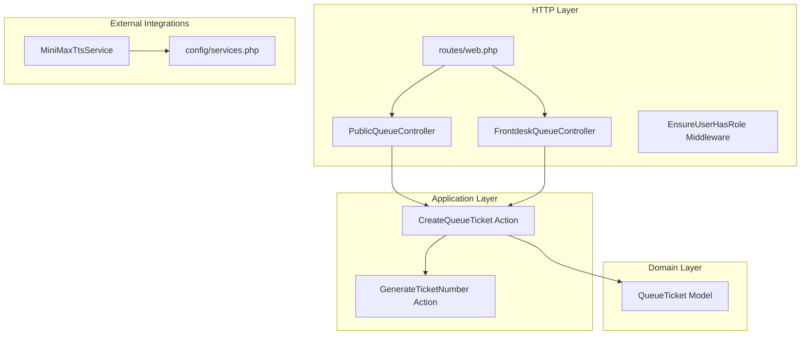
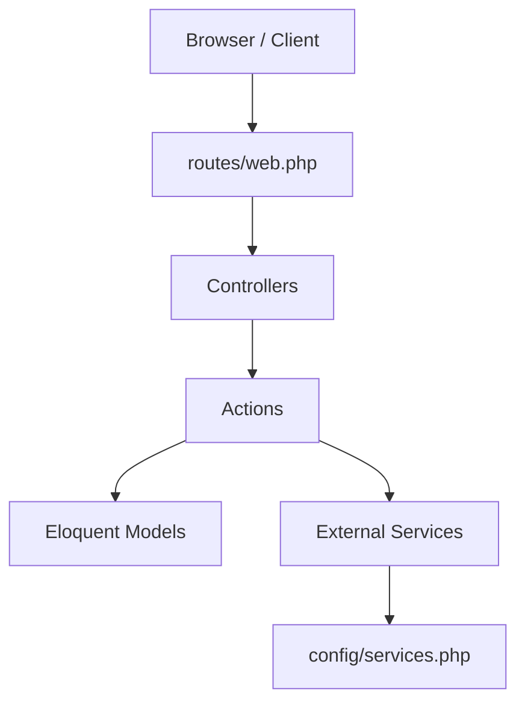
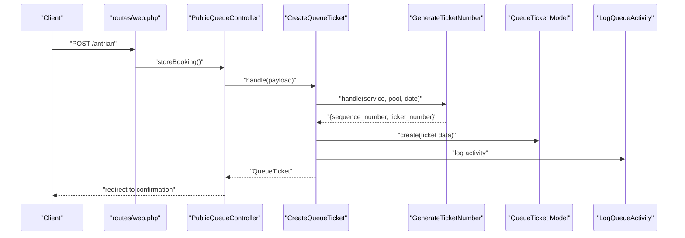
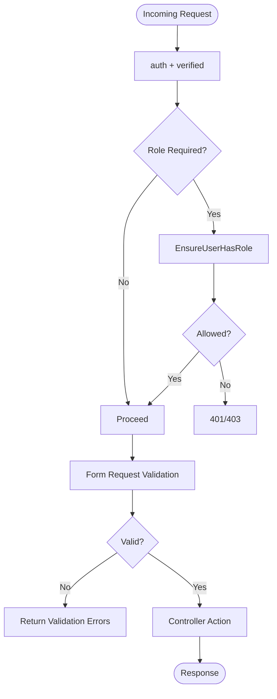
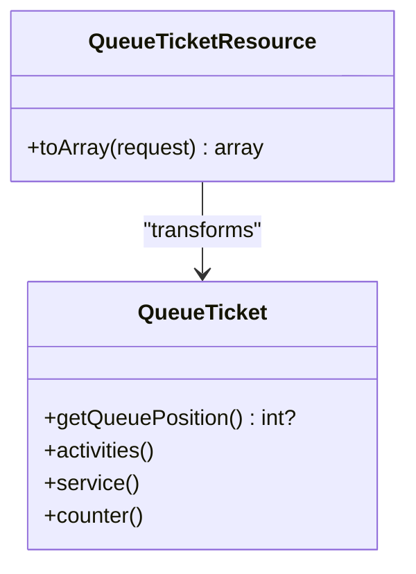
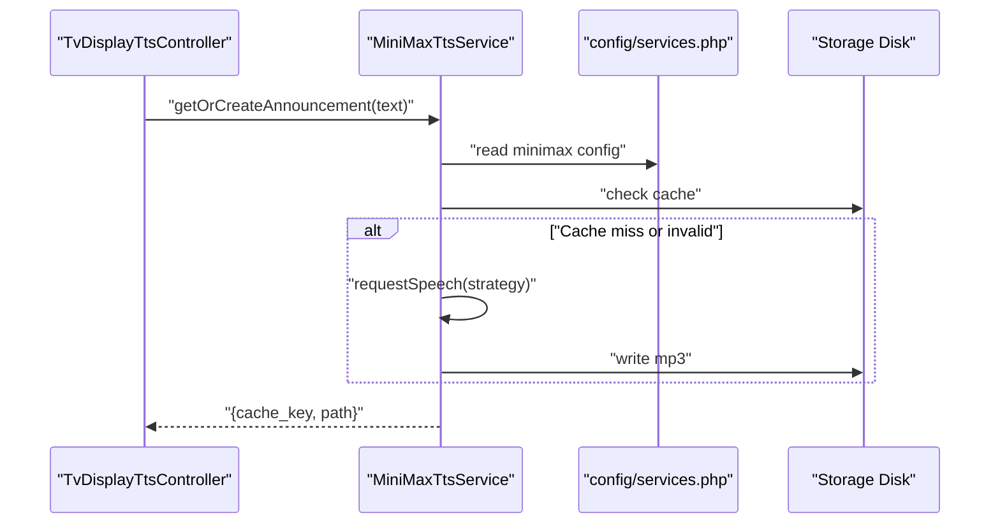
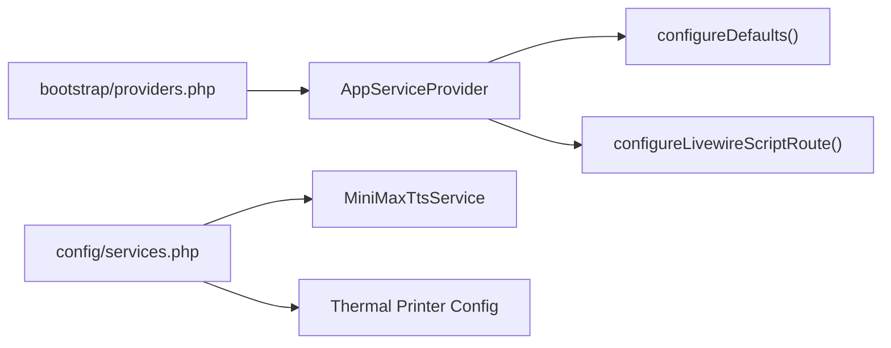
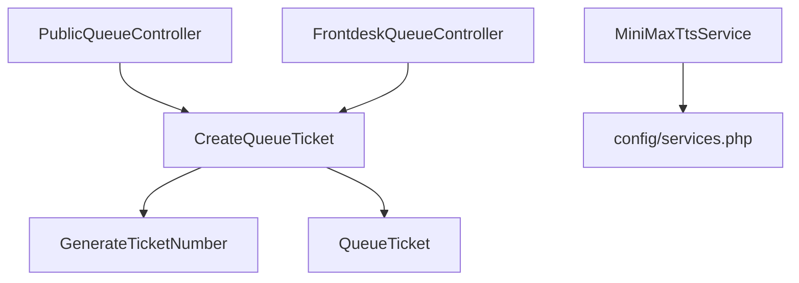

# Backend Architecture

<cite>
**Referenced Files in This Document**
- [Controller.php](file://app/Http/Controllers/Controller.php)
- [PublicQueueController.php](file://app/Http/Controllers/PublicQueueController.php)
- [FrontdeskQueueController.php](file://app/Http/Controllers/FrontdeskQueueController.php)
- [EnsureUserHasRole.php](file://app/Http/Middleware/EnsureUserHasRole.php)
- [StorePublicQueueBookingRequest.php](file://app/Http/Requests/StorePublicQueueBookingRequest.php)
- [QueueTicketResource.php](file://app/Http/Resources/QueueTicketResource.php)
- [QueueTicket.php](file://app/Models/QueueTicket.php)
- [CreateQueueTicket.php](file://app/Actions/Queue/CreateQueueTicket.php)
- [GenerateTicketNumber.php](file://app/Actions/Queue/GenerateTicketNumber.php)
- [MiniMaxTtsService.php](file://app/Services/Tts/MiniMaxTtsService.php)
- [web.php](file://routes/web.php)
- [services.php](file://config/services.php)
- [AppServiceProvider.php](file://app/Providers/AppServiceProvider.php)
- [providers.php](file://bootstrap/providers.php)
</cite>

## Table of Contents
1. [Introduction](#introduction)
2. [Project Structure](#project-structure)
3. [Core Components](#core-components)
4. [Architecture Overview](#architecture-overview)
5. [Detailed Component Analysis](#detailed-component-analysis)
6. [Dependency Analysis](#dependency-analysis)
7. [Performance Considerations](#performance-considerations)
8. [Troubleshooting Guide](#troubleshooting-guide)
9. [Conclusion](#conclusion)

## Introduction
This document describes the backend architecture of the PTSP (Public Service Ticketing Platform) system. It focuses on the MVC pattern with enhanced layers: Action classes encapsulating business logic, Eloquent models for data persistence, and service providers for dependency injection. The controller-action-model pattern is central to queue management workflows. The document also covers middleware for authentication and authorization, request validation, response transformation via resources, dependency injection container usage, service registration, configuration management, error handling strategies, logging patterns, and performance optimization techniques.

## Project Structure
The backend follows Laravel conventions with clear separation of concerns:
- Controllers under app/Http/Controllers implement the MVC entry points.
- Actions under app/Actions encapsulate domain-specific business logic.
- Models under app/Models define data structures and relationships.
- Requests under app/Http/Requests validate input.
- Resources under app/Http/Resources transform model data for APIs.
- Services under app/Services integrate with external systems.
- Routes under routes define endpoints and middleware stacks.
- Configuration under config manages third-party integrations.
- Providers under app/Providers register and bootstrap services.

**Diagram sources**
- [web.php:1-127](file://routes/web.php#L1-L127)
- [PublicQueueController.php:1-110](file://app/Http/Controllers/PublicQueueController.php#L1-L110)
- [FrontdeskQueueController.php:1-89](file://app/Http/Controllers/FrontdeskQueueController.php#L1-L89)
- [EnsureUserHasRole.php:1-37](file://app/Http/Middleware/EnsureUserHasRole.php#L1-L37)
- [CreateQueueTicket.php:1-91](file://app/Actions/Queue/CreateQueueTicket.php#L1-L91)
- [GenerateTicketNumber.php:1-31](file://app/Actions/Queue/GenerateTicketNumber.php#L1-L31)
- [QueueTicket.php:1-121](file://app/Models/QueueTicket.php#L1-L121)
- [MiniMaxTtsService.php:1-312](file://app/Services/Tts/MiniMaxTtsService.php#L1-L312)
- [services.php:1-61](file://config/services.php#L1-L61)

**Section sources**
- [web.php:1-127](file://routes/web.php#L1-L127)
- [providers.php:1-10](file://bootstrap/providers.php#L1-L10)

## Core Components
- Controllers: Entrypoints for HTTP requests. They orchestrate Actions and return Views or redirects.
- Actions: Encapsulate business logic and coordinate Models and Services.
- Models: Define Eloquent entities, relationships, scopes, and computed attributes.
- Requests: Validate and authorize incoming data.
- Resources: Transform models into standardized JSON responses.
- Middleware: Enforce authentication, verification, roles, and module passwords.
- Services: Integrate with external systems (e.g., TTS).
- Providers: Register and configure application services and defaults.

**Section sources**
- [Controller.php:1-9](file://app/Http/Controllers/Controller.php#L1-L9)
- [PublicQueueController.php:1-110](file://app/Http/Controllers/PublicQueueController.php#L1-L110)
- [FrontdeskQueueController.php:1-89](file://app/Http/Controllers/FrontdeskQueueController.php#L1-L89)
- [CreateQueueTicket.php:1-91](file://app/Actions/Queue/CreateQueueTicket.php#L1-L91)
- [QueueTicket.php:1-121](file://app/Models/QueueTicket.php#L1-L121)
- [StorePublicQueueBookingRequest.php:1-46](file://app/Http/Requests/StorePublicQueueBookingRequest.php#L1-L46)
- [QueueTicketResource.php:1-30](file://app/Http/Resources/QueueTicketResource.php#L1-L30)
- [EnsureUserHasRole.php:1-37](file://app/Http/Middleware/EnsureUserHasRole.php#L1-L37)
- [MiniMaxTtsService.php:1-312](file://app/Services/Tts/MiniMaxTtsService.php#L1-L312)
- [services.php:1-61](file://config/services.php#L1-L61)
- [AppServiceProvider.php:1-67](file://app/Providers/AppServiceProvider.php#L1-L67)

## Architecture Overview
The system adheres to a layered architecture:
- Presentation: Controllers and Views.
- Application: Actions mediating between Controllers and Models.
- Domain: Eloquent Models with relationships and scopes.
- Infrastructure: External services via Services and configuration.

**Diagram sources**
- [web.php:1-127](file://routes/web.php#L1-L127)
- [PublicQueueController.php:1-110](file://app/Http/Controllers/PublicQueueController.php#L1-L110)
- [FrontdeskQueueController.php:1-89](file://app/Http/Controllers/FrontdeskQueueController.php#L1-L89)
- [CreateQueueTicket.php:1-91](file://app/Actions/Queue/CreateQueueTicket.php#L1-L91)
- [QueueTicket.php:1-121](file://app/Models/QueueTicket.php#L1-L121)
- [MiniMaxTtsService.php:1-312](file://app/Services/Tts/MiniMaxTtsService.php#L1-L312)
- [services.php:1-61](file://config/services.php#L1-L61)

## Detailed Component Analysis

### Controller-Action-Model Pattern in Queue Management
The queue management system consistently applies the controller-action-model pattern:
- Controllers receive validated input and delegate business logic to Actions.
- Actions encapsulate transactional operations, number generation, and activity logging.
- Models persist state and expose computed attributes and scopes.

**Diagram sources**
- [web.php:24-25](file://routes/web.php#L24-L25)
- [PublicQueueController.php:39-56](file://app/Http/Controllers/PublicQueueController.php#L39-L56)
- [CreateQueueTicket.php:34-89](file://app/Actions/Queue/CreateQueueTicket.php#L34-L89)
- [GenerateTicketNumber.php:15-29](file://app/Actions/Queue/GenerateTicketNumber.php#L15-L29)
- [QueueTicket.php:17-52](file://app/Models/QueueTicket.php#L17-L52)

**Section sources**
- [PublicQueueController.php:39-56](file://app/Http/Controllers/PublicQueueController.php#L39-L56)
- [CreateQueueTicket.php:34-89](file://app/Actions/Queue/CreateQueueTicket.php#L34-L89)
- [GenerateTicketNumber.php:15-29](file://app/Actions/Queue/GenerateTicketNumber.php#L15-L29)
- [QueueTicket.php:79-94](file://app/Models/QueueTicket.php#L79-L94)

### Authentication, Authorization, and Request Validation
- Authentication and verification middleware wrap protected routes.
- Role-based middleware ensures only authorized users access specific areas.
- Form Requests validate and authorize incoming data with custom messages.
- Rate limiting middleware protects endpoints from abuse.

**Diagram sources**
- [web.php:28-60](file://routes/web.php#L28-L60)
- [EnsureUserHasRole.php:16-35](file://app/Http/Middleware/EnsureUserHasRole.php#L16-L35)
- [StorePublicQueueBookingRequest.php:22-44](file://app/Http/Requests/StorePublicQueueBookingRequest.php#L22-L44)

**Section sources**
- [web.php:28-60](file://routes/web.php#L28-L60)
- [EnsureUserHasRole.php:16-35](file://app/Http/Middleware/EnsureUserHasRole.php#L16-L35)
- [StorePublicQueueBookingRequest.php:12-44](file://app/Http/Requests/StorePublicQueueBookingRequest.php#L12-L44)

### Response Transformation Using Resources
Resources transform model data into standardized JSON, including encryption of identifiers and computed fields such as queue position and formatted timestamps.

**Diagram sources**
- [QueueTicketResource.php:10-28](file://app/Http/Resources/QueueTicketResource.php#L10-L28)
- [QueueTicket.php:79-119](file://app/Models/QueueTicket.php#L79-L119)

**Section sources**
- [QueueTicketResource.php:10-28](file://app/Http/Resources/QueueTicketResource.php#L10-L28)
- [QueueTicket.php:79-94](file://app/Models/QueueTicket.php#L79-L94)

### External Service Integration: TTS and Thermal Printer
- TTS integration uses MiniMax with configurable strategy (sync, async, auto), caching, and fallback extraction.
- Thermal printer configuration is managed centrally for enabling and network parameters.

**Diagram sources**
- [MiniMaxTtsService.php:16-44](file://app/Services/Tts/MiniMaxTtsService.php#L16-L44)
- [services.php:45-58](file://config/services.php#L45-L58)

**Section sources**
- [MiniMaxTtsService.php:16-44](file://app/Services/Tts/MiniMaxTtsService.php#L16-L44)
- [services.php:38-58](file://config/services.php#L38-L58)

### Dependency Injection Container, Service Registration, and Configuration
- Service providers register and bootstrap application-wide defaults.
- The provider registry is declared in bootstrap/providers.php.
- Configuration files centralize third-party credentials and behavior.

**Diagram sources**
- [providers.php:1-10](file://bootstrap/providers.php#L1-L10)
- [AppServiceProvider.php:19-65](file://app/Providers/AppServiceProvider.php#L19-L65)
- [services.php:1-61](file://config/services.php#L1-L61)

**Section sources**
- [providers.php:1-10](file://bootstrap/providers.php#L1-L10)
- [AppServiceProvider.php:27-65](file://app/Providers/AppServiceProvider.php#L27-L65)
- [services.php:1-61](file://config/services.php#L1-L61)

## Dependency Analysis
The system exhibits low coupling and high cohesion:
- Controllers depend on Actions and Requests.
- Actions depend on Models and Services.
- Models encapsulate domain logic and relationships.
- Middleware enforces cross-cutting policies.
- Configuration decouples external integrations.

**Diagram sources**
- [PublicQueueController.php:39](file://app/Http/Controllers/PublicQueueController.php#L39)
- [FrontdeskQueueController.php:44](file://app/Http/Controllers/FrontdeskQueueController.php#L44)
- [CreateQueueTicket.php:15-18](file://app/Actions/Queue/CreateQueueTicket.php#L15-L18)
- [GenerateTicketNumber.php:15](file://app/Actions/Queue/GenerateTicketNumber.php#L15)
- [QueueTicket.php:17-52](file://app/Models/QueueTicket.php#L17-L52)
- [MiniMaxTtsService.php:23-33](file://app/Services/Tts/MiniMaxTtsService.php#L23-L33)
- [services.php:45-58](file://config/services.php#L45-L58)

**Section sources**
- [PublicQueueController.php:39-56](file://app/Http/Controllers/PublicQueueController.php#L39-L56)
- [FrontdeskQueueController.php:44-64](file://app/Http/Controllers/FrontdeskQueueController.php#L44-L64)
- [CreateQueueTicket.php:15-18](file://app/Actions/Queue/CreateQueueTicket.php#L15-L18)
- [GenerateTicketNumber.php:15-29](file://app/Actions/Queue/GenerateTicketNumber.php#L15-L29)
- [QueueTicket.php:17-52](file://app/Models/QueueTicket.php#L17-L52)
- [MiniMaxTtsService.php:23-33](file://app/Services/Tts/MiniMaxTtsService.php#L23-L33)
- [services.php:45-58](file://config/services.php#L45-L58)

## Performance Considerations
- Use Eloquent relationships and eager loading to avoid N+1 queries.
- Apply database indexes on frequently filtered columns (e.g., service_date, queue_pool_id).
- Cache TTS audio with configurable disk and prefix to reduce external API calls.
- Prefer batch operations for bulk updates and minimize round-trips.
- Use rate limiting middleware on public endpoints to prevent abuse.
- Leverage model scopes to encapsulate common filters and improve readability.

[No sources needed since this section provides general guidance]

## Troubleshooting Guide
- Validation failures: Review Form Request rules and messages to identify missing or invalid fields.
- Authentication/authorization errors: Confirm middleware stack and role assignments.
- External service errors: Inspect TTS service configuration and network connectivity; verify API keys and strategy settings.
- Logging: Use application logs to trace request lifecycle and error contexts.
- Database constraints: Ensure destructive command protection is configured appropriately for environments.

**Section sources**
- [StorePublicQueueBookingRequest.php:22-44](file://app/Http/Requests/StorePublicQueueBookingRequest.php#L22-L44)
- [EnsureUserHasRole.php:16-35](file://app/Http/Middleware/EnsureUserHasRole.php#L16-L35)
- [MiniMaxTtsService.php:232-244](file://app/Services/Tts/MiniMaxTtsService.php#L232-L244)
- [AppServiceProvider.php:45-57](file://app/Providers/AppServiceProvider.php#L45-L57)

## Conclusion
The PTSP backend employs a clean, layered architecture centered on the controller-action-model pattern. Actions encapsulate business logic, Eloquent models provide robust data modeling, and middleware enforces security and validation. External integrations are cleanly abstracted behind services with centralized configuration. The design supports scalability, maintainability, and performance through careful separation of concerns and pragmatic optimization strategies.