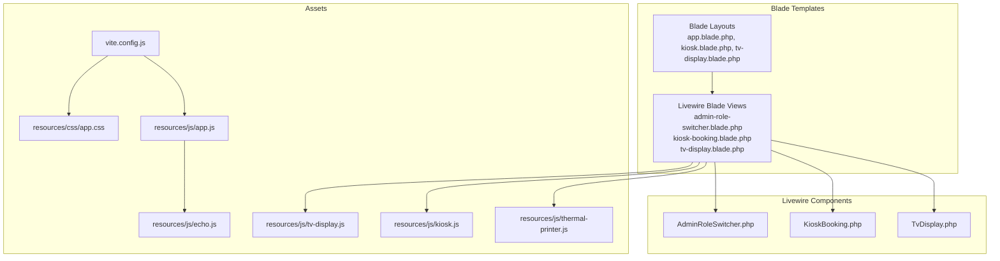
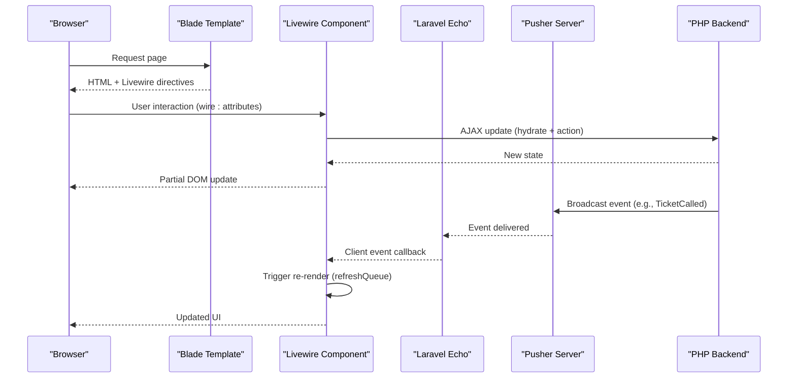
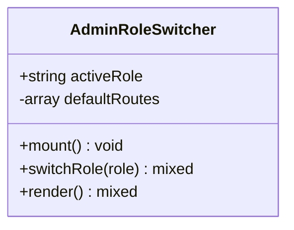
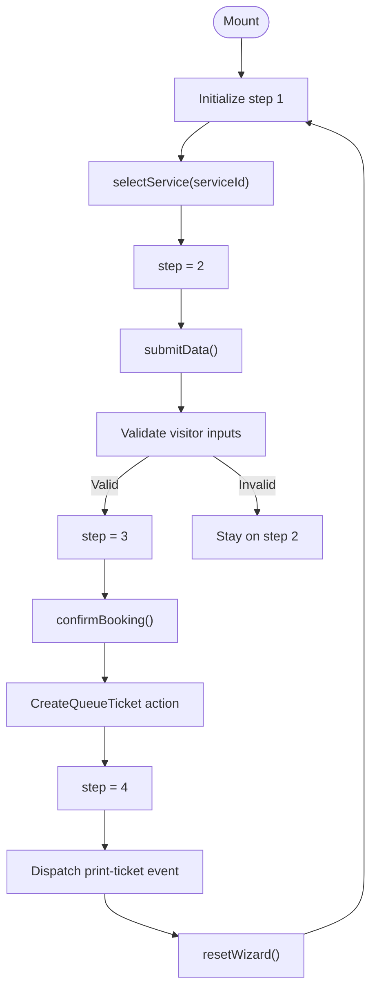
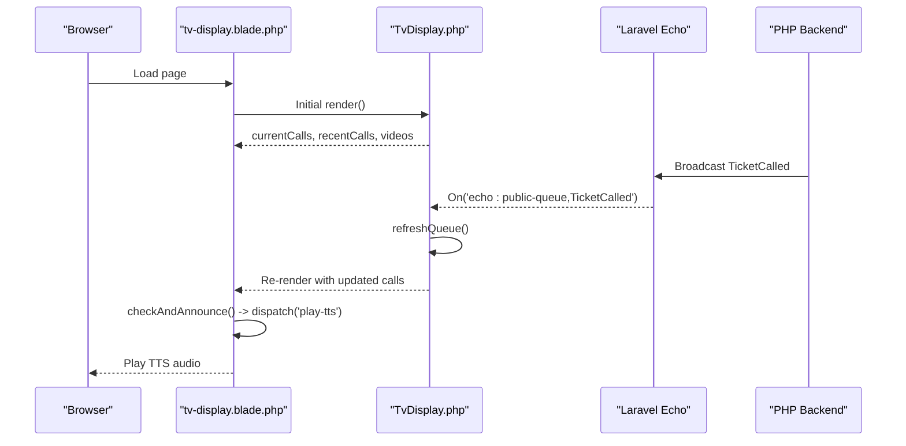
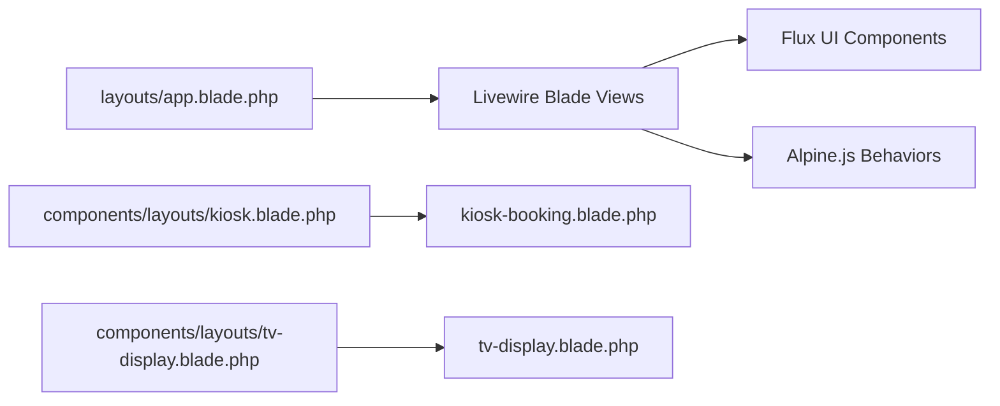
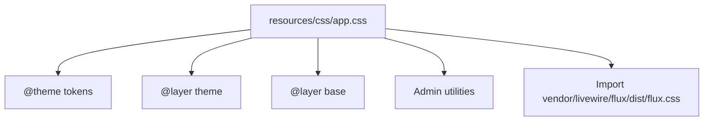
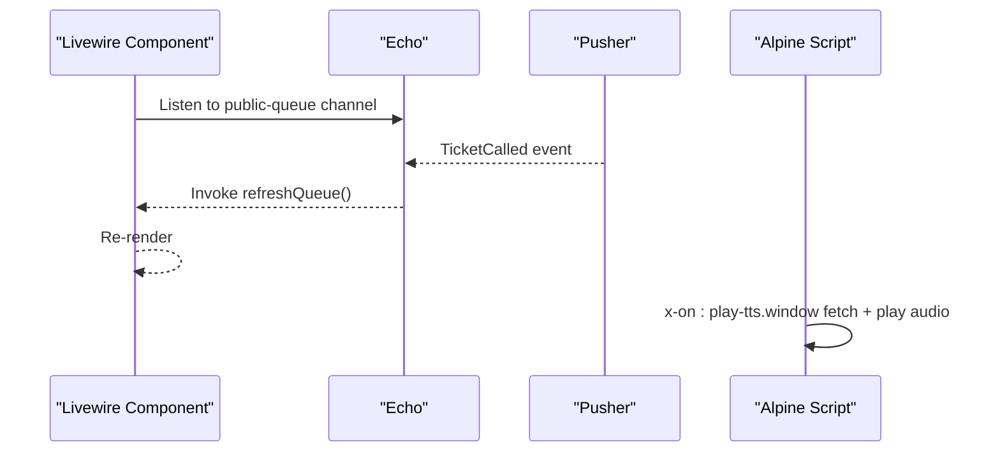
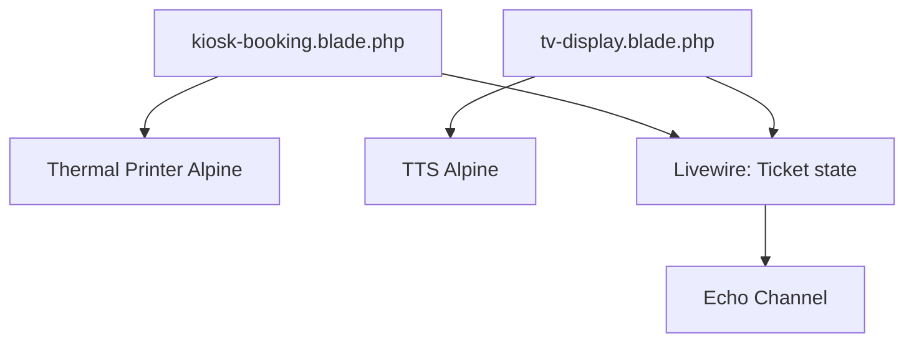
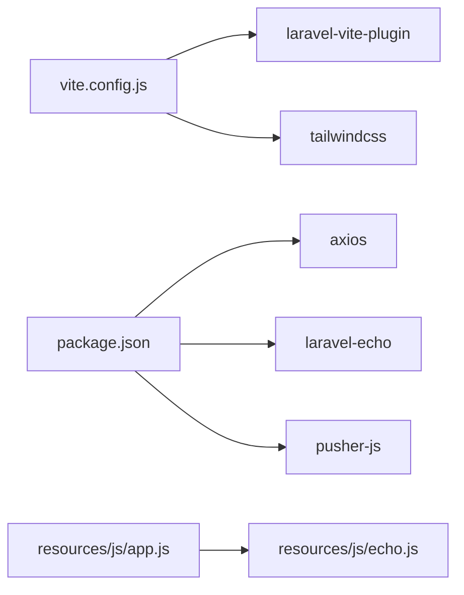

# Frontend Architecture

<cite>
**Referenced Files in This Document**
- [vite.config.js](file://vite.config.js)
- [package.json](file://package.json)
- [resources/js/app.js](file://resources/js/app.js)
- [resources/js/echo.js](file://resources/js/echo.js)
- [resources/js/tv-display.js](file://resources/js/tv-display.js)
- [resources/js/kiosk.js](file://resources/js/kiosk.js)
- [resources/js/thermal-printer.js](file://resources/js/thermal-printer.js)
- [resources/css/app.css](file://resources/css/app.css)
- [resources/views/layouts/app.blade.php](file://resources/views/layouts/app.blade.php)
- [resources/views/components/layouts/kiosk.blade.php](file://resources/views/components/layouts/kiosk.blade.php)
- [resources/views/components/layouts/tv-display.blade.php](file://resources/views/components/layouts/tv-display.blade.php)
- [app/Livewire/AdminRoleSwitcher.php](file://app/Livewire/AdminRoleSwitcher.php)
- [resources/views/livewire/admin-role-switcher.blade.php](file://resources/views/livewire/admin-role-switcher.blade.php)
- [app/Livewire/KioskBooking.php](file://app/Livewire/KioskBooking.php)
- [resources/views/livewire/kiosk-booking.blade.php](file://resources/views/livewire/kiosk-booking.blade.php)
- [app/Livewire/TvDisplay.php](file://app/Livewire/TvDisplay.php)
- [resources/views/livewire/tv-display.blade.php](file://resources/views/livewire/tv-display.blade.php)
</cite>

## Table of Contents
1. [Introduction](#introduction)
2. [Project Structure](#project-structure)
3. [Core Components](#core-components)
4. [Architecture Overview](#architecture-overview)
5. [Detailed Component Analysis](#detailed-component-analysis)
6. [Dependency Analysis](#dependency-analysis)
7. [Performance Considerations](#performance-considerations)
8. [Troubleshooting Guide](#troubleshooting-guide)
9. [Conclusion](#conclusion)

## Introduction
This document explains the frontend architecture of the PTSP system with a focus on Livewire 4.x reactive components, Blade template integration, Vite asset pipeline, Flux UI component library usage, real-time updates via WebSockets, and practical patterns for component composition and cross-component communication. It also covers state management, lifecycle hooks, event handling, and performance optimization strategies.

## Project Structure
The frontend stack combines:
- Blade templates for server-side rendering and layout composition
- Livewire components for reactive PHP-backed UI logic
- Tailwind CSS v4 with a custom design system and Flux UI styles
- Vite for asset bundling and HMR
- Laravel Echo and Pusher for real-time event broadcasting
- Alpine.js for lightweight client-side interactivity

**Diagram sources**
- [resources/views/layouts/app.blade.php:1-6](file://resources/views/layouts/app.blade.php#L1-L6)
- [resources/views/components/layouts/kiosk.blade.php](file://resources/views/components/layouts/kiosk.blade.php)
- [resources/views/components/layouts/tv-display.blade.php](file://resources/views/components/layouts/tv-display.blade.php)
- [vite.config.js:1-37](file://vite.config.js#L1-L37)
- [resources/css/app.css:1-140](file://resources/css/app.css#L1-L140)
- [resources/js/app.js:1-10](file://resources/js/app.js#L1-L10)
- [resources/js/echo.js](file://resources/js/echo.js)
- [resources/js/tv-display.js](file://resources/js/tv-display.js)
- [resources/js/kiosk.js](file://resources/js/kiosk.js)
- [resources/js/thermal-printer.js](file://resources/js/thermal-printer.js)
- [app/Livewire/AdminRoleSwitcher.php:1-52](file://app/Livewire/AdminRoleSwitcher.php#L1-L52)
- [app/Livewire/KioskBooking.php:1-288](file://app/Livewire/KioskBooking.php#L1-L288)
- [app/Livewire/TvDisplay.php:1-142](file://app/Livewire/TvDisplay.php#L1-L142)

**Section sources**
- [vite.config.js:1-37](file://vite.config.js#L1-L37)
- [resources/css/app.css:1-140](file://resources/css/app.css#L1-L140)
- [resources/js/app.js:1-10](file://resources/js/app.js#L1-L10)

## Core Components
- Livewire AdminRoleSwitcher: Role selection with server-side validation and redirect.
- Livewire KioskBooking: Multi-step booking wizard with computed properties, validation, and thermal printer integration.
- Livewire TvDisplay: Real-time queue monitoring with TTS announcements and video playback.
- Blade layouts: Shared layouts for app, kiosk, and TV display contexts.
- Asset pipeline: Vite-managed CSS/JS with Tailwind and Laravel Echo integration.

**Section sources**
- [app/Livewire/AdminRoleSwitcher.php:1-52](file://app/Livewire/AdminRoleSwitcher.php#L1-L52)
- [resources/views/livewire/admin-role-switcher.blade.php:1-8](file://resources/views/livewire/admin-role-switcher.blade.php#L1-L8)
- [app/Livewire/KioskBooking.php:1-288](file://app/Livewire/KioskBooking.php#L1-L288)
- [resources/views/livewire/kiosk-booking.blade.php:1-588](file://resources/views/livewire/kiosk-booking.blade.php#L1-L588)
- [app/Livewire/TvDisplay.php:1-142](file://app/Livewire/TvDisplay.php#L1-L142)
- [resources/views/livewire/tv-display.blade.php:1-213](file://resources/views/livewire/tv-display.blade.php#L1-L213)
- [resources/views/layouts/app.blade.php:1-6](file://resources/views/layouts/app.blade.php#L1-L6)

## Architecture Overview
The frontend architecture follows a hybrid server-rendered + reactive pattern:
- Blade renders initial HTML and injects Livewire directives.
- Livewire components encapsulate state and reactivity in PHP while emitting targeted DOM diffs.
- Alpine.js enhances UX with lightweight client behaviors (e.g., animations, media playback).
- Laravel Echo listens to Pusher channels for real-time events and triggers Livewire re-renders.

**Diagram sources**
- [resources/views/livewire/tv-display.blade.php:30-40](file://resources/views/livewire/tv-display.blade.php#L30-L40)
- [app/Livewire/TvDisplay.php:22-27](file://app/Livewire/TvDisplay.php#L22-L27)
- [resources/js/echo.js](file://resources/js/echo.js)
- [resources/js/app.js:9-10](file://resources/js/app.js#L9-L10)

## Detailed Component Analysis

### Livewire AdminRoleSwitcher
- Purpose: Role switching for administrators with default route redirection.
- Lifecycle: Uses mount to hydrate active role from session.
- State: Public property stores active role; internal mapping defines default routes.
- Validation: Ensures caller is admin and validates role enum.
- Rendering: Returns a Blade view bound to the component.

**Diagram sources**
- [app/Livewire/AdminRoleSwitcher.php:9-51](file://app/Livewire/AdminRoleSwitcher.php#L9-L51)

**Section sources**
- [app/Livewire/AdminRoleSwitcher.php:1-52](file://app/Livewire/AdminRoleSwitcher.php#L1-L52)
- [resources/views/livewire/admin-role-switcher.blade.php:1-8](file://resources/views/livewire/admin-role-switcher.blade.php#L1-L8)

### Livewire KioskBooking
- Purpose: Self-service kiosk booking with multi-step wizard and thermal printer integration.
- Lifecycle: Mount initializes step; subsequent steps managed via actions.
- State: Properties for visitor info, selected service, ticket, and barcode SVG.
- Computed properties: Services, selected service, and wilayah options with persistence hints.
- Validation: Inline validation rules and custom messages; dynamic wilayah existence rule.
- Actions: Step navigation, data submission, confirmation, reprint mode, and barcode generation.
- Rendering: Blade view orchestrates steps and integrates Alpine-driven thermal printer behavior.

**Diagram sources**
- [app/Livewire/KioskBooking.php:89-206](file://app/Livewire/KioskBooking.php#L89-L206)
- [resources/views/livewire/kiosk-booking.blade.php:1-588](file://resources/views/livewire/kiosk-booking.blade.php#L1-L588)

**Section sources**
- [app/Livewire/KioskBooking.php:1-288](file://app/Livewire/KioskBooking.php#L1-L288)
- [resources/views/livewire/kiosk-booking.blade.php:1-588](file://resources/views/livewire/kiosk-booking.blade.php#L1-L588)

### Livewire TvDisplay
- Purpose: Live TV display for queue announcements, recent calls, and background media.
- Lifecycle: Render fetches current and recent calls, checks for announcements, and prepares videos.
- Real-time: Listens to public channel events and triggers re-render.
- TTS: Formats ticket numbers for phonetic pronunciation and dispatches TTS playback.
- Media: Manages video playlist and fallback YouTube embed.

**Diagram sources**
- [app/Livewire/TvDisplay.php:22-39](file://app/Livewire/TvDisplay.php#L22-L39)
- [resources/views/livewire/tv-display.blade.php:30-40](file://resources/views/livewire/tv-display.blade.php#L30-L40)

**Section sources**
- [app/Livewire/TvDisplay.php:1-142](file://app/Livewire/TvDisplay.php#L1-L142)
- [resources/views/livewire/tv-display.blade.php:1-213](file://resources/views/livewire/tv-display.blade.php#L1-L213)

### Blade Template Integration with Livewire
- Layouts: Centralized layouts for app, kiosk, and TV display contexts.
- Components: Livewire blade views bind to PHP components and render Flux UI elements.
- Alpine.js: Used for client behaviors (e.g., thermal printer printing, media playback, audio unlocking).

**Diagram sources**
- [resources/views/layouts/app.blade.php:1-6](file://resources/views/layouts/app.blade.php#L1-L6)
- [resources/views/components/layouts/kiosk.blade.php](file://resources/views/components/layouts/kiosk.blade.php)
- [resources/views/components/layouts/tv-display.blade.php](file://resources/views/components/layouts/tv-display.blade.php)
- [resources/views/livewire/kiosk-booking.blade.php:1-11](file://resources/views/livewire/kiosk-booking.blade.php#L1-L11)
- [resources/views/livewire/tv-display.blade.php:1-40](file://resources/views/livewire/tv-display.blade.php#L1-L40)

**Section sources**
- [resources/views/layouts/app.blade.php:1-6](file://resources/views/layouts/app.blade.php#L1-L6)
- [resources/views/livewire/kiosk-booking.blade.php:1-588](file://resources/views/livewire/kiosk-booking.blade.php#L1-L588)
- [resources/views/livewire/tv-display.blade.php:1-213](file://resources/views/livewire/tv-display.blade.php#L1-L213)

### Flux UI Component Library Usage
- Styles: Flux CSS imported via Tailwind at-rule; custom variants and utilities layered for dark mode and admin visuals.
- Components: Blade templates use Flux UI primitives (select, input, button, card, icon, etc.) for consistent UI.
- Theming: Custom theme tokens and dark mode variants applied globally.

**Diagram sources**
- [resources/css/app.css:1-140](file://resources/css/app.css#L1-L140)

**Section sources**
- [resources/css/app.css:1-140](file://resources/css/app.css#L1-L140)
- [resources/views/livewire/kiosk-booking.blade.php:323-336](file://resources/views/livewire/kiosk-booking.blade.php#L323-L336)
- [resources/views/livewire/tv-display.blade.php:108-127](file://resources/views/livewire/tv-display.blade.php#L108-L127)

### Real-Time DOM Updates and WebSocket Integration
- Laravel Echo: Initializes Echo in the app entrypoint.
- Channels: Livewire listens to public queue events; Alpine handles TTS playback.
- Event handling: Component lifecycle hooks trigger re-renders; Alpine event listeners dispatch TTS requests.

**Diagram sources**
- [resources/js/echo.js](file://resources/js/echo.js)
- [resources/js/app.js:9-10](file://resources/js/app.js#L9-L10)
- [resources/views/livewire/tv-display.blade.php:30-40](file://resources/views/livewire/tv-display.blade.php#L30-L40)
- [app/Livewire/TvDisplay.php:22-27](file://app/Livewire/TvDisplay.php#L22-L27)

**Section sources**
- [resources/js/app.js:1-10](file://resources/js/app.js#L1-L10)
- [resources/views/livewire/tv-display.blade.php:30-40](file://resources/views/livewire/tv-display.blade.php#L30-L40)
- [app/Livewire/TvDisplay.php:22-27](file://app/Livewire/TvDisplay.php#L22-L27)

### Component Composition and Cross-Component Communication
- Parent-child composition: Blade layouts wrap Livewire views; Alpine scripts bridge client behaviors.
- Event-driven communication: Livewire emits Alpine events (e.g., print-ticket, play-tts) for decoupled interactions.
- Shared state: Session hydration for role switching; component-local state for wizards and UI flags.

**Diagram sources**
- [resources/views/livewire/kiosk-booking.blade.php:2-11](file://resources/views/livewire/kiosk-booking.blade.php#L2-L11)
- [resources/views/livewire/tv-display.blade.php:1-40](file://resources/views/livewire/tv-display.blade.php#L1-L40)
- [app/Livewire/KioskBooking.php:155-180](file://app/Livewire/KioskBooking.php#L155-L180)
- [app/Livewire/TvDisplay.php:41-68](file://app/Livewire/TvDisplay.php#L41-L68)

**Section sources**
- [resources/views/livewire/kiosk-booking.blade.php:2-11](file://resources/views/livewire/kiosk-booking.blade.php#L2-L11)
- [resources/views/livewire/tv-display.blade.php:1-40](file://resources/views/livewire/tv-display.blade.php#L1-L40)
- [app/Livewire/KioskBooking.php:155-180](file://app/Livewire/KioskBooking.php#L155-L180)
- [app/Livewire/TvDisplay.php:41-68](file://app/Livewire/TvDisplay.php#L41-L68)

## Dependency Analysis
- Build toolchain: Vite configured with Laravel plugin and Tailwind CSS integration.
- Runtime dependencies: Axios, Laravel Echo, Pusher JS.
- Asset entrypoints: Separate bundles for app, TV display, kiosk, and thermal printer.

**Diagram sources**
- [vite.config.js:1-37](file://vite.config.js#L1-L37)
- [package.json:1-28](file://package.json#L1-L28)
- [resources/js/app.js:9-10](file://resources/js/app.js#L9-L10)

**Section sources**
- [vite.config.js:1-37](file://vite.config.js#L1-L37)
- [package.json:1-28](file://package.json#L1-L28)
- [resources/js/app.js:1-10](file://resources/js/app.js#L1-L10)

## Performance Considerations
- Lazy loading and progressive enhancement:
  - Alpine behaviors initialize only when needed (e.g., video player initialization).
  - TTS audio unlock overlay prevents autoplay restrictions until user gesture.
- Asset optimization:
  - Vite build with emptyOutDir disabled to reuse compiled assets during development.
  - Tailwind source scanning configured to include Livewire and Flux stubs for efficient purging.
- Livewire state:
  - Computed properties with persistence hints reduce redundant queries.
  - Minimal re-rendering via targeted actions and event-driven refresh.
- Media:
  - Video playlist caching and fallback to YouTube embed for resilience.

[No sources needed since this section provides general guidance]

## Troubleshooting Guide
- Real-time not working:
  - Verify Echo initialization and Pusher credentials.
  - Ensure Livewire #[On] handler is present and channel matches broadcast.
- Thermal printer not responding:
  - Confirm Alpine script is loaded and event dispatches match listener.
  - Check printer service configuration and network reachability.
- TV display media issues:
  - Validate video file extensions and public disk paths.
  - Confirm browser audio context unlock behavior and fallback embed.

**Section sources**
- [resources/js/echo.js](file://resources/js/echo.js)
- [resources/views/livewire/kiosk-booking.blade.php:2-11](file://resources/views/livewire/kiosk-booking.blade.php#L2-L11)
- [resources/views/livewire/tv-display.blade.php:180-196](file://resources/views/livewire/tv-display.blade.php#L180-L196)

## Conclusion
The PTSP frontend leverages Livewire 4.x for reactive, PHP-backed components, Blade for structured layouts, and Alpine.js for lightweight client behaviors. The Vite pipeline integrates Tailwind CSS and Laravel Echo for a modern, real-time experience. Flux UI components provide a consistent design system, while event-driven communication ensures clean separation of concerns between presentation and business logic.