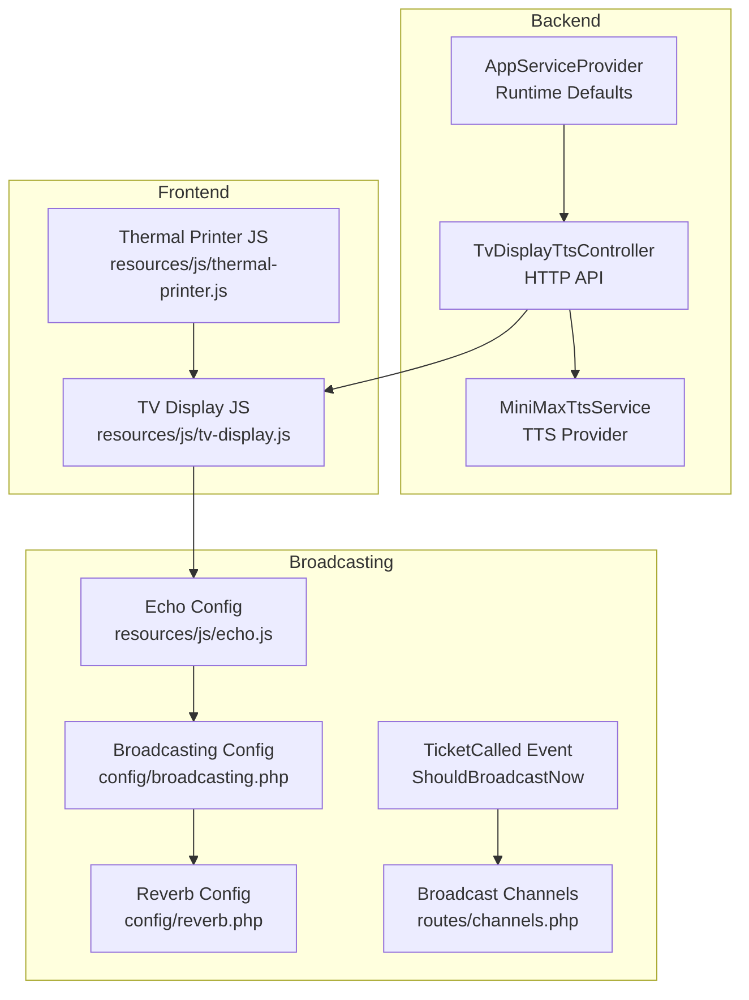
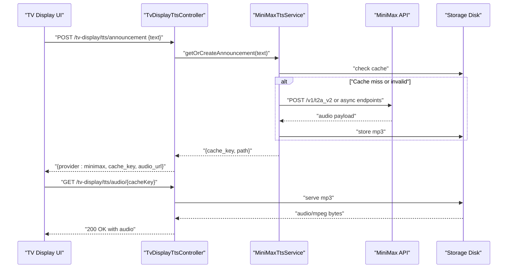
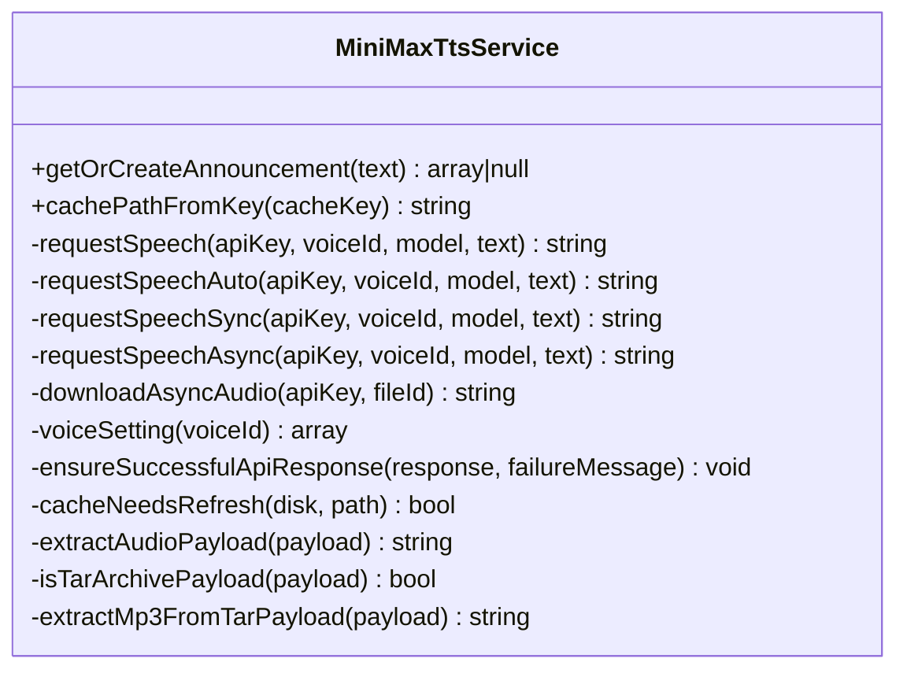
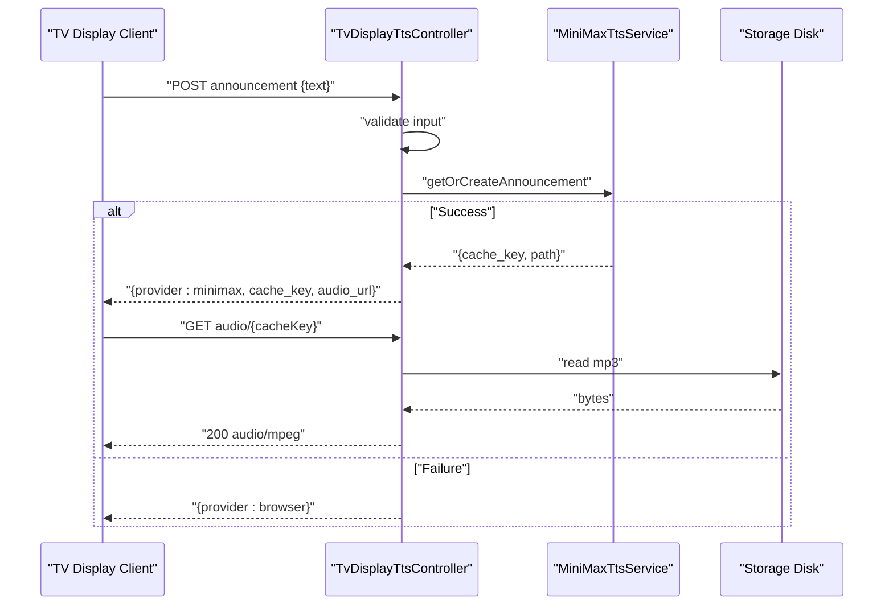
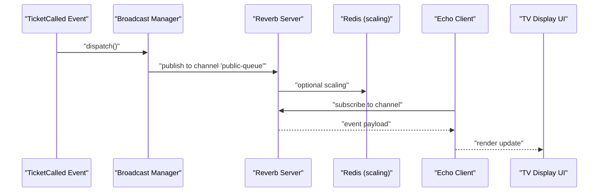
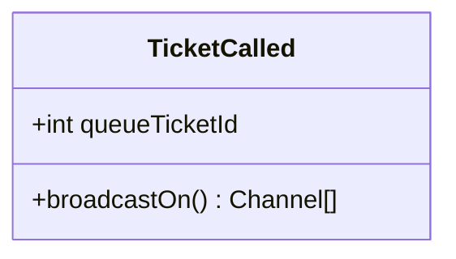
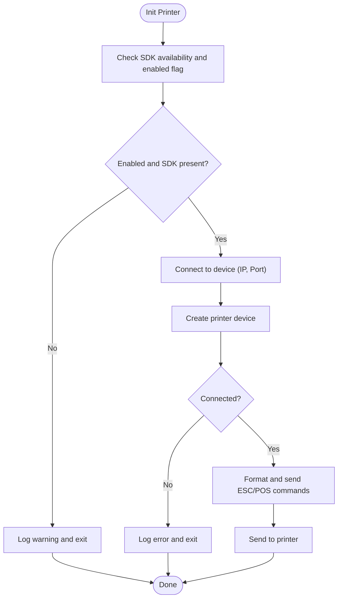
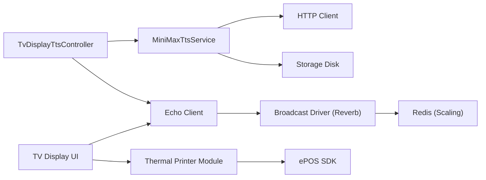

# Integration Architecture

<cite>
**Referenced Files in This Document**
- [MiniMaxTtsService.php](file://app/Services/Tts/MiniMaxTtsService.php)
- [TvDisplayTtsController.php](file://app/Http/Controllers/TvDisplayTtsController.php)
- [reverb.php](file://config/reverb.php)
- [broadcasting.php](file://config/broadcasting.php)
- [channels.php](file://routes/channels.php)
- [echo.js](file://resources/js/echo.js)
- [TicketCalled.php](file://app/Events/TicketCalled.php)
- [thermal-printer.js](file://resources/js/thermal-printer.js)
- [AppServiceProvider.php](file://app/Providers/AppServiceProvider.php)
</cite>

## Table of Contents
1. [Introduction](#introduction)
2. [Project Structure](#project-structure)
3. [Core Components](#core-components)
4. [Architecture Overview](#architecture-overview)
5. [Detailed Component Analysis](#detailed-component-analysis)
6. [Dependency Analysis](#dependency-analysis)
7. [Performance Considerations](#performance-considerations)
8. [Security Considerations](#security-considerations)
9. [Troubleshooting Guide](#troubleshooting-guide)
10. [Conclusion](#conclusion)

## Introduction
This document describes the integration architecture for external service connectivity in the PTSP queue management system. It covers:
- TTS service integration with the MiniMax API, including authentication, request/response handling, and audio caching strategies
- WebSocket broadcasting architecture using Laravel Reverb for real-time updates across TV displays and other interfaces
- Event-driven architecture with event listeners and observers for decoupled system components
- Thermal printer integration patterns for ticket printing via ESC/POS commands
- Service abstraction patterns, dependency injection for external services, and configuration management across environments
- Security considerations for external API calls, rate limiting strategies, and fallback mechanisms for service failures

## Project Structure
The integration architecture spans backend services, HTTP controllers, configuration, frontend JavaScript, and broadcasting channels. The following diagram shows the primary integration touchpoints.

**Diagram sources**
- [MiniMaxTtsService.php:1-312](file://app/Services/Tts/MiniMaxTtsService.php#L1-L312)
- [TvDisplayTtsController.php:1-62](file://app/Http/Controllers/TvDisplayTtsController.php#L1-L62)
- [echo.js:1-15](file://resources/js/echo.js#L1-L15)
- [broadcasting.php:1-83](file://config/broadcasting.php#L1-L83)
- [reverb.php:1-103](file://config/reverb.php#L1-L103)
- [channels.php:1-8](file://routes/channels.php#L1-L8)
- [TicketCalled.php:1-34](file://app/Events/TicketCalled.php#L1-L34)
- [thermal-printer.js:1-139](file://resources/js/thermal-printer.js#L1-L139)
- [AppServiceProvider.php:1-67](file://app/Providers/AppServiceProvider.php#L1-L67)

**Section sources**
- [MiniMaxTtsService.php:1-312](file://app/Services/Tts/MiniMaxTtsService.php#L1-L312)
- [TvDisplayTtsController.php:1-62](file://app/Http/Controllers/TvDisplayTtsController.php#L1-L62)
- [reverb.php:1-103](file://config/reverb.php#L1-L103)
- [broadcasting.php:1-83](file://config/broadcasting.php#L1-L83)
- [channels.php:1-8](file://routes/channels.php#L1-L8)
- [echo.js:1-15](file://resources/js/echo.js#L1-L15)
- [TicketCalled.php:1-34](file://app/Events/TicketCalled.php#L1-L34)
- [thermal-printer.js:1-139](file://resources/js/thermal-printer.js#L1-L139)
- [AppServiceProvider.php:1-67](file://app/Providers/AppServiceProvider.php#L1-L67)

## Core Components
- TTS service abstraction with MiniMax provider
- HTTP controller for TV display announcements
- Broadcasting stack with Reverb and Echo
- Event model for real-time updates
- Thermal printer module for ESC/POS printing
- Configuration management for environments

**Section sources**
- [MiniMaxTtsService.php:1-312](file://app/Services/Tts/MiniMaxTtsService.php#L1-L312)
- [TvDisplayTtsController.php:1-62](file://app/Http/Controllers/TvDisplayTtsController.php#L1-L62)
- [TicketCalled.php:1-34](file://app/Events/TicketCalled.php#L1-L34)
- [thermal-printer.js:1-139](file://resources/js/thermal-printer.js#L1-L139)
- [reverb.php:1-103](file://config/reverb.php#L1-L103)
- [broadcasting.php:1-83](file://config/broadcasting.php#L1-L83)
- [echo.js:1-15](file://resources/js/echo.js#L1-L15)

## Architecture Overview
The system integrates external services through a layered approach:
- Service layer encapsulates external API calls and caching
- HTTP controllers expose endpoints for UI and TV display consumption
- Broadcasting layer pushes real-time updates to connected clients
- Frontend modules consume APIs and handle printing and live updates

**Diagram sources**
- [TvDisplayTtsController.php:14-60](file://app/Http/Controllers/TvDisplayTtsController.php#L14-L60)
- [MiniMaxTtsService.php:16-44](file://app/Services/Tts/MiniMaxTtsService.php#L16-L44)
- [MiniMaxTtsService.php:53-180](file://app/Services/Tts/MiniMaxTtsService.php#L53-L180)
- [MiniMaxTtsService.php:246-310](file://app/Services/Tts/MiniMaxTtsService.php#L246-L310)

## Detailed Component Analysis

### TTS Service Integration with MiniMax API
The TTS service encapsulates authentication, request/response handling, and caching:
- Authentication: Uses bearer token from configuration
- Request strategies: Supports synchronous, asynchronous, and automatic fallback
- Response handling: Validates API responses and extracts binary audio
- Caching: Stores MP3 files keyed by normalized text and voice/model settings
- Fallbacks: Async-to-sync fallback and tar archive extraction for MP3 payloads

**Diagram sources**
- [MiniMaxTtsService.php:11-312](file://app/Services/Tts/MiniMaxTtsService.php#L11-L312)

**Section sources**
- [MiniMaxTtsService.php:16-44](file://app/Services/Tts/MiniMaxTtsService.php#L16-L44)
- [MiniMaxTtsService.php:53-180](file://app/Services/Tts/MiniMaxTtsService.php#L53-L180)
- [MiniMaxTtsService.php:232-244](file://app/Services/Tts/MiniMaxTtsService.php#L232-L244)
- [MiniMaxTtsService.php:246-310](file://app/Services/Tts/MiniMaxTtsService.php#L246-L310)

### TV Display TTS Endpoint
The controller validates input, delegates to the TTS service, and serves cached audio:
- Validation: Ensures text is present, non-empty, and within length limits
- Fallback: Returns browser-based provider when TTS generation fails
- Audio serving: Serves cached MP3 with appropriate headers and immutable caching

**Diagram sources**
- [TvDisplayTtsController.php:14-60](file://app/Http/Controllers/TvDisplayTtsController.php#L14-L60)
- [MiniMaxTtsService.php:16-44](file://app/Services/Tts/MiniMaxTtsService.php#L16-L44)

**Section sources**
- [TvDisplayTtsController.php:14-60](file://app/Http/Controllers/TvDisplayTtsController.php#L14-L60)

### WebSocket Broadcasting with Laravel Reverb
Real-time updates are broadcast using Reverb:
- Broadcasting configuration defines driver and connection options
- Application-level configuration sets app credentials, TLS, and rate limiting
- Channel definition restricts access to authenticated users
- Frontend Echo client connects to Reverb with environment variables

**Diagram sources**
- [TicketCalled.php:11-33](file://app/Events/TicketCalled.php#L11-L33)
- [broadcasting.php:33-47](file://config/broadcasting.php#L33-L47)
- [reverb.php:29-57](file://config/reverb.php#L29-L57)
- [channels.php:5-7](file://routes/channels.php#L5-L7)
- [echo.js:6-14](file://resources/js/echo.js#L6-L14)

**Section sources**
- [broadcasting.php:1-83](file://config/broadcasting.php#L1-L83)
- [reverb.php:1-103](file://config/reverb.php#L1-L103)
- [channels.php:1-8](file://routes/channels.php#L1-L8)
- [echo.js:1-15](file://resources/js/echo.js#L1-L15)
- [TicketCalled.php:1-34](file://app/Events/TicketCalled.php#L1-L34)

### Event-Driven Architecture
The event model implements immediate broadcasting:
- Implements the interface for immediate delivery
- Broadcasts to a public channel for all authorized clients
- Decouples producers (business actions) from consumers (UI updates)

**Diagram sources**
- [TicketCalled.php:11-33](file://app/Events/TicketCalled.php#L11-L33)

**Section sources**
- [TicketCalled.php:1-34](file://app/Events/TicketCalled.php#L1-L34)

### Thermal Printer Integration Patterns
The thermal printer module uses the Epson ePOS SDK to print tickets:
- Initialization: Connects to device via IP/port and creates a printer device
- Printing: Formats ticket content using ESC/POS commands (alignment, sizes, barcode, cut)
- Lifecycle: Connect/disconnect with error handling and warnings
- Frontend integration: Provides a reusable module for UI components

**Diagram sources**
- [thermal-printer.js:5-139](file://resources/js/thermal-printer.js#L5-L139)

**Section sources**
- [thermal-printer.js:1-139](file://resources/js/thermal-printer.js#L1-L139)

### Service Abstraction and Dependency Injection
- TTS service is injected into controllers via constructor injection, enabling testability and environment-specific configuration
- Configuration is centralized in the service provider and environment variables, ensuring consistent runtime defaults

**Section sources**
- [TvDisplayTtsController.php:5-10](file://app/Http/Controllers/TvDisplayTtsController.php#L5-L10)
- [AppServiceProvider.php:27-36](file://app/Providers/AppServiceProvider.php#L27-L36)

### Configuration Management Across Environments
- Broadcasting and Reverb configurations rely on environment variables for host, port, scheme, TLS, and rate limiting
- TTS service reads provider-specific settings from configuration (API keys, voice/model, caching disk/prefix, polling intervals)
- Production enforcement of HTTPS ensures secure transport for cloud deployments

**Section sources**
- [broadcasting.php:33-47](file://config/broadcasting.php#L33-L47)
- [reverb.php:32-54](file://config/reverb.php#L32-L54)
- [MiniMaxTtsService.php:23-31](file://app/Services/Tts/MiniMaxTtsService.php#L23-L31)
- [AppServiceProvider.php:32-35](file://app/Providers/AppServiceProvider.php#L32-L35)

## Dependency Analysis
External dependencies and integrations:
- HTTP client for API calls to MiniMax
- Storage disk for caching MP3 audio
- Broadcasting driver (Reverb) with optional Redis scaling
- Frontend Echo client for WebSocket connections
- Epson ePOS SDK for thermal printer communication

**Diagram sources**
- [TvDisplayTtsController.php:14-60](file://app/Http/Controllers/TvDisplayTtsController.php#L14-L60)
- [MiniMaxTtsService.php:53-180](file://app/Services/Tts/MiniMaxTtsService.php#L53-L180)
- [broadcasting.php:33-47](file://config/broadcasting.php#L33-L47)
- [reverb.php:40-54](file://config/reverb.php#L40-L54)
- [echo.js:6-14](file://resources/js/echo.js#L6-L14)
- [thermal-printer.js:24-46](file://resources/js/thermal-printer.js#L24-L46)

**Section sources**
- [TvDisplayTtsController.php:1-62](file://app/Http/Controllers/TvDisplayTtsController.php#L1-L62)
- [MiniMaxTtsService.php:1-312](file://app/Services/Tts/MiniMaxTtsService.php#L1-L312)
- [broadcasting.php:1-83](file://config/broadcasting.php#L1-L83)
- [reverb.php:1-103](file://config/reverb.php#L1-L103)
- [echo.js:1-15](file://resources/js/echo.js#L1-L15)
- [thermal-printer.js:1-139](file://resources/js/thermal-printer.js#L1-L139)

## Performance Considerations
- Caching: MP3 files are cached on disk with immutable headers to reduce repeated API calls
- Polling: Asynchronous requests poll for completion with configurable attempts and intervals
- Compression: Audio is delivered as MP3 with optimized bitrate and sample rate
- Broadcasting: Reverb scaling via Redis supports horizontal growth under load

[No sources needed since this section provides general guidance]

## Security Considerations
- Transport security: HTTPS enforced in production; Reverb TLS options configured
- API authentication: Bearer tokens used for MiniMax API calls
- Rate limiting: Reverb application-level rate limiting can be enabled with decay windows and thresholds
- Input validation: TV TTS endpoint validates text length and presence
- Access control: Broadcast channels restrict access to authenticated users

**Section sources**
- [AppServiceProvider.php:32-35](file://app/Providers/AppServiceProvider.php#L32-L35)
- [broadcasting.php:38-43](file://config/broadcasting.php#L38-L43)
- [reverb.php:91-96](file://config/reverb.php#L91-L96)
- [TvDisplayTtsController.php:16-18](file://app/Http/Controllers/TvDisplayTtsController.php#L16-L18)

## Troubleshooting Guide
Common issues and recovery strategies:
- TTS generation failures: Automatic async-to-sync fallback; returns browser-based provider when both fail
- Empty or invalid audio: Payload validation and tar extraction for archive responses
- Cache refresh: Detects empty or tar payloads and regenerates audio
- Broadcasting errors: Verify Reverb app credentials, host/port/scheme, and channel authorization
- Thermal printer connection: Check SDK availability, device IP/port, and device creation status

**Section sources**
- [MiniMaxTtsService.php:64-79](file://app/Services/Tts/MiniMaxTtsService.php#L64-L79)
- [MiniMaxTtsService.php:257-310](file://app/Services/Tts/MiniMaxTtsService.php#L257-L310)
- [TvDisplayTtsController.php:20-26](file://app/Http/Controllers/TvDisplayTtsController.php#L20-L26)
- [channels.php:5-7](file://routes/channels.php#L5-L7)
- [thermal-printer.js:24-46](file://resources/js/thermal-printer.js#L24-L46)

## Conclusion
The integration architecture combines a robust TTS service with caching, a reliable broadcasting pipeline using Reverb, and a pragmatic thermal printer module. Service abstraction and dependency injection enable clean separation of concerns, while configuration management supports diverse deployment scenarios. Security and resilience are addressed through TLS enforcement, rate limiting, and fallback mechanisms.