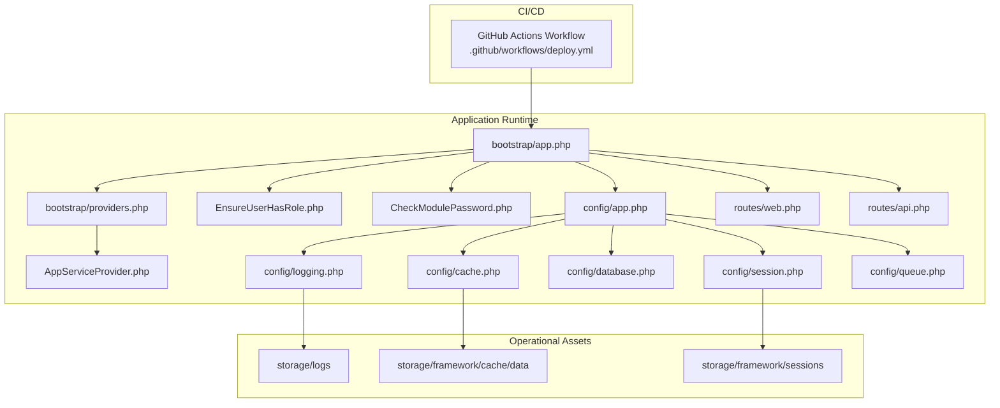
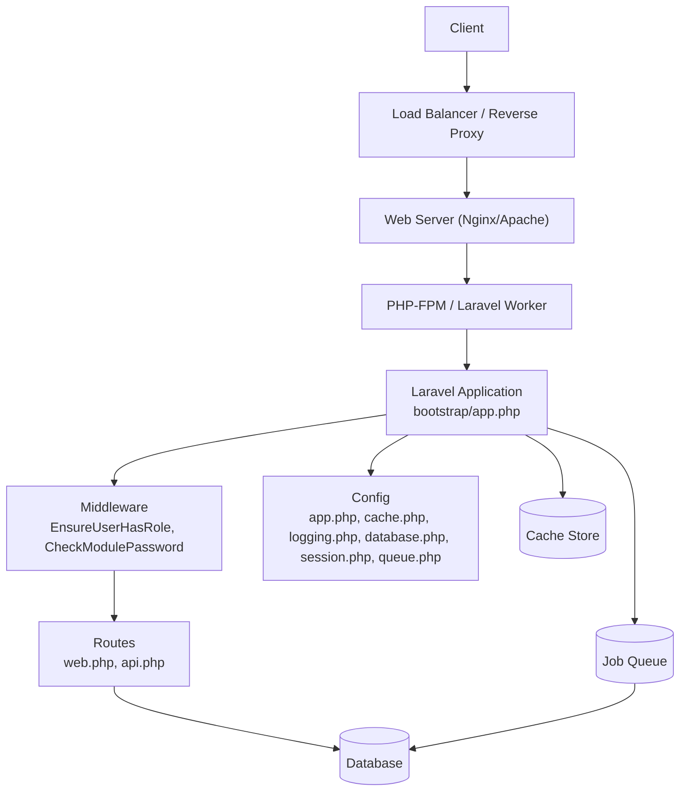
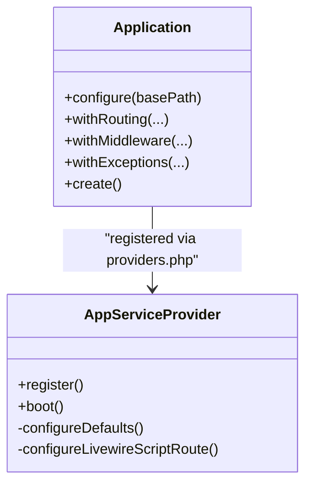
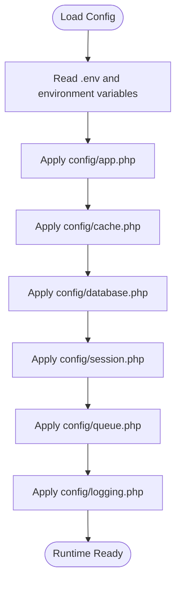
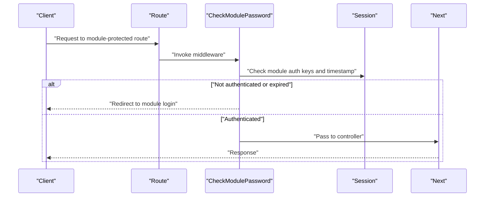
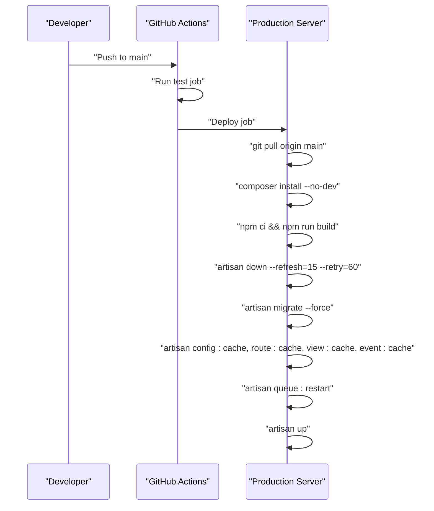
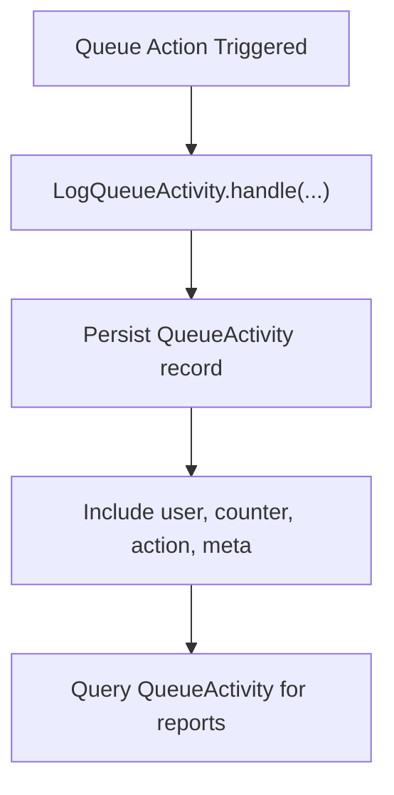
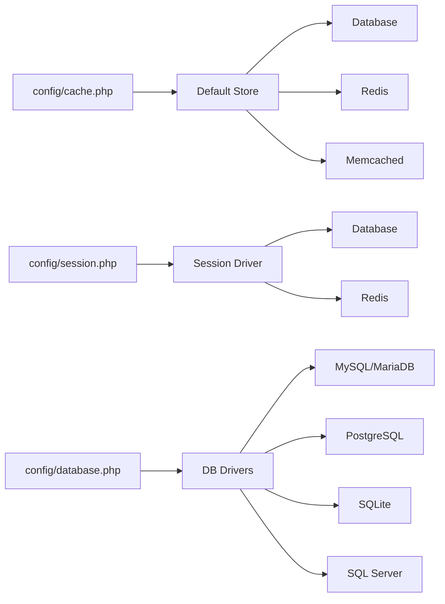
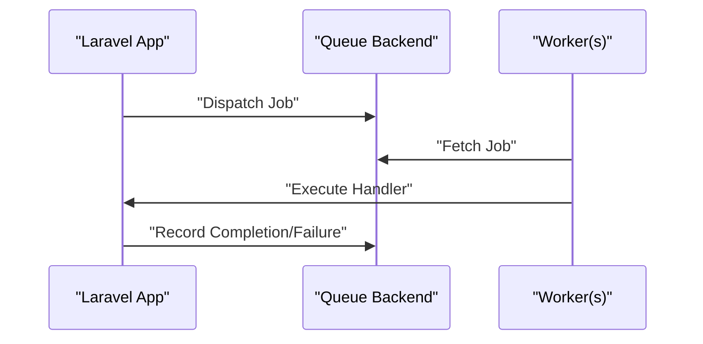
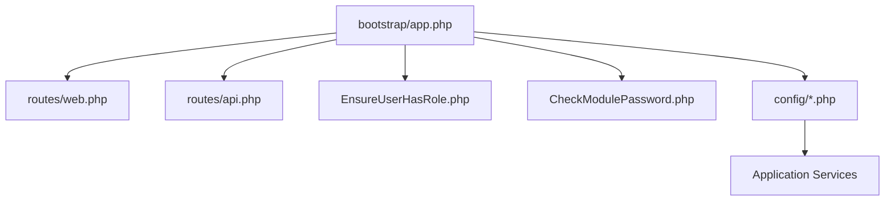

# Operational Architecture

<cite>
**Referenced Files in This Document**
- [deploy.yml](file://.github/workflows/deploy.yml)
- [app.php](file://bootstrap/app.php)
- [providers.php](file://bootstrap/providers.php)
- [AppServiceProvider.php](file://app/Providers/AppServiceProvider.php)
- [CheckModulePassword.php](file://app/Http/Middleware/CheckModulePassword.php)
- [EnsureUserHasRole.php](file://app/Http/Middleware/EnsureUserHasRole.php)
- [app.php](file://config/app.php)
- [cache.php](file://config/cache.php)
- [logging.php](file://config/logging.php)
- [database.php](file://config/database.php)
- [session.php](file://config/session.php)
- [queue.php](file://config/queue.php)
- [composer.json](file://composer.json)
- [web.php](file://routes/web.php)
- [api.php](file://routes/api.php)
- [LogQueueActivity.php](file://app/Actions/Queue/LogQueueActivity.php)
- [QueueActivity.php](file://app/Models/QueueActivity.php)
</cite>

## Table of Contents
1. [Introduction](#introduction)
2. [Project Structure](#project-structure)
3. [Core Components](#core-components)
4. [Architecture Overview](#architecture-overview)
5. [Detailed Component Analysis](#detailed-component-analysis)
6. [Dependency Analysis](#dependency-analysis)
7. [Performance Considerations](#performance-considerations)
8. [Monitoring and Alerting](#monitoring-and-alerting)
9. [Disaster Recovery and Scaling](#disaster-recovery-and-scaling)
10. [Troubleshooting Guide](#troubleshooting-guide)
11. [Conclusion](#conclusion)

## Introduction
This document describes the operational architecture of the PTSP queue management system built on Laravel. It covers application bootstrapping, environment configuration, service container initialization, deployment pipeline with GitHub Actions, logging and audit strategies, caching and session management, database connection pooling, monitoring and alerting, and disaster recovery and scaling considerations. The goal is to provide a practical guide for deployment, operations, and maintenance teams to reliably run and evolve the system.

## Project Structure
The application follows Laravel’s standard structure with a focus on modular features (queues, counters, services, reports) and distinct entry points for web and API traffic. The deployment pipeline is defined in a GitHub Actions workflow that automates testing and production deployments.

**Diagram sources**
- [deploy.yml:1-79](file://.github/workflows/deploy.yml#L1-L79)
- [app.php:1-32](file://bootstrap/app.php#L1-L32)
- [providers.php:1-10](file://bootstrap/providers.php#L1-L10)
- [AppServiceProvider.php:1-67](file://app/Providers/AppServiceProvider.php#L1-L67)
- [EnsureUserHasRole.php:1-37](file://app/Http/Middleware/EnsureUserHasRole.php#L1-L37)
- [CheckModulePassword.php:1-68](file://app/Http/Middleware/CheckModulePassword.php#L1-L68)
- [app.php:1-127](file://config/app.php#L1-L127)
- [cache.php:1-118](file://config/cache.php#L1-L118)
- [logging.php:1-133](file://config/logging.php#L1-L133)
- [database.php:1-185](file://config/database.php#L1-L185)
- [session.php:1-218](file://config/session.php#L1-L218)
- [queue.php:1-130](file://config/queue.php#L1-L130)
- [web.php:1-127](file://routes/web.php#L1-L127)
- [api.php:1-23](file://routes/api.php#L1-L23)

**Section sources**
- [deploy.yml:1-79](file://.github/workflows/deploy.yml#L1-L79)
- [app.php:1-32](file://bootstrap/app.php#L1-L32)
- [providers.php:1-10](file://bootstrap/providers.php#L1-L10)
- [app.php:1-127](file://config/app.php#L1-L127)
- [cache.php:1-118](file://config/cache.php#L1-L118)
- [logging.php:1-133](file://config/logging.php#L1-L133)
- [database.php:1-185](file://config/database.php#L1-L185)
- [session.php:1-218](file://config/session.php#L1-L218)
- [queue.php:1-130](file://config/queue.php#L1-L130)
- [web.php:1-127](file://routes/web.php#L1-L127)
- [api.php:1-23](file://routes/api.php#L1-L23)

## Core Components
- Application bootstrapping: The runtime is configured via bootstrap/app.php, which registers routing, middleware, and health endpoint configuration.
- Service container: Providers are registered in bootstrap/providers.php and initialized by AppServiceProvider.php, including production defaults and Livewire script routing.
- Environment configuration: All environment-dependent settings are centralized in config/*.php files, enabling flexible deployment across environments.
- Deployment pipeline: GitHub Actions workflow orchestrates testing and production deployment with maintenance mode, caching, and queue restarts.
- Logging and audit: Structured logging is configured in config/logging.php; queue activity auditing is implemented via LogQueueActivity and QueueActivity model.
- Caching and sessions: config/cache.php and config/session.php define stores and lifetimes; Redis and database stores are supported.
- Queues: config/queue.php configures job backends and failed job handling; deployment includes queue restarts.

**Section sources**
- [app.php:1-32](file://bootstrap/app.php#L1-L32)
- [providers.php:1-10](file://bootstrap/providers.php#L1-L10)
- [AppServiceProvider.php:1-67](file://app/Providers/AppServiceProvider.php#L1-L67)
- [app.php:1-127](file://config/app.php#L1-L127)
- [cache.php:1-118](file://config/cache.php#L1-L118)
- [logging.php:1-133](file://config/logging.php#L1-L133)
- [session.php:1-218](file://config/session.php#L1-L218)
- [queue.php:1-130](file://config/queue.php#L1-L130)
- [deploy.yml:1-79](file://.github/workflows/deploy.yml#L1-L79)
- [LogQueueActivity.php:1-29](file://app/Actions/Queue/LogQueueActivity.php#L1-L29)
- [QueueActivity.php:1-44](file://app/Models/QueueActivity.php#L1-L44)

## Architecture Overview
The system is a Laravel application with:
- Web and API routes under explicit middleware groups for role-based access and throttling.
- Separate module authentication for kiosk and TV display using module-specific session checks.
- Health endpoint exposed at /up for readiness probes.
- CI/CD pipeline that pulls code, installs dependencies, builds assets, runs tests, migrates, caches configuration, and restarts queues.

**Diagram sources**
- [app.php:1-32](file://bootstrap/app.php#L1-L32)
- [web.php:1-127](file://routes/web.php#L1-L127)
- [api.php:1-23](file://routes/api.php#L1-L23)
- [app.php:1-127](file://config/app.php#L1-L127)
- [cache.php:1-118](file://config/cache.php#L1-L118)
- [logging.php:1-133](file://config/logging.php#L1-L133)
- [database.php:1-185](file://config/database.php#L1-L185)
- [session.php:1-218](file://config/session.php#L1-L218)
- [queue.php:1-130](file://config/queue.php#L1-L130)

## Detailed Component Analysis

### Laravel Bootstrapping and Service Container Initialization
- Boot configuration sets routing (web, API, console, channels), health endpoint, middleware stack, and exception handling.
- Provider registration initializes AppServiceProvider and FortifyServiceProvider.
- AppServiceProvider enforces production defaults (immutable dates, destructive command prohibition, stronger password policy) and HTTPS enforcement in production. It also configures Livewire script route.

**Diagram sources**
- [app.php:9-31](file://bootstrap/app.php#L9-L31)
- [providers.php:6-9](file://bootstrap/providers.php#L6-L9)
- [AppServiceProvider.php:14-66](file://app/Providers/AppServiceProvider.php#L14-L66)

**Section sources**
- [app.php:1-32](file://bootstrap/app.php#L1-L32)
- [providers.php:1-10](file://bootstrap/providers.php#L1-L10)
- [AppServiceProvider.php:1-67](file://app/Providers/AppServiceProvider.php#L1-L67)

### Environment Configuration Management
- Centralized in config/*.php with environment variable overrides for all subsystems (app, cache, logging, database, session, queue).
- Examples include cache store selection, Redis and database connection settings, session lifetime and cookie attributes, queue retry policies, and logging channels and levels.

**Diagram sources**
- [app.php:1-127](file://config/app.php#L1-L127)
- [cache.php:1-118](file://config/cache.php#L1-L118)
- [database.php:1-185](file://config/database.php#L1-L185)
- [session.php:1-218](file://config/session.php#L1-L218)
- [queue.php:1-130](file://config/queue.php#L1-L130)
- [logging.php:1-133](file://config/logging.php#L1-L133)

**Section sources**
- [app.php:1-127](file://config/app.php#L1-L127)
- [cache.php:1-118](file://config/cache.php#L1-L118)
- [database.php:1-185](file://config/database.php#L1-L185)
- [session.php:1-218](file://config/session.php#L1-L218)
- [queue.php:1-130](file://config/queue.php#L1-L130)
- [logging.php:1-133](file://config/logging.php#L1-L133)

### Middleware and Access Control
- EnsureUserHasRole middleware enforces role-based access for authenticated users.
- CheckModulePassword middleware manages module-specific sessions for kiosk and TV display, including authentication state and lifetime checks.

**Diagram sources**
- [CheckModulePassword.php:17-33](file://app/Http/Middleware/CheckModulePassword.php#L17-L33)
- [web.php:96-124](file://routes/web.php#L96-L124)

**Section sources**
- [EnsureUserHasRole.php:1-37](file://app/Http/Middleware/EnsureUserHasRole.php#L1-L37)
- [CheckModulePassword.php:1-68](file://app/Http/Middleware/CheckModulePassword.php#L1-L68)
- [web.php:1-127](file://routes/web.php#L1-L127)

### Deployment Pipeline with GitHub Actions
- Triggers on pushes to main branch.
- Test job: checks out code, copies production .env, installs Composer and Node dependencies, builds assets, runs code style checks, and executes tests.
- Deploy job: pulls latest code, installs production dependencies, builds assets, enables maintenance mode, runs migrations, caches configuration, restarts queue workers, disables maintenance mode.

**Diagram sources**
- [deploy.yml:1-79](file://.github/workflows/deploy.yml#L1-L79)

**Section sources**
- [deploy.yml:1-79](file://.github/workflows/deploy.yml#L1-L79)

### Logging Strategies and Audit Trail
- Logging channels include stack, single, daily, slack, syslog, stderr, papertrail, and emergency. Levels and processors are configurable.
- Audit trail for queue activities is implemented by creating QueueActivity records with action and metadata, enabling detailed tracking of ticket lifecycle events.

**Diagram sources**
- [LogQueueActivity.php:13-27](file://app/Actions/Queue/LogQueueActivity.php#L13-L27)
- [QueueActivity.php:14-26](file://app/Models/QueueActivity.php#L14-L26)
- [logging.php:53-132](file://config/logging.php#L53-L132)

**Section sources**
- [logging.php:1-133](file://config/logging.php#L1-L133)
- [LogQueueActivity.php:1-29](file://app/Actions/Queue/LogQueueActivity.php#L1-L29)
- [QueueActivity.php:1-44](file://app/Models/QueueActivity.php#L1-L44)

### Caching, Sessions, and Database Connection Pooling
- Cache: Default store is database-backed with optional Redis, Memcached, DynamoDB, or Octane. Prefix is derived from app name. Lock connections supported for database and Redis.
- Session: Default driver is database with configurable lifetime, cookie attributes, and store. Supports cache-backed stores for Redis/Memcached/DynamoDB.
- Database: Supports SQLite, MySQL, MariaDB, PostgreSQL, SQL Server. Redis client and cluster options configured with connection prefixes and retry/backoff policies.

**Diagram sources**
- [cache.php:18-117](file://config/cache.php#L18-L117)
- [session.php:21-217](file://config/session.php#L21-L217)
- [database.php:20-184](file://config/database.php#L20-L184)

**Section sources**
- [cache.php:1-118](file://config/cache.php#L1-L118)
- [session.php:1-218](file://config/session.php#L1-L218)
- [database.php:1-185](file://config/database.php#L1-L185)

### Queue Workers and Background Jobs
- Default queue connection is database with configurable table, queue name, and retry timing.
- Redis and SQS backends are supported. Failover and deferred/background drivers are available.
- Deployment includes queue restart to ensure new code picks up jobs promptly.

**Diagram sources**
- [queue.php:16-129](file://config/queue.php#L16-L129)
- [deploy.yml:72-73](file://.github/workflows/deploy.yml#L72-L73)

**Section sources**
- [queue.php:1-130](file://config/queue.php#L1-L130)
- [deploy.yml:1-79](file://.github/workflows/deploy.yml#L1-L79)

## Dependency Analysis
- Boot configuration depends on routing and middleware definitions.
- Providers depend on framework services and environment configuration.
- Routes depend on middleware and controllers.
- Config files are consumed by application services and should be validated during deployment.

**Diagram sources**
- [app.php:1-32](file://bootstrap/app.php#L1-L32)
- [web.php:1-127](file://routes/web.php#L1-L127)
- [api.php:1-23](file://routes/api.php#L1-L23)
- [EnsureUserHasRole.php:1-37](file://app/Http/Middleware/EnsureUserHasRole.php#L1-L37)
- [CheckModulePassword.php:1-68](file://app/Http/Middleware/CheckModulePassword.php#L1-L68)
- [app.php:1-127](file://config/app.php#L1-L127)

**Section sources**
- [app.php:1-32](file://bootstrap/app.php#L1-L32)
- [web.php:1-127](file://routes/web.php#L1-L127)
- [api.php:1-23](file://routes/api.php#L1-L23)
- [EnsureUserHasRole.php:1-37](file://app/Http/Middleware/EnsureUserHasRole.php#L1-L37)
- [CheckModulePassword.php:1-68](file://app/Http/Middleware/CheckModulePassword.php#L1-L68)
- [app.php:1-127](file://config/app.php#L1-L127)

## Performance Considerations
- Enable maintenance mode during deploys to avoid degraded performance.
- Use config caching to reduce bootstrap overhead.
- Prefer database-backed cache and sessions for multi-node deployments.
- Tune queue retry and block_for settings based on workload.
- Use Redis for high-throughput caching and pub/sub features.
- Apply rate limiting via throttle middleware on public endpoints.

[No sources needed since this section provides general guidance]

## Monitoring and Alerting
- Health endpoint: The application exposes a health check at /up via routing configuration.
- Logging: Configure channels for local development and remote aggregation (e.g., Papertrail, Slack). Use appropriate log levels and processors.
- Metrics: Integrate with platform-native metrics or external systems to track response times, throughput, error rates, and queue backlog.
- Alerts: Define thresholds for error rates, latency, queue delays, and disk usage; route alerts to Slack or similar.

**Section sources**
- [app.php:15](file://bootstrap/app.php#L15)
- [logging.php:53-132](file://config/logging.php#L53-L132)

## Disaster Recovery and Scaling
- Backups: Regularly snapshot the database and application code. Store offsite and test restore procedures.
- Scaling: Horizontal scale PHP workers behind a load balancer; scale Redis and database as needed. Use queue backends suited to traffic patterns.
- Resilience: Employ failover cache/session stores and redundant database connections. Monitor queue backlog and auto-scale workers.

[No sources needed since this section provides general guidance]

## Troubleshooting Guide
- Post-deploy issues: Verify maintenance mode disabled, caches cleared/compiled, and queue workers restarted.
- Authentication problems: Confirm module password middleware keys and timestamps; check session lifetime configuration.
- Logging issues: Validate default channel and level; confirm log file permissions and rotation settings.
- Queue failures: Inspect failed job storage and retry configuration; monitor queue backend connectivity.

**Section sources**
- [deploy.yml:60-76](file://.github/workflows/deploy.yml#L60-L76)
- [CheckModulePassword.php:17-33](file://app/Http/Middleware/CheckModulePassword.php#L17-L33)
- [logging.php:21-132](file://config/logging.php#L21-L132)
- [queue.php:123-127](file://config/queue.php#L123-L127)

## Conclusion
This operational architecture leverages Laravel’s configuration-driven design, robust middleware, and queue ecosystem to deliver a scalable and maintainable queue management solution. The GitHub Actions pipeline ensures repeatable deployments with minimal downtime, while comprehensive logging and audit capabilities support operational visibility and compliance. Proper caching, session, and database configuration enable performance and reliability at scale.