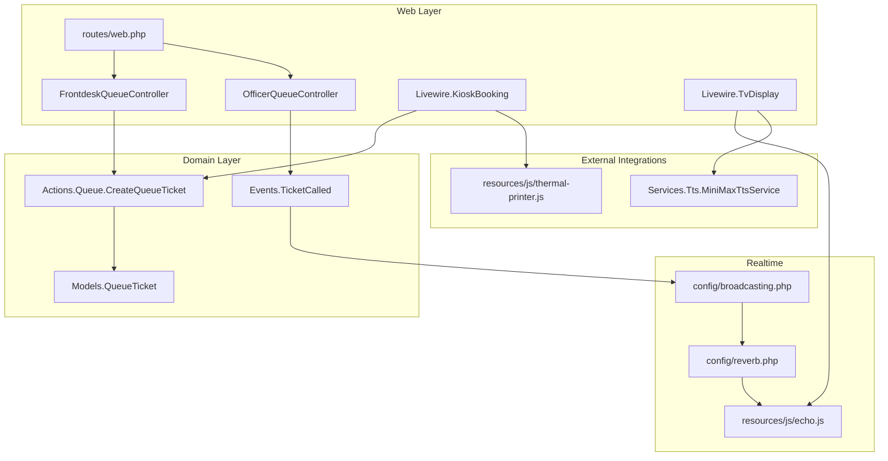
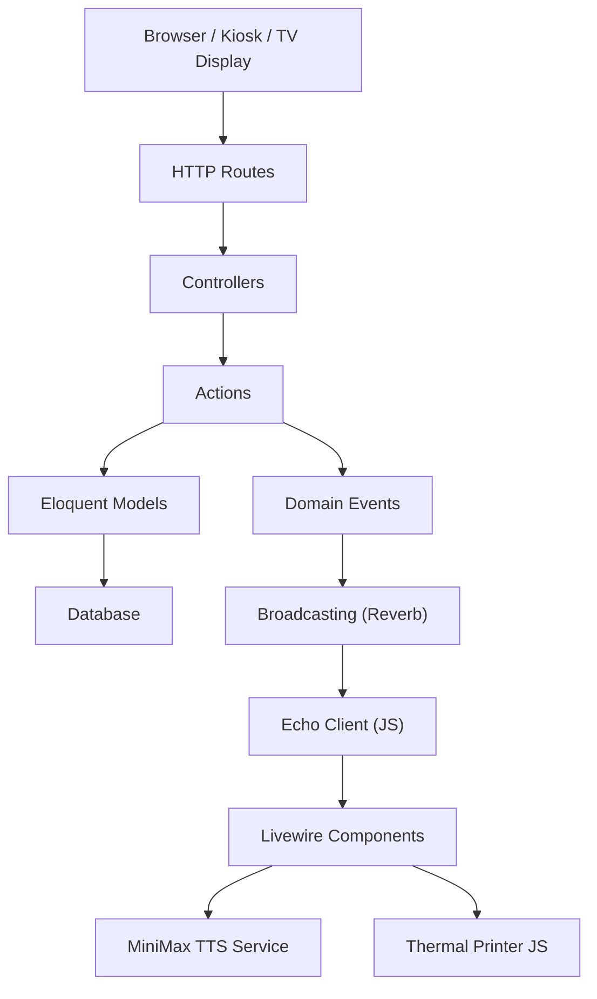
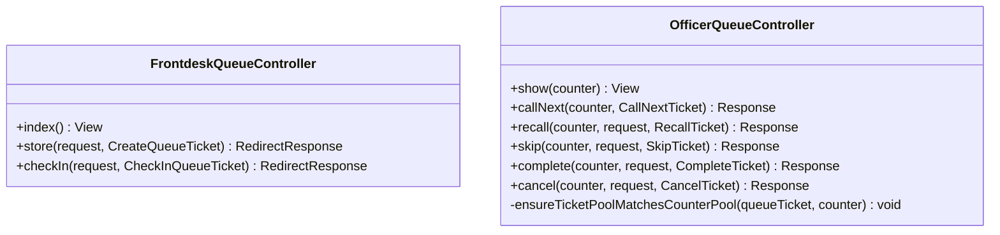
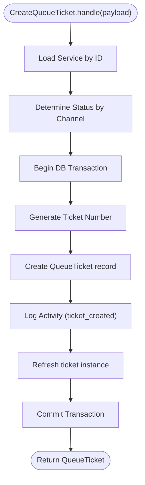
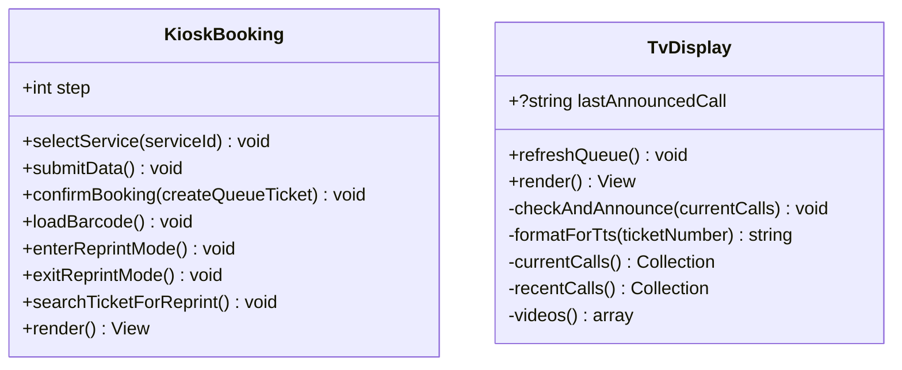
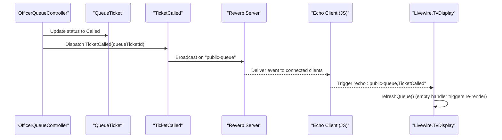
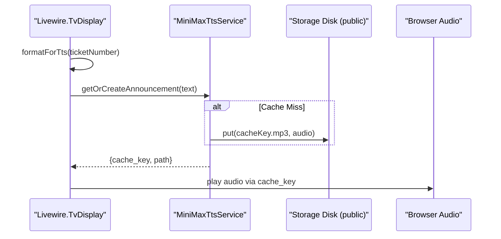
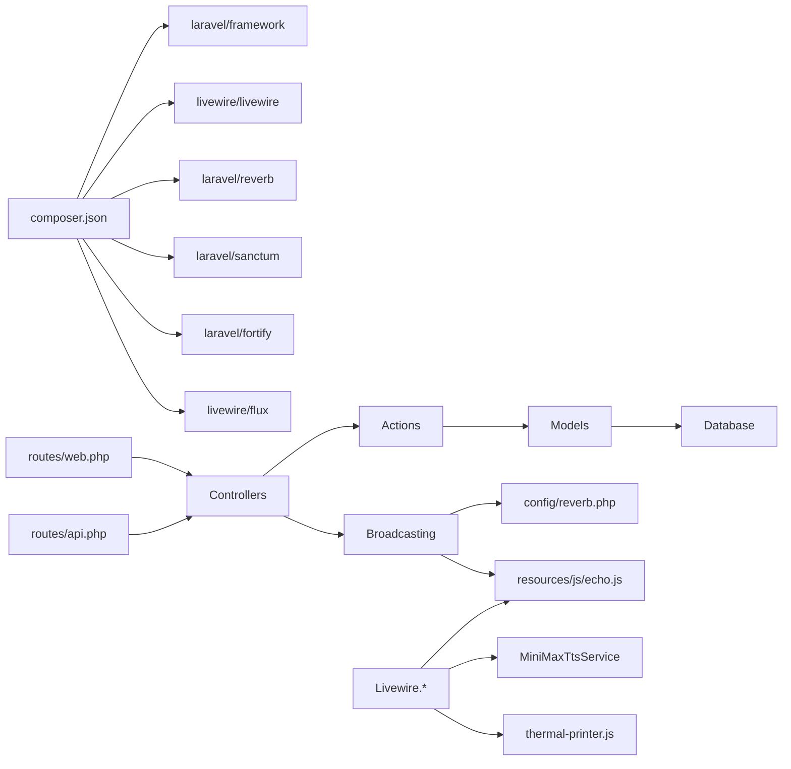

# System Architecture

<cite>
**Referenced Files in This Document**
- [composer.json](file://composer.json)
- [config/app.php](file://config/app.php)
- [config/broadcasting.php](file://config/broadcasting.php)
- [config/reverb.php](file://config/reverb.php)
- [routes/web.php](file://routes/web.php)
- [routes/api.php](file://routes/api.php)
- [app/Http/Controllers/FrontdeskQueueController.php](file://app/Http/Controllers/FrontdeskQueueController.php)
- [app/Http/Controllers/OfficerQueueController.php](file://app/Http/Controllers/OfficerQueueController.php)
- [app/Actions/Queue/CreateQueueTicket.php](file://app/Actions/Queue/CreateQueueTicket.php)
- [app/Models/QueueTicket.php](file://app/Models/QueueTicket.php)
- [app/Events/TicketCalled.php](file://app/Events/TicketCalled.php)
- [app/Livewire/TvDisplay.php](file://app/Livewire/TvDisplay.php)
- [app/Livewire/KioskBooking.php](file://app/Livewire/KioskBooking.php)
- [resources/js/echo.js](file://resources/js/echo.js)
- [resources/js/thermal-printer.js](file://resources/js/thermal-printer.js)
- [app/Services/Tts/MiniMaxTtsService.php](file://app/Services/Tts/MiniMaxTtsService.php)
</cite>

## Table of Contents
1. [Introduction](#introduction)
2. [Project Structure](#project-structure)
3. [Core Components](#core-components)
4. [Architecture Overview](#architecture-overview)
5. [Detailed Component Analysis](#detailed-component-analysis)
6. [Dependency Analysis](#dependency-analysis)
7. [Performance Considerations](#performance-considerations)
8. [Troubleshooting Guide](#troubleshooting-guide)
9. [Conclusion](#conclusion)

## Introduction
This document describes the architecture of the PTSP Queue Management System. The system follows an MVC-inspired design enhanced with Livewire components for reactive UI, real-time updates powered by Laravel Reverb, and a modular service/action layer for queue operations. It integrates with Text-to-Speech (TTS) and thermal printer services to deliver a complete end-to-end experience for public, front-desk, officer, kiosk, and TV display interfaces.

## Project Structure
The system is organized around:
- Routes defining entry points for web and API modules
- Controllers implementing request handling and orchestrating actions
- Actions encapsulating domain-specific operations
- Livewire components driving interactive UI with real-time synchronization
- Models representing persistent state and relationships
- Broadcasting configuration enabling WebSocket-based real-time updates
- External integrations for TTS and thermal printing

**Diagram sources**
- [routes/web.php:1-127](file://routes/web.php#L1-L127)
- [app/Http/Controllers/FrontdeskQueueController.php:1-89](file://app/Http/Controllers/FrontdeskQueueController.php#L1-L89)
- [app/Http/Controllers/OfficerQueueController.php:1-96](file://app/Http/Controllers/OfficerQueueController.php#L1-L96)
- [app/Livewire/KioskBooking.php:1-288](file://app/Livewire/KioskBooking.php#L1-L288)
- [app/Livewire/TvDisplay.php:1-142](file://app/Livewire/TvDisplay.php#L1-L142)
- [app/Actions/Queue/CreateQueueTicket.php:1-91](file://app/Actions/Queue/CreateQueueTicket.php#L1-L91)
- [app/Models/QueueTicket.php:1-121](file://app/Models/QueueTicket.php#L1-L121)
- [app/Events/TicketCalled.php:1-34](file://app/Events/TicketCalled.php#L1-L34)
- [config/broadcasting.php:1-83](file://config/broadcasting.php#L1-L83)
- [config/reverb.php:1-103](file://config/reverb.php#L1-L103)
- [resources/js/echo.js:1-15](file://resources/js/echo.js#L1-L15)
- [app/Services/Tts/MiniMaxTtsService.php:1-312](file://app/Services/Tts/MiniMaxTtsService.php#L1-L312)
- [resources/js/thermal-printer.js:1-139](file://resources/js/thermal-printer.js#L1-L139)

**Section sources**
- [routes/web.php:1-127](file://routes/web.php#L1-L127)
- [routes/api.php:1-23](file://routes/api.php#L1-L23)
- [composer.json:1-118](file://composer.json#L1-L118)
- [config/app.php:1-127](file://config/app.php#L1-L127)

## Core Components
- Controllers: Handle HTTP requests for front-desk registration, officer actions, and module logins. They validate input, delegate to Actions, and return responses or redirects.
- Actions: Encapsulate domain operations (e.g., creating tickets, calling next, recalling, skipping, completing, canceling) with transactional integrity and activity logging.
- Livewire Components: Provide reactive UI for kiosk booking and TV display, with real-time updates via event listeners and TTS/printer integrations.
- Models: Represent persistent entities (QueueTicket, Service, Counter, etc.) with relationships and scopes.
- Broadcasting: Configure Reverb/Pusher for real-time event distribution to clients.
- External Services: TTS generation and thermal printer printing for announcements and receipts.

**Section sources**
- [app/Http/Controllers/FrontdeskQueueController.php:1-89](file://app/Http/Controllers/FrontdeskQueueController.php#L1-L89)
- [app/Http/Controllers/OfficerQueueController.php:1-96](file://app/Http/Controllers/OfficerQueueController.php#L1-L96)
- [app/Actions/Queue/CreateQueueTicket.php:1-91](file://app/Actions/Queue/CreateQueueTicket.php#L1-L91)
- [app/Models/QueueTicket.php:1-121](file://app/Models/QueueTicket.php#L1-L121)
- [app/Events/TicketCalled.php:1-34](file://app/Events/TicketCalled.php#L1-L34)
- [app/Livewire/KioskBooking.php:1-288](file://app/Livewire/KioskBooking.php#L1-L288)
- [app/Livewire/TvDisplay.php:1-142](file://app/Livewire/TvDisplay.php#L1-L142)
- [config/broadcasting.php:1-83](file://config/broadcasting.php#L1-L83)
- [config/reverb.php:1-103](file://config/reverb.php#L1-L103)
- [resources/js/echo.js:1-15](file://resources/js/echo.js#L1-L15)
- [app/Services/Tts/MiniMaxTtsService.php:1-312](file://app/Services/Tts/MiniMaxTtsService.php#L1-L312)
- [resources/js/thermal-printer.js:1-139](file://resources/js/thermal-printer.js#L1-L139)

## Architecture Overview
The system employs:
- MVC with enhanced Livewire components for dynamic UI
- Modular Action layer for cohesive business operations
- Real-time communication via Laravel Reverb (WebSocket)
- External integrations for TTS and thermal printing
- Role-based routing and middleware for access control

**Diagram sources**
- [routes/web.php:1-127](file://routes/web.php#L1-L127)
- [app/Http/Controllers/FrontdeskQueueController.php:1-89](file://app/Http/Controllers/FrontdeskQueueController.php#L1-L89)
- [app/Http/Controllers/OfficerQueueController.php:1-96](file://app/Http/Controllers/OfficerQueueController.php#L1-L96)
- [app/Actions/Queue/CreateQueueTicket.php:1-91](file://app/Actions/Queue/CreateQueueTicket.php#L1-L91)
- [app/Models/QueueTicket.php:1-121](file://app/Models/QueueTicket.php#L1-L121)
- [app/Events/TicketCalled.php:1-34](file://app/Events/TicketCalled.php#L1-L34)
- [config/broadcasting.php:1-83](file://config/broadcasting.php#L1-L83)
- [config/reverb.php:1-103](file://config/reverb.php#L1-L103)
- [resources/js/echo.js:1-15](file://resources/js/echo.js#L1-L15)
- [app/Services/Tts/MiniMaxTtsService.php:1-312](file://app/Services/Tts/MiniMaxTtsService.php#L1-L312)
- [resources/js/thermal-printer.js:1-139](file://resources/js/thermal-printer.js#L1-L139)

## Detailed Component Analysis

### MVC and Controllers
- FrontdeskQueueController: Renders the front-desk page, creates walk-in tickets, and processes check-in.
- OfficerQueueController: Enforces role and pool permissions, and executes queue actions (call, recall, skip, complete, cancel).

**Diagram sources**
- [app/Http/Controllers/FrontdeskQueueController.php:1-89](file://app/Http/Controllers/FrontdeskQueueController.php#L1-L89)
- [app/Http/Controllers/OfficerQueueController.php:1-96](file://app/Http/Controllers/OfficerQueueController.php#L1-L96)

**Section sources**
- [app/Http/Controllers/FrontdeskQueueController.php:18-88](file://app/Http/Controllers/FrontdeskQueueController.php#L18-L88)
- [app/Http/Controllers/OfficerQueueController.php:18-95](file://app/Http/Controllers/OfficerQueueController.php#L18-L95)

### Actions and Domain Operations
- CreateQueueTicket: Validates payload, selects appropriate status by channel, generates ticket number via numbering service, persists ticket, and logs activity.

**Diagram sources**
- [app/Actions/Queue/CreateQueueTicket.php:34-89](file://app/Actions/Queue/CreateQueueTicket.php#L34-L89)

**Section sources**
- [app/Actions/Queue/CreateQueueTicket.php:13-91](file://app/Actions/Queue/CreateQueueTicket.php#L13-L91)

### Livewire Components
- KioskBooking: Multi-step wizard for walk-in booking, validation, ticket creation, barcode generation, and reprint lookup.
- TvDisplay: Live queue display with periodic announcements via TTS and video playlist caching.

**Diagram sources**
- [app/Livewire/KioskBooking.php:25-288](file://app/Livewire/KioskBooking.php#L25-L288)
- [app/Livewire/TvDisplay.php:18-142](file://app/Livewire/TvDisplay.php#L18-L142)

**Section sources**
- [app/Livewire/KioskBooking.php:264-288](file://app/Livewire/KioskBooking.php#L264-L288)
- [app/Livewire/TvDisplay.php:29-142](file://app/Livewire/TvDisplay.php#L29-L142)

### Real-Time Communication with Reverb
- Broadcasting is configured to use the Reverb driver with TLS and client options.
- TicketCalled event broadcasts on the public-queue channel.
- Livewire components listen for echo events and trigger re-renders.
- JavaScript Echo client connects to Reverb with environment-driven keys and ports.

**Diagram sources**
- [app/Http/Controllers/OfficerQueueController.php:40-49](file://app/Http/Controllers/OfficerQueueController.php#L40-L49)
- [app/Models/QueueTicket.php:1-121](file://app/Models/QueueTicket.php#L1-L121)
- [app/Events/TicketCalled.php:11-34](file://app/Events/TicketCalled.php#L11-L34)
- [config/broadcasting.php:31-47](file://config/broadcasting.php#L31-L47)
- [config/reverb.php:29-55](file://config/reverb.php#L29-L55)
- [resources/js/echo.js:6-14](file://resources/js/echo.js#L6-L14)
- [app/Livewire/TvDisplay.php:22-27](file://app/Livewire/TvDisplay.php#L22-L27)

**Section sources**
- [config/broadcasting.php:18-83](file://config/broadcasting.php#L18-L83)
- [config/reverb.php:16-103](file://config/reverb.php#L16-L103)
- [resources/js/echo.js:1-15](file://resources/js/echo.js#L1-L15)
- [app/Events/TicketCalled.php:11-34](file://app/Events/TicketCalled.php#L11-L34)
- [app/Livewire/TvDisplay.php:22-27](file://app/Livewire/TvDisplay.php#L22-L27)

### External Integrations: TTS and Thermal Printing
- TTS: MiniMaxTtsService generates speech audio, caches MP3 files, and supports sync/async/auto strategies with robust error handling.
- Thermal Printer: JavaScript module connects to Epson ePOS SDK, prints structured tickets with barcode and cut command.

**Diagram sources**
- [app/Livewire/TvDisplay.php:60-83](file://app/Livewire/TvDisplay.php#L60-L83)
- [app/Services/Tts/MiniMaxTtsService.php:16-44](file://app/Services/Tts/MiniMaxTtsService.php#L16-L44)
- [app/Services/Tts/MiniMaxTtsService.php:53-116](file://app/Services/Tts/MiniMaxTtsService.php#L53-L116)
- [app/Services/Tts/MiniMaxTtsService.php:118-180](file://app/Services/Tts/MiniMaxTtsService.php#L118-L180)

**Section sources**
- [app/Services/Tts/MiniMaxTtsService.php:11-312](file://app/Services/Tts/MiniMaxTtsService.php#L11-L312)
- [resources/js/thermal-printer.js:54-128](file://resources/js/thermal-printer.js#L54-L128)

## Dependency Analysis
- Technology stack: Laravel 12, Livewire 4, Reverb, Sanctum, Fortify, Flux UI, Barcodes.
- Routing: Web routes for modules (public, frontdesk, officer, admin, kiosk, TV display), plus API routes for services and queue lookups.
- Broadcasting: Reverb configured with TLS, scaling, rate limiting, and application credentials.
- Actions depend on Models and internal services; Livewire components orchestrate UI and integrate with JS modules.

**Diagram sources**
- [composer.json:11-23](file://composer.json#L11-L23)
- [routes/web.php:1-127](file://routes/web.php#L1-L127)
- [routes/api.php:1-23](file://routes/api.php#L1-L23)
- [config/reverb.php:29-55](file://config/reverb.php#L29-L55)
- [resources/js/echo.js:1-15](file://resources/js/echo.js#L1-L15)
- [app/Services/Tts/MiniMaxTtsService.php:1-312](file://app/Services/Tts/MiniMaxTtsService.php#L1-L312)
- [resources/js/thermal-printer.js:1-139](file://resources/js/thermal-printer.js#L1-L139)

**Section sources**
- [composer.json:11-118](file://composer.json#L11-L118)
- [routes/web.php:1-127](file://routes/web.php#L1-L127)
- [routes/api.php:1-23](file://routes/api.php#L1-L23)
- [config/reverb.php:16-103](file://config/reverb.php#L16-L103)

## Performance Considerations
- Real-time updates: Use channel scoping and efficient event payloads to minimize bandwidth.
- Caching: Livewire computed properties persist for limited durations; leverage caching for expensive UI computations (e.g., videos).
- Database queries: Apply scopes and indexes for queue position calculations and daily lookups.
- External services: Implement retry/backoff for TTS and printer operations; cache generated audio to reduce latency.
- Scaling: Enable Reverb scaling with Redis and monitor Pulse/Telescope ingest intervals.

## Troubleshooting Guide
- Authentication and roles: Ensure proper middleware and role checks are applied to module routes.
- Broadcasting connectivity: Verify Reverb host/port/scheme and TLS settings; confirm Echo client configuration matches environment.
- Livewire reactivity: Confirm event listener annotations and that Livewire components re-render after receiving echo events.
- TTS failures: Check API key/voice/model configuration and async/sync fallback logic; inspect cache disk permissions.
- Printer connectivity: Validate ePOS SDK availability and device IP/port; ensure printer is connected and initialized.

**Section sources**
- [routes/web.php:28-90](file://routes/web.php#L28-L90)
- [config/broadcasting.php:31-47](file://config/broadcasting.php#L31-L47)
- [config/reverb.php:32-55](file://config/reverb.php#L32-L55)
- [resources/js/echo.js:6-14](file://resources/js/echo.js#L6-L14)
- [app/Services/Tts/MiniMaxTtsService.php:53-180](file://app/Services/Tts/MiniMaxTtsService.php#L53-L180)
- [resources/js/thermal-printer.js:24-46](file://resources/js/thermal-printer.js#L24-L46)

## Conclusion
The PTSP Queue Management System combines a clean MVC structure with Livewire-driven UI, robust real-time capabilities via Reverb, and modular Actions for queue operations. Its integration with TTS and thermal printers completes the end-to-end experience across public kiosks, front-desk counters, officer workstations, and TV displays. The architecture emphasizes separation of concerns, scalability through Reverb, and resilience via caching and fallback strategies.