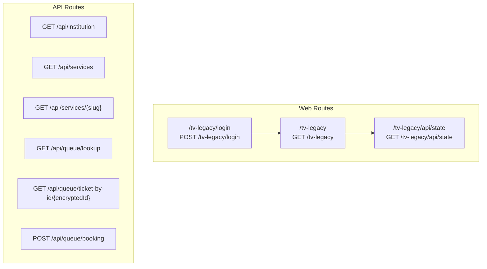
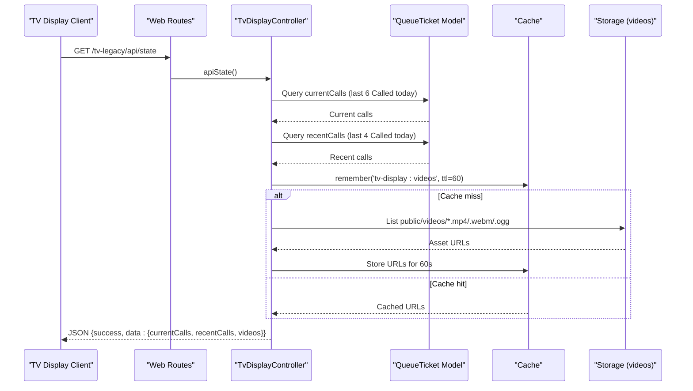
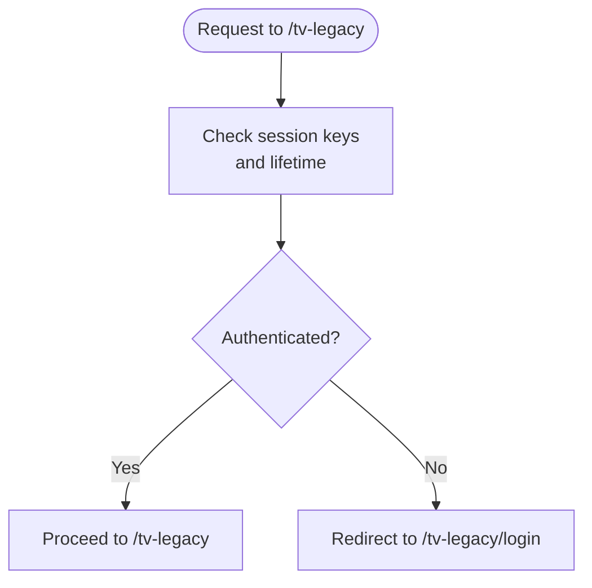
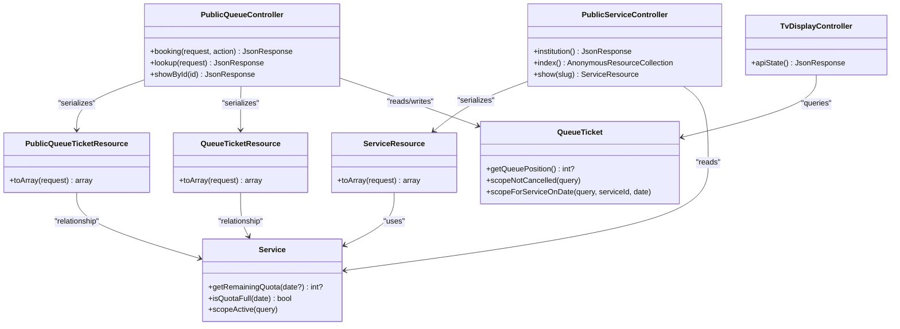

# API Endpoints and Data Integration

<cite>
**Referenced Files in This Document**
- [routes/api.php](file://routes/api.php)
- [routes/web.php](file://routes/web.php)
- [TvDisplayController.php](file://app/Http/Controllers/TvDisplayController.php)
- [PublicQueueController.php](file://app/Http/Controllers/Api/PublicQueueController.php)
- [PublicServiceController.php](file://app/Http/Controllers/Api/PublicServiceController.php)
- [QueueTicketResource.php](file://app/Http/Resources/QueueTicketResource.php)
- [ServiceResource.php](file://app/Http/Resources/ServiceResource.php)
- [PublicQueueTicketResource.php](file://app/Http/Resources/PublicQueueTicketResource.php)
- [QueueTicket.php](file://app/Models/QueueTicket.php)
- [Service.php](file://app/Models/Service.php)
- [CheckModulePassword.php](file://app/Http/Middleware/CheckModulePassword.php)
- [kiosk.php](file://config/kiosk.php)
- [ModuleSession.php](file://app/Enums/ModuleSession.php)
- [legacy.blade.php](file://resources/views/pages/tv-display/legacy.blade.php)
</cite>

## Table of Contents
1. [Introduction](#introduction)
2. [Project Structure](#project-structure)
3. [Core Components](#core-components)
4. [Architecture Overview](#architecture-overview)
5. [Detailed Component Analysis](#detailed-component-analysis)
6. [Dependency Analysis](#dependency-analysis)
7. [Performance Considerations](#performance-considerations)
8. [Troubleshooting Guide](#troubleshooting-guide)
9. [Conclusion](#conclusion)
10. [Appendices](#appendices)

## Introduction
This document describes the API endpoints and data integration patterns for the TV Display System. It focuses on:
- Authentication for TV Display access
- Queue state retrieval via the apiState endpoint
- Video management for display playlists
- Public queue and service endpoints used by clients
- Data serialization using QueueTicketResource and ServiceResource
- Caching strategies for video assets and queue data
- Rate limiting, security, and versioning considerations
- Client integration patterns and examples

## Project Structure
The TV Display System exposes two primary surfaces:
- Web routes for TV Display UI and authentication
- API routes for public queue and service data, plus a dedicated state endpoint

**Diagram sources**
- [routes/web.php:116-126](file://routes/web.php#L116-L126)
- [routes/api.php:8-18](file://routes/api.php#L8-L18)

**Section sources**
- [routes/web.php:116-126](file://routes/web.php#L116-L126)
- [routes/api.php:1-23](file://routes/api.php#L1-L23)

## Core Components
- TvDisplayController: Provides TV Display authentication and the apiState endpoint returning current/recent calls and video playlist.
- PublicServiceController: Returns institution info and service catalog.
- PublicQueueController: Handles queue lookup by number/date, retrieval by encrypted ID, and ticket creation via booking.
- Resource classes: Serialize QueueTicket and Service data for API responses.
- Middleware and configuration: Enforce module password authentication and session lifetime.

**Section sources**
- [TvDisplayController.php:89-142](file://app/Http/Controllers/TvDisplayController.php#L89-L142)
- [PublicServiceController.php:13-40](file://app/Http/Controllers/Api/PublicServiceController.php#L13-L40)
- [PublicQueueController.php:16-64](file://app/Http/Controllers/Api/PublicQueueController.php#L16-L64)
- [QueueTicketResource.php:10-28](file://app/Http/Resources/QueueTicketResource.php#L10-L28)
- [ServiceResource.php:10-23](file://app/Http/Resources/ServiceResource.php#L10-L23)
- [CheckModulePassword.php:17-33](file://app/Http/Middleware/CheckModulePassword.php#L17-L33)
- [kiosk.php:3-7](file://config/kiosk.php#L3-L7)

## Architecture Overview
The TV Display client consumes the apiState endpoint to render live queue information and video playback. Public endpoints feed service and queue lookup capabilities to external clients.

**Diagram sources**
- [TvDisplayController.php:89-142](file://app/Http/Controllers/TvDisplayController.php#L89-L142)
- [QueueTicket.php:92-106](file://app/Models/QueueTicket.php#L92-L106)
- [legacy.blade.php:506-544](file://resources/views/pages/tv-display/legacy.blade.php#L506-L544)

## Detailed Component Analysis

### Authentication and Session Management
- TV Display authentication uses a module password check and session keys.
- The middleware validates session presence and lifetime, redirecting unauthenticated requests to the login page.
- Configuration supports separate passwords for TV Display and a shared module password.

**Diagram sources**
- [CheckModulePassword.php:17-33](file://app/Http/Middleware/CheckModulePassword.php#L17-L33)
- [kiosk.php:3-7](file://config/kiosk.php#L3-L7)
- [ModuleSession.php:8-14](file://app/Enums/ModuleSession.php#L8-L14)

**Section sources**
- [CheckModulePassword.php:17-33](file://app/Http/Middleware/CheckModulePassword.php#L17-L33)
- [kiosk.php:3-7](file://config/kiosk.php#L3-L7)
- [ModuleSession.php:8-14](file://app/Enums/ModuleSession.php#L8-L14)

### API Endpoints

#### Institution Info
- Method: GET
- URL: /api/institution
- Purpose: Retrieve institution metadata (name, address, phone, operating hours, logo path)
- Response: JSON object containing selected fields
- Status codes: 200 OK

**Section sources**
- [routes/api.php](file://routes/api.php#L9)
- [PublicServiceController.php:13-24](file://app/Http/Controllers/Api/PublicServiceController.php#L13-L24)

#### Services Catalog
- Method: GET
- URL: /api/services
- Purpose: List active services
- Response: Collection of ServiceResource items
- Status codes: 200 OK

**Section sources**
- [routes/api.php](file://routes/api.php#L10)
- [PublicServiceController.php:26-31](file://app/Http/Controllers/Api/PublicServiceController.php#L26-L31)

#### Service Details
- Method: GET
- URL: /api/services/{slug}
- Purpose: Retrieve a single active service by slug
- Response: ServiceResource item
- Status codes: 200 OK, 404 Not Found if not found

**Section sources**
- [routes/api.php](file://routes/api.php#L11)
- [PublicServiceController.php:33-40](file://app/Http/Controllers/Api/PublicServiceController.php#L33-L40)

#### Queue Lookup by Number and Date
- Method: GET
- URL: /api/queue/lookup?ticket_number={number}&service_date={YYYY-MM-DD}
- Purpose: Find a queue ticket by number and service date
- Response: PublicQueueTicketResource item
- Status codes: 200 OK, 404 Not Found if not found

**Section sources**
- [routes/api.php](file://routes/api.php#L12)
- [PublicQueueController.php:36-45](file://app/Http/Controllers/Api/PublicQueueController.php#L36-L45)

#### Queue Ticket by Encrypted ID
- Method: GET
- URL: /api/queue/ticket-by-id/{encryptedId}
- Purpose: Retrieve a queue ticket by its encrypted ID
- Response: PublicQueueTicketResource item
- Status codes: 200 OK, 404 Not Found if decryption fails or record missing

**Section sources**
- [routes/api.php](file://routes/api.php#L13)
- [PublicQueueController.php:47-64](file://app/Http/Controllers/Api/PublicQueueController.php#L47-L64)

#### Queue Booking
- Method: POST
- URL: /api/queue/booking
- Purpose: Create a new queue ticket for online booking
- Request body: Service ID, service date, visitor details, optional notes
- Response: QueueTicketResource item with 201 Created
- Status codes: 201 Created, 422 Unprocessable Entity (validation errors)

**Section sources**
- [routes/api.php](file://routes/api.php#L17)
- [PublicQueueController.php:16-34](file://app/Http/Controllers/Api/PublicQueueController.php#L16-L34)

#### TV Display State Endpoint
- Method: GET
- URL: /tv-legacy/api/state
- Purpose: Provide live TV display data: current calls, recent calls, and video playlist
- Authentication: Requires module password session
- Response: JSON object with success flag and data payload
- Status codes: 200 OK

Response schema outline:
- success: boolean
- data:
  - currentCalls: array of QueueTicketResource-like entries (up to 6)
  - recentCalls: array of QueueTicketResource-like entries (up to 4)
  - videos: array of video asset URLs (sorted)

Notes:
- Videos are cached for 60 seconds under the key "tv-display:videos".
- On exceptions, the endpoint returns success true with empty arrays.

**Section sources**
- [routes/web.php](file://routes/web.php#L121)
- [TvDisplayController.php:89-142](file://app/Http/Controllers/TvDisplayController.php#L89-L142)

### Data Serialization and Resources

#### QueueTicketResource
Serializes queue ticket data for internal/protected contexts. Includes:
- id, ticket_number, service_date, visitor_name, visitor_wilayah_kode
- status value and label
- service relationship (when loaded)
- queue_position computed by model method
- counter_name when loaded
- timestamps in ISO 8601 format

**Section sources**
- [QueueTicketResource.php:10-28](file://app/Http/Resources/QueueTicketResource.php#L10-L28)
- [QueueTicket.php:82-94](file://app/Models/QueueTicket.php#L82-L94)

#### PublicQueueTicketResource
Serializes queue ticket data for public endpoints. Masks visitor name partially and includes:
- id, ticket_number, service_date
- masked visitor_name
- status value and label
- service relationship (when loaded)
- queue_position computed by model method
- counter_name when loaded
- timestamps in ISO 8601 format

**Section sources**
- [PublicQueueTicketResource.php:10-26](file://app/Http/Resources/PublicQueueTicketResource.php#L10-L26)

#### ServiceResource
Serializes service data:
- id, name, code, slug, description
- requirements, booking_enabled, daily_quota
- remaining_quota computed by model method

**Section sources**
- [ServiceResource.php:10-23](file://app/Http/Resources/ServiceResource.php#L10-L23)
- [Service.php:73-86](file://app/Models/Service.php#L73-L86)

### Client Implementation Guidelines
- TV Display client polling:
  - Poll GET /tv-legacy/api/state periodically (e.g., every 5–10 seconds).
  - Initialize video playlist from data.videos on first successful response.
  - Update active call display using data.currentCalls[0].
  - Track consecutive failures and log warnings after threshold.

- Public client usage:
  - Use /api/services to populate service selection.
  - Use /api/services/{slug} to pre-fetch service details.
  - Use /api/queue/lookup for quick status checks.
  - Use /api/queue/ticket-by-id/{encryptedId} for shareable links.
  - Use /api/queue/booking for new bookings.

- Error handling:
  - 404 responses indicate missing tickets or invalid encrypted IDs.
  - 422 indicates validation errors for booking requests.
  - Network failures should trigger retries with backoff and degrade gracefully.

**Section sources**
- [legacy.blade.php:506-544](file://resources/views/pages/tv-display/legacy.blade.php#L506-L544)
- [PublicQueueController.php:36-64](file://app/Http/Controllers/Api/PublicQueueController.php#L36-L64)

## Dependency Analysis

**Diagram sources**
- [TvDisplayController.php:89-142](file://app/Http/Controllers/TvDisplayController.php#L89-L142)
- [PublicServiceController.php:13-40](file://app/Http/Controllers/Api/PublicServiceController.php#L13-L40)
- [PublicQueueController.php:16-64](file://app/Http/Controllers/Api/PublicQueueController.php#L16-L64)
- [QueueTicketResource.php:10-28](file://app/Http/Resources/QueueTicketResource.php#L10-L28)
- [PublicQueueTicketResource.php:10-26](file://app/Http/Resources/PublicQueueTicketResource.php#L10-L26)
- [ServiceResource.php:10-23](file://app/Http/Resources/ServiceResource.php#L10-L23)
- [QueueTicket.php:74-119](file://app/Models/QueueTicket.php#L74-L119)
- [Service.php:48-100](file://app/Models/Service.php#L48-L100)

**Section sources**
- [TvDisplayController.php:89-142](file://app/Http/Controllers/TvDisplayController.php#L89-L142)
- [PublicServiceController.php:13-40](file://app/Http/Controllers/Api/PublicServiceController.php#L13-L40)
- [PublicQueueController.php:16-64](file://app/Http/Controllers/Api/PublicQueueController.php#L16-L64)
- [QueueTicket.php:74-119](file://app/Models/QueueTicket.php#L74-L119)
- [Service.php:48-100](file://app/Models/Service.php#L48-L100)

## Performance Considerations
- apiState endpoint:
  - Uses caching for video assets with a 60-second TTL to reduce filesystem scans and asset enumeration overhead.
  - Limits currentCalls and recentCalls to small fixed sizes to minimize payload size and DB load.
  - Eager loads related counter and service data to avoid N+1 queries.
- Public endpoints:
  - Throttling applied: 60 requests per minute for read endpoints, 10 requests per minute for booking.
  - Pagination is not used; keep payloads small by limiting result sets and avoiding unnecessary relations.

Recommendations:
- Tune throttle windows and limits based on deployment scale.
- Consider background jobs to refresh video cache periodically if asset updates are frequent.
- Add database indexes on frequently filtered columns (e.g., service_date, status) if not present.

**Section sources**
- [TvDisplayController.php:108-122](file://app/Http/Controllers/TvDisplayController.php#L108-L122)
- [routes/api.php:8-18](file://routes/api.php#L8-L18)

## Troubleshooting Guide
Common issues and resolutions:
- 401/302 Unauthorized or redirected to login:
  - Ensure module password session is established and not expired.
  - Verify session lifetime configuration and that the client respects redirects.
- Empty or missing video playlist:
  - Confirm assets exist under public/videos with supported extensions (mp4, webm, ogg).
  - Check cache key "tv-display:videos" TTL and availability.
- 404 Not Found for queue endpoints:
  - For encrypted ID, ensure the ID is valid and not tampered.
  - For lookup, confirm ticket_number and service_date format and correctness.
- 422 Validation errors on booking:
  - Review required fields and constraints enforced by the booking request handler.

**Section sources**
- [CheckModulePassword.php:17-33](file://app/Http/Middleware/CheckModulePassword.php#L17-L33)
- [TvDisplayController.php:108-142](file://app/Http/Controllers/TvDisplayController.php#L108-L142)
- [PublicQueueController.php:36-64](file://app/Http/Controllers/Api/PublicQueueController.php#L36-L64)

## Conclusion
The TV Display System provides a focused set of endpoints to power real-time queue displays and public-facing queue management. Authentication is handled via module password sessions, while throttling and caching ensure responsiveness. Resource classes standardize serialization for both internal and public contexts. Clients should implement robust retry logic, handle degraded states gracefully, and respect rate limits.

## Appendices

### API Versioning Approaches
- URL path versioning: Introduce /api/v1/... and migrate routes incrementally.
- Header-based versioning: Use Accept-Version header; maintain backward compatibility.
- Content negotiation: Keep resource shapes stable and add optional fields for new features.

[No sources needed since this section provides general guidance]

### Security Considerations
- Use HTTPS in production to protect credentials and payloads.
- Validate and sanitize all inputs; enforce strict request schemas.
- Limit sensitive fields in public resources (already masked for visitor name).
- Rotate module passwords regularly and restrict environment variable access.

[No sources needed since this section provides general guidance]

### Rate Limiting Reference
- Read endpoints: 60 per minute
- Booking endpoint: 10 per minute

**Section sources**
- [routes/api.php:8-18](file://routes/api.php#L8-L18)