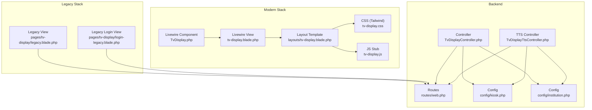
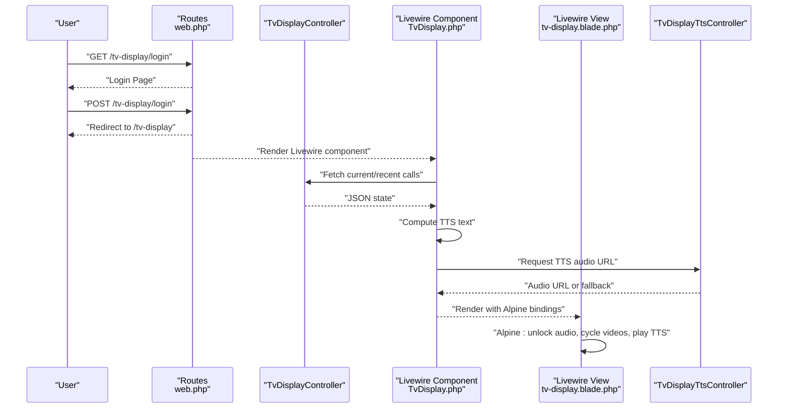
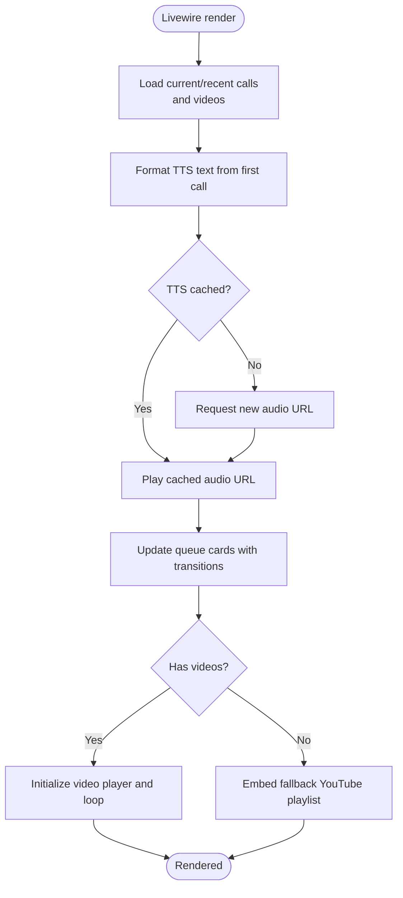
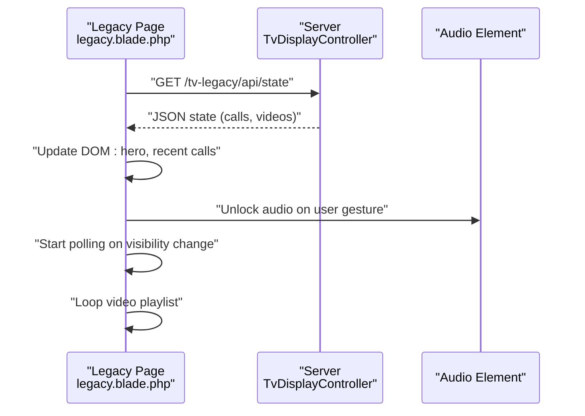
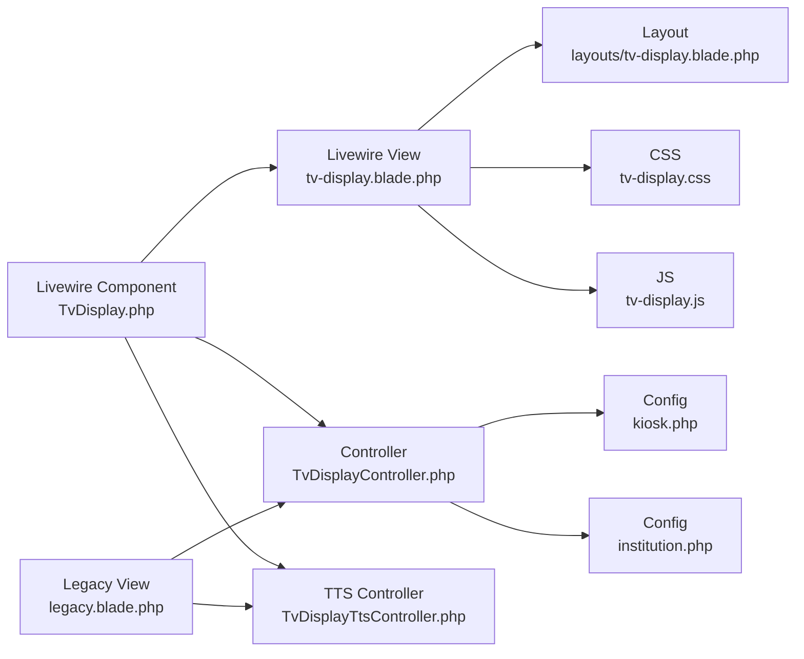

# Display Layout and Configuration

<cite>
**Referenced Files in This Document**
- [TvDisplay.php](file://app/Livewire/TvDisplay.php)
- [tv-display.blade.php](file://resources/views/livewire/tv-display.blade.php)
- [tv-display.blade.php](file://resources/views/layouts/tv-display.blade.php)
- [tv-display.css](file://resources/css/tv-display.css)
- [tv-display.js](file://resources/js/tv-display.js)
- [TvDisplayController.php](file://app/Http/Controllers/TvDisplayController.php)
- [TvDisplayTtsController.php](file://app/Http/controllers/TvDisplayTtsController.php)
- [web.php](file://routes/web.php)
- [index.blade.php](file://resources/views/pages/tv-display/index.blade.php)
- [login.blade.php](file://resources/views/pages/tv-display/login.blade.php)
- [legacy.blade.php](file://resources/views/pages/tv-display/legacy.blade.php)
- [login-legacy.blade.php](file://resources/views/pages/tv-display/login-legacy.blade.php)
- [institution.php](file://config/institution.php)
- [kiosk.php](file://config/kiosk.php)
</cite>

## Table of Contents
1. [Introduction](#introduction)
2. [Project Structure](#project-structure)
3. [Core Components](#core-components)
4. [Architecture Overview](#architecture-overview)
5. [Detailed Component Analysis](#detailed-component-analysis)
6. [Dependency Analysis](#dependency-analysis)
7. [Performance Considerations](#performance-considerations)
8. [Troubleshooting Guide](#troubleshooting-guide)
9. [Conclusion](#conclusion)
10. [Appendices](#appendices)

## Introduction
This document explains the TV Display Layout and Configuration for the queue management system. It covers modern and legacy display templates, responsive design and screen adaptation, layout customization, theming and visual styling, video background support and media management, configuration for display timing and transitions, CSS framework usage, and performance considerations for video playback and animations. It also provides guidelines for optimal display resolution, aspect ratio handling, and cross-device compatibility.

## Project Structure
The TV Display feature consists of:
- Modern template stack using Laravel Livewire, Alpine.js, and Tailwind CSS
- Legacy template stack using vanilla JavaScript and Bootstrap-like styles
- Backend controllers for state retrieval, authentication, and TTS audio provisioning
- Configuration via environment-driven settings for institution branding and module passwords
- Routes for modern and legacy TV displays, plus TTS endpoints

**Diagram sources**
- [TvDisplay.php:1-142](file://app/Livewire/TvDisplay.php#L1-L142)
- [tv-display.blade.php:1-213](file://resources/views/livewire/tv-display.blade.php#L1-L213)
- [tv-display.blade.php:1-31](file://resources/views/layouts/tv-display.blade.php#L1-L31)
- [tv-display.css:1-18](file://resources/css/tv-display.css#L1-L18)
- [tv-display.js:1-2](file://resources/js/tv-display.js#L1-L2)
- [legacy.blade.php:1-810](file://resources/views/pages/tv-display/legacy.blade.php#L1-L810)
- [login-legacy.blade.php:1-102](file://resources/views/pages/tv-display/login-legacy.blade.php#L1-L102)
- [TvDisplayController.php:1-144](file://app/Http/Controllers/TvDisplayController.php#L1-L144)
- [TvDisplayTtsController.php:1-62](file://app/Http/Controllers/TvDisplayTtsController.php#L1-L62)
- [web.php:108-124](file://routes/web.php#L108-L124)
- [kiosk.php:1-8](file://config/kiosk.php#L1-L8)
- [institution.php:1-10](file://config/institution.php#L1-L10)

**Section sources**
- [web.php:108-124](file://routes/web.php#L108-L124)
- [TvDisplayController.php:18-55](file://app/Http/Controllers/TvDisplayController.php#L18-L55)
- [TvDisplayTtsController.php:14-61](file://app/Http/Controllers/TvDisplayTtsController.php#L14-L61)
- [TvDisplay.php:29-39](file://app/Livewire/TvDisplay.php#L29-L39)
- [tv-display.blade.php:1-213](file://resources/views/livewire/tv-display.blade.php#L1-L213)
- [tv-display.blade.php:1-31](file://resources/views/layouts/tv-display.blade.php#L1-L31)
- [tv-display.css:1-18](file://resources/css/tv-display.css#L1-L18)
- [legacy.blade.php:1-810](file://resources/views/pages/tv-display/legacy.blade.php#L1-L810)
- [login-legacy.blade.php:1-102](file://resources/views/pages/tv-display/login-legacy.blade.php#L1-L102)
- [index.blade.php:1-18](file://resources/views/pages/tv-display/index.blade.php#L1-L18)
- [login.blade.php:1-84](file://resources/views/pages/tv-display/login.blade.php#L1-L84)
- [kiosk.php:1-8](file://config/kiosk.php#L1-L8)
- [institution.php:1-10](file://config/institution.php#L1-L10)

## Core Components
- Modern Livewire-based TV Display:
  - Livewire component orchestrates queue data, TTS announcements, and video playlist rendering.
  - Blade view implements split layout with queue info on the left and video player on the right.
  - Alpine.js manages audio unlocking, video cycling, and TTS playback.
  - Tailwind CSS provides responsive layout and animations.
- Legacy TV Display:
  - Pure JavaScript implementation with manual DOM updates and polling.
  - Bootstrap-inspired CSS for legacy devices.
  - Separate login page and full-screen layout.
- Backend Controllers:
  - Authentication routes and session guards for module access.
  - State API endpoint for legacy display polling.
  - TTS announcement generation and cached audio serving.
- Configuration:
  - Institution branding (name, address, phone, logo, operating hours).
  - Module passwords and session lifetime.

**Section sources**
- [TvDisplay.php:29-141](file://app/Livewire/TvDisplay.php#L29-L141)
- [tv-display.blade.php:1-213](file://resources/views/livewire/tv-display.blade.php#L1-L213)
- [TvDisplayController.php:52-142](file://app/Http/Controllers/TvDisplayController.php#L52-L142)
- [TvDisplayTtsController.php:14-61](file://app/Http/Controllers/TvDisplayTtsController.php#L14-L61)
- [institution.php:1-10](file://config/institution.php#L1-L10)
- [kiosk.php:1-8](file://config/kiosk.php#L1-L8)

## Architecture Overview
The modern TV Display uses a reactive Livewire component with Alpine.js for client-side interactivity. The legacy TV Display uses AJAX polling to update the UI. Both systems integrate with backend controllers for authentication, state retrieval, and TTS audio provisioning.

**Diagram sources**
- [web.php:108-124](file://routes/web.php#L108-L124)
- [TvDisplayController.php:89-142](file://app/Http/Controllers/TvDisplayController.php#L89-L142)
- [TvDisplay.php:29-68](file://app/Livewire/TvDisplay.php#L29-L68)
- [tv-display.blade.php:30-40](file://resources/views/livewire/tv-display.blade.php#L30-L40)
- [TvDisplayTtsController.php:14-39](file://app/Http/Controllers/TvDisplayTtsController.php#L14-L39)

## Detailed Component Analysis

### Modern TV Display Layout (Livewire + Alpine + Tailwind)
- Layout composition:
  - Full-screen split layout: left panel for queue info (60%), right panel for video (40%).
  - Header with branding, clock, and ticker marquee.
  - Hero card for currently called ticket with entrance animation.
  - Grid of recent tickets below hero.
  - Video player with automatic cycling and fallback YouTube embed.
- Alpine.js behavior:
  - Audio unlock overlay and gesture handling.
  - Online/offline connection indicator.
  - TTS fetch and playback via controller endpoint.
  - Video playlist initialization and looping.
- Tailwind CSS and animations:
  - Pulse and marquee keyframe animations.
  - Responsive typography and spacing.
- Theming and branding:
  - Institution name, address, phone, logo, and operating hours from configuration.
  - Dark theme with accent gradients and subtle radial backgrounds.

**Diagram sources**
- [TvDisplay.php:29-141](file://app/Livewire/TvDisplay.php#L29-L141)
- [tv-display.blade.php:1-213](file://resources/views/livewire/tv-display.blade.php#L1-L213)
- [TvDisplayTtsController.php:14-39](file://app/Http/Controllers/TvDisplayTtsController.php#L14-L39)

**Section sources**
- [TvDisplay.php:29-141](file://app/Livewire/TvDisplay.php#L29-L141)
- [tv-display.blade.php:60-198](file://resources/views/livewire/tv-display.blade.php#L60-L198)
- [tv-display.css:6-17](file://resources/css/tv-display.css#L6-L17)
- [institution.php:1-10](file://config/institution.php#L1-L10)

### Legacy TV Display Layout (Vanilla JS + Bootstrap-like Styles)
- Layout composition:
  - Full-screen root container with header, body (video-left, queue-right), and footer marquee.
  - Hero panel for currently called ticket with live badge and pulse animation.
  - Recent calls list with fade and slide-in effects.
  - Video placeholder and overlay text.
- JavaScript behavior:
  - Polling for state every 5 seconds.
  - Visibility-aware pause/resume of animations and video.
  - Audio unlock and fallback to browser TTS.
  - Playlist management and video cleanup to prevent memory leaks.
- Styling:
  - Fixed widths for columns (62%/38%).
  - Gradient backgrounds and glass-morphism inspired borders.
  - Marquee animation and clamped font sizes for readability.

**Diagram sources**
- [legacy.blade.php:506-578](file://resources/views/pages/tv-display/legacy.blade.php#L506-L578)
- [legacy.blade.php:422-480](file://resources/views/pages/tv-display/legacy.blade.php#L422-L480)
- [TvDisplayController.php:89-142](file://app/Http/Controllers/TvDisplayController.php#L89-L142)

**Section sources**
- [legacy.blade.php:1-810](file://resources/views/pages/tv-display/legacy.blade.php#L1-L810)
- [TvDisplayController.php:89-142](file://app/Http/Controllers/TvDisplayController.php#L89-L142)

### Video Background Support and Media Management
- Media discovery:
  - Backend scans public storage for allowed video extensions and builds a sorted playlist.
  - Playlist is cached to reduce repeated disk reads.
- Modern player:
  - HTML5 video with playsinline and muted attributes for autoplay on mobile.
  - Automatic cycling on ended event.
  - Fallback to YouTube embed when no videos are present.
- Legacy player:
  - Manual playlist management and video element replacement to avoid memory leaks.
  - Placeholder overlay when no videos are available.

**Section sources**
- [TvDisplay.php:118-140](file://app/Livewire/TvDisplay.php#L118-L140)
- [TvDisplayController.php:108-122](file://app/Http/Controllers/TvDisplayController.php#L108-L122)
- [tv-display.blade.php:178-197](file://resources/views/livewire/tv-display.blade.php#L178-L197)
- [legacy.blade.php:490-504](file://resources/views/pages/tv-display/legacy.blade.php#L490-L504)

### TTS Announcements and Audio Playback
- Modern:
  - Alpine dispatches a window event to trigger TTS fetch.
  - Backend generates or retrieves cached audio URL and serves it.
  - Browser audio unlock required; overlay prompts user interaction.
- Legacy:
  - AJAX request to TTS endpoint; falls back to browser speech synthesis if provider fails.
  - Audio object URL revocation to prevent memory leaks.

**Section sources**
- [tv-display.blade.php:30-40](file://resources/views/livewire/tv-display.blade.php#L30-L40)
- [TvDisplayTtsController.php:14-61](file://app/Http/Controllers/TvDisplayTtsController.php#L14-L61)
- [legacy.blade.php:717-768](file://resources/views/pages/tv-display/legacy.blade.php#L717-L768)

### Authentication and Session Management
- Module password protection:
  - Configurable password for TV Display module.
  - Session lifetime configurable via environment.
- Routes:
  - Separate routes for modern and legacy TV Display with module middleware.
  - Dedicated login pages for both stacks.

**Section sources**
- [kiosk.php:1-8](file://config/kiosk.php#L1-L8)
- [web.php:108-124](file://routes/web.php#L108-L124)
- [TvDisplayController.php:18-55](file://app/Http/Controllers/TvDisplayController.php#L18-L55)
- [login.blade.php:1-84](file://resources/views/pages/tv-display/login.blade.php#L1-L84)
- [login-legacy.blade.php:1-102](file://resources/views/pages/tv-display/login-legacy.blade.php#L1-L102)

## Dependency Analysis
- Component coupling:
  - Livewire component depends on backend controllers for state and TTS.
  - Blade views depend on Alpine.js and Tailwind utilities.
  - Legacy view depends on jQuery and manual AJAX polling.
- External integrations:
  - TTS service via external provider with local caching.
  - YouTube embed fallback for video background.
- Configuration dependencies:
  - Institution branding values drive UI content.
  - Module passwords and session lifetime govern access.

**Diagram sources**
- [TvDisplay.php:1-142](file://app/Livewire/TvDisplay.php#L1-L142)
- [tv-display.blade.php:1-213](file://resources/views/livewire/tv-display.blade.php#L1-L213)
- [tv-display.blade.php:1-31](file://resources/views/layouts/tv-display.blade.php#L1-L31)
- [TvDisplayController.php:1-144](file://app/Http/Controllers/TvDisplayController.php#L1-L144)
- [TvDisplayTtsController.php:1-62](file://app/Http/Controllers/TvDisplayTtsController.php#L1-L62)
- [kiosk.php:1-8](file://config/kiosk.php#L1-L8)
- [institution.php:1-10](file://config/institution.php#L1-L10)
- [tv-display.css:1-18](file://resources/css/tv-display.css#L1-L18)
- [tv-display.js:1-2](file://resources/js/tv-display.js#L1-L2)
- [legacy.blade.php:1-810](file://resources/views/pages/tv-display/legacy.blade.php#L1-L810)

**Section sources**
- [TvDisplay.php:1-142](file://app/Livewire/TvDisplay.php#L1-L142)
- [TvDisplayController.php:1-144](file://app/Http/Controllers/TvDisplayController.php#L1-L144)
- [TvDisplayTtsController.php:1-62](file://app/Http/Controllers/TvDisplayTtsController.php#L1-L62)
- [web.php:108-124](file://routes/web.php#L108-L124)

## Performance Considerations
- Video playback:
  - Use muted autoplay with playsinline for mobile compatibility.
  - Preload first video and lazy-load subsequent ones to reduce latency.
  - Clean up video elements and revoke object URLs to prevent memory leaks.
- Animations and transitions:
  - Prefer GPU-friendly properties (opacity, transform) for smoother motion.
  - Limit heavy animations on low-powered devices; consider reduced motion preferences.
- Network and polling:
  - Modern: Alpine event-driven updates minimize unnecessary requests.
  - Legacy: Reduce polling frequency and implement visibility-aware pause/resume.
- TTS audio:
  - Cache generated audio to avoid repeated network calls.
  - Fallback to browser TTS when provider fails; ensure audio unlock to avoid autoplay errors.

[No sources needed since this section provides general guidance]

## Troubleshooting Guide
- No video playing:
  - Verify allowed extensions and storage path; check playlist caching.
  - Ensure autoplay policies allow muted playback on target devices.
- TTS not playing:
  - Confirm audio unlock gesture was performed; check browser autoplay restrictions.
  - Validate TTS endpoint and cached audio availability.
- UI not updating:
  - For modern: confirm Livewire re-render and Alpine event handlers.
  - For legacy: check AJAX polling and error thresholds.
- Connection issues:
  - Modern: network indicator shows offline state; reconnect automatically.
  - Legacy: polling error count threshold triggers warnings.

**Section sources**
- [tv-display.blade.php:15-28](file://resources/views/livewire/tv-display.blade.php#L15-L28)
- [TvDisplayController.php:108-122](file://app/Http/Controllers/TvDisplayController.php#L108-L122)
- [TvDisplayTtsController.php:41-60](file://app/Http/Controllers/TvDisplayTtsController.php#L41-L60)
- [legacy.blade.php:506-522](file://resources/views/pages/tv-display/legacy.blade.php#L506-L522)

## Conclusion
The TV Display feature offers two complementary implementations: a modern reactive stack using Livewire, Alpine.js, and Tailwind, and a robust legacy stack optimized for older devices. Both support video backgrounds, TTS announcements, and responsive layouts. Proper configuration of institution branding and module passwords ensures secure and branded deployments. Following the performance and troubleshooting recommendations will help maintain smooth operation across diverse hardware and network conditions.

[No sources needed since this section summarizes without analyzing specific files]

## Appendices

### Layout Customization Options
- Split layout ratios:
  - Modern: adjust left/right panel widths in the Blade template.
  - Legacy: modify column percentages in CSS.
- Theming:
  - Customize colors and gradients in the layout and component CSS.
  - Use Tailwind utilities for quick style iterations in the modern view.
- Typography:
  - Adjust font sizes and weights for readability at various distances.
- Transitions and animations:
  - Modify Alpine enter transitions and Tailwind animation durations.

**Section sources**
- [tv-display.blade.php:60-198](file://resources/views/livewire/tv-display.blade.php#L60-L198)
- [tv-display.css:6-17](file://resources/css/tv-display.css#L6-L17)
- [legacy.blade.php:47-93](file://resources/views/pages/tv-display/legacy.blade.php#L47-L93)

### Display Timing and Transition Effects
- Modern:
  - Entrance transitions for cards and marquee animation controlled via Alpine and Tailwind.
  - Video cycling on ended event with modulo indexing.
- Legacy:
  - Animations pause when page is not visible; resume on visibility change.
  - Polling interval adjusted to balance responsiveness and resource usage.

**Section sources**
- [tv-display.blade.php:108-114](file://resources/views/livewire/tv-display.blade.php#L108-L114)
- [tv-display.blade.php:180-187](file://resources/views/livewire/tv-display.blade.php#L180-L187)
- [legacy.blade.php:422-480](file://resources/views/pages/tv-display/legacy.blade.php#L422-L480)

### CSS Framework Usage and Custom Styling
- Modern:
  - Tailwind CSS base import with source targeting Blade files for JIT compilation.
  - Custom keyframes for pulse and marquee effects.
- Legacy:
  - Inline styles and scoped CSS for fixed layouts.
  - Bootstrap-like utilities for rapid prototyping.

**Section sources**
- [tv-display.css:1-18](file://resources/css/tv-display.css#L1-L18)
- [legacy.blade.php:5-201](file://resources/views/pages/tv-display/legacy.blade.php#L5-L201)

### Optimal Resolution and Aspect Ratio Guidelines
- Recommended orientation:
  - Landscape for TV displays; ensure viewport meta supports device orientation.
- Resolution targets:
  - 1920x1080 (HD) or higher for clarity at viewing distances.
  - Use clamp and rem units for scalable typography.
- Aspect ratio handling:
  - Video player uses object-fit: contain to preserve aspect ratio.
  - Legacy uses cover with overlay to maintain visual impact.

**Section sources**
- [tv-display.blade.php:5,182-186](file://resources/views/livewire/tv-display.blade.php#L5,L182-L186)
- [legacy.blade.php:70-77](file://resources/views/pages/tv-display/legacy.blade.php#L70-L77)

### Cross-Device Compatibility
- Mobile:
  - Autoplay muted, playsinline attributes for iOS Safari.
  - Touch gestures unlock audio context.
- Desktop:
  - Standard mouse and keyboard events trigger audio unlock.
- Legacy devices:
  - jQuery-based polling and simplified CSS for older browsers.

**Section sources**
- [tv-display.blade.php:181-186](file://resources/views/livewire/tv-display.blade.php#L181-L186)
- [legacy.blade.php:406-419](file://resources/views/pages/tv-display/legacy.blade.php#L406-L419)