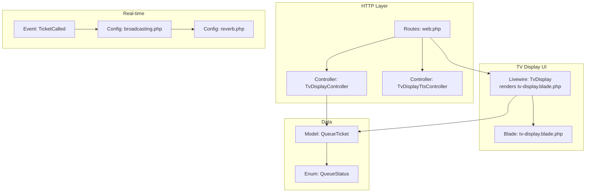
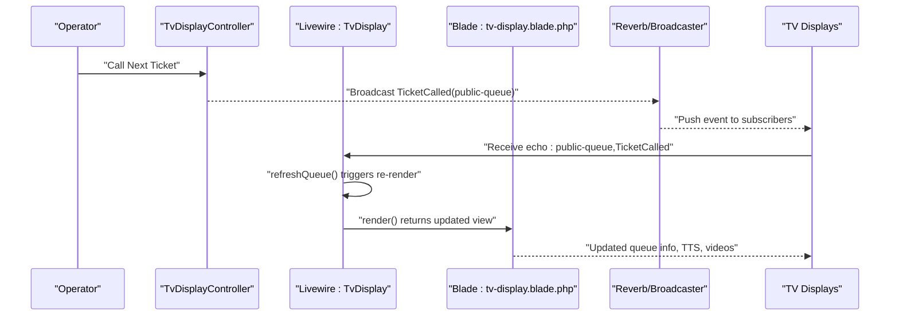
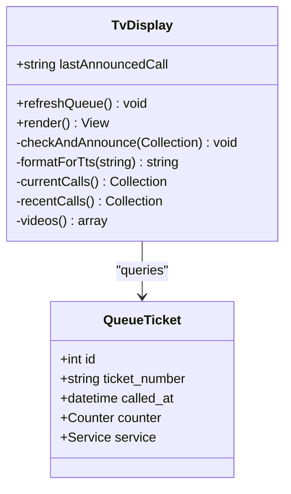
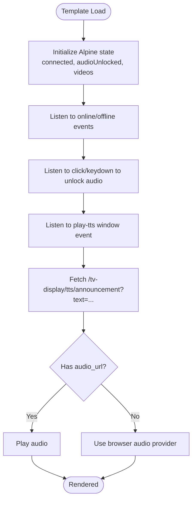
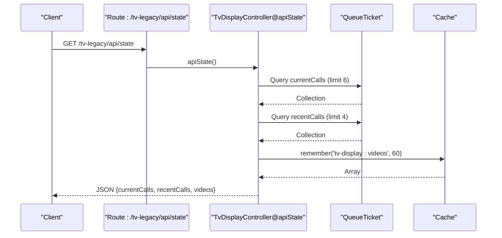
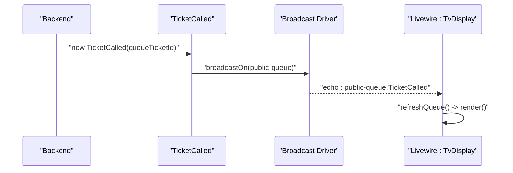
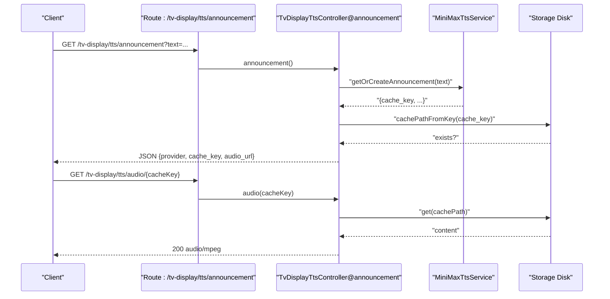
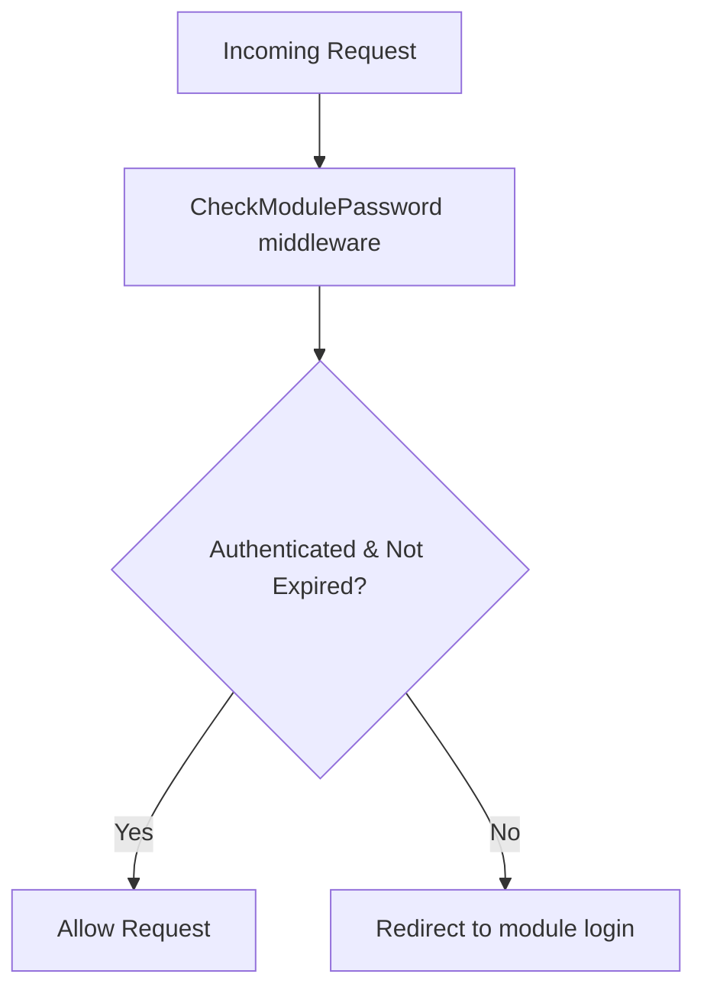
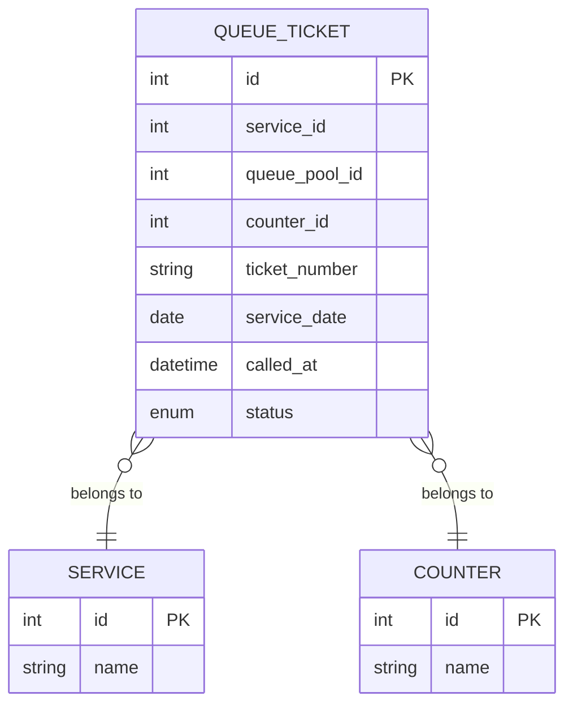
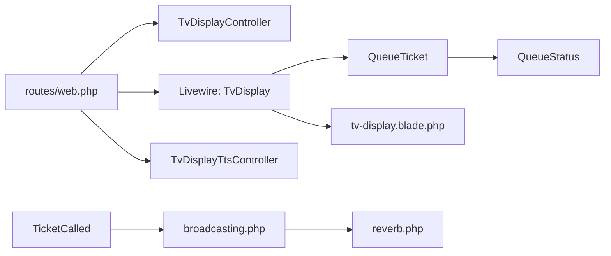

# Real-time Queue Monitoring

<cite>
**Referenced Files in This Document**
- [TvDisplay.php](file://app/Livewire/TvDisplay.php)
- [tv-display.blade.php](file://resources/views/livewire/tv-display.blade.php)
- [TvDisplayController.php](file://app/Http/Controllers/TvDisplayController.php)
- [web.php](file://routes/web.php)
- [api.php](file://routes/api.php)
- [broadcasting.php](file://config/broadcasting.php)
- [reverb.php](file://config/reverb.php)
- [TicketCalled.php](file://app/Events/TicketCalled.php)
- [TvDisplayTtsController.php](file://app/Http/Controllers/TvDisplayTtsController.php)
- [CheckModulePassword.php](file://app/Http/Middleware/CheckModulePassword.php)
- [QueueStatus.php](file://app/Enums/QueueStatus.php)
- [QueueTicket.php](file://app/Models/QueueTicket.php)
- [index.blade.php](file://resources/views/pages/tv-display/index.blade.php)
- [login.blade.php](file://resources/views/pages/tv-display/login.blade.php)
- [tv-display.js](file://resources/js/tv-display.js)
</cite>

## Table of Contents
1. [Introduction](#introduction)
2. [Project Structure](#project-structure)
3. [Core Components](#core-components)
4. [Architecture Overview](#architecture-overview)
5. [Detailed Component Analysis](#detailed-component-analysis)
6. [Dependency Analysis](#dependency-analysis)
7. [Performance Considerations](#performance-considerations)
8. [Troubleshooting Guide](#troubleshooting-guide)
9. [Conclusion](#conclusion)

## Introduction
This document explains the Real-time Queue Monitoring system that powers TV displays for queue management. It covers Livewire-based dynamic updates, the API endpoints that supply current and recent queue calls, the broadcast system synchronizing queue state across multiple displays, queue status filtering, pagination and caching, and integration with Laravel Reverb for real-time communication. It also provides performance optimization techniques for smooth display updates under frequent data changes.

## Project Structure
The TV monitoring system is composed of:
- Livewire component that renders the TV display and reacts to real-time events
- Blade templates for the TV display layout and login
- Controller that serves both the Livewire page and a legacy API endpoint
- Routes that expose login, index, and legacy API endpoints
- Broadcasting configuration for Reverb/Pusher
- Event that broadcasts queue changes to subscribed clients
- TTS controller for audio announcements
- Middleware for module password protection
- Eloquent model and enum for queue data and statuses

**Diagram sources**
- [TvDisplay.php:18-39](file://app/Livewire/TvDisplay.php#L18-L39)
- [tv-display.blade.php:1-213](file://resources/views/livewire/tv-display.blade.php#L1-L213)
- [web.php:108-124](file://routes/web.php#L108-L124)
- [TvDisplayController.php:52-142](file://app/Http/Controllers/TvDisplayController.php#L52-L142)
- [TvDisplayTtsController.php:12-61](file://app/Http/Controllers/TvDisplayTtsController.php#L12-L61)
- [TicketCalled.php:11-33](file://app/Events/TicketCalled.php#L11-L33)
- [broadcasting.php:31-47](file://config/broadcasting.php#L31-L47)
- [reverb.php:29-55](file://config/reverb.php#L29-L55)
- [QueueTicket.php:12-77](file://app/Models/QueueTicket.php#L12-L77)
- [QueueStatus.php:5-37](file://app/Enums/QueueStatus.php#L5-L37)

**Section sources**
- [web.php:108-124](file://routes/web.php#L108-L124)
- [TvDisplay.php:18-39](file://app/Livewire/TvDisplay.php#L18-L39)
- [tv-display.blade.php:1-213](file://resources/views/livewire/tv-display.blade.php#L1-L213)
- [TvDisplayController.php:52-142](file://app/Http/Controllers/TvDisplayController.php#L52-L142)
- [TicketCalled.php:11-33](file://app/Events/TicketCalled.php#L11-L33)
- [broadcasting.php:31-47](file://config/broadcasting.php#L31-L47)
- [reverb.php:29-55](file://config/reverb.php#L29-L55)
- [QueueTicket.php:12-77](file://app/Models/QueueTicket.php#L12-L77)
- [QueueStatus.php:5-37](file://app/Enums/QueueStatus.php#L5-L37)

## Core Components
- Livewire component for TV display rendering and real-time updates
- Blade template for the TV display layout, including video playback and TTS integration
- Controller serving the TV display page and legacy API endpoint
- Broadcasting configuration and event for real-time synchronization
- TTS controller for audio announcements via external provider
- Middleware enforcing module password protection
- Data model and enum for queue tickets and statuses

**Section sources**
- [TvDisplay.php:18-39](file://app/Livewire/TvDisplay.php#L18-L39)
- [tv-display.blade.php:1-213](file://resources/views/livewire/tv-display.blade.php#L1-L213)
- [TvDisplayController.php:52-142](file://app/Http/Controllers/TvDisplayController.php#L52-L142)
- [TicketCalled.php:11-33](file://app/Events/TicketCalled.php#L11-L33)
- [TvDisplayTtsController.php:12-61](file://app/Http/Controllers/TvDisplayTtsController.php#L12-L61)
- [CheckModulePassword.php:10-33](file://app/Http/Middleware/CheckModulePassword.php#L10-L33)
- [QueueTicket.php:12-77](file://app/Models/QueueTicket.php#L12-L77)
- [QueueStatus.php:5-37](file://app/Enums/QueueStatus.php#L5-L37)

## Architecture Overview
The system combines a Livewire-driven UI with Laravel Reverb for real-time updates. When a ticket is called, an event is dispatched to a public channel. Livewire components listening on that channel trigger a re-render, updating the display instantly. A legacy API endpoint provides current and recent queue data for non-Livewire displays. TTS announcements are generated via a dedicated controller and stored for efficient playback.

**Diagram sources**
- [TicketCalled.php:11-33](file://app/Events/TicketCalled.php#L11-L33)
- [TvDisplay.php:22-27](file://app/Livewire/TvDisplay.php#L22-L27)
- [TvDisplayController.php:89-142](file://app/Http/Controllers/TvDisplayController.php#L89-L142)
- [broadcasting.php:31-47](file://config/broadcasting.php#L31-L47)
- [reverb.php:29-55](file://config/reverb.php#L29-L55)

## Detailed Component Analysis

### Livewire TV Display Component
The Livewire component orchestrates:
- Real-time refresh via an event listener
- Rendering current and recent calls
- TTS announcement logic with phonetic formatting
- Video playlist caching and playback

**Diagram sources**
- [TvDisplay.php:18-142](file://app/Livewire/TvDisplay.php#L18-L142)
- [QueueTicket.php:12-77](file://app/Models/QueueTicket.php#L12-L77)

**Section sources**
- [TvDisplay.php:18-39](file://app/Livewire/TvDisplay.php#L18-L39)
- [TvDisplay.php:41-68](file://app/Livewire/TvDisplay.php#L41-L68)
- [TvDisplay.php:85-113](file://app/Livewire/TvDisplay.php#L85-L113)
- [TvDisplay.php:118-140](file://app/Livewire/TvDisplay.php#L118-L140)

### TV Display Blade Template
The Blade template:
- Initializes Alpine.js state for connectivity, audio unlocking, and video playback
- Listens for TTS announcements and fetches audio URLs
- Renders current calls, recent history, branding, and optional video playlist
- Provides a fallback YouTube playlist when no local videos are available

**Diagram sources**
- [tv-display.blade.php:2-40](file://resources/views/livewire/tv-display.blade.php#L2-L40)
- [tv-display.blade.php:96-174](file://resources/views/livewire/tv-display.blade.php#L96-L174)

**Section sources**
- [tv-display.blade.php:1-213](file://resources/views/livewire/tv-display.blade.php#L1-L213)

### TV Display Controller and Legacy API
The controller exposes:
- Index page for the TV display
- Login/logout endpoints with module password middleware
- Legacy API endpoint returning current and recent calls plus videos

**Diagram sources**
- [web.php:121-122](file://routes/web.php#L121-L122)
- [TvDisplayController.php:89-142](file://app/Http/Controllers/TvDisplayController.php#L89-L142)

**Section sources**
- [TvDisplayController.php:52-55](file://app/Http/Controllers/TvDisplayController.php#L52-L55)
- [TvDisplayController.php:89-142](file://app/Http/Controllers/TvDisplayController.php#L89-L142)

### Broadcasting and Real-time Updates
The system uses a broadcast event to synchronize queue state across displays:
- Event is dispatched when a ticket is called
- Broadcast channel is public-queue
- Livewire listens for echo events and triggers re-render

**Diagram sources**
- [TicketCalled.php:11-33](file://app/Events/TicketCalled.php#L11-L33)
- [TvDisplay.php:22-27](file://app/Livewire/TvDisplay.php#L22-L27)
- [broadcasting.php:31-47](file://config/broadcasting.php#L31-L47)
- [reverb.php:29-55](file://config/reverb.php#L29-L55)

**Section sources**
- [TicketCalled.php:11-33](file://app/Events/TicketCalled.php#L11-L33)
- [TvDisplay.php:22-27](file://app/Livewire/TvDisplay.php#L22-L27)
- [broadcasting.php:31-47](file://config/broadcasting.php#L31-L47)
- [reverb.php:29-55](file://config/reverb.php#L29-L55)

### TTS Announcement Controller
The TTS controller:
- Validates text input and generates audio via external provider
- Returns either a cache key and audio URL or falls back to browser audio
- Serves audio files from storage with appropriate headers

**Diagram sources**
- [TvDisplayTtsController.php:14-60](file://app/Http/Controllers/TvDisplayTtsController.php#L14-L60)
- [web.php:123-124](file://routes/web.php#L123-L124)

**Section sources**
- [TvDisplayTtsController.php:14-60](file://app/Http/Controllers/TvDisplayTtsController.php#L14-L60)

### Authentication and Access Control
Module password middleware enforces secure access to TV display pages:
- Validates session keys and timestamps
- Redirects unauthenticated users to login
- Supports multiple modules with consistent session handling

**Diagram sources**
- [CheckModulePassword.php:17-33](file://app/Http/Middleware/CheckModulePassword.php#L17-L33)

**Section sources**
- [CheckModulePassword.php:10-33](file://app/Http/Middleware/CheckModulePassword.php#L10-L33)

### Data Model and Status Filtering
Queue data is filtered by status and date, with eager loading for counters and services:
- Current calls: tickets with status "called" and today's date
- Recent calls: tickets with today's date and non-null called_at
- Videos: cached file listing from storage with allowed extensions

**Diagram sources**
- [QueueTicket.php:17-52](file://app/Models/QueueTicket.php#L17-L52)
- [QueueStatus.php:5-13](file://app/Enums/QueueStatus.php#L5-L13)

**Section sources**
- [QueueTicket.php:12-77](file://app/Models/QueueTicket.php#L12-L77)
- [QueueStatus.php:5-37](file://app/Enums/QueueStatus.php#L5-L37)
- [TvDisplay.php:85-113](file://app/Livewire/TvDisplay.php#L85-L113)
- [TvDisplayController.php:89-142](file://app/Http/Controllers/TvDisplayController.php#L89-L142)

## Dependency Analysis
The TV monitoring system exhibits clear separation of concerns:
- Routes delegate to controllers and Livewire components
- Livewire depends on models and enums for data retrieval and status representation
- Broadcasting configuration integrates with Reverb for real-time updates
- TTS controller depends on external service and storage for audio delivery
- Middleware ensures secure access to module-specific pages

**Diagram sources**
- [web.php:108-124](file://routes/web.php#L108-L124)
- [TvDisplay.php:18-39](file://app/Livewire/TvDisplay.php#L18-L39)
- [QueueTicket.php:12-77](file://app/Models/QueueTicket.php#L12-L77)
- [QueueStatus.php:5-37](file://app/Enums/QueueStatus.php#L5-L37)
- [TicketCalled.php:11-33](file://app/Events/TicketCalled.php#L11-L33)
- [broadcasting.php:31-47](file://config/broadcasting.php#L31-L47)
- [reverb.php:29-55](file://config/reverb.php#L29-L55)
- [TvDisplayTtsController.php:12-61](file://app/Http/Controllers/TvDisplayTtsController.php#L12-L61)

**Section sources**
- [web.php:108-124](file://routes/web.php#L108-L124)
- [TvDisplay.php:18-39](file://app/Livewire/TvDisplay.php#L18-L39)
- [TicketCalled.php:11-33](file://app/Events/TicketCalled.php#L11-L33)
- [broadcasting.php:31-47](file://config/broadcasting.php#L31-L47)
- [reverb.php:29-55](file://config/reverb.php#L29-L55)
- [TvDisplayTtsController.php:12-61](file://app/Http/Controllers/TvDisplayTtsController.php#L12-L61)

## Performance Considerations
- Minimize database queries by eager-loading related models (counter, service) and limiting result sets
- Cache video file listings to avoid repeated filesystem scans
- Use real-time broadcasting to reduce polling overhead
- Optimize TTS generation and caching to avoid repeated synthesis
- Employ Alpine.js animations judiciously to prevent layout thrashing
- Ensure proper caching headers for audio assets to improve playback reliability

[No sources needed since this section provides general guidance]

## Troubleshooting Guide
Common issues and resolutions:
- No real-time updates on displays: verify broadcasting driver configuration and that clients are subscribed to the public-queue channel
- TTS audio not playing: confirm the TTS controller returns a valid audio URL or falls back to browser audio; check storage disk permissions and cache key validity
- Videos not playing: ensure allowed file extensions and that the video cache is populated; verify autoplay policies and audio unlocking
- Authentication failures: confirm module password middleware is applied and session keys are set with valid timestamps

**Section sources**
- [broadcasting.php:31-47](file://config/broadcasting.php#L31-L47)
- [reverb.php:29-55](file://config/reverb.php#L29-L55)
- [TvDisplayTtsController.php:41-60](file://app/Http/Controllers/TvDisplayTtsController.php#L41-L60)
- [CheckModulePassword.php:17-33](file://app/Http/Middleware/CheckModulePassword.php#L17-L33)

## Conclusion
The Real-time Queue Monitoring system leverages Livewire and Laravel Reverb to deliver seamless, synchronized updates across multiple TV displays. The combination of event-driven updates, efficient data retrieval, caching strategies, and TTS integration ensures a responsive and accessible queue display experience. Proper configuration of broadcasting and middleware guarantees secure and reliable operation.