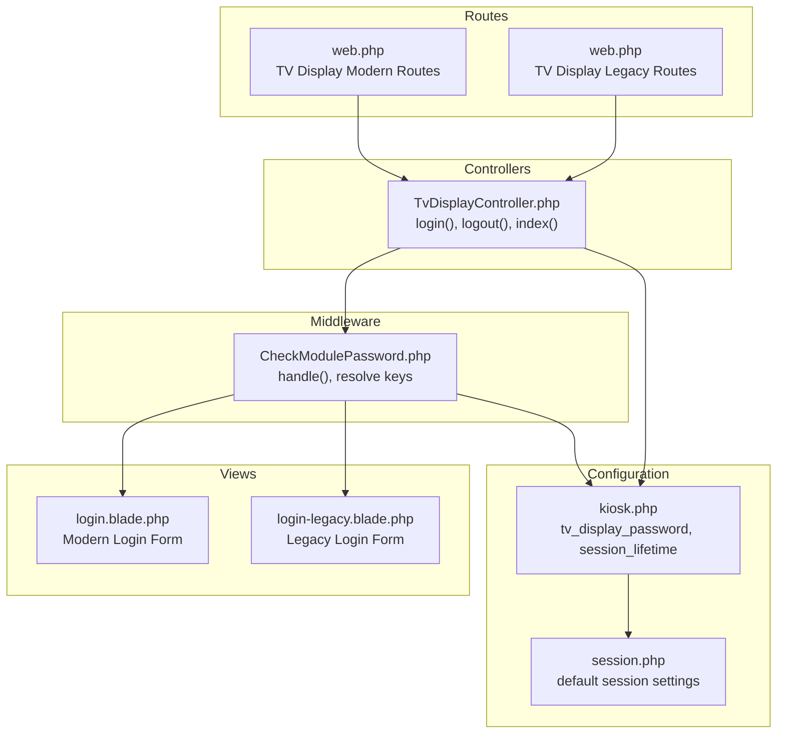
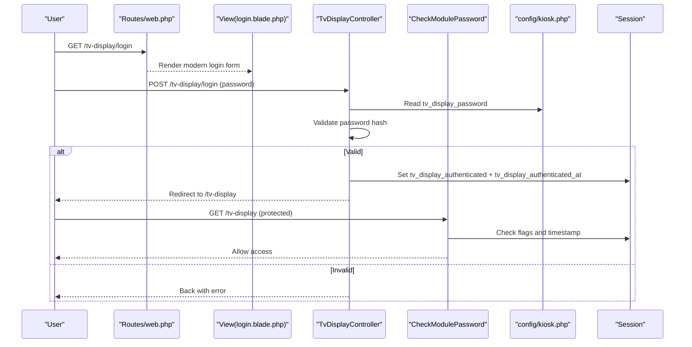
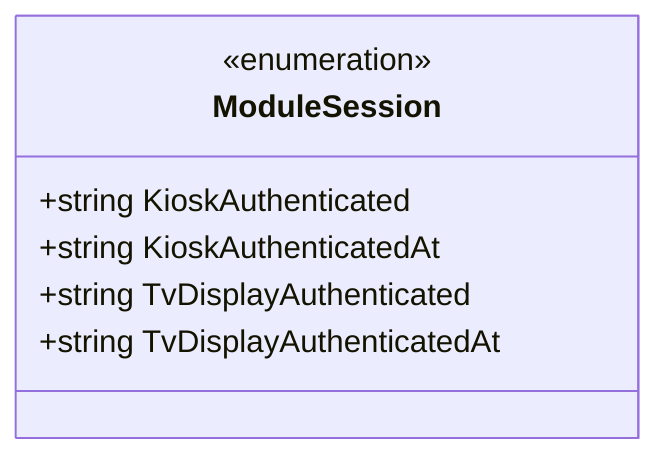
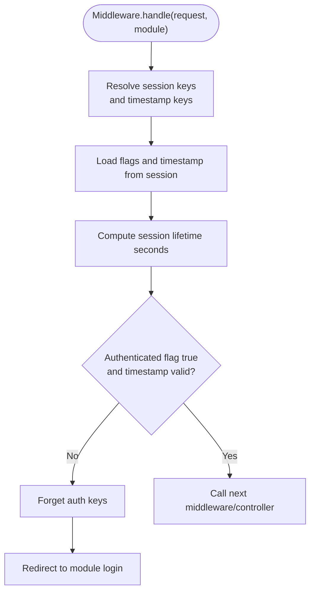
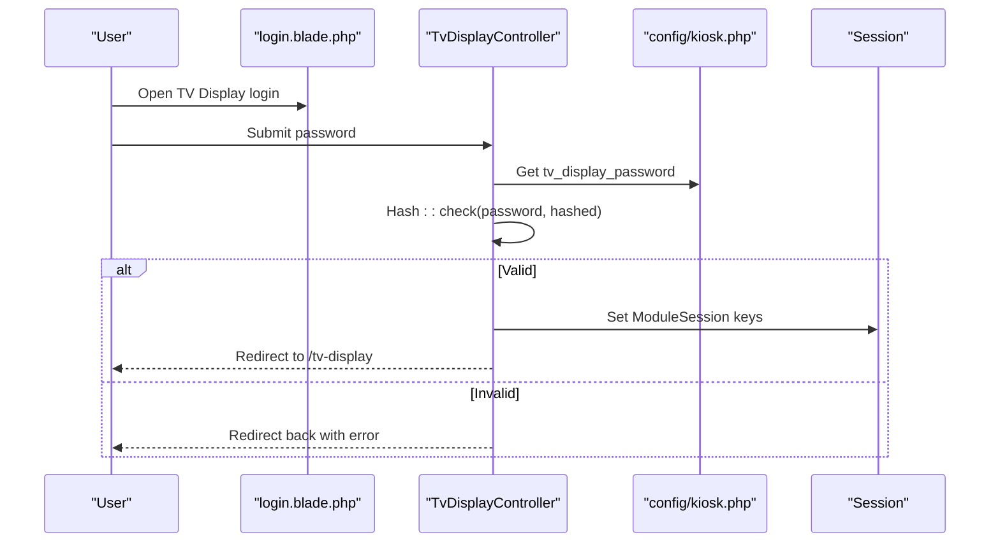
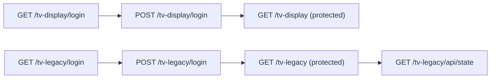
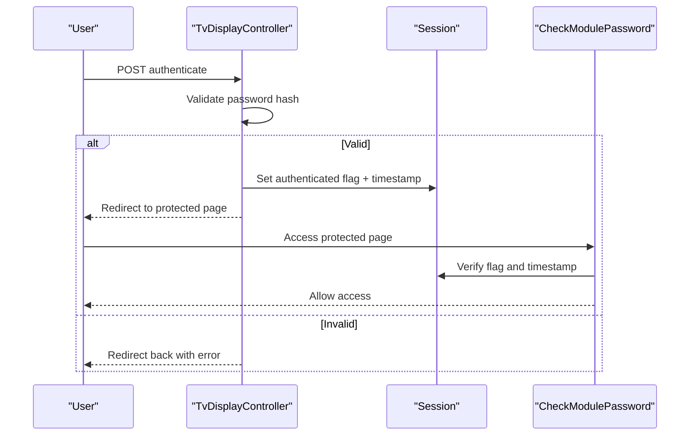
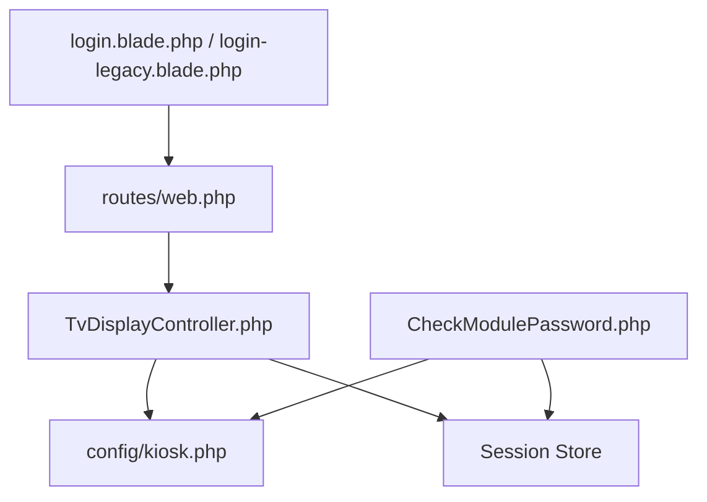

# TV Display Authentication

<cite>
**Referenced Files in This Document**
- [ModuleSession.php](file://app/Enums/ModuleSession.php)
- [CheckModulePassword.php](file://app/Http/Middleware/CheckModulePassword.php)
- [TvDisplayController.php](file://app/Http/Controllers/TvDisplayController.php)
- [KioskController.php](file://app/Http/Controllers/KioskController.php)
- [web.php](file://routes/web.php)
- [kiosk.php](file://config/kiosk.php)
- [login.blade.php](file://resources/views/pages/tv-display/login.blade.php)
- [login-legacy.blade.php](file://resources/views/pages/tv-display/login-legacy.blade.php)
- [TvDisplayAuthLoginTest.php](file://tests/Feature/TvDisplay/TvDisplayAuthLoginTest.php)
- [session.php](file://config/session.php)
</cite>

## Table of Contents
1. [Introduction](#introduction)
2. [Project Structure](#project-structure)
3. [Core Components](#core-components)
4. [Architecture Overview](#architecture-overview)
5. [Detailed Component Analysis](#detailed-component-analysis)
6. [Dependency Analysis](#dependency-analysis)
7. [Performance Considerations](#performance-considerations)
8. [Security Considerations](#security-considerations)
9. [Troubleshooting Guide](#troubleshooting-guide)
10. [Conclusion](#conclusion)

## Introduction
This document explains the TV Display Authentication system used to protect the public-facing TV display module. The system uses a password-based authentication mechanism with hashed passwords stored in configuration. It documents the authentication flow (login validation, session management, and logout), the role of the ModuleSession enum for tracking authenticated state, differences between modern and legacy authentication methods, backward compatibility support, security considerations, password hashing mechanisms, session timeout handling, and troubleshooting steps including password reset procedures.

## Project Structure
The TV Display authentication spans several layers:
- Routes define login, authenticate, and protected routes for both modern and legacy TV display modules.
- Controllers implement login, logout, and protected page rendering.
- Middleware enforces session validity and redirects unauthenticated requests.
- Configuration stores hashed passwords and session lifetime.
- Views render the login forms for modern and legacy modes.
- Tests validate authentication behavior.

**Diagram sources**
- [web.php:108-124](file://routes/web.php#L108-L124)
- [TvDisplayController.php:16-144](file://app/Http/Controllers/TvDisplayController.php#L16-L144)
- [CheckModulePassword.php:10-68](file://app/Http/Middleware/CheckModulePassword.php#L10-L68)
- [kiosk.php:1-8](file://config/kiosk.php#L1-L8)
- [session.php:1-218](file://config/session.php#L1-L218)
- [login.blade.php:1-84](file://resources/views/pages/tv-display/login.blade.php#L1-L84)
- [login-legacy.blade.php:1-102](file://resources/views/pages/tv-display/login-legacy.blade.php#L1-L102)

**Section sources**
- [web.php:108-124](file://routes/web.php#L108-L124)
- [TvDisplayController.php:16-144](file://app/Http/Controllers/TvDisplayController.php#L16-L144)
- [CheckModulePassword.php:10-68](file://app/Http/Middleware/CheckModulePassword.php#L10-L68)
- [kiosk.php:1-8](file://config/kiosk.php#L1-L8)
- [session.php:1-218](file://config/session.php#L1-L218)
- [login.blade.php:1-84](file://resources/views/pages/tv-display/login.blade.php#L1-L84)
- [login-legacy.blade.php:1-102](file://resources/views/pages/tv-display/login-legacy.blade.php#L1-L102)

## Core Components
- ModuleSession enum: Defines session keys for tracking authentication state for modules (kiosk and TV display).
- CheckModulePassword middleware: Validates authentication flags and timestamps, enforces session lifetime, and redirects to login when invalid.
- TvDisplayController: Handles TV display login, logout, and protected page rendering.
- Configuration: Stores hashed passwords and session lifetime values.
- Views: Provide login forms for modern and legacy TV display modes.

**Section sources**
- [ModuleSession.php:8-14](file://app/Enums/ModuleSession.php#L8-L14)
- [CheckModulePassword.php:17-33](file://app/Http/Middleware/CheckModulePassword.php#L17-L33)
- [TvDisplayController.php:23-50](file://app/Http/Controllers/TvDisplayController.php#L23-L50)
- [kiosk.php:4-6](file://config/kiosk.php#L4-L6)

## Architecture Overview
The authentication architecture separates concerns across routing, controller actions, middleware, configuration, and views. Authentication is module-specific and independent from the main application user authentication.

**Diagram sources**
- [web.php:108-114](file://routes/web.php#L108-L114)
- [login.blade.php:58-78](file://resources/views/pages/tv-display/login.blade.php#L58-L78)
- [TvDisplayController.php:23-43](file://app/Http/Controllers/TvDisplayController.php#L23-L43)
- [CheckModulePassword.php:17-33](file://app/Http/Middleware/CheckModulePassword.php#L17-L33)
- [kiosk.php:5](file://config/kiosk.php#L5)

## Detailed Component Analysis

### ModuleSession Enum
The enum centralizes session key constants for module authentication, ensuring consistency across controllers and middleware.

**Diagram sources**
- [ModuleSession.php:8-14](file://app/Enums/ModuleSession.php#L8-L14)

**Section sources**
- [ModuleSession.php:8-14](file://app/Enums/ModuleSession.php#L8-L14)

### CheckModulePassword Middleware
The middleware enforces authentication for TV display and kiosk modules:
- Resolves session keys for authentication flag and timestamp based on module name.
- Checks if the module is authenticated and whether the timestamp is within the configured session lifetime.
- Redirects to the appropriate login URL if validation fails.

**Diagram sources**
- [CheckModulePassword.php:17-33](file://app/Http/Middleware/CheckModulePassword.php#L17-L33)
- [CheckModulePassword.php:47-66](file://app/Http/Middleware/CheckModulePassword.php#L47-L66)

**Section sources**
- [CheckModulePassword.php:17-33](file://app/Http/Middleware/CheckModulePassword.php#L17-L33)
- [CheckModulePassword.php:38-45](file://app/Http/Middleware/CheckModulePassword.php#L38-L45)
- [CheckModulePassword.php:47-66](file://app/Http/Middleware/CheckModulePassword.php#L47-L66)

### TvDisplayController
Handles TV display authentication and protected routes:
- Login validates password against the hashed configuration value and sets session keys.
- Logout clears session keys.
- Protected index page is rendered after successful authentication.
- Legacy login and page rendering are supported for backward compatibility.

**Diagram sources**
- [login.blade.php:58-78](file://resources/views/pages/tv-display/login.blade.php#L58-L78)
- [TvDisplayController.php:23-43](file://app/Http/Controllers/TvDisplayController.php#L23-L43)
- [kiosk.php:5](file://config/kiosk.php#L5)

**Section sources**
- [TvDisplayController.php:18-21](file://app/Http/Controllers/TvDisplayController.php#L18-L21)
- [TvDisplayController.php:23-43](file://app/Http/Controllers/TvDisplayController.php#L23-L43)
- [TvDisplayController.php:45-50](file://app/Http/Controllers/TvDisplayController.php#L45-L50)
- [TvDisplayController.php:52-55](file://app/Http/Controllers/TvDisplayController.php#L52-L55)
- [TvDisplayController.php:57-60](file://app/Http/Controllers/TvDisplayController.php#L57-L60)
- [TvDisplayController.php:62-82](file://app/Http/Controllers/TvDisplayController.php#L62-L82)
- [TvDisplayController.php:84-87](file://app/Http/Controllers/TvDisplayController.php#L84-L87)

### Routes and Protected Access
Routes define:
- Login endpoints for modern and legacy TV display.
- Authentication endpoints that validate passwords.
- Protected routes gated by the module password middleware.
- Additional legacy endpoints for API state and TTS audio.

**Diagram sources**
- [web.php:108-124](file://routes/web.php#L108-L124)

**Section sources**
- [web.php:108-124](file://routes/web.php#L108-L124)

### Views: Modern and Legacy Login Forms
- Modern login form posts to the TV display authenticate route and renders validation errors.
- Legacy login form posts to the legacy authenticate route and targets a Bootstrap-based layout.

**Section sources**
- [login.blade.php:58-78](file://resources/views/pages/tv-display/login.blade.php#L58-L78)
- [login-legacy.blade.php:75-96](file://resources/views/pages/tv-display/login-legacy.blade.php#L75-L96)

### Authentication Flow: Login Validation, Session Management, Logout
- Login validation compares the submitted password against the hashed configuration value using the framework’s hashing verification.
- On success, two session keys are set: one boolean flag and one timestamp.
- Middleware checks both keys and session lifetime before allowing access.
- Logout clears both session keys and redirects to the login page.

**Diagram sources**
- [TvDisplayController.php:23-43](file://app/Http/Controllers/TvDisplayController.php#L23-L43)
- [CheckModulePassword.php:17-33](file://app/Http/Middleware/CheckModulePassword.php#L17-L33)

**Section sources**
- [TvDisplayController.php:23-43](file://app/Http/Controllers/TvDisplayController.php#L23-L43)
- [CheckModulePassword.php:17-33](file://app/Http/Middleware/CheckModulePassword.php#L17-L33)

### ModuleSession Usage for Tracking Authenticated State
The enum defines:
- tv_display_authenticated: Boolean flag indicating successful authentication.
- tv_display_authenticated_at: Unix timestamp of authentication for session lifetime checks.

These keys are used consistently by the controller during login and by the middleware during access checks.

**Section sources**
- [ModuleSession.php:12-13](file://app/Enums/ModuleSession.php#L12-L13)
- [TvDisplayController.php:37-40](file://app/Http/Controllers/TvDisplayController.php#L37-L40)
- [CheckModulePassword.php:19-24](file://app/Http/Middleware/CheckModulePassword.php#L19-L24)

### Difference Between Modern and Legacy Authentication Methods
- Modern TV display: Uses a Flux-based Blade layout with a contemporary login form and protected page rendering.
- Legacy TV display: Uses a plain HTML layout with a Bootstrap-styled form and additional endpoints for API state and TTS audio.
- Both rely on the same password hashing and session management logic.

**Section sources**
- [login.blade.php:1](file://resources/views/pages/tv-display/login.blade.php#L1)
- [login-legacy.blade.php:1](file://resources/views/pages/tv-display/login-legacy.blade.php#L1)
- [web.php:117-124](file://routes/web.php#L117-L124)

### Backward Compatibility Support
- Legacy routes and views are maintained alongside modern ones.
- Legacy authentication follows the same password hashing and session validation logic.
- Legacy endpoints provide API state and TTS audio for older devices.

**Section sources**
- [web.php:117-124](file://routes/web.php#L117-L124)
- [TvDisplayController.php:57-87](file://app/Http/Controllers/TvDisplayController.php#L57-L87)

### Password Hashing Mechanisms
- Passwords are stored as hashes in configuration.
- Authentication uses the framework’s hashing verification to compare submitted passwords with stored hashes.
- Tests confirm successful login with a hashed password and rejection of incorrect passwords.

**Section sources**
- [kiosk.php:5](file://config/kiosk.php#L5)
- [TvDisplayController.php:29-35](file://app/Http/Controllers/TvDisplayController.php#L29-L35)
- [TvDisplayController.php:68-74](file://app/Http/Controllers/TvDisplayController.php#L68-L74)
- [TvDisplayAuthLoginTest.php:5-14](file://tests/Feature/TvDisplay/TvDisplayAuthLoginTest.php#L5-L14)
- [TvDisplayAuthLoginTest.php:16-24](file://tests/Feature/TvDisplay/TvDisplayAuthLoginTest.php#L16-L24)

### Session Timeout Handling
- Session lifetime is configurable and multiplied by 60 to convert minutes to seconds.
- Middleware checks both the presence of the timestamp and whether the elapsed time exceeds the configured lifetime.
- If invalid, the middleware forgets both keys and redirects to the login page.

**Section sources**
- [kiosk.php:6](file://config/kiosk.php#L6)
- [CheckModulePassword.php:24](file://app/Http/Middleware/CheckModulePassword.php#L24)
- [CheckModulePassword.php:26-30](file://app/Http/Middleware/CheckModulePassword.php#L26-L30)

## Dependency Analysis
The authentication system exhibits clear separation of concerns:
- Routes depend on controllers for handling requests.
- Controllers depend on configuration for hashed passwords and on the session store for authentication state.
- Middleware depends on session state and configuration to enforce access.
- Views depend on routes for form actions and on the controller for rendering protected pages.

**Diagram sources**
- [web.php:108-124](file://routes/web.php#L108-L124)
- [TvDisplayController.php:16-144](file://app/Http/Controllers/TvDisplayController.php#L16-L144)
- [CheckModulePassword.php:10-68](file://app/Http/Middleware/CheckModulePassword.php#L10-L68)
- [kiosk.php:1-8](file://config/kiosk.php#L1-L8)

**Section sources**
- [web.php:108-124](file://routes/web.php#L108-L124)
- [TvDisplayController.php:16-144](file://app/Http/Controllers/TvDisplayController.php#L16-L144)
- [CheckModulePassword.php:10-68](file://app/Http/Middleware/CheckModulePassword.php#L10-L68)
- [kiosk.php:1-8](file://config/kiosk.php#L1-L8)

## Performance Considerations
- Password verification occurs on each login attempt; ensure the hashed password is precomputed to avoid runtime computation overhead.
- Session lifetime checks are lightweight; ensure session storage is performant (e.g., database or Redis).
- Avoid excessive logging of authentication attempts to reduce I/O overhead.

## Security Considerations
- Passwords are stored as hashes in configuration; ensure environment variables are properly secured and not exposed in logs.
- Use HTTPS to protect credentials in transit.
- Enforce rate limiting on authentication endpoints to mitigate brute-force attacks.
- Regularly rotate module passwords and update configuration values.
- Validate and sanitize all inputs; the controllers already apply validation rules.

**Section sources**
- [TvDisplayController.php:25-27](file://app/Http/Controllers/TvDisplayController.php#L25-L27)
- [KioskController.php:27-29](file://app/Http/Controllers/KioskController.php#L27-L29)

## Troubleshooting Guide
Common issues and resolutions:
- Wrong password: Ensure the submitted password matches the stored hash. The controller returns an error and redirects back to the login page.
- Session expired: If the session lifetime elapses, the middleware clears keys and redirects to the login page. Adjust the session lifetime configuration if needed.
- Missing hashed password: If the configuration value is empty, authentication will fail. Set the hashed password in configuration.
- Legacy device compatibility: Use the legacy login form and routes for older devices; ensure the legacy endpoints are reachable.

Password reset procedure:
- Update the hashed password value in configuration.
- Confirm the new password works by attempting login.
- Notify users of the new password if applicable.

**Section sources**
- [TvDisplayController.php:31-35](file://app/Http/Controllers/TvDisplayController.php#L31-L35)
- [CheckModulePassword.php:26-30](file://app/Http/Middleware/CheckModulePassword.php#L26-L30)
- [kiosk.php:5](file://config/kiosk.php#L5)

## Conclusion
The TV Display Authentication system provides a secure, module-specific authentication mechanism using hashed passwords and session-based validation. It supports both modern and legacy UIs, enforces session timeouts, and maintains clear separation of concerns across routes, controllers, middleware, configuration, and views. Following the outlined security and troubleshooting practices ensures reliable operation in production environments.