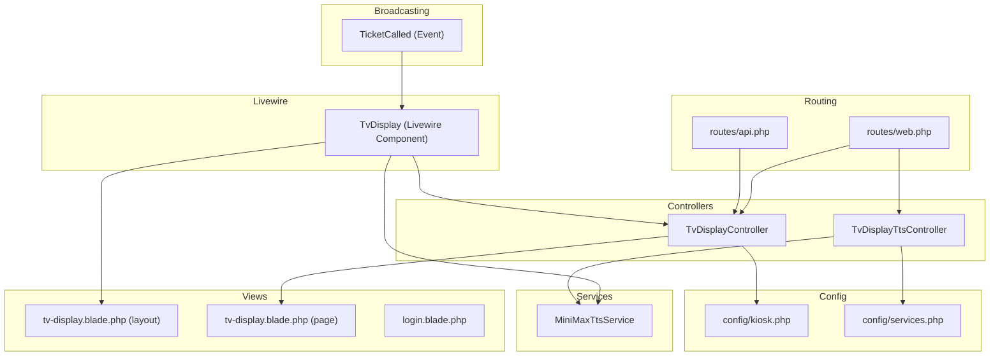
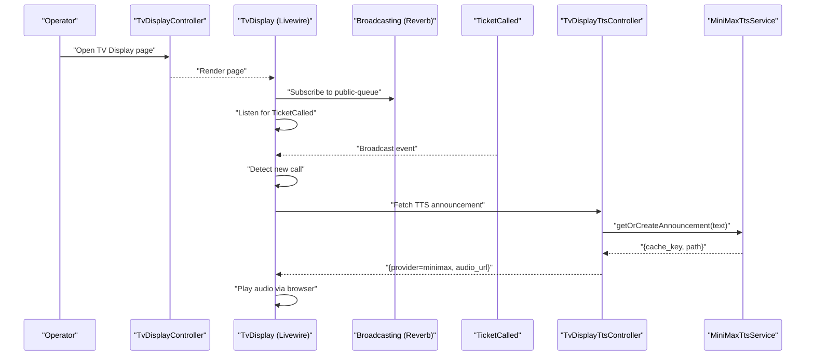
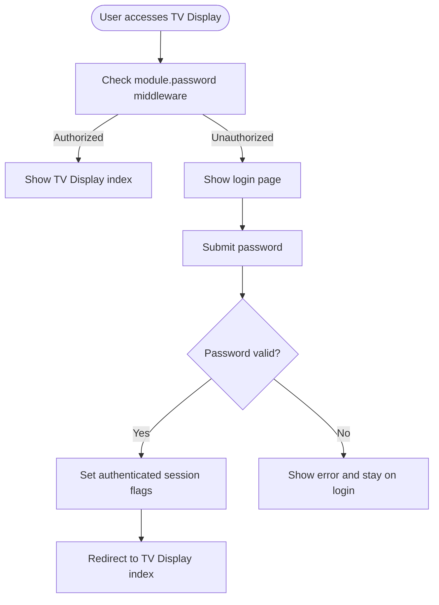
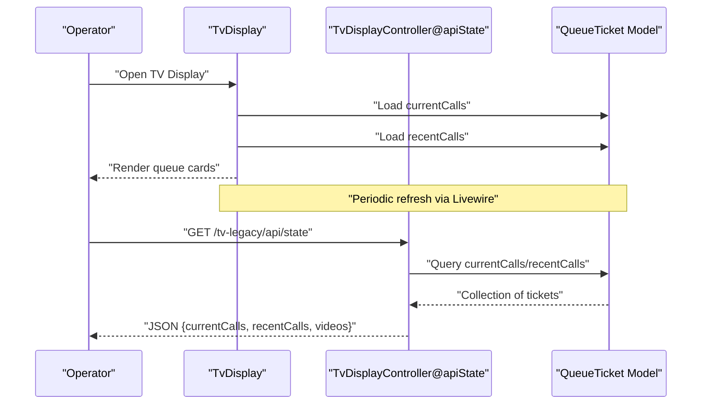
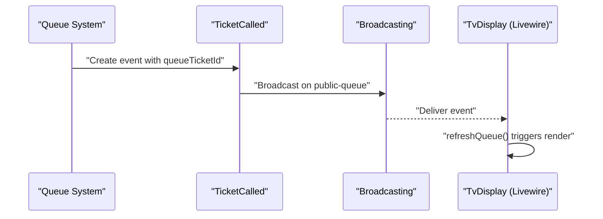
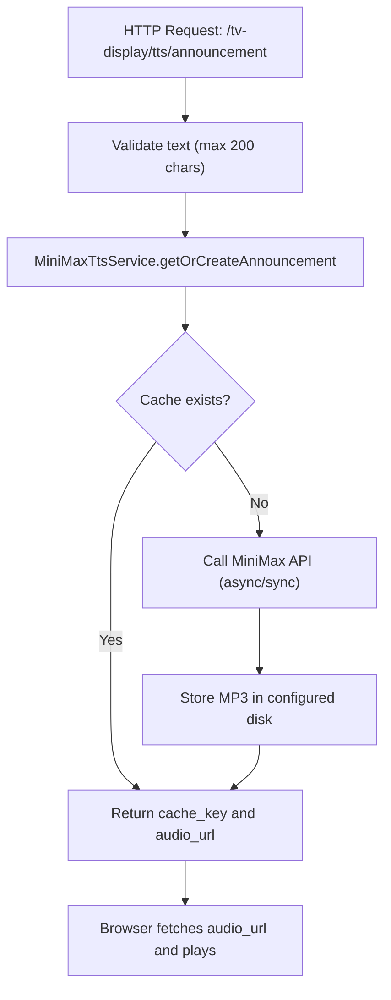
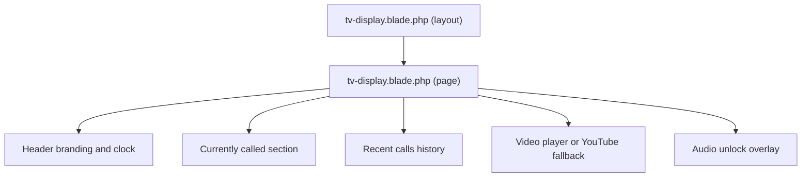
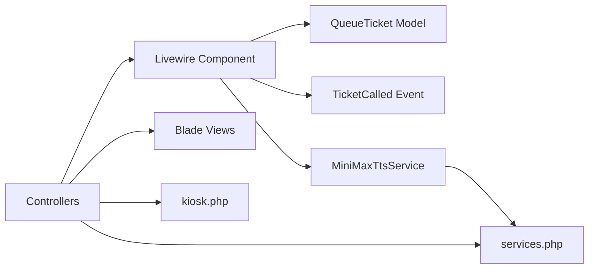

# TV Display Interface

<cite>
**Referenced Files in This Document**
- [TvDisplayController.php](file://app/Http/Controllers/TvDisplayController.php)
- [TvDisplayTtsController.php](file://app/Http/Controllers/TvDisplayTtsController.php)
- [TvDisplay.php](file://app/Livewire/TvDisplay.php)
- [MiniMaxTtsService.php](file://app/Services/Tts/MiniMaxTtsService.php)
- [TicketCalled.php](file://app/Events/TicketCalled.php)
- [web.php](file://routes/web.php)
- [api.php](file://routes/api.php)
- [kiosk.php](file://config/kiosk.php)
- [services.php](file://config/services.php)
- [tv-display.blade.php](file://resources/views/livewire/tv-display.blade.php)
- [tv-display.css](file://resources/css/tv-display.css)
- [tv-display.js](file://resources/js/tv-display.js)
- [tv-display.blade.php](file://resources/views/layouts/tv-display.blade.php)
- [index.blade.php](file://resources/views/pages/tv-display/index.blade.php)
- [login.blade.php](file://resources/views/pages/tv-display/login.blade.php)
</cite>

## Table of Contents
1. [Introduction](#introduction)
2. [Project Structure](#project-structure)
3. [Core Components](#core-components)
4. [Architecture Overview](#architecture-overview)
5. [Detailed Component Analysis](#detailed-component-analysis)
6. [Dependency Analysis](#dependency-analysis)
7. [Performance Considerations](#performance-considerations)
8. [Troubleshooting Guide](#troubleshooting-guide)
9. [Conclusion](#conclusion)

## Introduction
This document explains the TV Display Interface system responsible for real-time queue monitoring and audio announcements on large public displays. It covers:
- Real-time queue monitoring with live updates via server-sent events and Livewire
- Audio announcement system integrating Text-to-Speech (TTS) with MiniMax API for Indonesian voice synthesis
- TV display authentication and module password protection
- Broadcast mechanism pushing queue updates to all connected displays
- Legacy TV display support for older devices
- Layout customization and configuration options
- Performance optimizations for smooth display updates and audio synchronization

## Project Structure
The TV Display system spans controllers, Livewire components, Blade templates, services, configuration, and routing. The structure emphasizes separation of concerns:
- Controllers handle authentication, state retrieval, and TTS endpoints
- Livewire component manages UI rendering, event-driven updates, and TTS dispatch
- Blade templates define the layout and presentation
- Services encapsulate TTS provider integration
- Configuration files centralize credentials and behavior tuning
- Broadcasting integrates with Reverb for real-time updates

**Diagram sources**
- [web.php:108-124](file://routes/web.php#L108-L124)
- [api.php:1-23](file://routes/api.php#L1-L23)
- [TvDisplayController.php:16-144](file://app/Http/Controllers/TvDisplayController.php#L16-L144)
- [TvDisplayTtsController.php:12-62](file://app/Http/Controllers/TvDisplayTtsController.php#L12-L62)
- [TvDisplay.php:18-142](file://app/Livewire/TvDisplay.php#L18-L142)
- [tv-display.blade.php:1-213](file://resources/views/livewire/tv-display.blade.php#L1-L213)
- [tv-display.blade.php:1-31](file://resources/views/layouts/tv-display.blade.php#L1-L31)
- [login.blade.php:1-84](file://resources/views/pages/tv-display/login.blade.php#L1-L84)
- [MiniMaxTtsService.php:11-312](file://app/Services/Tts/MiniMaxTtsService.php#L11-L312)
- [kiosk.php:1-8](file://config/kiosk.php#L1-L8)
- [services.php:45-58](file://config/services.php#L45-L58)
- [TicketCalled.php:11-34](file://app/Events/TicketCalled.php#L11-L34)

**Section sources**
- [web.php:108-124](file://routes/web.php#L108-L124)
- [TvDisplayController.php:16-144](file://app/Http/Controllers/TvDisplayController.php#L16-L144)
- [TvDisplayTtsController.php:12-62](file://app/Http/Controllers/TvDisplayTtsController.php#L12-L62)
- [TvDisplay.php:18-142](file://app/Livewire/TvDisplay.php#L18-L142)
- [tv-display.blade.php:1-213](file://resources/views/livewire/tv-display.blade.php#L1-L213)
- [tv-display.blade.php:1-31](file://resources/views/layouts/tv-display.blade.php#L1-L31)
- [login.blade.php:1-84](file://resources/views/pages/tv-display/login.blade.php#L1-L84)
- [MiniMaxTtsService.php:11-312](file://app/Services/Tts/MiniMaxTtsService.php#L11-L312)
- [kiosk.php:1-8](file://config/kiosk.php#L1-L8)
- [services.php:45-58](file://config/services.php#L45-L58)
- [TicketCalled.php:11-34](file://app/Events/TicketCalled.php#L11-L34)

## Core Components
- Authentication and Access Control
  - TV Display login uses module password middleware and stores an authenticated flag in the session
  - Legacy TV Display supports a separate login flow for older devices
- Real-Time Queue Monitoring
  - Livewire component listens for broadcast events and refreshes the display
  - Backend API endpoint serves current and recent calls for legacy clients
- Audio Announcement System
  - TTS requests are validated and resolved to cached audio via MiniMax API
  - Browser receives a signed URL to play pre-recorded Indonesian audio
- Broadcasting
  - Event dispatched on ticket calls targets a public channel for all displays
- Layout and Presentation
  - Tailwind-based responsive layout optimized for landscape TV viewing
  - Animations and marquee ticker for branding and operational info

**Section sources**
- [TvDisplayController.php:18-87](file://app/Http/Controllers/TvDisplayController.php#L18-L87)
- [TvDisplay.php:22-68](file://app/Livewire/TvDisplay.php#L22-L68)
- [TvDisplayTtsController.php:14-60](file://app/Http/Controllers/TvDisplayTtsController.php#L14-L60)
- [MiniMaxTtsService.php:16-44](file://app/Services/Tts/MiniMaxTtsService.php#L16-L44)
- [TicketCalled.php:11-34](file://app/Events/TicketCalled.php#L11-L34)
- [tv-display.css:6-17](file://resources/css/tv-display.css#L6-L17)
- [tv-display.blade.php:1-213](file://resources/views/livewire/tv-display.blade.php#L1-L213)

## Architecture Overview
The system combines server-side rendering with real-time client updates:
- Authentication secures access to TV Display routes
- Livewire renders the queue display and coordinates audio playback
- Broadcasting ensures all connected displays receive updates simultaneously
- TTS service generates Indonesian audio and caches it for reuse

**Diagram sources**
- [TvDisplayController.php:52-55](file://app/Http/Controllers/TvDisplayController.php#L52-L55)
- [TvDisplay.php:22-68](file://app/Livewire/TvDisplay.php#L22-L68)
- [TicketCalled.php:11-34](file://app/Events/TicketCalled.php#L11-L34)
- [TvDisplayTtsController.php:14-39](file://app/Http/Controllers/TvDisplayTtsController.php#L14-L39)
- [MiniMaxTtsService.php:16-44](file://app/Services/Tts/MiniMaxTtsService.php#L16-L44)

## Detailed Component Analysis

### Authentication and Session Management
- Login flow validates the module password against configuration and sets session flags
- Routes are gated by module password middleware ensuring only authorized access
- Legacy TV Display has a dedicated login and route group

**Diagram sources**
- [web.php:108-114](file://routes/web.php#L108-L114)
- [TvDisplayController.php:18-50](file://app/Http/Controllers/TvDisplayController.php#L18-L50)
- [kiosk.php:4-6](file://config/kiosk.php#L4-L6)

**Section sources**
- [TvDisplayController.php:18-50](file://app/Http/Controllers/TvDisplayController.php#L18-L50)
- [web.php:108-114](file://routes/web.php#L108-L114)
- [kiosk.php:4-6](file://config/kiosk.php#L4-L6)

### Real-Time Queue Monitoring
- Livewire component subscribes to the public-queue channel and refreshes on TicketCalled events
- The render method queries current and recent calls, then checks for new announcements
- Legacy API endpoint serves current and recent calls for older clients

**Diagram sources**
- [TvDisplay.php:22-39](file://app/Livewire/TvDisplay.php#L22-L39)
- [TvDisplay.php:85-113](file://app/Livewire/TvDisplay.php#L85-L113)
- [TvDisplayController.php:89-142](file://app/Http/Controllers/TvDisplayController.php#L89-L142)

**Section sources**
- [TvDisplay.php:22-39](file://app/Livewire/TvDisplay.php#L22-L39)
- [TvDisplay.php:85-113](file://app/Livewire/TvDisplay.php#L85-L113)
- [TvDisplayController.php:89-142](file://app/Http/Controllers/TvDisplayController.php#L89-L142)

### Broadcasting and Event System
- TicketCalled event broadcasts to the public-queue channel
- Livewire component listens for this event and triggers a re-render
- Ensures synchronized updates across multiple displays

**Diagram sources**
- [TicketCalled.php:11-34](file://app/Events/TicketCalled.php#L11-L34)
- [TvDisplay.php:22-27](file://app/Livewire/TvDisplay.php#L22-L27)

**Section sources**
- [TicketCalled.php:11-34](file://app/Events/TicketCalled.php#L11-L34)
- [TvDisplay.php:22-27](file://app/Livewire/TvDisplay.php#L22-L27)

### Audio Announcement System (MiniMax TTS)
- Request validation limits text length and ensures presence
- Service resolves or creates cached audio using MiniMax API
- Two strategies supported: async with polling and fallback sync
- Audio caching avoids repeated network calls and improves responsiveness
- Frontend receives a signed URL and plays the audio automatically

**Diagram sources**
- [TvDisplayTtsController.php:14-39](file://app/Http/Controllers/TvDisplayTtsController.php#L14-L39)
- [MiniMaxTtsService.php:16-44](file://app/Services/Tts/MiniMaxTtsService.php#L16-L44)
- [MiniMaxTtsService.php:53-180](file://app/Services/Tts/MiniMaxTtsService.php#L53-L180)
- [services.php:45-58](file://config/services.php#L45-L58)

**Section sources**
- [TvDisplayTtsController.php:14-60](file://app/Http/Controllers/TvDisplayTtsController.php#L14-L60)
- [MiniMaxTtsService.php:16-44](file://app/Services/Tts/MiniMaxTtsService.php#L16-L44)
- [MiniMaxTtsService.php:53-180](file://app/Services/Tts/MiniMaxTtsService.php#L53-L180)
- [services.php:45-58](file://config/services.php#L45-L58)

### TV Display Layout and Presentation
- Responsive layout optimized for landscape TV screens
- Animated hero card for the currently called ticket with gentle pulse effect
- Marquee ticker for operating hours and contact info
- Video panel supports local MP4/WebM/Ogg files or YouTube fallback
- Browser audio unlock overlay to enable autoplay on first interaction

**Diagram sources**
- [tv-display.blade.php:1-213](file://resources/views/livewire/tv-display.blade.php#L1-L213)
- [tv-display.blade.php:1-31](file://resources/views/layouts/tv-display.blade.php#L1-L31)
- [tv-display.css:6-17](file://resources/css/tv-display.css#L6-L17)

**Section sources**
- [tv-display.blade.php:1-213](file://resources/views/livewire/tv-display.blade.php#L1-L213)
- [tv-display.blade.php:1-31](file://resources/views/layouts/tv-display.blade.php#L1-L31)
- [tv-display.css:6-17](file://resources/css/tv-display.css#L6-L17)

### Legacy TV Display Support
- Dedicated login and route group for legacy devices
- Separate API endpoint returns current and recent calls for polling
- Simplified presentation suitable for older browsers and hardware

**Section sources**
- [web.php:116-124](file://routes/web.php#L116-L124)
- [TvDisplayController.php:57-87](file://app/Http/Controllers/TvDisplayController.php#L57-L87)
- [TvDisplayController.php:89-142](file://app/Http/Controllers/TvDisplayController.php#L89-L142)

## Dependency Analysis
The system exhibits clear separation of concerns with minimal coupling:
- Controllers depend on models and services for data and TTS
- Livewire component depends on models, broadcasting, and TTS service
- Views depend on layout and configuration for branding and assets
- Broadcasting integrates with Reverb for real-time updates

**Diagram sources**
- [TvDisplayController.php:16-144](file://app/Http/Controllers/TvDisplayController.php#L16-L144)
- [TvDisplay.php:18-142](file://app/Livewire/TvDisplay.php#L18-L142)
- [MiniMaxTtsService.php:11-312](file://app/Services/Tts/MiniMaxTtsService.php#L11-L312)
- [TicketCalled.php:11-34](file://app/Events/TicketCalled.php#L11-L34)
- [services.php:45-58](file://config/services.php#L45-L58)
- [kiosk.php:1-8](file://config/kiosk.php#L1-L8)

**Section sources**
- [TvDisplayController.php:16-144](file://app/Http/Controllers/TvDisplayController.php#L16-L144)
- [TvDisplay.php:18-142](file://app/Livewire/TvDisplay.php#L18-L142)
- [MiniMaxTtsService.php:11-312](file://app/Services/Tts/MiniMaxTtsService.php#L11-L312)
- [TicketCalled.php:11-34](file://app/Events/TicketCalled.php#L11-L34)
- [services.php:45-58](file://config/services.php#L45-L58)
- [kiosk.php:1-8](file://config/kiosk.php#L1-L8)

## Performance Considerations
- Caching and Memoization
  - Videos list is cached for 60 seconds to avoid frequent filesystem scans
  - TTS audio is cached by hashing text, voice, and model parameters
- Network Efficiency
  - Async TTS strategy with polling reduces immediate latency spikes
  - Fallback to sync strategy ensures reliability under transient failures
- Rendering Responsiveness
  - Livewire re-render triggered by broadcast events minimizes unnecessary polling
  - CSS animations use GPU-friendly properties for smooth transitions
- Asset Delivery
  - Audio files served with long cache headers and proper MIME types
  - Video playback optimized with playsinline and muted defaults for autoplay

**Section sources**
- [TvDisplay.php:120-136](file://app/Livewire/TvDisplay.php#L120-L136)
- [MiniMaxTtsService.php:35-38](file://app/Services/Tts/MiniMaxTtsService.php#L35-L38)
- [TvDisplayTtsController.php:53-59](file://app/Http/Controllers/TvDisplayTtsController.php#L53-L59)
- [tv-display.css:6-17](file://resources/css/tv-display.css#L6-L17)

## Troubleshooting Guide
- Authentication Failures
  - Verify TV Display password configuration and module password middleware
  - Check session lifetime settings if users are logged out unexpectedly
- Broadcasting Not Updating Displays
  - Confirm Reverb broadcasting is configured and channels are reachable
  - Ensure TicketCalled event is dispatched on queue call actions
- TTS Audio Issues
  - Validate MiniMax API key, voice ID, and model settings
  - Check cache disk permissions and path prefix configuration
  - Inspect async poll attempts and intervals for timeouts
- Legacy API Returns Empty Data
  - Confirm today’s date filters and database connectivity
  - Verify video file extensions and public storage accessibility
- Browser Autoplay Blocked
  - Trigger audio unlock overlay by clicking/tapping the screen
  - Ensure silent audio is allowed and autoplay policies are satisfied

**Section sources**
- [kiosk.php:4-6](file://config/kiosk.php#L4-L6)
- [TicketCalled.php:11-34](file://app/Events/TicketCalled.php#L11-L34)
- [services.php:45-58](file://config/services.php#L45-L58)
- [TvDisplayTtsController.php:43-59](file://app/Http/Controllers/TvDisplayTtsController.php#L43-L59)
- [TvDisplayController.php:108-122](file://app/Http/Controllers/TvDisplayController.php#L108-L122)
- [tv-display.blade.php:8-14](file://resources/views/livewire/tv-display.blade.php#L8-L14)

## Conclusion
The TV Display Interface provides a robust, real-time solution for public queue monitoring and audio announcements. Its modular design leverages Livewire for reactive UI, broadcasting for multi-display synchronization, and MiniMax TTS for high-quality Indonesian voice synthesis. Configuration-driven behavior and caching strategies ensure performance and reliability across modern and legacy environments.