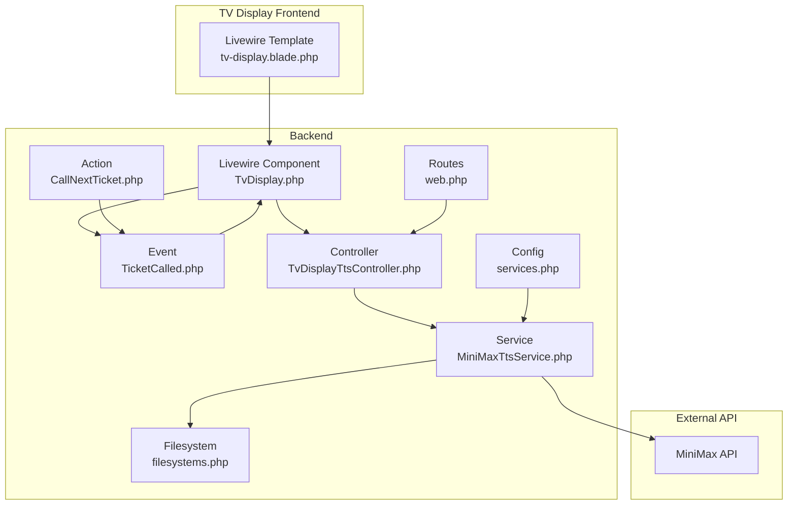
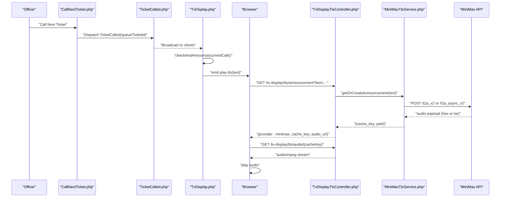
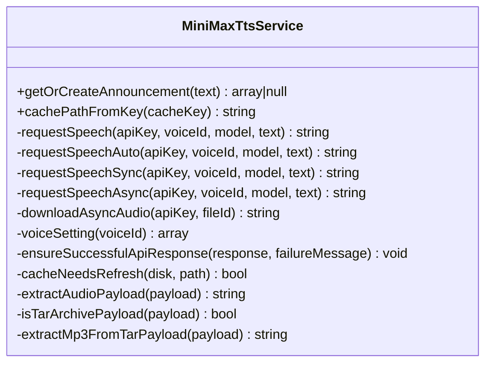
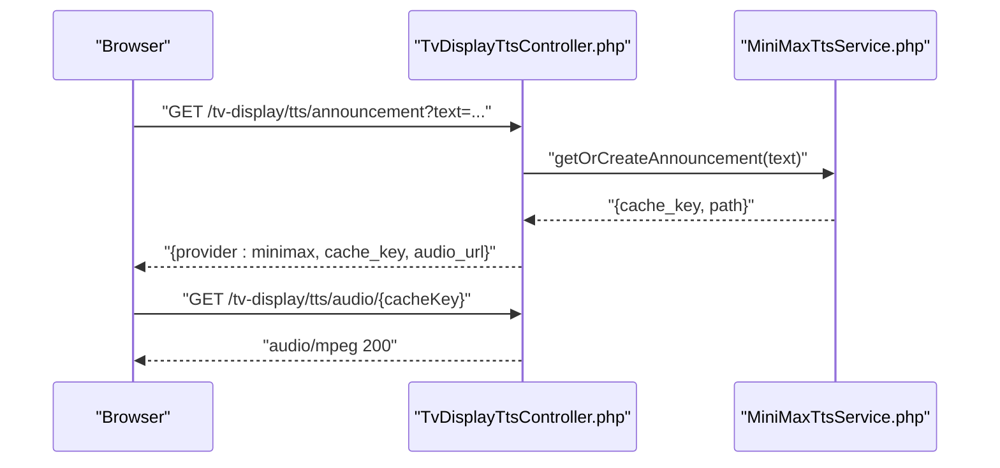
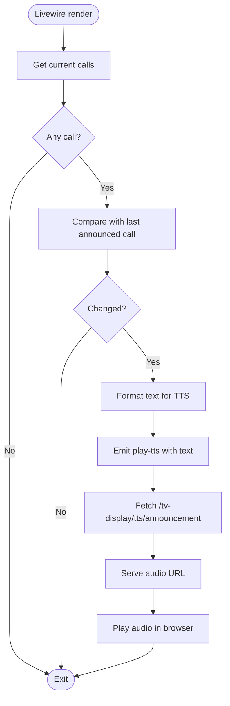
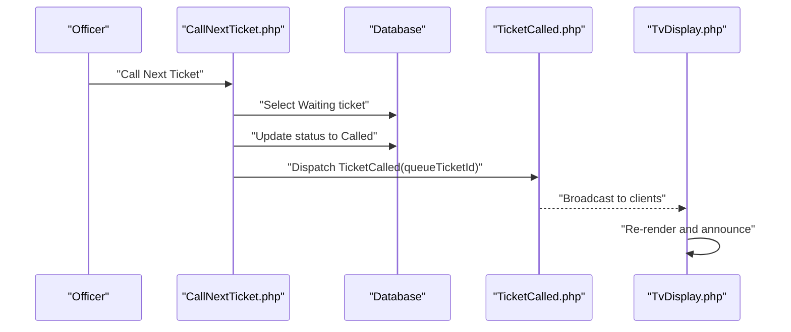
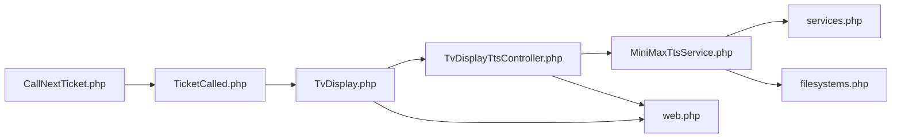

# Text-to-Speech Integration

<cite>
**Referenced Files in This Document**
- [MiniMaxTtsService.php](file://app/Services/Tts/MiniMaxTtsService.php)
- [TvDisplayTtsController.php](file://app/Http/Controllers/TvDisplayTtsController.php)
- [TicketCalled.php](file://app/Events/TicketCalled.php)
- [CallNextTicket.php](file://app/Actions/Queue/CallNextTicket.php)
- [TvDisplay.php](file://app/Livewire/TvDisplay.php)
- [TvDisplayController.php](file://app/Http/Controllers/TvDisplayController.php)
- [web.php](file://routes/web.php)
- [services.php](file://config/services.php)
- [filesystems.php](file://config/filesystems.php)
- [tv-display.blade.php](file://resources/views/livewire/tv-display.blade.php)
- [MiniMaxTtsServiceTest.php](file://tests/Feature/Tts/MiniMaxTtsServiceTest.php)
</cite>

## Table of Contents
1. [Introduction](#introduction)
2. [Project Structure](#project-structure)
3. [Core Components](#core-components)
4. [Architecture Overview](#architecture-overview)
5. [Detailed Component Analysis](#detailed-component-analysis)
6. [Dependency Analysis](#dependency-analysis)
7. [Performance Considerations](#performance-considerations)
8. [Troubleshooting Guide](#troubleshooting-guide)
9. [Conclusion](#conclusion)

## Introduction
This document explains the Text-to-Speech (TTS) Integration used by the TV display module to automatically announce ticket calls via Indonesian voice synthesis powered by the MiniMax API. It covers the service architecture, audio generation and caching, storage management, queue-driven announcements, audio naming and format handling, fallback mechanisms, and configuration options for voice parameters and quality.

## Project Structure
The TTS system spans backend services, controllers, Livewire components, events, routes, configuration, and frontend templates. The following diagram maps the primary components involved in the TTS pipeline for TV displays.

**Diagram sources**
- [tv-display.blade.php:1-213](file://resources/views/livewire/tv-display.blade.php#L1-L213)
- [TvDisplay.php:1-142](file://app/Livewire/TvDisplay.php#L1-L142)
- [TicketCalled.php:1-34](file://app/Events/TicketCalled.php#L1-L34)
- [CallNextTicket.php:1-80](file://app/Actions/Queue/CallNextTicket.php#L1-L80)
- [TvDisplayTtsController.php:1-62](file://app/Http/Controllers/TvDisplayTtsController.php#L1-L62)
- [MiniMaxTtsService.php:1-312](file://app/Services/Tts/MiniMaxTtsService.php#L1-L312)
- [web.php:1-127](file://routes/web.php#L1-L127)
- [services.php:1-61](file://config/services.php#L1-L61)
- [filesystems.php:1-81](file://config/filesystems.php#L1-L81)

**Section sources**
- [web.php:108-124](file://routes/web.php#L108-L124)
- [TvDisplay.php:22-68](file://app/Livewire/TvDisplay.php#L22-L68)
- [TvDisplayTtsController.php:14-60](file://app/Http/Controllers/TvDisplayTtsController.php#L14-L60)
- [MiniMaxTtsService.php:16-44](file://app/Services/Tts/MiniMaxTtsService.php#L16-L44)

## Core Components
- MiniMax TTS Service: Orchestrates text-to-speech requests, supports sync/async/auto strategies, generates cache keys, stores MP3 audio, and extracts audio from tar payloads.
- TV Display TTS Controller: Exposes endpoints to request announcements and serve audio files.
- Livewire TV Display Component: Listens for queue events, prepares announcement text, and triggers TTS playback in the browser.
- Ticket Called Event: Broadcasts queue call updates to clients.
- Call Next Ticket Action: Updates queue state and dispatches the TicketCalled event.
- Routes: Define endpoints for TTS announcement and audio retrieval.
- Configuration: Centralized settings for API keys, voice, model, strategy, and caching.
- Filesystems: Defines storage disk for audio cache.

**Section sources**
- [MiniMaxTtsService.php:11-312](file://app/Services/Tts/MiniMaxTtsService.php#L11-L312)
- [TvDisplayTtsController.php:12-61](file://app/Http/Controllers/TvDisplayTtsController.php#L12-L61)
- [TvDisplay.php:18-142](file://app/Livewire/TvDisplay.php#L18-L142)
- [TicketCalled.php:11-34](file://app/Events/TicketCalled.php#L11-L34)
- [CallNextTicket.php:13-80](file://app/Actions/Queue/CallNextTicket.php#L13-L80)
- [web.php:122-124](file://routes/web.php#L122-L124)
- [services.php:45-58](file://config/services.php#L45-L58)
- [filesystems.php:31-63](file://config/filesystems.php#L31-L63)

## Architecture Overview
The TV display TTS pipeline integrates queue operations with real-time audio announcements:

**Diagram sources**
- [CallNextTicket.php:74](file://app/Actions/Queue/CallNextTicket.php#L74)
- [TicketCalled.php:18-20](file://app/Events/TicketCalled.php#L18-L20)
- [TvDisplay.php:41-68](file://app/Livewire/TvDisplay.php#L41-L68)
- [tv-display.blade.php:30-40](file://resources/views/livewire/tv-display.blade.php#L30-L40)
- [TvDisplayTtsController.php:14-39](file://app/Http/Controllers/TvDisplayTtsController.php#L14-L39)
- [MiniMaxTtsService.php:53-116](file://app/Services/Tts/MiniMaxTtsService.php#L53-L116)
- [MiniMaxTtsService.php:118-180](file://app/Services/Tts/MiniMaxTtsService.php#L118-L180)

## Detailed Component Analysis

### MiniMax TTS Service
Responsibilities:
- Normalize input text and compute cache key from voice, model, and lowercase text.
- Choose strategy: sync, async, or auto (async with sync fallback).
- Generate audio via MiniMax APIs and persist MP3 to configured disk.
- Handle tar archive payloads returned by async downloads and extract MP3.
- Refresh cache when stored payload is empty or tar-based.

Key behaviors:
- Caching: Uses configured disk and prefix; cache key is SHA-1 of voice/model/text.
- Formats: Stores MP3; supports extraction from tar archives.
- Fallback: Auto strategy tries async first, falls back to sync if async fails.
- Validation: Ensures API responses are successful and base_resp.status_code equals zero.

**Diagram sources**
- [MiniMaxTtsService.php:11-312](file://app/Services/Tts/MiniMaxTtsService.php#L11-L312)

**Section sources**
- [MiniMaxTtsService.php:16-44](file://app/Services/Tts/MiniMaxTtsService.php#L16-L44)
- [MiniMaxTtsService.php:53-116](file://app/Services/Tts/MiniMaxTtsService.php#L53-L116)
- [MiniMaxTtsService.php:118-180](file://app/Services/Tts/MiniMaxTtsService.php#L118-L180)
- [MiniMaxTtsService.php:182-220](file://app/Services/Tts/MiniMaxTtsService.php#L182-L220)
- [MiniMaxTtsService.php:222-230](file://app/Services/Tts/MiniMaxTtsService.php#L222-L230)
- [MiniMaxTtsService.php:232-244](file://app/Services/Tts/MiniMaxTtsService.php#L232-L244)
- [MiniMaxTtsService.php:246-255](file://app/Services/Tts/MiniMaxTtsService.php#L246-L255)
- [MiniMaxTtsService.php:257-310](file://app/Services/Tts/MiniMaxTtsService.php#L257-L310)

### TV Display TTS Controller
Responsibilities:
- Validate incoming text and request announcement from the TTS service.
- Return JSON indicating provider type and audio URL; if unavailable, suggest browser provider.
- Serve audio bytes with appropriate headers and filename.

Behavior:
- Validates text length and presence.
- Returns JSON with cache key and audio URL when TTS is available.
- Serves MP3 with cache-control and inline disposition.

**Diagram sources**
- [TvDisplayTtsController.php:14-39](file://app/Http/Controllers/TvDisplayTtsController.php#L14-L39)
- [TvDisplayTtsController.php:41-60](file://app/Http/Controllers/TvDisplayTtsController.php#L41-L60)
- [MiniMaxTtsService.php:16-44](file://app/Services/Tts/MiniMaxTtsService.php#L16-L44)

**Section sources**
- [TvDisplayTtsController.php:14-39](file://app/Http/Controllers/TvDisplayTtsController.php#L14-L39)
- [TvDisplayTtsController.php:41-60](file://app/Http/Controllers/TvDisplayTtsController.php#L41-L60)

### Livewire TV Display Component and Frontend
Responsibilities:
- Listen for queue events and trigger TTS announcements.
- Prepare announcement text with phonetic ticket number and counter name.
- Emit a client-side event to fetch and play audio from the server.

Behavior:
- On receiving a TicketCalled event, compare last announced call to avoid duplicates.
- Format ticket number for TTS by separating characters with commas and replacing zero with “nol”.
- Dispatch a play-tts event with the prepared text.
- Frontend template fetches announcement metadata and plays the audio.

**Diagram sources**
- [TvDisplay.php:41-68](file://app/Livewire/TvDisplay.php#L41-L68)
- [tv-display.blade.php:30-40](file://resources/views/livewire/tv-display.blade.php#L30-L40)

**Section sources**
- [TvDisplay.php:22-27](file://app/Livewire/TvDisplay.php#L22-L27)
- [TvDisplay.php:41-68](file://app/Livewire/TvDisplay.php#L41-L68)
- [tv-display.blade.php:30-40](file://resources/views/livewire/tv-display.blade.php#L30-L40)

### Queue Integration and Broadcasting
Responsibilities:
- Select the next eligible ticket and mark it as called.
- Log activity and dispatch a TicketCalled event for real-time updates.
- Livewire component listens for the event and triggers TTS.

**Diagram sources**
- [CallNextTicket.php:19-77](file://app/Actions/Queue/CallNextTicket.php#L19-L77)
- [TicketCalled.php:18-20](file://app/Events/TicketCalled.php#L18-L20)
- [TvDisplay.php:22-27](file://app/Livewire/TvDisplay.php#L22-L27)

**Section sources**
- [CallNextTicket.php:19-77](file://app/Actions/Queue/CallNextTicket.php#L19-L77)
- [TicketCalled.php:11-34](file://app/Events/TicketCalled.php#L11-L34)
- [TvDisplay.php:22-27](file://app/Livewire/TvDisplay.php#L22-L27)

### Configuration Options
The system reads configuration from the services configuration file. Key options include:
- API credentials and voice selection
- Model, strategy, and language boost
- Voice parameters: speed, volume, pitch
- Async polling attempts and interval
- Cache disk and prefix

These settings influence audio quality, latency, and caching behavior.

**Section sources**
- [services.php:45-58](file://config/services.php#L45-L58)

### Storage and File Naming
- Disk: Configured via cache_disk; defaults to public.
- Prefix: Configured via cache_prefix; defaults to tts/minimax.
- Naming: cache_key + .mp3 under the configured prefix.
- Serving: Controller returns Content-Type audio/mpeg with cache headers and filename.

**Section sources**
- [MiniMaxTtsService.php:30-33](file://app/Services/Tts/MiniMaxTtsService.php#L30-L33)
- [TvDisplayTtsController.php:46-59](file://app/Http/Controllers/TvDisplayTtsController.php#L46-L59)
- [filesystems.php:41-48](file://config/filesystems.php#L41-L48)

### Audio Format Handling and Cleanup
- Format: MP3 generated by MiniMax; stored as MP3.
- Tar extraction: When async returns a tar payload, the service extracts the embedded MP3.
- Cleanup: No explicit cleanup routine is present; stale tar payloads are refreshed on demand by detecting empty or tar-based content.

**Section sources**
- [MiniMaxTtsService.php:95-100](file://app/Services/Tts/MiniMaxTtsService.php#L95-L100)
- [MiniMaxTtsService.php:257-310](file://app/Services/Tts/MiniMaxTtsService.php#L257-L310)
- [MiniMaxTtsService.php:246-255](file://app/Services/Tts/MiniMaxTtsService.php#L246-L255)

## Dependency Analysis
The TTS integration exhibits clear separation of concerns:
- Livewire component depends on the queue event and controller endpoints.
- Controller depends on the TTS service for audio generation and caching.
- TTS service depends on configuration and external API.
- Routes define the contract for frontend-to-backend communication.
- Filesystems configuration determines where audio is stored.

**Diagram sources**
- [TvDisplay.php:18-142](file://app/Livewire/TvDisplay.php#L18-L142)
- [TvDisplayTtsController.php:12-61](file://app/Http/Controllers/TvDisplayTtsController.php#L12-L61)
- [MiniMaxTtsService.php:11-312](file://app/Services/Tts/MiniMaxTtsService.php#L11-L312)
- [services.php:45-58](file://config/services.php#L45-L58)
- [filesystems.php:31-63](file://config/filesystems.php#L31-L63)
- [web.php:122-124](file://routes/web.php#L122-L124)
- [CallNextTicket.php:13-80](file://app/Actions/Queue/CallNextTicket.php#L13-L80)
- [TicketCalled.php:11-34](file://app/Events/TicketCalled.php#L11-L34)

**Section sources**
- [web.php:122-124](file://routes/web.php#L122-L124)
- [TvDisplay.php:22-27](file://app/Livewire/TvDisplay.php#L22-L27)
- [TvDisplayTtsController.php:14-39](file://app/Http/Controllers/TvDisplayTtsController.php#L14-L39)
- [MiniMaxTtsService.php:232-244](file://app/Services/Tts/MiniMaxTtsService.php#L232-L244)

## Performance Considerations
- Strategy selection: Async reduces latency but requires polling; Sync avoids polling but may increase request time; Auto provides resilience by falling back to sync.
- Polling parameters: async_poll_attempts and async_poll_interval_ms tune responsiveness and cost.
- Caching: Reusing existing MP3 files avoids repeated API calls; tar refresh ensures cache validity.
- Network timeouts: Appropriate timeout values prevent long blocking during API calls.
- Audio streaming: Serving MP3 with cache headers improves playback performance.

[No sources needed since this section provides general guidance]

## Troubleshooting Guide
Common issues and resolutions:
- Empty or invalid text: Service returns null; ensure text is non-empty and validated.
- Missing API key or voice ID: Service returns null; verify configuration.
- API failures: Service throws exceptions; check network connectivity and credentials.
- Async task failures/expired: Service throws exceptions; switch to sync or adjust polling settings.
- Tar payload extraction errors: Service throws exceptions; cache refresh occurs on detection of tar payloads.
- Audio not playing: Verify endpoint availability, cache existence, and correct MIME type.

**Section sources**
- [MiniMaxTtsService.php:18-27](file://app/Services/Tts/MiniMaxTtsService.php#L18-L27)
- [MiniMaxTtsService.php:103-108](file://app/Services/Tts/MiniMaxTtsService.php#L103-L108)
- [MiniMaxTtsService.php:170-172](file://app/Services/Tts/MiniMaxTtsService.php#L170-L172)
- [MiniMaxTtsService.php:257-310](file://app/Services/Tts/MiniMaxTtsService.php#L257-L310)
- [TvDisplayTtsController.php:20-26](file://app/Http/Controllers/TvDisplayTtsController.php#L20-L26)

## Conclusion
The TTS Integration seamlessly connects queue operations to real-time audio announcements on TV displays. By leveraging MiniMax’s Indonesian voice synthesis, configurable caching, and robust fallback strategies, the system delivers reliable, high-quality audio announcements. Proper configuration of voice parameters, strategy, and storage ensures optimal performance and user experience.