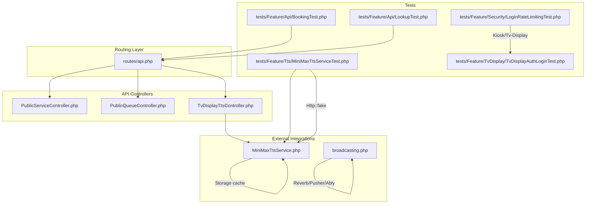
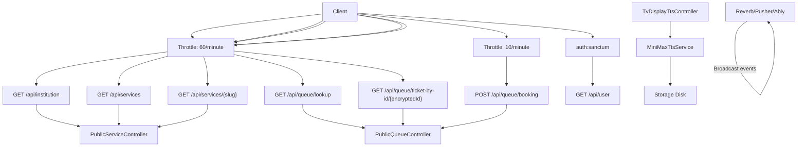
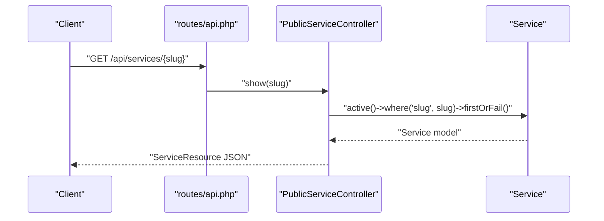
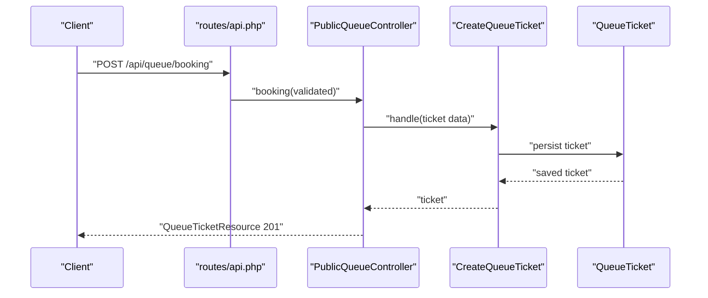
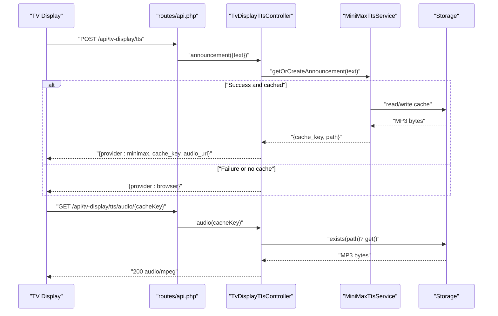
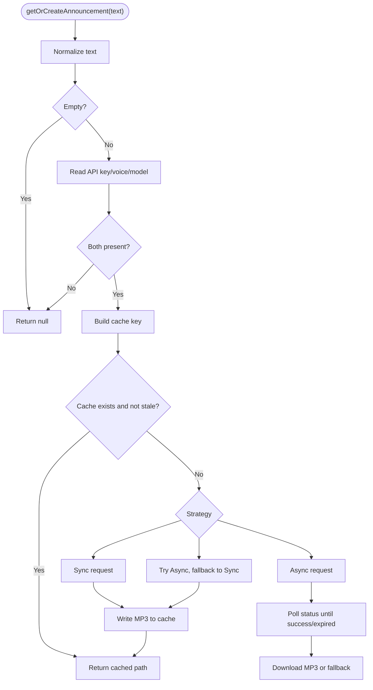
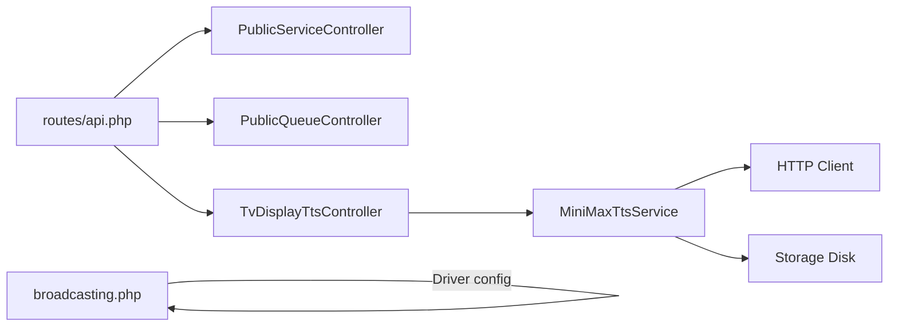

# API and Integration Testing

<cite>
**Referenced Files in This Document**
- [routes/api.php](file://routes/api.php)
- [app/Http/Controllers/Api/PublicServiceController.php](file://app/Http/Controllers/Api/PublicServiceController.php)
- [app/Http/Controllers/Api/PublicQueueController.php](file://app/Http/Controllers/Api/PublicQueueController.php)
- [app/Http/Controllers/TvDisplayTtsController.php](file://app/Http/Controllers/TvDisplayTtsController.php)
- [app/Services/Tts/MiniMaxTtsService.php](file://app/Services/Tts/MiniMaxTtsService.php)
- [config/broadcasting.php](file://config/broadcasting.php)
- [tests/Feature/Api/BookingTest.php](file://tests/Feature/Api/BookingTest.php)
- [tests/Feature/Api/LookupTest.php](file://tests/Feature/Api/LookupTest.php)
- [tests/Feature/Security/LoginRateLimitingTest.php](file://tests/Feature/Security/LoginRateLimitingTest.php)
- [tests/Feature/Tts/MiniMaxTtsServiceTest.php](file://tests/Feature/Tts/MiniMaxTtsServiceTest.php)
- [tests/Feature/TvDisplay/TvDisplayAuthLoginTest.php](file://tests/Feature/TvDisplay/TvDisplayAuthLoginTest.php)
</cite>

## Table of Contents
1. [Introduction](#introduction)
2. [Project Structure](#project-structure)
3. [Core Components](#core-components)
4. [Architecture Overview](#architecture-overview)
5. [Detailed Component Analysis](#detailed-component-analysis)
6. [Dependency Analysis](#dependency-analysis)
7. [Performance Considerations](#performance-considerations)
8. [Troubleshooting Guide](#troubleshooting-guide)
9. [Conclusion](#conclusion)

## Introduction
This document provides comprehensive guidance for API and integration testing in the PTSP system. It focuses on:
- RESTful API endpoint testing for authentication, request/response validation, and error handling
- Integration testing for external services such as TTS APIs, caching, and WebSocket broadcasting
- Strategies for real-time communication, broadcast events, and external service integrations
- Examples of testing API security, rate limiting, and performance under load
- Patterns for complex workflows involving multiple system components

## Project Structure
The testing landscape centers around Laravel’s Pest-based test suite and the routing layer that exposes public-facing endpoints. Key areas include:
- API routes grouped by throttle policies
- Controllers implementing business logic for services and queue operations
- TTS service integration with caching and fallback strategies
- Broadcasting configuration supporting Reverb/Pusher/Ably
- Feature tests validating API behavior and security

**Diagram sources**
- [routes/api.php:1-23](file://routes/api.php#L1-L23)
- [app/Http/Controllers/Api/PublicServiceController.php:1-42](file://app/Http/Controllers/Api/PublicServiceController.php#L1-L42)
- [app/Http/Controllers/Api/PublicQueueController.php:1-75](file://app/Http/Controllers/Api/PublicQueueController.php#L1-L75)
- [app/Http/Controllers/TvDisplayTtsController.php:1-62](file://app/Http/Controllers/TvDisplayTtsController.php#L1-L62)
- [app/Services/Tts/MiniMaxTtsService.php:1-312](file://app/Services/Tts/MiniMaxTtsService.php#L1-L312)
- [config/broadcasting.php:1-83](file://config/broadcasting.php#L1-L83)
- [tests/Feature/Api/BookingTest.php:1-112](file://tests/Feature/Api/BookingTest.php#L1-L112)
- [tests/Feature/Api/LookupTest.php:1-78](file://tests/Feature/Api/LookupTest.php#L1-L78)
- [tests/Feature/Security/LoginRateLimitingTest.php:1-28](file://tests/Feature/Security/LoginRateLimitingTest.php#L1-L28)
- [tests/Feature/Tts/MiniMaxTtsServiceTest.php:1-306](file://tests/Feature/Tts/MiniMaxTtsServiceTest.php#L1-L306)
- [tests/Feature/TvDisplay/TvDisplayAuthLoginTest.php:1-25](file://tests/Feature/TvDisplay/TvDisplayAuthLoginTest.php#L1-L25)

**Section sources**
- [routes/api.php:1-23](file://routes/api.php#L1-L23)

## Core Components
- API routes expose public endpoints with per-endpoint throttling and an authenticated user endpoint protected by Sanctum.
- PublicServiceController handles institution info and service listings.
- PublicQueueController supports ticket lookup by number/date and encrypted ID, plus booking creation via validated requests.
- TvDisplayTtsController validates input, delegates to TTS service, and serves cached audio.
- MiniMaxTtsService encapsulates TTS generation, caching, and robust error handling with sync/async/auto strategies.
- Broadcasting configuration supports multiple drivers for real-time updates.

**Section sources**
- [routes/api.php:8-22](file://routes/api.php#L8-L22)
- [app/Http/Controllers/Api/PublicServiceController.php:13-40](file://app/Http/Controllers/Api/PublicServiceController.php#L13-L40)
- [app/Http/Controllers/Api/PublicQueueController.php:16-64](file://app/Http/Controllers/Api/PublicQueueController.php#L16-L64)
- [app/Http/Controllers/TvDisplayTtsController.php:14-60](file://app/Http/Controllers/TvDisplayTtsController.php#L14-L60)
- [app/Services/Tts/MiniMaxTtsService.php:16-44](file://app/Services/Tts/MiniMaxTtsService.php#L16-L44)
- [config/broadcasting.php:31-80](file://config/broadcasting.php#L31-L80)

## Architecture Overview
The API layer is organized by throttle groups and authenticated routes. Controllers delegate to domain actions and services. External integrations include TTS generation and caching, and real-time broadcasting.

**Diagram sources**
- [routes/api.php:8-22](file://routes/api.php#L8-L22)
- [app/Http/Controllers/Api/PublicServiceController.php:13-40](file://app/Http/Controllers/Api/PublicServiceController.php#L13-L40)
- [app/Http/Controllers/Api/PublicQueueController.php:16-64](file://app/Http/Controllers/Api/PublicQueueController.php#L16-L64)
- [app/Http/Controllers/TvDisplayTtsController.php:14-60](file://app/Http/Controllers/TvDisplayTtsController.php#L14-L60)
- [app/Services/Tts/MiniMaxTtsService.php:35-43](file://app/Services/Tts/MiniMaxTtsService.php#L35-L43)
- [config/broadcasting.php:33-47](file://config/broadcasting.php#L33-L47)

## Detailed Component Analysis

### API Routing and Throttling
- Endpoints are grouped under throttle middleware:
  - GET institution, services, services/{slug}, queue/lookup, queue/ticket-by-id/{encryptedId} use throttle:60,1
  - POST queue/booking uses throttle:10,1
- An authenticated user endpoint requires Sanctum.

Testing strategies:
- Disable throttling in tests using middleware bypass to validate pure endpoint logic.
- Simulate rate limit scenarios by invoking endpoints multiple times within the same window.

**Section sources**
- [routes/api.php:8-22](file://routes/api.php#L8-L22)
- [tests/Feature/Api/BookingTest.php:12](file://tests/Feature/Api/BookingTest.php#L12)
- [tests/Feature/Security/LoginRateLimitingTest.php:5-27](file://tests/Feature/Security/LoginRateLimitingTest.php#L5-L27)

### Public Service API
Endpoints:
- GET /api/institution: Returns institution metadata filtered to specific keys
- GET /api/services: Lists active services via ServiceResource
- GET /api/services/{slug}: Retrieves a single active service by slug

Validation and error handling:
- Resource-based responses ensure consistent JSON structure
- Not found errors occur when slug does not match an active service

**Diagram sources**
- [routes/api.php:9-13](file://routes/api.php#L9-L13)
- [app/Http/Controllers/Api/PublicServiceController.php:33-40](file://app/Http/Controllers/Api/PublicServiceController.php#L33-L40)

**Section sources**
- [app/Http/Controllers/Api/PublicServiceController.php:13-40](file://app/Http/Controllers/Api/PublicServiceController.php#L13-L40)
- [tests/Feature/Api/ServiceTest.php](file://tests/Feature/Api/ServiceTest.php)

### Public Queue API
Endpoints:
- POST /api/queue/booking: Validates booking request and creates a ticket via CreateQueueTicket action
- GET /api/queue/lookup: Finds ticket by ticket_number and service_date
- GET /api/queue/ticket-by-id/{encryptedId}: Decrypts ID and retrieves ticket

Validation and error handling:
- 422 responses for invalid or missing fields
- 404 responses when ticket is not found
- 201 Created returned on successful booking

**Diagram sources**
- [routes/api.php:16-18](file://routes/api.php#L16-L18)
- [app/Http/Controllers/Api/PublicQueueController.php:16-34](file://app/Http/Controllers/Api/PublicQueueController.php#L16-L34)

**Section sources**
- [app/Http/Controllers/Api/PublicQueueController.php:16-64](file://app/Http/Controllers/Api/PublicQueueController.php#L16-L64)
- [tests/Feature/Api/BookingTest.php:14-31](file://tests/Feature/Api/BookingTest.php#L14-L31)
- [tests/Feature/Api/LookupTest.php:10-23](file://tests/Feature/Api/LookupTest.php#L10-L23)

### TV Display TTS API
Endpoints:
- POST /api/tv-display/tts: Validates text, calls MiniMaxTtsService, returns provider selection and audio URL
- GET /api/tv-display/tts/audio/{cacheKey}: Serves cached MP3 with appropriate headers

Error handling:
- On failure or missing cache, returns provider "browser" with 200
- Strict cache key validation and existence checks

**Diagram sources**
- [app/Http/Controllers/TvDisplayTtsController.php:14-60](file://app/Http/Controllers/TvDisplayTtsController.php#L14-L60)
- [app/Services/Tts/MiniMaxTtsService.php:16-44](file://app/Services/Tts/MiniMaxTtsService.php#L16-L44)

**Section sources**
- [app/Http/Controllers/TvDisplayTtsController.php:14-60](file://app/Http/Controllers/TvDisplayTtsController.php#L14-L60)
- [app/Services/Tts/MiniMaxTtsService.php:35-44](file://app/Services/Tts/MiniMaxTtsService.php#L35-L44)
- [tests/Feature/Tts/MiniMaxTtsServiceTest.php:101-137](file://tests/Feature/Tts/MiniMaxTtsServiceTest.php#L101-L137)
- [tests/Feature/Tts/MiniMaxTtsServiceTest.php:139-199](file://tests/Feature/Tts/MiniMaxTtsServiceTest.php#L139-L199)

### TTS Service Integration
Key behaviors:
- Input normalization and empty-text guard
- Config-driven API key, voice, model, strategy (sync/auto/async)
- Cache path construction and refresh logic
- Async strategy with polling and fallback to sync
- Tar archive extraction for MP3 payloads

Testing patterns:
- Use Http::fake to simulate API responses and error conditions
- Verify cache writes and reads
- Validate fallback behavior and error propagation

**Diagram sources**
- [app/Services/Tts/MiniMaxTtsService.php:16-44](file://app/Services/Tts/MiniMaxTtsService.php#L16-L44)
- [app/Services/Tts/MiniMaxTtsService.php:53-116](file://app/Services/Tts/MiniMaxTtsService.php#L53-L116)
- [app/Services/Tts/MiniMaxTtsService.php:118-180](file://app/Services/Tts/MiniMaxTtsService.php#L118-L180)
- [app/Services/Tts/MiniMaxTtsService.php:182-220](file://app/Services/Tts/MiniMaxTtsService.php#L182-L220)
- [app/Services/Tts/MiniMaxTtsService.php:246-255](file://app/Services/Tts/MiniMaxTtsService.php#L246-L255)
- [app/Services/Tts/MiniMaxTtsService.php:257-310](file://app/Services/Tts/MiniMaxTtsService.php#L257-L310)

**Section sources**
- [app/Services/Tts/MiniMaxTtsService.php:16-44](file://app/Services/Tts/MiniMaxTtsService.php#L16-L44)
- [tests/Feature/Tts/MiniMaxTtsServiceTest.php:41-73](file://tests/Feature/Tts/MiniMaxTtsServiceTest.php#L41-L73)
- [tests/Feature/Tts/MiniMaxTtsServiceTest.php:101-137](file://tests/Feature/Tts/MiniMaxTtsServiceTest.php#L101-L137)
- [tests/Feature/Tts/MiniMaxTtsServiceTest.php:139-199](file://tests/Feature/Tts/MiniMaxTtsServiceTest.php#L139-L199)
- [tests/Feature/Tts/MiniMaxTtsServiceTest.php:244-278](file://tests/Feature/Tts/MiniMaxTtsServiceTest.php#L244-L278)

### Real-Time Communication and Broadcasting
- Broadcasting driver is configurable (Reverb/Pusher/Ably/log/null)
- Typical pattern: dispatch events that are broadcast to clients
- For WebSocket testing, configure the broadcaster and assert emitted events/messages

Testing strategies:
- Configure broadcaster to a local or test-friendly driver
- Dispatch events in tests and verify broadcast behavior
- Validate client-side connectivity and message reception

**Section sources**
- [config/broadcasting.php:31-80](file://config/broadcasting.php#L31-L80)

### Authentication and Rate Limiting
- Kiosk and TV display login endpoints are protected by rate limiting
- Tests simulate repeated failed attempts to trigger 429 responses

Testing patterns:
- Set hashed passwords via config
- Submit multiple failed login requests
- Assert 429 status on throttled attempt

**Section sources**
- [tests/Feature/Security/LoginRateLimitingTest.php:5-27](file://tests/Feature/Security/LoginRateLimitingTest.php#L5-L27)
- [tests/Feature/TvDisplay/TvDisplayAuthLoginTest.php:5-24](file://tests/Feature/TvDisplay/TvDisplayAuthLoginTest.php#L5-L24)

## Dependency Analysis
- API routes depend on controllers for request handling
- Controllers depend on domain actions/models and resources for responses
- TvDisplayTtsController depends on MiniMaxTtsService and Storage
- MiniMaxTtsService depends on HTTP client and Storage disk
- Broadcasting configuration enables real-time updates

**Diagram sources**
- [routes/api.php:8-22](file://routes/api.php#L8-L22)
- [app/Http/Controllers/Api/PublicServiceController.php:13-40](file://app/Http/Controllers/Api/PublicServiceController.php#L13-L40)
- [app/Http/Controllers/Api/PublicQueueController.php:16-64](file://app/Http/Controllers/Api/PublicQueueController.php#L16-L64)
- [app/Http/Controllers/TvDisplayTtsController.php:14-60](file://app/Http/Controllers/TvDisplayTtsController.php#L14-L60)
- [app/Services/Tts/MiniMaxTtsService.php:35-44](file://app/Services/Tts/MiniMaxTtsService.php#L35-L44)
- [config/broadcasting.php:31-80](file://config/broadcasting.php#L31-L80)

**Section sources**
- [routes/api.php:8-22](file://routes/api.php#L8-L22)
- [app/Services/Tts/MiniMaxTtsService.php:35-44](file://app/Services/Tts/MiniMaxTtsService.php#L35-L44)

## Performance Considerations
- Throttling:
  - Use throttle:60,1 for read-heavy endpoints to prevent abuse
  - Use throttle:10,1 for write-heavy endpoints (booking) to protect backend resources
- Caching:
  - Leverage TTS caching to reduce external API calls and latency
  - Validate cache freshness and tar payload extraction to avoid redundant work
- External service resilience:
  - Prefer auto strategy with async fallback to sync for availability
  - Configure timeouts and retry intervals appropriately
- Broadcasting:
  - Choose a suitable driver for production scale and cost
  - Minimize unnecessary broadcasts to reduce bandwidth and CPU usage

[No sources needed since this section provides general guidance]

## Troubleshooting Guide
Common issues and resolutions:
- TTS failures:
  - Verify API key and voice ID configuration
  - Inspect async polling attempts and intervals
  - Confirm cache disk permissions and path construction
- 429 responses:
  - Adjust throttle windows or disable in tests
  - Validate rate-limiting middleware behavior
- Authentication failures:
  - Ensure hashed passwords are configured correctly
  - Confirm session state after successful login
- Broadcasting not working:
  - Check broadcaster driver configuration and credentials
  - Verify client-side connection settings

**Section sources**
- [tests/Feature/Tts/MiniMaxTtsServiceTest.php:280-296](file://tests/Feature/Tts/MiniMaxTtsServiceTest.php#L280-L296)
- [tests/Feature/Security/LoginRateLimitingTest.php:5-27](file://tests/Feature/Security/LoginRateLimitingTest.php#L5-L27)
- [tests/Feature/TvDisplay/TvDisplayAuthLoginTest.php:5-24](file://tests/Feature/TvDisplay/TvDisplayAuthLoginTest.php#L5-L24)
- [config/broadcasting.php:33-47](file://config/broadcasting.php#L33-L47)

## Conclusion
The PTSP system provides a robust foundation for API and integration testing:
- Clear routing with throttle policies and authenticated endpoints
- Well-structured controllers delegating to services and actions
- Comprehensive TTS integration with caching and resilient fallbacks
- Configurable broadcasting for real-time capabilities
- Feature tests covering validation, error handling, security, and external integrations

Adopt the documented patterns to ensure reliable testing of complex workflows and maintain high-quality integrations across the system.