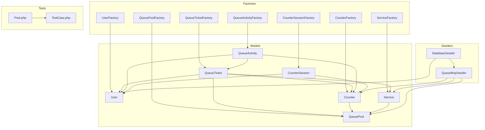
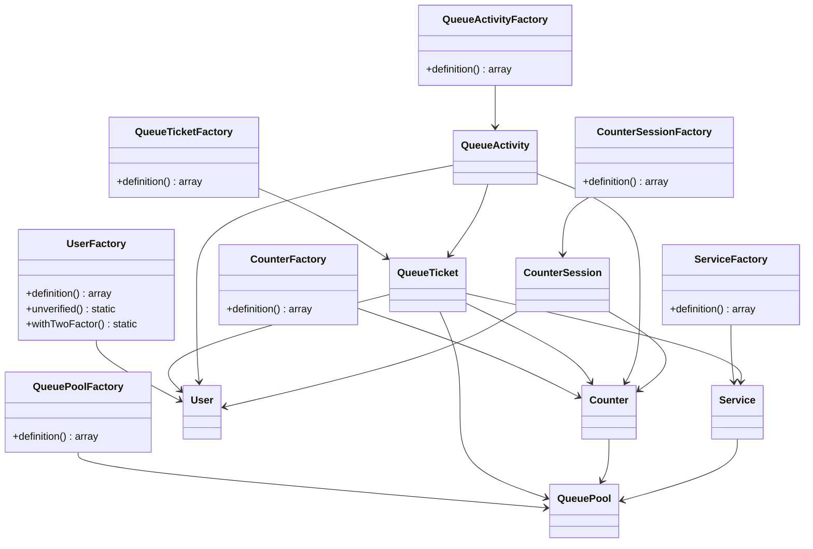
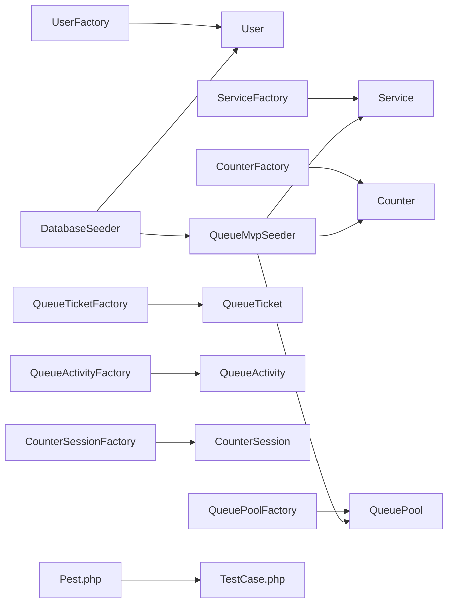

# Database Testing and Factories

<cite>
**Referenced Files in This Document**
- [UserFactory.php](file://database/factories/UserFactory.php)
- [QueueTicketFactory.php](file://database/factories/QueueTicketFactory.php)
- [CounterFactory.php](file://database/factories/CounterFactory.php)
- [ServiceFactory.php](file://database/factories/ServiceFactory.php)
- [CounterSessionFactory.php](file://database/factories/CounterSessionFactory.php)
- [QueuePoolFactory.php](file://database/factories/QueuePoolFactory.php)
- [QueueActivityFactory.php](file://database/factories/QueueActivityFactory.php)
- [DatabaseSeeder.php](file://database/seeders/DatabaseSeeder.php)
- [QueueMvpSeeder.php](file://database/seeders/QueueMvpSeeder.php)
- [TestCase.php](file://tests/TestCase.php)
- [Pest.php](file://tests/Pest.php)
- [User.php](file://app/Models/User.php)
- [QueueTicket.php](file://app/Models/QueueTicket.php)
- [Counter.php](file://app/Models/Counter.php)
- [Service.php](file://app/Models/Service.php)
</cite>

## Table of Contents
1. [Introduction](#introduction)
2. [Project Structure](#project-structure)
3. [Core Components](#core-components)
4. [Architecture Overview](#architecture-overview)
5. [Detailed Component Analysis](#detailed-component-analysis)
6. [Dependency Analysis](#dependency-analysis)
7. [Performance Considerations](#performance-considerations)
8. [Troubleshooting Guide](#troubleshooting-guide)
9. [Conclusion](#conclusion)

## Introduction
This document explains how the PTSP system implements database testing and factory-driven test data generation. It covers the factory pattern for creating realistic test records, seeding strategies for MVP and demo data, test database safety and lifecycle management, and robust testing of Eloquent relationships, database constraints, and migrations. It also provides guidance for testing complex operations, transactions, data integrity, and concurrency-related scenarios.

## Project Structure
The testing and factory ecosystem centers around:
- Eloquent factories under database/factories for generating model instances and their relationships
- Seeders under database/seeders for initial dataset population
- Test harness configuration in tests/Pest.php and tests/TestCase.php
- Domain models under app/Models that define relationships and scopes used in tests

**Diagram sources**
- [UserFactory.php:13-61](file://database/factories/UserFactory.php#L13-L61)
- [ServiceFactory.php:12-37](file://database/factories/ServiceFactory.php#L12-L37)
- [CounterFactory.php:11-28](file://database/factories/CounterFactory.php#L11-L28)
- [QueuePoolFactory.php:10-26](file://database/factories/QueuePoolFactory.php#L10-L26)
- [QueueTicketFactory.php:15-46](file://database/factories/QueueTicketFactory.php#L15-L46)
- [QueueActivityFactory.php:13-32](file://database/factories/QueueActivityFactory.php#L13-L32)
- [CounterSessionFactory.php:12-29](file://database/factories/CounterSessionFactory.php#L12-L29)
- [User.php:14-98](file://app/Models/User.php#L14-L98)
- [Service.php:12-100](file://app/Models/Service.php#L12-L100)
- [Counter.php:10-52](file://app/Models/Counter.php#L10-L52)
- [QueueTicket.php:12-120](file://app/Models/QueueTicket.php#L12-L120)
- [DatabaseSeeder.php:10-46](file://database/seeders/DatabaseSeeder.php#L10-L46)
- [QueueMvpSeeder.php:10-129](file://database/seeders/QueueMvpSeeder.php#L10-L129)
- [Pest.php:29-31](file://tests/Pest.php#L29-L31)
- [TestCase.php:7-10](file://tests/TestCase.php#L7-L10)

**Section sources**
- [Pest.php:29-31](file://tests/Pest.php#L29-L31)
- [TestCase.php:7-10](file://tests/TestCase.php#L7-L10)

## Core Components
- Eloquent Factories: Generate model instances with realistic defaults and nested relationships. They encapsulate default attributes, convenience states, and relationship seeding.
- Seeders: Populate initial datasets for MVP and demo environments, ensuring consistent baseline data across environments.
- Test Harness: Configured via Pest to apply RefreshDatabase lifecycle, enforce safe test database naming, and extend base test capabilities.

Key responsibilities:
- Factories: Provide deterministic yet varied test data; auto-create related records when foreign keys reference factories.
- Seeders: Create stable, cross-environment baseline data; avoid conflicts with test data by using firstOrCreate patterns.
- Test Lifecycle: RefreshDatabase clears and re-populates the test database per test class, minimizing cross-test interference.

**Section sources**
- [UserFactory.php:13-61](file://database/factories/UserFactory.php#L13-L61)
- [QueueTicketFactory.php:15-46](file://database/factories/QueueTicketFactory.php#L15-L46)
- [CounterFactory.php:11-28](file://database/factories/CounterFactory.php#L11-L28)
- [ServiceFactory.php:12-37](file://database/factories/ServiceFactory.php#L12-L37)
- [CounterSessionFactory.php:12-29](file://database/factories/CounterSessionFactory.php#L12-L29)
- [QueuePoolFactory.php:10-26](file://database/factories/QueuePoolFactory.php#L10-L26)
- [QueueActivityFactory.php:13-32](file://database/factories/QueueActivityFactory.php#L13-L32)
- [DatabaseSeeder.php:10-46](file://database/seeders/DatabaseSeeder.php#L10-L46)
- [QueueMvpSeeder.php:10-129](file://database/seeders/QueueMvpSeeder.php#L10-L129)
- [Pest.php:29-31](file://tests/Pest.php#L29-L31)

## Architecture Overview
The factory-to-model relationship ensures that tests can quickly build complex domain graphs. Factories reference other factories to create related records automatically, enabling realistic end-to-end tests without manual fixture setup.

**Diagram sources**
- [UserFactory.php:13-61](file://database/factories/UserFactory.php#L13-L61)
- [ServiceFactory.php:12-37](file://database/factories/ServiceFactory.php#L12-L37)
- [CounterFactory.php:11-28](file://database/factories/CounterFactory.php#L11-L28)
- [QueuePoolFactory.php:10-26](file://database/factories/QueuePoolFactory.php#L10-L26)
- [QueueTicketFactory.php:15-46](file://database/factories/QueueTicketFactory.php#L15-L46)
- [QueueActivityFactory.php:13-32](file://database/factories/QueueActivityFactory.php#L13-L32)
- [CounterSessionFactory.php:12-29](file://database/factories/CounterSessionFactory.php#L12-L29)
- [User.php:14-98](file://app/Models/User.php#L14-L98)
- [Service.php:12-100](file://app/Models/Service.php#L12-L100)
- [Counter.php:10-52](file://app/Models/Counter.php#L10-L52)
- [QueueTicket.php:12-120](file://app/Models/QueueTicket.php#L12-L120)

## Detailed Component Analysis

### Factory Pattern Implementation
- Purpose: Encapsulate default attributes and convenient states for models; auto-seed relationships via factory references.
- Patterns:
  - Nested factories: Foreign keys referencing other factories trigger automatic creation of related records.
  - State methods: Provide alternate states (e.g., unverified, with two-factor) to simulate edge cases.
  - Consistent defaults: Enums, slugs, codes, and timestamps are generated consistently across instances.

Examples of factory usage in tests:
- Create a user with two-factor enabled using a factory state method.
- Build a queue ticket that automatically creates associated service, queue pool, counter, and creator records.
- Generate counters linked to a queue pool and services linked to a queue pool.

**Section sources**
- [UserFactory.php:13-61](file://database/factories/UserFactory.php#L13-L61)
- [QueueTicketFactory.php:15-46](file://database/factories/QueueTicketFactory.php#L15-L46)
- [CounterFactory.php:11-28](file://database/factories/CounterFactory.php#L11-L28)
- [ServiceFactory.php:12-37](file://database/factories/ServiceFactory.php#L12-L37)
- [CounterSessionFactory.php:12-29](file://database/factories/CounterSessionFactory.php#L12-L29)
- [QueuePoolFactory.php:10-26](file://database/factories/QueuePoolFactory.php#L10-L26)
- [QueueActivityFactory.php:13-32](file://database/factories/QueueActivityFactory.php#L13-L32)

### Database Seeding Strategies
- QueueMvpSeeder: Creates essential MVP data (queue pools, services, counters) using firstOrCreate to avoid duplication and ensure consistent baseline.
- DatabaseSeeder: Orchestrates seeders and conditionally seeds demo users except during unit tests. It delegates to QueueMvpSeeder and optionally WilayahSeeder depending on environment.

Best practices:
- Use firstOrCreate to maintain idempotency.
- Keep seeders focused on stable, cross-environment fixtures.
- Avoid seeding test-specific data in shared seeders.

**Section sources**
- [QueueMvpSeeder.php:10-129](file://database/seeders/QueueMvpSeeder.php#L10-L129)
- [DatabaseSeeder.php:10-46](file://database/seeders/DatabaseSeeder.php#L10-L46)

### Test Database Management and Safety
- RefreshDatabase lifecycle: Applied globally via Pest configuration to reset the test database per test class.
- Safe database naming enforcement: Pest validates that test databases use safe suffixes or SQLite to prevent destructive operations against production-like databases.
- Base test class extension: Tests inherit shared behavior from the base TestCase.

Operational flow:
- Pest boots the framework and applies RefreshDatabase to each test suite.
- Tests can rely on a clean slate per class while still benefiting from seeded baseline data.

**Section sources**
- [Pest.php:29-31](file://tests/Pest.php#L29-L31)
- [TestCase.php:7-10](file://tests/TestCase.php#L7-L10)

### Testing Eloquent Relationships and Constraints
Models define relationships and scopes used extensively in tests:
- QueueTicket belongs to Service, QueuePool, Counter, and Creator (User), and has many QueueActivity.
- Counter belongs to QueuePool and has many QueueTickets, CounterSessions, and QueueActivity.
- Service belongs to QueuePool, has many QueueTickets, and many Users via a pivot table.
- Additional scopes and helpers (e.g., notCancelled, forServiceOnDate, getRemainingQuota) enable precise assertions.

Recommended testing approaches:
- Relationship existence: Assert belongsTo/hasMany counts and inverse relations.
- Scopes: Verify filtered queries return expected subsets.
- Enum casts and date/time fields: Confirm proper casting and comparisons.
- Unique constraints: Use factories to generate unique identifiers and assert uniqueness constraints.

**Section sources**
- [QueueTicket.php:12-120](file://app/Models/QueueTicket.php#L12-L120)
- [Counter.php:10-52](file://app/Models/Counter.php#L10-L52)
- [Service.php:12-100](file://app/Models/Service.php#L12-L100)
- [User.php:14-98](file://app/Models/User.php#L14-L98)

### Migration Validation and Data Integrity Checks
- Use RefreshDatabase to ensure migrations are applied fresh for each test class.
- Validate constraints by attempting inserts that violate unique or foreign key constraints and asserting exceptions or validation failures.
- For enum and date/time fields, assert casting correctness and boundary conditions.

Guidance:
- Run migrations before tests to ensure schema alignment.
- Use factories to exercise constraint paths (e.g., unique slugs/codes, required fields).

**Section sources**
- [Pest.php:29-31](file://tests/Pest.php#L29-L31)

### Complex Operations, Transactions, and Concurrency
- Transaction handling: Wrap operations that must succeed atomically in transactions; roll back after assertions to keep the test database pristine.
- Race conditions: Simulate concurrent writes by spawning parallel processes or threads in tests. Use database-level locks or unique constraints to detect violations.
- Deadlocks and contention: Add retry logic in tests and assert that operations eventually succeed or fail predictably under load.

Note: Implement concurrency tests using process/thread spawning and database isolation levels appropriate to your RDBMS.

[No sources needed since this section provides general guidance]

### Examples of Testing Scenarios
- Creating a queue ticket with nested relationships using a single factory call.
- Verifying daily quota calculations and remaining quota logic on a Service.
- Ensuring two-factor enabled users behave differently from unverified users.
- Confirming that queue tickets are scoped properly by service and date.

[No sources needed since this section provides general guidance]

## Dependency Analysis
The factories depend on models and enums, and seeders depend on factories and models to construct stable baselines. The test harness depends on Pest configuration and the base TestCase.

**Diagram sources**
- [UserFactory.php:13-61](file://database/factories/UserFactory.php#L13-L61)
- [ServiceFactory.php:12-37](file://database/factories/ServiceFactory.php#L12-L37)
- [CounterFactory.php:11-28](file://database/factories/CounterFactory.php#L11-L28)
- [QueuePoolFactory.php:10-26](file://database/factories/QueuePoolFactory.php#L10-L26)
- [QueueTicketFactory.php:15-46](file://database/factories/QueueTicketFactory.php#L15-L46)
- [QueueActivityFactory.php:13-32](file://database/factories/QueueActivityFactory.php#L13-L32)
- [CounterSessionFactory.php:12-29](file://database/factories/CounterSessionFactory.php#L12-L29)
- [DatabaseSeeder.php:10-46](file://database/seeders/DatabaseSeeder.php#L10-L46)
- [QueueMvpSeeder.php:10-129](file://database/seeders/QueueMvpSeeder.php#L10-L129)
- [Pest.php:29-31](file://tests/Pest.php#L29-L31)
- [TestCase.php:7-10](file://tests/TestCase.php#L7-L10)

**Section sources**
- [Pest.php:29-31](file://tests/Pest.php#L29-L31)
- [TestCase.php:7-10](file://tests/TestCase.php#L7-L10)

## Performance Considerations
- Prefer batch creation via factories to minimize round trips.
- Use lightweight factories for high-volume tests; avoid heavy nested relationships when not needed.
- Leverage scopes and indexed columns to speed up query assertions.
- Keep test databases small and targeted; avoid loading unnecessary fixtures.

[No sources needed since this section provides general guidance]

## Troubleshooting Guide
Common issues and resolutions:
- Unsafe test database name: Pest enforces safe suffixes or SQLite for test connections. Ensure your environment variables specify a safe test database name.
- Cross-test pollution: RefreshDatabase resets the database per class; if state persists, review custom bootstrapping or shared state.
- Constraint violations: When asserting unique or foreign key constraints, expect explicit failures; adjust test data or expectations accordingly.
- Two-factor user behavior: Use factory states to toggle two-factor configuration and verify authentication flows.

**Section sources**
- [Pest.php:3-16](file://tests/Pest.php#L3-L16)
- [Pest.php:29-31](file://tests/Pest.php#L29-L31)
- [UserFactory.php:43-60](file://database/factories/UserFactory.php#L43-L60)

## Conclusion
The PTSP system’s testing stack leverages Eloquent factories for efficient, realistic test data generation and seeders for stable baselines. Pest’s RefreshDatabase lifecycle and safety checks ensure reliable, isolated tests. By combining factory-driven data creation with model-defined relationships and scopes, teams can confidently test complex database operations, constraints, and integrity checks, including concurrency scenarios.