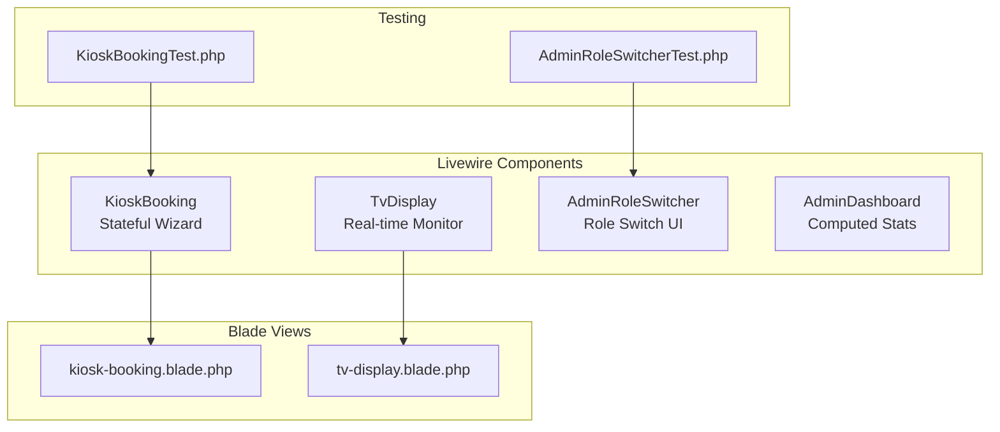
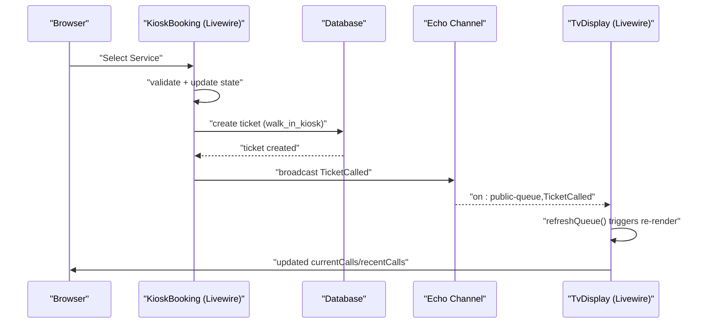
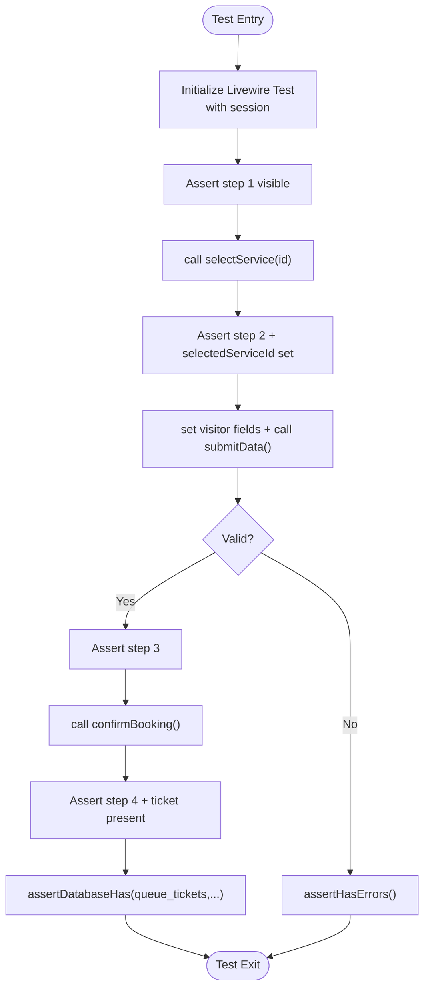
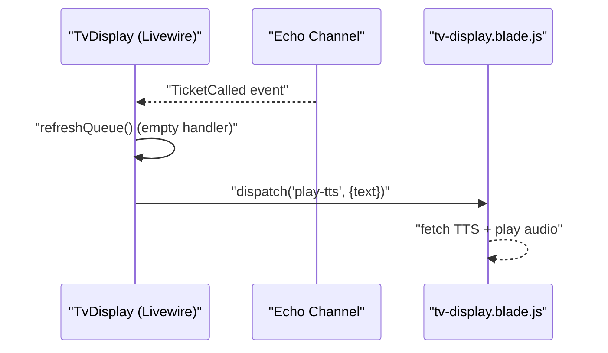
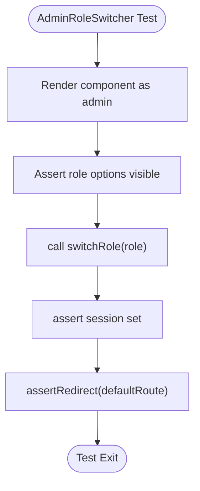
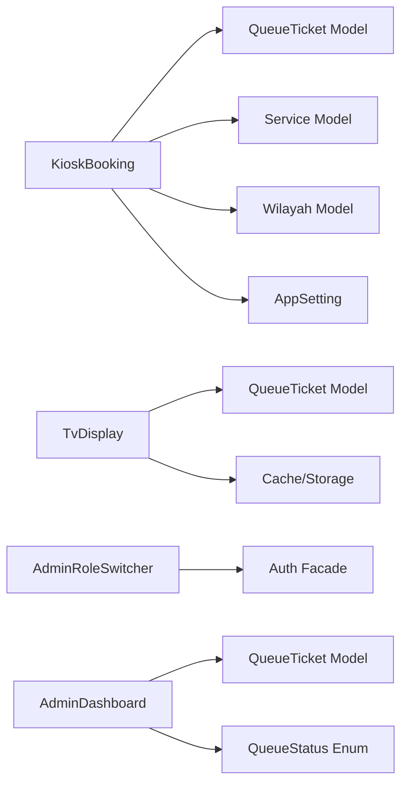

# Livewire Component Testing

<cite>
**Referenced Files in This Document**
- [composer.json](file://composer.json)
- [KioskBooking.php](file://app/Livewire/KioskBooking.php)
- [TvDisplay.php](file://app/Livewire/TvDisplay.php)
- [AdminRoleSwitcher.php](file://app/Livewire/AdminRoleSwitcher.php)
- [AdminDashboard.php](file://app/Livewire/Dashboard/AdminDashboard.php)
- [kiosk-booking.blade.php](file://resources/views/livewire/kiosk-booking.blade.php)
- [tv-display.blade.php](file://resources/views/livewire/tv-display.blade.php)
- [KioskBookingTest.php](file://tests/Feature/Kiosk/KioskBookingTest.php)
- [AdminRoleSwitcherTest.php](file://tests/Feature/Admin/AdminRoleSwitcherTest.php)
</cite>

## Table of Contents
1. [Introduction](#introduction)
2. [Project Structure](#project-structure)
3. [Core Components](#core-components)
4. [Architecture Overview](#architecture-overview)
5. [Detailed Component Analysis](#detailed-component-analysis)
6. [Dependency Analysis](#dependency-analysis)
7. [Performance Considerations](#performance-considerations)
8. [Troubleshooting Guide](#troubleshooting-guide)
9. [Conclusion](#conclusion)

## Introduction
This document provides specialized guidance for testing Livewire components in the PTSP system. It focuses on validating state changes, event handling, real-time updates, and component lifecycle behavior. The guide covers interactive UI flows (form submissions, dynamic content updates), WebSocket-driven real-time broadcasting, and component composition patterns. Practical testing strategies are illustrated using existing tests and components such as the Kiosk Booking wizard, TV Display monitor, Admin Role Switcher, and Admin Dashboard.

## Project Structure
The PTSP system leverages Livewire v4 for reactive UI components and Blade templates for rendering. Livewire components are located under app/Livewire, with Blade views under resources/views/livewire. Testing is performed using Pest with Livewire’s test helpers.

**Diagram sources**
- [KioskBooking.php:25-288](file://app/Livewire/KioskBooking.php#L25-L288)
- [TvDisplay.php:18-142](file://app/Livewire/TvDisplay.php#L18-L142)
- [AdminRoleSwitcher.php:9-52](file://app/Livewire/AdminRoleSwitcher.php#L9-L52)
- [AdminDashboard.php:12-233](file://app/Livewire/Dashboard/AdminDashboard.php#L12-L233)
- [kiosk-booking.blade.php:1-588](file://resources/views/livewire/kiosk-booking.blade.php#L1-L588)
- [tv-display.blade.php:1-213](file://resources/views/livewire/tv-display.blade.php#L1-L213)
- [KioskBookingTest.php:1-414](file://tests/Feature/Kiosk/KioskBookingTest.php#L1-L414)
- [AdminRoleSwitcherTest.php:1-109](file://tests/Feature/Admin/AdminRoleSwitcherTest.php#L1-L109)

**Section sources**
- [composer.json:11-34](file://composer.json#L11-L34)
- [KioskBooking.php:1-288](file://app/Livewire/KioskBooking.php#L1-L288)
- [TvDisplay.php:1-142](file://app/Livewire/TvDisplay.php#L1-L142)
- [AdminRoleSwitcher.php:1-52](file://app/Livewire/AdminRoleSwitcher.php#L1-L52)
- [AdminDashboard.php:1-233](file://app/Livewire/Dashboard/AdminDashboard.php#L1-L233)
- [kiosk-booking.blade.php:1-588](file://resources/views/livewire/kiosk-booking.blade.php#L1-L588)
- [tv-display.blade.php:1-213](file://resources/views/livewire/tv-display.blade.php#L1-L213)
- [KioskBookingTest.php:1-414](file://tests/Feature/Kiosk/KioskBookingTest.php#L1-L414)
- [AdminRoleSwitcherTest.php:1-109](file://tests/Feature/Admin/AdminRoleSwitcherTest.php#L1-L109)

## Core Components
- KioskBooking: Multi-step wizard for walk-in bookings with validation, persistence, and printing integration.
- TvDisplay: Real-time monitor displaying currently called tickets, recent history, and optional video playback with TTS announcements.
- AdminRoleSwitcher: Role switching UI for administrators with session-backed active role and route redirection.
- AdminDashboard: Computed metrics and charts for queue analytics with date-range filtering.

Key testing patterns demonstrated:
- State transitions across steps and modes (wizard, reprint).
- Validation and error handling for form fields.
- Real-time updates via Livewire re-rendering and Echo event listeners.
- Component lifecycle hooks and computed properties.

**Section sources**
- [KioskBooking.php:25-288](file://app/Livewire/KioskBooking.php#L25-L288)
- [TvDisplay.php:18-142](file://app/Livewire/TvDisplay.php#L18-L142)
- [AdminRoleSwitcher.php:9-52](file://app/Livewire/AdminRoleSwitcher.php#L9-L52)
- [AdminDashboard.php:12-233](file://app/Livewire/Dashboard/AdminDashboard.php#L12-L233)

## Architecture Overview
Livewire components integrate with Blade templates and backend actions/services. Real-time updates are handled through Echo channels and Livewire’s @on directive. The testing harness uses Pest with Livewire::test() to simulate user interactions and assert state changes.

**Diagram sources**
- [KioskBooking.php:155-180](file://app/Livewire/KioskBooking.php#L155-L180)
- [TvDisplay.php:22-27](file://app/Livewire/TvDisplay.php#L22-L27)
- [kiosk-booking.blade.php:476-568](file://resources/views/livewire/kiosk-booking.blade.php#L476-L568)

**Section sources**
- [TvDisplay.php:18-142](file://app/Livewire/TvDisplay.php#L18-L142)
- [KioskBooking.php:155-180](file://app/Livewire/KioskBooking.php#L155-L180)
- [kiosk-booking.blade.php:476-568](file://resources/views/livewire/kiosk-booking.blade.php#L476-L568)

## Detailed Component Analysis

### KioskBooking Component Testing
Focus areas:
- State changes across steps (1–4) and modes (reprint).
- Validation rules for visitor data and wilayah scoping.
- Ticket creation and barcode generation.
- Reprint search by identifier or phone.

Recommended testing patterns:
- Use Livewire::test() to initialize component state.
- Assert step transitions after invoking methods like selectService(), submitData(), confirmBooking().
- Validate error messages using assertHasErrors().
- Verify database records created with expected attributes.
- Simulate reprint queries and assert presence/absence of results.

**Diagram sources**
- [KioskBooking.php:89-180](file://app/Livewire/KioskBooking.php#L89-L180)
- [KioskBookingTest.php:81-205](file://tests/Feature/Kiosk/KioskBookingTest.php#L81-L205)

**Section sources**
- [KioskBooking.php:25-288](file://app/Livewire/KioskBooking.php#L25-L288)
- [kiosk-booking.blade.php:134-473](file://resources/views/livewire/kiosk-booking.blade.php#L134-L473)
- [KioskBookingTest.php:1-414](file://tests/Feature/Kiosk/KioskBookingTest.php#L1-L414)

### TvDisplay Component Testing
Focus areas:
- Real-time updates via Echo event listener.
- Announcement logic for newly called tickets.
- Video playlist and fallback behavior.
- TTS integration via frontend dispatch.

Recommended testing patterns:
- Assert component renders currentCalls and recentCalls.
- Trigger Livewire refresh via @on handler and verify re-render.
- Simulate TTS announcement via window event and assert audio playback.
- Verify video rotation and fallback to YouTube playlist.

**Diagram sources**
- [TvDisplay.php:22-68](file://app/Livewire/TvDisplay.php#L22-L68)
- [tv-display.blade.php:30-40](file://resources/views/livewire/tv-display.blade.php#L30-L40)

**Section sources**
- [TvDisplay.php:18-142](file://app/Livewire/TvDisplay.php#L18-L142)
- [tv-display.blade.php:1-213](file://resources/views/livewire/tv-display.blade.php#L1-L213)

### AdminRoleSwitcher Component Testing
Focus areas:
- Rendering switcher UI for admins.
- Session-backed active role persistence.
- Redirect behavior to role-specific routes.
- Validation and forbidden access for non-admins.

Recommended testing patterns:
- Use Livewire::actingAs() with admin user.
- Assert UI elements are visible.
- Call switchRole() and assert session value and redirect target.
- Validate error handling for invalid roles and non-admin access.

**Diagram sources**
- [AdminRoleSwitcher.php:29-45](file://app/Livewire/AdminRoleSwitcher.php#L29-L45)
- [AdminRoleSwitcherTest.php:46-80](file://tests/Feature/Admin/AdminRoleSwitcherTest.php#L46-L80)

**Section sources**
- [AdminRoleSwitcher.php:9-52](file://app/Livewire/AdminRoleSwitcher.php#L9-L52)
- [AdminRoleSwitcherTest.php:1-109](file://tests/Feature/Admin/AdminRoleSwitcherTest.php#L1-L109)

### AdminDashboard Component Testing
Focus areas:
- Computed properties with persistence and caching.
- Date range filtering and metric recalculation.
- Trend data generation and recent activities.

Recommended testing patterns:
- Set startDate/endDate and call filterByDate() to invalidate cached computed values.
- Assert computed metrics (todayTotal, todayServed, todayWaiting, etc.) change accordingly.
- Validate trendData shape and recentActivities collection.

**Section sources**
- [AdminDashboard.php:12-233](file://app/Livewire/Dashboard/AdminDashboard.php#L12-L233)

## Dependency Analysis
Livewire components depend on:
- Eloquent models for data retrieval and persistence.
- Enumerations for status and roles.
- External services for TTS and thermal printer integration (via Blade JS bindings).
- Broadcasting channels for real-time updates.

**Diagram sources**
- [KioskBooking.php:5-11](file://app/Livewire/KioskBooking.php#L5-L11)
- [TvDisplay.php:5-10](file://app/Livewire/TvDisplay.php#L5-L10)
- [AdminRoleSwitcher.php:5-7](file://app/Livewire/AdminRoleSwitcher.php#L5-L7)
- [AdminDashboard.php:5-10](file://app/Livewire/Dashboard/AdminDashboard.php#L5-L10)

**Section sources**
- [KioskBooking.php:1-288](file://app/Livewire/KioskBooking.php#L1-L288)
- [TvDisplay.php:1-142](file://app/Livewire/TvDisplay.php#L1-L142)
- [AdminRoleSwitcher.php:1-52](file://app/Livewire/AdminRoleSwitcher.php#L1-L52)
- [AdminDashboard.php:1-233](file://app/Livewire/Dashboard/AdminDashboard.php#L1-L233)

## Performance Considerations
- Prefer computed properties with persistence for expensive queries to reduce database load.
- Use targeted validation to avoid unnecessary server calls.
- Minimize heavy DOM updates by leveraging Livewire’s reactivity and Blade fragments.
- Cache static assets (videos, images) to improve TV Display responsiveness.

## Troubleshooting Guide
Common issues and resolutions:
- Validation errors not appearing: Ensure assertHasErrors() targets correct field names and that Livewire validates before state changes.
- Real-time updates not triggering: Verify Echo channel binding and @on directive registration.
- Session-based role not persisting: Confirm session keys and guards are correctly set during tests.
- Computed metrics stale: Call filterByDate() to invalidate cached computed values before assertions.

**Section sources**
- [KioskBookingTest.php:97-149](file://tests/Feature/Kiosk/KioskBookingTest.php#L97-L149)
- [AdminRoleSwitcherTest.php:57-98](file://tests/Feature/Admin/AdminRoleSwitcherTest.php#L57-L98)
- [TvDisplay.php:22-27](file://app/Livewire/TvDisplay.php#L22-L27)
- [AdminDashboard.php:24-38](file://app/Livewire/Dashboard/AdminDashboard.php#L24-L38)

## Conclusion
Livewire component testing in PTSP centers on validating state transitions, form validation, real-time broadcasting, and computed metrics. By leveraging Pest’s Livewire helpers and focusing on component lifecycle hooks, event handling, and integration points (Echo, TTS, printing), teams can ensure robust, maintainable UI behavior. The provided patterns and references offer a practical foundation for extending tests to complex workflows such as queue management and display components.