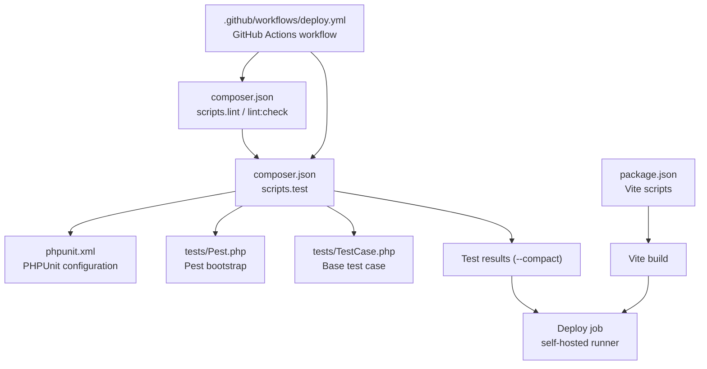
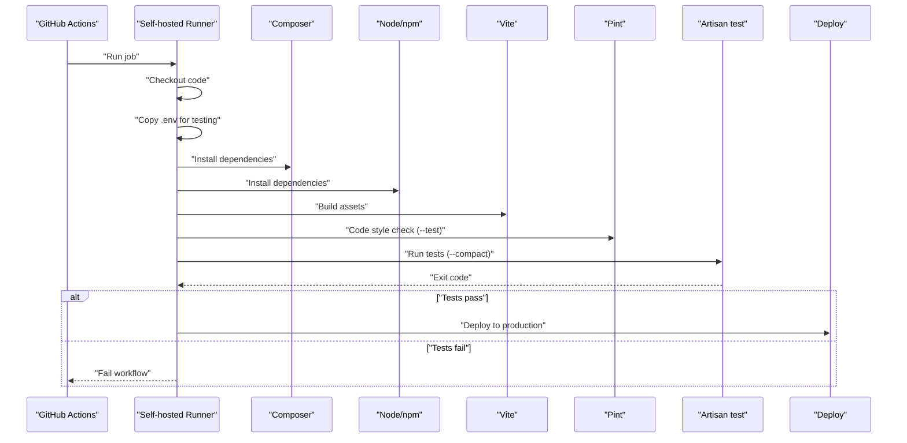
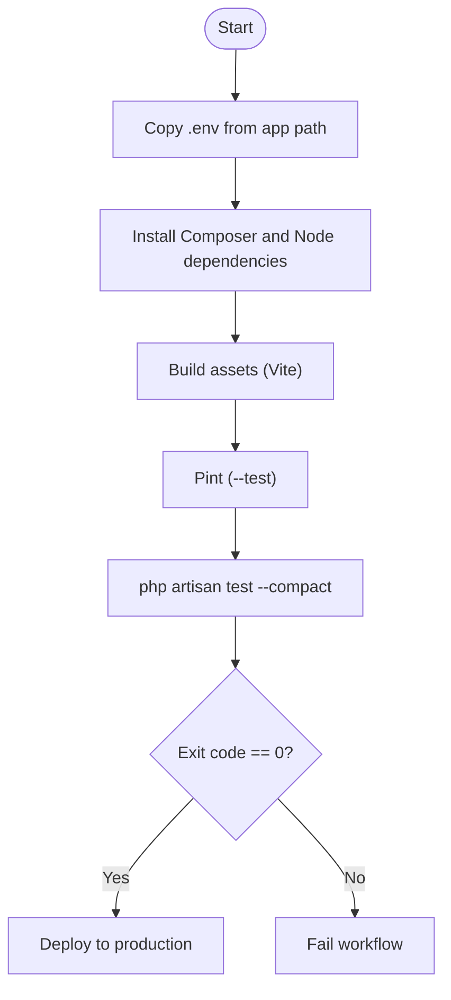
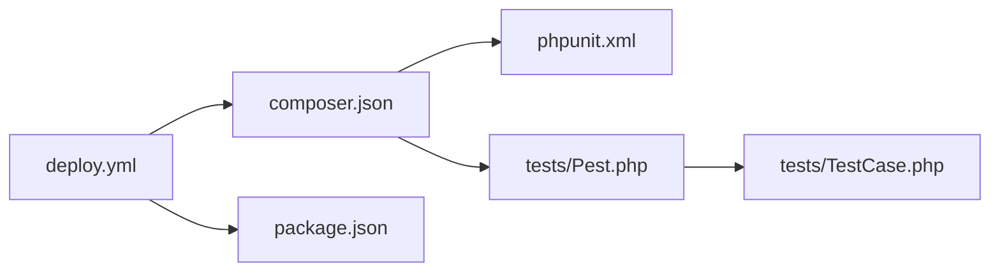

# Test Execution and CI/CD

<cite>
**Referenced Files in This Document**
- [deploy.yml](file://.github/workflows/deploy.yml)
- [phpunit.xml](file://phpunit.xml)
- [composer.json](file://composer.json)
- [package.json](file://package.json)
- [Pest.php](file://tests/Pest.php)
- [TestCase.php](file://tests/TestCase.php)
- [ExampleTest.php (Feature)](file://tests/Feature/ExampleTest.php)
- [ExampleTest.php (Unit)](file://tests/Unit/ExampleTest.php)
- [workflow.md](file://conductor/workflow.md)
</cite>

## Table of Contents
1. [Introduction](#introduction)
2. [Project Structure](#project-structure)
3. [Core Components](#core-components)
4. [Architecture Overview](#architecture-overview)
5. [Detailed Component Analysis](#detailed-component-analysis)
6. [Dependency Analysis](#dependency-analysis)
7. [Performance Considerations](#performance-considerations)
8. [Troubleshooting Guide](#troubleshooting-guide)
9. [Conclusion](#conclusion)
10. [Appendices](#appendices)

## Introduction
This document explains the complete test execution pipeline and CI/CD integration for the PTSP system. It covers the GitHub Actions workflow configuration, automated test execution, continuous integration processes, and deployment pipeline. It also documents local test execution strategies, parallel testing capabilities, test result interpretation, debugging failed tests, performance and load testing procedures, and best practices for test maintenance, refactoring, and reliability.

## Project Structure
The repository uses Laravel with Pest for testing. The CI/CD pipeline is defined in a single GitHub Actions workflow that runs tests on a self-hosted runner and deploys to production. Local development scripts and Composer scripts orchestrate linting, testing, and asset builds.

**Diagram sources**
- [deploy.yml:11-37](file://.github/workflows/deploy.yml#L11-L37)
- [composer.json:66-80](file://composer.json#L66-L80)
- [phpunit.xml:7-35](file://phpunit.xml#L7-L35)
- [Pest.php:29-31](file://tests/Pest.php#L29-L31)
- [TestCase.php:7-11](file://tests/TestCase.php#L7-L11)
- [package.json:5-8](file://package.json#L5-L8)

**Section sources**
- [deploy.yml:1-79](file://.github/workflows/deploy.yml#L1-L79)
- [composer.json:1-118](file://composer.json#L1-L118)
- [phpunit.xml:1-36](file://phpunit.xml#L1-L36)
- [package.json:1-28](file://package.json#L1-L28)

## Core Components
- GitHub Actions workflow orchestrates CI/CD:
  - Runs tests on a self-hosted runner.
  - Deploys to production after tests succeed.
- Laravel application:
  - Uses Pest for expressive tests.
  - PHPUnit configuration defines test suites and environment overrides for testing.
- Composer scripts:
  - Provide standardized commands for linting, testing, and CI checks.
- Vite build pipeline:
  - Assets built locally and during CI for production parity.

Key behaviors:
- Tests are executed via the Laravel Artisan test command with compact output.
- Code style enforcement uses Laravel Pint in test and CI contexts.
- Environment variables for testing are defined in phpunit.xml.

**Section sources**
- [deploy.yml:11-37](file://.github/workflows/deploy.yml#L11-L37)
- [composer.json:66-80](file://composer.json#L66-L80)
- [phpunit.xml:20-34](file://phpunit.xml#L20-L34)

## Architecture Overview
The CI/CD pipeline executes the following stages:
1. Checkout code
2. Prepare environment (copy .env from app path)
3. Install dependencies (Composer and Node)
4. Build assets (Vite)
5. Code style check (Pint)
6. Run tests (Laravel Artisan test)
7. Deploy to production (self-hosted runner)

**Diagram sources**
- [deploy.yml:17-36](file://.github/workflows/deploy.yml#L17-L36)
- [composer.json:66-80](file://composer.json#L66-L80)
- [package.json:5-8](file://package.json#L5-L8)

## Detailed Component Analysis

### GitHub Actions Workflow (.github/workflows/deploy.yml)
- Triggers on pushes to the main branch.
- Job "test":
  - Runs on a self-hosted runner.
  - Steps include checkout, copying .env from the app path, installing Composer and Node dependencies, building assets, running Pint, and executing Laravel tests with compact output.
- Job "deploy":
  - Depends on "test".
  - Pulls latest code, installs production dependencies, builds assets, enables maintenance mode, runs migrations, caches configuration/routing/views/events, restarts queue workers, and disables maintenance mode.

Quality gates:
- Tests must pass before deployment proceeds.
- Code style enforced via Pint.

**Section sources**
- [deploy.yml:1-79](file://.github/workflows/deploy.yml#L1-L79)

### Laravel Test Configuration (phpunit.xml)
- Defines two test suites: Unit and Feature.
- Includes the app directory for coverage.
- Sets environment variables for testing:
  - APP_ENV=testing
  - APP_MAINTENANCE_DRIVER=file
  - BCRYPT_ROUNDS reduced for speed
  - CACHE_STORE=array
  - DB_CONNECTION=sqlite with in-memory database
  - QUEUE_CONNECTION=sync
  - MAIL_MAILER=array
  - SESSION_DRIVER=array
  - Disables Pulse, Telescope, Nightwatch for CI stability.

These settings optimize test performance and isolation in CI.

**Section sources**
- [phpunit.xml:7-35](file://phpunit.xml#L7-L35)

### Pest Bootstrap (tests/Pest.php)
- Extends the base Laravel TestCase.
- Applies RefreshDatabase for database tests.
- Scopes test execution to Feature and Unit directories.
- Includes a guard against unsafe database names for MySQL/MariaDB/PostgreSQL/SQLServer connections.

This ensures consistent test setup and prevents accidental writes to production databases.

**Section sources**
- [Pest.php:29-31](file://tests/Pest.php#L29-L31)
- [Pest.php:3-16](file://tests/Pest.php#L3-L16)

### Base Test Case (tests/TestCase.php)
- Minimal base class extending Laravel’s TestCase.
- Provides shared test infrastructure for all tests.

**Section sources**
- [TestCase.php:7-11](file://tests/TestCase.php#L7-L11)

### Example Tests
- Feature example demonstrates a simple HTTP assertion.
- Unit example demonstrates a basic expectation.

These illustrate the Pest syntax and testing patterns used across the suite.

**Section sources**
- [ExampleTest.php (Feature):3-7](file://tests/Feature/ExampleTest.php#L3-L7)
- [ExampleTest.php (Unit):3-5](file://tests/Unit/ExampleTest.php#L3-L5)

### Composer Scripts (composer.json)
- Provides standardized commands:
  - lint and lint:check for Pint parallel execution.
  - test script that clears config cache, runs lint:check, and executes Laravel tests.
  - ci:check script delegates to @test for CI.
  - dev script runs server, queue listener, and Vite concurrently.
- These scripts unify developer and CI commands.

**Section sources**
- [composer.json:66-80](file://composer.json#L66-L80)
- [composer.json:62-65](file://composer.json#L62-L65)

### Vite Build Pipeline (package.json)
- Defines build and dev scripts for Vite.
- Ensures assets are built consistently in CI and locally.

**Section sources**
- [package.json:5-8](file://package.json#L5-L8)

### Test Execution Flow (Local and CI)

**Diagram sources**
- [deploy.yml:17-36](file://.github/workflows/deploy.yml#L17-L36)
- [composer.json:66-80](file://composer.json#L66-L80)

## Dependency Analysis
- Workflow depends on:
  - Composer for PHP dependencies and scripts.
  - Node/npm for frontend dependencies and Vite.
  - Laravel Artisan test command for executing Pest tests.
- Pest depends on:
  - PHPUnit (via Laravel installation).
  - Laravel’s RefreshDatabase trait for database tests.
- phpunit.xml defines environment and coverage inclusion for accurate reporting.

**Diagram sources**
- [deploy.yml:17-36](file://.github/workflows/deploy.yml#L17-L36)
- [composer.json:66-80](file://composer.json#L66-L80)
- [phpunit.xml:7-19](file://phpunit.xml#L7-L19)
- [Pest.php:29-31](file://tests/Pest.php#L29-L31)
- [TestCase.php:7-11](file://tests/TestCase.php#L7-L11)

**Section sources**
- [composer.json:66-80](file://composer.json#L66-L80)
- [phpunit.xml:7-19](file://phpunit.xml#L7-L19)
- [Pest.php:29-31](file://tests/Pest.php#L29-L31)

## Performance Considerations
- Database testing:
  - SQLite in-memory database reduces overhead and improves speed.
  - RefreshDatabase trait resets schema per test for isolation.
- Reduced cryptographic cost:
  - Lower bcrypt rounds in testing reduce hashing time.
- Synchronous queues:
  - Sync driver avoids external queue infrastructure overhead in CI.
- Parallel linting:
  - Pint parallel mode speeds up style checks.

Recommendations:
- Prefer unit and feature tests over heavy integration tests in CI.
- Keep test data minimal and deterministic.
- Use factories and seeding sparingly in CI; rely on in-memory DB.

**Section sources**
- [phpunit.xml:20-34](file://phpunit.xml#L20-L34)
- [composer.json:66-71](file://composer.json#L66-L71)

## Troubleshooting Guide
Common issues and resolutions:
- Unsafe database configuration:
  - Pest guards against non-test suffixes for MySQL/MariaDB/PostgreSQL/SQLServer. Ensure test database names end with _test or _testing when using those drivers.
- Environment mismatch:
  - CI copies .env from the app path; ensure secrets are present and correct.
- Asset build failures:
  - Verify Node/npm availability and correct versions. Rebuild assets locally to reproduce issues.
- Test failures:
  - Run tests locally with the same configuration as CI to reproduce.
  - Interpret compact output to identify failing suites or tests quickly.
- Deployment rollback:
  - Maintenance mode is enabled during migration; if deployment fails, inspect logs and disable maintenance mode manually.

Debugging steps:
- Reproduce locally using Composer scripts.
- Temporarily increase verbosity for specific test suites.
- Inspect phpunit.xml environment variables for differences from local .env.

**Section sources**
- [Pest.php:3-16](file://tests/Pest.php#L3-L16)
- [deploy.yml:20-21](file://.github/workflows/deploy.yml#L20-L21)
- [composer.json:66-80](file://composer.json#L66-L80)

## Conclusion
The PTSP system employs a streamlined CI/CD pipeline that enforces quality gates through automated testing and code style checks. Laravel Pest and PHPUnit provide a robust testing foundation, while Composer and Vite scripts ensure consistent local and CI environments. The self-hosted runner simplifies deployment automation after successful tests. Following the best practices outlined here will maintain reliability, improve test performance, and accelerate feedback loops.

## Appendices

### Local Test Execution Strategies
- Use Composer scripts for consistent execution:
  - Lint: composer run-script lint:check
  - Test: composer run-script test
  - Dev: composer run-script dev (runs server, queue, and Vite concurrently)
- Run subsets of tests:
  - Feature: vendor/bin/pest tests/Feature
  - Unit: vendor/bin/pest tests/Unit
- Interpreting results:
  - Compact output highlights failures quickly; review failing suite names and test names to locate issues.

**Section sources**
- [composer.json:66-80](file://composer.json#L66-L80)
- [phpunit.xml:7-14](file://phpunit.xml#L7-L14)

### Parallel Testing Capabilities
- Pest supports parallel execution via ParaTest integration (installed as a dev dependency). Configure parallelism in CI to speed up test runs.
- Coverage reporting:
  - ParaTest supports coverage formats (e.g., Clover, HTML). Configure coverage output in CI to generate reports for PRs and artifacts.

Note: Confirm ParaTest configuration and coverage options in your CI environment.

**Section sources**
- [composer.json:32-33](file://composer.json#L32-L33)

### Test Coverage Reporting and Quality Gates
- Coverage scope:
  - phpunit.xml includes the app directory for coverage calculation.
- Quality gates:
  - Tests must pass.
  - Code style enforced by Pint.
  - Optional: coverage thresholds and style guides defined in conductor workflow documentation.

**Section sources**
- [phpunit.xml:15-19](file://phpunit.xml#L15-L19)
- [workflow.md:137-150](file://conductor/workflow.md#L137-L150)

### Performance and Load Testing Procedures
- Performance testing:
  - Use Pest to write performance-focused tests (e.g., measuring request durations under load).
  - Isolate performance tests from regular suites to avoid flakiness.
- Load testing:
  - Consider external tools (e.g., Artillery, K6) for end-to-end load scenarios.
  - Validate queue worker behavior and database throughput under simulated load.

Guidelines:
- Keep performance tests deterministic.
- Use synthetic traffic and realistic payloads.
- Monitor queue latency and error rates during load tests.

[No sources needed since this section provides general guidance]

### Test Maintenance, Refactoring, and Reliability Best Practices
- Follow TDD:
  - Red-Green-Refactor cycle with Pest tests.
  - Maintain quality gates before completing tasks.
- Coverage verification:
  - Aim for high coverage on new code; verify with coverage reports.
- Code style:
  - Enforce with Pint; run lint:check locally and in CI.
- Reliability:
  - Use factories and seeded data sparingly in CI.
  - Prefer deterministic assertions and avoid flaky time-based checks.

**Section sources**
- [workflow.md:22-34](file://conductor/workflow.md#L22-L34)
- [workflow.md:137-150](file://conductor/workflow.md#L137-L150)