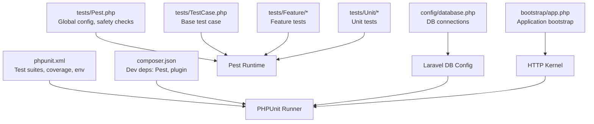
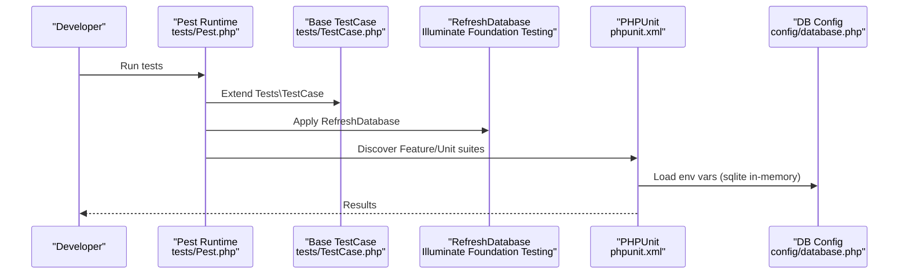
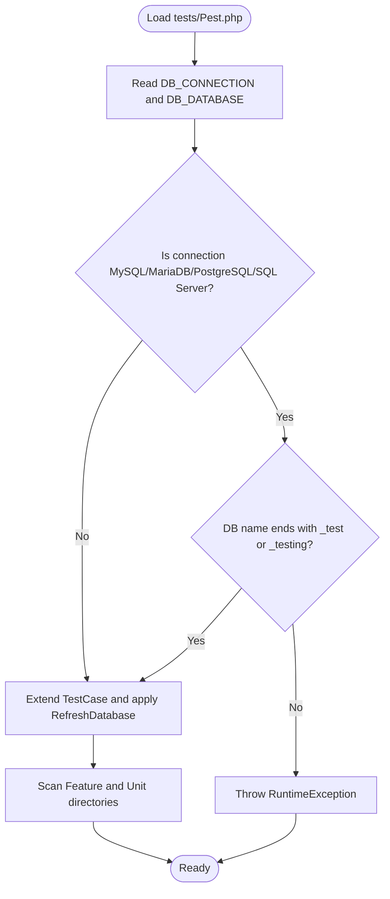
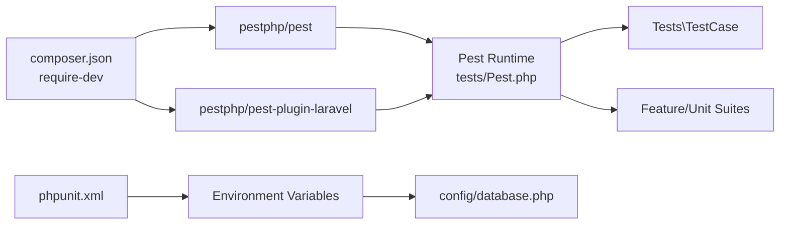

# Test Framework Setup

<cite>
**Referenced Files in This Document**
- [phpunit.xml](file://phpunit.xml)
- [composer.json](file://composer.json)
- [bootstrap/app.php](file://bootstrap/app.php)
- [config/database.php](file://config/database.php)
- [tests/TestCase.php](file://tests/TestCase.php)
- [tests/Pest.php](file://tests/Pest.php)
- [tests/Feature/ExampleTest.php](file://tests/Feature/ExampleTest.php)
- [tests/Unit/ExampleTest.php](file://tests/Unit/ExampleTest.php)
- [tests/Feature/Auth/AuthenticationTest.php](file://tests/Feature/Auth/AuthenticationTest.php)
- [.agents/skills/pest-testing/SKILL.md](file://.agents/skills/pest-testing/SKILL.md)
- [.claude/skills/pest-testing/SKILL.md](file://.claude/skills/pest-testing/SKILL.md)
</cite>

## Table of Contents
1. [Introduction](#introduction)
2. [Project Structure](#project-structure)
3. [Core Components](#core-components)
4. [Architecture Overview](#architecture-overview)
5. [Detailed Component Analysis](#detailed-component-analysis)
6. [Dependency Analysis](#dependency-analysis)
7. [Performance Considerations](#performance-considerations)
8. [Troubleshooting Guide](#troubleshooting-guide)
9. [Conclusion](#conclusion)

## Introduction
This document explains the PTSP testing framework setup, focusing on PestPHP and PHPUnit configuration, test bootstrap process, environment setup, database configuration, the base TestCase class, shared testing utilities, phpunit.xml configuration, PestPHP integration, and global test configuration. It also provides setup instructions for local development, CI/CD environment configuration, and debugging test environments.

## Project Structure
The testing setup centers around PestPHP and PHPUnit with Laravel’s testing ecosystem. Tests are organized into Feature and Unit directories, with Pest providing expressive test syntax and shared utilities.

**Diagram sources**
- [phpunit.xml:1-36](file://phpunit.xml#L1-L36)
- [composer.json:24-34](file://composer.json#L24-L34)
- [tests/Pest.php:1-63](file://tests/Pest.php#L1-L63)
- [tests/TestCase.php:1-11](file://tests/TestCase.php#L1-L11)
- [config/database.php:1-65](file://config/database.php#L1-L65)
- [bootstrap/app.php:1-32](file://bootstrap/app.php#L1-L32)

**Section sources**
- [phpunit.xml:1-36](file://phpunit.xml#L1-L36)
- [composer.json:24-34](file://composer.json#L24-L34)
- [tests/Pest.php:1-63](file://tests/Pest.php#L1-L63)
- [tests/TestCase.php:1-11](file://tests/TestCase.php#L1-L11)
- [config/database.php:1-65](file://config/database.php#L1-L65)
- [bootstrap/app.php:1-32](file://bootstrap/app.php#L1-L32)

## Core Components
- PestPHP runtime and configuration in tests/Pest.php
- PHPUnit configuration in phpunit.xml
- Base TestCase class in tests/TestCase.php
- Laravel application bootstrap in bootstrap/app.php
- Database configuration in config/database.php
- Composer dev dependencies for Pest and Laravel plugin

Key responsibilities:
- tests/Pest.php: Extends the base test case, applies RefreshDatabase, enforces safe database naming for MySQL/MariaDB/PostgreSQL/SQL Server, and exposes global helpers.
- phpunit.xml: Defines test suites, source inclusion, and environment variables for deterministic testing.
- tests/TestCase.php: Minimal base class extending Laravel’s base TestCase.
- config/database.php: Provides default sqlite connection and supports mysql/pgsql/sqlsrv configurations.
- composer.json: Declares pestphp/pest and pestphp/pest-plugin-laravel as dev dependencies.

**Section sources**
- [tests/Pest.php:1-63](file://tests/Pest.php#L1-L63)
- [phpunit.xml:1-36](file://phpunit.xml#L1-L36)
- [tests/TestCase.php:1-11](file://tests/TestCase.php#L1-L11)
- [config/database.php:1-65](file://config/database.php#L1-L65)
- [composer.json:24-34](file://composer.json#L24-L34)

## Architecture Overview
The testing architecture integrates PestPHP with Laravel’s testing traits and PHPUnit. Pest bootstraps by extending the base TestCase and applying RefreshDatabase, while PHPUnit loads the Composer autoloader and sets environment variables for isolation and speed.

**Diagram sources**
- [tests/Pest.php:29-31](file://tests/Pest.php#L29-L31)
- [tests/TestCase.php:7-10](file://tests/TestCase.php#L7-L10)
- [phpunit.xml:20-34](file://phpunit.xml#L20-L34)
- [config/database.php:20-45](file://config/database.php#L20-L45)

## Detailed Component Analysis

### PestPHP Global Configuration
Pest bootstraps the test environment by:
- Extending the base test case class
- Applying the RefreshDatabase trait for per-test database refresh
- Scanning Feature and Unit directories
- Enforcing safety checks for database names when using MySQL/MariaDB/PostgreSQL/SQL Server

Safety enforcement prevents destructive testing against production-like databases by requiring suffixes _test or _testing.

**Diagram sources**
- [tests/Pest.php:1-16](file://tests/Pest.php#L1-L16)
- [tests/Pest.php:29-31](file://tests/Pest.php#L29-L31)

**Section sources**
- [tests/Pest.php:1-63](file://tests/Pest.php#L1-L63)

### PHPUnit Configuration
The phpunit.xml defines:
- Test suites for Unit and Feature directories
- Source inclusion for coverage targeting the app directory
- Environment variables ensuring a fast, isolated, and secure testing environment:
  - APP_ENV set to testing
  - APP_MAINTENANCE_DRIVER set to file
  - BCRYPT_ROUNDS reduced for speed
  - CACHE_STORE, MAIL_MAILER, QUEUE_CONNECTION, SESSION_DRIVER optimized for memory
  - DB_CONNECTION set to sqlite with DB_DATABASE as :memory:
  - PULSE_ENABLED, TELESCOPE_ENABLED, NIGHTWATCH_ENABLED disabled

These settings enable rapid, deterministic tests with minimal external dependencies.

**Section sources**
- [phpunit.xml:1-36](file://phpunit.xml#L1-L36)

### Base TestCase Class
The base TestCase class extends Laravel’s base TestCase and serves as the foundation for all tests. It is extended by Pest and can be further customized to share common behaviors across tests.

**Section sources**
- [tests/TestCase.php:1-11](file://tests/TestCase.php#L1-L11)

### Database Configuration for Testing
Laravel’s config/database.php provides:
- Default connection from environment variable DB_CONNECTION
- SQLite as the default driver with configurable database file path
- Optional MySQL, PostgreSQL, SQL Server connections with environment overrides

For testing, phpunit.xml sets DB_CONNECTION to sqlite and DB_DATABASE to an in-memory database (:memory:), ensuring isolation and speed.

**Section sources**
- [config/database.php:1-65](file://config/database.php#L1-L65)
- [phpunit.xml:26-27](file://phpunit.xml#L26-L27)

### Example Test Patterns
- Feature tests use Pest’s test() function and Laravel’s HTTP testing helpers.
- Unit tests use Pest’s expect() assertions.
- Authentication tests demonstrate factory usage, route testing, and session assertions.

These patterns illustrate how Pest simplifies expressive, readable tests aligned with Laravel’s testing capabilities.

**Section sources**
- [tests/Feature/ExampleTest.php:1-8](file://tests/Feature/ExampleTest.php#L1-L8)
- [tests/Unit/ExampleTest.php:1-6](file://tests/Unit/ExampleTest.php#L1-L6)
- [tests/Feature/Auth/AuthenticationTest.php:1-70](file://tests/Feature/Auth/AuthenticationTest.php#L1-L70)

### PestPHP Integration and Shared Utilities
Pest integrates with Laravel through:
- Extending Tests\TestCase
- Applying Illuminate\Foundation\Testing\RefreshDatabase
- Providing global helpers and expectation extensions

The Pest skill documents describe recommended usage patterns, including running filtered tests and leveraging Pest-specific assertions.

**Section sources**
- [tests/Pest.php:29-31](file://tests/Pest.php#L29-L31)
- [.agents/skills/pest-testing/SKILL.md:1-78](file://.agents/skills/pest-testing/SKILL.md#L1-L78)
- [.claude/skills/pest-testing/SKILL.md:1-78](file://.claude/skills/pest-testing/SKILL.md#L1-L78)

## Dependency Analysis
The testing stack depends on Composer dev packages and Laravel’s testing infrastructure. PestPHP and the Laravel plugin are declared in composer.json under require-dev. Pest’s configuration relies on the base TestCase and RefreshDatabase trait.

**Diagram sources**
- [composer.json:24-34](file://composer.json#L24-L34)
- [tests/Pest.php:29-31](file://tests/Pest.php#L29-L31)
- [phpunit.xml:20-34](file://phpunit.xml#L20-L34)
- [config/database.php:20-45](file://config/database.php#L20-L45)

**Section sources**
- [composer.json:24-34](file://composer.json#L24-L34)
- [tests/Pest.php:29-31](file://tests/Pest.php#L29-L31)
- [phpunit.xml:20-34](file://phpunit.xml#L20-L34)
- [config/database.php:20-45](file://config/database.php#L20-L45)

## Performance Considerations
- Using sqlite with an in-memory database (DB_DATABASE=:memory:) minimizes disk I/O and enables fast test runs.
- Reduced bcrypt cost (BCRYPT_ROUNDS=4) accelerates hashing-heavy tests.
- Array-backed cache, session, and mailers eliminate persistent stores during tests.
- RefreshDatabase trait ensures a clean database state per test without manual teardown.

[No sources needed since this section provides general guidance]

## Troubleshooting Guide
Common issues and resolutions:
- Unsafe database configuration: Pest throws a RuntimeException if using MySQL/MariaDB/PostgreSQL/SQL Server without _test or _testing suffixes. Switch to sqlite or append the required suffix.
- Environment mismatch: Ensure APP_ENV=testing and DB_CONNECTION=sqlite with DB_DATABASE=:memory: for consistent behavior.
- Missing Pest or plugin: Confirm pestphp/pest and pestphp/pest-plugin-laravel are present in composer.json require-dev.
- Slow tests: Verify environment variables are loaded from phpunit.xml and that RefreshDatabase is applied to avoid cross-test contamination.

**Section sources**
- [tests/Pest.php:1-16](file://tests/Pest.php#L1-L16)
- [phpunit.xml:20-34](file://phpunit.xml#L20-L34)
- [composer.json:24-34](file://composer.json#L24-L34)

## Conclusion
The PTSP testing framework leverages PestPHP and PHPUnit with Laravel’s testing ecosystem. Pest bootstraps tests by extending a base TestCase and applying RefreshDatabase, while phpunit.xml configures a fast, isolated, and secure environment using sqlite in-memory. The setup is designed for reliability, speed, and developer productivity, with explicit safeguards against unsafe database configurations.