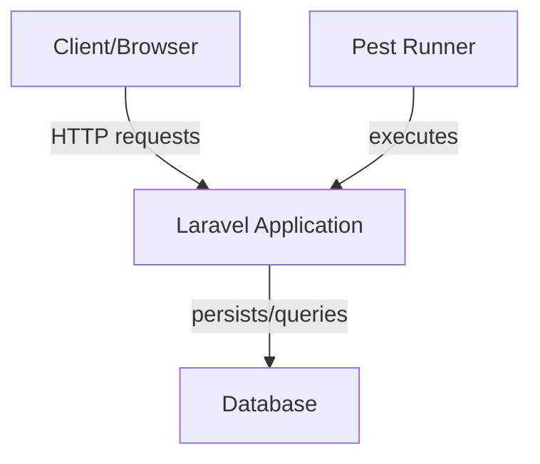
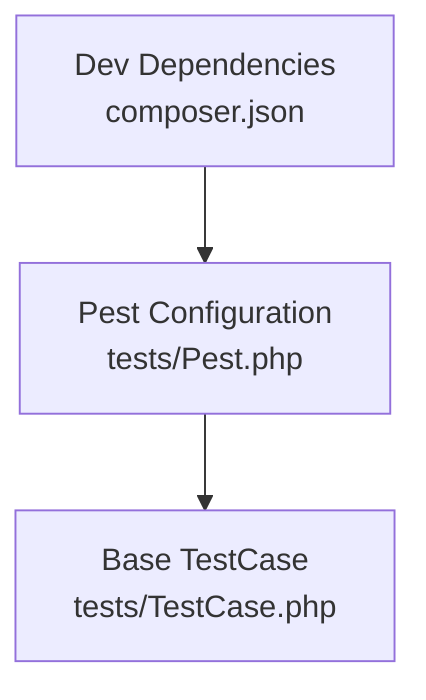
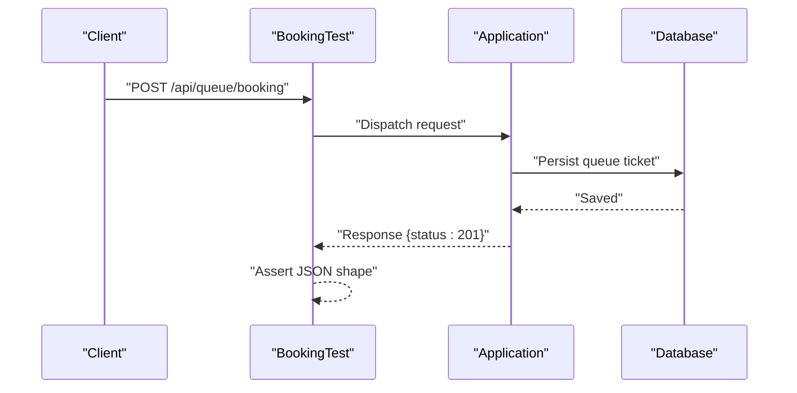
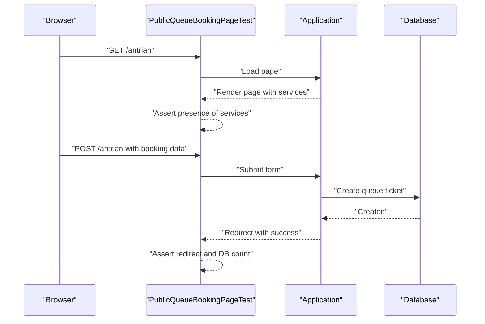
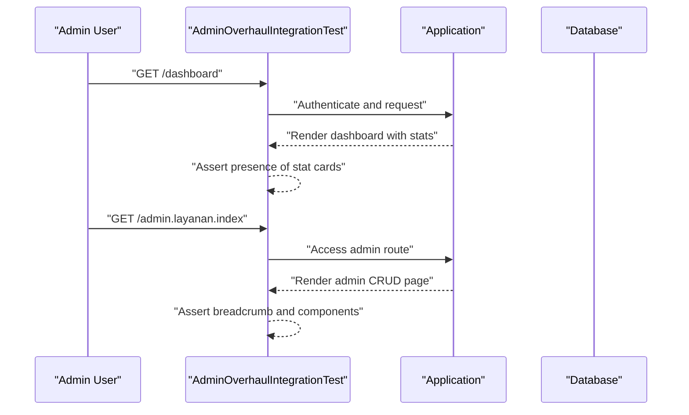
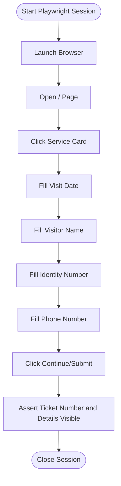

# Test Types and Organization

<cite>
**Referenced Files in This Document**
- [composer.json](file://composer.json)
- [tests/Pest.php](file://tests/Pest.php)
- [tests/TestCase.php](file://tests/TestCase.php)
- [tests/Feature/ExampleTest.php](file://tests/Feature/ExampleTest.php)
- [tests/Unit/ExampleTest.php](file://tests/Unit/ExampleTest.php)
- [tests/Feature/Api/BookingTest.php](file://tests/Feature/Api/BookingTest.php)
- [tests/Feature/Auth/AuthenticationTest.php](file://tests/Feature/Auth/AuthenticationTest.php)
- [tests/Feature/Public/PublicQueueBookingPageTest.php](file://tests/Feature/Public/PublicQueueBookingPageTest.php)
- [tests/Feature/Security/LoginRateLimitingTest.php](file://tests/Feature/Security/LoginRateLimitingTest.php)
- [tests/Feature/Integration/AdminOverhaulIntegrationTest.php](file://tests/Feature/Integration/AdminOverhaulIntegrationTest.php)
- [tests/Feature/Database/QueueSchemaTest.php](file://tests/Feature/Database/QueueSchemaTest.php)
- [tests/Feature/Models/QueueRelationshipsTest.php](file://tests/Feature/Models/QueueRelationshipsTest.php)
- [tests/Unit/Models/QueueTicketTest.php](file://tests/Unit/Models/QueueTicketTest.php)
- [tests/Unit/Queue/GenerateTicketNumberTest.php](file://tests/Unit/Queue/GenerateTicketNumberTest.php)
- [tests/Feature/Reports/QueueReportBuilderTest.php](file://tests/Feature/Reports/QueueReportBuilderTest.php)
- [tests/Unit/Reports/QueueReportBuilderTest.php](file://tests/Unit/Reports/QueueReportBuilderTest.php)
- [testsprite_tests/TC001_Book_a_public_queue_ticket_successfully_with_a_future_visit_date.py](file://testsprite_tests/TC001_Book_a_public_queue_ticket_successfully_with_a_future_visit_date.py)
</cite>

## Table of Contents
1. [Introduction](#introduction)
2. [Project Structure](#project-structure)
3. [Core Components](#core-components)
4. [Architecture Overview](#architecture-overview)
5. [Detailed Component Analysis](#detailed-component-analysis)
6. [Dependency Analysis](#dependency-analysis)
7. [Performance Considerations](#performance-considerations)
8. [Troubleshooting Guide](#troubleshooting-guide)
9. [Conclusion](#conclusion)
10. [Appendices](#appendices)

## Introduction
This document explains the PTSP testing organization and the testing pyramid as implemented in this repository. It distinguishes between unit tests, feature tests, and integration tests, documents directory structures under tests/Unit/ and tests/Feature/, outlines naming conventions and class organization, and provides guidance on when to use each test type. It also includes examples of well-structured tests and anti-patterns to avoid, grounded in the actual test suite.

## Project Structure
The repository uses Pest as the testing framework and organizes tests into:
- tests/Unit/: Focused, fast, isolated tests for individual units (classes, functions, actions).
- tests/Feature/: Higher-level tests that exercise application behavior across layers (HTTP requests, middleware, routing, and persistence).

The Pest bootstrap configures shared traits and base test case, and sets up automatic inclusion of Feature and Unit test suites.

```mermaid
graph TB
subgraph "Tests Root"
U["tests/Unit/"]
F["tests/Feature/"]
P["tests/Pest.php"]
T["tests/TestCase.php"]
end
subgraph "Unit Examples"
U1["Unit/ExampleTest.php"]
U2["Unit/Models/QueueTicketTest.php"]
U3["Unit/Queue/GenerateTicketNumberTest.php"]
U4["Unit/Reports/QueueReportBuilderTest.php"]
end
subgraph "Feature Examples"
F1["Feature/ExampleTest.php"]
F2["Feature/Api/BookingTest.php"]
F3["Feature/Auth/AuthenticationTest.php"]
F4["Feature/Public/PublicQueueBookingPageTest.php"]
F5["Feature/Security/LoginRateLimitingTest.php"]
F6["Feature/Integration/AdminOverhaulIntegrationTest.php"]
F7["Feature/Database/QueueSchemaTest.php"]
F8["Feature/Models/QueueRelationshipsTest.php"]
F9["Feature/Reports/QueueReportBuilderTest.php"]
end
P --> U
P --> F
T --> U
T --> F
U --> U1
U --> U2
U --> U3
U --> U4
F --> F1
F --> F2
F --> F3
F --> F4
F --> F5
F --> F6
F --> F7
F --> F8
F --> F9
```

**Diagram sources**
- [tests/Pest.php:29-31](file://tests/Pest.php#L29-L31)
- [tests/TestCase.php:1-11](file://tests/TestCase.php#L1-L11)
- [tests/Unit/ExampleTest.php:1-6](file://tests/Unit/ExampleTest.php#L1-L6)
- [tests/Feature/ExampleTest.php:1-8](file://tests/Feature/ExampleTest.php#L1-L8)

**Section sources**
- [composer.json:24-34](file://composer.json#L24-L34)
- [tests/Pest.php:29-31](file://tests/Pest.php#L29-L31)
- [tests/TestCase.php:1-11](file://tests/TestCase.php#L1-L11)

## Core Components
- Pest bootstrap and base test case:
  - The Pest configuration extends the Laravel base test case and applies RefreshDatabase to Feature and Unit tests, enabling database isolation per test.
  - The base TestCase is minimal but serves as the foundation for all tests.

- Naming and placement conventions:
  - Feature tests are placed under tests/Feature/ and often grouped by domain (e.g., Api, Auth, Public, Security, Integration, Database, Models, Reports).
  - Unit tests are placed under tests/Unit/ and grouped by domain (e.g., Models, Queue, Reports).
  - Test filenames typically end with Test.php for class-based tests or use Pest’s functional style without a class suffix.

- Test class organization:
  - Class-based unit tests (e.g., QueueTicketTest) inherit from the base TestCase and use RefreshDatabase trait for database isolation.
  - Functional-style tests (e.g., Pest closures) are used widely in Feature and Unit folders.

- When to use each:
  - Unit tests: Validate pure logic, calculations, and model behaviors in isolation.
  - Feature tests: Validate HTTP-driven behavior, middleware, routing, and persistence.
  - Integration tests: Validate cross-module workflows and end-to-end scenarios spanning UI and backend.

**Section sources**
- [tests/Pest.php:29-31](file://tests/Pest.php#L29-L31)
- [tests/TestCase.php:1-11](file://tests/TestCase.php#L1-L11)
- [tests/Unit/Models/QueueTicketTest.php:12-14](file://tests/Unit/Models/QueueTicketTest.php#L12-L14)
- [tests/Unit/ExampleTest.php:1-6](file://tests/Unit/ExampleTest.php#L1-L6)
- [tests/Feature/ExampleTest.php:1-8](file://tests/Feature/ExampleTest.php#L1-L8)

## Architecture Overview
The testing architecture leverages Pest with Laravel’s testing traits. Feature tests commonly use RefreshDatabase and HTTP helpers to simulate real user journeys. Unit tests focus on isolated logic and model behaviors. Integration tests orchestrate multiple modules and verify cross-cutting concerns.

[No sources needed since this diagram shows conceptual workflow, not actual code structure]

## Detailed Component Analysis

### Unit Tests
Purpose: Validate isolated logic and model behaviors without external dependencies.

Examples and patterns:
- Pure logic tests:
  - tests/Unit/Queue/GenerateTicketNumberTest.php validates deterministic ticket numbering logic across pools and dates.
- Model behavior tests:
  - tests/Unit/Models/QueueTicketTest.php validates scopes, position calculation, and filtering logic.
  - tests/Unit/Reports/QueueReportBuilderTest.php validates report aggregation logic in isolation.

Anti-patterns to avoid:
- Using HTTP helpers or database persistence in unit tests; prefer factory-generated data and direct method calls.
- Testing UI rendering or routing in unit tests; move such tests to Feature or Integration.

Well-structured patterns:
- Use factory-generated data and assertions on return values or model state.
- Keep tests small, deterministic, and fast.

**Section sources**
- [tests/Unit/Queue/GenerateTicketNumberTest.php:1-79](file://tests/Unit/Queue/GenerateTicketNumberTest.php#L1-L79)
- [tests/Unit/Models/QueueTicketTest.php:12-144](file://tests/Unit/Models/QueueTicketTest.php#L12-L144)
- [tests/Unit/Reports/QueueReportBuilderTest.php:1-61](file://tests/Unit/Reports/QueueReportBuilderTest.php#L1-L61)

### Feature Tests
Purpose: Validate HTTP-driven behavior, middleware, routing, and persistence.

Examples and patterns:
- API behavior:
  - tests/Feature/Api/BookingTest.php validates request validation, quotas, and response codes for booking endpoints.
- Authentication and authorization:
  - tests/Feature/Auth/AuthenticationTest.php validates login, logout, and two-factor redirection.
- Public booking flow:
  - tests/Feature/Public/PublicQueueBookingPageTest.php validates page rendering and submission behavior.
- Rate limiting:
  - tests/Feature/Security/LoginRateLimitingTest.php validates rate-limiting middleware responses.
- Database schema verification:
  - tests/Feature/Database/QueueSchemaTest.php validates presence and column layout of queue-related tables.
- Model relationships:
  - tests/Feature/Models/QueueRelationshipsTest.php validates Eloquent relationships and counts.

Anti-patterns to avoid:
- Performing heavy UI interactions in Feature tests; prefer Integration tests for end-to-end flows.
- Mixing unrelated concerns in a single test; split into smaller, focused tests.

Well-structured patterns:
- Use RefreshDatabase to reset state per test.
- Assert HTTP status codes, JSON shapes, and database changes.
- Use CSRF bypass only when necessary and scoped to specific tests.

**Section sources**
- [tests/Feature/Api/BookingTest.php:1-112](file://tests/Feature/Api/BookingTest.php#L1-L112)
- [tests/Feature/Auth/AuthenticationTest.php:1-70](file://tests/Feature/Auth/AuthenticationTest.php#L1-L70)
- [tests/Feature/Public/PublicQueueBookingPageTest.php:1-68](file://tests/Feature/Public/PublicQueueBookingPageTest.php#L1-L68)
- [tests/Feature/Security/LoginRateLimitingTest.php:1-28](file://tests/Feature/Security/LoginRateLimitingTest.php#L1-L28)
- [tests/Feature/Database/QueueSchemaTest.php:1-38](file://tests/Feature/Database/QueueSchemaTest.php#L1-L38)
- [tests/Feature/Models/QueueRelationshipsTest.php:1-51](file://tests/Feature/Models/QueueRelationshipsTest.php#L1-L51)

### Integration Tests
Purpose: Validate cross-module workflows and end-to-end scenarios.

Examples and patterns:
- tests/Feature/Integration/AdminOverhaulIntegrationTest.php orchestrates admin dashboard access, CRUD page loads, old route redirects, kiosk and TV display authentication flows, theme toggling, named route existence, navigation integration, and cross-module access control.

Anti-patterns to avoid:
- Testing internal logic in integration tests; keep them focused on user-visible flows.
- Including UI automation steps in integration tests; reserve UI-heavy flows for dedicated e2e suites.

Well-structured patterns:
- Group related flows under describe blocks.
- Use helper functions to create authenticated users and shared state.
- Verify redirects, breadcrumbs, and navigation elements.

**Section sources**
- [tests/Feature/Integration/AdminOverhaulIntegrationTest.php:1-473](file://tests/Feature/Integration/AdminOverhaulIntegrationTest.php#L1-L473)

### Directory Structure Under tests/Unit/
- tests/Unit/ExampleTest.php: Minimal functional-style unit test.
- tests/Unit/Models/QueueTicketTest.php: Class-based unit test validating model logic.
- tests/Unit/Queue/GenerateTicketNumberTest.php: Functional-style unit test for a domain action.
- tests/Unit/Reports/QueueReportBuilderTest.php: Functional-style unit test for report logic.

Placement strategy:
- Place tests alongside the code they validate; use nested directories for domain grouping.

**Section sources**
- [tests/Unit/ExampleTest.php:1-6](file://tests/Unit/ExampleTest.php#L1-L6)
- [tests/Unit/Models/QueueTicketTest.php:12-144](file://tests/Unit/Models/QueueTicketTest.php#L12-L144)
- [tests/Unit/Queue/GenerateTicketNumberTest.php:1-79](file://tests/Unit/Queue/GenerateTicketNumberTest.php#L1-L79)
- [tests/Unit/Reports/QueueReportBuilderTest.php:1-61](file://tests/Unit/Reports/QueueReportBuilderTest.php#L1-L61)

### Directory Structure Under tests/Feature/
- tests/Feature/ExampleTest.php: Minimal functional-style feature test.
- tests/Feature/Api/BookingTest.php: Validates API endpoint behavior.
- tests/Feature/Auth/AuthenticationTest.php: Validates authentication flows.
- tests/Feature/Public/PublicQueueBookingPageTest.php: Validates public booking page behavior.
- tests/Feature/Security/LoginRateLimitingTest.php: Validates rate limiting.
- tests/Feature/Integration/AdminOverhaulIntegrationTest.php: Validates cross-module integration.
- tests/Feature/Database/QueueSchemaTest.php: Validates database schema.
- tests/Feature/Models/QueueRelationshipsTest.php: Validates model relationships.

Placement strategy:
- Group by domain and feature area; use Pest’s describe/it or test functions to organize related checks.

**Section sources**
- [tests/Feature/ExampleTest.php:1-8](file://tests/Feature/ExampleTest.php#L1-L8)
- [tests/Feature/Api/BookingTest.php:1-112](file://tests/Feature/Api/BookingTest.php#L1-L112)
- [tests/Feature/Auth/AuthenticationTest.php:1-70](file://tests/Feature/Auth/AuthenticationTest.php#L1-L70)
- [tests/Feature/Public/PublicQueueBookingPageTest.php:1-68](file://tests/Feature/Public/PublicQueueBookingPageTest.php#L1-L68)
- [tests/Feature/Security/LoginRateLimitingTest.php:1-28](file://tests/Feature/Security/LoginRateLimitingTest.php#L1-L28)
- [tests/Feature/Integration/AdminOverhaulIntegrationTest.php:1-473](file://tests/Feature/Integration/AdminOverhaulIntegrationTest.php#L1-L473)
- [tests/Feature/Database/QueueSchemaTest.php:1-38](file://tests/Feature/Database/QueueSchemaTest.php#L1-L38)
- [tests/Feature/Models/QueueRelationshipsTest.php:1-51](file://tests/Feature/Models/QueueRelationshipsTest.php#L1-L51)

### Naming Conventions and Test Class Organization
- Naming:
  - Class-based tests: Use PascalCase with a Test suffix (e.g., QueueTicketTest).
  - Functional-style tests: Use descriptive function names or Pest’s test/it blocks.
- Organization:
  - tests/TestCase.php defines the base class.
  - Pest configuration extends the base test case and applies RefreshDatabase automatically to Feature and Unit tests.

**Section sources**
- [tests/TestCase.php:1-11](file://tests/TestCase.php#L1-L11)
- [tests/Pest.php:29-31](file://tests/Pest.php#L29-L31)

### When to Use Each Test Type and Their Purposes in the Testing Pyramid
- Unit tests (bottom):
  - Fast, isolated, and cheap to run.
  - Purpose: Validate pure logic, calculations, and model behaviors.
  - Examples: Queue number generation, report aggregation, model scopes.
- Feature tests (middle):
  - Exercise HTTP requests, middleware, routing, and persistence.
  - Purpose: Validate application behavior from the outside via HTTP.
  - Examples: API endpoints, authentication, public booking, rate limiting.
- Integration tests (top):
  - Cross-module workflows and end-to-end scenarios.
  - Purpose: Validate real user journeys and system-wide behavior.
  - Examples: Admin dashboard, kiosk/TV display flows, navigation and access control.

**Section sources**
- [tests/Unit/Queue/GenerateTicketNumberTest.php:1-79](file://tests/Unit/Queue/GenerateTicketNumberTest.php#L1-L79)
- [tests/Unit/Reports/QueueReportBuilderTest.php:1-61](file://tests/Unit/Reports/QueueReportBuilderTest.php#L1-L61)
- [tests/Feature/Api/BookingTest.php:1-112](file://tests/Feature/Api/BookingTest.php#L1-L112)
- [tests/Feature/Auth/AuthenticationTest.php:1-70](file://tests/Feature/Auth/AuthenticationTest.php#L1-L70)
- [tests/Feature/Public/PublicQueueBookingPageTest.php:1-68](file://tests/Feature/Public/PublicQueueBookingPageTest.php#L1-L68)
- [tests/Feature/Security/LoginRateLimitingTest.php:1-28](file://tests/Feature/Security/LoginRateLimitingTest.php#L1-L28)
- [tests/Feature/Integration/AdminOverhaulIntegrationTest.php:1-473](file://tests/Feature/Integration/AdminOverhaulIntegrationTest.php#L1-L473)

### Examples of Well-Structured Tests
- Unit test example path:
  - [tests/Unit/Queue/GenerateTicketNumberTest.php:9-19](file://tests/Unit/Queue/GenerateTicketNumberTest.php#L9-L19)
- Feature test example path:
  - [tests/Feature/Api/BookingTest.php:14-31](file://tests/Feature/Api/BookingTest.php#L14-L31)
- Integration test example path:
  - [tests/Feature/Integration/AdminOverhaulIntegrationTest.php:41-81](file://tests/Feature/Integration/AdminOverhaulIntegrationTest.php#L41-L81)

### Anti-Patterns to Avoid
- Mixing UI automation with backend logic in unit tests.
- Verifying HTTP responses in unit tests; use Feature tests for HTTP behavior.
- Testing unrelated concerns in a single test; split into focused tests.
- Overusing CSRF bypass; apply only where necessary and scope carefully.

[No sources needed since this section provides general guidance]

## Dependency Analysis
Pest configuration extends the Laravel base test case and applies RefreshDatabase to Feature and Unit tests. Composer dev dependencies include Pest and the Laravel plugin.

**Diagram sources**
- [tests/Pest.php:29-31](file://tests/Pest.php#L29-L31)
- [tests/TestCase.php:1-11](file://tests/TestCase.php#L1-L11)
- [composer.json:24-34](file://composer.json#L24-L34)

**Section sources**
- [tests/Pest.php:29-31](file://tests/Pest.php#L29-L31)
- [composer.json:24-34](file://composer.json#L24-L34)

## Performance Considerations
- Prefer unit tests for pure logic to keep the suite fast.
- Use RefreshDatabase judiciously; it ensures isolation but adds overhead.
- Group related tests to minimize repeated setup.
- Avoid heavy UI automation in Feature tests; reserve UI-heavy flows for dedicated e2e suites.

[No sources needed since this section provides general guidance]

## Troubleshooting Guide
Common issues and remedies:
- Database safety warning:
  - Pest enforces safe database naming for MySQL/MariaDB/PostgreSQL/SQLServer connections. Ensure test databases end with _test or _testing or use SQLite for tests.
- CSRF validation failures:
  - Use appropriate middleware bypass for tests that intentionally submit forms without tokens.
- Rate limiting:
  - Confirm rate-limiting thresholds and middleware configuration when tests fail with 429 responses.

**Section sources**
- [tests/Pest.php:6-16](file://tests/Pest.php#L6-L16)
- [tests/Feature/Public/PublicQueueBookingPageTest.php:27](file://tests/Feature/Public/PublicQueueBookingPageTest.php#L27)
- [tests/Feature/Security/LoginRateLimitingTest.php:5-15](file://tests/Feature/Security/LoginRateLimitingTest.php#L5-L15)

## Conclusion
The repository follows a clear testing pyramid with unit, feature, and integration tests. Pest’s configuration and Laravel’s testing traits enable fast, reliable, and maintainable tests. Adhering to the naming and placement conventions, separating concerns by test type, and avoiding anti-patterns will keep the test suite effective and scalable.

[No sources needed since this section summarizes without analyzing specific files]

## Appendices

### Appendix A: Example Test Workflows

#### API Booking Workflow (Feature)

**Diagram sources**
- [tests/Feature/Api/BookingTest.php:14-31](file://tests/Feature/Api/BookingTest.php#L14-L31)

#### Public Booking Page Workflow (Feature)

**Diagram sources**
- [tests/Feature/Public/PublicQueueBookingPageTest.php:6-18](file://tests/Feature/Public/PublicQueueBookingPageTest.php#L6-L18)
- [tests/Feature/Public/PublicQueueBookingPageTest.php:20-47](file://tests/Feature/Public/PublicQueueBookingPageTest.php#L20-L47)

#### Integration: Admin Dashboard Access Control (Integration)

**Diagram sources**
- [tests/Feature/Integration/AdminOverhaulIntegrationTest.php:41-81](file://tests/Feature/Integration/AdminOverhaulIntegrationTest.php#L41-L81)

### Appendix B: UI Automation Example (External Suite)
While not part of the main PHP test suite, the repository includes a Playwright-based e2e test that automates the public booking flow. This demonstrates a complementary approach for UI-heavy scenarios.

**Diagram sources**
- [testsprite_tests/TC001_Book_a_public_queue_ticket_successfully_with_a_future_visit_date.py:5-197](file://testsprite_tests/TC001_Book_a_public_queue_ticket_successfully_with_a_future_visit_date.py#L5-L197)