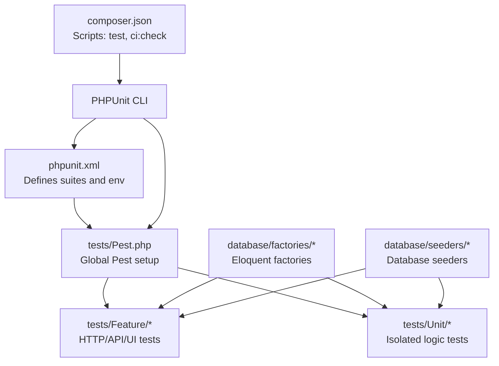
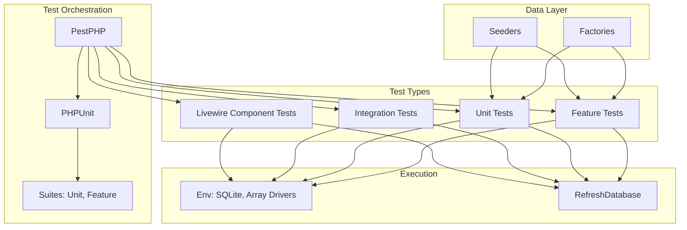
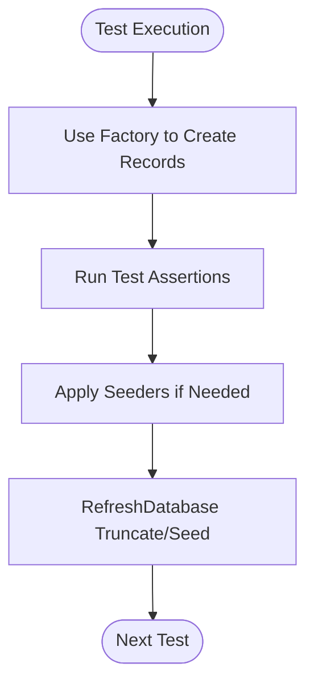
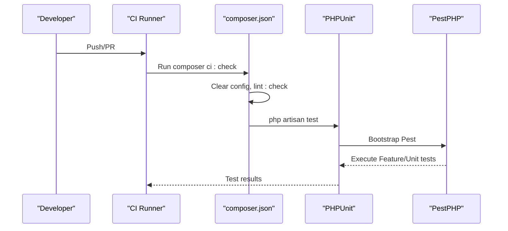
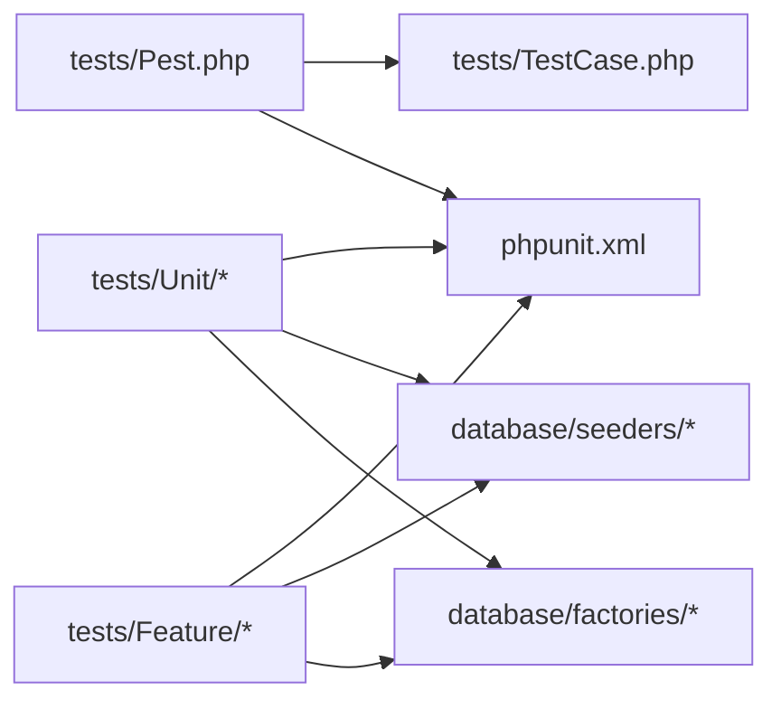

# Testing Strategy

<cite>
**Referenced Files in This Document**
- [phpunit.xml](file://phpunit.xml)
- [composer.json](file://composer.json)
- [tests/Pest.php](file://tests/Pest.php)
- [tests/TestCase.php](file://tests/TestCase.php)
- [tests/Feature/ExampleTest.php](file://tests/Feature/ExampleTest.php)
- [tests/Unit/ExampleTest.php](file://tests/Unit/ExampleTest.php)
- [tests/Feature/Auth/AuthenticationTest.php](file://tests/Feature/Auth/AuthenticationTest.php)
- [tests/Feature/Kiosk/KioskAuthTest.php](file://tests/Feature/Kiosk/KioskAuthTest.php)
- [tests/Feature/Api/BookingTest.php](file://tests/Feature/Api/BookingTest.php)
- [tests/Unit/Models/QueueTicketTest.php](file://tests/Unit/Models/QueueTicketTest.php)
- [tests/Feature/Dashboard/AdminDashboardTest.php](file://tests/Feature/Dashboard/AdminDashboardTest.php)
- [tests/Feature/Integration/AdminOverhaulIntegrationTest.php](file://tests/Feature/Integration/AdminOverhaulIntegrationTest.php)
- [database/factories/QueueTicketFactory.php](file://database/factories/QueueTicketFactory.php)
- [database/seeders/DatabaseSeeder.php](file://database/seeders/DatabaseSeeder.php)
</cite>

## Table of Contents
1. [Introduction](#introduction)
2. [Project Structure](#project-structure)
3. [Core Components](#core-components)
4. [Architecture Overview](#architecture-overview)
5. [Detailed Component Analysis](#detailed-component-analysis)
6. [Dependency Analysis](#dependency-analysis)
7. [Performance Considerations](#performance-considerations)
8. [Troubleshooting Guide](#troubleshooting-guide)
9. [Conclusion](#conclusion)
10. [Appendices](#appendices)

## Introduction
This document defines the testing strategy for the PTSP system using PestPHP and PHPUnit. It explains how tests are organized, naming conventions, execution strategies, and the different test types used across unit, feature, integration, Livewire component, and browser-like scenarios. It also documents database management via factories and seeders, CI automation, and practical guidance for writing effective tests, measuring coverage, and debugging failures.

## Project Structure
The testing setup is centered around PestPHP and PHPUnit with a clear separation of concerns:
- PestPHP orchestrates test execution and global configuration for Feature and Unit suites.
- PHPUnit configuration defines test suites, environment variables, and source inclusion.
- Tests are grouped by type under tests/Feature and tests/Unit.
- Factories and seeders populate deterministic test data.
- Scripts in composer.json automate linting and test execution.

**Diagram sources**
- [phpunit.xml:1-36](file://phpunit.xml#L1-L36)
- [tests/Pest.php:1-63](file://tests/Pest.php#L1-L63)
- [composer.json:72-80](file://composer.json#L72-L80)

**Section sources**
- [phpunit.xml:1-36](file://phpunit.xml#L1-L36)
- [tests/Pest.php:1-63](file://tests/Pest.php#L1-L63)
- [composer.json:72-80](file://composer.json#L72-L80)

## Core Components
- PestPHP bootstrap and safety checks:
  - Enforces safe database suffixes for non-SQLite connections.
  - Extends the base test case with RefreshDatabase and scans Feature/Unit directories.
- PHPUnit configuration:
  - Defines Unit and Feature test suites.
  - Sets environment variables for testing (SQLite in-memory, array drivers, etc.).
  - Includes app directory for coverage.
- Base test case:
  - Provides a shared foundation for all tests.

Key behaviors:
- Global Pest extension binds RefreshDatabase to Feature and Unit tests automatically.
- Environment variables ensure fast, isolated, and repeatable tests.

**Section sources**
- [tests/Pest.php:18-31](file://tests/Pest.php#L18-L31)
- [phpunit.xml:7-19](file://phpunit.xml#L7-L19)
- [phpunit.xml:20-34](file://phpunit.xml#L20-L34)
- [tests/TestCase.php:1-11](file://tests/TestCase.php#L1-L11)

## Architecture Overview
The testing architecture integrates PestPHP with Laravel’s testing helpers and PHPUnit. It supports:
- Unit tests for pure logic and model behaviors.
- Feature tests for HTTP requests, middleware, and controller flows.
- Integration tests for cross-module workflows and navigation.
- Livewire component tests for interactive UI logic.
- Browser-like assertions for authentication and routing.

**Diagram sources**
- [tests/Pest.php:29-31](file://tests/Pest.php#L29-L31)
- [phpunit.xml:7-19](file://phpunit.xml#L7-L19)
- [phpunit.xml:20-34](file://phpunit.xml#L20-L34)

## Detailed Component Analysis

### PestPHP and PHPUnit Configuration
- PestPHP:
  - Validates database safety for MySQL/MariaDB/PostgreSQL/SQLServer.
  - Extends Tests\TestCase and applies RefreshDatabase to Feature/Unit.
- PHPUnit:
  - Two suites: Unit and Feature.
  - Environment variables configure SQLite in-memory database and array-based drivers for speed and isolation.

Execution tips:
- Use PestPHP’s global helpers for concise assertions.
- Leverage RefreshDatabase for per-test database resets.

**Section sources**
- [tests/Pest.php:3-16](file://tests/Pest.php#L3-L16)
- [tests/Pest.php:29-31](file://tests/Pest.php#L29-L31)
- [phpunit.xml:7-19](file://phpunit.xml#L7-L19)
- [phpunit.xml:20-34](file://phpunit.xml#L20-L34)

### Unit Tests
Purpose:
- Validate isolated logic, model behaviors, and pure functions.

Examples in repository:
- Model behavior tests for queue ticket scopes and position calculations.

Best practices:
- Keep tests small and deterministic.
- Use factories for model creation.
- Assert domain-specific invariants.

**Section sources**
- [tests/Unit/Models/QueueTicketTest.php:1-144](file://tests/Unit/Models/QueueTicketTest.php#L1-L144)

### Feature Tests
Purpose:
- Exercise HTTP routes, middleware, controllers, and API endpoints.

Examples in repository:
- Authentication workflow and two-factor redirection.
- Kiosk authentication and session management.
- API booking endpoint with validation and quota logic.

Execution strategies:
- Use PestPHP test/it blocks for readability.
- Apply RefreshDatabase per test group when needed.
- Mock or bypass rate-limiting middleware during tests.

**Section sources**
- [tests/Feature/Auth/AuthenticationTest.php:1-70](file://tests/Feature/Auth/AuthenticationTest.php#L1-L70)
- [tests/Feature/Kiosk/KioskAuthTest.php:1-73](file://tests/Feature/Kiosk/KioskAuthTest.php#L1-L73)
- [tests/Feature/Api/BookingTest.php:1-112](file://tests/Feature/Api/BookingTest.php#L1-L112)

### Integration Tests
Purpose:
- Verify cross-module workflows, navigation, and access control.

Examples in repository:
- Admin UI overhaul integration covering dashboard, CRUD pages, redirects, kiosk, TV display, theme toggle, named routes, and navigation.

Execution strategies:
- Use describe blocks to organize related assertions.
- Act as different user roles to validate authorization.
- Assert presence of UI components and route existence.

**Section sources**
- [tests/Feature/Integration/AdminOverhaulIntegrationTest.php:1-473](file://tests/Feature/Integration/AdminOverhaulIntegrationTest.php#L1-L473)

### Livewire Component Tests
Purpose:
- Validate Livewire component rendering, state, and computed data.

Examples in repository:
- Admin dashboard Livewire component tests asserting stat cards, filters, grouping, and average wait time.

Execution strategies:
- Use Livewire::actingAs to simulate authenticated users.
- Set component properties via set().
- Assert visibility of metrics and totals.

**Section sources**
- [tests/Feature/Dashboard/AdminDashboardTest.php:1-321](file://tests/Feature/Dashboard/AdminDashboardTest.php#L1-L321)

### Browser Testing Strategies
While the repository primarily uses HTTP and component tests, browser testing can be integrated:
- Use Laravel Dusk or a headless browser library to automate real browser interactions.
- Complement PestPHP tests with end-to-end flows for complex UI workflows.
- Keep browser tests focused on critical user journeys.

[No sources needed since this section provides general guidance]

### Test Database Management, Factories, and Seeders
- Factories:
  - Eloquent factories define realistic default attributes for models.
  - Use factory relationships to create associated records.
- Seeders:
  - DatabaseSeeder orchestrates MVP and demo data population.
  - Conditional seeding avoids extra work in unit test contexts.
- RefreshDatabase:
  - Automatically truncates and reseeds the test database per test lifecycle.

**Diagram sources**
- [tests/Pest.php:29-31](file://tests/Pest.php#L29-L31)
- [database/factories/QueueTicketFactory.php:1-47](file://database/factories/QueueTicketFactory.php#L1-L47)
- [database/seeders/DatabaseSeeder.php:1-47](file://database/seeders/DatabaseSeeder.php#L1-L47)

**Section sources**
- [database/factories/QueueTicketFactory.php:1-47](file://database/factories/QueueTicketFactory.php#L1-L47)
- [database/seeders/DatabaseSeeder.php:1-47](file://database/seeders/DatabaseSeeder.php#L1-L47)
- [tests/Pest.php:29-31](file://tests/Pest.php#L29-L31)

### Continuous Integration and Automated Testing
- Composer scripts:
  - test script clears config, runs lint checks, then executes Laravel tests.
  - ci:check script runs lint and test in CI-friendly mode.
- CI pipeline:
  - Configure GitHub Actions or another CI provider to run composer ci:check on pull requests and pushes.
  - Cache dependencies and database artifacts for faster builds.

**Diagram sources**
- [composer.json:72-80](file://composer.json#L72-L80)

**Section sources**
- [composer.json:72-80](file://composer.json#L72-L80)

## Dependency Analysis
- PestPHP depends on:
  - PHPUnit for test execution.
  - Laravel Testing traits (e.g., RefreshDatabase).
- Tests depend on:
  - Factories for deterministic data.
  - Seeders for initial dataset.
  - Environment variables for isolation and speed.
- No circular dependencies observed among test files.

**Diagram sources**
- [tests/Pest.php:29-31](file://tests/Pest.php#L29-L31)
- [phpunit.xml:7-19](file://phpunit.xml#L7-L19)
- [database/factories/QueueTicketFactory.php:1-47](file://database/factories/QueueTicketFactory.php#L1-L47)
- [database/seeders/DatabaseSeeder.php:1-47](file://database/seeders/DatabaseSeeder.php#L1-L47)

**Section sources**
- [tests/Pest.php:29-31](file://tests/Pest.php#L29-L31)
- [phpunit.xml:7-19](file://phpunit.xml#L7-L19)

## Performance Considerations
- Use SQLite in-memory database for speed.
- Prefer array drivers for cache, sessions, and queues.
- Keep tests small and avoid external network calls.
- Use factories to minimize database writes.
- Group related tests to reduce repeated setup.

[No sources needed since this section provides general guidance]

## Troubleshooting Guide
Common issues and resolutions:
- Unsafe database for non-SQLite connections:
  - PestPHP enforces safe suffixes. Use SQLite or a *_test database.
- Database state bleeding:
  - Ensure RefreshDatabase is applied; avoid manual persistence outside tests.
- Authentication/session failures:
  - Verify middleware bypass for tests and correct session keys.
- Slow tests:
  - Reduce external services, use array drivers, and simplify factories.

**Section sources**
- [tests/Pest.php:3-16](file://tests/Pest.php#L3-L16)
- [tests/Pest.php:29-31](file://tests/Pest.php#L29-L31)

## Conclusion
The PTSP testing strategy leverages PestPHP and PHPUnit to deliver a robust suite of unit, feature, integration, and Livewire tests. With factories and seeders, the system ensures deterministic and fast test execution. Composer scripts streamline local and CI testing. Following the guidelines herein will help maintain high-quality, reliable tests across the system.

## Appendices

### Test Organization and Naming Conventions
- Feature tests: tests/Feature/<Area>/<FeatureName>Test.php
- Unit tests: tests/Unit/<Category>/<ModelOrLogic>Test.php
- Integration tests: tests/Feature/Integration/<ModuleName>IntegrationTest.php
- Livewire tests: tests/Feature/<Module>/<ComponentName>Test.php
- Naming: Use PascalCase for test classes and descriptive test names with verbs.

[No sources needed since this section provides general guidance]

### Writing Effective Tests
- Isolate single concerns per test.
- Use expressive assertions and meaningful names.
- Prefer factories and seeders for data.
- Mock external dependencies when appropriate.
- Keep setup minimal and reuse helpers.

[No sources needed since this section provides general guidance]

### Test Coverage Requirements
- Aim for high coverage in critical paths (authentication, booking, queue logic).
- Use PHPUnit coverage reporting to identify gaps.
- Focus on business logic and integration boundaries.

[No sources needed since this section provides general guidance]