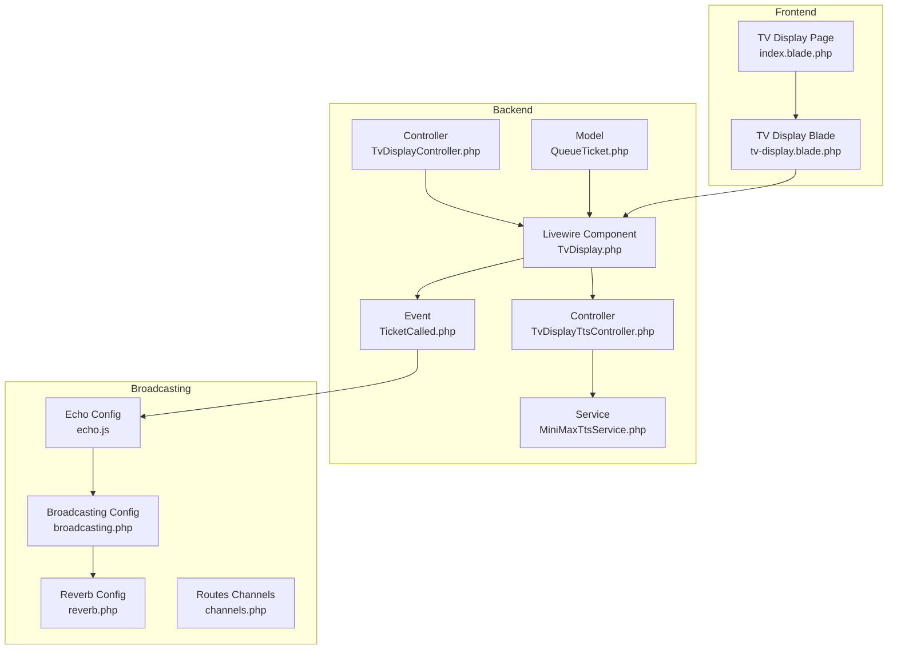
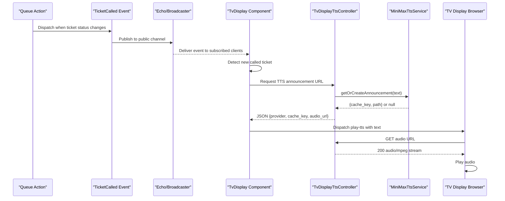
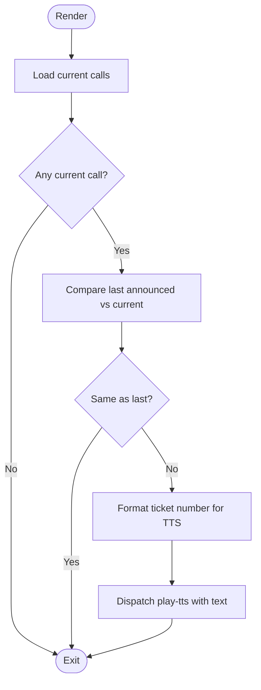
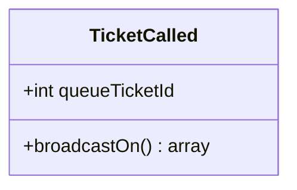
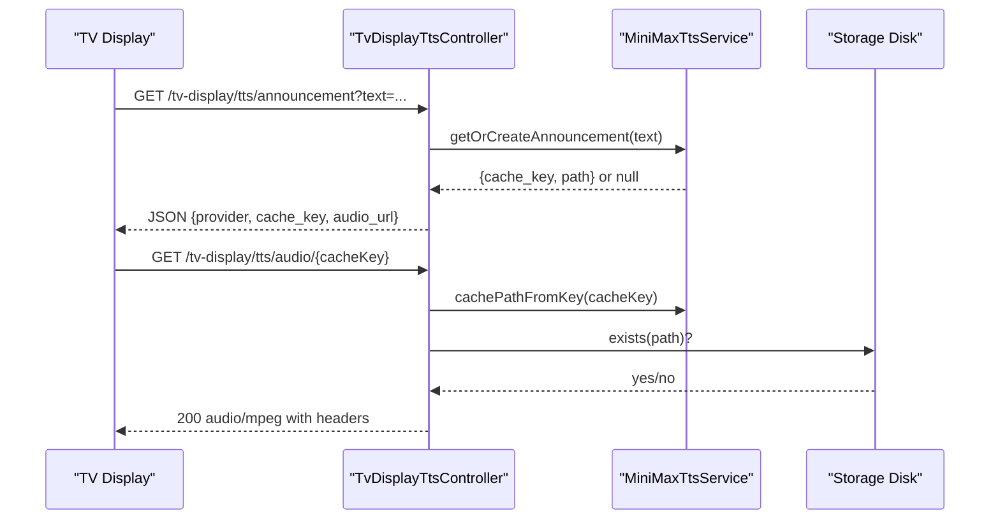
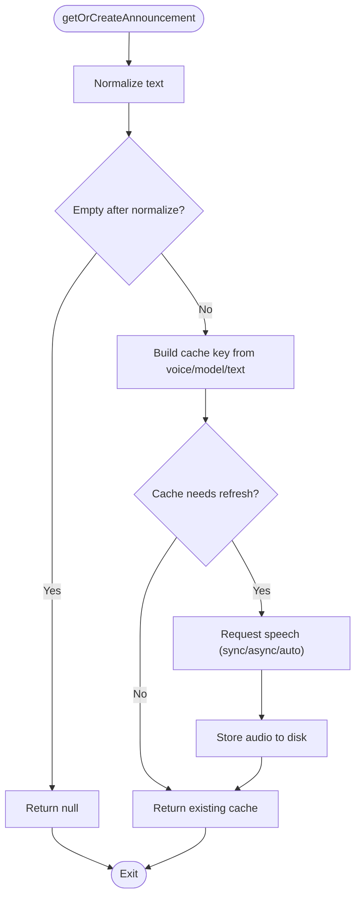
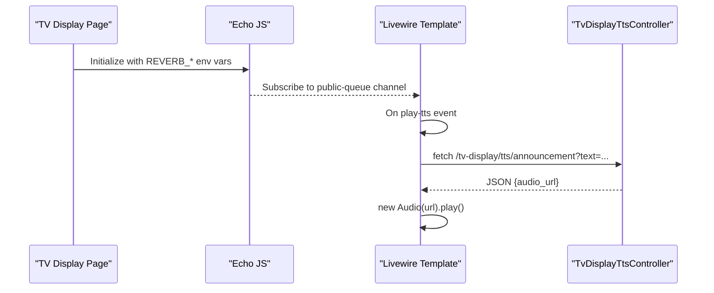
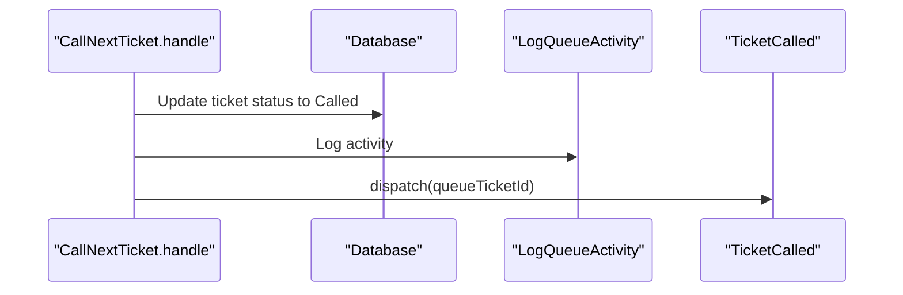
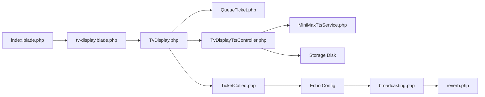

# Broadcast Integration and Audio Announcements

<cite>
**Referenced Files in This Document**
- [TvDisplayTtsController.php](file://app/Http/Controllers/TvDisplayTtsController.php)
- [MiniMaxTtsService.php](file://app/Services/Tts/MiniMaxTtsService.php)
- [TicketCalled.php](file://app/Events/TicketCalled.php)
- [TvDisplayController.php](file://app/Http/Controllers/TvDisplayController.php)
- [TvDisplay.php](file://app/Livewire/TvDisplay.php)
- [broadcasting.php](file://config/broadcasting.php)
- [reverb.php](file://config/reverb.php)
- [channels.php](file://routes/channels.php)
- [echo.js](file://resources/js/echo.js)
- [tv-display.js](file://resources/js/tv-display.js)
- [tv-display.blade.php](file://resources/views/livewire/tv-display.blade.php)
- [CallNextTicket.php](file://app/Actions/Queue/CallNextTicket.php)
- [RecallTicket.php](file://app/Actions/Queue/RecallTicket.php)
- [QueueTicket.php](file://app/Models/QueueTicket.php)
- [index.blade.php](file://resources/views/pages/tv-display/index.blade.php)
</cite>

## Table of Contents
1. [Introduction](#introduction)
2. [Project Structure](#project-structure)
3. [Core Components](#core-components)
4. [Architecture Overview](#architecture-overview)
5. [Detailed Component Analysis](#detailed-component-analysis)
6. [Dependency Analysis](#dependency-analysis)
7. [Performance Considerations](#performance-considerations)
8. [Troubleshooting Guide](#troubleshooting-guide)
9. [Conclusion](#conclusion)

## Introduction
This document explains the TTS broadcast integration for audio announcements and real-time broadcasting across TV displays. It covers:
- How queue events trigger audio announcements
- How cached audio files are generated and served
- How WebSocket broadcasting delivers live updates to multiple TV displays
- How client-side playback coordinates with browser audio policies
- Performance and error handling considerations for real-time audio delivery

## Project Structure
The broadcast and TTS system spans backend controllers, services, Livewire components, events, broadcasting configuration, and frontend JavaScript.

**Diagram sources**
- [TvDisplay.php:18-39](file://app/Livewire/TvDisplay.php#L18-L39)
- [TicketCalled.php:11-33](file://app/Events/TicketCalled.php#L11-L33)
- [TvDisplayTtsController.php:12-61](file://app/Http/Controllers/TvDisplayTtsController.php#L12-L61)
- [MiniMaxTtsService.php:11-312](file://app/Services/Tts/MiniMaxTtsService.php#L11-L312)
- [TvDisplayController.php:16-144](file://app/Http/Controllers/TvDisplayController.php#L16-L144)
- [echo.js:1-15](file://resources/js/echo.js#L1-L15)
- [broadcasting.php:1-83](file://config/broadcasting.php#L1-L83)
- [reverb.php:1-103](file://config/reverb.php#L1-L103)
- [channels.php:1-8](file://routes/channels.php#L1-L8)
- [tv-display.blade.php:1-213](file://resources/views/livewire/tv-display.blade.php#L1-L213)
- [index.blade.php:1-18](file://resources/views/pages/tv-display/index.blade.php#L1-L18)

**Section sources**
- [TvDisplay.php:18-39](file://app/Livewire/TvDisplay.php#L18-L39)
- [TvDisplayTtsController.php:12-61](file://app/Http/Controllers/TvDisplayTtsController.php#L12-L61)
- [MiniMaxTtsService.php:11-312](file://app/Services/Tts/MiniMaxTtsService.php#L11-L312)
- [TvDisplayController.php:16-144](file://app/Http/Controllers/TvDisplayController.php#L16-L144)
- [echo.js:1-15](file://resources/js/echo.js#L1-L15)
- [broadcasting.php:1-83](file://config/broadcasting.php#L1-L83)
- [reverb.php:1-103](file://config/reverb.php#L1-L103)
- [channels.php:1-8](file://routes/channels.php#L1-L8)
- [tv-display.blade.php:1-213](file://resources/views/livewire/tv-display.blade.php#L1-L213)
- [index.blade.php:1-18](file://resources/views/pages/tv-display/index.blade.php#L1-L18)

## Core Components
- Livewire TV Display component orchestrates queue rendering and triggers TTS announcements when the currently called ticket changes.
- Event broadcasting publishes queue call updates to a public channel for real-time updates.
- TTS controller validates requests, delegates to the TTS service, and returns either a cached audio URL or a fallback indicator.
- TTS service generates or retrieves cached audio from MiniMax, manages async/sync strategies, and extracts audio payloads.
- Broadcasting configuration integrates Reverb/Pusher/Ably/log/null drivers.
- Frontend listens for broadcast events and dispatches TTS playback via a local fetch endpoint.

**Section sources**
- [TvDisplay.php:41-83](file://app/Livewire/TvDisplay.php#L41-L83)
- [TicketCalled.php:11-33](file://app/Events/TicketCalled.php#L11-L33)
- [TvDisplayTtsController.php:14-39](file://app/Http/Controllers/TvDisplayTtsController.php#L14-L39)
- [MiniMaxTtsService.php:16-44](file://app/Services/Tts/MiniMaxTtsService.php#L16-L44)
- [broadcasting.php:31-80](file://config/broadcasting.php#L31-L80)
- [tv-display.blade.php:30-40](file://resources/views/livewire/tv-display.blade.php#L30-L40)

## Architecture Overview
The system follows an event-driven pattern:
- Queue actions update ticket status and dispatch a broadcast event.
- Livewire component receives the event and triggers a TTS announcement.
- TTS controller resolves audio via the TTS service and serves cached audio URLs.
- Clients fetch audio and play it, with graceful fallbacks.

**Diagram sources**
- [CallNextTicket.php:74](file://app/Actions/Queue/CallNextTicket.php#L74)
- [TicketCalled.php:11-33](file://app/Events/TicketCalled.php#L11-L33)
- [TvDisplay.php:22-27](file://app/Livewire/TvDisplay.php#L22-L27)
- [TvDisplay.php:66](file://app/Livewire/TvDisplay.php#L66)
- [TvDisplayTtsController.php:14-39](file://app/Http/Controllers/TvDisplayTtsController.php#L14-L39)
- [MiniMaxTtsService.php:16-44](file://app/Services/Tts/MiniMaxTtsService.php#L16-L44)
- [tv-display.blade.php:30-40](file://resources/views/livewire/tv-display.blade.php#L30-L40)

## Detailed Component Analysis

### Livewire TV Display Component
- Subscribes to the public queue channel via Echo and re-renders on events.
- Detects newly called tickets and formats a phonetically readable announcement text.
- Dispatches a client-side event to trigger TTS playback.

**Diagram sources**
- [TvDisplay.php:29-68](file://app/Livewire/TvDisplay.php#L29-L68)

**Section sources**
- [TvDisplay.php:18-39](file://app/Livewire/TvDisplay.php#L18-L39)
- [TvDisplay.php:41-83](file://app/Livewire/TvDisplay.php#L41-L83)

### Event Broadcasting
- The event is marked to broadcast immediately and targets a public channel.
- Broadcasting is configured via the framework’s broadcasting configuration and Reverb driver.

**Diagram sources**
- [TicketCalled.php:11-33](file://app/Events/TicketCalled.php#L11-L33)

**Section sources**
- [TicketCalled.php:11-33](file://app/Events/TicketCalled.php#L11-L33)
- [broadcasting.php:31-80](file://config/broadcasting.php#L31-L80)
- [reverb.php:29-55](file://config/reverb.php#L29-L55)
- [channels.php:5-7](file://routes/channels.php#L5-L7)

### TTS Controller and Audio Serving
- Validates input text and delegates to the TTS service.
- Returns either a MiniMax provider response with a cache key and audio URL, or a browser provider fallback.
- Serves cached audio files with appropriate headers and validation.

**Diagram sources**
- [TvDisplayTtsController.php:14-39](file://app/Http/Controllers/TvDisplayTtsController.php#L14-L39)
- [TvDisplayTtsController.php:41-60](file://app/Http/Controllers/TvDisplayTtsController.php#L41-L60)
- [MiniMaxTtsService.php:16-44](file://app/Services/Tts/MiniMaxTtsService.php#L16-L44)
- [MiniMaxTtsService.php:46-51](file://app/Services/Tts/MiniMaxTtsService.php#L46-L51)

**Section sources**
- [TvDisplayTtsController.php:14-39](file://app/Http/Controllers/TvDisplayTtsController.php#L14-L39)
- [TvDisplayTtsController.php:41-60](file://app/Http/Controllers/TvDisplayTtsController.php#L41-L60)
- [MiniMaxTtsService.php:16-44](file://app/Services/Tts/MiniMaxTtsService.php#L16-L44)
- [MiniMaxTtsService.php:46-51](file://app/Services/Tts/MiniMaxTtsService.php#L46-L51)

### TTS Service Implementation
- Generates a cache key from voice, model, and normalized text.
- Chooses between sync, async, or auto strategies for audio generation.
- Handles async polling, file retrieval, and payload extraction.
- Manages cache freshness and tar archive payload handling.

**Diagram sources**
- [MiniMaxTtsService.php:16-44](file://app/Services/Tts/MiniMaxTtsService.php#L16-L44)
- [MiniMaxTtsService.php:53-180](file://app/Services/Tts/MiniMaxTtsService.php#L53-L180)
- [MiniMaxTtsService.php:246-264](file://app/Services/Tts/MiniMaxTtsService.php#L246-L264)
- [MiniMaxTtsService.php:257-310](file://app/Services/Tts/MiniMaxTtsService.php#L257-L310)

**Section sources**
- [MiniMaxTtsService.php:16-44](file://app/Services/Tts/MiniMaxTtsService.php#L16-L44)
- [MiniMaxTtsService.php:53-180](file://app/Services/Tts/MiniMaxTtsService.php#L53-L180)
- [MiniMaxTtsService.php:246-310](file://app/Services/Tts/MiniMaxTtsService.php#L246-L310)

### Frontend Integration and Playback Coordination
- The TV display page initializes Echo with the Reverb driver and binds to the public channel.
- The Livewire template listens for the play-tts event, requests the audio URL from the backend, and plays it.
- Includes an audio unlock overlay to satisfy browser autoplay policies.

**Diagram sources**
- [echo.js:6-14](file://resources/js/echo.js#L6-L14)
- [tv-display.blade.php:30-40](file://resources/views/livewire/tv-display.blade.php#L30-L40)
- [TvDisplayTtsController.php:14-39](file://app/Http/Controllers/TvDisplayTtsController.php#L14-L39)

**Section sources**
- [echo.js:1-15](file://resources/js/echo.js#L1-L15)
- [tv-display.blade.php:1-213](file://resources/views/livewire/tv-display.blade.php#L1-L213)
- [index.blade.php:10-16](file://resources/views/pages/tv-display/index.blade.php#L10-L16)

### Queue Actions and Event Triggering
- Calling the next ticket updates status and dispatches the broadcast event.
- Recalling a ticket also dispatches the event to refresh displays.

**Diagram sources**
- [CallNextTicket.php:19-77](file://app/Actions/Queue/CallNextTicket.php#L19-L77)
- [RecallTicket.php:17-47](file://app/Actions/Queue/RecallTicket.php#L17-L47)

**Section sources**
- [CallNextTicket.php:19-77](file://app/Actions/Queue/CallNextTicket.php#L19-L77)
- [RecallTicket.php:17-47](file://app/Actions/Queue/RecallTicket.php#L17-L47)

## Dependency Analysis
- Livewire component depends on the QueueTicket model and the event system.
- TTS controller depends on the TTS service and storage configuration.
- Broadcasting depends on the selected driver configuration and Reverb settings.
- Frontend depends on Echo initialization and the Livewire template bindings.

**Diagram sources**
- [TvDisplay.php:18-39](file://app/Livewire/TvDisplay.php#L18-L39)
- [QueueTicket.php:12-121](file://app/Models/QueueTicket.php#L12-L121)
- [TicketCalled.php:11-33](file://app/Events/TicketCalled.php#L11-L33)
- [TvDisplayTtsController.php:12-61](file://app/Http/Controllers/TvDisplayTtsController.php#L12-L61)
- [MiniMaxTtsService.php:11-312](file://app/Services/Tts/MiniMaxTtsService.php#L11-L312)
- [echo.js:1-15](file://resources/js/echo.js#L1-L15)
- [broadcasting.php:1-83](file://config/broadcasting.php#L1-L83)
- [reverb.php:1-103](file://config/reverb.php#L1-L103)
- [tv-display.blade.php:1-213](file://resources/views/livewire/tv-display.blade.php#L1-L213)
- [index.blade.php:1-18](file://resources/views/pages/tv-display/index.blade.php#L1-L18)

**Section sources**
- [TvDisplay.php:18-39](file://app/Livewire/TvDisplay.php#L18-L39)
- [TvDisplayTtsController.php:12-61](file://app/Http/Controllers/TvDisplayTtsController.php#L12-L61)
- [MiniMaxTtsService.php:11-312](file://app/Services/Tts/MiniMaxTtsService.php#L11-L312)
- [broadcasting.php:1-83](file://config/broadcasting.php#L1-L83)
- [reverb.php:1-103](file://config/reverb.php#L1-L103)
- [tv-display.blade.php:1-213](file://resources/views/livewire/tv-display.blade.php#L1-L213)
- [index.blade.php:1-18](file://resources/views/pages/tv-display/index.blade.php#L1-L18)

## Performance Considerations
- Caching strategy: The TTS service computes a deterministic cache key and refreshes only when the stored payload is missing or appears to be an invalid archive. This minimizes external API calls and reduces latency.
- Asynchronous generation: Async mode polls for completion with configurable attempts and intervals, falling back to sync mode automatically when needed.
- CDN-friendly headers: Audio serving sets long-lived caching headers and immutable flags to improve repeat playback performance.
- Livewire reactivity: The component only triggers TTS when the currently called ticket changes, avoiding redundant announcements.
- Browser autoplay: The frontend unlocks audio context with a silent dummy audio and requires user interaction to enable sound.

[No sources needed since this section provides general guidance]

## Troubleshooting Guide
Common failure scenarios and remedies:
- TTS generation fails:
  - The service throws exceptions on API errors or invalid responses. The controller returns a fallback indicating the browser provider should be used.
  - Verify API keys, voice ID, and network connectivity to the TTS provider.
- Cache key mismatch or missing file:
  - The audio endpoint validates the cache key format and checks file existence on the configured disk. Ensure cache keys are 40-character hexadecimal and the file exists.
- Broadcasting not received:
  - Confirm the broadcaster driver is set and credentials are correct. Ensure the public channel subscription is active in the frontend.
- Audio does not play:
  - The frontend requires user interaction to unlock audio. Ensure the overlay is dismissed and the play-tts event is dispatched with valid text.

**Section sources**
- [TvDisplayTtsController.php:20-32](file://app/Http/Controllers/TvDisplayTtsController.php#L20-L32)
- [TvDisplayTtsController.php:42-59](file://app/Http/Controllers/TvDisplayTtsController.php#L42-L59)
- [broadcasting.php:18](file://config/broadcasting.php#L18)
- [echo.js:6-14](file://resources/js/echo.js#L6-L14)
- [tv-display.blade.php:8-14](file://resources/views/livewire/tv-display.blade.php#L8-L14)

## Conclusion
The broadcast and TTS system integrates queue events with real-time audio announcements across multiple TV displays. Livewire detects new calls, Echo broadcasts updates, and the TTS pipeline caches and streams audio efficiently. The frontend coordinates playback with browser policies and provides fallbacks for robust operation.