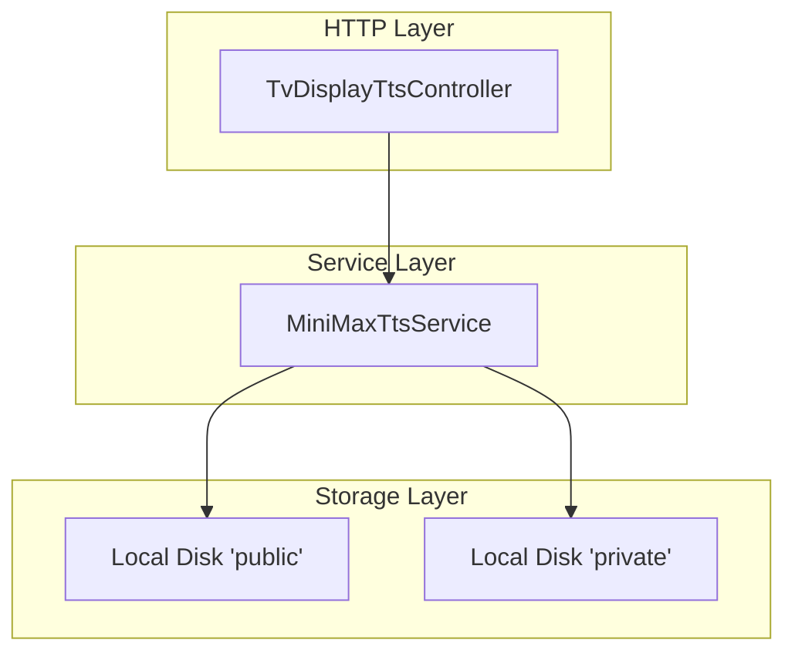
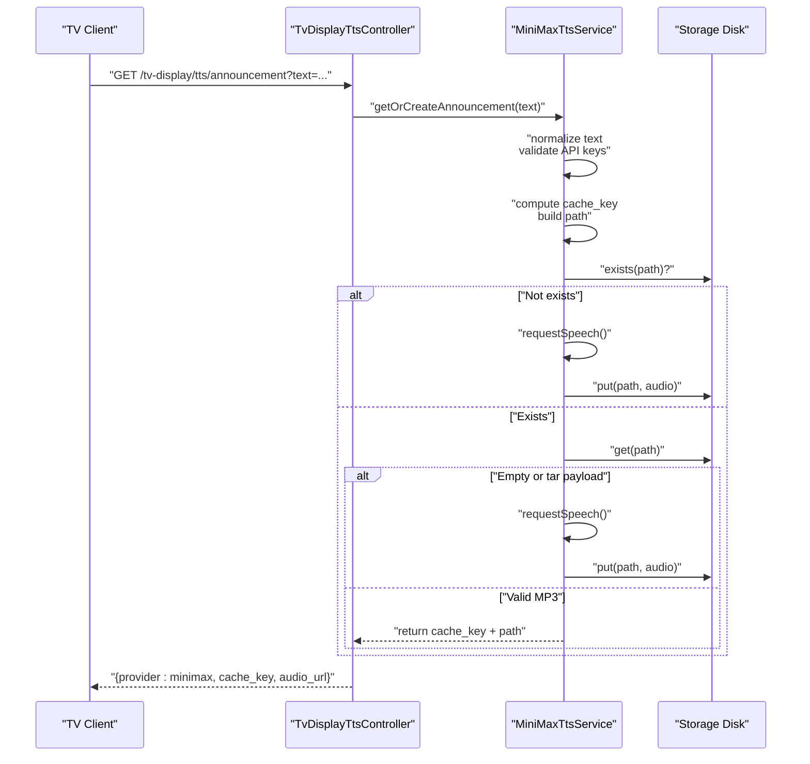
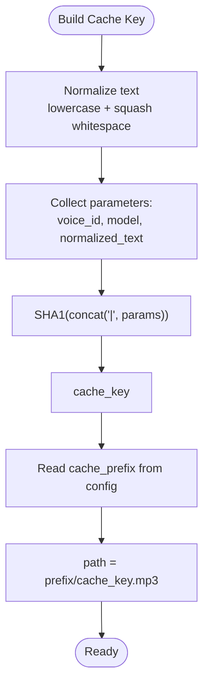
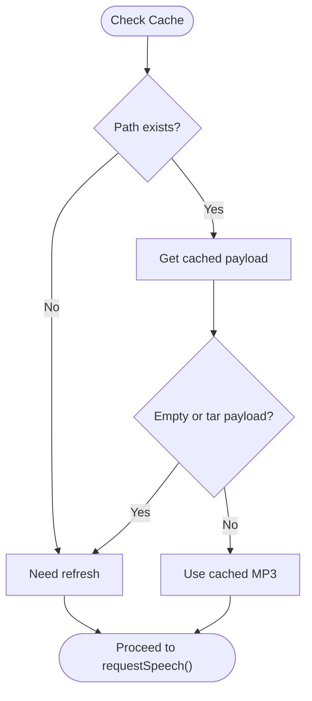
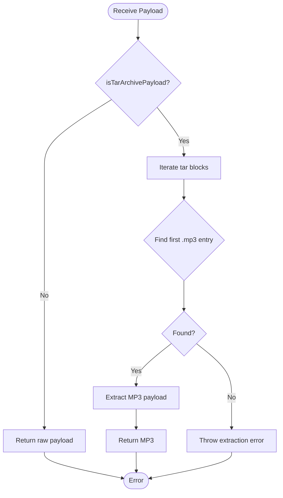
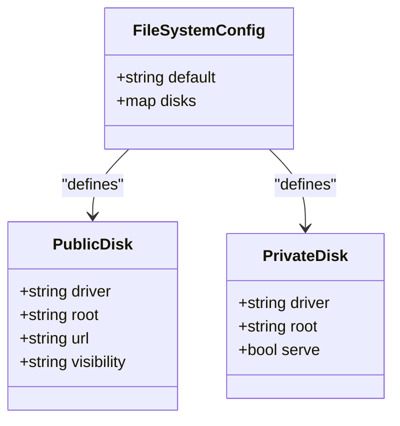
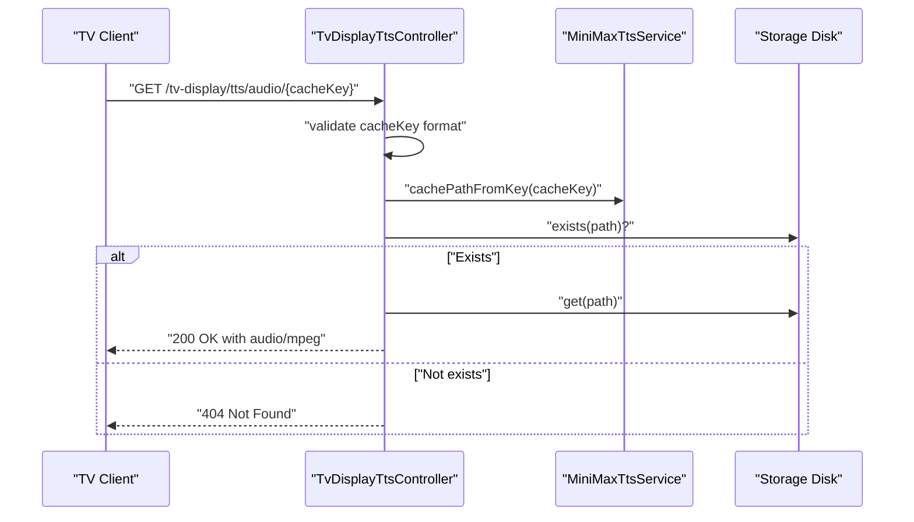
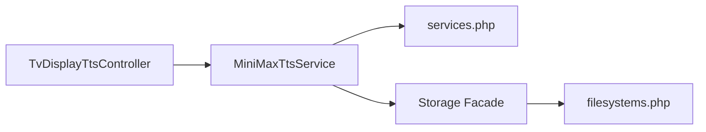

# Caching and Storage Management

<cite>
**Referenced Files in This Document**
- [MiniMaxTtsService.php](file://app/Services/Tts/MiniMaxTtsService.php)
- [TvDisplayTtsController.php](file://app/Http/Controllers/TvDisplayTtsController.php)
- [filesystems.php](file://config/filesystems.php)
- [services.php](file://config/services.php)
- [MiniMaxTtsServiceTest.php](file://tests/Feature/Tts/MiniMaxTtsServiceTest.php)
- [TvDisplayController.php](file://app/Http/Controllers/TvDisplayController.php)
</cite>

## Table of Contents
1. [Introduction](#introduction)
2. [Project Structure](#project-structure)
3. [Core Components](#core-components)
4. [Architecture Overview](#architecture-overview)
5. [Detailed Component Analysis](#detailed-component-analysis)
6. [Dependency Analysis](#dependency-analysis)
7. [Performance Considerations](#performance-considerations)
8. [Troubleshooting Guide](#troubleshooting-guide)
9. [Conclusion](#conclusion)
10. [Appendices](#appendices)

## Introduction
This document explains the Text-to-Speech (TTS) caching and storage system used by the TV display module. It covers how cache keys are generated, how audio files are stored and retrieved, how cache refresh logic works, and how storage disks and prefixes are configured. It also documents the handling of tar archive payloads returned by the external TTS provider and provides practical guidance for inspecting and managing cached audio.

## Project Structure
The TTS caching and storage system spans three primary areas:
- Service layer: generates cache keys, requests audio from the external provider, and manages local storage.
- Controller layer: exposes endpoints to request announcements and serve cached audio.
- Configuration: defines storage disks and TTS provider parameters.

**Diagram sources**
- [TvDisplayTtsController.php:14-60](file://app/Http/Controllers/TvDisplayTtsController.php#L14-L60)
- [MiniMaxTtsService.php:16-44](file://app/Services/Tts/MiniMaxTtsService.php#L16-L44)
- [filesystems.php:41-48](file://config/filesystems.php#L41-L48)

**Section sources**
- [TvDisplayTtsController.php:14-60](file://app/Http/Controllers/TvDisplayTtsController.php#L14-L60)
- [MiniMaxTtsService.php:16-44](file://app/Services/Tts/MiniMaxTtsService.php#L16-L44)
- [filesystems.php:41-48](file://config/filesystems.php#L41-L48)

## Core Components
- Cache key generation: SHA1 hash derived from voice identity, model, and normalized text.
- Path construction: configurable prefix plus cache key with .mp3 extension.
- Disk selection: configurable via service settings; defaults to the public disk.
- Cache refresh logic: determines whether to regenerate audio based on existence and payload validity.
- Payload extraction: handles raw MP3 or tar archives containing MP3 content.

**Section sources**
- [MiniMaxTtsService.php:32-33](file://app/Services/Tts/MiniMaxTtsService.php#L32-L33)
- [MiniMaxTtsService.php:246-255](file://app/Services/Tts/MiniMaxTtsService.php#L246-L255)
- [MiniMaxTtsService.php:257-273](file://app/Services/Tts/MiniMaxTtsService.php#L257-L273)
- [MiniMaxTtsService.php:275-310](file://app/Services/Tts/MiniMaxTtsService.php#L275-L310)

## Architecture Overview
The system orchestrates request handling, cache checks, and storage operations.

**Diagram sources**
- [TvDisplayTtsController.php:14-39](file://app/Http/Controllers/TvDisplayTtsController.php#L14-L39)
- [MiniMaxTtsService.php:16-44](file://app/Services/Tts/MiniMaxTtsService.php#L16-L44)
- [MiniMaxTtsService.php:246-255](file://app/Services/Tts/MiniMaxTtsService.php#L246-L255)

## Detailed Component Analysis

### Cache Key Generation and Path Management
- Cache key: SHA1 of a pipe-delimited concatenation of voice_id, model, and lowercase, whitespace-normalized text.
- Path: constructed from a configurable prefix and the cache key, ending with .mp3.
- Retrieval: a helper computes the path from a given cache key.

**Diagram sources**
- [MiniMaxTtsService.php:18-33](file://app/Services/Tts/MiniMaxTtsService.php#L18-L33)
- [MiniMaxTtsService.php:46-51](file://app/Services/Tts/MiniMaxTtsService.php#L46-L51)

**Section sources**
- [MiniMaxTtsService.php:32-33](file://app/Services/Tts/MiniMaxTtsService.php#L32-L33)
- [MiniMaxTtsService.php:46-51](file://app/Services/Tts/MiniMaxTtsService.php#L46-L51)

### Cache Refresh Logic
- If the target path does not exist, refresh is required.
- If the path exists but the payload is empty or appears to be a tar archive, refresh is required.
- Otherwise, the cached MP3 is reused.

**Diagram sources**
- [MiniMaxTtsService.php:246-255](file://app/Services/Tts/MiniMaxTtsService.php#L246-L255)

**Section sources**
- [MiniMaxTtsService.php:246-255](file://app/Services/Tts/MiniMaxTtsService.php#L246-L255)

### Tar Archive Payload Handling
- Detection: verifies minimum length and checks a specific byte range for the tar signature.
- Extraction: parses tar headers, locates the first .mp3 entry, and returns its payload.
- Fallback: if extraction fails, an exception is thrown.

**Diagram sources**
- [MiniMaxTtsService.php:257-273](file://app/Services/Tts/MiniMaxTtsService.php#L257-L273)
- [MiniMaxTtsService.php:275-310](file://app/Services/Tts/MiniMaxTtsService.php#L275-L310)

**Section sources**
- [MiniMaxTtsService.php:257-273](file://app/Services/Tts/MiniMaxTtsService.php#L257-L273)
- [MiniMaxTtsService.php:275-310](file://app/Services/Tts/MiniMaxTtsService.php#L275-L310)

### Storage Disk Selection and Configuration
- Disk choice: selected via service configuration; default is the public disk.
- Disk configuration: local driver with explicit root and visibility settings.
- Serving: public disk URLs are publicly accessible; private disk requires controlled access.

**Diagram sources**
- [filesystems.php:16](file://config/filesystems.php#L16)
- [filesystems.php:41-48](file://config/filesystems.php#L41-L48)
- [filesystems.php:33-39](file://config/filesystems.php#L33-L39)

**Section sources**
- [MiniMaxTtsService.php:30-31](file://app/Services/Tts/MiniMaxTtsService.php#L30-L31)
- [filesystems.php:41-48](file://config/filesystems.php#L41-L48)
- [filesystems.php:33-39](file://config/filesystems.php#L33-L39)

### Audio Retrieval Endpoint
- Validates input text.
- Attempts to generate or reuse cached audio.
- On success, returns a JSON object with provider metadata and a signed audio URL.
- Audio serving endpoint validates cache key format, resolves path, checks existence and content, and serves the file with appropriate headers.

**Diagram sources**
- [TvDisplayTtsController.php:41-60](file://app/Http/Controllers/TvDisplayTtsController.php#L41-L60)
- [MiniMaxTtsService.php:46-51](file://app/Services/Tts/MiniMaxTtsService.php#L46-L51)

**Section sources**
- [TvDisplayTtsController.php:14-39](file://app/Http/Controllers/TvDisplayTtsController.php#L14-L39)
- [TvDisplayTtsController.php:41-60](file://app/Http/Controllers/TvDisplayTtsController.php#L41-L60)

## Dependency Analysis
- TvDisplayTtsController depends on MiniMaxTtsService for cache orchestration and on Storage for file retrieval.
- MiniMaxTtsService depends on:
  - HTTP client for external API calls.
  - Storage facade for disk operations.
  - Config for provider settings and cache options.
- Storage disks are configured centrally in filesystems.php.

**Diagram sources**
- [TvDisplayTtsController.php:14-60](file://app/Http/Controllers/TvDisplayTtsController.php#L14-L60)
- [MiniMaxTtsService.php:23-31](file://app/Services/Tts/MiniMaxTtsService.php#L23-L31)
- [services.php:45-58](file://config/services.php#L45-L58)
- [filesystems.php:31-63](file://config/filesystems.php#L31-L63)

**Section sources**
- [TvDisplayTtsController.php:14-60](file://app/Http/Controllers/TvDisplayTtsController.php#L14-L60)
- [MiniMaxTtsService.php:23-31](file://app/Services/Tts/MiniMaxTtsService.php#L23-L31)
- [services.php:45-58](file://config/services.php#L45-L58)
- [filesystems.php:31-63](file://config/filesystems.php#L31-L63)

## Performance Considerations
- Cache hit reuse: avoids external API calls when the cached MP3 is valid, reducing latency and cost.
- Tar payload handling: ensures stale tar archives are refreshed, preventing degraded playback quality.
- Disk choice:
  - Public disk: fast, publicly served URLs; suitable for broadcast audio.
  - Private disk: requires controlled access; useful when audio must not be directly downloadable.
- Network strategy:
  - Async mode polls for completion; fallback to sync improves reliability.
  - Poll attempts and interval are configurable to balance responsiveness and cost.

[No sources needed since this section provides general guidance]

## Troubleshooting Guide
Common issues and resolutions:
- Empty or invalid cache entries:
  - Cause: empty payload or tar archive detected by refresh logic.
  - Action: trigger regeneration; verify external API responses.
- Missing API credentials:
  - Cause: missing API key or voice ID.
  - Action: set MINIMAX_API_KEY and MINIMAX_VOICE_ID; confirm service configuration.
- Invalid cache key format:
  - Cause: audio endpoint receives malformed cacheKey.
  - Action: ensure cache_key is a 40-character hexadecimal string.
- Disk accessibility:
  - Cause: attempting to serve from private disk without proper access control.
  - Action: use public disk for broadcast audio or secure the endpoint appropriately.
- Tar extraction failures:
  - Cause: unexpected tar structure or corrupted payload.
  - Action: refresh cache; check external provider response format.

Operational checks:
- Verify cache path resolution using the service’s path builder.
- Inspect stored files under the configured prefix on the chosen disk.
- Confirm disk configuration and URL mapping for public access.

**Section sources**
- [MiniMaxTtsService.php:18-27](file://app/Services/Tts/MiniMaxTtsService.php#L18-L27)
- [TvDisplayTtsController.php:43-48](file://app/Http/Controllers/TvDisplayTtsController.php#L43-L48)
- [MiniMaxTtsService.php:257-273](file://app/Services/Tts/MiniMaxTtsService.php#L257-L273)
- [TvDisplayController.php:108](file://app/Http/Controllers/TvDisplayController.php#L108)

## Conclusion
The TTS caching and storage system efficiently reuses previously generated audio, intelligently refreshes stale or malformed entries, and supports flexible storage backends. By combining deterministic cache keys, robust payload validation, and configurable storage options, it delivers reliable broadcast-ready audio for the TV display.

[No sources needed since this section summarizes without analyzing specific files]

## Appendices

### Configuration Reference
- Provider settings:
  - MINIMAX_API_KEY, MINIMAX_VOICE_ID, MINIMAX_MODEL, MINIMAX_STRATEGY, MINIMAX_LANGUAGE_BOOST, MINIMAX_SPEED, MINIMAX_VOL, MINIMAX_PITCH, MINIMAX_ASYNC_POLL_ATTEMPTS, MINIMAX_ASYNC_POLL_INTERVAL_MS, MINIMAX_CACHE_DISK, MINIMAX_CACHE_PREFIX.
- Storage disks:
  - public: local, public visibility, URL-based access.
  - private: local, server-side storage.

**Section sources**
- [services.php:45-58](file://config/services.php#L45-L58)
- [filesystems.php:41-48](file://config/filesystems.php#L41-L48)
- [filesystems.php:33-39](file://config/filesystems.php#L33-L39)

### Cache Management Operations
- Generate or reuse cache:
  - Call the announcement endpoint; it returns a cache_key and audio_url when successful.
- Retrieve audio:
  - Access the audio endpoint with the cache_key; the system validates the key and serves the file.
- Inspect cache:
  - List files under the configured prefix on the selected disk.
  - Confirm the path format: prefix/cache_key.mp3.

**Section sources**
- [TvDisplayTtsController.php:14-39](file://app/Http/Controllers/TvDisplayTtsController.php#L14-L39)
- [TvDisplayTtsController.php:41-60](file://app/Http/Controllers/TvDisplayTtsController.php#L41-L60)
- [MiniMaxTtsService.php:46-51](file://app/Services/Tts/MiniMaxTtsService.php#L46-L51)
- [TvDisplayController.php:108](file://app/Http/Controllers/TvDisplayController.php#L108)