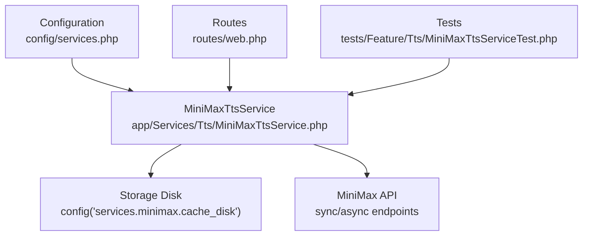
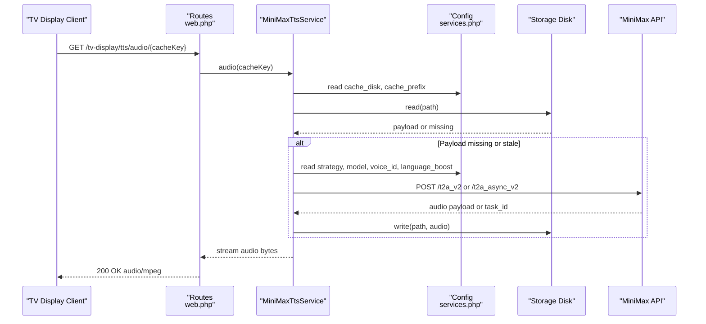
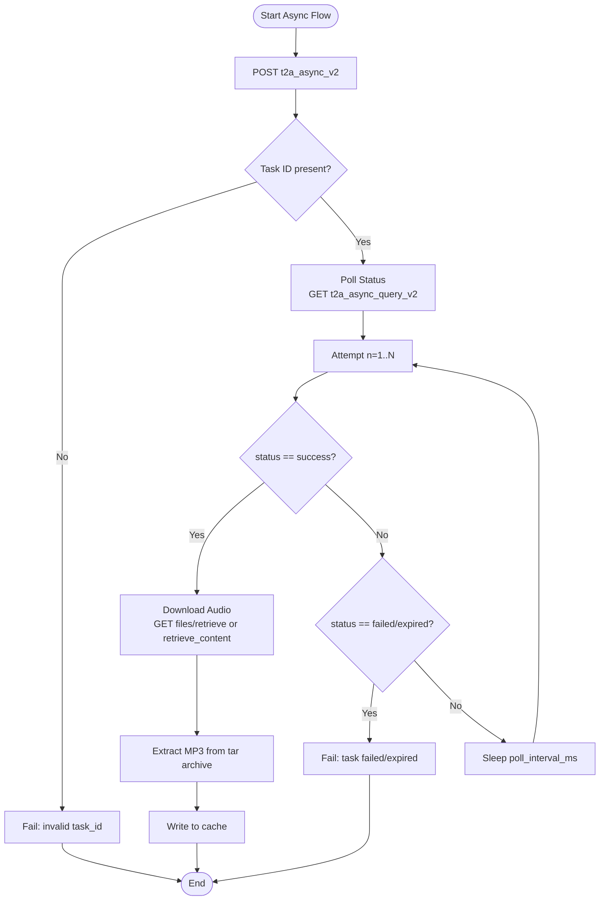
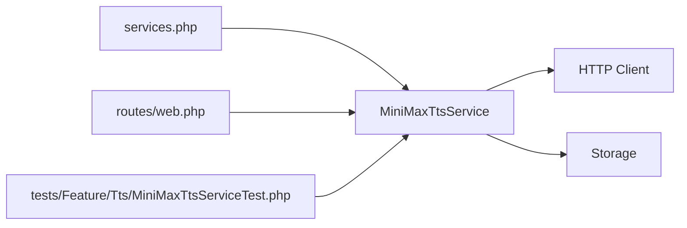

# Configuration and Settings

<cite>
**Referenced Files in This Document**
- [MiniMaxTtsService.php](file://app/Services/Tts/MiniMaxTtsService.php)
- [services.php](file://config/services.php)
- [MiniMaxTtsServiceTest.php](file://tests/Feature/Tts/MiniMaxTtsServiceTest.php)
- [web.php](file://routes/web.php)
</cite>

## Table of Contents
1. [Introduction](#introduction)
2. [Project Structure](#project-structure)
3. [Core Components](#core-components)
4. [Architecture Overview](#architecture-overview)
5. [Detailed Component Analysis](#detailed-component-analysis)
6. [Dependency Analysis](#dependency-analysis)
7. [Performance Considerations](#performance-considerations)
8. [Troubleshooting Guide](#troubleshooting-guide)
9. [Conclusion](#conclusion)
10. [Appendices](#appendices)

## Introduction
This document explains how Text-to-Speech (TTS) is configured and managed in the system with a focus on MiniMax API integration. It covers:
- API configuration options (API key, voice ID, model, language boost)
- Audio quality settings (sample rate, bitrate, channels, format)
- Voice parameter controls (speed, volume, pitch)
- Caching configuration (disk, prefix, refresh/cleanup behavior)
- Async operation settings (strategy, polling attempts, interval, timeouts)
- Environment variable setup, configuration validation, and security considerations
- Best practices for production deployment

## Project Structure
The TTS subsystem centers around a dedicated service class and configuration entries under the services configuration. Tests validate behavior across sync, async, and fallback scenarios.

**Diagram sources**
- [services.php:45-58](file://config/services.php#L45-L58)
- [MiniMaxTtsService.php:16-44](file://app/Services/Tts/MiniMaxTtsService.php#L16-L44)
- [web.php:122-124](file://routes/web.php#L122-L124)
- [MiniMaxTtsServiceTest.php:75-99](file://tests/Feature/Tts/MiniMaxTtsServiceTest.php#L75-L99)

**Section sources**
- [services.php:45-58](file://config/services.php#L45-L58)
- [MiniMaxTtsService.php:16-44](file://app/Services/Tts/MiniMaxTtsService.php#L16-L44)
- [web.php:122-124](file://routes/web.php#L122-L124)

## Core Components
- MiniMaxTtsService: Orchestrates TTS creation via MiniMax, manages caching, and supports sync, async, and auto strategies.
- Configuration: Centralized under services.minimax with environment-backed defaults.
- Routes: Expose endpoints for TV display to serve cached audio.

Key responsibilities:
- Build cache keys from voice, model, and normalized text
- Validate presence of API key and voice ID before proceeding
- Request speech via sync or async endpoints
- Persist binary audio to the configured storage disk
- Serve cached audio via route endpoint

**Section sources**
- [MiniMaxTtsService.php:16-44](file://app/Services/Tts/MiniMaxTtsService.php#L16-L44)
- [services.php:45-58](file://config/services.php#L45-L58)
- [web.php:122-124](file://routes/web.php#L122-L124)

## Architecture Overview
The TTS pipeline integrates configuration, service logic, external API calls, and local caching.

**Diagram sources**
- [MiniMaxTtsService.php:16-44](file://app/Services/Tts/MiniMaxTtsService.php#L16-L44)
- [MiniMaxTtsService.php:53-116](file://app/Services/Tts/MiniMaxTtsService.php#L53-L116)
- [MiniMaxTtsService.php:118-180](file://app/Services/Tts/MiniMaxTtsService.php#L118-L180)
- [MiniMaxTtsService.php:246-255](file://app/Services/Tts/MiniMaxTtsService.php#L246-L255)
- [services.php:45-58](file://config/services.php#L45-L58)
- [web.php:122-124](file://routes/web.php#L122-L124)

## Detailed Component Analysis

### MiniMax API Configuration Options
- API key setup
  - Required for all requests. If missing, the service returns null and does not call the API.
  - Sourced from configuration under services.minimax.api_key.
- Voice ID selection
  - Determines speaker identity and voice characteristics.
  - Sourced from services.minimax.voice_id.
- Model parameters
  - Selects the underlying model variant.
  - Sourced from services.minimax.model.
- Language boost settings
  - Controls language-specific emphasis.
  - Sourced from services.minimax.language_boost.

Environment variables:
- MINIMAX_API_KEY
- MINIMAX_VOICE_ID
- MINIMAX_MODEL
- MINIMAX_LANGUAGE_BOOST

Behavior:
- Empty API key or voice ID results in early exit without API calls.
- Defaults are applied when environment variables are not set.

**Section sources**
- [MiniMaxTtsService.php:23-27](file://app/Services/Tts/MiniMaxTtsService.php#L23-L27)
- [services.php:46-50](file://config/services.php#L46-L50)
- [MiniMaxTtsServiceTest.php:53-73](file://tests/Feature/Tts/MiniMaxTtsServiceTest.php#L53-L73)

### Audio Quality Configuration Options
- Sample rate
  - Sync endpoint: 32000 Hz
  - Async endpoint: 32000 Hz
- Bitrate
  - 128000 bps
- Channels
  - Mono (1)
- Format
  - MP3

These values are embedded in the audio_setting payload for both sync and async flows.

**Section sources**
- [MiniMaxTtsService.php:95-100](file://app/Services/Tts/MiniMaxTtsService.php#L95-L100)
- [MiniMaxTtsService.php:130-135](file://app/Services/Tts/MiniMaxTtsService.php#L130-L135)

### Voice Parameter Controls
- Speed
  - Float multiplier affecting speech rate.
  - Sourced from services.minimax.speed.
- Volume scaling
  - Float multiplier for amplitude.
  - Sourced from services.minimax.vol.
- Pitch modification
  - Integer shift in semitones.
  - Sourced from services.minimax.pitch.

These compose the voice_setting payload sent to MiniMax.

**Section sources**
- [MiniMaxTtsService.php:222-230](file://app/Services/Tts/MiniMaxTtsService.php#L222-L230)
- [services.php:51-53](file://config/services.php#L51-L53)

### Caching Configuration Options
- Cache disk selection
  - Disk name used for persistence.
  - Sourced from services.minimax.cache_disk.
- Cache prefix organization
  - Path prefix for stored audio files.
  - Sourced from services.minimax.cache_prefix.
- Cache key generation
  - Deterministic SHA-1 derived from voice_id, model, and lowercased text.
- Refresh policy
  - Cache is refreshed if the file is missing or contains a stale tar-like payload.
- Cleanup behavior
  - No automatic cleanup routine is implemented in the service; stale tar archives are detected and overwritten on demand.

Notes:
- The cache path is constructed as prefix/cacheKey.mp3.
- The service validates payload emptiness and detects tar-like archives to trigger refresh.

**Section sources**
- [MiniMaxTtsService.php:30-33](file://app/Services/Tts/MiniMaxTtsService.php#L30-L33)
- [MiniMaxTtsService.php:46-51](file://app/Services/Tts/MiniMaxTtsService.php#L46-L51)
- [MiniMaxTtsService.php:246-255](file://app/Services/Tts/MiniMaxTtsService.php#L246-L255)
- [MiniMaxTtsService.php:266-273](file://app/Services/Tts/MiniMaxTtsService.php#L266-L273)
- [MiniMaxTtsService.php:275-310](file://app/Services/Tts/MiniMaxTtsService.php#L275-L310)
- [services.php:56-57](file://config/services.php#L56-L57)

### Async Operation Settings
- Strategy selection
  - Values: sync, async, auto.
  - Sourced from services.minimax.strategy.
  - auto attempts async first, falls back to sync on failure.
- Polling attempts
  - Maximum number of queries before giving up.
  - Sourced from services.minimax.async_poll_attempts.
- Polling interval (milliseconds)
  - Delay between status checks.
  - Sourced from services.minimax.async_poll_interval_ms.
- Timeouts
  - Request timeouts for API calls are set internally (HTTP client timeout and explicit request timeouts).
- Task lifecycle
  - Create task (async), poll status until success/failure/expired, download audio, and extract MP3 from tar payload if needed.

**Diagram sources**
- [MiniMaxTtsService.php:118-180](file://app/Services/Tts/MiniMaxTtsService.php#L118-L180)
- [MiniMaxTtsService.php:182-220](file://app/Services/Tts/MiniMaxTtsService.php#L182-L220)
- [MiniMaxTtsService.php:257-310](file://app/Services/Tts/MiniMaxTtsService.php#L257-L310)

**Section sources**
- [MiniMaxTtsService.php:55-61](file://app/Services/Tts/MiniMaxTtsService.php#L55-L61)
- [MiniMaxTtsService.php:145-147](file://app/Services/Tts/MiniMaxTtsService.php#L145-L147)
- [MiniMaxTtsService.php:148-177](file://app/Services/Tts/MiniMaxTtsService.php#L148-L177)
- [MiniMaxTtsService.php:182-220](file://app/Services/Tts/MiniMaxTtsService.php#L182-L220)
- [services.php:49](file://config/services.php#L49)
- [services.php:54-55](file://config/services.php#L54-L55)

### Environment Variable Setup
- API credentials and voice/model defaults are loaded from environment variables with sensible defaults.
- The service reads these values via the configuration layer.

Recommended practice:
- Define all MINIMAX_* variables in your environment.
- Keep MINIMAX_API_KEY secret and protected.

**Section sources**
- [services.php:46-57](file://config/services.php#L46-L57)

### Configuration Validation and Behavior
- Early exit conditions:
  - Empty text returns null.
  - Missing API key or voice ID returns null.
- API response validation:
  - Non-successful HTTP responses or non-zero base_resp.status_code raise exceptions with contextual messages.
- Sync flow:
  - Returns decoded hex audio to binary.
- Async flow:
  - Creates task, polls status, retrieves file metadata, downloads content, and extracts MP3 from tar payload if necessary.

**Section sources**
- [MiniMaxTtsService.php:16-21](file://app/Services/Tts/MiniMaxTtsService.php#L16-L21)
- [MiniMaxTtsService.php:23-27](file://app/Services/Tts/MiniMaxTtsService.php#L23-L27)
- [MiniMaxTtsService.php:232-244](file://app/Services/Tts/MiniMaxTtsService.php#L232-L244)
- [MiniMaxTtsServiceTest.php:41-51](file://tests/Feature/Tts/MiniMaxTtsServiceTest.php#L41-L51)
- [MiniMaxTtsServiceTest.php:53-73](file://tests/Feature/Tts/MiniMaxTtsServiceTest.php#L53-L73)
- [MiniMaxTtsServiceTest.php:280-296](file://tests/Feature/Tts/MiniMaxTtsServiceTest.php#L280-L296)

### Security Considerations for API Credentials
- API key is passed via Authorization header in HTTP requests.
- Ensure environment variables are not committed to version control.
- Restrict access to configuration files and logs containing secrets.
- Prefer rotating keys and limiting permissions at the provider level.

**Section sources**
- [MiniMaxTtsService.php:83-87](file://app/Services/Tts/MiniMaxTtsService.php#L83-L87)
- [MiniMaxTtsService.php:120-124](file://app/Services/Tts/MiniMaxTtsService.php#L120-L124)

### Best Practices for Production Deployment
- Strategy
  - Use async for responsiveness; enable auto to tolerate transient failures.
- Polling
  - Adjust async_poll_attempts and async_poll_interval_ms to balance latency and reliability.
- Cache
  - Choose a durable storage disk for cache_disk.
  - Monitor cache disk usage and implement external cleanup if needed.
- Audio quality
  - Keep sample_rate, bitrate, channels, and format consistent with downstream consumption.
- Error handling
  - Wrap TTS calls with retries and fallbacks; surface user-friendly errors.
- Monitoring
  - Track API error rates, response times, and cache hit ratios.

**Section sources**
- [services.php:49](file://config/services.php#L49)
- [services.php:54-55](file://config/services.php#L54-L55)
- [services.php:56-57](file://config/services.php#L56-L57)
- [MiniMaxTtsService.php:64-79](file://app/Services/Tts/MiniMaxTtsService.php#L64-L79)

## Dependency Analysis
The service depends on:
- Configuration for API credentials, voice/model, strategy, language boost, voice parameters, async settings, and cache settings
- HTTP client for API calls
- Storage for caching audio payloads
- Routes for serving cached audio

**Diagram sources**
- [services.php:45-58](file://config/services.php#L45-L58)
- [MiniMaxTtsService.php:16-44](file://app/Services/Tts/MiniMaxTtsService.php#L16-L44)
- [web.php:122-124](file://routes/web.php#L122-L124)
- [MiniMaxTtsServiceTest.php:75-99](file://tests/Feature/Tts/MiniMaxTtsServiceTest.php#L75-L99)

**Section sources**
- [services.php:45-58](file://config/services.php#L45-L58)
- [MiniMaxTtsService.php:16-44](file://app/Services/Tts/MiniMaxTtsService.php#L16-L44)
- [web.php:122-124](file://routes/web.php#L122-L124)

## Performance Considerations
- Prefer async strategy for interactive experiences; tune polling attempts and interval to reduce perceived latency.
- Cache aggressively to minimize repeated API calls; ensure cache_disk has sufficient throughput.
- Keep audio quality settings aligned with playback devices to avoid transcoding overhead.
- Validate and sanitize text inputs to prevent unnecessary API calls for empty or whitespace-only strings.

[No sources needed since this section provides general guidance]

## Troubleshooting Guide
Common issues and resolutions:
- Empty or whitespace text
  - Expected behavior: returns null without API calls.
- Missing API key or voice ID
  - Expected behavior: returns null; verify environment variables and configuration.
- API errors
  - The service throws exceptions on non-successful responses or non-zero status codes; inspect error messages for details.
- Async task failures/expired
  - The service raises exceptions for failed or expired tasks; consider switching to sync or increasing polling attempts/intervals.
- Stale cache payload
  - Tar-like payloads are detected and refreshed automatically; ensure cache_disk is writable.

**Section sources**
- [MiniMaxTtsService.php:16-21](file://app/Services/Tts/MiniMaxTtsService.php#L16-L21)
- [MiniMaxTtsService.php:23-27](file://app/Services/Tts/MiniMaxTtsService.php#L23-L27)
- [MiniMaxTtsService.php:232-244](file://app/Services/Tts/MiniMaxTtsService.php#L232-L244)
- [MiniMaxTtsService.php:170-172](file://app/Services/Tts/MiniMaxTtsService.php#L170-L172)
- [MiniMaxTtsService.php:246-255](file://app/Services/Tts/MiniMaxTtsService.php#L246-L255)
- [MiniMaxTtsServiceTest.php:280-296](file://tests/Feature/Tts/MiniMaxTtsServiceTest.php#L280-L296)

## Conclusion
The MiniMax TTS integration is configurable via environment-backed settings, robustly handles both synchronous and asynchronous workflows, and persists audio to a configurable storage disk. By tuning strategy, polling, and cache settings—and by securing API credentials—you can achieve reliable, scalable TTS for TV displays and similar use cases.

[No sources needed since this section summarizes without analyzing specific files]

## Appendices

### Environment Variables Reference
- MINIMAX_API_KEY
- MINIMAX_VOICE_ID
- MINIMAX_MODEL
- MINIMAX_STRATEGY
- MINIMAX_LANGUAGE_BOOST
- MINIMAX_SPEED
- MINIMAX_VOL
- MINIMAX_PITCH
- MINIMAX_ASYNC_POLL_ATTEMPTS
- MINIMAX_ASYNC_POLL_INTERVAL_MS
- MINIMAX_CACHE_DISK
- MINIMAX_CACHE_PREFIX

**Section sources**
- [services.php:46-57](file://config/services.php#L46-L57)

### Route Reference for Audio Serving
- GET /tv-display/tts/audio/{cacheKey}

**Section sources**
- [web.php:123](file://routes/web.php#L123)