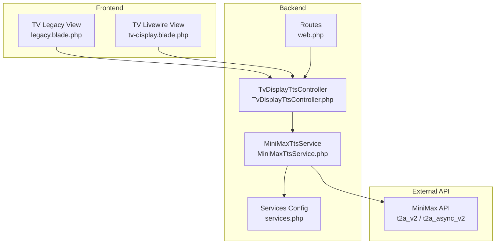
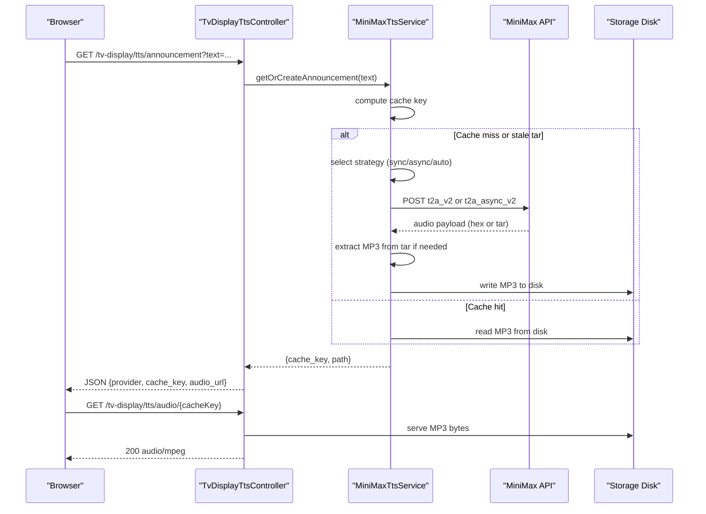
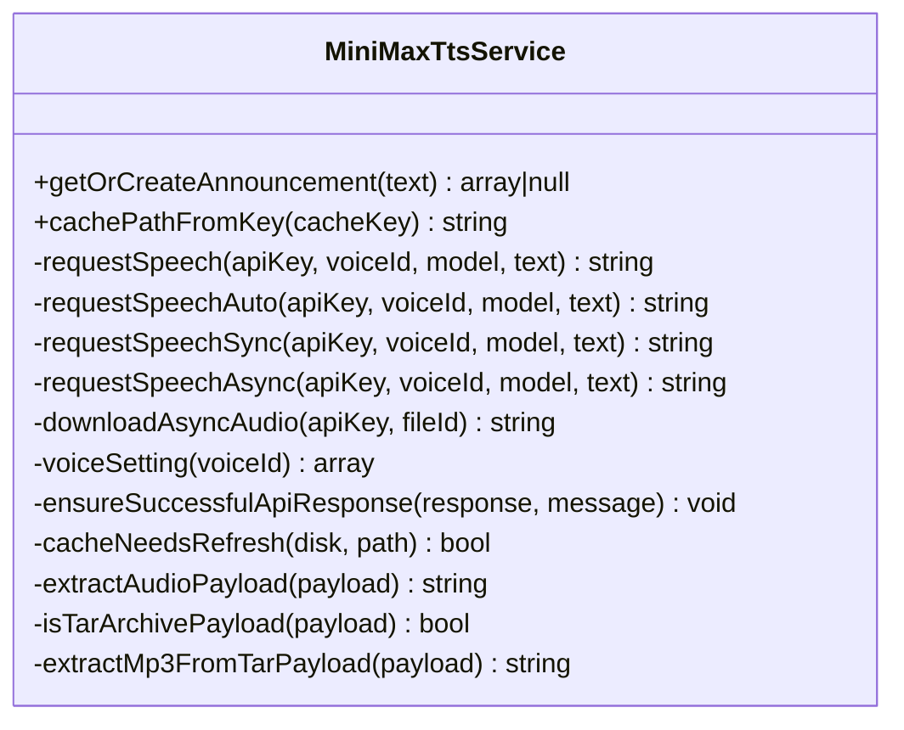
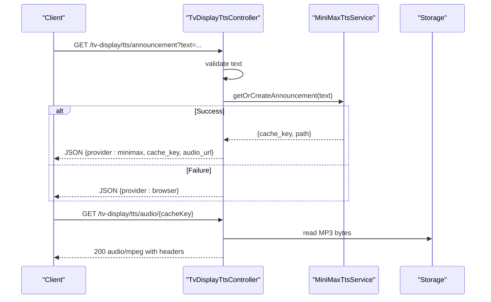
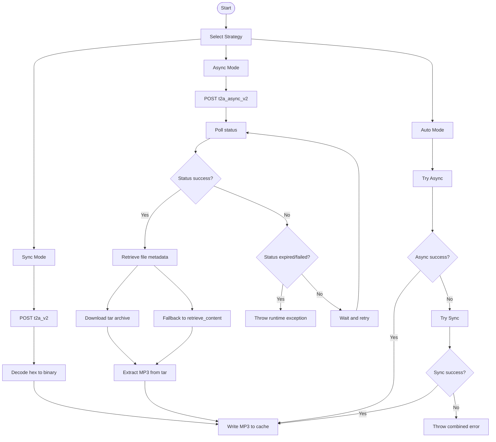
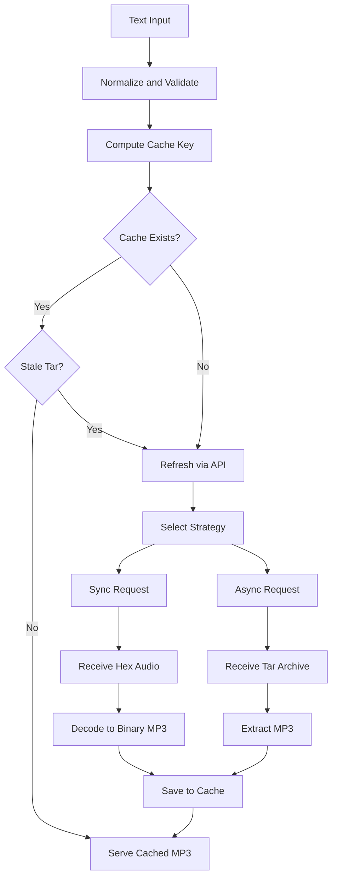
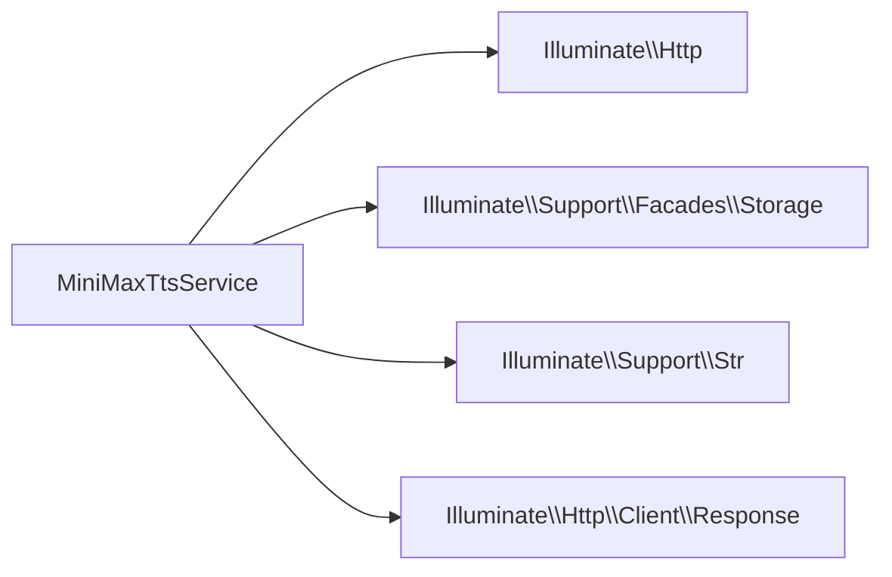

# TTS Service Architecture

<cite>
**Referenced Files in This Document**
- [MiniMaxTtsService.php](file://app/Services/Tts/MiniMaxTtsService.php)
- [TvDisplayTtsController.php](file://app/Http/Controllers/TvDisplayTtsController.php)
- [services.php](file://config/services.php)
- [web.php](file://routes/web.php)
- [MiniMaxTtsServiceTest.php](file://tests/Feature/Tts/MiniMaxTtsServiceTest.php)
- [legacy.blade.php](file://resources/views/pages/tv-display/legacy.blade.php)
- [tv-display.blade.php](file://resources/views/livewire/tv-display.blade.php)
</cite>

## Table of Contents
1. [Introduction](#introduction)
2. [Project Structure](#project-structure)
3. [Core Components](#core-components)
4. [Architecture Overview](#architecture-overview)
5. [Detailed Component Analysis](#detailed-component-analysis)
6. [Dependency Analysis](#dependency-analysis)
7. [Performance Considerations](#performance-considerations)
8. [Troubleshooting Guide](#troubleshooting-guide)
9. [Conclusion](#conclusion)

## Introduction
This document explains the TTS (Text-to-Speech) Service Architecture focused on the MiniMax API integration and the audio generation workflow used by the TV Display system. It covers the service class structure, method implementations, the three-tier audio generation strategy (sync, async, auto), voice configuration settings, audio processing pipeline from text input to MP3 output, fallback mechanisms, error handling, timeouts, and practical examples for initialization and configuration.

## Project Structure
The TTS service is implemented as a dedicated service class with a controller that exposes endpoints for generating announcements and serving cached audio. Configuration is centralized in the services configuration file, and routes connect the frontend to the backend.

**Diagram sources**
- [TvDisplayTtsController.php:12-61](file://app/Http/Controllers/TvDisplayTtsController.php#L12-L61)
- [MiniMaxTtsService.php:11-312](file://app/Services/Tts/MiniMaxTtsService.php#L11-L312)
- [services.php:45-58](file://config/services.php#L45-L58)
- [web.php:122-124](file://routes/web.php#L122-L124)

**Section sources**
- [TvDisplayTtsController.php:12-61](file://app/Http/Controllers/TvDisplayTtsController.php#L12-L61)
- [MiniMaxTtsService.php:11-312](file://app/Services/Tts/MiniMaxTtsService.php#L11-L312)
- [services.php:45-58](file://config/services.php#L45-L58)
- [web.php:122-124](file://routes/web.php#L122-L124)

## Core Components
- MiniMaxTtsService: Orchestrates audio generation via MiniMax API, caching, and payload extraction. Implements three strategies: sync, async, and auto.
- TvDisplayTtsController: Exposes endpoints for generating announcements and serving cached audio.
- Configuration: Centralized in services.php under the minimax key with defaults and environment overrides.
- Frontend Views: Legacy and Livewire views trigger TTS generation and handle fallback to browser TTS.

Key responsibilities:
- Text normalization and cache key computation
- Strategy selection and API calls
- Hex decoding and tar archive extraction
- Caching with disk and prefix configuration
- Error handling and timeouts

**Section sources**
- [MiniMaxTtsService.php:16-44](file://app/Services/Tts/MiniMaxTtsService.php#L16-L44)
- [TvDisplayTtsController.php:14-60](file://app/Http/Controllers/TvDisplayTtsController.php#L14-L60)
- [services.php:45-58](file://config/services.php#L45-L58)

## Architecture Overview
The system follows a layered architecture:
- Presentation Layer: Frontend views trigger TTS requests.
- Application Layer: Controller validates input and delegates to the service.
- Domain Layer: Service manages API communication, caching, and audio processing.
- External Integration: MiniMax API for audio synthesis.

**Diagram sources**
- [TvDisplayTtsController.php:14-60](file://app/Http/Controllers/TvDisplayTtsController.php#L14-L60)
- [MiniMaxTtsService.php:16-44](file://app/Services/Tts/MiniMaxTtsService.php#L16-L44)
- [MiniMaxTtsService.php:53-116](file://app/Services/Tts/MiniMaxTtsService.php#L53-L116)
- [MiniMaxTtsService.php:118-180](file://app/Services/Tts/MiniMaxTtsService.php#L118-L180)
- [MiniMaxTtsService.php:257-310](file://app/Services/Tts/MiniMaxTtsService.php#L257-L310)

## Detailed Component Analysis

### MiniMaxTtsService
The service encapsulates the entire TTS workflow:
- Input normalization and validation
- Cache key computation based on voice, model, and lowercase text
- Strategy selection:
  - sync: Direct synchronous request returning hex-encoded audio
  - async: Asynchronous workflow with task creation, polling, and file retrieval
  - auto: Try async first, fallback to sync on failure
- Voice settings: speed, volume, pitch
- Audio settings: sample rate, bitrate, format, channel
- Payload processing: hex decoding and tar archive extraction
- Error handling: API response validation and meaningful exceptions

**Diagram sources**
- [MiniMaxTtsService.php:11-312](file://app/Services/Tts/MiniMaxTtsService.php#L11-L312)

**Section sources**
- [MiniMaxTtsService.php:16-44](file://app/Services/Tts/MiniMaxTtsService.php#L16-L44)
- [MiniMaxTtsService.php:53-116](file://app/Services/Tts/MiniMaxTtsService.php#L53-L116)
- [MiniMaxTtsService.php:118-180](file://app/Services/Tts/MiniMaxTtsService.php#L118-L180)
- [MiniMaxTtsService.php:182-220](file://app/Services/Tts/MiniMaxTtsService.php#L182-L220)
- [MiniMaxTtsService.php:222-230](file://app/Services/Tts/MiniMaxTtsService.php#L222-L230)
- [MiniMaxTtsService.php:232-244](file://app/Services/Tts/MiniMaxTtsService.php#L232-L244)
- [MiniMaxTtsService.php:246-255](file://app/Services/Tts/MiniMaxTtsService.php#L246-L255)
- [MiniMaxTtsService.php:257-310](file://app/Services/Tts/MiniMaxTtsService.php#L257-L310)

### TvDisplayTtsController
The controller handles:
- Validation of incoming text input
- Delegation to the service for audio generation
- Fallback to browser TTS provider when service fails
- Serving cached audio with appropriate headers

**Diagram sources**
- [TvDisplayTtsController.php:14-60](file://app/Http/Controllers/TvDisplayTtsController.php#L14-L60)

**Section sources**
- [TvDisplayTtsController.php:14-60](file://app/Http/Controllers/TvDisplayTtsController.php#L14-L60)

### Configuration Options
All configuration is managed under the minimax key in services.php with sensible defaults and environment overrides.

- api_key: MiniMax API key
- voice_id: Voice identifier
- model: Model name (default: speech-2.8-hd)
- strategy: Generation strategy (sync, async, auto)
- language_boost: Language boost setting
- speed: Voice speed multiplier
- vol: Volume multiplier
- pitch: Pitch adjustment
- async_poll_attempts: Maximum polling attempts for async
- async_poll_interval_ms: Polling interval for async
- cache_disk: Storage disk for cached audio
- cache_prefix: Path prefix for cached audio

**Section sources**
- [services.php:45-58](file://config/services.php#L45-L58)

### Three-Tier Audio Generation Strategy
- sync: Immediate audio generation via synchronous endpoint; returns hex-encoded audio which is decoded to binary MP3.
- async: Creates a task, polls for completion, retrieves file metadata, downloads tar archive, extracts MP3, and falls back to alternate endpoint if needed.
- auto: Attempts async first; if it fails, tries sync and throws combined error if both fail.

**Diagram sources**
- [MiniMaxTtsService.php:53-116](file://app/Services/Tts/MiniMaxTtsService.php#L53-L116)
- [MiniMaxTtsService.php:118-180](file://app/Services/Tts/MiniMaxTtsService.php#L118-L180)
- [MiniMaxTtsService.php:64-79](file://app/Services/Tts/MiniMaxTtsService.php#L64-L79)

**Section sources**
- [MiniMaxTtsService.php:53-116](file://app/Services/Tts/MiniMaxTtsService.php#L53-L116)
- [MiniMaxTtsService.php:118-180](file://app/Services/Tts/MiniMaxTtsService.php#L118-L180)
- [MiniMaxTtsService.php:64-79](file://app/Services/Tts/MiniMaxTtsService.php#L64-L79)

### Voice Configuration Settings
Voice settings are configured via the voiceSetting method and mapped to the MiniMax API request body:
- speed: Float multiplier affecting speaking speed
- vol: Float multiplier affecting volume
- pitch: Integer adjustment affecting pitch
- voice_id: String identifier for the selected voice

These settings are read from configuration and included in both sync and async requests.

**Section sources**
- [MiniMaxTtsService.php:222-230](file://app/Services/Tts/MiniMaxTtsService.php#L222-L230)
- [services.php:51-53](file://config/services.php#L51-L53)

### Audio Processing Pipeline
End-to-end processing from text to MP3:
- Text normalization and cache key computation
- Strategy-based API call
- Synchronous mode: receive hex-encoded audio, decode to binary MP3
- Asynchronous mode: receive tar archive, extract MP3
- Cache MP3 to configured disk with configured prefix
- Serve MP3 via controller endpoint with appropriate headers

**Diagram sources**
- [MiniMaxTtsService.php:16-44](file://app/Services/Tts/MiniMaxTtsService.php#L16-L44)
- [MiniMaxTtsService.php:53-116](file://app/Services/Tts/MiniMaxTtsService.php#L53-L116)
- [MiniMaxTtsService.php:118-180](file://app/Services/Tts/MiniMaxTtsService.php#L118-L180)
- [MiniMaxTtsService.php:257-310](file://app/Services/Tts/MiniMaxTtsService.php#L257-L310)

**Section sources**
- [MiniMaxTtsService.php:16-44](file://app/Services/Tts/MiniMaxTtsService.php#L16-L44)
- [MiniMaxTtsService.php:53-116](file://app/Services/Tts/MiniMaxTtsService.php#L53-L116)
- [MiniMaxTtsService.php:118-180](file://app/Services/Tts/MiniMaxTtsService.php#L118-L180)
- [MiniMaxTtsService.php:257-310](file://app/Services/Tts/MiniMaxTtsService.php#L257-L310)

### Fallback Mechanisms and Error Handling
- Controller fallback: On any exception during audio generation, the controller responds with provider browser to trigger client-side TTS.
- Service fallback: Auto strategy attempts async first, then sync, combining errors if both fail.
- API response validation: Non-successful responses or non-zero status codes raise runtime exceptions with detailed messages.
- Timeout configurations: HTTP requests use explicit timeouts for API calls and downloads.
- Stale cache handling: Tar archives are detected and refreshed to ensure fresh audio.

**Section sources**
- [TvDisplayTtsController.php:20-32](file://app/Http/Controllers/TvDisplayTtsController.php#L20-L32)
- [MiniMaxTtsService.php:64-79](file://app/Services/Tts/MiniMaxTtsService.php#L64-L79)
- [MiniMaxTtsService.php:232-244](file://app/Services/Tts/MiniMaxTtsService.php#L232-L244)

### Practical Examples

#### Service Initialization and Configuration
- Initialize the service with default configuration from services.php.
- Override configuration via environment variables for api_key, voice_id, model, strategy, language_boost, speed, vol, pitch, async_poll_attempts, async_poll_interval_ms, cache_disk, cache_prefix.

**Section sources**
- [services.php:45-58](file://config/services.php#L45-L58)

#### Audio Generation Calls
- Controller endpoint: GET /tv-display/tts/announcement?text=...
  - Returns JSON with provider, cache_key, and audio_url when successful.
  - Returns JSON with provider=browser when service fails.
- Audio serving endpoint: GET /tv-display/tts/audio/{cacheKey}
  - Returns 200 audio/mpeg with appropriate headers.

**Section sources**
- [TvDisplayTtsController.php:14-60](file://app/Http/Controllers/TvDisplayTtsController.php#L14-L60)
- [web.php:122-124](file://routes/web.php#L122-L124)

#### Frontend Integration
- Legacy view: Uses AJAX to request TTS and plays audio via Blob URL; falls back to browser TTS on failure.
- Livewire view: Listens for play-tts events and triggers TTS generation.

**Section sources**
- [legacy.blade.php:782-807](file://resources/views/pages/tv-display/legacy.blade.php#L782-L807)
- [tv-display.blade.php:30-40](file://resources/views/livewire/tv-display.blade.php#L30-L40)

## Dependency Analysis
The service depends on:
- Illuminate\Http\Client for HTTP requests
- Illuminate\Support\Facades\Storage for caching
- Illuminate\Support\Str for text normalization
- Illuminate\Support\Facades\Http for API calls

**Diagram sources**
- [MiniMaxTtsService.php:5-9](file://app/Services/Tts/MiniMaxTtsService.php#L5-L9)

**Section sources**
- [MiniMaxTtsService.php:5-9](file://app/Services/Tts/MiniMaxTtsService.php#L5-L9)

## Performance Considerations
- Strategy selection: Prefer async for improved responsiveness; fallback to sync for reliability.
- Cache tuning: Configure cache_disk and cache_prefix to optimize storage performance.
- Polling parameters: Adjust async_poll_attempts and async_poll_interval_ms to balance latency and reliability.
- Timeout tuning: Ensure timeouts accommodate network conditions and file sizes.
- Payload handling: Tar extraction adds overhead; ensure cache refresh logic avoids unnecessary regeneration.

[No sources needed since this section provides general guidance]

## Troubleshooting Guide
Common issues and resolutions:
- Empty or invalid text: Service returns null; ensure text is provided and validated.
- Missing API key or voice ID: Service returns null; configure services.minimax.api_key and services.minimax.voice_id.
- API failures: Service throws runtime exceptions; check MiniMax API status and credentials.
- Async timeout: Increase async_poll_attempts and async_poll_interval_ms; verify network connectivity.
- Tar extraction failures: Ensure tar payload contains a valid MP3 entry; verify file integrity.
- Browser fallback: If service fails, controller returns provider=browser; verify client-side TTS availability.

**Section sources**
- [MiniMaxTtsService.php:18-27](file://app/Services/Tts/MiniMaxTtsService.php#L18-L27)
- [TvDisplayTtsController.php:20-32](file://app/Http/Controllers/TvDisplayTtsController.php#L20-L32)
- [MiniMaxTtsService.php:232-244](file://app/Services/Tts/MiniMaxTtsService.php#L232-L244)
- [MiniMaxTtsService.php:145-179](file://app/Services/Tts/MiniMaxTtsService.php#L145-L179)

## Conclusion
The TTS Service Architecture integrates seamlessly with the TV Display system, providing robust audio generation via MiniMax API with flexible strategies, comprehensive caching, and resilient fallbacks. The modular design ensures maintainability, while configuration-driven settings enable easy tuning for performance and reliability.