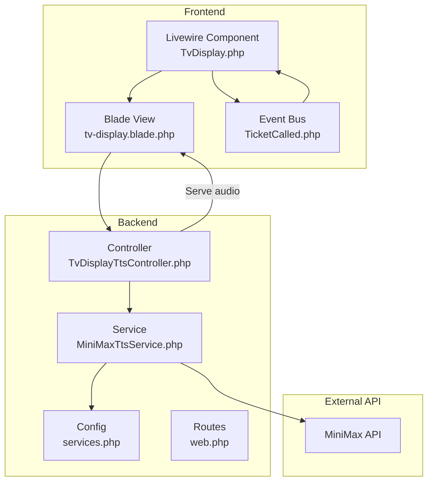
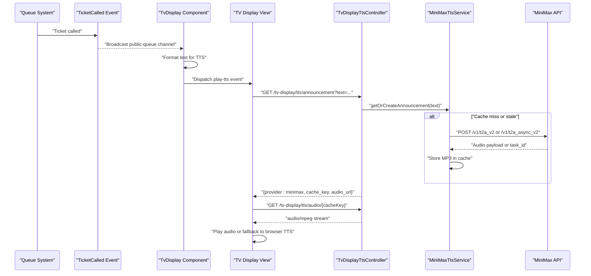
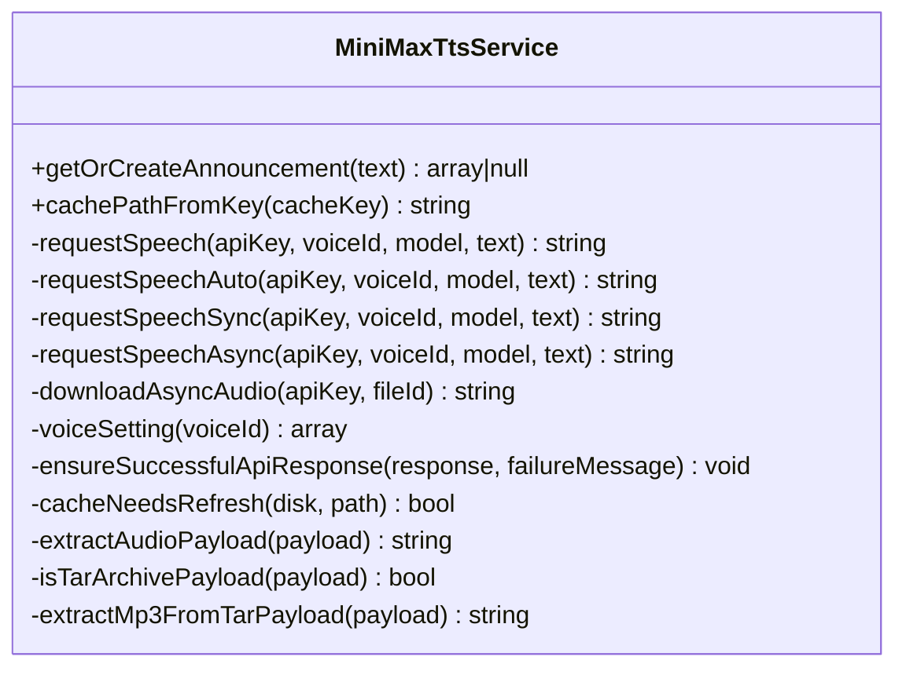
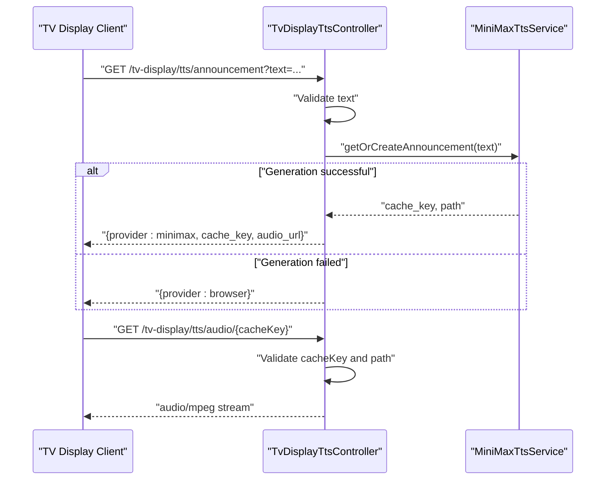
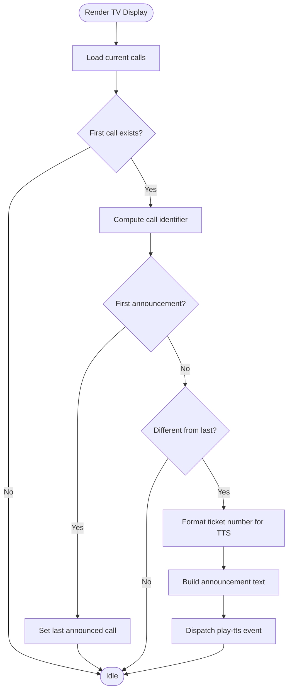
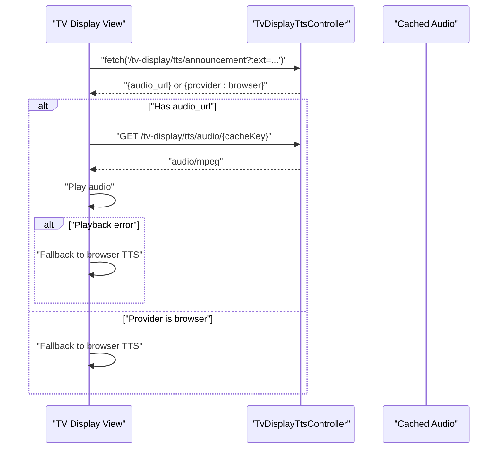
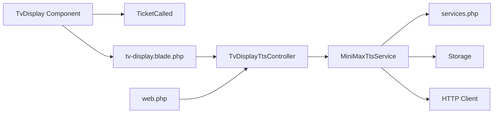

# Text-to-Speech Integration

<cite>
**Referenced Files in This Document**
- [MiniMaxTtsService.php](file://app/Services/Tts/MiniMaxTtsService.php)
- [TvDisplayTtsController.php](file://app/Http/Controllers/TvDisplayTtsController.php)
- [TvDisplay.php](file://app/Livewire/TvDisplay.php)
- [TicketCalled.php](file://app/Events/TicketCalled.php)
- [services.php](file://config/services.php)
- [web.php](file://routes/web.php)
- [api.php](file://routes/api.php)
- [tv-display.blade.php](file://resources/views/livewire/tv-display.blade.php)
- [MiniMaxTtsServiceTest.php](file://tests/Feature/Tts/MiniMaxTtsServiceTest.php)
</cite>

## Table of Contents
1. [Introduction](#introduction)
2. [Project Structure](#project-structure)
3. [Core Components](#core-components)
4. [Architecture Overview](#architecture-overview)
5. [Detailed Component Analysis](#detailed-component-analysis)
6. [Dependency Analysis](#dependency-analysis)
7. [Performance Considerations](#performance-considerations)
8. [Troubleshooting Guide](#troubleshooting-guide)
9. [Conclusion](#conclusion)

## Introduction
This document explains the Text-to-Speech (TTS) Integration system that powers Indonesian voice announcements in the TV display interface. It covers the service architecture, integration with the MiniMax API, the audio generation workflow from queue events to synthesized speech output, caching mechanisms, performance optimizations, fallback strategies for offline scenarios, and error handling. It also documents configuration options for voice selection, audio quality, and storage management.

## Project Structure
The TTS system spans several layers:
- Service layer: MiniMaxTtsService encapsulates audio generation and caching logic
- Controller layer: TvDisplayTtsController exposes public endpoints for TTS requests and audio retrieval
- Livewire component: TvDisplay orchestrates queue event listening and dispatches TTS playback
- Event system: TicketCalled broadcasts queue state changes to clients
- Configuration: services.php defines MiniMax integration parameters
- Routing: web.php registers TV display TTS endpoints
- Views: tv-display.blade.php integrates client-side audio playback and fallback logic

**Diagram sources**
- [TvDisplay.php:18-83](file://app/Livewire/TvDisplay.php#L18-L83)
- [TicketCalled.php:11-34](file://app/Events/TicketCalled.php#L11-L34)
- [tv-display.blade.php:30-40](file://resources/views/livewire/tv-display.blade.php#L30-L40)
- [TvDisplayTtsController.php:14-60](file://app/Http/Controllers/TvDisplayTtsController.php#L14-L60)
- [MiniMaxTtsService.php:16-44](file://app/Services/Tts/MiniMaxTtsService.php#L16-L44)
- [services.php:45-58](file://config/services.php#L45-L58)
- [web.php:122-123](file://routes/web.php#L122-L123)

**Section sources**
- [TvDisplay.php:18-83](file://app/Livewire/TvDisplay.php#L18-L83)
- [TvDisplayTtsController.php:14-60](file://app/Http/Controllers/TvDisplayTtsController.php#L14-L60)
- [MiniMaxTtsService.php:16-44](file://app/Services/Tts/MiniMaxTtsService.php#L16-L44)
- [services.php:45-58](file://config/services.php#L45-L58)
- [web.php:122-123](file://routes/web.php#L122-L123)

## Core Components
- MiniMaxTtsService: Generates Indonesian audio via MiniMax, caches results, and supports sync/async/auto strategies with robust error handling and tar payload extraction
- TvDisplayTtsController: Provides public endpoints for TTS announcement requests and serving cached audio
- TvDisplay Livewire component: Listens for queue events, formats announcement text, and triggers TTS playback
- TicketCalled event: Broadcasts queue state changes to clients for real-time updates
- Configuration: Centralized settings for API keys, voice selection, model, strategy, language boost, audio quality, polling parameters, and cache settings

**Section sources**
- [MiniMaxTtsService.php:11-312](file://app/Services/Tts/MiniMaxTtsService.php#L11-L312)
- [TvDisplayTtsController.php:12-62](file://app/Http/Controllers/TvDisplayTtsController.php#L12-L62)
- [TvDisplay.php:18-83](file://app/Livewire/TvDisplay.php#L18-L83)
- [TicketCalled.php:11-34](file://app/Events/TicketCalled.php#L11-L34)
- [services.php:45-58](file://config/services.php#L45-L58)

## Architecture Overview
The TTS pipeline integrates queue events with MiniMax audio synthesis and local caching, delivering seamless audio announcements on the TV display.

**Diagram sources**
- [TicketCalled.php:18-32](file://app/Events/TicketCalled.php#L18-L32)
- [TvDisplay.php:41-67](file://app/Livewire/TvDisplay.php#L41-L67)
- [tv-display.blade.php:30-40](file://resources/views/livewire/tv-display.blade.php#L30-L40)
- [TvDisplayTtsController.php:14-60](file://app/Http/Controllers/TvDisplayTtsController.php#L14-L60)
- [MiniMaxTtsService.php:16-44](file://app/Services/Tts/MiniMaxTtsService.php#L16-L44)

## Detailed Component Analysis

### MiniMaxTtsService
Responsibilities:
- Generate cache keys from voice, model, and normalized text
- Choose generation strategy: sync, async, or auto (async with sync fallback)
- Request audio from MiniMax APIs and handle responses
- Cache MP3 files on the configured disk with configurable prefix
- Extract MP3 from tar archives returned by MiniMax
- Validate API responses and raise descriptive errors

Key behaviors:
- Text normalization: squishes whitespace and rejects empty input
- Authentication: Bearer token via API key
- Audio settings: sample rate, bitrate, format, channels
- Voice settings: voice_id, speed, volume, pitch
- Async workflow: task creation, polling with configurable attempts and intervals, file retrieval, and fallback content retrieval
- Cache refresh: detects stale tar archives and regenerates audio

**Diagram sources**
- [MiniMaxTtsService.php:11-312](file://app/Services/Tts/MiniMaxTtsService.php#L11-L312)

**Section sources**
- [MiniMaxTtsService.php:16-44](file://app/Services/Tts/MiniMaxTtsService.php#L16-L44)
- [MiniMaxTtsService.php:53-116](file://app/Services/Tts/MiniMaxTtsService.php#L53-L116)
- [MiniMaxTtsService.php:118-180](file://app/Services/Tts/MiniMaxTtsService.php#L118-L180)
- [MiniMaxTtsService.php:182-220](file://app/Services/Tts/MiniMaxTtsService.php#L182-L220)
- [MiniMaxTtsService.php:222-244](file://app/Services/Tts/MiniMaxTtsService.php#L222-L244)
- [MiniMaxTtsService.php:246-310](file://app/Services/Tts/MiniMaxTtsService.php#L246-L310)

### TvDisplayTtsController
Responsibilities:
- Validate incoming TTS text requests
- Delegate audio generation to MiniMaxTtsService
- Return JSON with provider type, cache key, and audio URL
- Serve cached audio files with appropriate headers and immutability

Endpoints:
- GET /tv-display/tts/announcement: Returns provider info and audio URL
- GET /tv-display/tts/audio/{cacheKey}: Streams cached MP3

**Diagram sources**
- [TvDisplayTtsController.php:14-60](file://app/Http/Controllers/TvDisplayTtsController.php#L14-L60)
- [MiniMaxTtsService.php:16-44](file://app/Services/Tts/MiniMaxTtsService.php#L16-L44)

**Section sources**
- [TvDisplayTtsController.php:14-60](file://app/Http/Controllers/TvDisplayTtsController.php#L14-L60)
- [web.php:122-123](file://routes/web.php#L122-L123)

### TvDisplay Livewire Component
Responsibilities:
- Listen for queue events on the public-queue channel
- Determine when a new announcement should be made
- Format ticket numbers for TTS (explicit phonetics, comma-separated)
- Dispatch play-tts events to the frontend view

**Diagram sources**
- [TvDisplay.php:29-83](file://app/Livewire/TvDisplay.php#L29-L83)

**Section sources**
- [TvDisplay.php:29-83](file://app/Livewire/TvDisplay.php#L29-L83)

### TV Display Audio Playback and Fallback
The frontend view handles audio playback and graceful fallback:
- Fetches audio URL from backend endpoint
- Creates an Audio element and plays it
- On playback errors or fetch failures, falls back to browser TTS
- Includes connection status indicators and audio unlocking UX

**Diagram sources**
- [tv-display.blade.php:30-40](file://resources/views/livewire/tv-display.blade.php#L30-L40)
- [TvDisplayTtsController.php:41-60](file://app/Http/Controllers/TvDisplayTtsController.php#L41-L60)

**Section sources**
- [tv-display.blade.php:30-40](file://resources/views/livewire/tv-display.blade.php#L30-L40)
- [TvDisplayTtsController.php:41-60](file://app/Http/Controllers/TvDisplayTtsController.php#L41-L60)

## Dependency Analysis
- TvDisplayTtsController depends on MiniMaxTtsService for audio generation and on Storage for serving cached files
- MiniMaxTtsService depends on configuration values, HTTP client, and Storage
- TvDisplay Livewire component listens to TicketCalled events and dispatches play-tts events to the view
- Routes define the public endpoints for TTS requests and audio retrieval

**Diagram sources**
- [TvDisplayTtsController.php:5-10](file://app/Http/Controllers/TvDisplayTtsController.php#L5-L10)
- [MiniMaxTtsService.php:5-9](file://app/Services/Tts/MiniMaxTtsService.php#L5-L9)
- [services.php:45-58](file://config/services.php#L45-L58)
- [TvDisplay.php:22-27](file://app/Livewire/TvDisplay.php#L22-L27)
- [web.php:122-123](file://routes/web.php#L122-L123)

**Section sources**
- [TvDisplayTtsController.php:5-10](file://app/Http/Controllers/TvDisplayTtsController.php#L5-L10)
- [MiniMaxTtsService.php:5-9](file://app/Services/Tts/MiniMaxTtsService.php#L5-L9)
- [TvDisplay.php:22-27](file://app/Livewire/TvDisplay.php#L22-L27)
- [web.php:122-123](file://routes/web.php#L122-L123)

## Performance Considerations
- Caching: Generated audio is cached on the configured disk with a configurable prefix. Cache keys are derived from voice, model, and normalized text, enabling reuse across identical prompts
- Tar payload handling: The service detects and extracts MP3 from tar archives returned by MiniMax, refreshing stale cached tar payloads transparently
- Async strategy: Uses asynchronous tasks with configurable polling attempts and intervals to reduce latency and improve throughput
- Audio settings: Fixed MP3 settings (32 kHz sample rate, 128 kbps, mono) balance quality and bandwidth
- Immutable caching: Audio responses include Cache-Control headers indicating immutability and long-lived caching
- Frontend optimizations: Audio unlocking overlay ensures consistent playback; connection status indicator helps diagnose network issues

**Section sources**
- [MiniMaxTtsService.php:35-43](file://app/Services/Tts/MiniMaxTtsService.php#L35-L43)
- [MiniMaxTtsService.php:257-310](file://app/Services/Tts/MiniMaxTtsService.php#L257-L310)
- [MiniMaxTtsService.php:145-177](file://app/Services/Tts/MiniMaxTtsService.php#L145-L177)
- [TvDisplayTtsController.php:53-59](file://app/Http/Controllers/TvDisplayTtsController.php#L53-L59)
- [tv-display.blade.php:8-14](file://resources/views/livewire/tv-display.blade.php#L8-L14)

## Troubleshooting Guide
Common issues and resolutions:
- Empty or invalid text: Service returns null; ensure non-empty, normalized text
- Missing API key or voice ID: Service returns null; configure MINIMAX_API_KEY and MINIMAX_VOICE_ID
- API errors: Service throws descriptive exceptions; check base_resp status codes and messages
- Async timeout/expired: Service throws exceptions after max polling attempts; adjust MINIMAX_ASYNC_POLL_ATTEMPTS and MINIMAX_ASYNC_POLL_INTERVAL_MS
- Stale tar cache: Service refreshes cached tar payloads automatically
- Audio playback failures: Frontend falls back to browser TTS; verify audio URL and network connectivity
- Cache path validation: Ensure cacheKey matches expected SHA-1 format and cached file exists

Operational checks:
- Verify MiniMax API credentials and voice availability
- Confirm cache disk configuration and write permissions
- Review polling parameters for network conditions
- Test fallback behavior by simulating API failures

**Section sources**
- [MiniMaxTtsService.php:18-27](file://app/Services/Tts/MiniMaxTtsService.php#L18-L27)
- [MiniMaxTtsService.php:232-244](file://app/Services/Tts/MiniMaxTtsService.php#L232-L244)
- [MiniMaxTtsService.php:174-180](file://app/Services/Tts/MiniMaxTtsService.php#L174-L180)
- [TvDisplayTtsController.php:43-51](file://app/Http/Controllers/TvDisplayTtsController.php#L43-L51)
- [tv-display.blade.php:30-40](file://resources/views/livewire/tv-display.blade.php#L30-L40)

## Conclusion
The TTS Integration system provides reliable Indonesian voice announcements for the TV display by combining Livewire-driven event handling, a configurable MiniMax service, and efficient caching. It supports flexible generation strategies, robust error handling, and graceful fallbacks to ensure continuous operation under varying network conditions. Administrators can tune voice selection, audio quality, and storage behavior through centralized configuration.