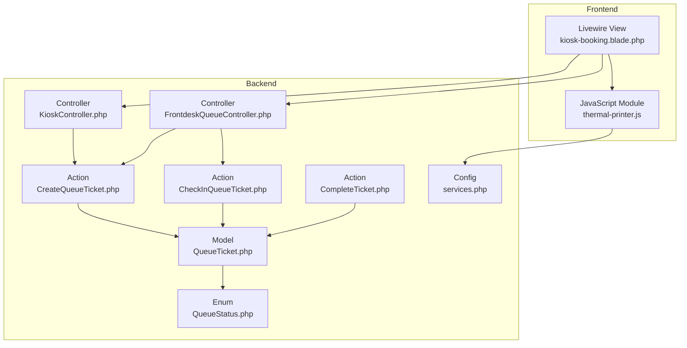
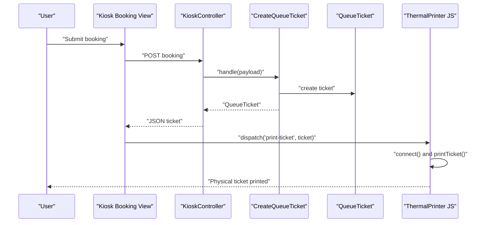
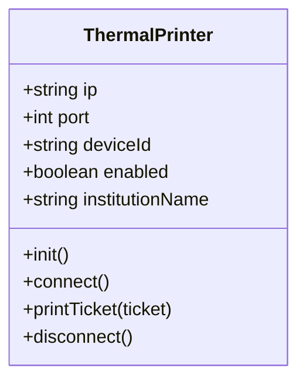
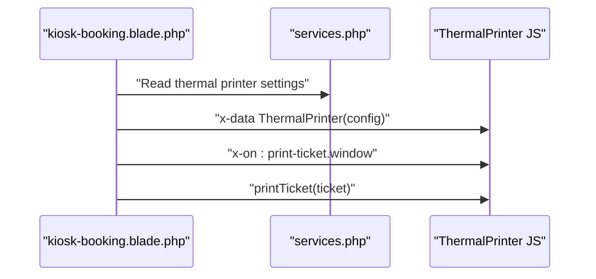
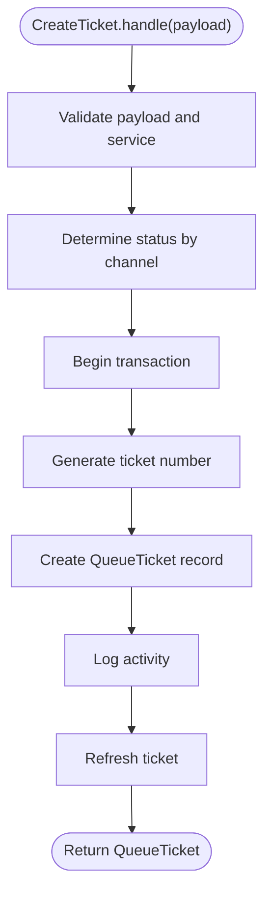
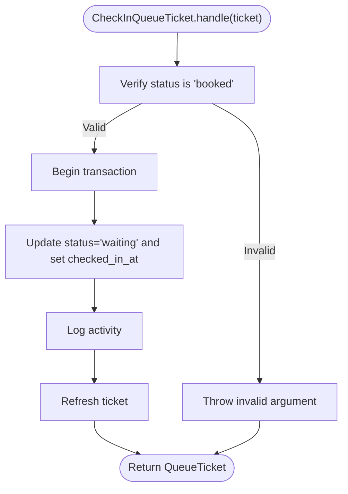
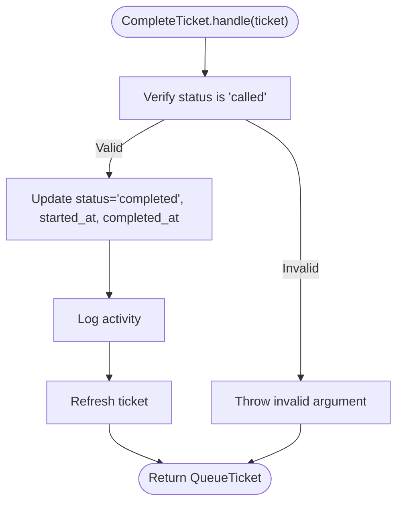
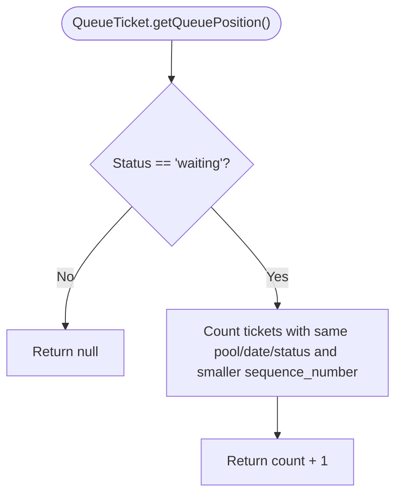
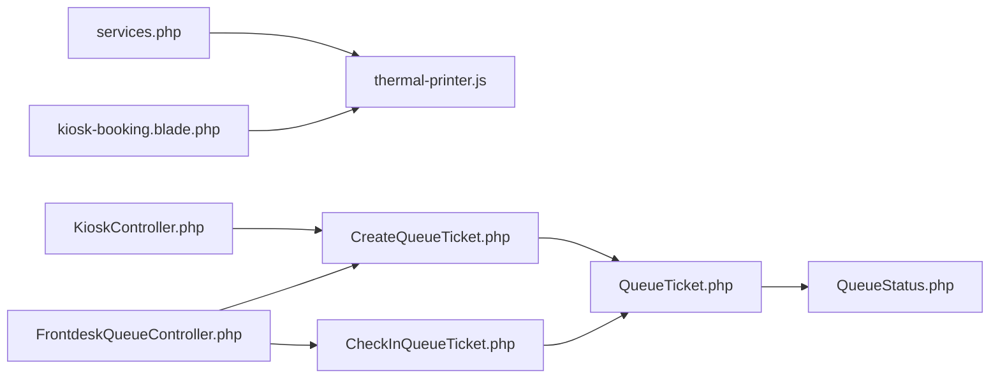

# Print Job Management

<cite>
**Referenced Files in This Document**
- [thermal-printer.js](file://resources/js/thermal-printer.js)
- [kiosk-booking.blade.php](file://resources/views/livewire/kiosk-booking.blade.php)
- [CreateQueueTicket.php](file://app/Actions/Queue/CreateQueueTicket.php)
- [CheckInQueueTicket.php](file://app/Actions/Queue/CheckInQueueTicket.php)
- [CompleteTicket.php](file://app/Actions/Queue/CompleteTicket.php)
- [GenerateTicketNumber.php](file://app/Actions/Queue/GenerateTicketNumber.php)
- [LogQueueActivity.php](file://app/Actions/Queue/LogQueueActivity.php)
- [QueueTicket.php](file://app/Models/QueueTicket.php)
- [QueueStatus.php](file://app/Enums/QueueStatus.php)
- [KioskController.php](file://app/Http/Controllers/KioskController.php)
- [FrontdeskQueueController.php](file://app/Http/Controllers/FrontdeskQueueController.php)
- [services.php](file://config/services.php)
- [2026-03-13-kiosk-reprint-thermal-printer.md](file://docs/plans/2026-03-13-kiosk-reprint-thermal-printer.md)
- [2026-03-06-ptsp-queue-implementation-plan.md](file://docs/plans/2026-03-06-ptsp-queue-implementation-plan.md)
</cite>

## Table of Contents
1. [Introduction](#introduction)
2. [Project Structure](#project-structure)
3. [Core Components](#core-components)
4. [Architecture Overview](#architecture-overview)
5. [Detailed Component Analysis](#detailed-component-analysis)
6. [Dependency Analysis](#dependency-analysis)
7. [Performance Considerations](#performance-considerations)
8. [Troubleshooting Guide](#troubleshooting-guide)
9. [Conclusion](#conclusion)

## Introduction
This document describes the Print Job Management system for the PTSP queue application. It explains the print job lifecycle from ticket creation to successful printing completion, details queue management and status transitions, and documents the integration with kiosk and frontdesk workflows. It also covers retry strategies, error recovery, status tracking, monitoring, troubleshooting, and performance optimization techniques.

## Project Structure
The print job capability spans frontend JavaScript for thermal printer communication, backend PHP actions/models/controllers, and configuration for printer connectivity. The kiosk and frontdesk modules orchestrate ticket creation and status changes that trigger printing events.



**Diagram sources**
- [kiosk-booking.blade.php:1-13](file://resources/views/livewire/kiosk-booking.blade.php#L1-L13)
- [thermal-printer.js:1-139](file://resources/js/thermal-printer.js#L1-L139)
- [KioskController.php:114-142](file://app/Http/Controllers/KioskController.php#L114-L142)
- [FrontdeskQueueController.php:44-64](file://app/Http/Controllers/FrontdeskQueueController.php#L44-L64)
- [CreateQueueTicket.php:34-89](file://app/Actions/Queue/CreateQueueTicket.php#L34-L89)
- [CheckInQueueTicket.php:17-42](file://app/Actions/Queue/CheckInQueueTicket.php#L17-L42)
- [CompleteTicket.php:17-47](file://app/Actions/Queue/CompleteTicket.php#L17-L47)
- [QueueTicket.php:12-121](file://app/Models/QueueTicket.php#L12-L121)
- [QueueStatus.php:5-38](file://app/Enums/QueueStatus.php#L5-L38)
- [services.php:38-43](file://config/services.php#L38-L43)

**Section sources**
- [kiosk-booking.blade.php:1-13](file://resources/views/livewire/kiosk-booking.blade.php#L1-L13)
- [thermal-printer.js:1-139](file://resources/js/thermal-printer.js#L1-L139)
- [KioskController.php:114-142](file://app/Http/Controllers/KioskController.php#L114-L142)
- [FrontdeskQueueController.php:44-64](file://app/Http/Controllers/FrontdeskQueueController.php#L44-L64)
- [CreateQueueTicket.php:34-89](file://app/Actions/Queue/CreateQueueTicket.php#L34-L89)
- [CheckInQueueTicket.php:17-42](file://app/Actions/Queue/CheckInQueueTicket.php#L17-L42)
- [CompleteTicket.php:17-47](file://app/Actions/Queue/CompleteTicket.php#L17-L47)
- [QueueTicket.php:12-121](file://app/Models/QueueTicket.php#L12-L121)
- [QueueStatus.php:5-38](file://app/Enums/QueueStatus.php#L5-L38)
- [services.php:38-43](file://config/services.php#L38-L43)

## Core Components
- Thermal printer module: Provides connection, formatting, and ESC/POS-native printing of tickets.
- Kiosk booking view: Integrates the printer module and dispatches print events.
- Queue actions: Create tickets, check-in tickets, and complete tickets.
- Queue model and status enum: Persist ticket state and provide queue position calculations.
- Controllers: Expose endpoints and flows for kiosk and frontdesk.
- Configuration: Printer connectivity settings.

Key responsibilities:
- Ticket creation sets initial status and triggers activity logging.
- Check-in transitions tickets to waiting and logs the change.
- Completion updates status to completed and logs the event.
- Kiosk and frontdesk flows coordinate printing via the printer module.

**Section sources**
- [thermal-printer.js:5-139](file://resources/js/thermal-printer.js#L5-L139)
- [kiosk-booking.blade.php:1-13](file://resources/views/livewire/kiosk-booking.blade.php#L1-L13)
- [CreateQueueTicket.php:34-89](file://app/Actions/Queue/CreateQueueTicket.php#L34-L89)
- [CheckInQueueTicket.php:17-42](file://app/Actions/Queue/CheckInQueueTicket.php#L17-L42)
- [CompleteTicket.php:17-47](file://app/Actions/Queue/CompleteTicket.php#L17-L47)
- [QueueTicket.php:79-94](file://app/Models/QueueTicket.php#L79-L94)
- [QueueStatus.php:5-38](file://app/Enums/QueueStatus.php#L5-L38)
- [KioskController.php:114-142](file://app/Http/Controllers/KioskController.php#L114-L142)
- [FrontdeskQueueController.php:44-64](file://app/Http/Controllers/FrontdeskQueueController.php#L44-L64)
- [services.php:38-43](file://config/services.php#L38-L43)

## Architecture Overview
The print job lifecycle integrates user actions with queue state changes and printer output. The kiosk and frontdesk modules drive ticket creation and status transitions, while the thermal printer module handles the physical print operation.



**Diagram sources**
- [KioskController.php:114-142](file://app/Http/Controllers/KioskController.php#L114-L142)
- [CreateQueueTicket.php:34-89](file://app/Actions/Queue/CreateQueueTicket.php#L34-L89)
- [QueueTicket.php:12-121](file://app/Models/QueueTicket.php#L12-L121)
- [thermal-printer.js:54-128](file://resources/js/thermal-printer.js#L54-L128)
- [kiosk-booking.blade.php:1-13](file://resources/views/livewire/kiosk-booking.blade.php#L1-L13)

## Detailed Component Analysis

### Thermal Printer Module
The module encapsulates printer connection and ticket printing using ESC/POS native commands. It initializes the ePOS device, connects to the configured IP/port/device ID, and prints a formatted ticket with header, ticket number, details, barcode, instructions, and cut command.



**Diagram sources**
- [thermal-printer.js:5-139](file://resources/js/thermal-printer.js#L5-L139)

**Section sources**
- [thermal-printer.js:5-139](file://resources/js/thermal-printer.js#L5-L139)

### Kiosk Booking View Integration
The kiosk booking view initializes the printer module with configuration from the services config and listens for a window event to print tickets. It supports a reprint mode that finds tickets by visitor identifier or phone and triggers printing.



**Diagram sources**
- [kiosk-booking.blade.php:1-13](file://resources/views/livewire/kiosk-booking.blade.php#L1-L13)
- [services.php:38-43](file://config/services.php#L38-L43)
- [thermal-printer.js:54-128](file://resources/js/thermal-printer.js#L54-L128)

**Section sources**
- [kiosk-booking.blade.php:1-13](file://resources/views/livewire/kiosk-booking.blade.php#L1-L13)
- [services.php:38-43](file://config/services.php#L38-L43)
- [2026-03-13-kiosk-reprint-thermal-printer.md:625-655](file://docs/plans/2026-03-13-kiosk-reprint-thermal-printer.md#L625-L655)

### Ticket Creation Lifecycle
Ticket creation determines status based on channel, generates a ticket number, persists the record, and logs the activity. The resulting ticket is returned for downstream use (e.g., printing).



**Diagram sources**
- [CreateQueueTicket.php:34-89](file://app/Actions/Queue/CreateQueueTicket.php#L34-L89)
- [GenerateTicketNumber.php:15-29](file://app/Actions/Queue/GenerateTicketNumber.php#L15-L29)
- [LogQueueActivity.php:13-27](file://app/Actions/Queue/LogQueueActivity.php#L13-L27)

**Section sources**
- [CreateQueueTicket.php:34-89](file://app/Actions/Queue/CreateQueueTicket.php#L34-L89)
- [GenerateTicketNumber.php:15-29](file://app/Actions/Queue/GenerateTicketNumber.php#L15-L29)
- [LogQueueActivity.php:13-27](file://app/Actions/Queue/LogQueueActivity.php#L13-L27)

### Check-In and Status Transition
Check-in transitions a booked ticket to waiting and records the check-in timestamp and activity log. This prepares the ticket for subsequent printing and calling.



**Diagram sources**
- [CheckInQueueTicket.php:17-42](file://app/Actions/Queue/CheckInQueueTicket.php#L17-L42)
- [LogQueueActivity.php:13-27](file://app/Actions/Queue/LogQueueActivity.php#L13-L27)

**Section sources**
- [CheckInQueueTicket.php:17-42](file://app/Actions/Queue/CheckInQueueTicket.php#L17-L42)
- [LogQueueActivity.php:13-27](file://app/Actions/Queue/LogQueueActivity.php#L13-L27)

### Completion and Final Status
Completion marks a called ticket as completed, sets timestamps, and logs the activity. This is the terminal state in the lifecycle.



**Diagram sources**
- [CompleteTicket.php:17-47](file://app/Actions/Queue/CompleteTicket.php#L17-L47)
- [LogQueueActivity.php:13-27](file://app/Actions/Queue/LogQueueActivity.php#L13-L27)

**Section sources**
- [CompleteTicket.php:17-47](file://app/Actions/Queue/CompleteTicket.php#L17-L47)
- [LogQueueActivity.php:13-27](file://app/Actions/Queue/LogQueueActivity.php#L13-L27)

### Queue Position Calculation
The model computes the queue position for waiting tickets by counting earlier sequence numbers in the same pool and date.



**Diagram sources**
- [QueueTicket.php:82-94](file://app/Models/QueueTicket.php#L82-L94)

**Section sources**
- [QueueTicket.php:82-94](file://app/Models/QueueTicket.php#L82-L94)

### Kiosk and Frontdesk Integration
- Kiosk controller exposes a legacy endpoint to create walk-in tickets and return JSON with the ticket data.
- Frontdesk controller supports creating tickets and performing check-ins, integrating with the same actions and models.

```mermaid
sequenceDiagram
participant Kiosk as "KioskController"
participant FD as "FrontdeskQueueController"
participant Create as "CreateQueueTicket"
participant CheckIn as "CheckInQueueTicket"
participant Model as "QueueTicket"
Kiosk->>Create : "handle(payload)"
Create-->>Kiosk : "QueueTicket"
Kiosk-->>Kiosk : "JSON response"
FD->>Create : "handle(payload)"
Create-->>FD : "QueueTicket"
FD->>CheckIn : "handle(ticket)"
CheckIn-->>FD : "QueueTicket"
```

**Diagram sources**
- [KioskController.php:114-142](file://app/Http/Controllers/KioskController.php#L114-L142)
- [FrontdeskQueueController.php:44-64](file://app/Http/Controllers/FrontdeskQueueController.php#L44-L64)
- [CreateQueueTicket.php:34-89](file://app/Actions/Queue/CreateQueueTicket.php#L34-L89)
- [CheckInQueueTicket.php:17-42](file://app/Actions/Queue/CheckInQueueTicket.php#L17-L42)

**Section sources**
- [KioskController.php:114-142](file://app/Http/Controllers/KioskController.php#L114-L142)
- [FrontdeskQueueController.php:44-64](file://app/Http/Controllers/FrontdeskQueueController.php#L44-L64)
- [CreateQueueTicket.php:34-89](file://app/Actions/Queue/CreateQueueTicket.php#L34-L89)
- [CheckInQueueTicket.php:17-42](file://app/Actions/Queue/CheckInQueueTicket.php#L17-L42)

## Dependency Analysis
The print job system depends on:
- Printer configuration for connectivity.
- Queue actions/models for state transitions.
- Frontend integration to dispatch print events.



**Diagram sources**
- [services.php:38-43](file://config/services.php#L38-L43)
- [thermal-printer.js:5-139](file://resources/js/thermal-printer.js#L5-L139)
- [kiosk-booking.blade.php:1-13](file://resources/views/livewire/kiosk-booking.blade.php#L1-L13)
- [KioskController.php:114-142](file://app/Http/Controllers/KioskController.php#L114-L142)
- [FrontdeskQueueController.php:44-64](file://app/Http/Controllers/FrontdeskQueueController.php#L44-L64)
- [CreateQueueTicket.php:34-89](file://app/Actions/Queue/CreateQueueTicket.php#L34-L89)
- [CheckInQueueTicket.php:17-42](file://app/Actions/Queue/CheckInQueueTicket.php#L17-L42)
- [QueueTicket.php:12-121](file://app/Models/QueueTicket.php#L12-L121)
- [QueueStatus.php:5-38](file://app/Enums/QueueStatus.php#L5-L38)

**Section sources**
- [services.php:38-43](file://config/services.php#L38-L43)
- [thermal-printer.js:5-139](file://resources/js/thermal-printer.js#L5-L139)
- [kiosk-booking.blade.php:1-13](file://resources/views/livewire/kiosk-booking.blade.php#L1-L13)
- [KioskController.php:114-142](file://app/Http/Controllers/KioskController.php#L114-L142)
- [FrontdeskQueueController.php:44-64](file://app/Http/Controllers/FrontdeskQueueController.php#L44-L64)
- [CreateQueueTicket.php:34-89](file://app/Actions/Queue/CreateQueueTicket.php#L34-L89)
- [CheckInQueueTicket.php:17-42](file://app/Actions/Queue/CheckInQueueTicket.php#L17-L42)
- [QueueTicket.php:12-121](file://app/Models/QueueTicket.php#L12-L121)
- [QueueStatus.php:5-38](file://app/Enums/QueueStatus.php#L5-L38)

## Performance Considerations
- Minimize printer connection overhead: reuse connections when possible and avoid repeated connect/disconnect cycles.
- Batch printing: group print requests during peak kiosk usage to reduce printer busyness.
- Asynchronous UI updates: defer printing until after form submission to keep the UI responsive.
- Printer health checks: periodically verify connectivity and log errors to prevent cascading failures.
- Queue position caching: cache queue positions for frequently accessed pools/dates to reduce database load.
- Database indexing: ensure indexes exist on queue_pool_id, service_date, and status for efficient waiting queue queries.

## Troubleshooting Guide
Common issues and resolutions:
- Printer not connected:
  - Verify configuration values for enabled, IP, port, and device ID.
  - Confirm the ePOS SDK is loaded and the printer responds to connect.
- Printing fails silently:
  - Check console logs for connection or device creation errors.
  - Ensure the printer is online and not out of paper or in error state.
- Ticket not printed after creation:
  - Confirm the view dispatches the print event with the correct ticket payload.
  - Validate that the printer module is initialized and connected before printing.
- Reprint search yields no results:
  - Ensure the search criteria match today’s date and active statuses.
  - Verify the visitor identifier or phone is correctly entered and associated with a waiting/called/booked ticket.
- Status transitions blocked:
  - Check that tickets are in the expected state before attempting check-in or completion.
  - Review activity logs for audit trails of state changes.

Operational references:
- Printer configuration and initialization.
- Kiosk and frontdesk flows for ticket creation and check-in.
- Activity logging for tracing state changes.

**Section sources**
- [services.php:38-43](file://config/services.php#L38-L43)
- [thermal-printer.js:16-46](file://resources/js/thermal-printer.js#L16-L46)
- [kiosk-booking.blade.php:1-13](file://resources/views/livewire/kiosk-booking.blade.php#L1-L13)
- [KioskController.php:114-142](file://app/Http/Controllers/KioskController.php#L114-L142)
- [FrontdeskQueueController.php:44-64](file://app/Http/Controllers/FrontdeskQueueController.php#L44-L64)
- [CheckInQueueTicket.php:17-42](file://app/Actions/Queue/CheckInQueueTicket.php#L17-L42)
- [LogQueueActivity.php:13-27](file://app/Actions/Queue/LogQueueActivity.php#L13-L27)
- [2026-03-13-kiosk-reprint-thermal-printer.md:250-351](file://docs/plans/2026-03-13-kiosk-reprint-thermal-printer.md#L250-L351)

## Conclusion
The Print Job Management system integrates kiosk and frontdesk workflows with a robust thermal printer module. Ticket creation, check-in, and completion are clearly defined with explicit status transitions and activity logging. The kiosk view wires up printing via a dedicated event, enabling seamless ticket printing upon creation. By following the troubleshooting steps and performance recommendations, operators can maintain reliable printing and smooth queue operations.