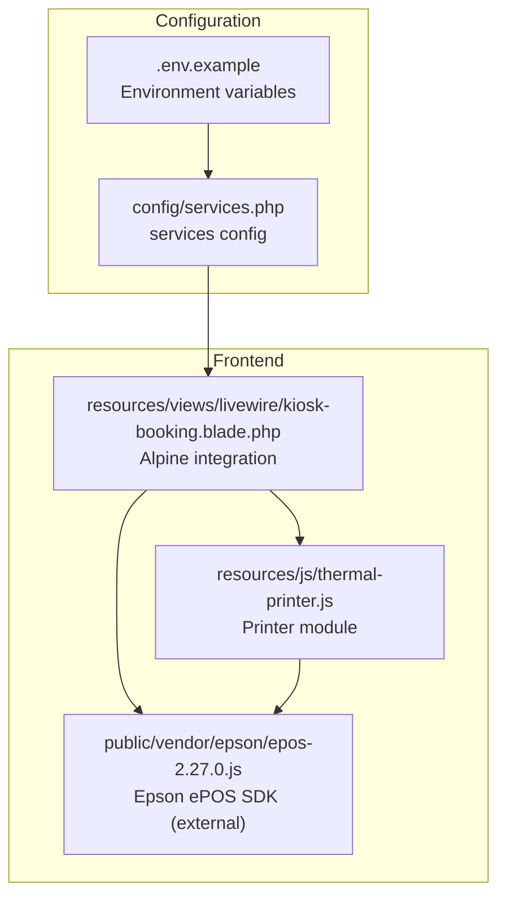
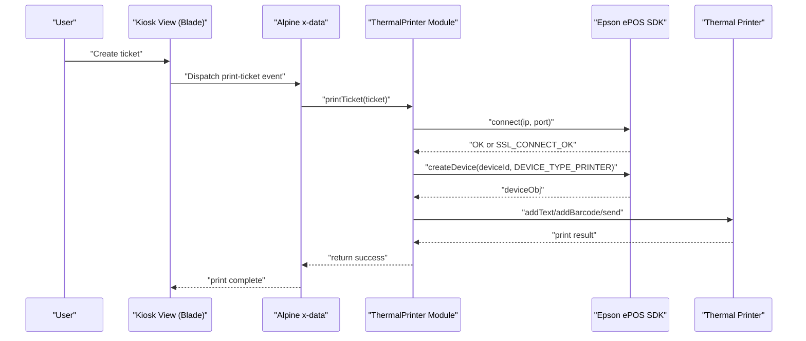
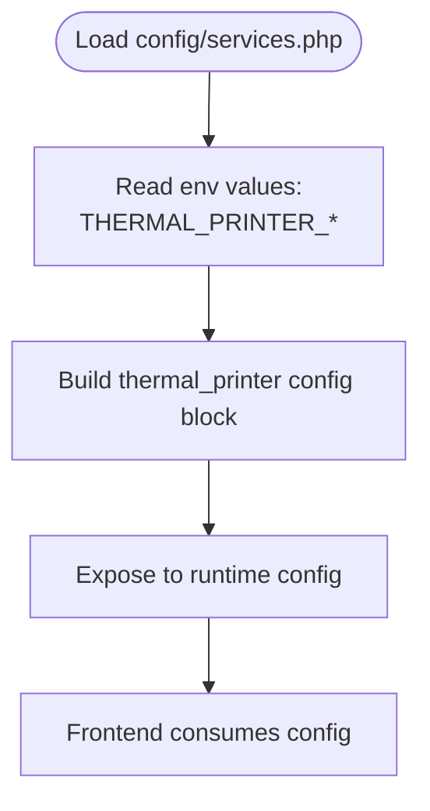
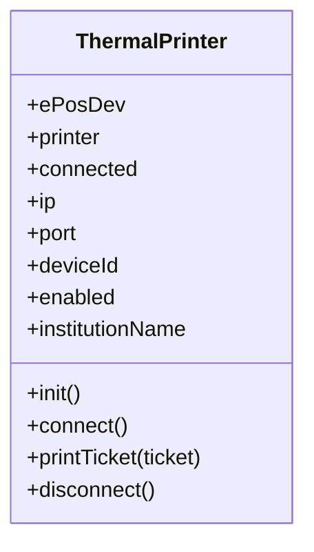
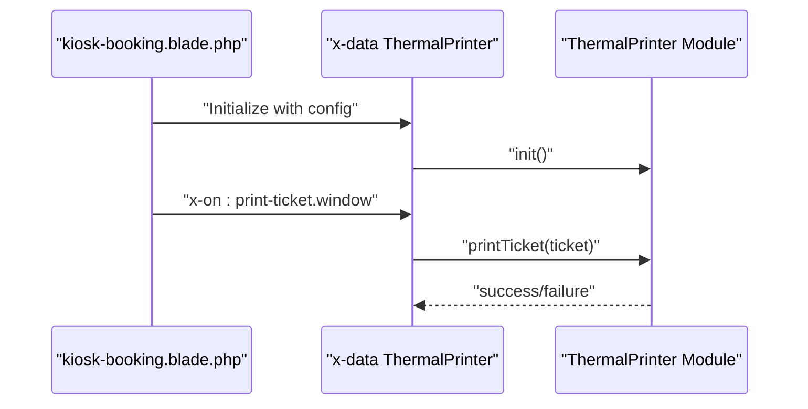
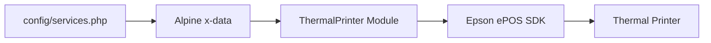

# Printer Configuration

<cite>
**Referenced Files in This Document**
- [thermal-printer.js](file://resources/js/thermal-printer.js)
- [services.php](file://config/services.php)
- [.env.example](file://.env.example)
- [kiosk-booking.blade.php](file://resources/views/livewire/kiosk-booking.blade.php)
- [2026-03-13-kiosk-reprint-thermal-printer.md](file://docs/plans/2026-03-13-kiosk-reprint-thermal-printer.md)
- [legacy.blade.php](file://resources/views/pages/kiosk/legacy.blade.php)
</cite>

## Table of Contents
1. [Introduction](#introduction)
2. [Project Structure](#project-structure)
3. [Core Components](#core-components)
4. [Architecture Overview](#architecture-overview)
5. [Detailed Component Analysis](#detailed-component-analysis)
6. [Dependency Analysis](#dependency-analysis)
7. [Performance Considerations](#performance-considerations)
8. [Troubleshooting Guide](#troubleshooting-guide)
9. [Conclusion](#conclusion)

## Introduction
This document explains the Thermal Printer Configuration and Settings for the Kiosk module. It covers environment variables, configuration loading, printer connection via Epson ePOS SDK, and the end-to-end printing flow for queue tickets. It also provides setup steps, troubleshooting guidance, and notes on printer capabilities exposed by the current implementation.

## Project Structure
The thermal printer feature spans configuration, client-side JavaScript, and Blade templates:
- Configuration is centralized in the services configuration array and environment variables.
- The client-side module encapsulates printer connection and ESC/POS printing.
- The Kiosk UI integrates the printer module and triggers prints automatically after ticket creation or on reprint actions.

**Diagram sources**
- [services.php:38-43](file://config/services.php#L38-L43)
- [.env.example:80-84](file://.env.example#L80-L84)
- [kiosk-booking.blade.php:1-11](file://resources/views/livewire/kiosk-booking.blade.php#L1-L11)
- [thermal-printer.js:5-46](file://resources/js/thermal-printer.js#L5-L46)

**Section sources**
- [services.php:38-43](file://config/services.php#L38-L43)
- [.env.example:80-84](file://.env.example#L80-L84)
- [kiosk-booking.blade.php:1-11](file://resources/views/livewire/kiosk-booking.blade.php#L1-L11)
- [thermal-printer.js:5-46](file://resources/js/thermal-printer.js#L5-L46)

## Core Components
- Environment variables define printer behavior and connection parameters.
- The services configuration reads environment values and exposes them to the application.
- The Alpine-based JavaScript module initializes the printer, connects to the device, and sends ESC/POS commands.
- The Kiosk view wires the printer module and dispatches print events for new tickets and reprint actions.

Key configuration keys:
- THERMAL_PRINTER_ENABLED: Enables or disables the thermal printer feature.
- THERMAL_PRINTER_IP: Target IP address of the Epson printer.
- THERMAL_PRINTER_PORT: TCP port used by the Epson ePOS device (default 8043).
- THERMAL_PRINTER_DEVICE_ID: Device ID passed to the ePOS SDK when creating the device handle.

Printer behavior controlled by the module:
- Connection uses the Epson ePOSDevice and supports OK or SSL_CONNECT_OK statuses.
- ESC/POS printing uses fixed 80mm formatting and standard ticket layout.
- Text smoothing is enabled; no explicit print quality or paper size controls are exposed in the current implementation.

**Section sources**
- [.env.example:80-84](file://.env.example#L80-L84)
- [services.php:38-43](file://config/services.php#L38-L43)
- [thermal-printer.js:16-46](file://resources/js/thermal-printer.js#L16-L46)
- [thermal-printer.js:129-203](file://resources/js/thermal-printer.js#L129-L203)
- [kiosk-booking.blade.php:1-11](file://resources/views/livewire/kiosk-booking.blade.php#L1-L11)

## Architecture Overview
The thermal printer feature is a client-side integration that relies on the Epson ePOS SDK loaded via a script tag. The Alpine component initializes the printer module with configuration from the services config, listens for print events, and executes ESC/POS commands.

**Diagram sources**
- [kiosk-booking.blade.php:1-11](file://resources/views/livewire/kiosk-booking.blade.php#L1-L11)
- [thermal-printer.js:16-46](file://resources/js/thermal-printer.js#L16-L46)
- [thermal-printer.js:129-203](file://resources/js/thermal-printer.js#L129-L203)

## Detailed Component Analysis

### Configuration Loading and Environment Variables
- THERMAL_PRINTER_ENABLED toggles the feature on or off.
- THERMAL_PRINTER_IP and THERMAL_PRINTER_PORT define the endpoint for the Epson ePOS device.
- THERMAL_PRINTER_DEVICE_ID is passed to the ePOS SDK when creating the device handle.
- The services configuration reads these values from environment variables and exposes them to the application.

**Diagram sources**
- [services.php:38-43](file://config/services.php#L38-L43)
- [.env.example:80-84](file://.env.example#L80-L84)

**Section sources**
- [services.php:38-43](file://config/services.php#L38-L43)
- [.env.example:80-84](file://.env.example#L80-L84)

### ThermalPrinter JavaScript Module
Responsibilities:
- Initialize with configuration (enabled, ip, port, deviceId, institutionName).
- Establish connection to the Epson ePOS device.
- Send ESC/POS commands to print a formatted ticket.
- Disconnect cleanly when needed.

Key behaviors:
- Connection checks for OK or SSL_CONNECT_OK and proceeds to create the device handle.
- Uses fixed 80mm ticket formatting and standard ESC/POS commands.
- No explicit print quality, paper size, or thermal sensitivity controls are present in the current implementation.

**Diagram sources**
- [thermal-printer.js:5-138](file://resources/js/thermal-printer.js#L5-L138)

**Section sources**
- [thermal-printer.js:5-138](file://resources/js/thermal-printer.js#L5-L138)

### Kiosk View Integration
- The Alpine x-data component is initialized with configuration from the services config.
- Listens for a window event to trigger printing.
- Automatically dispatches a print event when a new ticket is created.

**Diagram sources**
- [kiosk-booking.blade.php:1-11](file://resources/views/livewire/kiosk-booking.blade.php#L1-L11)
- [thermal-printer.js:16-46](file://resources/js/thermal-printer.js#L16-L46)

**Section sources**
- [kiosk-booking.blade.php:1-11](file://resources/views/livewire/kiosk-booking.blade.php#L1-L11)

### Legacy Printer Integration (Reference)
A legacy Kiosk page demonstrates an older integration pattern with similar configuration keys and connection logic. While not actively used, it confirms the expected behavior and configuration keys.

**Section sources**
- [legacy.blade.php:856-860](file://resources/views/pages/kiosk/legacy.blade.php#L856-L860)
- [legacy.blade.php:1014-1034](file://resources/views/pages/kiosk/legacy.blade.php#L1014-L1034)

## Dependency Analysis
- The Alpine component depends on the services configuration for runtime values.
- The module depends on the Epson ePOS SDK being loaded via a script tag.
- The printing flow depends on the printer being reachable at the configured IP/port and accepting connections.

**Diagram sources**
- [services.php:38-43](file://config/services.php#L38-L43)
- [kiosk-booking.blade.php:1-11](file://resources/views/livewire/kiosk-booking.blade.php#L1-L11)
- [thermal-printer.js:5-46](file://resources/js/thermal-printer.js#L5-L46)

**Section sources**
- [services.php:38-43](file://config/services.php#L38-L43)
- [kiosk-booking.blade.php:1-11](file://resources/views/livewire/kiosk-booking.blade.php#L1-L11)
- [thermal-printer.js:5-46](file://resources/js/thermal-printer.js#L5-L46)

## Performance Considerations
- The module performs synchronous ESC/POS operations and does not expose print quality or sensitivity controls. Expect standard 80mm ticket output as implemented.
- Network latency and printer response time depend on the configured IP/port and network conditions.
- The module does not implement retry logic or buffering; failures are logged and prints are aborted.

[No sources needed since this section provides general guidance]

## Troubleshooting Guide

Common issues and resolutions:
- Printer not connecting
  - Verify THERMAL_PRINTER_ENABLED is true and the Epson ePOS SDK is loaded.
  - Confirm THERMAL_PRINTER_IP and THERMAL_PRINTER_PORT match the printer’s network settings.
  - Check browser console for "[ThermalPrinter] Koneksi gagal" or "[ThermalPrinter] createDevice gagal" messages.
- SDK not loaded
  - Ensure the Epson ePOS SDK script is present at the expected path and loaded in the Kiosk layout.
- Prints do not start
  - Confirm the Alpine component is initialized with correct config values.
  - Verify the "print-ticket" event is dispatched with a valid ticket object.
- No visible print quality or sensitivity controls
  - The current implementation does not expose print quality or thermal sensitivity settings. Adjustments must be made at the printer hardware or driver level outside this module.

Setup steps summary:
- Configure environment variables:
  - THERMAL_PRINTER_ENABLED, THERMAL_PRINTER_IP, THERMAL_PRINTER_PORT, THERMAL_PRINTER_DEVICE_ID
- Ensure the Epson ePOS SDK is downloaded and placed under the public vendor path.
- Confirm the Kiosk layout conditionally loads the SDK and the printer module.
- Validate the printer is reachable on the specified IP/port and supports the ePOS protocol.

**Section sources**
- [.env.example:80-84](file://.env.example#L80-L84)
- [2026-03-13-kiosk-reprint-thermal-printer.md:56-70](file://docs/plans/2026-03-13-kiosk-reprint-thermal-printer.md#L56-L70)
- [kiosk-booking.blade.php:1-11](file://resources/views/livewire/kiosk-booking.blade.php#L1-L11)
- [thermal-printer.js:16-46](file://resources/js/thermal-printer.js#L16-L46)

## Conclusion
The thermal printer integration is a focused client-side feature that uses the Epson ePOS SDK to connect to a printer and send ESC/POS commands. Configuration is driven by environment variables and services configuration, while the Alpine module handles initialization, connection, and printing. The current implementation targets standard 80mm tickets and does not expose advanced print quality or sensitivity controls. Proper network configuration and SDK availability are essential for reliable operation.