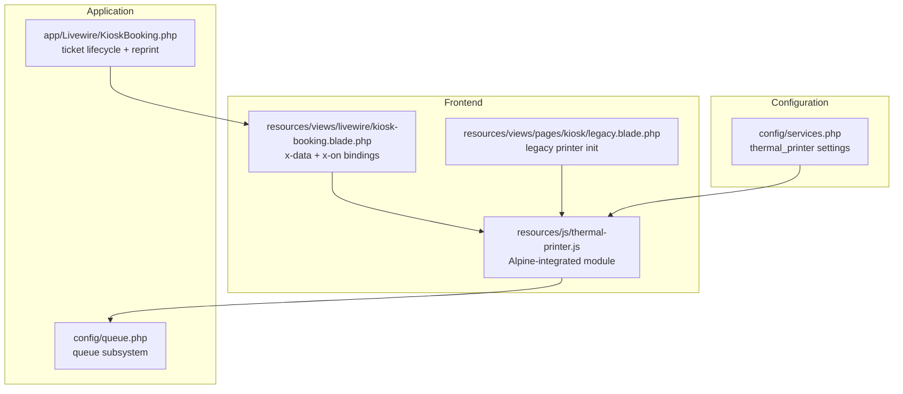
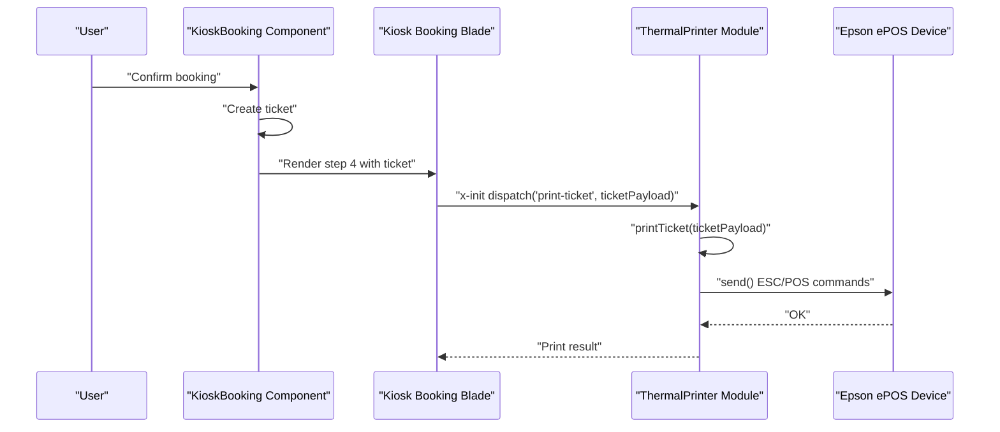
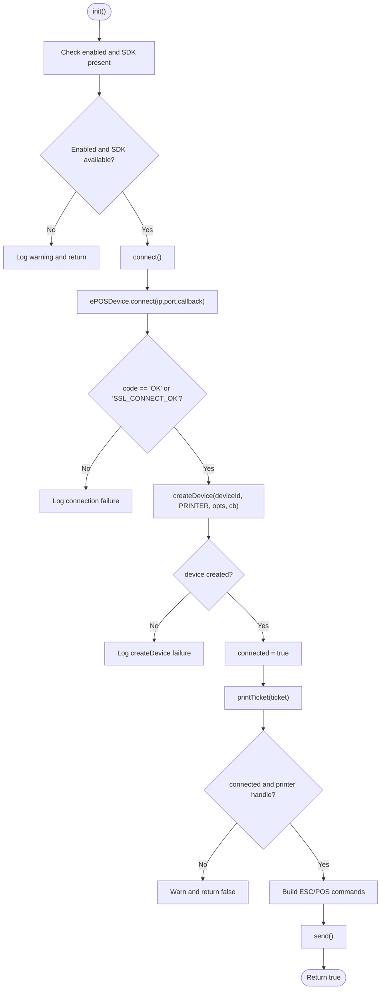
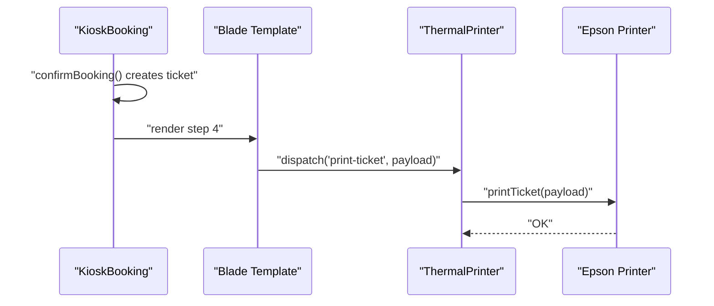
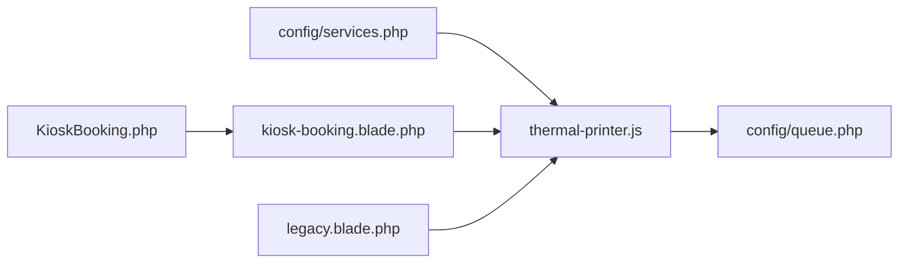

# Printer Service Architecture

<cite>
**Referenced Files in This Document**
- [thermal-printer.js](file://resources/js/thermal-printer.js)
- [2026-03-13-kiosk-reprint-thermal-printer.md](file://docs/plans/2026-03-13-kiosk-reprint-thermal-printer.md)
- [services.php](file://config/services.php)
- [kiosk.php](file://config/kiosk.php)
- [queue.php](file://config/queue.php)
- [KioskBooking.php](file://app/Livewire/KioskBooking.php)
- [kiosk-booking.blade.php](file://resources/views/livewire/kiosk-booking.blade.php)
- [legacy.blade.php](file://resources/views/pages/kiosk/legacy.blade.php)
</cite>

## Table of Contents
1. [Introduction](#introduction)
2. [Project Structure](#project-structure)
3. [Core Components](#core-components)
4. [Architecture Overview](#architecture-overview)
5. [Detailed Component Analysis](#detailed-component-analysis)
6. [Dependency Analysis](#dependency-analysis)
7. [Performance Considerations](#performance-considerations)
8. [Troubleshooting Guide](#troubleshooting-guide)
9. [Conclusion](#conclusion)

## Introduction
This document describes the Thermal Printer Service Architecture for the PTSP queue management system. It explains how the Epson TM-M30II thermal printer is integrated via the Epson ePOS SDK, how configuration is managed, how the service is wired into the Kiosk booking flow, and how the broader queue management system interacts with printing. It also documents connection management, error handling, and operational considerations for reliable printing.

## Project Structure
The thermal printer integration spans three primary areas:
- Configuration: Centralized in the services configuration for printer settings.
- Frontend module: A JavaScript module that wraps the Epson ePOS SDK for direct ESC/POS communication.
- UI integration: Livewire components and Blade templates that trigger printing events and initialize the printer module.

**Diagram sources**
- [services.php:38-43](file://config/services.php#L38-L43)
- [thermal-printer.js:5-138](file://resources/js/thermal-printer.js#L5-L138)
- [kiosk-booking.blade.php:1-11](file://resources/views/livewire/kiosk-booking.blade.php#L1-L11)
- [legacy.blade.php:845-1032](file://resources/views/pages/kiosk/legacy.blade.php#L845-L1032)
- [KioskBooking.php:155-180](file://app/Livewire/KioskBooking.php#L155-L180)
- [queue.php:16-92](file://config/queue.php#L16-L92)

**Section sources**
- [services.php:38-43](file://config/services.php#L38-L43)
- [thermal-printer.js:5-138](file://resources/js/thermal-printer.js#L5-L138)
- [kiosk-booking.blade.php:1-11](file://resources/views/livewire/kiosk-booking.blade.php#L1-L11)
- [legacy.blade.php:845-1032](file://resources/views/pages/kiosk/legacy.blade.php#L845-L1032)
- [KioskBooking.php:155-180](file://app/Livewire/KioskBooking.php#L155-L180)
- [queue.php:16-92](file://config/queue.php#L16-L92)

## Core Components
- Thermal printer configuration: Managed under the services configuration with keys for enabling the printer, IP address, port, and device ID.
- JavaScript module: Provides initialization, connection, printing, and disconnection routines using the Epson ePOS SDK.
- Livewire integration: The KioskBooking component orchestrates ticket creation and triggers printing via Alpine event dispatch.
- Blade wiring: The Kiosk view initializes the printer module and listens for print events.

Key implementation references:
- Configuration block for thermal printer settings.
- JavaScript module exposing init/connect/printTicket/disconnect.
- Livewire component handling ticket creation and reprint search.
- Blade template wiring Alpine x-data and x-on event listeners.

**Section sources**
- [services.php:38-43](file://config/services.php#L38-L43)
- [thermal-printer.js:5-138](file://resources/js/thermal-printer.js#L5-L138)
- [KioskBooking.php:155-180](file://app/Livewire/KioskBooking.php#L155-L180)
- [kiosk-booking.blade.php:1-11](file://resources/views/livewire/kiosk-booking.blade.php#L1-L11)

## Architecture Overview
The thermal printing architecture follows a client-side event-driven pattern:
- Configuration drives whether the printer is enabled and how to connect.
- The Alpine-based JavaScript module connects to the printer endpoint and maintains a printer handle.
- The Kiosk view dispatches a print event after a ticket is created or when the user requests a reprint.
- The module receives the event and prints the ticket payload using ESC/POS commands.

**Diagram sources**
- [KioskBooking.php:155-180](file://app/Livewire/KioskBooking.php#L155-L180)
- [kiosk-booking.blade.php:476-487](file://resources/views/livewire/kiosk-booking.blade.php#L476-L487)
- [thermal-printer.js:129-203](file://resources/js/thermal-printer.js#L129-L203)

## Detailed Component Analysis

### Thermal Printer Configuration and Registration
- The thermal printer is configured under the services configuration with:
  - enabled flag (boolean)
  - ip address (string)
  - port (integer)
  - device_id (string)
- These values are consumed by the frontend module and Blade templates to initialize the printer.

Operational notes:
- The configuration is environment-aware and defaults are provided.
- The module checks the enabled flag and SDK availability before attempting to connect.

**Section sources**
- [services.php:38-43](file://config/services.php#L38-L43)
- [thermal-printer.js:16-22](file://resources/js/thermal-printer.js#L16-L22)

### JavaScript Module: ThermalPrinter
Responsibilities:
- Initialization: Validates configuration and SDK presence.
- Connection: Establishes a WebSocket connection to the printer endpoint and creates a printer device handle.
- Printing: Formats ticket data into ESC/POS commands and sends them to the printer.
- Disconnection: Safely disconnects the device handle.

Key behaviors:
- Uses ePOSDevice.connect with IP/port and handles OK/SSL_CONNECT_OK responses.
- Creates a printer device with crypto and buffer disabled.
- Sends ESC/POS commands including text alignment, sizes, barcode, and cut command.
- Returns early with warnings if not connected or printer handle is missing.

**Diagram sources**
- [thermal-printer.js:16-45](file://resources/js/thermal-printer.js#L16-L45)
- [thermal-printer.js:129-203](file://resources/js/thermal-printer.js#L129-L203)

**Section sources**
- [thermal-printer.js:5-138](file://resources/js/thermal-printer.js#L5-L138)

### Livewire Integration: KioskBooking Component
Responsibilities:
- Orchestrates the ticket creation process and transitions to step 4 upon completion.
- Emits a print event during step 4 with ticket details.
- Supports reprint mode: search by visitor identifier or phone for today’s active tickets.

Key behaviors:
- After confirming booking, the component sets step to 4 and prepares barcode SVG.
- The Blade template dispatches a window-level event with ticket payload.
- Reprint mode exposes search and display of tickets for today with barcode generation.

**Diagram sources**
- [KioskBooking.php:155-180](file://app/Livewire/KioskBooking.php#L155-L180)
- [kiosk-booking.blade.php:476-487](file://resources/views/livewire/kiosk-booking.blade.php#L476-L487)
- [thermal-printer.js:129-203](file://resources/js/thermal-printer.js#L129-L203)

**Section sources**
- [KioskBooking.php:155-180](file://app/Livewire/KioskBooking.php#L155-L180)
- [kiosk-booking.blade.php:476-487](file://resources/views/livewire/kiosk-booking.blade.php#L476-L487)

### Blade Integration: Alpine and Event Wiring
Responsibilities:
- Initializes the ThermalPrinter module with configuration from services.
- Listens for the print event and invokes the module’s print function.
- Dispatches the print event automatically when a new ticket is created.

Key behaviors:
- x-data initializes the module with enabled/ip/port/deviceId/institutionName.
- x-on:print-ticket.window binds to the event and calls printTicket.
- x-init dispatches the event with current ticket data in step 4.

**Section sources**
- [kiosk-booking.blade.php:1-11](file://resources/views/livewire/kiosk-booking.blade.php#L1-L11)
- [kiosk-booking.blade.php:476-487](file://resources/views/livewire/kiosk-booking.blade.php#L476-L487)

### Legacy Integration (Fallback)
The legacy Kiosk page includes a similar printer initialization routine for backward compatibility, connecting to a different port and handling the same event-driven printing pattern.

**Section sources**
- [legacy.blade.php:845-1032](file://resources/views/pages/kiosk/legacy.blade.php#L845-L1032)

## Dependency Analysis
The thermal printing system depends on:
- Configuration values from services.php.
- Frontend SDK availability (loaded via script tag).
- Alpine.js for event handling and component initialization.
- The queue subsystem for job execution (when using queued printing).

**Diagram sources**
- [services.php:38-43](file://config/services.php#L38-L43)
- [thermal-printer.js:5-138](file://resources/js/thermal-printer.js#L5-L138)
- [kiosk-booking.blade.php:1-11](file://resources/views/livewire/kiosk-booking.blade.php#L1-L11)
- [legacy.blade.php:845-1032](file://resources/views/pages/kiosk/legacy.blade.php#L845-L1032)
- [queue.php:16-92](file://config/queue.php#L16-L92)
- [KioskBooking.php:155-180](file://app/Livewire/KioskBooking.php#L155-L180)

**Section sources**
- [services.php:38-43](file://config/services.php#L38-L43)
- [thermal-printer.js:5-138](file://resources/js/thermal-printer.js#L5-L138)
- [kiosk-booking.blade.php:1-11](file://resources/views/livewire/kiosk-booking.blade.php#L1-L11)
- [legacy.blade.php:845-1032](file://resources/views/pages/kiosk/legacy.blade.php#L845-L1032)
- [queue.php:16-92](file://config/queue.php#L16-L92)
- [KioskBooking.php:155-180](file://app/Livewire/KioskBooking.php#L155-L180)

## Performance Considerations
- Connection reuse: The module maintains a single printer handle after successful connection; avoid reconnecting unnecessarily.
- Event-driven printing: Printing occurs on user actions or automatic dispatch, minimizing background overhead.
- ESC/POS command batching: The module sends a single send() call per ticket; keep payloads minimal to reduce transmission time.
- Queue-backed printing: If moving to queued printing, tune retry_after and queue priorities to balance responsiveness and throughput.

[No sources needed since this section provides general guidance]

## Troubleshooting Guide
Common issues and resolutions:
- Printer not enabled or SDK not loaded:
  - Verify services configuration enabled flag and that the Epson SDK script is included in the Kiosk layout.
  - Check console warnings indicating printer inactive or SDK missing.
- Connection failures:
  - Confirm IP/port/device_id in configuration match the printer endpoint.
  - Review ePOSDevice connect callback responses for OK or SSL_CONNECT_OK.
- Printing fails silently:
  - Ensure the module is connected and has a valid printer handle before sending ESC/POS commands.
  - Validate that the event is dispatched with the correct payload in the Blade template.
- Legacy fallback:
  - If using the legacy page, ensure the alternate port and device ID are configured and the initialization routine runs.

Operational checks:
- Browser console should log successful connection when the printer is reachable.
- Ticket creation should trigger the print event automatically in step 4.

**Section sources**
- [services.php:38-43](file://config/services.php#L38-L43)
- [thermal-printer.js:16-45](file://resources/js/thermal-printer.js#L16-L45)
- [thermal-printer.js:129-203](file://resources/js/thermal-printer.js#L129-L203)
- [kiosk-booking.blade.php:476-487](file://resources/views/livewire/kiosk-booking.blade.php#L476-L487)
- [legacy.blade.php:845-1032](file://resources/views/pages/kiosk/legacy.blade.php#L845-L1032)

## Conclusion
The thermal printer service is implemented as a lightweight, configuration-driven client-side module that integrates seamlessly with the Kiosk booking flow. It uses the Epson ePOS SDK to establish a direct connection and send ESC/POS commands, triggered by Alpine events from the Blade templates. The design emphasizes simplicity, reliability, and easy configuration while maintaining separation of concerns between UI, configuration, and printing logic.