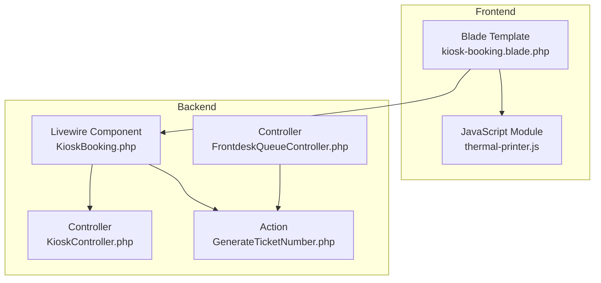
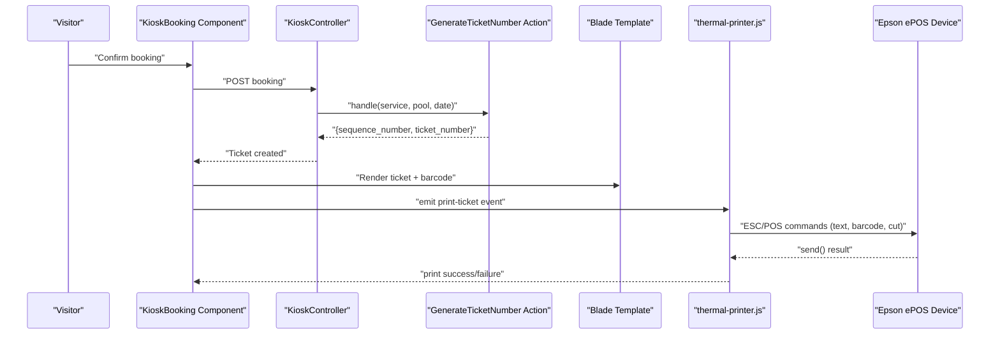
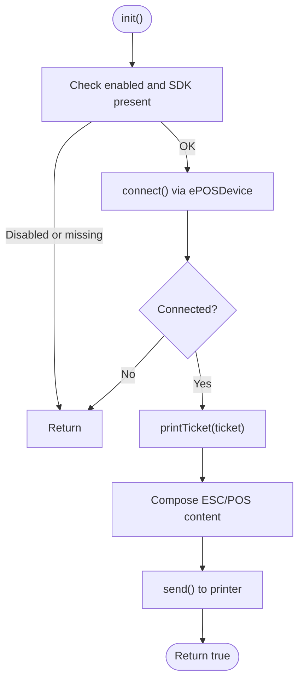
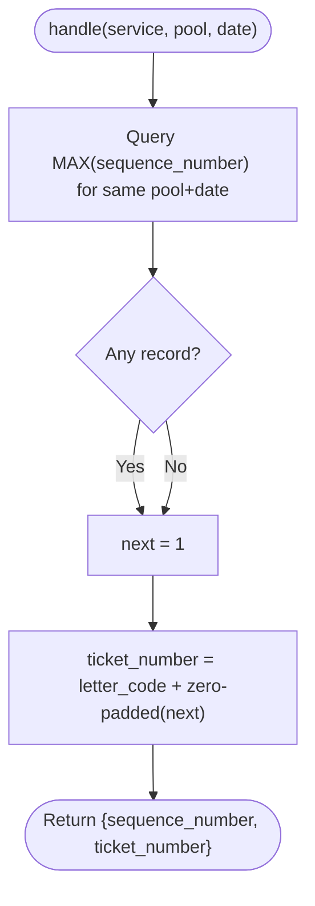
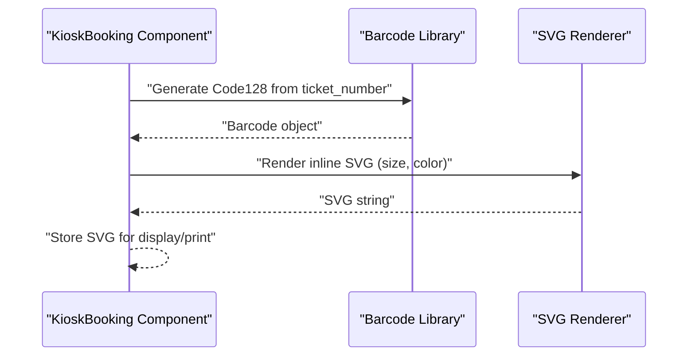
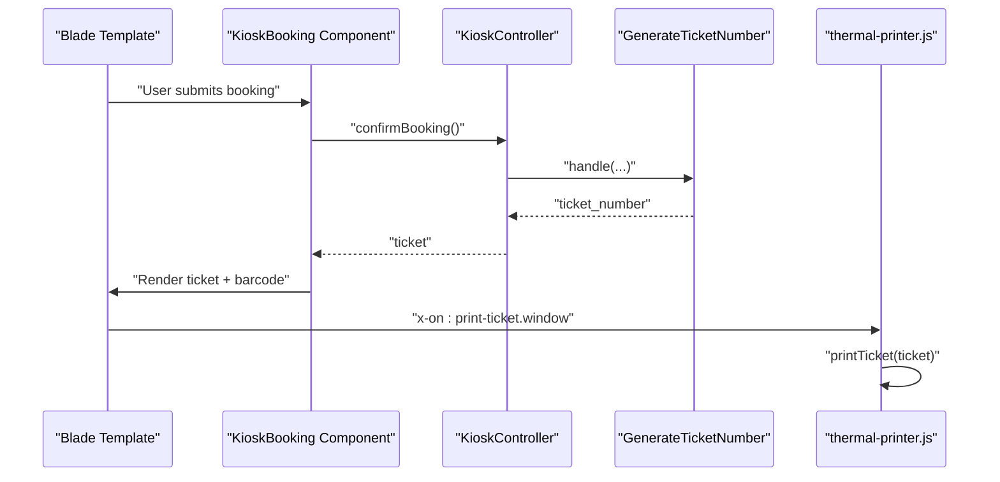
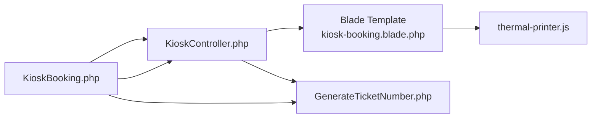

# Thermal Printer Integration

<cite>
**Referenced Files in This Document**
- [thermal-printer.js](file://resources/js/thermal-printer.js)
- [GenerateTicketNumber.php](file://app/Actions/Queue/GenerateTicketNumber.php)
- [KioskBooking.php](file://app/Livewire/KioskBooking.php)
- [KioskController.php](file://app/Http/Controllers/KioskController.php)
- [FrontdeskQueueController.php](file://app/Http/Controllers/FrontdeskQueueController.php)
- [kiosk.php](file://config/kiosk.php)
- [kiosk-booking.blade.php](file://resources/views/livewire/kiosk-booking.blade.php)
- [2026-03-13-kiosk-reprint-thermal-printer.md](file://docs/plans/2026-03-13-kiosk-reprint-thermal-printer.md)
- [AdminOverhaulIntegrationTest.php](file://tests/Feature/Integration/AdminOverhaulIntegrationTest.php)
</cite>

## Table of Contents
1. [Introduction](#introduction)
2. [Project Structure](#project-structure)
3. [Core Components](#core-components)
4. [Architecture Overview](#architecture-overview)
5. [Detailed Component Analysis](#detailed-component-analysis)
6. [Dependency Analysis](#dependency-analysis)
7. [Performance Considerations](#performance-considerations)
8. [Troubleshooting Guide](#troubleshooting-guide)
9. [Conclusion](#conclusion)

## Introduction
This document explains the Thermal Printer Integration system used to generate and print queue tickets on receipt printers. It covers the printer service architecture, the ticket numbering algorithm, barcode generation, print job lifecycle, integration with kiosk and frontdesk workflows, configuration options, and troubleshooting guidance.

## Project Structure
The thermal printer integration spans frontend JavaScript, backend PHP actions/controllers, and Blade templates. Key areas:
- Frontend printer module: resources/js/thermal-printer.js
- Ticket creation and numbering: app/Actions/Queue/GenerateTicketNumber.php
- Kiosk booking flow: app/Livewire/KioskBooking.php and app/Http/Controllers/KioskController.php
- Frontdesk operations: app/Http/Controllers/FrontdeskQueueController.php
- Configuration: config/kiosk.php and services configuration in Blade
- Documentation and tests: docs/plans/2026-03-13-kiosk-reprint-thermal-printer.md and tests/Feature/Integration/AdminOverhaulIntegrationTest.php

**Diagram sources**
- [kiosk-booking.blade.php:1-13](file://resources/views/livewire/kiosk-booking.blade.php#L1-L13)
- [thermal-printer.js:1-139](file://resources/js/thermal-printer.js#L1-L139)
- [KioskBooking.php:155-180](file://app/Livewire/KioskBooking.php#L155-L180)
- [KioskController.php:114-142](file://app/Http/Controllers/KioskController.php#L114-L142)
- [FrontdeskQueueController.php:44-64](file://app/Http/Controllers/FrontdeskQueueController.php#L44-L64)
- [GenerateTicketNumber.php:10-30](file://app/Actions/Queue/GenerateTicketNumber.php#L10-L30)

**Section sources**
- [kiosk-booking.blade.php:1-13](file://resources/views/livewire/kiosk-booking.blade.php#L1-L13)
- [thermal-printer.js:1-139](file://resources/js/thermal-printer.js#L1-L139)
- [KioskBooking.php:155-180](file://app/Livewire/KioskBooking.php#L155-L180)
- [KioskController.php:114-142](file://app/Http/Controllers/KioskController.php#L114-L142)
- [FrontdeskQueueController.php:44-64](file://app/Http/Controllers/FrontdeskQueueController.php#L44-L64)
- [GenerateTicketNumber.php:10-30](file://app/Actions/Queue/GenerateTicketNumber.php#L10-L30)

## Core Components
- Thermal printer JavaScript module: Establishes connection via Epson ePOS SDK, composes ESC/POS ticket content, prints, and cuts the paper.
- Ticket numbering action: Generates the next sequential ticket number per service and date, prefixed by the service letter code.
- Kiosk booking component: Orchestrates the booking flow, triggers printing, and supports reprint search.
- Controllers: Provide legacy and modern endpoints for kiosk and frontdesk workflows.
- Configuration: Kiosk passwords and session lifetimes; printer settings passed to the frontend module.

**Section sources**
- [thermal-printer.js:5-139](file://resources/js/thermal-printer.js#L5-L139)
- [GenerateTicketNumber.php:10-30](file://app/Actions/Queue/GenerateTicketNumber.php#L10-L30)
- [KioskBooking.php:155-180](file://app/Livewire/KioskBooking.php#L155-L180)
- [KioskController.php:114-142](file://app/Http/Controllers/KioskController.php#L114-L142)
- [FrontdeskQueueController.php:44-64](file://app/Http/Controllers/FrontdeskQueueController.php#L44-L64)
- [kiosk.php:1-8](file://config/kiosk.php#L1-L8)

## Architecture Overview
The system integrates the kiosk booking flow with the thermal printer. After a visitor confirms a booking, the system generates a ticket number, renders a barcode, and emits a DOM event to trigger the printer module to send ESC/POS commands to the networked printer.

**Diagram sources**
- [KioskBooking.php:155-180](file://app/Livewire/KioskBooking.php#L155-L180)
- [KioskController.php:114-142](file://app/Http/Controllers/KioskController.php#L114-L142)
- [GenerateTicketNumber.php:15-29](file://app/Actions/Queue/GenerateTicketNumber.php#L15-L29)
- [kiosk-booking.blade.php:1-13](file://resources/views/livewire/kiosk-booking.blade.php#L1-L13)
- [thermal-printer.js:54-128](file://resources/js/thermal-printer.js#L54-L128)

## Detailed Component Analysis

### Thermal Printer JavaScript Module
Responsibilities:
- Initialize and connect to the Epson ePOS device using IP/port and device ID.
- Compose ticket content using ESC/POS commands: header, large ticket number, details, Code128 barcode, instructions, timestamp, and paper cut.
- Send the command buffer to the printer and return success status.

Key behaviors:
- Guard against disconnected state before printing.
- Use fixed-width layout suitable for 80mm receipts.
- Emit a DOM event to trigger printing from the Blade template.

**Diagram sources**
- [thermal-printer.js:16-128](file://resources/js/thermal-printer.js#L16-L128)

**Section sources**
- [thermal-printer.js:5-139](file://resources/js/thermal-printer.js#L5-L139)

### Ticket Numbering Algorithm
Responsibilities:
- Compute the next sequence number for a given service and date.
- Prefix the sequence with the service’s letter code to form the ticket number.

Processing logic:
- Query the maximum sequence number for the same queue pool and service date.
- Increment by one and format as a zero-padded 4-digit number.
- Return both sequence and formatted ticket number.

**Diagram sources**
- [GenerateTicketNumber.php:15-29](file://app/Actions/Queue/GenerateTicketNumber.php#L15-L29)

**Section sources**
- [GenerateTicketNumber.php:10-30](file://app/Actions/Queue/GenerateTicketNumber.php#L10-L30)

### Barcode Generation for Printed Tickets
Responsibilities:
- Generate a Code128 barcode image for the ticket number.
- Render inline SVG for display and reuse during reprint scenarios.

Implementation details:
- Uses a barcode library to produce a Code128 barcode from the ticket number.
- Renders an inline SVG with specified dimensions and black color.

**Diagram sources**
- [KioskBooking.php:211-220](file://app/Livewire/KioskBooking.php#L211-L220)

**Section sources**
- [KioskBooking.php:211-220](file://app/Livewire/KioskBooking.php#L211-L220)

### Print Job Management and Retry Mechanisms
Current capabilities:
- The printer module checks connectivity before printing and logs warnings on failure.
- The print operation sends ESC/POS commands and returns a boolean result.
- No explicit retry loop is implemented in the provided code.

Recommendations:
- Implement a retry counter with exponential backoff when send() fails.
- Add a printer status polling mechanism to detect offline/cover-open/jam conditions.
- Persist print attempts and surface errors to the UI with actionable messages.

[No sources needed since this section provides general guidance]

### Printer Status Monitoring
Current capabilities:
- The module logs connection and device creation outcomes.
- No continuous status monitoring is implemented in the provided code.

Recommendations:
- Periodically poll device status via ePOS SDK methods.
- Surface status to the UI and disable print actions when printer is unavailable.
- Track last successful print timestamp for audit trails.

[No sources needed since this section provides general guidance]

### Integration with Kiosk Booking Workflow
Responsibilities:
- The kiosk booking component validates visitor data, creates a ticket via the controller, and prepares the UI for printing.
- The Blade template initializes the printer module and listens for the print event.
- The ticket number is used to generate a barcode and compose the ESC/POS content.

**Diagram sources**
- [kiosk-booking.blade.php:1-13](file://resources/views/livewire/kiosk-booking.blade.php#L1-L13)
- [KioskBooking.php:155-180](file://app/Livewire/KioskBooking.php#L155-L180)
- [KioskController.php:114-142](file://app/Http/Controllers/KioskController.php#L114-L142)
- [GenerateTicketNumber.php:15-29](file://app/Actions/Queue/GenerateTicketNumber.php#L15-L29)
- [thermal-printer.js:54-128](file://resources/js/thermal-printer.js#L54-L128)

**Section sources**
- [KioskBooking.php:155-180](file://app/Livewire/KioskBooking.php#L155-L180)
- [KioskController.php:114-142](file://app/Http/Controllers/KioskController.php#L114-L142)
- [kiosk-booking.blade.php:1-13](file://resources/views/livewire/kiosk-booking.blade.php#L1-L13)

### Integration with Frontdesk Operations
Responsibilities:
- Frontdesk creates tickets programmatically and can integrate similar printing logic if desired.
- The ticket numbering action is reusable across channels (e.g., walk-in kiosk vs. frontdesk).

**Section sources**
- [FrontdeskQueueController.php:44-64](file://app/Http/Controllers/FrontdeskQueueController.php#L44-L64)
- [GenerateTicketNumber.php:15-29](file://app/Actions/Queue/GenerateTicketNumber.php#L15-L29)

### Configuration Options
Printer settings:
- Enabled flag, IP address, port, device ID, and institution name are passed from Blade to the printer module.
- These values are typically sourced from application configuration.

Kiosk session and passwords:
- Kiosk and TV display passwords are configured via environment-backed config.
- Session lifetime is configurable.

**Section sources**
- [kiosk-booking.blade.php:2-8](file://resources/views/livewire/kiosk-booking.blade.php#L2-L8)
- [kiosk.php:1-8](file://config/kiosk.php#L1-L8)

## Dependency Analysis
The following diagram shows how components depend on each other in the printing pipeline.

**Diagram sources**
- [kiosk-booking.blade.php:1-13](file://resources/views/livewire/kiosk-booking.blade.php#L1-L13)
- [thermal-printer.js:1-139](file://resources/js/thermal-printer.js#L1-L139)
- [KioskBooking.php:155-180](file://app/Livewire/KioskBooking.php#L155-L180)
- [KioskController.php:114-142](file://app/Http/Controllers/KioskController.php#L114-L142)
- [GenerateTicketNumber.php:10-30](file://app/Actions/Queue/GenerateTicketNumber.php#L10-L30)

**Section sources**
- [KioskBooking.php:155-180](file://app/Livewire/KioskBooking.php#L155-L180)
- [KioskController.php:114-142](file://app/Http/Controllers/KioskController.php#L114-L142)
- [GenerateTicketNumber.php:10-30](file://app/Actions/Queue/GenerateTicketNumber.php#L10-L30)
- [kiosk-booking.blade.php:1-13](file://resources/views/livewire/kiosk-booking.blade.php#L1-L13)

## Performance Considerations
- Minimize DOM updates before printing to reduce layout thrash.
- Defer barcode generation until after ticket creation to avoid redundant work.
- Batch print operations if multiple tickets are generated in quick succession.
- Use lightweight SVG rendering for barcodes to keep payload small.

[No sources needed since this section provides general guidance]

## Troubleshooting Guide
Common issues and resolutions:
- Printer not connected or SDK not loaded:
  - Ensure the printer is reachable at the configured IP/port and device ID.
  - Confirm the Epson ePOS SDK is loaded in the browser.
  - Verify the enabled flag and configuration values in the Blade template.
- Printing fails silently:
  - Check browser console for connection/device creation errors.
  - Validate that the printer is online and not jammed.
- Ticket not printed after booking:
  - Confirm the print event is emitted and the printer module is initialized.
  - Review server-side ticket creation and that the ticket number is available.
- Reprint functionality:
  - Use the kiosk reprint mode to search by visitor identifier or phone for today’s tickets.
  - Ensure the ticket status allows reprinting (e.g., booked/waiting/called).

**Section sources**
- [thermal-printer.js:16-46](file://resources/js/thermal-printer.js#L16-L46)
- [2026-03-13-kiosk-reprint-thermal-printer.md:250-350](file://docs/plans/2026-03-13-kiosk-reprint-thermal-printer.md#L250-L350)
- [AdminOverhaulIntegrationTest.php:188-220](file://tests/Feature/Integration/AdminOverhaulIntegrationTest.php#L188-L220)

## Conclusion
The Thermal Printer Integration combines a robust frontend printer module with backend ticket generation and kiosk workflows. The system reliably prints tickets with barcodes and timestamps, and can be extended with retry logic, status monitoring, and enhanced error reporting to improve reliability and operability in production environments.