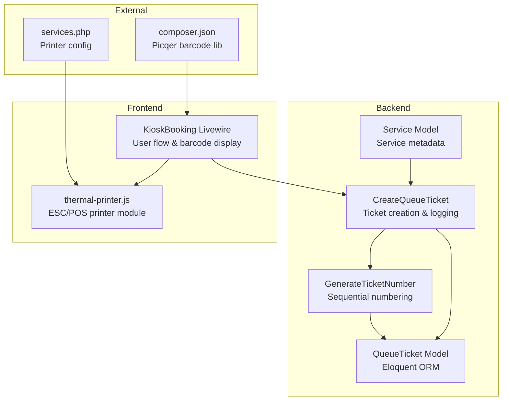
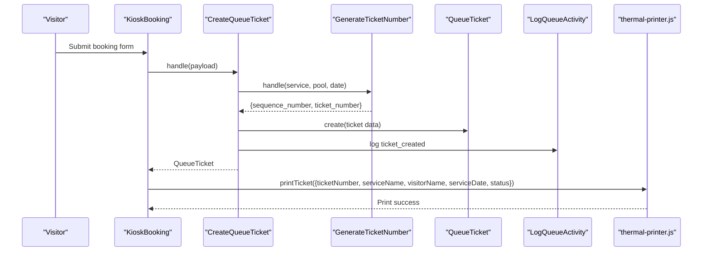
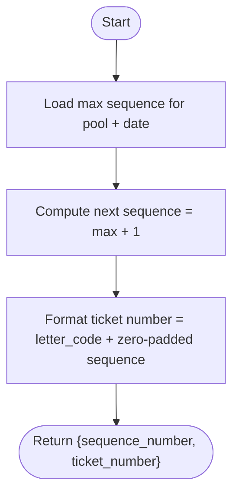
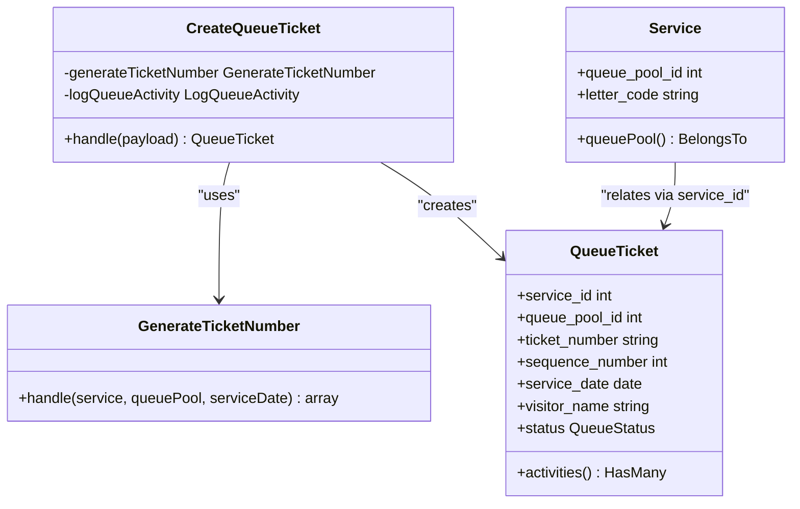
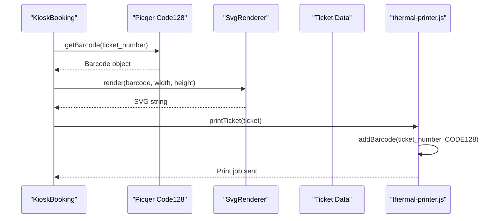
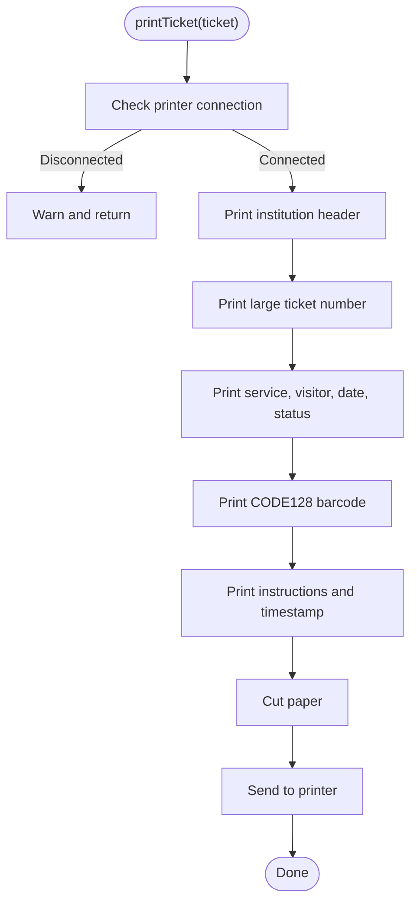
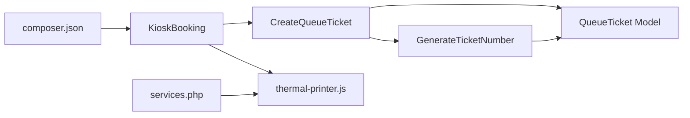

# Ticket Generation System

<cite>
**Referenced Files in This Document**
- [GenerateTicketNumber.php](file://app/Actions/Queue/GenerateTicketNumber.php)
- [CreateQueueTicket.php](file://app/Actions/Queue/CreateQueueTicket.php)
- [QueueTicket.php](file://app/Models/QueueTicket.php)
- [Service.php](file://app/Models/Service.php)
- [KioskBooking.php](file://app/Livewire/KioskBooking.php)
- [thermal-printer.js](file://resources/js/thermal-printer.js)
- [services.php](file://config/services.php)
- [composer.json](file://composer.json)
- [GenerateTicketNumberTest.php](file://tests/Unit/Queue/GenerateTicketNumberTest.php)
</cite>

## Table of Contents
1. [Introduction](#introduction)
2. [Project Structure](#project-structure)
3. [Core Components](#core-components)
4. [Architecture Overview](#architecture-overview)
5. [Detailed Component Analysis](#detailed-component-analysis)
6. [Dependency Analysis](#dependency-analysis)
7. [Performance Considerations](#performance-considerations)
8. [Troubleshooting Guide](#troubleshooting-guide)
9. [Conclusion](#conclusion)

## Introduction
This document describes the Ticket Generation System integrated with thermal printers for the PTSP queue management application. It explains how tickets are numbered sequentially by service and date, how barcodes are generated for QR and linear codes, how ticket templates are formatted for thermal printing, and how ticket data is serialized for printer output. It also provides examples of generated ticket formats and customization options for different printer capabilities.

## Project Structure
The ticket generation system spans backend PHP actions and models, frontend Livewire components, and a JavaScript module for thermal printer communication. The system integrates:
- Backend numbering and persistence
- Frontend barcode generation for display
- Thermal printer integration via ESC/POS commands
- Configuration for printer connectivity

**Diagram sources**
- [GenerateTicketNumber.php:1-31](file://app/Actions/Queue/GenerateTicketNumber.php#L1-L31)
- [CreateQueueTicket.php:1-91](file://app/Actions/Queue/CreateQueueTicket.php#L1-L91)
- [QueueTicket.php:1-121](file://app/Models/QueueTicket.php#L1-L121)
- [Service.php:1-101](file://app/Models/Service.php#L1-L101)
- [KioskBooking.php:1-288](file://app/Livewire/KioskBooking.php#L1-L288)
- [thermal-printer.js:1-139](file://resources/js/thermal-printer.js#L1-L139)
- [services.php:38-43](file://config/services.php#L38-L43)
- [composer.json:22-22](file://composer.json#L22-L22)

**Section sources**
- [GenerateTicketNumber.php:1-31](file://app/Actions/Queue/GenerateTicketNumber.php#L1-L31)
- [CreateQueueTicket.php:1-91](file://app/Actions/Queue/CreateQueueTicket.php#L1-L91)
- [QueueTicket.php:1-121](file://app/Models/QueueTicket.php#L1-L121)
- [Service.php:1-101](file://app/Models/Service.php#L1-L101)
- [KioskBooking.php:1-288](file://app/Livewire/KioskBooking.php#L1-L288)
- [thermal-printer.js:1-139](file://resources/js/thermal-printer.js#L1-L139)
- [services.php:38-43](file://config/services.php#L38-L43)
- [composer.json:22-22](file://composer.json#L22-L22)

## Core Components
- Ticket Numbering Algorithm: Generates sequential numbers per service and per calendar day, prefixed by a service letter code.
- Ticket Creation Action: Creates tickets with channel-derived statuses, persists data, and logs activity.
- Eloquent Model: Provides typed attributes, relationships, queue position calculation, and query scopes.
- Livewire Component: Orchestrates the kiosk booking flow, generates barcode SVGs for display, and triggers printing.
- Thermal Printer Module: Sends ESC/POS commands to an Epson ePOS-compatible printer over network.
- Configuration: Centralized settings for enabling and connecting to the thermal printer.

**Section sources**
- [GenerateTicketNumber.php:15-29](file://app/Actions/Queue/GenerateTicketNumber.php#L15-L29)
- [CreateQueueTicket.php:34-89](file://app/Actions/Queue/CreateQueueTicket.php#L34-L89)
- [QueueTicket.php:17-52](file://app/Models/QueueTicket.php#L17-L52)
- [KioskBooking.php:155-180](file://app/Livewire/KioskBooking.php#L155-L180)
- [thermal-printer.js:54-128](file://resources/js/thermal-printer.js#L54-L128)
- [services.php:38-43](file://config/services.php#L38-L43)

## Architecture Overview
The system follows a layered architecture:
- Presentation Layer: Livewire component handles user input and displays ticket information and barcode.
- Application Layer: Actions encapsulate business logic for ticket creation and numbering.
- Domain Layer: Eloquent models represent domain entities and provide query helpers.
- Infrastructure Layer: Thermal printer module communicates with the printer via ESC/POS commands; barcode generation uses the Picqer library.

**Diagram sources**
- [KioskBooking.php:155-180](file://app/Livewire/KioskBooking.php#L155-L180)
- [CreateQueueTicket.php:34-89](file://app/Actions/Queue/CreateQueueTicket.php#L34-L89)
- [GenerateTicketNumber.php:15-29](file://app/Actions/Queue/GenerateTicketNumber.php#L15-L29)
- [QueueTicket.php:17-38](file://app/Models/QueueTicket.php#L17-L38)
- [thermal-printer.js:54-128](file://resources/js/thermal-printer.js#L54-L128)

## Detailed Component Analysis

### Ticket Numbering Algorithm
The numbering algorithm ensures uniqueness and readability:
- Per-service, per-calendar-day sequence starts at 1.
- The ticket number is composed of a fixed-length service letter code followed by a zero-padded four-digit sequence.
- Resets when the date changes for the same service and pool.

**Diagram sources**
- [GenerateTicketNumber.php:17-23](file://app/Actions/Queue/GenerateTicketNumber.php#L17-L23)

**Section sources**
- [GenerateTicketNumber.php:15-29](file://app/Actions/Queue/GenerateTicketNumber.php#L15-L29)
- [GenerateTicketNumberTest.php:9-78](file://tests/Unit/Queue/GenerateTicketNumberTest.php#L9-L78)

### Ticket Creation and Persistence
Ticket creation:
- Determines initial status based on the channel (online booking vs. walk-in kiosk).
- Persists visitor and service metadata along with the generated ticket number and sequence.
- Logs activity with contextual metadata.

**Diagram sources**
- [CreateQueueTicket.php:15-18](file://app/Actions/Queue/CreateQueueTicket.php#L15-L18)
- [GenerateTicketNumber.php:15-29](file://app/Actions/Queue/GenerateTicketNumber.php#L15-L29)
- [QueueTicket.php:17-38](file://app/Models/QueueTicket.php#L17-L38)
- [Service.php:17-29](file://app/Models/Service.php#L17-L29)

**Section sources**
- [CreateQueueTicket.php:34-89](file://app/Actions/Queue/CreateQueueTicket.php#L34-L89)
- [QueueTicket.php:79-94](file://app/Models/QueueTicket.php#L79-L94)
- [Service.php:43-46](file://app/Models/Service.php#L43-L46)

### Barcode Generation for Display and Printing
- Frontend barcode display: Uses the Picqer library to generate an inline SVG Code-128 barcode for the ticket number.
- Thermal printer barcode: ESC/POS CODE128 barcode is embedded directly into the printed output.

**Diagram sources**
- [KioskBooking.php:211-220](file://app/Livewire/KioskBooking.php#L211-L220)
- [composer.json:22-22](file://composer.json#L22-L22)
- [thermal-printer.js:102-109](file://resources/js/thermal-printer.js#L102-L109)

**Section sources**
- [KioskBooking.php:211-220](file://app/Livewire/KioskBooking.php#L211-L220)
- [composer.json:22-22](file://composer.json#L22-L22)
- [thermal-printer.js:102-109](file://resources/js/thermal-printer.js#L102-L109)

### Ticket Template Formatting for Thermal Printing
The thermal printer module formats the ticket using ESC/POS commands:
- Institution header and title centered.
- Large ticket number for visibility.
- Left-aligned details: service name, visitor name, service date, status.
- Centered barcode (CODE128).
- Instructions and timestamp footer.
- Paper cut command.

**Diagram sources**
- [thermal-printer.js:54-128](file://resources/js/thermal-printer.js#L54-L128)

**Section sources**
- [thermal-printer.js:54-128](file://resources/js/thermal-printer.js#L54-L128)

### Ticket Data Structure and Serialization for Printer Output
The ticket object passed to the printer contains:
- ticketNumber: The formatted ticket number (e.g., service letter code + sequence).
- serviceName: Human-readable service name.
- visitorName: Visitor’s name.
- serviceDate: Formatted date string for the service appointment.
- status: Current ticket status (e.g., waiting, called).

Printer serialization uses ESC/POS text and barcode commands to render the ticket layout.

**Section sources**
- [thermal-printer.js:127-128](file://resources/js/thermal-printer.js#L127-L128)
- [CreateQueueTicket.php:51-66](file://app/Actions/Queue/CreateQueueTicket.php#L51-L66)

### Examples of Generated Ticket Formats
Below are typical printed outputs produced by the thermal printer module. These reflect the ESC/POS formatting and data passed to the printer.

- Institution header and title centered.
- Large ticket number for visibility.
- Left-aligned details: service name, visitor name, service date, status.
- Centered CODE128 barcode.
- Instructions and timestamp footer.

Printer configuration and environment:
- Enabled via configuration flag.
- Network IP, port, and device ID configured centrally.

**Section sources**
- [thermal-printer.js:72-118](file://resources/js/thermal-printer.js#L72-L118)
- [services.php:38-43](file://config/services.php#L38-L43)

### Customization Options for Different Printer Capabilities
- Font sizes and alignment: Adjust via ESC/POS text size and alignment commands.
- Barcode type and placement: Modify barcode type and human-readable interpretation.
- Separator length: Adapt to printer width (currently fixed).
- Cut options: Choose between partial and full cuts.
- Environment configuration: Toggle printer enablement and adjust IP/port/device ID.

**Section sources**
- [thermal-printer.js:69-122](file://resources/js/thermal-printer.js#L69-L122)
- [services.php:38-43](file://config/services.php#L38-L43)

## Dependency Analysis
- Backend actions depend on Eloquent models and enums.
- Livewire component depends on the barcode library for SVG generation.
- Thermal printer module depends on the ePOS SDK and printer configuration.
- Tests validate the numbering algorithm and ticket creation flow.

**Diagram sources**
- [composer.json:22-22](file://composer.json#L22-L22)
- [KioskBooking.php:1-288](file://app/Livewire/KioskBooking.php#L1-L288)
- [CreateQueueTicket.php:1-91](file://app/Actions/Queue/CreateQueueTicket.php#L1-L91)
- [GenerateTicketNumber.php:1-31](file://app/Actions/Queue/GenerateTicketNumber.php#L1-L31)
- [QueueTicket.php:1-121](file://app/Models/QueueTicket.php#L1-L121)
- [thermal-printer.js:1-139](file://resources/js/thermal-printer.js#L1-L139)
- [services.php:38-43](file://config/services.php#L38-L43)

**Section sources**
- [composer.json:22-22](file://composer.json#L22-L22)
- [services.php:38-43](file://config/services.php#L38-L43)

## Performance Considerations
- Database queries: The numbering action performs a single max aggregation per day and pool; ensure appropriate indexing on queue_pool_id and service_date.
- Transaction usage: Ticket creation wraps writes in a transaction to maintain consistency.
- Barcode generation: SVG generation occurs server-side for display; printer barcode is rendered natively via ESC/POS.

[No sources needed since this section provides general guidance]

## Troubleshooting Guide
- Printer not connected: The module checks connection state and logs warnings when disconnected.
- SDK not loaded: Initialization skips if the ePOS SDK is unavailable.
- Missing configuration: Defaults are applied if environment variables are not set.
- Barcode mismatch: Verify the ticket number matches the barcode payload and printer barcode settings.

**Section sources**
- [thermal-printer.js:16-21](file://resources/js/thermal-printer.js#L16-L21)
- [thermal-printer.js:55-58](file://resources/js/thermal-printer.js#L55-L58)
- [services.php:38-43](file://config/services.php#L38-L43)

## Conclusion
The Ticket Generation System combines robust backend numbering and persistence with a streamlined frontend experience and reliable thermal printer integration. The system supports clear, scannable tickets with configurable printer behavior and centralized configuration for connectivity.